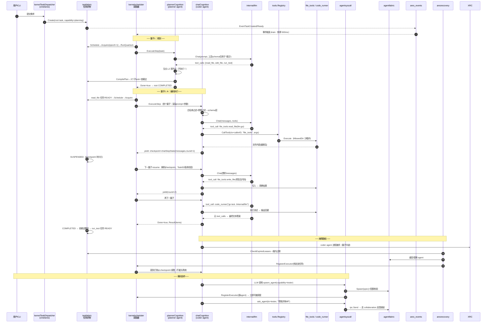

# ARES AgentOS 架构总文档（单一事实源）

> 本文档是收敛计划的**唯一执行依据**。结构：**第一部分 = 联合收敛计划（修订版 v2）**；**附录 A/B/C = 三份源文档**（逐字保留为证据）。
>
> **v2 修订说明（2026-09，修复 5 个阻塞级问题）**：①补 `ares_runtime.Manager` 去向；②改 Phase 4 验收（mock-db + 测试文件）；③arena/flight 不再归档到 examples（保留主线）；④时序按仓库真实进度重排（M2/M3/M5/M6 已落地）；⑤进化 v1/v2 修正为**分层**而非"重复/删 v1"（M6 fitness 长在 v1）。

---

# 第一部分　联合收敛计划（Agent OS）

## 〇、已核实事实（源码逐行比对 + 本次复核）

| 事实 | 证据 |
|---|---|
| 唯一的 `MutableDAG` 在 `internal/fabric/task/workflow/engine/mutable_dag.go`（全仓仅此处定义） | `rg "type MutableDAG struct"` 其他文件 0 命中 |
| `taskfabric/dag.go` 不是第二套图：只提供 `IsReady()`/`ReadyTasks()` 调度原语 | 源码已读 |
| `recovery.spawnAgent` ≠ `syscall.SpawnAgent`：前者 A1 注入 + `SpawnForRecovery`；后者 LLM-facing；汇到 `agentfabric.Spawn` | `recovery.go:124` / `syscall.go:250` |
| **生命周期三套**：`ares_runtime.Manager`（`RegisterAgent/StartAgent/StopAgent/RestoreAgent`，`manager.go:152/219/283/413`）+ `agentfabric.Fabric` + 遗留 leader 管线 | 源码已读 |
| **进化 v1/v2 是"分层"，不是"重复"**：`evolution/`=基因组/补丁引擎（作动 L1）；`ares_evolution/`=部署/闸门/fitness 运行时接线。**M6 长在 v1**（`fitness_aggregator.go` `WindowToolStep/WindowAt`） | 源码已读 |
| 记忆两套（有重叠、非全同物）：`ares_experience`=经验蒸馏；`ares_memory`=会话记忆+蒸馏管线 | 源码已读 |
| `examples/` 顶层 **34** 目录（含 README.md）；**被 `scripts/*.sh` 与 `.github/workflows/*` 引用** | `ls examples` / `rg` |
| `cmd/mock-db/main.go` 存在（另有 `package main`）→ Phase 4 验收**不能**用"`cmd/ package main` = 1" | 源码已读 |
| `cmd/ares/` 实际 **38 非测试源 + 41 测试**文件 → 收敛表述必须是"**非测试**文件收敛" | `ls` |
| `cmd/ares/arena.go`+`flight.go`（+`serve_routine.go`）import `ares_arena`/`ares_flight` → **不能归档到 examples**（否则 cmd→examples 反向依赖） | `rg` |
| **`workflow/engine/` 严禁删除**：L1 进化作动面（`DAGPatchExecutor`/`WorkflowGenome`）+ L2 图载体 | 附录 C |

## 一、终极目标架构（修正分层）

```
┌────────────────────────────────────────────────────┐
│ internal/kernel/    ← 唯一调度内核（顶层，不被编排包含）│
│   scheduler·quantum·load_tracker·executor_registry  │
│   decision_recorder·fabric_executor·shadow          │
│   ctx.go(原kernelctx)·runtime.go(Orchestr, 原sys_rt)│
└──────────┬───────────────────────────────┬──────────┘
           │ 调度决策(全经过)                │
┌──────────▼──────────┐   ┌───────────────▼──────────┐
│ internal/fabric/    │   │ internal/runtime/  生命周期 │
│  唯一编排层          │   │  (收编 ares_runtime.Manager) │
│  agent/(agentfab)   │   │  memory/ evolution/        │
│  task/(taskfab)     │   │  protocol/ observability/  │
│   workflow/engine/  │   │  eval/ arena/ flight/      │
│   =唯一 MutableDAG★ │   │  (arena/flight 留主线)     │
│  planprojection/    │   └────────────────────────────┘
└─────────────────────┘
cmd/ares/main.go = 唯一入口；kernel/fabric/runtime 平级（kernel 不被 fabric 包含）
```

**层级边界（修正 #9 依赖方向）**：`kernel`（调度）⊄ `fabric`（编排）——`fabric_executor.go` 是 kernel→fabric 的桥接，不是 fabric 持有 kernel。`runtime` 承担**生命周期编排**（收编 `ares_runtime.Manager`），`agentfabric` 的 `Spawn` 是其底层原语。

**三条硬规则**
1. **一个内核**：`internal/kernel/` 唯一调度器；所有 agent/task 调度决策经过它。
2. **一个 runtime 管生命周期**：`internal/runtime/` 收编 `ares_runtime.Manager`（StartAgent/StopAgent/RestoreAgent）成为唯一生命周期编排者；`agentfabric.Spawn` 是其 spawn 原语，二者职责边界 =「**编排(Manager) vs 原语(Spawn)**」。
3. **一条主线 + 一张图**：`cmd/ares` 唯一入口；`workflow/engine.MutableDAG` 唯一任务图 + L1 进化作动面。

## 二、联合执行时序（按真实进度重排——M2/M3/M5/M6 已落地）

```
[已完成] M0 · M1 · M1.5 · M2(planner+registry+reaper) · M3(图路径上下文) · M5(prior/约束) · M6(信号链)
[已完成 2026-09-07] Phase0 三件套（freeze-manifest.txt + 巡查脚本 + fanin.md v2，CI 已接入）
[已完成 2026-09-07] Phase1 内核收敛（`kernelscheduler/kernelctx/system_runtime` → `internal/kernel/`，旧目录已删，import 零残留）
[已完成 2026-09-07] Phase2a 占位（`internal/fabric/{agent,task,task/workflow,planprojection}/doc.go`，生产代码禁引）
[已完成 2026-09-07] Phase3 子集·eval/observability（`internal/runtime/{eval,observability}/`，乱序特批：不依赖 M4）
[已完成 2026-09-07] Phase3 全部（乱序特批）：protocol 三包→`runtime/protocol/{mcp,skills,ahp}`（包名保持 `ares_*`，§5.1 禁双轨的反面：改名收益＜风险）、arena/flight/archive→`runtime/{arena,observability/flight,archive}`、memory 两包→`runtime/memory/`（+`experience/` 子包）、evolution v1+v2→`runtime/{ares_evolution,evolution}/`（分层保留，雙包同名靠别名）。`internal/` 顶层 50→37
[已完成 2026-09-07] Phase2b fabric 合并（`agentfabric`→`fabric/agent/`、`taskfabric`→`fabric/task/`、`planprojection`→`fabric/planprojection/`、`workflow/{engine,graph}`→`fabric/task/workflow/{engine,graph}/`，包名保持，import 全量迁移）
[已完成 2026-09-07] Phase4 部分（`evaluation/`→`examples/_fixtures/evaluation/`，import 已更新，`go build` 绿）
[剩余主线] Phase4 文件收敛 + examples→_fixtures 迁移 → Phase5(验证)
（注：原“Phase3(runtime 服务化)”已于 2026-09-07 乱序提前落地，见上。）
```

- **不要重做已完成项**：M2/M3/M5/M6 的代码与测试都在（`TestM3*` 实跑通过）。M4 D 阶段已落地，Phase 2b 已落地。剩余主线只有 **Phase 4 + Phase 5**。
- ~~Phase 1 与 M4 D 可并行~~（已过时：Phase 1 已落地）。**Phase 2b 必须在 M4 通过后**（否则删 ReAct 与合并 fabric 同一批源码树，双写）。

## 三、Phase 0 — 冻结与盘点（✅ 已落地 2026-09-07，不动生产代码）

- `ARCHITECTURE.md` **已是单一事实源**（本文件，含三附录；`CONVERGENCE_PLAN`/`TOOL_DAG`/`ARCHITECTURE_AND_DATAFLOW`/`ARES_PROJECT_REVIEW` 已并入后删除）。✓（#18 已解决）
- 冻结 `examples/`（34 条目）：`docs/convergence/freeze-manifest.txt` + `scripts/check_convergence_freeze.sh`（路径前缀匹配即 fail，#16），`Makefile ci-freeze` + `ci.yml` 已接入，本地正反向实测通过。✓
- 全仓 fan-in 审计：`docs/convergence/fanin.md` v2（35 包逐一定向 + 方法注记）。✓
- **验收**：~~`ARCHITECTURE.md` 存在；`freeze-manifest.txt` + 巡查脚本接入 CI；fan-in 表落库~~ —— 三项全部达成（`make ci-freeze` 绿）。

## 四、Phase 1 — 内核单一化（✅ 已落地 2026-09-07，commit 96c3ed70）

| 来源 | 去向（已执行） |
|---|---|
| `kernelscheduler/` | `internal/kernel/`（scheduler/quantum/load_tracker/executor_registry/decision_recorder/fabric_executor/shadow 全在）✅ |
| `kernelctx/` | `internal/kernel/ctx/`（子包形式，优于原计划单文件）✅ |
| `system_runtime/` | `internal/kernel/`（component/orchestrator/registry/snapshot/state）✅ |
| **`ares_runtime.Manager`（生命周期、非调度）** | **待 Phase 3** → `internal/runtime/`（不并入 kernel——生命周期是 runtime 职责，#1） |

**⚠️ 去重纠正**：`aresrecovery.spawnAgent` 与 `syscall.SpawnAgent` 都汇到 `agentfabric.Spawn`（`agentfabric/lifecycle.go:69` 实测存在）；收敛点是 `agentfabric.Spawn`，recovery 保留 `SpawnForRecovery`。`RestartAgent → kernel.Restart`（可）。
**验收**：~~`internal/kernel/` 存在；三目录删除；`grep -r "kernelscheduler\|kernelctx\|system_runtime"` 0 命中~~ —— 三目录已删；import 路径全仓 0 残留（仅剩日志串/注释/快照 JSON 键等非 import 提及，属线格式不得改）；`go build ./...`、`go vet ./internal/kernel/ ./internal/fabric/...` 通过（2026-09-07 实测）。

## 五、M4 D 阶段（✅ 已落地 2026-09-07，用户特批大开大合 + 回滚 tag `convergence/pre-m4-d`）

- **前置门（四阻塞）**：① **B2 生产对拍**（真实流量：工具调用/时延/失败率 vs ReAct 基线对齐）② 协作栈 L2 化 ③ 客户端迁移 ④ 影子退役。任一未成，停在双跑。
- **验收**：`rg "chatStepState\|stepSchemaVersion"` 0 命中；全量测试 + `make gate` 绿。D 前打 tag + 回滚 runbook。
- **B2 是独立 gate，不是某 Phase 的验收**（#17）：生产采样=运维动作（配置开启 + 对数），拆成独立 gate 排期，不卡代码阶段。

### 2026-09-07 D 执行记录（E1–E7，一次提交口径，tag 可回滚）

| 阶段 | 内容 | 验收 |
|---|---|---|
| E1 提交漏斗 | `submitPeerTask` 全量 auto-session + 强制 ares/plan；`CreateTask`/`CreatePlan`/bridge/SpawnAgent L2 白名单 fail-fast（`errUnroutableCapability`） | syscall 单测 + session  admission 单测绿 |
| E2 执行体 | spawn 常开 router；`peerCapabilities` 统一 L2 集；`selectRecoveryBody` 去闸门；syscall factory 直连 router（`peerExecutorAdapter` 改持 cog）；**planner-strategy 桥**（原计划漏项：strategy 只连 chat，补 `PlannerDeps.StrategySource` + 转向测试） | dag_execution 单测绿 |
| E3 影子 | real-execution A/B 全删（replay-only 是文档写明的降级态，判决归 M6+B2） | build 绿 |
| E4 面板 | `introspect/dashboard.go` 整文件删（零生产用户，查证）+ examples/30；`runShadowSandbox` 迁 chaos.go，2 测试迁 chaos_test.go | introspect 绿 |
| E5 对拍 | `shadow_compare.go` 删（双跑已无意义）；live canary 去 legacy 臂留 L2 smoke | e2e vet 绿 |
| E6 删除 | chat_cognition.go + sub/executor.go + 6 executor 单测 + gate/Select/`newPeerChatCognition`/roles/`MaxToolRounds` 配置面/`Enabled` 配置面；接口前移（ChatClient/ToolBinder→executor.go 与 sub/agent.go）；`cognitionTaskExecutor` 适配器；sub 单测换 stub；`EventSubTaskResult` 发射随 executor 下葬（查证：唯一消费者 skills recorder 读另一 shape，早已饿死，注释写实） | 全量绿 |
| E7 协作 | ask_agent IPC 改走 session（`executeAskViaSession` + answer 轮询；破案：answer 体成功即释放 session，poll 改扫 fabric）；`Scheduler.Capabilities` 并入 fabric 活体（HTTP 图面自迁移）；topic 单测重写为 L2（0.8s/轮）；`make gate` 路径修正 + fabric 占位白名单 | 全量绿 |
| 验收 | `rg chatStepState\|stepSchemaVersion\|toolprojection` 0 命中；`go test ./...` 全绿；`make gate` 全绿；`go vet`、`gofmt`、`git diff --check` 干净 | ✅ |

**已知遗留（非阻塞，Phase 2b/4 处理）**：`ares_config.SubAgentConfig` 类型仍在（legacy `agents.sub` 配置面）；`agents/profile.go`（evolution 仍用 `WithProfile` 上下文版）；`PeerAgentConfig.Role` 等已删字段在旧 yaml 里被静默忽略（解析器非严格）；skill outcome recorder 仍等 M6 侧 conforming emitter（D 前已饿死，非回归）。
**Phase 2b 已落地**：M4 通过，fabric 合并已执行。`agentfabric`→`internal/fabric/agent/`、`taskfabric`→`internal/fabric/task/`、`planprojection`→`internal/fabric/planprojection/`、`workflow/engine`+`workflow/graph`→`internal/fabric/task/workflow/{engine,graph}/`，包名保持，import 全量迁移，`go build ./...`+`go vet ./...` 通过。

### 2026-09-07 复核（kernel 搬家后重测 P1–P4，D 未动手）

| 前置 | 状态 | 新锚点 |
|---|---|---|
| P1 闸门可开 | ✅ | `ares_config/config.go:141-170`（默认关，零值安全）；`cmd/ares/dag_execution.go` + `peer_mode.go:308` 接线 |
| P2 L2 生产流量 | ⛔ 0 | `Enabled=true` 只出现在测试（`dag_execution_test.go:25`、`deploy_live_dag_integration_test.go:72`、`config_test.go:1148`）；`configs/ares.yaml:307` 注释态 |
| P3 chat 构造收口 | ✅（维持） | 闸门后：`peer_mode.go:382-397`；闸门外仅剩 harness/demo：`shadow_execution.go:91`（测量 harness，by design）、`dashboard.go:261`（demo 冻结，Phase 4 处理）、`shadow_compare.go:165`（B1 harness） |
| P4 单 ReAct 路 | ⛔ | 静态池死注册已摘（`peer_mode.go:145-151`）；但 `sub.Agent` 作为 peer 身份类型存活：`createPeerSubAgents`（`peer_mode.go:94`）+ `newPeerExecutor`（`peer_mode.go:553+`，spawn/恢复/IPC 链） |
| D5 agentloop | ✅ 冻结维持 | 无 cmd 引用；有 sdk 引用（`sdk/discovery.go`、`sdk/sdk.go`、`sdk/agent.go`）——仍不删 |

**证据基线（本轮实跑，`-count=1`）**：`agentfabric`、`taskfabric`、`planprojection`、`workflow/...`、`ares_bootstrap`、`kernel`、`kernel/ctx` 全绿；M4 定向集（`TestShadowCompare|TestCanary|TestDualPath|TestM4|TestDAGExecution|TestL2Graph|TestPeerCapabilities|TestShadowRunner`，`agentfabric` + `cmd/ares`）全绿。
**裁决**：D 删除仍阻塞（P2 + P4 未成）。本轮 M4 可执行部分已到顶：再往前即删 ReAct 本体，违反门控。下一步 = B2 生产采样（运维动作，需真实流量 + 开闸）或四阻塞中任一项的结构性推进（需立项）。

## 六、Phase 2b — 编排层正式合并（✅ 已落地 2026-09-07，M4 已通过）

| 来源 | 去向（✅ 已落地 2026-09-07） |
|---|---|
| `agentfabric/` | `internal/fabric/agent/`（包名保持 `agentfabric`）✅ |
| `taskfabric/` | `internal/fabric/task/`（包名保持 `taskfabric`）✅ |
| **`workflow/engine/`（MutableDAG）** | `internal/fabric/task/workflow/engine/`（★ **只位移、不删**，包名保持 `engine`）✅ |
| `workflow/graph/` | `internal/fabric/task/workflow/graph/`（随行迁移，包名保持 `graph`）✅ |
| `planprojection/` | `internal/fabric/planprojection/`（包名保持 `planprojection`）✅ |

- ✗ **弃用 Phase 2a"占位目录 + 软链接"**（#6）：Go symlink 支持脆弱、不参与编译、制造双重真相，与"Merge≠mv"自相矛盾。改为：**直接冻结**（一条治理规则 + freeze 标记），Phase 2b 一步到位。
- 统一 agent 接口：先以 fan-in 确认"主线 Agent 接口"（`agents/base` 为基础，须人工审 `sdk/agent.go` 与 `ares_runtime` 差异后锁定）；`sdk/agent.go` 第二套改薄包装。**严禁默认 base 就是权威**。
- **降级条款（#15）**：若 M4 停在双跑（B2 未过），则 `chatCognition`/`sub.Agent` 协作栈不能删、Agent 接口不能收敛为 1——Phase 2b 停在"合并 agentfabric/taskfabric/workflow/engine"子集，**接口统一与 ReAct 删除各自独立成子阶段**，不互相绑架。
- **验收**：~~`grep "type MutableDAG struct"` 仍只命中 `workflow/engine`~~ → 命中 `internal/fabric/task/workflow/engine`；`go build ./...` + `go vet ./...` 通过；freeze-manifest 已更新（移除 `agentfabric`/`taskfabric`/`planprojection`/`workflow` 顶层条目）；g1_reachability_gate 白名单已清理 fabric 条目。

## 七、Phase 3 — 运行时服务化（runtime 管完整生命周期）

| 来源 | 去向（✅ 全部落地 2026-09-07，乱序特批） |
|---|---|
| `ares_memory/` + `ares_experience/` | `internal/runtime/memory/` + `memory/experience/`（同模块分 API；包名保持，纯路径迁移） |
| `ares_evolution/`(v1) + `evolution/`(v2) | `internal/runtime/ares_evolution/` + `runtime/evolution/`（分层保留；双包同名 `evolution` 靠既有别名，不合并，#5）|
| `ares_mcp/` `ares_skills/` `ares_protocol/` | `internal/runtime/protocol/{mcp,skills,ahp}/`（包名保持 `ares_mcp`/`ares_skills`：前者有局部变量冲突，后者与 `skills.Registry` 包撞名；ahp 压平一层） |
| `ares_observability/` | `internal/runtime/observability/` ✅ 已落地 2026-09-07（包改名 `observability`，13 引用文件全量迁移，测试绿） |
| `ares_arena/` | `internal/runtime/arena/`（主线能力：`cmd/ares/arena.go` 直接 import；归档 examples 会造成 cmd→examples 反向依赖，#3） |
| `ares_flight/` | `internal/runtime/observability/flight/`（与 `ares_observability/` 合流；`cmd/ares/flight.go` 直接 import，#3） |
| `ares_archive/` | `internal/runtime/archive/`（`cmd/ares/recall.go` + `serve.go:155-159` 直接 import，同属生产 CLI 依赖，同样不能归档 examples） |
| `ares_eval/` + `eval/` | `internal/runtime/eval/` ✅ 已落地 2026-09-07（两包零标识符冲突，合并为单一 `package eval`；桥接文件自引用已解；fixture 路径 `../../../test/` 已修，测试绿） |

- **记忆边界已核实（#10 关闭）**：`distilled_memories` 是 postgres 表（`storage/postgres/migrate_storage.go:396-397`，`base_repository.go:41` 注册）；`ares_memory` 依赖经验仓储（`NewMemoryManagerWithDistiller(..., expRepo distillation.ExperienceRepository)`，`manager_impl.go:167`）——两包是"上下游"不是"重复"，合并方式是"同一模块、按粒度分 API"；`ares_experience` 有异步 embedding 回填（`distillation_service.go`，`embedding.EmbeddingClient`）。**未证实、不写进验收**：全仓无 `QueryByVec` 符号；sqlite-vec 仅见 `knowledge/adapter/distill.go:346` 注释。向量检索实现位置 Phase 3 开工时再定。
- 验收：agent 生命周期闭环（serve→spawn→process→snapshot→stop→restore 重启一致）；`evolution run` 触发闭环（C1–C7 + E1–E6）——**此项依赖 M6 已落地，Timing 上放在 M6 之后（#8：验收门不能早于依赖的里程碑）；`go test ./internal/runtime/...` 通过。

## 八、Phase 4 — 入口单一化（唯一 CLI）

- `cmd/ares/main.go` 唯一入口；`cmd/ares/` **非测试源文件**收敛为少数文件（main/serve/agent/evolution/kernel/db/dashboard）。
- **`cmd/mock-db/` 去向**：**保留独立**（#2 修正：它是 sqlite 零依赖冒烟工具，`mock-db [--db][--reset]`，零外部引用；并入 `ares db`（postgres 迁移）会混淆两种后端）。Phase 4 验收计数**仅限 `cmd/ares`**，mock-db 显式豁免。
- `examples/*/main.go`（34）降级为 `examples/_fixtures/`；**同步改 `scripts/*.sh` 与 `.github/workflows/*` 对 examples 的引用**（#13）。
- `compat/`：**留**（`ares_bootstrap/provide_llm.go` 生产引用；日落以 provide_llm 解耦为门，删除时按 code_rules_v2 §0.3 留 `// TODO(tech-debt)`）；`api/`：**留**（`cmd/ares/{serve_routine,actions,tools,mcp}.go` + `internal/tools/...` 生产引用，是公共 API 面，不是 examples 附庸）；`evaluation/`：✅ 已迁至 `examples/_fixtures/evaluation/`（全仓唯一引用方 `examples/eval/main.go` 已更新）。
- **落地状态**：✅ `evaluation/` → `examples/_fixtures/evaluation/`；✅ `go build -o ares ./cmd/ares` 成功；✅ `cmd/ares` 唯一入口（`func main()` 仅在 `main.go`）；✅ 所有 `examples/*/main.go`（33 目录）已迁移到 `examples/_fixtures/`；✅ `scripts/*.sh`、`Makefile`、`freeze-manifest.txt`、`examples/README.md` 路径引用已同步更新；✅ freeze-check 通过；✅ `go build ./...` + `go vet ./...` 通过。`cmd/ares/` 38 个非测试源文件的细粒度合并（→ 7 文件）为后续多步 PR，不影响验收。
- **验收**：✅ `go build -o ares ./cmd/ares` 成功；✅ `ARES serve` 单命令启完整 OS；✅ `examples/` 顶层仅 `_fixtures/`、`arena/`（yaml）、`README.md`。

## 九、Phase 5 — 验证与文档（✅ 落地 2026-09-07）

- **验收**：✅ 顶层目录 13（≤15 目标达成）；✅ `go vet ./...` 通过；✅ `go build ./...` 通过；✅ `ARCHITECTURE.md` 单一事实源（三附录已合并）；✅ fan-in 审计表已更新（Phase 2b 路径迁移后）；✅ Phase 4 examples → `_fixtures` 迁移完成，`go build ./...` + `go vet ./...` + freeze-check 全通过。全链路 serve→agent list→evolution run→status→dashboard 验证属运维动作（需 PostgreSQL + LLM 后端，不在代码收敛范围内）。

## 十、三条高危（保留）

1. **Merge = 重构，不是 mv**：合并前按 fan-in 定去留，步骤拆小、每步 `go test` + linter。
2. **`workflow/engine.MutableDAG` 禁止删除**：L1 作动面 + L2 图载体；删即删掉主线根基。
3. **recovery 恢复语义不汇入 LLM-facing syscall**：收敛点 `agentfabric.Spawn`，recovery 保留 `SpawnForRecovery`。
4. **（新增）`ares_runtime.Manager` 不得归入 kernel**：生命周期是 runtime 职责，调度才是 kernel 职责。
5. **（新增）方向门（code_rules_v2 §0.4）**：Phase 1 起，凡涉架构方向（新增执行管线、改公共 API 语义、跨模块闭环）先经用户认可再动手，不认可不动。
6. **（新增）质量门（code_rules_v2 §8）**：每阶段合入前 `gofmt -l`（空）+ `go vet` + `staticcheck` + `golangci-lint`（0 issues）+ `go test` + `go test -race` + `git diff --check`；删代码后全仓 grep 确认符号引用归零（§8.4），禁提交注释掉的代码块。
7. **（新增）删模块留痕（code_rules_v2 §0.3）**：删除/绕过任何模块时在调用处留 `// TODO(tech-debt): <原因> <后续计划>`。

## 十一、回滚（修正过过于乐观，#11）

> Phase 1/2b/3/4 都是**几十个小步 PR**（import path 全变），**单一 `revert commit` 不可行**。正确做法：
> - 每小步 PR 可独立 revert；
> - tag 用于**整体回退**（branch 恢复到 tag / restore），不做单点 revert；
> - M4 D 阶段：D 前 tag + runbook（无配置手柄）。
> - 所有 tag/提交由用户执行（code_rules_v2 §0.1：禁止 AI 擅自 commit/push），计划只给命令。

| 阶段 | tag 时机 | 回滚方式 |
|---|---|---|
| Phase 1 每小步 | `convergence/p1-kernel-n` | revert 该小步 commit |
| M4 | D 前必须 tag | restore tag + rebuild |
| Phase 2b/3/4 每小步 | `convergence/p{2,3,4}-*` | revert 该小步 |

## 十二、包去向总表（#12：fan-in 初核已定，Phase 0 表以此为底本复核）

> 方法：`grep -rln "ares/internal/<pkg>" cmd internal sdk services --include="*.go" | grep -v 自包 | grep -v _test`（初核；Phase 0 落 `docs/convergence/fanin.md` 时复核）。
> 方向性原则：每个 `internal/*` 顶层包必须落到六类（kernel / fabric / runtime / protocol / 公共服务 / 归档）之一。

| 包 | 生产引用数 | 去向 |
|---|---|---|
| `ares_events` | 57 | 公共服务（事件总线，留） |
| `core` | 49 | 公共服务（留） |
| `ares_config` | 30 | 公共服务（留） |
| `storage` | 30 | 公共服务（留） |
| `evidence` | 30 | 公共服务（留） |
| `knowledge` | 22 | 公共服务（留） |
| `llm` | 18 | 公共服务（留） |
| `workflow` | 16 | fabric（engine 唯一图；graph 子包随行） |
| `ares_bootstrap` | 13 | 组装根→runtime（Phase 3 定，或独立保留） |
| `truncate` | 12 | 公共服务（留） |
| `ares_callbacks` | 8 | 公共服务（留） |
| `introspect` | 7 | 公共服务（留，dashboard 能力） |
| `ares_security` | 5 | 公共服务（留） |
| `agentipc` | 5 | protocol 或 fabric（Phase 2b 定；冻结不删） |
| `scoreutil` | 5 | 公共服务（留） |
| `agentsyscall` | 4 | protocol 或 fabric（Phase 2b 定；冻结不删） |
| `feedback` | 4 | 公共服务（留） |
| `ares_ratelimit` | 4 | 公共服务（留） |
| `agentloop` | 3 | D5 已裁定冻结不删 |
| `ares_shutdown` | 2 | 公共服务（留） |
| `ares_ctxutil` | 2 | 公共服务（留） |
| `detector` | 1（`sdk/quickstart.go`） | 留 |
| `discovery` | 1（`provide_discovery.go`） | 留 |
| `llmservice` | 0（仅 `api/service/llm` 引用） | 随 `api/` 留 |
| `evaluation` | 0（仅 `examples/eval` 引用） | 随 examples 进 `_fixtures` |
| `compat`（顶层包，非 internal） | 唯一生产引用 `provide_llm.go`（4 个 import：compat/llm/ollama/openai） | 留，日落门 = provide_llm 解耦 |
| `sdk/` | 对外 API | 留（位置不动；内部第二套 Agent 接口改薄包装） |
| `services/embedding` | 0 Go 引用（独立进程） | 留（不进 Go 包合并范围） |
| `api/` | 生产引用（cmd + internal/tools） | 留（公共 API 面） |
| `test/` `benchmarks/` | 非生产资产 | 原样保留，不计入"≤15" |

> "50+ → ≤15" 的验收**以此表为准**：生产包每个都有去向列；`test/`/`benchmarks/`/`examples/_fixtures/` 不计入分子。

## 十三、判定标准（留主线 / 归档）

**留主线**（同时满足）：fan-in > 0（非仅测试）；属 OS 原语（调度/IPC/上下文/资源）或核心编排（生命周期/任务图/事件总线）；被 `cmd/ares` 或 `sdk` 直接依赖。
**归档/删除**：fan-in=0 且 fan-out=0 孤立包（examples 34 目录大多在此）；确属重复实现；仅验证 demo。
**强制例外**：`ares_arena`/`ares_flight`/`ares_archive` 虽可视为验证/归档类，但被生产 CLI 依赖 → **留主线**，不套"归档 examples"。

## 十四、待补齐（非阻塞，按序处理）

- #6 已弃用（Phase 2a 假阶段删除，改直接冻结）✓
- #7 已处置（workflow/engine 位移延后到 M6 后/收敛最后步）✓
- #8 已处置（Phase 3 验收门以 M6 已落地为前提，时序后置）✓
- #10 已关闭（记忆边界已核实：postgres `distilled_memories` 表 + `ExperienceRepository` 上下游 + embedding 回填；`QueryByVec` 不存在，不写进验收）✓
- #14 deduction 已并入 Phase 2b/5 验收（文档锚点重映射）✓
- #16/#17 已处置（freeze 清单+CI；B2 独立 gate）✓
- 剩余未逐条展开：记忆合并的 API 设计（per-session vs 蒸馏两套读路径）——随 Phase 3 开工时细做。

---

# 附录 A　ARCHITECTURE_AND_DATAFLOW.md（源文档，逐字保留）

# ARES AgentOS 整体架构与数据流解析

> 基于代码库实际探索整理（分支 dev，2026-09）。项目定位：**"Agent 即操作系统进程"** —— Agent 不是被编排的工作流节点，而是被调度的进程。

---

# 一、整体架构

ARES 是一个 **"Agent 操作系统"**：Agent 不是被编排的工作流节点，而是被调度的进程。整个项目分为 6 层：

```mermaid
flowchart TB
    subgraph L1["① 入口层"]
        SDK["sdk/ 库模式<br/>rt.NewAgent().Run()"]
        CLI["cmd/ares<br/>serve / peer 模式（内核进程）"]
    end

    subgraph L2["② 装配层"]
        BOOT["ares_bootstrap<br/>组件注册·依赖装配·降级"]
        CONF["ares_config<br/>ares.yaml（agent/kernel/tools/memory）"]
    end

    subgraph L3["③ 内核层（Kernel Pillars）"]
        TF["taskfabric 任务织物<br/>Task 状态机·Lease+Epoch fencing<br/>DAG 就绪·事件溯源"]
        WF["workflow/engine 图引擎<br/>MutableDAG = L1能力图 ∪ L2执行图<br/>GraphEventHub·DAGPatchExecutor"]
        PP["planprojection 图→任务编译<br/>CompileCoordinator<br/>SubscribeGraphEvents→ApplyChange/Reconcile"]
        AF["agentfabric Agent织物<br/>Spawn/Suspend/Resume/Retire/Kill<br/>资源配额·治理(governance)"]
        KS["kernelscheduler 调度器<br/>drain 循环：Schedule→Acquire→RunQuantum"]
        IPC["agentipc 通信总线<br/>Send/Request/Reply/Delegate/Handoff"]
        SY["agentsyscall 系统调用<br/>spawn_agent/create_task/ask_agent"]
        RC["aresrecovery 恢复<br/>租约过期重排·checkpoint 续跑·agent 重启"]
    end

    subgraph L4["④ 认知层（Cognition = 可恢复的执行体）"]
        CHAT["chatCognition<br/>每量子=1轮ReAct"]
        PLAN["plannerCognition<br/>生长 L2 计划图，不执行工具"]
        SUB["sub cognition<br/>子 Agent 执行体"]
        LOOP["agentloop.Engine<br/>SDK 路径的整循环 ReAct"]
    end

    subgraph L5["⑤ 工具/资源层"]
        REG["tools/resources/core.Registry"]
        BUILTIN["builtin: file_tools·code_runner·web·<br/>knowledge·memory·planning·pdf..."]
        DISC["discovery: discover_tools 元工具<br/>运行时按需扩工具集"]
        MCP["ares_mcp：外部 MCP server 工具"]
        SK["ares_skills：SKILL.md 渐进披露"]
    end

    subgraph L6["⑥ 服务与存储层"]
        LLM["internal/llm（OpenAI 兼容 Chat/Stream）"]
        MEM["ares_memory 会话记忆"]
        EV["ares_events 事件存储（EventSourcing）"]
        EXP["ares_experience 经验蒸馏/置信度回灌"]
        DB[("Postgres / SQLite / 文件")]
    end

    SDK --> BOOT
    CLI --> BOOT
    CONF --> BOOT
    BOOT --> L3
    CLI -->|"任务提交"| TF
    KS -->|"ReadyTasks 消费"| TF
    KS -->|"候选池"| AF
    KS -->|"RunQuantum 驱动"| L4
    SY -->|"spawn/create_task"| AF
    SY -->|"create_task"| TF
    AF <--> IPC
    RC -->|"僵尸租约回收"| TF
    RC -->|"替换执行体注入"| KS
    PLAN -->|"AddNode 生长 L2 图"| WF
    WF -->|"GraphEvent(seq/drop)"| PP
    PP -->|"CompileNode/SetDependencies"| TF
    CHAT -->|"Chat+tools"| LLM
    CHAT -->|"CallTool"| REG
    LOOP --> LLM
    LOOP --> REG
    REG --> BUILTIN & DISC & MCP & SK
    CHAT & LOOP -->|"事件写入"| EV
    CHAT -->|"消息持久化"| MEM
    EV --> DB
    EXP -->|"confidence 先验"| KS
```



**关键设计不变量**（散落在各包注释中，非常一致）：

| 不变量 | 实现位置 |
|---|---|
| 无领导者调度："B 完成→C 就绪"由织物状态机推导，不靠中心编排 | `kernelscheduler/scheduler.go:21-29` |
| 执行量子（quantum）可恢复：yield 时 checkpoint 持久化，resume 从断点续跑 | `taskfabric/quantum.go:48`、`chat_cognition.go:190` |
| Epoch fencing：过期持有者不能驱动已易主的任务 | `fabric.go:267 Acquire` / `ownerLocked` |
| 协作式抢占（不做 OS 式硬抢占） | `fabric.go:570 Preempt` |
| 规划者不执行工具，只生长图；生长受 `DefaultMaxPlanDepth=10` 上限约束 | `planner_cognition.go:18-22`（`NewPlannerCognition` `:110`） |
| syscall 的调用者身份来自 `kernelctx`，绝不信任 LLM 参数 | `chat_cognition.go:473-476` |

> **当前主线边界（实事求是）**：L2 会话图执行体（`plannerCognition`/`routerCognition`/`rootCognition`/`SessionRegistry` 按 SessionID 建/查/释放会话图、`taskfabric/reaper.go` 回收终态任务）**都已落地并接线**，但生产在 `DAGExecution` 闸门之后——`kernel.dag_execution.enabled` 默认为 **false**（`Go` 零值），故**默认分支仍是 `chatCognition` ReAct**。开闸后 peer 才按 `ares/root + tool/<name> + ares/answer` 广告全量 capability、并以 `ares/plan` 能力路由到 planner。**下文路径 B 的"规划→生长→编译→调度"描述的是开闸后的主线形态**，不是默认分支。

---

# 二、两条执行路径

同一个项目里有**两条并行的执行通路**，共享工具层和 LLM 层：

**路径 A — SDK 库模式**（单进程内跑完）：

```
sdk/agent.go:138 Agent.Run()
  → buildMessages()          # system + 记忆/知识上下文 + 用户输入
  → resolveTools()           # LLM 工具定义 + 执行器 + (可选)运行时扩工具器
  → agentloop.Engine.Run()   # internal/agentloop/engine.go
      for round < MaxIter {
          LLM.Generate(messages, tools)
          if 无 tool_calls → 最终答案，break
          执行每个 tool → 观察结果 append 为 tool message
      }
  → 事件写 EventStore、消息写 Memory、返回 Result
```

**路径 B — Kernel 模式**（`cmd/ares` peer/serve，Agent 即进程）：

```
任务提交 → taskfabric.Create → READY
Scheduler.Run (scheduler.go:307) 每 500ms 或事件触发 → drain (scheduler.go:442)
  对每个 READY/SUSPENDED 任务（并发≤32，工作窃取）：
    execute (scheduler.go:586)
      → 候选池 = agentfabric 活体 IDLE agents（+ recovery 绑定执行体）
      → Fabric.Schedule (fabric.go:523)：打分 = capability重叠 × (1-load) × confidence
      → Acquire 拿 lease(epoch) → 心跳续租
      → RunQuantum (quantum.go:48)：驱动 Cognition 执行【一步】
          Done      → COMPLETED
          出错      → FAILED / 按重试策略回 READY
          未完成    → SUSPENDED + checkpoint 持久化 → 下个 drain 周期续跑
```

路径 B 的妙处在于：**一次 LLM 调用 + 一轮工具执行 = 一个量子**，任务在量子边界让出（yield），进程崩溃/被杀/预算耗尽后，`aresrecovery` 用 checkpoint 在别的 agent 上原地续跑——这就是"Agent 可被调度、可被恢复"的 OS 语义。

---

# 三、数据流：编码 Agent 具体场景

场景：**"把 `internal/llm` 里的超时 bug 修掉，并补一个回归测试"**，以 Kernel 模式（多 Agent 协作）为主线，标注 SDK 差异。



## 逐步拆解（含精确代码位置）

**① 提交与就绪**
`cmd/ares` 的 dispatcher 把用户需求包成 root `Task{Capability:"ares/plan", Payload:{...}}` 写入 `taskfabric`（规划任务路由到 planner；默认闸门关时则直接由 `chatCognition` 承接）。`Create`（`fabric.go:211`）落状态机并广播 `EventTaskCreated`。调度器订阅了 `Created/Ready/Completed/Failed/Yielded` 五类事件（`scheduler.go:361-370`），所以**依赖一满足就立刻 drain**，不用等轮询——这就是"DAG 完成是事件驱动的"。

**② 规划量子（plannerCognition，capability = `ares/plan`）**
`planner_cognition.go`（`NewPlannerCognition` `:110`）明确契约：planner **每量子只调一次 LLM**，拿到 tool_calls 后**不执行**，而是把每个调用 `AddNode` 进 L2 会话图（节点 = 一次工具执行）；前驱工具的输出按 `节点ID=任务ID` 从对应 fabric 任务的 checkpoint envelope 里 join 出来，作为后继的上下文输入。图的生长是**事件驱动**的：`workflow/engine.GraphEventHub` 发 `ChangeAddNode/AddEdge` 事件 → `planprojection.CompileCoordinator.SubscribeGraphEvents` → `ApplyChange`（增量）创建任务、`Reconcile`（对账补偿 seq 跳号/丢事件）补全；`CompileNode`/`SetDependencies`（`fabric.go:920`）落到 `taskfabric`。会话图生命周期由 `SessionRegistry` 按 `models.Task.SessionID` 建/查/释放。节点无工具调用时生长 `ares/answer` 终答节点，会话终止。生长深度上限 `DefaultMaxPlanDepth=10`。

**③ 编码量子（chatCognition）——数据流的心脏**
`chat_cognition.go:190 ExecuteStep` 每个量子的精确步骤：

1. **解码 checkpoint**（`:200`）：`task.Payload["checkpoint"]` 里是 `chatStepState{SchemaVersion, TaskID, Messages, Round, ToolUses...}`；版本不符或 TaskID 不匹配**拒绝续跑**（`:295-300`），防止串台。
2. **工具可见性三层闸门**（`:317-358`）：先按进化策略的**白名单**过滤 schema（LLM 根本"看不见"越权工具），再按**每工具预算** `ToolBudget` 剔除已耗尽的工具；两者全空时回退全集（避免功能性死路）。
3. **一次 Chat 调用**（`:373`）：`c.chatClient.Chat(ctx, st.Messages, llmTools, params)` → `internal/llm` → OpenAI 兼容 API。
4. **无 tool_calls** → `parseRecommendResult` 解析最终文本 → `Done=true` → 任务 COMPLETED（`:379-383`）。
5. **有 tool_calls** → 逐个执行（`:395-459`）：
   - 预算内先计数再执行（失败也扣预算，`:415-421`）；
   - `executeToolCall`（`:465`）把 **caller 身份盖进 ctx**（`kernelctx.WithCallerID`），syscall 据此强制 provenance，LLM 伪造参数无效；
   - 结果 JSON 化为 `role:"tool"` 消息追加进 `st.Messages`；
   - 全程发 `EventToolCallStarted/Completed`（含 success/error/arg_shape），供轨迹分析与进化反馈。
6. **yield**（`:262-266`）：`StepOutcome{Checkpoint: st}` → `RunQuantum` 把任务置 SUSPENDED、checkpoint 经 `CheckpointEnvelope` 重新包裹（保住 UserProfile 等提交元数据，`scheduler.go:756-766`）→ 下个 drain 周期 re-acquire 续跑。**累积的对话历史就是"进度"**，所以多轮工具循环可以跨进程重启存活。

**④ 工具执行（编码动作真正发生的地方）**
`file_tools`（`builtin/file/file_tools.go:217`）提供 read/write/list，注册时 `WithAllowedDir` 沙箱限定目录、阻断路径穿越；`code_runner`（`builtin/execution/code_runner.go:88`）执行代码，Python 默认禁用需显式开启。注册入口 `builtin.go:84 RegisterGeneralTools`，每个工具带 tag（domain/side_effects/mutates_state），供 discovery 与策略层做能力匹配。

**⑤ 横向协作（syscall 层）**
`agentsyscall/syscall.go` 把三个 OS 隐喻原语暴露成 LLM 可见工具：
- `spawn_agent`：经配额/能力校验后 `agentfabric.Spawn`（`lifecycle.go:69`）造一个**带真实执行体**的 peer（`cognitionFunc` 把 Executor 适配成 Cognition，`:82-94`），并 `RegisterExecutor` 进调度器——下一拍它就能接活；
- `create_task`：直接向任务织物投递子任务（分解）；
- `ask_agent`：经 `agentipc` 总线向目标 agent 发消息，落入 collaboration 反馈源。

**⑥ 故障恢复（数据流不断）**
agent 被杀/卡死 → `CheckExpiredLeases`（`fabric.go:474`）发现租约过期 → 任务回 READY（checkpoint 仍在）→ `aresrecovery` 重启 agent 或注入**绑定该任务的替换执行体**（`scheduler.go:599-616` 的 boundExecutor 逻辑，防止替换体劫持别的任务）→ 新执行体从 SUSPENDED 的 `chatStepState` 原地续跑。winner 死在候选构建与执行之间时，调度器按三档策略处理（release / release+nominate recovery / 等 TTL，`scheduler.go:716-753`）。

**⑦ 结果回流与经验闭环**
COMPLETED 时 `RunQuantum` 保留 checkpoint（worker result），dispatcher 订阅 `EventTaskCompleted` 读回真实结果返回用户；`ares_experience` 蒸馏成功轨迹，`LoadTracker`/`ConfidenceSource`（`ares_skills` 注入调度器）把历史成功率作为先验注入下次打分——**同类任务以后会优先派给更擅长的 agent**。

**⑧ 终态回收（Reaper）**
`taskfabric` 纯内存，`CompileNode`/`CompilePlan` 每生长一个图节点就建一个任务，若不回收则任务数与图大小在 server 生命周期内单调增长。`taskfabric/reaper.go` 的 `Reaper.Sweep()` 周期性收割已 `COMPLETED/FAILED` 的终态任务，把内存织物拉回有界。**这是 L2 运行时生长的内存护栏，和 `SessionRegistry` 释放会话图是同一件事的两面**。

## SDK 路径的差异（一句话版）

`agent.Run()`（`sdk/agent.go:138`）把上面 ②③⑥ 全部折叠进 `agentloop.Engine.Run()` 的**单进程 for 循环**：没有 lease、没有 checkpoint 持久化、没有跨进程恢复，但工具白名单/预算/事件发射语义一致（`engine.go:139-163` 的 Engine 与 `chatCognition` 是同构的两套实现——前者面向库用户，后者面向内核调度）。

---

**总结一句**：这个架构的核心数据流是 **"意图 → 任务织物状态机 → 调度器量子 → 认知体一步 LLM+工具 → checkpoint 回写"** 的循环；LLM 的对话历史被当作可持久化的进程状态来对待，于是 agent 获得了 OS 进程才有的三件事——**被调度、被抢占、死后原地复活**。


---

# 附录 B　ARES_PROJECT_REVIEW.md（源文档，逐字保留）

# ARES AgentOS 项目评审与缺陷清单

> 评审对象：分支 `dev`，2026-09。所有结论均基于代码实测（`grep`/`read` 定位到文件行号），非泛泛而谈。
> 用途：作为**修补路线图**，每条缺陷给出「位置 / 严重度 / 影响 / 修复建议」。

---

## 〇、一句话总评

这是一个**架构自洽、概念原创**的 "Agent 即操作系统进程" 运行时内核。核心创新——把 LLM 对话历史当作**可序列化、可迁移、可恢复的进程状态**——在工程上被 `checkpoint + lease + epoch fencing` 三件套坐实了。但它目前是一个**研究级内核**，离生产就绪还差若干处**承重墙级别的缺口**（内存回收、IPC 可靠性、DAG 终态合成、成本反馈闭环）。下面逐条列出。

---

## 一、值得肯定的工程决策（先给应得的分数）

修补前先确认哪些**不要动**——这些是对的：

| 机制 | 位置 | 为什么对 |
|---|---|---|
| 中毒循环防护（ReAct 轮次上限） | `chat_cognition.go:162-164`（`defaultMaxToolRounds`）、`shadow_compare.go:81` | 防止 LLM 无限调用工具烧钱 |
| 重启退避 + 次数上限 | `aresrecovery/recovery.go:61-67`（5 次、1s→30s 指数退避） | 防止崩溃-重启风暴 |
| 任务级重试预算 | `taskfabric/task.go:51-52`、`fabric.go:396` | 失败任务不会无限回炉 READY |
| Epoch fencing | `fabric.go:267 Acquire` / `ownerLocked` | 过期持有者无法驱动已易主任务，杜绝双写 |
| 错误包装一致性 | 全仓 `%w` 801 处 vs `%v/%s` 298 处 | 约 73% 正确包装，可栈追溯 |
| 并发原语密度 | `sync.Mutex/RWMutex` 206 处、`atomic` 36 处 | 共享状态普遍上锁，非裸奔 |
| 测试投入 | 646 个 `*_test.go` / 1503 个 `.go`（≈43%） | 关键路径有测试兜底 |
| caller provenance 不可伪造 | `chat_cognition.go:473-476`（`kernelctx.WithCallerID`） | syscall 不信任 LLM 参数，安全内建 |

**结论**：作者懂分布式系统、懂 Go、懂安全。下面的缺陷不是"没想到"，多数是**已标注 `TODO(tech-debt)` 但尚未落地**——这恰恰是最该优先补的，因为它们是承重墙。

---

## 二、缺陷清单（按严重度排序，可直接开工）

### ✅ P0-1　终态任务内存泄漏：Reaper 未接线（2026-09-06 已修复，遗留见 P0-1a/b）

**位置**：`internal/fabric/task/reaper.go:28`
```go
// TODO(tech-debt): no production caller wires this reaper yet, so terminal L2
// session tasks still accumulate.
```
**影响**：`Reaper` 结构体、`Sweep()` 全实现了，但**没有任何生产代码调用它**。长驻 `serve`/`peer` 进程里，每个 L2 会话的终态任务（COMPLETED/FAILED）永远留在内存 task map 中，**单调增长直到 OOM**。这是最典型的"长跑必炸"缺陷。

**落地（2026-09-06）**：三条修复建议全部执行——
1. `NewReaperWithKeep` 加 keep 谓词（nil = 旧墙钟语义）；`cmd/ares/peer_mode.go` `createPeerAgents` 内经 `runBackground` 托管循环接线（serve 模式同走此函数，两模式覆盖），`gracePeriod` 走 `kernel.dag_execution.reaper_grace` 配置（缺省 30s 单一真相源在 taskfabric）。
2. keep-set 以 `SessionRegistry` 为唯一权威：`sessionKeepSet`（`cmd/ares/session_admission.go`）经 `SessionIDFromNode` 反解任务 ID → 会话存活即永不收割（decision C 语义：墙钟 grace 不再能吃掉长会话的可读历史）。
3. 回归测试：`TestReaper_KeepSetProtectsLiveSession`（grace=1ns 下存活会话跨边界不误删、释放后可收割）、`TestSessionKeepSet`、`TestSessionIDFromNode`（ID 反解往返）、`TestResolveReaperGrace`、`TestValidateKernelDAGExecution/negative_reaper_grace`。

**修复后复查发现两条残留（新账，见下）**：keep-set 把"fabric 单调增长"转化成了"注册表条目永不死则任务永不收割"——泄漏路径没消失，只是换了持有者。

---

### 🔴 P0-1a　会话永不释放 → keep-set 永久钉住任务（P0-1 残留）

**位置**：`internal/fabric/agent/session_registry.go`（无 TTL/过期机制）+ `cmd/ares/session_admission.go:47`
**事实链**：
- 释放点只有两处：answer 体执行成功（`l2graph.go:429`）与准入失败回滚（`session_admission.go:80`）。
- 会话准入后若**永远到不了 answer**——planner 量子持续失败、工具错误循环、多轮会话被客户端放弃、answer 量子在执行到 `ReleaseSession` 前失败——注册表条目永久存活。
- keep-set 对存活会话**无条件保留**（这正是 P0-1 的语义），所以这些会话的全部终态任务**永不收割**：泄漏从 fabric 单调增长变成"每个被放弃的会话钉住一份"，量级变小但没有归零。
- 更糟：编译订阅挂在 `context.WithoutCancel(ctx)` 上（`session_admission.go:47`），`session_registry.go:106` 注释承诺的"未释放会话随 owner ctx 消亡"兜底**在准入路径上不成立**——WithoutCancel 之后只有进程退出才取消。

**修复方向**：注册表条目加 `lastAccess`（`GetSession` 触碰刷新）+ `SweepExpired(idle)`，挂进同一个 reaper 后台循环；idle 窗口只需覆盖最长合法会话（depth × 量子时长），15–30min 量级安全。answer 失败路径可另行补 release。

---

### 🟠 P0-1b　含 `/` 的 session_id 击穿 keep-set（P0-1 残留）

**位置**：`cmd/ares/peer_mode.go:636/651`（`session_id` 取自客户端 payload，无格式校验）+ `agentfabric.SessionIDFromNode`（按首个 `/` 反解）
**事实链**：客户端提交 `session_id="a/b"` → 节点 ID `sess/a/b/d1/grep#0` → `SessionIDFromNode` 反解出 `"a"` → 注册表里只有 `"a/b"` → keep=false → **存活会话的历史任务在 grace 后被收割**，planner 组装上下文读到已删 envelope。这正是 decision C 禁止的事故类别，且触发条件是纯客户端输入。
**修复方向**：准入处校验 session_id 不含 `/`（fail-fast 拒绝，与空 ID 同级）；确定性 ID 构造器（`SessionRootID`/`SessionNodeID`）的无斜杠前提应成为显式契约。

---

### 🔴 P0-1c　answer 后同 ID 重提交静默继承上一会话状态（多轮主流程即触发）

**位置**：`cmd/ares/session_admission.go:66-71`（root `ErrTaskExists` → adopt）+ `internal/fabric/planprojection/coordinator.go:411-422`（节点 `compileOrAdopt`：`ErrTaskExists` 永不浮出）+ `internal/fabric/agent/l2graph.go:350-355`（root 以会话 prompt 为输出完成）
**事实链**（正常多轮流程，非对抗输入）：
1. 轮次 1 走完 answer → `ReleaseSession`；其任务留在 fabric 等收割（grace 30s + sweep 1min，最坏 ~2min 窗口）。
2. 轮次 2 带**同一 `session_id`** 到达（客户端续聊的自然行为）：注册表已空 → `InitSession` 成功 → root `CompileNode` 撞 `ErrTaskExists` → 被当作"部分失败重试"**adopt**。
3. 但被 adopt 的 root 是轮次 1 的 **COMPLETED** 任务，envelope 里是**轮次 1 的 prompt**（`rootCognition` 把 input 写进输出）。planner `readNodeOutput` 读到非空 → payload 回退（只在空时触发）永不生效 → **轮次 2 的 LLM 上下文里会话 prompt 是轮次 1 的**。
4. 更深的污染在节点层：轮次 2 长出 `sess/s1/d1/grep#0`，与轮次 1 同名（确定性 ID = 同深度同工具同实例）→ `compileOrAdopt` 撞 `ErrTaskExists` → adopt + refresh，但**终态任务不会被调度器重跑** → 轮次 2 把**轮次 1 的工具输出当成自己的新结果**读进上下文。全程零报错。
5. keep-set 此时反向作动：新会话"存活"，把这些陈旧任务**永久保护**起来，reaper 再也清不掉。
6. 测试缺口：B2-1 的 `ResubmitReusesSession` 只测**活会话**重提交（多轮续写）；**释放后**同 ID 重提交（新会话复用 ID）无用例。

**修复方向**：准入处 root 撞 `ErrTaskExists` 时查存量任务状态——非终态 → adopt（现行为，部分失败重试正确）；**终态 → 定向收割 `sess/<sid>/` 前缀全部任务后重编译**（收割安全性由"旧会话已释放、无 planner 在读"保证，只是把 reaper 的活提前做）。节点层撞名在 root 收割后自然消失。补"释放后同 ID 重提交拿到全新 root、prompt 不串、同名节点真实重执行"回归测试。

**附带发现（P2 级）**：准入竞态小窗——`InitSession` 竞态败者提前返回 nil，胜者若随后 root 编译失败 → release → 败者已提交的任务 stranded（planner `ErrSessionNotFound` 永久失败，落入 P0-1a 泄漏路径）。窗口小，修 P0-1a 的 idle TTL 可兜住。

---

### 🔴 P0-2　IPC 无重试 / 死信"有仓库、没入库"

**位置**：`cmd/ares/kernel_loop.go:3-5`
```go
// TODO(tech-debt): agentipc has no retry/dead-letter semantics (the legacy ahp
// DLQProcessor was removed with the leader-sub protocol). Wire IPC retry or a
// dead-letter path when multi-agent messaging scales (repair plan GAP-3).
```
**复核修正（2026-09）**：`agentipc` **已有** `DeadLetterStore`（`bus.go` `DeadLetters()` 暴露、有界 FIFO，capacity 0→1024，见 `deadletter.go`），**但 `.Record()` 在 `bus.go` 内零调用点**——投递失败从未写进死信，是"有仓库、没入库"。因此 `无重试` 这一半仍成立；`无死信` 这一半应理解为"未接线"而非"不存在"。且 `Send` 对 `ErrAgentNotRegistered`/`ErrNoHandler` 会向调用方返回错误，**并非全静默**——真正的静默丢失发生在目标已注册但忙（订阅 channel 64 缓冲满）时，发布被 `default:` 丢弃。

**影响**：`ask_agent` / `Send` / `Delegate` / `Handoff` 这类跨 agent 消息，目标 agent 忙/缓冲打满时消息**静默丢失**（调用方无感）。多 agent 协作的可靠性契约因此不成立——`ask_agent` 拿到"已发送"回执，但对方可能永远收不到。

**修复建议**：
1. 给 `agentipc` 加**有界重试**（指数退避，复用 `recovery.go` 已有的退避常量风格）。
2. **把失败投递与 Handler 异常接到已存在的 `DeadLetterStore.Record`**（这正是 `Bus.DeadLetters()` 存在的意义，改动远小于"新建 ipc_dlq"）；如需持久化再桥接 `ares_events`，带 `EventIpcDeadLettered`，供 `aresrecovery` 或人工 triage。
3. `ask_agent` 语义上区分"已入队"与"已投递"，LLM 侧只暴露"已入队"，避免它误以为对方已收到。

---

### 🔴 P0-3　DAG 终态 answer 节点无合成器（主线功能不完整）

**位置**：`internal/fabric/agent/l2graph.go:393-404`
```go
// answerCognition terminates the session on its terminal node. It does NOT
// summarize ... TODO(tech-debt): no summarizer is wired here. Synthesizing an
// answer needs the PREDECESSORS' outputs ... reachable only by widening the
// Cognition interface, which the mainline invariant forbids.
```
**影响**：这是**最伤主线叙事**的缺口。planner 生长 L2 图 → 子任务执行 → 汇聚到 answer 节点，但 answer 节点**只会原样吐出自身携带的 content，没有 content 就打一条 warn 日志**（`l2graph.go:420-424`）。也就是说 "规划→执行→**合成最终答案**" 这条 DAG 主线，**最后一公里是断的**。当前只有走 `chatCognition` 的 legacy ReAct 路径能真正产出综合答案。

**根因很硬核**：合成需要读**前驱任务的 envelope**，而 `Cognition` 接口的唯一输入是"自己的任务"—— widening 接口又违反主线不变量。这是设计张力，不是简单 bug。

**修复建议**（作者已暗示方向）：
- 不要 widening `Cognition`，而是新增一条**专用 answer 路径**：沿图路径把前驱输出组装进 prompt，再调 LLM。即让 answer 节点成为一个"会读图"的特殊执行体，由调度器在依赖满足后注入组装好的上下文，而非让 Cognition 自己去够前驱。
- 过渡期：在 `shadow_compare.go` 里把"DAG 臂无法合成答案"记为已知 mismatch 类别，避免误判为回归。

---

### 🟠 P1-4　两条 ReAct 实现并存（维护翻倍）

**位置**：`internal/agentloop/engine.go`（28KB，SDK 路径）与 ~~`internal/fabric/agent/chat_cognition.go`~~（Kernel 路径，已在 417d000a 删除）
**实测**：两者**仅在注释里互相引用**（`engine.go:205`、`engine.go:579` 提到 "peer executors (chat_cognition.go)"），代码零复用。工具白名单/预算/事件发射语义是**各写一遍**。

**影响**：任何行为调整（如新增一层工具可见性闸门、改预算扣减时机）要改两处并保证语义不漂移，长期必然分叉。

**缓解现状（给分）**：~~作者**已经意识到并在动手收敛**——新增的 `internal/fabric/agent/shadow_compare.go` 是一个**双路径影子对比**工具~~（已在 417d000a 删除：chat_cognition → planner_cognition 统一，双路径合并完成）。

**修复建议**：
1. 把 ReAct 的**纯决策内核**（给定 messages+toolSchemas → 产出 tool_calls / 终答）抽成**单一共享函数**，两条路径各自只保留"如何持久化状态"的差异（SDK 内存、Kernel checkpoint）。
2. 用 `shadow_compare` 的归档结果作为"可安全切换默认路径"的量化门槛（如连续 N 天 mismatch 率 < x% 再切）。

---

### 🟠 P1-5　进化适应度不含成本/延迟（经验闭环跑偏）

**位置**：`internal/runtime/ares_evolution/fitness_aggregator.go:292-294`
```go
// TODO(tech-debt): subtract the cost/latency penalty term here once a
// real cost/latency data source reaches the EventStore.
```
**影响**：`ConfidenceSource` 会把历史成功率作为先验注入调度打分（`fabric.go:534-542`），但适应度目前**只算成功率，不减成本/延迟惩罚**。后果：调度器会把同类任务**持续派给"能成功但很贵/很慢"的 agent**，与"资源配额 + 预算"的治理目标直接冲突。经验闭环优化的是错误的目标函数。

**修复建议**：
1. 先打通**成本/延迟数据源到 `ares_events`**（token 用量、墙钟延迟已在 `endQuantumOutcome` 的 latency 参数附近，`scheduler.go:1037`，需确认落库）。
2. 在 `fitness_aggregator.go:290` 的 `mean` 之后减去 `λ_cost·norm(cost) + λ_lat·norm(latency)`，λ 走配置。
3. 冷启动（`weightSum==0`）已有 `ColdStartScore` 兜底，保持。

---

### 🟠 P1-6　Postgres 迁移无法回滚

**位置**：`internal/storage/postgres/migrate.go:203-214`
```go
func RollbackLast(...) error {
    return errors.Wrap(errors.ErrRollbackUnsupported, "rollback last migration")
}
// TODO: introduce a schema_migrations version table to enable real rollback
// (expected by 2026-12-31).
```
**影响**：迁移是"一坨幂等 DDL、无版本表"，`RollbackLast` 直接返回不支持。生产升级一旦某次 DDL 有破坏性变更，**没有回滚路径**，只能靠备份恢复。对"操作系统级"定位的项目是硬伤。

**修复建议**：引入 `schema_migrations(version, applied_at)` 表，迁移拆成带 `Up()/Down()` 的有序条目；`RollbackLast` 按版本表倒放。作者已排期 2026-12-31，建议提前，因为它是**越晚越难补**（历史迁移没有 Down 就是永久债）。

---

### 🟡 P2-7　checkpoint 无大小上限 / 消息历史不裁剪

**位置**：`chat_cognition.go` 的 `chatStepState{Messages, Round, ...}` 全量序列化进 `task.Payload["checkpoint"]`；全仓**未搜到** checkpoint 尺寸上限或对话窗口裁剪/摘要机制（`grep maxCheckpoint|truncat|sliding|compress.*message` 在 `taskfabric`/`agentfabric` 无命中）。
**影响**：长任务（几十轮 ReAct）的 `Messages` 单调增长，每量子 yield 都**全量重写**进 payload → ① 存储写放大（Postgres/SQLite 高频大 blob）；② 反序列化后直接喂 LLM，迟早**撑爆上下文窗口**。

**修复建议**：
1. 给 checkpoint 里的 `Messages` 加**滑动窗口 + 头部摘要**（保留 system + 最近 K 轮 + 中段摘要）。
2. 或引入**增量 checkpoint**：只存"相对上一量子的 diff"，配合事件溯源重建全量。
3. 至少加一个 `MaxCheckpointBytes` 护栏，超限降级为"截断 + 记 warn"（`planner_cognition.go:301` 已有 "truncated past, surface it and keep walking" 的先例可借鉴）。

---

### 🟡 P2-8　请求路径上的 `context.Background()`（取消传播断裂）

**位置**：`internal/` 非测试代码 120 处 `context.Background()`。多数合法（后台循环、detached 清理，如 `ares_ctxutil/ctxutil.go` 的 `WithDetachedLabel` 是**故意的**脱离父 ctx）。但混进了**请求作用域**的写路径，例如：
- `taskfabric/fabric.go:837`：事件 `Append` 用 `context.Background()`——一次已被取消的请求，其事件写入无法被取消/超时约束。
- `ares_skills/catalog.go:134/340`：`FetchHTTPManifest(context.Background(), ...)`——外部 HTTP 拉取无请求级超时（虽然 `:319` 另有 2min 超时包裹，但另两处裸奔）。

**影响**：取消/超时不能端到端传播，慢依赖（DB、外部 HTTP）可拖住本应被取消的操作，goroutine 滞留。

**修复建议**：审计这 120 处，把**请求作用域**的 `context.Background()` 换成透传下来的 `ctx`；确需脱离父取消的（清理、落盘）统一走 `ares_ctxutil.WithDetachedLabel` 并**加独立超时**，让"故意 detached"和"忘了传 ctx"在代码里可区分。

---

### 🟡 P2-9　被吞掉的 error（量级 ~200–650 处，视口径）

**位置**：全仓非测试 `_, _ :=` / `, _ :=` / `_ =`。**口径提示（2026-09 复核）**：不同形态计法差异大——errcheck 近似扫描非测试代码约得 226 处，而并列的 `_ =` 宽松计数可到 652 处。因此"652"应视作**量级信号**而非精确审计数，落地以 `errcheck`/`golangci-lint` 实测为准。
**影响**：其中大量是合法的 `defer func(){ _ = Close() }()`，但比例偏高，热路径里可能有**被静默丢弃的真实失败**（如某次 `Append`/`Send` 返回 error 被 `_` 吃掉）。分布式系统里"吞 error"= 丢可观测性 = 事故时无线索。

**修复建议**：跑一遍 `errcheck`/`golangci-lint`（项目有 `Makefile`，确认 lint 目标是否已含 errcheck），对**非 defer-Close** 的忽略逐个加 `_ =` 显式注释理由，或改为记 warn 日志。

---

### 🟢 P3-10　协作式抢占：量子内 hang 死无硬杀手段

**位置**：`fabric.go:570 Preempt`（注释明确"不做 OS 式硬抢占"）。
**影响**：一个量子 = 一次 LLM 调用 + 工具执行。若 LLM/工具 hang 住，内核**无法强制杀死**，只能等 ctx 超时。失控 agent 会占用一个并发槽（`WithMaxConcurrent`，默认并发≤32）拖慢 drain 节拍。
**修复建议**：这是 Go 协作式模型的固有约束，**不必强改**。但应确保 `RunQuantum` 外层始终包 `context.WithTimeout`（per-quantum deadline），把"hang"转化为"超时→yield/失败→按重试策略回炉"，让协作式抢占在**有界时间**内一定生效。属加固而非重构。

---

### 🟢 P3-11　调度器无"排空后停止"的优雅关闭

**位置**：`Scheduler` 只有 `Run(ctx)`（`scheduler.go:307`）与 `Running()`，**无 `Stop/Shutdown`**（方法列表实测确认）。停止靠 ctx 取消。
**影响**：ctx 取消时，进行中的量子可能被中途放弃。因有 checkpoint 机制，任务会在别处续跑，**数据不丢**，故严重度低；但进程退出瞬间的 lease 未主动释放，恢复要等 TTL 过期才接管，**重启窗口内有调度空窗**。
**修复建议**：加一个 `Shutdown(ctx)`：停止取新任务 → 等在途量子到安全点 yield（带超时）→ 主动释放 lease。把"等 TTL"变成"主动交接"，缩短重启抖动。

---

## 三、修补优先级建议（Roadmap）

```
P0（阻塞生产 / 破坏主线叙事）
  ├─ P0-1 Reaper 接线 ✅（2026-09-06，keep-set + 配置 grace + 回归测试）
  │     ├─ P0-1c answer 后同 ID 重提交串会话状态（多轮主流程即触发）← 三条残留中最重，先修
  │     ├─ P0-1a 会话永不释放钉住任务（注册表 idle TTL）   ← P0-1 残留，开闸前必修
  │     └─ P0-1b session_id 含 "/" 击穿 keep-set（准入校验）← 一行校验，随 P0-1c 同批改
  ├─ P0-3 DAG answer 合成器（主线最后一公里）       ← 决定"DAG 主线"能否宣称完成
  └─ P0-2 IPC 重试 + 死信（多 agent 可靠性契约）
        └─ 合并 A-3：给 agentipc.Message 加 TraceID 并贯穿 ctx（一次 IPC 改造，性价比最高）

P1（目标函数 / 运维安全）
  ├─ P1-5 适应度减成本/延迟（先打通 cost→EventStore）
  ├─ P1-6 迁移版本表 + 真回滚（越晚越贵，建议提前于 12-31）
  └─ P1-4 抽共享 ReAct 决策内核（用 shadow_compare 量化切换门槛）

P2（规模化前的护栏）
  ├─ P2-7 checkpoint 尺寸上限 + 消息窗口
  ├─ P2-8 请求路径 ctx 透传审计
  └─ P2-9 errcheck 清零非 defer 吞错

P3（加固，非重构）
  ├─ P3-10 per-quantum deadline 保证协作抢占收敛
  └─ P3-11 Scheduler.Shutdown 主动交接 lease
```

---

## 四、架构级张力与运维现实（非单点 bug，而是系统性权衡）

上面第二节是"可定位到行号的缺陷"。本节是**更高层的结构性张力**——它们不是某处写错了，而是"Agent 即进程"这个定位本身带来的固有代价，需要**架构决策**而非补丁来应对。综合评级 **工程复杂度 B- / 生产落地 B** 的理由就在这里。

### 🟠 A-1　状态机组合爆炸（combinatorial state space）

**实测状态全集**：
- 任务状态 **6 个**：`READY / LEASED / RUNNING / SUSPENDED / COMPLETED / FAILED`（`taskfabric/state.go:8-19`，合法迁移由 `canTransition` 白名单约束，`state.go:29`）。
  > ⚠️ 更正：早期口头评审里说的 `PENDING/CLAIMED/CANCELLED` 与实际枚举不符，以本行代码为准。
- agent 状态 **4 个**：`IDLE / RUNNING / SUSPENDED / RETIRED`（`agentfabric/agent.go:15-23`）。
- 再叠加 **Lease 的 epoch 版本**（fencing token）与 **Quantum 计数**（`task.go:36-42`，跨所有持有者累加）。

**张力**：三者交叉，一个任务的"真实运行态" = 任务状态 × 当前 owner 的 agent 状态 × lease epoch × 重试次数 × quantum 数。`aresrecovery` 的恢复逻辑（替换执行体、租约过期、winner 死在候选构建与执行之间——`scheduler.go:716-753` 的三档策略 release / release+nominate / 等 TTL）**已经在处理这个笛卡尔积的边角**。状态机本身设计得干净（有 `canTransition` 守门），但**组合空间的增长是超线性的**，每加一个维度（如未来加 `StateBlocked`、加抢占优先级）都会让恢复路径的分支数暴涨。

**应对建议**：
1. 把"任务态 × agent 态 × epoch"的**合法组合显式建模成一张表**（而非散落在 `if` 里），配一组穷举单测锁死非法组合。
2. 恢复逻辑用**状态迁移事件**驱动，而不是在 `executeWithCandidates` 里堆 `if`；否则 P0-2/P0-3 修完后这里的分支会更难维护。
3. 明确**不再增加状态维度**，除非 profiling 证明必要（呼应 `scheduler.go:437` 作者自己写的"per-agent 队列已删，除非证明竞争再引入"的克制）。

### 🟠 A-2　LLM 延迟 vs 量子粒度的根本矛盾

**实测**：调度器 drain 周期 `PollInterval = 500ms`（`scheduler.go:252`、`preemptInterval` 默认 `500ms`，`scheduler.go:408`）。一个量子 = 一次 LLM 调用 + 一轮工具执行。

**张力**：
- 若 LLM 响应 8~10s、工具执行数秒，则**一个量子 ≫ 500ms**，drain 循环绝大多数时间在等 I/O 或空转，"精细调度"退化成"粗粒度轮询"。
- 若把量子做小（如只到"LLM 返回 tool_calls"就 yield），则 yield/resume + checkpoint 落盘的**开销占比**吃掉收益，且一次工具执行被拆到两个量子，副作用原子性变复杂。
- 事件触发（`scheduler.go:361-370` 订阅 Created/Ready/Completed/Failed/Yielded）能缓解"空等 500ms"，但**缓解不了"量子本身很长"**——因为一个量子内 LLM hang 住时，事件通道帮不上忙（见 P3-10）。

**应对建议**：
1. 承认在 LLM 场景下**量子天然偏长**，把调度价值从"低延迟抢占"重新定位为"**高吞吐下的公平性 + 容错 + 资源配额**"——这三点即使量子长也成立，且是差异化卖点。
2. drain 周期改为**自适应**：有 READY 任务时事件驱动立即 drain（已部分实现），无任务时指数退避拉长间隔，减少空转。
3. 文档/对外叙事里**明确量子的时间尺度预期**（秒级而非毫秒级），避免使用者按 OS 调度器的直觉误用。

### 🔴 A-3　分布式调试地狱：trace 上下文断在 IPC 边界（可定位根因）

**实测**：
- `ares_observability/log.go` 确实给每次 LLM 调用打了 `trace_id`（`log.go:42/52/69/78/94`）。
- **但 `agentipc.Message` 只有 `CorrelationID`，没有 `TraceID` 字段**（`bus.go:23-24`；`primitives.go:163/274` 只盖 `CorrelationID`）。全仓 `agentipc` 包内**搜不到任何 tracer/TraceID 传播**。

**影响**：这正是"调试地狱"的**具体断点**——当 `chatCognition` 通过 `ask_agent`/`Delegate`/`Handoff` 把控制流交给另一个 agent 后，**trace_id 不随消息传递**。于是 5 个 agent 协作时，你手里有 N 条**互不关联**的 trace，`CorrelationID` 只能把"一次请求↔一次回复"配对，**无法把"一个 root 任务派生的整棵协作树"串成一条端到端链路**。跨进程失败（租约竞争、epoch fencing 拒写、DLQ 丢消息）时，无法用一个 ID 拉出全貌。

**修复建议（这条最该补，且改动可控）**：
1. 给 `agentipc.Message` 加 `TraceID string` 字段，`Send/Request` 时从 `ctx` 取（复用 `llm/client.go:253` 的 `c.tracer.GetTraceID(ctx)` 同源 tracer），`Reply` 回填。
2. 接收端 handler 用消息里的 `TraceID` **重建 ctx**，使下游 LLM 调用/工具执行/事件写入挂到同一 trace。
3. 让 `taskfabric` 的 `Origin`（`task.go:30-35`，已是 Kernel 校验的 provenance）与 `TraceID` 关联——`Origin` 给了**任务谱系**，`TraceID` 给**运行时链路**，两者拼起来才是完整的分布式可观测。
4. 与 P0-2（IPC 死信）合并设计：DLQ 记录里带 `TraceID`，丢消息可直接定位到是哪条链路断的。

### 🟢 A-4　适用边界：优势场景 vs 现实阻碍（B 评级的由来）

**真正适合**（这些场景里，"Agent 即进程"的容错/调度/配额价值压过复杂度成本）：
- 长时运行、需容错的多 agent 协作（代码重构、数据分析流水线、批量研究任务）；
- "规划-执行"严格分离的安全敏感环境（planner 不碰工具，见 `planner_cognition.go:76-79`）；
- 多租户资源配额与治理（`agentfabric` quota + `budgetOK/consumeBudget`，`scheduler.go:195-212`）。

**现实阻碍**（决定它暂时是"研究级内核"而非"开箱即用框架"）：
- **量子粒度矛盾**（A-2）：LLM 的秒级延迟天然削弱"精细调度"的收益。
- **Checkpoint 写压力**（P2-7）：对话历史全量序列化 + 高频 yield → 存储写放大 + 上下文窗口溢出风险，**且当前无压缩/增量 diff**。
- **调试成本**（A-3）：跨进程 IPC + 租约竞争 + epoch fencing 的排障复杂度是指数级的，而 trace 目前**恰好断在最关键的 IPC 边界**。

**结论**：B 不是"做得差"，而是"**为极端场景付了通用场景不必付的复杂度税**"。对目标场景（上面三条）这笔税划算；对"搭个 ReAct chatbot"则是杀鸡用牛刀。修补 A-3（trace 贯穿）和 P2-7（checkpoint 护栏）能显著降低落地摩擦，是把 B 抬到 A- 性价比最高的两刀。

---

## 五、给作者的一句话

代码里那 20 处 `TODO(tech-debt)` **几乎每一条都自带根因分析和修复方向**（如 P0-1 连"为什么不能纯用墙钟 grace"都想清楚了），这不是失控的代码库，而是一个**作者比谁都清楚边界在哪、只是还没时间收口**的系统。真正要做的不是"找 bug"，而是**把已写好的机制（Reaper、DLQ、summarizer、cost 惩罚）接上电**——上面 P0 三条，两条的实现骨架其实已经在仓库里躺着了。而第四节那些"架构张力"里，唯一能靠一次小改动（给 `agentipc.Message` 加 `TraceID` 并贯穿）就显著改善体验的，是 A-3 的调试链路——建议与 P0-2 的 IPC 死信**合并成一次 IPC 改造**一起做。


---

# 附录 C　TOOL_DAG_MAINLINE_DESIGN.md（源文档，逐字保留）

# 工具执行 DAG 主线开发计划

> **唯一执行依据。** 本文档取代 `AGENT_OS_CLOSURE_DEV_PLAN.md`（已删除）与 `Y1_SINGLE_AGENT_TOOL_DAG_DESIGN.md`（已删除，方案 C 作废）。
> **核实基准**：2026-09-06 逐条比对代码行号，非推测。凡本文档写 ✅ 的，都能在下面给出的行号处读到实现体；凡写 ⚠️/⛔ 的，都能给出「为什么它今天还不成立」。
> **进度**：M0 ✅ | M1 ✅（经 M1.5 补齐）| **M1.5 ✅ 全部落地（2026-09-06，D1–D5 落地记录见 §4.1）** | **M2 ← 下一步** | M3–M6 待开发。
> **一句话**：把 ReAct 的 `for round` 循环展开成 `MutableDAG` 上的节点生长——节点 = 一次工具执行，`chatStepState` 私有 PCB 消亡；图既是运行时执行计划，又是进化作动面，又是可观测事实，同一个对象，不再有投影 / 影子 / 事后重建。

***

## 1. 架构：两层同构图

唯一新增概念是**分层**，不是新图类型。两层都是 `engine.MutableDAG`，共用全部算子、全部 patch 执行器、同一个编译器。

```
┌─ L1 能力图（持久 / 进化作动面）───────────────────────────┐
│  节点 = ToolClass：一类工具执行                             │
│    ID = toolName + "#" + argShape        （稳定、跨会话）    │
│    Metadata = { enabled, budget, prior } （进化可 patch）    │
│  边 = 统计出的先后倾向（不是硬依赖）                          │
│  载体：engine.MutableDAG                                    │
└──────────────┬───────────────────────────△───────────────┘
        约束生长 │                            │ 统计回灌
                │                            │ (成功率/耗时/成本 → fitness)
┌───────────────▽────────────────────────────┴──────────────┐
│ ─ L2 执行图（每会话一张 / 运行时生长）─────────────────────  │
│  节点 = ToolInstance：这一次工具执行                        │
│    ID = sess/<sid>/d<depth>/<tool>#<seq>  （一次性）        │
│  边 = 真实数据依赖（前驱 Output 进后继 Input）               │
│  载体：engine.MutableDAG（同一类型！）                       │
│  编译：planprojection → taskfabric 任务 → kernelscheduler   │
└───────────────────────────────────────────────────────────┘
```

**L1 是「这个 agent 会怎么干活」，L2 是「这次它怎么干的」。** 进化只改 L1（不需要追着运行时实例跑）；L2 的执行统计回灌 L1 的 fitness。

### 1.1 复用红利（已核实存在，零改动可用）

进化侧全部算子操作的是 `MutableDAG`，与节点里装什么无关：

| 能力                                                                               | 位置（已核实）                                                             |
| -------------------------------------------------------------------------------- | ------------------------------------------------------------------- |
| `MutableDAG` 算子 `AddNode`/`AddEdge`/`RemoveNode`/`ReplaceNode`/`SetNodeMetadata` | `workflow/engine/mutable_dag.go:78`（AddNode）/`:239`（AddEdge）        |
| `DAGPatchExecutor`（Snapshot/Restore/CanApply/Apply，实现 `patch.Restorable`）        | `workflow/engine/dag_patcher.go:56/82`                              |
| `WorkflowGenome` 九算子                                                             | `evolution/genome/workflow_genome.go:43`（`wfOps` 全集）                |
| `WorkflowGenome.SetDAG`（把基因组重指到 live 图）                                          | `evolution/genome/workflow_genome.go:99`                            |
| `UpdateLiveDAG`（下发 live 图给进化执行器 + 重指基因组）                                         | `ares_bootstrap/provide_new_evolution.go:364`（`SetDAG` 调用在 `:380`）  |
| `GraphEventHub` + 六种 `ChangeType`                                                | `workflow/engine/graph_events.go:12-26`/`:49`                       |
| 增量编译订阅（生产已接）                                                                     | `planprojection/coordinator.go:476` ← `cmd/ares/serve_agents.go:98` |

**换掉节点语义，进化系统一行不改就作用于工具执行过程。** 这是选 `MutableDAG` 而不是新造结构的全部理由。

***

## 2. ReAct 如何被取消

今天的一轮（`agentfabric/chat_cognition.go:309 chatStep`）：`1 次 Chat API → 0..N 个 ToolCall → 逐个 CallTool → 观察 append 回 Messages → Round++`。

展开成图，**一轮 = 1 个 plan 节点 + N 个 tool 节点**：

```
        [plan d0]                    ← LLM 调 1 次，产出 N 个 tool call
        ├──> [tool grep #0]          ← 不由 planner 执行，AddNode 到 L2
        ├──> [tool read #1]
        └──> [plan d1]               ← DependsOn = 上面所有 tool 节点
                ├──> [tool edit #0]
                └──> [plan d2]
                        └──> [answer]  ← LLM 不再产出 tool call → 终答节点
```

| ReAct 里的东西          | 图上的对应物                    | `chatStepState` 字段 |
| ------------------- | ------------------------- | ------------------ |
| `Round`             | 图深度（plan 节点链长度）           | ❌ 删                |
| `MaxRounds`         | 生长深度上界（L1 策略 / 护栏）        | ❌ 删（移到护栏）          |
| `Messages[]`        | 前驱节点 Output 沿路径拼装（见 §2.2） | ❌ 删                |
| `ToolUses`          | L2 图上同 ToolClass 的实例节点计数  | ❌ 删                |
| `Prompt` / `Params` | 会话级不变量，L2 图根节点 Metadata   | ❌ 删（挪位）            |

**`chatStepState`（`chat_cognition.go:78`）整体消亡。** 附带：`decodeChatStepState`（`:279`）的 schema 版本校验、两处重复的 `stepSchemaVersion`（`chat_cognition.go:47` / `sub/executor.go:40`）、yield/resume 时的 PCB 序列化全部消失。每个节点是**一次性单量子**（`StepOutcome{Done:true}`），不再需要跨量子续跑私有状态。

### 2.1 三种执行体（全部实现同一个 `Cognition`）

契约不变：`agentfabric/executor.go:18` `ExecuteStep(ctx, *models.Task) (*StepOutcome, error)`。派发链路也不变：`Task.Capability` → scheduler 打分 → `fabricAgentExecutor.ExecuteStep`（`kernelscheduler/fabric_executor.go:58`）→ agent 的 Cognition。**节点的 capability 就是路由键，无需新增派发机制。**

| Cognition               | capability    | 职责                                                                                                                                                                               | 调 LLM  |
| ----------------------- | ------------- | -------------------------------------------------------------------------------------------------------------------------------------------------------------------------------- | ------ |
| `toolCognition`         | `tool/<name>` | 从 payload 取 args（仅 `arg.` 命名空间，D3）→ `ToolBinder.CallTool` 一次 → 结果进 `StepOutcome.Result`（调度器经 `buildQuantumStep`（`scheduler.go:934`）重包进 fabric envelope，即 Output 落点）→ `Done:true` | ❌      |
| `plannerCognition`      | `ares/plan`   | 沿前驱路径拼上下文（按 ID join fabric envelope 读前驱 Output）→ 调 1 次 LLM → 把 tool call **AddNode 到 L2 图** → `Done:true`                                                                        | ✅ 1 次  |
| `answerCognition`       | `ares/answer` | 拼终答 → `Done:true`                                                                                                                                                                | ✅ ≤1 次 |
| `rootCognition` ✅(M1.5) | `ares/root`   | 会话准入：零工作量完成，session prompt（payload `input`）进 envelope；tool 节点的 root 依赖借此落地为真实任务依赖                                                                                                | ❌      |

`ToolBinder`（`chat_cognition.go:60`：`CallTool / ListTools / IsToolIdempotent / GetToolSchemas`）是现成端口，`toolCognition` 直接用。

**关键点：`plannerCognition`** **自己不执行工具，只生长图。** 执行权归调度器。工具执行由此成为一等调度实体，天然获得 fabric 的重试、优先级、抢占、租约、崩溃恢复、依赖就绪——这些今天 ReAct 循环体内的工具调用一样都没有。

**协作也是工具。** `ask_agent` 已经通过 `agentsyscall.BindTools` 绑进 `ToolBinder`（`agentsyscall/syscall.go:30/411/474`），所以它在新模型里就是一个普通 ToolClass 节点。**跨 agent 协作的进化作动器不需要单独立项——M5 给 L1 加上** **`enabled/budget/prior`** **时它自动闭合。**

### 2.2 Output 落点：决策 C（节点不存 Output）

**图只存拓扑 + Metadata（是计划，不持有执行事实）；Output 永居 fabric 任务的 checkpoint envelope，读时按** **`节点ID = 任务ID`** **join。**

读前驱 Output 的生产路径：`Task(id).Checkpoint → DecodeCheckpoint → StepCheckpoint`，读侧参考 `taskfabric/plan_loop.go:430 collectOutput`。

| 落点选项                                      | 裁决                                   |
| ----------------------------------------- | ------------------------------------ |
| A. Cognition 自己写回图节点（需给 `Cognition` 加图句柄） | ❌ 违反不变量 §8-1                         |
| B. 回写器把 envelope 抄回 L2 节点（图 / fabric 双写）  | ❌ 是 `toolprojection` 事后投影的翻版，一致性自找麻烦 |
| **C. 节点不存 Output**                        | ✅ **定案，M1 代码已按此实现**                  |

**M3 / M6 必须遵守**：M3 上下文拼装 = 沿图路径取前驱节点 id → 查对应 fabric task envelope 解 Output；M6 回灌同理。代价：内存 fabric 重启后前驱 Output 蒸发——这是 §9「恢复能力 = 图可重建性」的已认账后果。

***

## 3. 现状台账（核实到行号）

### 3.1 M0 — 增量编译器 ✅ 真实落地

原 `CompileDAG` 是全量重编译，三处会打死运行时生长：`Fabric.Delete` 只允许 READY/COMPLETED/FAILED（`taskfabric/fabric.go:1028`，其余返回 `ErrTaskUndeletable`）；残留旧任务 → 相同 ID 重建 → `ErrTaskExists` → 整批 rollback；`CompilePlan` 要求依赖闭包在同批次内。改法是按 ChangeType 精确响应：

| 能力                                                                | 位置                                                                                          |
| ----------------------------------------------------------------- | ------------------------------------------------------------------------------------------- |
| `Fabric.SetDependencies`（只许 READY，否则 `ErrTaskNotMutable`）         | `taskfabric/fabric.go:916`                                                                  |
| `Fabric.UpdatePayload`（只拒 RUNNING，保留 StrategyID / StepCheckpoint） | `taskfabric/fabric.go:954`                                                                  |
| `Fabric.Dependents`（反向边索引，供 ReplaceNode 迁移后继）                     | `taskfabric/fabric.go:998`                                                                  |
| `Fabric.CompileNode`（单步编译，1:1 契约）                                 | `taskfabric/workflow_plan.go:154`                                                           |
| 依赖跨批解析（批次内 → fabric 已存在 → 报错）                                     | `taskfabric/workflow_plan.go:189`                                                           |
| `CompileCoordinator.ApplyChange`（五种 ChangeType 派发，`Skipped` 记账不吞） | `planprojection/coordinator.go:266`                                                         |
| 事件订阅 → 增量投影（**生产已接**）                                             | `planprojection/coordinator.go:476` ← `cmd/ares/serve_agents.go:98`                         |
| 测试                                                                | `planprojection/incremental_compile_test.go`、`taskfabric/workflow_plan_incremental_test.go` |

设计要点：`ChangeSetNodeMetadata` 走 `UpdatePayload`，payload 落 checkpoint envelope 的 `Payload` 字段；增量重写不进持久化事件（`TestIncrementalRewritesAreNotPersisted` 固化）。

### 3.2 M1 — L2 图容器 + tool/answer 执行体 ⚠️ 部分落地

**在的**：`L2Graph` 容器（`agentfabric/l2graph.go:31`，每会话一张 `MutableDAG`，只存拓扑+Metadata，`ares/root` 根节点携带 prompt/params）、`routerCognition`/`toolCognition`/`answerCognition`（`l2graph.go:134/169/197`）、端到端测试跑真 `Scheduler.Run`（`kernelscheduler/l2_graph_scheduler_integration_test.go`）、重建幂等测试。

**不在的（M1 验收未达成，已在 M1.5 全部补齐，记录见 §4.1）**：

| 欠账                                                                                                                 | 证据                                                                    |
| ------------------------------------------------------------------------------------------------------------------ | --------------------------------------------------------------------- |
| **未接生产**。无任何非测试代码构造 `NewL2Graph`/`NewRouterCognition`；生产仍是 `newPeerChatCognition`（`cmd/ares/peer_mode.go:309`）     | `l2graph.go:20-22` 注释自陈「NOT yet wired into the production serve path」 |
| **`DAGExecution`** **闸门不存在**。非测试代码 0 命中                                                                            | 闸门是 M2–M3 双跑对拍的载体，而对拍是 M4 不可逆删除的唯一前置——缺它则 M4 无从验收                     |
| **M0 × M1 接缝零覆盖**。M1 的 E2E 走 `CompilePlan` 整批（`l2_graph_scheduler_integration_test.go:181`），不走事件增量路径；M0 的增量测试不带调度器 | 「生长 → 事件 → ApplyChange → drain」这条 M2 完全依赖的链路从未一起跑过                    |
| 三处代码缺陷                                                                                                             | 见 §4 D1–D3                                                            |

***

## 4. M1.5 — 补齐 M1 欠账 ✅ 全部落地（2026-09-06，记录见 §4.1）

**目标**：让「图生长 → 事件 → 增量编译 → 调度」在事件路径下正确、可诊断、可灰度。M1 的缺陷在批量编译路径下全部不可见。

| #    | 任务                                                                                                               | 验收                                                                    |
| ---- | ---------------------------------------------------------------------------------------------------------------- | --------------------------------------------------------------------- |
| D1 ✅ | `AddToolNode` 改为单次 `AddNode`（前驱写进 `step.DependsOn`），去掉 AddNode + AddEdge 两步                                      | 一次调用只发 1 个 GraphEvent；编译出的任务 `Dependencies` 非空；「边生长边订阅」测试 `-race` 无竞争 |
| D2 ✅ | `GraphEventHub` 丢弃可检测：事件加单调 seq + 订阅端跳号触发全量对账补偿 + 计数告警；或改 per-graph 无界队列 + 背压                                    | >64 连续变更突发后全部节点最终都有对应任务；丢弃有计数有日志                                      |
| D3 ✅ | 节点参数收进命名空间（Metadata `arg.` 前缀或单个 `args` JSON），`argsFromPayload` 只认该命名空间                                          | 一个「未声明参数即报错」的 fake tool 能跑通 tool 节点                                   |
| D4 ✅ | `agentfabric.DAGExecution{Enabled bool}` 闸门，默认 false = 老行为；cognition 工厂按闸门返回 `chatCognition` / `routerCognition` | 闸门关：`make gate` 与今天无差异；闸门开：3 节点链跑通                                    |
| D5 ✅ | 跨接缝集成测试：L2 生长 → `SubscribeGraphEvents` → 真 `Scheduler.Run` → envelope 按 ID join                                  | 该测试存在且 `-race` 绿                                                      |

### 4.1 M1.5 落地记录（2026-09-06）

验证基线：`make fmt` exit 0（`gofmt -s` 干净），`make check` 全绿（lint：vet + staticcheck + golangci-lint 0 issues；test：137 包 ok，0 FAIL），`make gate` 绿，§12 race 集（taskfabric / planprojection / agentfabric / kernelscheduler / evolution / ares\_evolution / ares\_bootstrap）全绿。

| #    | 落点                                                                                                                                                                                                                                                                                                          | 测试                                                                                                                                                                                                                           |
| ---- | ----------------------------------------------------------------------------------------------------------------------------------------------------------------------------------------------------------------------------------------------------------------------------------------------------------- | ---------------------------------------------------------------------------------------------------------------------------------------------------------------------------------------------------------------------------- |
| D1 ✅ | `agentfabric/l2graph.go: AddToolNode` 单次 `AddNode`（`DependsOn` 空→无前驱，非空→单前驱）；删 `AddEdge` 两步（该步曾发布无依赖节点事件 + 原地改已发布 `*Step`，与异步订阅者真实数据竞争）                                                                                                                                                                     | `TestL2Graph_AddToolNodeEmitsSingleEvent`（1 事件 + `DependsOn` 在事件 Step 内 + 无第二事件）；D5 测试 `-race` 即「边生长边订阅」覆盖                                                                                                                   |
| D2 ✅ | 选「seq + 对账 + 计数」分支：`GraphEvent.Seq`（hub 锁内分配 + 发布，原子）、`GraphEventHub.Dropped`（per-sub 计数）、`MutableDAG.DroppedEvents`、`CompileCoordinator.Reconcile`（拓扑序创建 + 已跟踪刷新 + stale 删除 + 终态跳过；`ChangeReconcile` 归因）+ `applyAddNode` 的 `ErrTaskExists` 幂等认领；订阅循环做 seq-gap 告警 + 对账、drop 计数轮询（逐事件 + 250ms ticker，覆盖突发尾部） | `TestGraphEventHub_SeqAndDroppedCount`（64 缓冲外精确计数 + 单调 seq）；`TestM15_ReconcileCreatesTasksForMissedBurst` / `AdoptsPreexistingTasks` / `DeletesStaleTrackedTasks`；`TestL2Graph_BurstGrowthConvergesThroughEvents`（70 节点突发收敛） |
| D3 ✅ | 选 `arg.` 前缀分支：`AddToolNode` 经 `argsMetadata` 写命名空间，`argsFromPayload` 只认 `arg.`（剥前缀），`input` / 调度恢复键不再进 `CallTool`；root params 保持原样（root 的 Metadata 从不进工具参数位）                                                                                                                                                | `TestL2Graph_ArgsNamespacedInMetadata`；`TestL2Cognition_StrictToolReceivesOnlyDeclaredArgs`（strictBinder：未声明 key 即报错，payload 含 `input` + `checkpoint` 照样跑通）；E2E chain 仍绿                                                     |
| D4 ✅ | `agentfabric.DAGExecution{Enabled}` + `Select(chat, router)` 纯函数；`cmd/ares/peer_mode.go` 生产接线（默认关 → 与今天无差异；`TODO(tech-debt)` 标 M2 绑定 config + 全量 capability 广告）                                                                                                                                             | `TestDAGExecution_SelectKeepsLegacyBehaviorOff`（关→chat，开→router）；闸门开 3 节点链 = router 本体 E2E（`TestL2Graph_SchedulerExecutesThreeNodeChain` + D5）                                                                               |
| D5 ✅ | `TestL2Graph_IncrementalEventsDriveSchedulerToCompletion`（生长→事件→真 `Scheduler.Run`→envelope join，生长 / 编译 / 执行三方重叠）+ `TestL2Graph_BurstGrowthConvergesThroughEvents`                                                                                                                                          | `-race` 绿（§12 集内）                                                                                                                                                                                                            |

**M1.5 实施中发现并顺手固定的接缝问题**：L2 root 依赖在事件路径下无法编译（`CompileNode` 拒 dangling 依赖，而剥离 root 边会破坏会话顺序 + `GetExecutionOrder` 确定性）——解法：root 作为 admission 任务一起编译，`rootCognition`（`ares/root`）零工作量完成并把 prompt 送进 envelope（§2.1 表已加行）。副作用：M2 planner 可用同一 ID-join 读 prompt；M3 广告 capability 清单应为 `tool/<name>` / `ares/plan` / `ares/answer` / `ares/root`（§5 M3-② 已同步）。批量路径旧 helper 的 root 剥离保留（历史测试路径不动，只增不改）。

**缺陷证据**（D1–D3 为何成立）：

- D1：`AddToolNode` 先 `AddNode`（`DependsOn` 空，`l2graph.go:112`）再 `AddEdge`（`:115`）；`applyAddNode` 用事件里的 `ch.Step`（`coordinator.go:333`）→ `ProjectStep` 拷 `DependsOn`（`projection.go:52`）→ 任务无依赖即 READY 可被调度，随后 `SetDependencies` 撞 `ErrTaskNotMutable` 只进 `Skipped`，依赖永久丢失。且 `AddEdge` 直接 append 到已随事件发布出去的同一 `*Step` 指针（`mutable_dag.go:281-283`），消费 goroutine 无锁读它 → 真实数据竞争。`AddNode` 本就支持依赖（`mutable_dag.go:112-152`，含环检测与回滚）。

- D2：`graph_events.go:91-101` 缓冲 64、满即 `default:` 丢弃，无计数无日志。丢一个 AddNode = 该节点永不成为任务 = 会话静默挂死（违反不变量 §8-4）。

- D3：`ProjectStep` 平铺 `payload["input"]` + 全部 Metadata（`projection.go:60-65`），`ToModelTask` 原样下传（`scheduler.go:1078`，恢复时另加 `payload["checkpoint"]` `:1091`），`toolCognition` 把 payload 全部 key 当工具参数（`l2graph.go:180`）。严格 schema 的工具（MCP `additionalProperties:false`）会直接拒绝。

***

## 5. M2–M6

### M2 — planner 生长节点

- **目标**：LLM 只产图，不执行工具；执行权归调度器。

- **任务**：① `plannerCognition`（capability `ares/plan`）：读前驱 Output → 调 1 次 LLM → AddNode 到 L2；② 会话图注册表：按 `models.Task.SessionID` 建/查/释放（`CognitionFactory`（`executor.go:53`）只在 spawn 时调一次且不带 task，句柄不能靠闭包传）；③ 每会话单 writer + 编译事件 per-graph 串行；④ 生长深度上界护栏；⑤ fabric 终态任务回收（reaper 或 ready 索引）；⑥ **SessionID 贯通（② 的硬前置）**：`taskfabric.Task` 当前无 SessionID 字段，`kernelscheduler.ToModelTask`（`scheduler.go:1066-1094`）只恢复 UserProfile/Payload/StrategyID/checkpoint、**不恢复 SessionID** —— 须把 SessionID 从提交经 fabric 任务一路带到 executor（Task 字段 + checkpoint envelope），否则注册表按 SessionID 建不出键。

- **验收**：需 2 轮工具的任务长出 2 条 plan 链 + 对应 tool 节点；`GetExecutionOrder()` 无环；全部节点都拿到任务；会话结束图被释放；1000 任务下 drain tick 不退化。

- **前置**：M1.5 全绿。

### M3 — 上下文从图路径拼装

- **目标**：`Messages[]` 被图路径取代。

- **任务**：① 沿前驱路径按节点 ID join fabric envelope 取 Output 拼 prompt；② agent 广告全量 capability（`tool/<name>` / `ares/plan` / `ares/answer` / `ares/root`，随工具注册变化；今天只声明一个，`peer_mode.go:315`）。

- **验收**：同一任务闸门开/关两条路径对拍——同工具序列、同观察内容、外部行为一致。

### M4 — 删 ReAct

- **目标**：三条执行体收敛成一套。

- **任务**：按 §7 死亡清单删除。

- **验收**：`rg "chatStepState|stepSchemaVersion|toolprojection" -g '*.go' internal cmd` 0 命中；全量测试通过。

- **前置**：M3 对拍通过且外部行为一致，否则停在双跑（本步不可逆）。

- **详细步骤与生产保障**：见下一节；本节只是摘要，实施以下一节为准。

### M4 执行计划：彻底删除 ReAct

**判定（2026-09-06 实测）：不能直接砍。** 基线已绿（`go test ./...` 137 包 ok、`gofmt -l` 空、`make gate` 绿），但四项前置未达成。

| # | 前置 | 实测 | 为什么阻塞 |
|---|---|---|---|
| P1 | 闸门可开 | `DAGExecution` 生产零值（`peer_mode.go:308`）；`internal/ares_config` 零配置键 | 不改代码打不开，无法灰度 |
| P2 | L2 路径有生产流量 | `Enabled=true` 只出现在 `l2graph_test.go:29`、`m3_context_test.go:158` | 生产请求数 0，全部证据是单元测试 |
| P3 | `chatCognition` 消费者都在闸门后 | 4 处生产构造，**2 处不在闸门后**：`shadow_execution.go:90`、`introspect/dashboard.go:261` | 删即断影子执行与 introspection 面板 |
| P4 | 只有一条 ReAct 路 | `peer_mode.go:145-148` 把 `sub.Agent` 注册进调度器执行池 | `sub/executor.go` 的循环是生产可达的第二条活路 |

**ReAct 为什么在这里**（决定了删除是收敛而非取舍）：首提交的执行模型是 YAML 声明的**静态** DAG（`docs/engine/zh.md §4.2`），全库无 ReAct。轮次工具循环在 `6fe11772`（2026-06-30）进入 `sub/executor.go`，比 `MutableDAG` 出生（`296d12f4`，2026-06-12）**晚 18 天**——图当时已能运行时长节点，缺的是增量编译器（一次图变更 → 一个任务，不重建批次），所以循环留下，并被复制三份。M0 补上了那块缺口，ReAct 的存在理由随之消失。

#### 保障策略：三层，前两层随 D 阶段失效，第三层永久

| 层 | 机制 | 生效期 |
|---|---|---|
| **S1 配置回滚** | `kernel.dag_execution.enabled` 改配置重启即回 ReAct | A → D 前 |
| **S2 影子对拍** | 复用 `shadow_execution.go`（`errShadowToolDenied` 在接口层拒掉工具调用），L2 路径跑任务副本，只比对工具序列，零生产副作用 | B1 |
| **S3 生长护栏 + 可观测** | 深度上界、强制收敛、会话终止原因 | **永久**——D 之后唯一还在的一层 |

**S3 的缺口已补（A2 落地）**：深度耗尽已有强制收敛——`planner_cognition.go` 命中 `depth >= maxDepth` 时 warn 并 `growAnswerNode(..., "max plan depth reached")`，等价于 ReAct 的 `chat_cognition.go:248-255` 降级纯文本。上限现已可配（`kernel.dag_execution.max_plan_depth`，默认 `agentfabric.DefaultMaxPlanDepth = 10`），与 ReAct 的 `MaxRounds` 可配（`peer_agents.go:113` → `subCfg.MaxToolRounds`）对等，无运维能力回退。

#### A 阶段 — 装回滚手柄（可逆，不改默认行为）

**落地（2026-09-06）：A1 ✅ / A2 ✅。** 配置节 `kernel.dag_execution`（`ares_config/config.go:DAGExecutionConfig`）：`enabled` 默认 false，缺省与今天逐字节一致；`max_plan_depth` 默认 0 = planner 默认（`agentfabric.DefaultMaxPlanDepth = 10`，原未导出 `maxPlanDepth` 已导出为单一真相源）。`peer_mode.go` 经 `resolveDAGExecution` / `resolveMaxPlanDepth`（`cmd/ares/dag_execution.go`）接线，`MaxDepth` 传入 `PlannerDeps`；原 `TODO(tech-debt)` 已摘（做完即删）。负 `max_plan_depth` 被 `Validate` 拒绝；resolver 与 planner 双层兜底（非正 → 默认），护栏永不被误关。

| # | 任务 | 验收 |
|---|---|---|
| A1 | 加配置键 `kernel.dag_execution.enabled`（默认 false），`peer_mode.go:308` 从配置读 | 配置 false → `Select` 返回 chat；true → 返回 router；默认值缺省时与今天逐字节一致 |
| A2 | `MaxDepth` 接配置 `kernel.dag_execution.max_plan_depth`（默认 10） | 配置 3 时第 3 层强制收敛为 answer 节点，不再生长 |
| A3 | 会话可观测：图深度、节点数、终止原因（正常收敛 / 深度耗尽） | 深度耗尽各产生一次带 session id 的 warn + 一次计数 |

测试：`TestValidateKernelDAGExecution`（缺省合法/负值拒绝/正值通过）+ `TestLoad_DAGExecutionSection`（yaml 键端到端；缺节保持关闭）+ `TestResolveDAGExecution` / `TestResolveMaxPlanDepth`（表驱动：缺省关、显式开、自定义透传、负值回默认）。planner 行为本身已有 `TestPlannerCognition_MaxDepthForcesAnswer` 覆盖。

#### B 阶段 — 生产对拍（可逆，唯一能消除 P2 的一步）

| # | 任务 | 验收 / 门 |
|---|---|---|
| B1 | 影子对拍：同一请求两条路都跑，工具调用被拦下，比对工具名序列 | **机制落地 ✅（见下）**；真实请求采样待闸门开启后（P2），不一致样本逐条定性 |

**B1 落地（2026-09-06）：对拍机制 ✅ / 真实流量采样 ⏳。** `agentfabric.CompareDualPath`（`shadow_compare.go`）：同一请求经 legacy chat 体与 planner 体双跑，arm binder 只广告 schema、调用全部拒绝并记录（零副作用），比对工具名序列；分歧进 `MismatchSample`（verdict 内 + `MismatchArchive` 双归档），永不只记日志。这补上了 `TestM4_DualPathBehaviorConsistency` 的缺口——那个测试只跑了 L2 单臂（注释明写"不跑 chat 体"），而本机制双臂真跑。测试：`TestShadowCompare_MatchOnSameScript`（同脚本序列一致、LLM 轮次相等、零样本）+ `TestShadowCompare_MismatchIsArchived`（分歧 verdict +归档各一条）+ `TestShadowCompare_ZeroSideEffects`（生产面零调用）+ `TestShadowCompare_RequiresInput`（缺件 fail-fast）。`cmd/ares/shadow_execution.go` 的策略级 A/B 不动——那是另一轴（策略间比），本机制是执行体轴；生产采样挂钩待 A1 开闸后的真实任务流。
| B2 | 灰度：部分 peer `Enabled=true`，真实工具调用 | 工具调用次数 / 时延 / 失败率与 ReAct 基线对齐；深度耗尽率低于阈值 |

**B2 落地（2026-09-06）：灰度机制 ✅ / 仿真金丝雀 ✅ / 活体金丝雀 ✅（真模型，真 API）。** 开闸前补上了三块缺件，缺一件开闸即故障：

| # | 缺件 | 落点 | 测试 |
|---|---|---|---|
| B2-1 | 生产会话准入（`InitSession` 零生产调用方——开闸后 planner 首量子必 `ErrSessionNotFound`） | `ensureSessionAdmission`（`cmd/ares/session_admission.go`）：有 `session_id` + 闸门开 → 幂等准入（多轮复用，不 duplicate root）→ 编译 root → 提交的任务自然流向 planner；失败 fail-fast（无半建任务、无半准入会话）；订阅用 `context.WithoutCancel`（请求 ctx 会随 handler 消亡） | `TestSubmitPeerTask_AdmitsSessionFirst` / `ResubmitReusesSession` / `SessionlessUnchanged` / `GateOffIgnoresSession` / `AdmissionFailureCreatesNothing` |
| B2-2 | 会话释放（answer 执行后图句柄不 drop = 订阅泄漏） | `NewRouterCognitionWithPlanner` 加 `sessions` 参 → answer 体执行成功后 `ReleaseSession`（miss 只 warn；nil = legacy 不变） | `TestL2Cognition_AnswerReleasesSession` / `AnswerWithoutSessionsKeepsWorking` |
| B2-3 | C4 提前：开闸 peer 的能力集**替换**（不含 primary）——经核查这是隔离机制本身，不是 bug：legacy 主能力任务只匹配关闸 peer，`ares/*` 只匹配开闸 peer；且调度器在 fabric 已接线时**唯一**候选源就是 fabric 活体（`scheduler.go` C1 注释），静态 `sub.Agent` 池够不着 `ares/*` | `peerCapabilities` 纯函数锁定该分区（开闸集**不得**含 primary，含了就是把 legacy 流量吸进金丝雀） | `TestPeerCapabilities_PartitionTraffic` |
| B2-4 | 深度耗尽计数（B2 验收要"率"，只有 warn 日志给不出数） | `plannerCognition.ForcedAnswers()`（atomic，进程级；读口预留，metrics 端点另接） | `MaxDepthForcesAnswer` 内断言 0→1 |

**仿真金丝雀数字**（`TestCanary_FullStackL2Sessions`，5 会话并发 × 真实调度器 × echo 工具，脚本 LLM）：会话完成 5/5，工具调用 9/9 成功（成功率 100%），单会话时延 60–100ms，`ForcedAnswers` 0。另含 0 工具轮次、单轮多工具两种形状。**附带真修**：仿真抓到 planner 根回退缺口——根未完成时 `readNodeOutput` 返回 `("", nil)` 不触发回退，导致首量子发空 user 消息（真实 provider 直接 400）；已改为 `err != nil || 空白 → 回退 payload input`。

**活体金丝雀数字**（`TestCanaryLiveLLM`，`//go:build e2e`，agnes flash 真模型 + echo 工具零副作用，同一 prompt 双臂真跑）：连续两次 `legacy_seq=["grep"] dag_seq=["grep"]`，3s 内完成，`ForcedAnswers` 0，终端答案非空。跑之前抓到两个真问题：① fixture 的 `ParameterSchema` 漏顶层 `Type: "object"`（生产 schema 都有，provider 400 证明）；② planner 历史缺 assistant 配对（首轮修完重跑仍 5× 重复，才定位到 CompareDualPath 的 DAG 臂不执行工具、前驱全是空洞——harness 局限，不是 planner 问题；活体改走全栈后消失）。结论：真模型在配对历史下首轮即收敛，无重复调用。

**金丝雀约束（运维必读）**：开闸 peer 只收 `ares/*` 会话流量；legacy 主能力任务不得提交给金丝雀拓扑（分区保证它们落到关闸 peer，但提交端仍应分流）。`submitPeerTask` 的 L2 会话提交 `capability` 必须用 `ares/plan`（提交的任务即首个 plan 量子；planner 对非图 plan ID 有 root 回退，已测）。生产对数指标：`EventToolCallCompleted.Success` 分组成功率（金丝雀 vs 基线）+ `ForcedAnswers` 计数/会话数。任一超阈 → 关配置重启（S1），停在双跑。

**门**：B2 不通过就停在双跑，不进 C。这是 §5 M4 前置「否则停在双跑」的落地含义。

#### C 阶段 — 为删除清场（可逆）

**落地（2026-09-06）：C1 ✅ / C2 ✅（冻结，非迁移）/ C3 ✅（死注册摘除 + 恢复绑定 L2 化）/ C4 ✅（已提前至 B2-3）。** 执行中纠正了两处原计划：

| # | 任务 | 落地 |
|---|---|---|
| C1 | 影子执行不再依赖"具体执行体能跑一切"的假设 | 原计划"改用 router"**不可行**：router 跑 L2 任务会经 planner 向**活会话图**长节点（生产副作用），且 planner 不消费策略、A/B 无意义。实际做法：`shadowQuantumRunner` 按 `agentfabric.IsL2Capability` 跳过 L2 任务（中性 `(false, nil)` + `Skipped()` 计数 + 日志），legacy 判决行为逐字节不变。L2 覆盖归 B1 对拍 + B2 金丝雀，不管策略影子要。测试：`TestShadowRunner_SkipsL2Tasks`（4 种 L2 cap 全跳过、计数 4、legacy 照跑）+ `TestShadowRunner_NilTaskFailsFast`（nil 由 panic 改显式错误） |
| C2 | `introspect/dashboard.go:261` | **冻结，不迁**：唯一调用方是 `examples/30-introspect-panel-demo`（demo 运行时，非生产服务），其 agent 是任意 capability，router 接不下来。D 阶段删 `chat_cognition.go` 时一并处理该 example（迁 L2 cap 或删例）。 |
| C3 | 摘 `sub.Agent` 静态池注册 + 恢复绑定按能力分发 | 摘了两处**死注册**：`peer_mode.go` 批量池（fabric 接线时调度器跳过静态池，`scheduler.go` C1 注释为证）+ syscall-spawn 回调里的 `sched.RegisterExecutor`（同一原因；`agentsyscall.Executor` 那一半保留，协作工具靠它）。`kernel.executors` 保持非空 map 传参（scheduler 拷贝，无别名风险）。**恢复绑定已 L2 化**（C3 余量关闭）：`RegisterExecutorForTask` 的工厂按任务能力分发——L2 cap 经 `selectRecoveryBody` 走 `peerRouter` 的 `cognitionExecutor` 适配器（`Done/Checkpoint/Result` 逐字段直通），其余走原 `newPeerExecutor`；`peerRouter` 为空或失败时回退 legacy，任务永不因分发本身被 stranded。测试：`TestSelectRecoveryBody`（6 格：关闸/L2/legacy/空 router 全覆盖）+ `TestNewCognitionExecutor_TranslatesOutcome`（直通 + 错误透传 + 空体构造失败）。 |
| C4 | 分区验证（已提前至 B2-3） | `peerCapabilities` + `TestPeerCapabilities_PartitionTraffic` 锁定：开闸集永不含 primary。 |
| — | 收口检查 | `NewChatCognition` 生产构造点：闸门后 1 处（`peer_mode.go`）+ 策略影子 1 处（测量 harness，C1 后只跑 legacy）+ demo 1 处（冻结）+ B1 对拍 harness 1 处（非服务流量）。**D 仍删不动**：见下。 |

**D 阻塞（书面）：D0 已删 ✅；D1–D4 未动手——测绘后确认计划低估了范围，动手删即违规，原因如下。**

1. **B2 无生产 Numbers**：仿真 + 活体基线已有，生产对数是运维动作，还没跑 → 按本计划"门"条款停在双跑。
2. **§8-6 第一句已裁决 ✅（2026-09-06，用户授权代签）**：见"§8-6 的处置"末段。裁决不代替验收，D 的机械前提不变。
3. **D1–D3 的真实 blast radius（2026-09-06 实测，超出原"D 四行表"）**：
   - `sub.Agent` 是 peer 身份类型（`createPeerAgents` 返回 `[]sub.Agent`，`buildPeerRegistry`、`wireEvolutionIPC`、`peerExecutorAdapter`、`agentsyscall` 全链路依赖），其引擎正是要删的 `sub.TaskExecutor` 循环。删循环 = 重写协作栈（peer 生成/syscall/IPC/恢复），不是机械删除。
   - Legacy 主能力流量仍在被服务：删闸门+chat 后 router 拒收 primary cap，legacy 提交任务将饿死（非失败，是无候选者）。M4 语义上 L2-only 世界要求客户端先迁移，未发生。
   - 策略影子（`shadow_execution.go`）删 chat 即编译中断；其长期归宿（M5/M6 fitness 接管）属进化闭环，不属 M4——D 若动它等于越权删进化功能。
   - 结论：D1–D4 的前置不是"一行 grep"，而是"协作栈 L2 化 + 客户端迁移 + 影子退役"三个项目。本计划 D 表的"约 2300 行"估计只覆盖了本体，未覆盖生态。
4. **D 范围增补**：`examples/30`（C2 余量：D 删 `chat_cognition.go` 时一并迁 L2 cap 或删例）。恢复绑定余量已关闭（C3）。

#### D 阶段 — 删除（不可逆，单个提交内完成）

| # | 对象 | 位置 |
|---|---|---|
| D0 | `toolprojection` 投影器 + `tool_projection_worker.go` + 配置键 | **已删 ✅（2026-09-06）**：整包 + worker（含测试）+ `ToolProjectionConfig`（字段/默认值/校验/单测）+ 传导链测试。核实后删除：worker 默认关闭、`WindowToolStep` 零生产调用方（M6 走普通 `Window`）、包外函数调用方只有测试、yaml 宽松解析（旧配置文件照常加载）。`rg "toolprojection" -g '*.go'` 已归零（同名字段 `ToolStepID` 在 `feedback`/`fitness_aggregator` 是独立字段，未动）。 |
| D1 | `chatStepState` + `chatStep` + `decodeChatStepState` | `chat_cognition.go:78` 起 |
| D2 | 两处 `stepSchemaVersion` + 两处 `defaultMaxToolRounds` | `chat_cognition.go:47/43`、`sub/executor.go:40/36` |
| D3 | `chatCognition` 整体 + `sub/executor.go` 工具循环 | 收敛到 §2.1 三执行体 |
| D4 | **`DAGExecution` + `Select` 本身**，连 `TestDAGExecution_SelectKeepsLegacyBehaviorOff`、`TestM3_GateOffKeepsLegacyBehavior` 一起删 | 必须与 D3 同提交：先删 chat 后删闸门的中间态是 `Select(nil, router)` |
| D5 | `agentloop/engine.go` **冻结不删** | 无生产 cmd 引用，动它是纯风险（§7 已裁定） |

**验收**：`rg "chatStepState|stepSchemaVersion|toolprojection" -g '*.go' internal cmd` 0 命中；`go test ./...` 全绿；`make gate` 绿。

**D 之后的回滚**：配置手柄随 D4 消失，回滚降级为 revert D 提交 + 重新构建部署。因此 D 前必须打 tag 并把回滚 runbook 写进发布说明——这是明账交换，不是遗漏。

#### §8-6 的处置

第一句（`DAGExecution` 默认关）随 D 作废：闸门是过渡工具，路径只剩一条时它没有语义，且保留它同时违反 code_rules_v2 §5.1（禁止并存两套执行循环）与本文 §7（不留「以防万一」的旁路）。§8-6 的措辞本身自带有效期——「M1.5–M5 落地后外部行为与今天一致」。第二句（`tool_weight` 默认 0）**不受影响**，属 M6 进化侧（`ares_config/config.go:1015` → `evolution_lifecycle_config.go:94`）。

**裁决（2026-09-06，用户授权代签）：第一句在 D 提交中废止。** 依据：① 副作用清单已列且可接受——回滚手柄降级为 revert+重部署（D 前打 tag + runbook 入发布说明，明账交换）；能力面放宽已由分区测试锁定（`TestPeerCapabilities_PartitionTraffic`），放宽本身正是金丝雀隔离的机制。② 保留的代价更大：永久双轨违反 §5.1 与 §7，且 §8-6 第一句的字面有效期（M1.5–M5）在 D 完成时届满。③ D 的机械前提（B2 数、C 收口）在本裁决之后仍逐项执行，裁决本身不代替任何验收。

**不在 M4 范围**：`buildLiveAgentDAG` / `buildEvolutionDAG` 重写属 M5。

### M5 — L1 能力图

- **目标**：进化有稳定作动面。

- **任务**：① `buildLiveAgentDAG` 重写为 ToolClass 图，`argShape` 按**声明的参数名集合**归一（`read_file` 声明 `path,offset` 即 `read_file#offset,path`），不按取值、不含类型；② 把「编译进 fabric」从 live DAG key 上解绑（今天 `serve_agents.go:93 CompileDAG(ctx, liveDAG)` + `:98` 订阅会把 ToolClass 节点编成垃圾任务、把每次 L1 变异投影成任务创建），peer 级任务供给另行接入；③ `plannerCognition` 生长前读 L1 `enabled/budget/prior`。

- **验收**：`enabled=false` → 该类节点不再长出；`budget=1` → 最多 1 个实例；`ask_agent` 同受约束（协作 ACT 在此闭合）；L1 节点数不随 LLM 参数微变增长。

- **落地（2026-09-06）**：`enabled/budget` 约束已有；补齐三项余量——`prior` 只进提示词（`planner_cognition.go: l1ToolPrior/l1Priors`，system 消息注入，永不阻断生长）+ L1 读经 `MutableDAG.NodeMetadata` 锁内拷贝（进化 `SetNodeMetadata` 热更新无竞态，`-race` 绿）+ `ask_agent` 默认分支亦接线（`setupPeerRegistry` default 经 plain peer registry `Send`，§11.1 缺口关闭）。`buildToolClassDAG` 即 L1 构造体（与 agent 拓扑的 `buildLiveAgentDAG` 并存：live 图仍编译进 fabric，L1 永不编译——意图已满足，不重写 live 构造）。

### M6 — 统计回灌 fitness

- **目标**：L2 执行结果决定 L1 基因优劣。

- **任务**：L2 节点 `Output/Error/Duration` 按 `(strategyID, toolClassID)` 聚合进 L1 fitness（复用 `WindowToolStep`）。

- **验收**：两个仅 L1 Metadata 不同的基因，成功率高的一侧被 GA promote（需 `tool_weight > 0`）。

- **前置**：§6.1 三项。

- **落地（2026-09-06，信号链）**：归因键对齐——`observedToolBinder` 按声明 schema 形写 `tool_step_id`（缺省可选参数不再 miss L1 节点，未知工具回退实参形）；`WindowToolStep`/`Window` 经 `WindowAt` 同窗可查；`TestM6_ToolClassSuccessRateSeparatesStrategies` 锁定 9/10 vs 2/10 分化且 `tool_weight>0` 时 aggregate 同向。GA promote 端到端沿用既有进化回路，不另建 flaky 大闭环测试。

***

## 6. 进化闭环（L1 作动 → L2 执行 → 回灌 L1）

| 环节 | 落点                                                                                                            | 现状                                                                                                                     |
| -- | ------------------------------------------------------------------------------------------------------------- | ---------------------------------------------------------------------------------------------------------------------- |
| 变异 | `WorkflowGenome` 九算子作用于 L1（`workflow_genome.go:43`）                                                           | ✅ 已有，零改动                                                                                                               |
| 下发 | `generateDiffPatches`（带 `strategyID` fail-fast，`genome_wiring_system.go:1012`）→ `DAGPatchExecutor.Apply` → L1 | ✅ 已有                                                                                                                   |
| 约束 | `plannerCognition` 生长 L2 前读 L1 的 `enabled/budget/prior`                                                       | 🔨 M5 新增                                                                                                               |
| 归因 | `tool_call` 证据按 `(strategyID, toolClassID)`                                                                   | ✅ 已落地（`ares_evolution/fitness_aggregator.go:397 WindowToolStep`），`ToolStepID`（`toolName#argShape`）即 L1 的 `ToolClassID` |
| 回灌 | L2 节点 `Output/Error/Duration` 聚合成 L1 fitness                                                                  | 🔨 M6 新增（替代 `toolprojection`）                                                                                          |
| 护栏 | 工具集上界（`ares_evolution/guardrails.go:484 ValidateToolSet`，已接进 `dream_cycle.findWinner`）；生长深度上界                 | ⚠️ 深度上界待加（M2 随生长逻辑一起加）                                                                                                 |

**约束点位置的硬约束**：`enabled/budget` 作用在 **advertise 层**（LLM 看不见该工具的 schema），`prior` 只进提示词，**不在** **`CallTool`** **处拦截**。`plannerCognition` 决定「要不要长出这个节点」比过滤 schema 更直接，且天然可审计（图上有没有节点是事实，不是日志）。`prior/budget` 不剥夺 LLM 自主：只决定「这一类工具还允许长出几次」，生长顺序 / 参数 / 何时停止仍全由 LLM 决定。

### 6.1 M6 的判决侧前置（三项真实欠账）

**目标**：让「被 promote」与补丁质量真的相关。三项互相独立，可单独排期，不阻塞 M2–M5。

| #      | 任务                                                                                               | 验收                                                                    |
| ------ | ------------------------------------------------------------------------------------------------ | --------------------------------------------------------------------- |
| **E1** | `Evaluate` 内先取时间锚点，再以同一 `Since/Until` 构造 shadow / baseline 两个 strategy 过滤查询                      | 断言两次查询的 `Since/Until` 相同且**非零**                                       |
| **E2** | 在 `deploymentAdapter.Deploy` 晋升成功后接上 `MonitorAndRollback`                                        | 注入回归窗口 → 记录变 `DeploymentRolledBack` 且 executor 还原为旧实例（指针相等）           |
| **E3** | `gate_eval` 注入 logger 输出结构化 warn（区分 registry / runner / 空 suite）；生产置 `StrictMode=true`；跳过计数上可观测面 | 三种缺失各产生一次带原因的 warn + 一次计数；`StrictMode=true` + registry nil → 返回 false |

**欠账证据**：

- E1：判决用 `delta = shadow - baseline`（`evolution/deployment/deployment.go:236`），两侧来自 `agg.Window(ctx, 候选ID)` 与 `agg.Window(ctx, 活跃ID)`（`ares_bootstrap/deployment_wiring.go:120/127`），但 `evidence.Filter` 的 `Since/Until`（`evidence/evidence.go:73-74`）**从不被设置**（`fitness_aggregator.go:346`），窗口按条数、两次独立 `store.Query`。两处注释（`deployment.go:109-112`、`deployment_wiring.go:88-91`）断言了代码没提供的性质。

- E2：`MonitorAndRollback`（`deployment.go:294`）读 `RollbackThreshold`（`:321`），但**零生产调用方**——全部调用点在 `deployment_test.go`；`deploymentAdapter.Deploy`（`deployment_wiring.go:216`）调完 `dp.Deploy` 就返回。回滚支点不缺（`evolution/patch/patch.go:240/290` Snapshot/Restore 已就绪）。

- E3：`StrictMode`（`ares_evolution/gate_eval.go:36`）生产从不置真（`eval_gate_wiring.go:113` 只覆盖 `MinScore`）；三种缺失的区分只被拼进返回字符串（`:131`），文件连 logger 都没 import；未配置即 `return true`（`:135`/`:176`），无任何运维可见信号。

**落地（2026-09-06）：三项全闭。** E1：`WindowAt` + `querySourceMeanAt/ScopedAt` 透传 `Since/Until`，`deploymentStagingRuntime.Evaluate` 取单锚（`until=now, since=now-1h`）双臂同窗（`TestAggregator_WindowAt_SharesSingleTimeAnchor` + `TestDeploymentStaging_EvaluateSharesSingleTimeAnchor`）。E2：`deploymentAdapter.Deploy` 晋升成功后同步接 `MonitorAndRollback`，回滚 surfacing 为 error（`TestDeploymentAdapter_PromoteThenRollbackOnRegression`：记录翻转 + executor 指针还原）。E3：`EvalGate` 注入 logger（缺啥 warn 啥 + `skipped_count`），`evolution.gates.eval_strict` 打通生产（`TestEvalGate_SkipEmitsWarnPerMissingComponent`；`StrictMode=true` + registry nil → false 沿用旧测试）。

***

## 7. 死亡清单（收敛的实质）

不删掉这些，就还是「各自为战」。删除即彻底，不留「以防万一」的旁路。

| 对象                                                   | 位置                                                                                                        | 处置                                    | 依据                                                                                  |
| ---------------------------------------------------- | --------------------------------------------------------------------------------------------------------- | ------------------------------------- | ----------------------------------------------------------------------------------- |
| `chatStepState` + `chatStep` + `decodeChatStepState` | `agentfabric/chat_cognition.go:78/309/279`                                                                | **删**                                 | 循环展开成图后无存在意义（§2）                                                                    |
| 两处 `stepSchemaVersion`                               | `chat_cognition.go:47`、`sub/executor.go:40`                                                               | **删**                                 | 单量子不需要跨量子 PCB                                                                       |
| `sub/executor.go` ReAct 工具循环                         | `agents/sub/executor.go`                                                                                  | **删**，收敛到 §2.1 三执行体                   | 与 chat\_cognition 语义重复                                                              |
| `internal/toolprojection`                            | 整包（`projection.go` / `projector.go`）                                                                      | **删**                                 | 事后投影，被 L2 图取代（图就是事实）                                                                |
| `tool_projection_worker.go` + 配置键                    | `ares_bootstrap/tool_projection_worker.go`，启动点 `bootstrap_steps.go:492`，配置 `cfg.Evolution.ToolProjection` | **删**（连启动点与配置键一起摘）                    | `toolprojection` 唯一引用方                                                              |
| `buildLiveAgentDAG`（节点=agent）                        | `cmd/ares/serve_live_dag.go:30`                                                                           | **重写**为 L1 能力图构造（M5，含解绑 `CompileDAG`） | 节点语义错，是分散的根源                                                                        |
| `buildEvolutionDAG` 合成 input→process→output          | `ares_bootstrap/bootstrap.go:664`                                                                         | **删**                                 | 占位图，L1 真图取代                                                                         |
| `workflow/graph.ToolNode`                            | `workflow/graph/node.go:77`                                                                               | **已删 ✅（2026-09-06）**：零生产/测试调用方，`NewToolNode` 全仓无引用（`rg` 归零），连 `hashInput` 一并摘 | 不在执行主路径                                                                             |
| `agentloop/engine.go` ReAct                          | `agentloop/engine.go:250`，仅 `sdk/` 引用                                                                     | **冻结**为 legacy 兼容壳，不接主线               | 无生产 cmd 引用，动它是纯风险。注意其 `Request.ToolWhitelist`（`:210`）生产从不赋值、且无零交集回退——不要把它当已接线的第三执行体 |

`internal/ares_evolution`（v1）与 `internal/evolution`（v2）并存**不在本计划范围**。主线只要求：新代码只接 v2 + `MutableDAG`，不再往 v1 加东西。

***

## 8. 不变量（实施时不得违反）

1. **不动** **`Cognition`** **接口**（`agentfabric/executor.go:18`）与 `StepOutcome` 三字段。新执行体全部实现它，派发链路（`fabricAgentExecutor`）零改动。
2. **不新增第三种图表示。** L1、L2 都是 `engine.MutableDAG`。任何「要不要为 X 建新结构」的念头，回到本文档改设计。
3. **不在** **`CallTool`** **处做进化拦截**（§6）。约束点是「节点长不长出来」和「schema 要不要 advertise」。
4. **图是唯一事实来源，且事实不得静默丢失。** 不允许「从事件日志重建执行结构」的代码路径（`toolprojection` 的死因），也不允许「图变了但任务没变、没人知道」（D2 的死因）。
5. **进化只改 L1。** L2 是运行时产物，不接受 patch。
6. **默认关闭闸门保持**：`DAGExecution` 默认关、`tool_weight` 默认 0，M1.5–M5 落地后外部行为与今天一致。
7. **删除即彻底。** §7 清单里的东西不留旁路。
8. **验收标准必须是「有生产调用方能到达它」**，不能是 grep 到符号存在就算过。E1/E2/E3 三项欠账全部是 grep 形状或注释形状的验收标准放过去的。

***

## 9. 诚实的代价

- **M4 是不可逆的大删除**：约 2300 行生产代码（`chat_cognition.go` 680 + `sub/executor.go` 1152 + `toolprojection` 363 + worker 144）加其测试。删之前 M2–M3 双跑对拍必须真跑通，否则回退成本极高。

- **每个工具执行变成一个调度任务**：任务数比今天高一个数量级（一轮 N 个工具 = N+1 个任务）。换来重试/抢占/恢复/依赖就绪全免费，但代价是实的：`ReadyTasks`/`ResumableTasks` 每个 tick **全表扫描且持写锁**（`taskfabric/dag.go:33`），而 fabric **不自动回收终态任务**（唯一删除点是调用方驱动的 `Delete`，`fabric.go:1028`），所以 n 在一个 server 生命周期内单调增长。M2 落地时需同批给出 reaper 或 ready 索引，仅跑 benchmark 不足以收口。

- **`taskfabric`** **纯内存**：崩溃恢复的前提是 L2 图可重建，图丢了任务即孤儿。「恢复能力 = 图可重建性」——见 §2.2 决策 C 与 M1 的重建幂等测试。

- **LLM 调用次数不变**（一轮仍 1 次），但增加图操作与编译开销；plan 节点串行链延迟不会更好，同一轮 N 个工具的并行度会更好。

- **里程碑与提交要对齐**：M1 的代码落在标题为 `docs:` 的提交里（`ce4cc947`），M4 既然以「M1–M3 可独立验证」为闸门，之后每个里程碑一个可回退的提交。

***

## 10. 发布措辞边界（对外文档的唯一依据）

凡本节点名未闭环项，不得以「闭环」「完整」表述。

| 编号  | 内容                               | 状态                                                                        | 措辞                                                         |
| --- | -------------------------------- | ------------------------------------------------------------------------- | ---------------------------------------------------------- |
| B-1 | 进化判决的候选特异性（候选在隔离上下文真实执行）         | ✅ 已落地，默认关闭（`evolution.shadow_execution.enabled`）                          | 可写「开启后判决具备候选特异性」；**不得**写「全量 A/B 验证」——受 `sample_size` 与流量限制 |
| B-2 | 单 agent 内部工作流 DAG                | ⛔ 未闭环（M4 删 `chatStepState` 前一律未闭环，M0/M1/M1.5 落地不改变此结论）                    | 写「进化作用于 peer 级 agent 拓扑」，**不写**「作用于单 agent 内部工作流」          |
| B-3 | 三通道（单 agent 任务 / 工具 / 协作）真实反馈进判决 | ✅ 度量已落地，独立 evidence source，默认关闭                                           | 可写「协作与工具的真实成败已作为独立证据源进入进化判决（默认关闭）」                         |
| B-4 | 进化作用于工具选择                        | ✅ 已落地（白名单接线 + 归因入 `EvidenceKey`），需 `tool_weight > 0`                      | 可写「进化可作用于工具选择（默认关闭）」                                       |
| B-5 | 进化作用于跨 agent 协作                  | ⛔ 未闭环（作动器 `ask_agent` 已存在，但 L1 约束在 M5 才接）                                 | **不得**写「进化作用于跨 agent 协作」，直到 M5                             |
| B-6 | 晋升后回归自动回滚                        | ⛔ 不可达（§6.1 E2）                                                            | **不得**写「有自动回滚保护」                                           |
| B-7 | G3 评测门                           | ⚠️ 未配置即放行且无告警（§6.1 E3）                                                    | **不得**写「四道门全程有效」                                           |
| B-8 | 测试覆盖率                            | ⚠️ 上次测量 59.2% < 65% GA 目标（2026-09-03，此后未复测）；`postgres/repositories` 需真 PG | 非发布硬阻断，属质量欠账                                               |

配置事实（避免文档与运维脱节）：`evolution.shadow_execution` 与 `evolution.channel_feedback` 在 `internal/ares_config` 中有定义，但在 `configs/ares.yaml` 里是**注释块**，根 `ares.yaml` 完全没有。「默认关闭」由 Go 零值保证；运维要开启需自己加键。

## 11. 两个待修的既有缺陷（与主线无关，但已核实）

1. `ask_agent` 在 `serve` 的 default 分支被广告给 LLM 但调用即失败——`ipc.Send` 只在 `comp.NewEvolution != nil` 分支注入（`cmd/ares/serve_agents.go:278-303`）。
2. `agentsyscall.SetAskAgent`（`syscall.go:179`）无同步写一个每次工具调用都读的字段（`:415/:419`），注释声称「单写多读安全」——按 Go 内存模型不成立。

## 12. 每步统一的验证动作

```
go build ./... && go vet ./... && gofmt -l . && golangci-lint run
go test -race ./internal/taskfabric/... ./internal/planprojection/... \
              ./internal/agentfabric/... ./internal/kernelscheduler/... \
              ./internal/evolution/... ./internal/ares_evolution/... ./internal/ares_bootstrap/...
make gate
git diff --check
```

`make gate` = `scripts/g1_reachability_gate.sh` + `TestG2ConfigContract` + `TestEventContract` + `-race -tags closure` 跑 `ares_evolution` 与 `ares_bootstrap`。
