# ARES AgentOS 模块级架构评审（Mermaid 数据流版）

> 评审方式：全代码库实地追踪（2026-09-09），**一切以当前代码为准**；根目录 ARCHITECTURE.md / RUNTIME.md 仅作对照，文末列出文档漂移证据。
> 文中 file:line 均已抽查核验。本文件为只读评审产物，未改动任何源码。

---

## 0. 结论先行

1. **架构骨架与自称一致**：一个内核（internal/kernel 唯一调度）、一张图（workflow/engine.MutableDAG）、一条主线（L2 router 唯一执行路径）、"Agent 可弃 Task 持久"（lease+epoch+快照复活）在代码里全部坐实。
2. **最值得欣赏的设计**：Task Fabric 的 lease + epoch fencing 双层防双执行；planner 自生长 L2 图→增量编译→新任务 READY 的"无领导者调度"回路；进化门链的 ReplayScorer（零 LLM 预算回放真实证据）与 fail-closed 分支。
3. **最主要的风险**（详见 §6）：
   - **P1** 默认配置下进化门链实质只剩 shadow 一门（EvalGate `StrictMode` 默认 false 放行、ArenaRegressionGate 需显式 opt-in）。
   - **P1** introspect HTTP 面板无鉴权，误暴露公网可读全部 agent/任务/事件数据。
   - **P2** `runServe` 400+ 行 + `agent.go` 2804 行手写路由 switch；两个同名 `package evolution` 并存两条 promote 路径；`compat/` 零读者死代码；文档漂移若干。

---

## 1. 总体架构图（最终架构图）

```mermaid
flowchart TB
    subgraph L0["入口层"]
        CLI["cmd/ares（唯一 CLI 入口）<br/>serve·agent·kernel·evolution·db·dashboard·status·tools"]
        SDK["sdk/（极简 SDK，共用引擎）"]
        API["api/（DEPRECATED 纯转发层，examples 在用）"]
        COMPAT["compat/（日落：零生产读者）"]
    end

    subgraph L1["组装层"]
        BOOT["internal/ares_bootstrap<br/>唯一装配根：provide_* / wire_* / G1-G3 门禁装配<br/>cleanups 逆序回滚"]
    end

    subgraph L2["核心层"]
        KERNEL["internal/kernel（唯一调度内核）<br/>Scheduler·Orchestrator·ExecutorRegistry<br/>LoadTracker·DecisionRecorder·ShadowHook"]
        subgraph FABRIC["internal/fabric（唯一编排层）"]
            TFAB["task/：Task Fabric<br/>状态机·lease+epoch·评分·workflow/engine.MutableDAG"]
            AFAB["agent/：Agent Fabric<br/>lifecycle·l2graph routerCognition·plannerCognition·SessionRegistry"]
            PROJ["planprojection/：CompileCoordinator<br/>图事件→任务增量编译"]
        end
        subgraph RT["internal/runtime（生命周期+子系统）"]
            RTCORE["核心：Manager·PluginBus·Loop·Checkpoint·Router·Observer"]
            EVO1["ares_evolution（GA 接线：门链/fitness/回滚）"]
            EVO2["evolution（GA 引擎：genome/patch/coordinator）"]
            MEM["memory（工作记忆+蒸馏）"]
            EVAL["eval（G3 判分）"]
            ARENA["arena（回归 A/B·混沌）"]
            OBSV["observability（metrics/flight/cost）"]
            PROTO["protocol（mcp/skills/ahp 适配）"]
            ARCH["archive（round_N.json 落盘）"]
        end
    end

    subgraph L3["基础设施层"]
        direction LR
        EV["ares_events<br/>事件溯源中枢"]
        LLM["llm·llmcore·llmservice·llmexp<br/>FailoverClient·经验库"]
        TOOLS["tools·apitools<br/>core.Registry·planner·toolsource"]
        KNOW["knowledge·knowledgeapi<br/>AKG 混合检索"]
        STOR["storage<br/>PG/SQLite/迁移/WriteBuffer"]
        EMB["embedding<br/>queue+dead_letter+reconciler"]
        MCP["mcpclient"]
        IPC["agentipc（Bus+死信）"]
        SYS["agentsyscall（身份校验 syscall）"]
        REC["aresrecovery（恢复+混沌）"]
        SEC["ares_security·ares_ratelimit·ares_config<br/>ares_shutdown·ares_callbacks·introspect·detector·discovery<br/>evidence·feedback·logger 等"]
    end

    subgraph L4["外部"]
        PG[("PostgreSQL<br/>events·experiences·knowledge_chunks<br/>agent_checkpoints·evolution_strategies…")]
        SQLITE[("SQLite：akf_*·skills FTS5")]
        LLMEXT["LLM Providers"]
        MCPEXT["MCP Servers"]
    end

    CLI --> BOOT
    SDK --> BOOT
    API -. 转发 .-> L3
    COMPAT -. 零引用 .-> L3
    BOOT --> KERNEL
    BOOT --> RTCORE
    KERNEL <-->|"fabric_executor.go 桥接"| FABRIC
    TFAB <--> PROJ
    AFAB --> TFAB
    RTCORE --> EVO1
    EVO1 --- EVO2
    EVO1 --> MEM
    EVO1 --> EVAL
    EVO1 --> ARENA
    RTCORE --> OBSV
    KERNEL --> EV
    FABRIC --> EV
    RTCORE --> EV
    AFAB --> TOOLS
    AFAB --> LLM
    AFAB --> KNOW
    AFAB --> IPC
    AFAB --> SYS
    EVO2 --> IPC
    STOR --> PG
    STOR --> SQLITE
    EV --> PG
    LLM --> LLMEXT
    MCP --> MCPEXT
    EMB --> PG
    BOOT --> SEC
```

分层规则（架构测试强制）：kernel 不 import runtime/workflow-engine（`internal/kernel/architecture_test.go:18`）；接口定义在消费者侧（CapabilityExecutor 住 kernel，sub.Agent 免适配）。

---

## 2. 模块清单与一句话评审

| 模块 | 层级 | 职责 | 一句话评审 |
|---|---|---|---|
| cmd/ares | 入口 | CLI+serve 全系统组装+HTTP 控制面 | 唯一生产入口；serve.go/agent.go 巨型文件待拆 |
| sdk/、api/、compat/ | 边缘 | SDK / 转发层 / 日落门 | api 纯别名转发属实；compat 零读者宜删 |
| ares_bootstrap | 组装 | 唯一装配根，逆序回滚 | 纪律好，nil-interface-trap 防御有注释 |
| kernel | 核心 | 唯一调度点：drain/选人/租约/panic 隔离 | 三层 panic 防线+EndNeutral 防置信污染，质量高 |
| fabric/task | 核心 | 任务状态机+lease+epoch+评分+MutableDAG | 系统最承重的正确性代码，fencing 完整 |
| fabric/agent | 核心 | Agent 生命周期+L2 router+planner 长图 | "无领导者调度"的灵魂；forcedAnswers 全局计数粗糙 |
| fabric/planprojection | 核心 | 图事件→任务增量编译 | at-least-once 语义显式建模，Skipped 可归因 |
| runtime 核心 | 核心 | Manager/PluginBus/Checkpoint/Router | operatorIntent 防复活竞态是亮点；CapXxx 插件生产未注册 |
| ares_evolution+evolution | 子系统 | GA 接线层+引擎层 | 门链完整但默认配置实质单门；双包同名易错 |
| memory/eval/arena/observability/protocol/archive | 子系统 | 记忆/判分/回归混沌/观测/适配/归档 | 各司其职；EvalGate 默认非严格是隐患 |
| tools·apitools | 基础 | 工具注册/语义规划/发现 | 六段管线+ToolExecutionBridge 兜底，渐进披露设计好 |
| llm 系 | 基础 | FailoverClient/服务/经验 DTO | 429 冷却降级完整；llmexp=经验非实验 |
| knowledge 系 | 基础 | AKG 三层对象+混合检索 | cosine+Jaccard 加权；Plan-Load-Link-Reduce 管线 |
| storage | 基础 | PG/SQLite/迁移/缓冲 | 表清单完整；写缓冲+熔断 |
| embedding | 基础 | 向量化+异步回填 | queue+dead_letter+reconciler 三级自愈，亮点 |
| agentipc | 基础 | 消息总线+死信 | Observer 放消费侧保无环；死信只观测不重投（有意） |
| agentsyscall | 基础 | LLM syscall 身份校验 | 身份来自 kernelctx 不信 LLM 参数，安全锚点 |
| ares_events | 基础 | 事件存储+订阅+压缩 | OCC 追加；PG 接线后事件不再怕重启 |
| ares_security 等横切 | 基础 | JWT/RBAC/限流/配置/关停/内省 | introspect 无鉴权是唯一显著短板 |

---

## 3. 逐模块数据流图

### 3.1 入口层：serve 装配与 HTTP 面

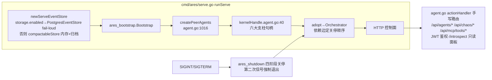

- 任务提交：`POST /api/tasks → submitPeerTask`（capability 归一为 `ares/plan`）→ `ensureSessionAdmission` 建 L2Graph → Task Fabric `Create`（READY+盖 strategy_id）。
- review：✅ PG 构造失败 FATAL 不静默降级（serve.go:458）；⚠️ agent.go 2804 行手写 switch，新增端点易漏鉴权分支。

### 3.2 组装层：ares_bootstrap 装配顺序

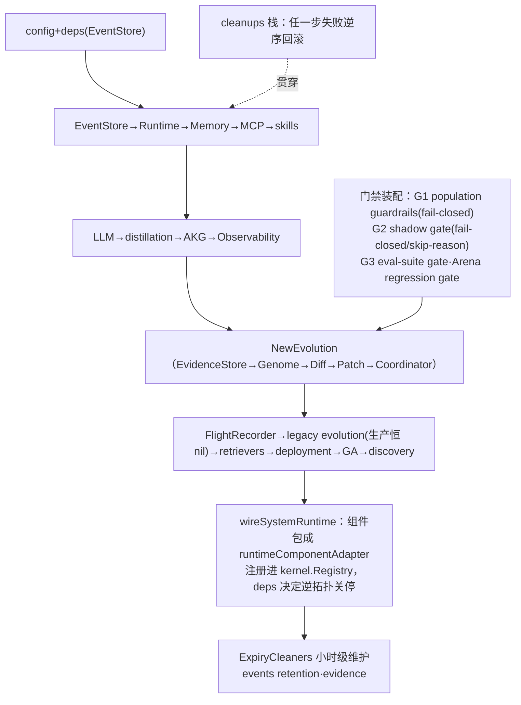

- 事件订阅接线：`task.completed/failed → skillOutcomeWriter → Experience.Record`；全事件流 → FlightRecorder → EvidenceStore → GA genomes。
- review：✅ cleanups 逆序回滚+"nil,nil=禁用"契约文档化；⚠️ wireLegacyEvolution 在 serve 路径恒不装配（双门叠加），易误读。

### 3.3 kernel：调度内核数据流

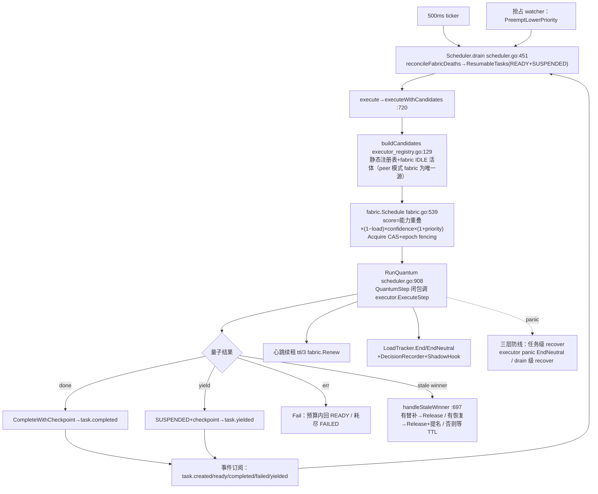

- Orchestrator（orchestrator.go）：组件 Bind→Start→Ready；Start 失败逆序 rollback；Shutdown 逆拓扑、每段 30s 预算、未停干净显式列出 notStopped。
- review：✅ 候选池单一事实源（HasCapableExecutor 与派发共享 buildCandidates，防影子注册）；⚠️ drain 尾部 `wg.Wait()`（scheduler.go:507）使一轮 drain 等最慢量子，跨轮并发受限。

### 3.4 fabric/task：Task Fabric 状态机

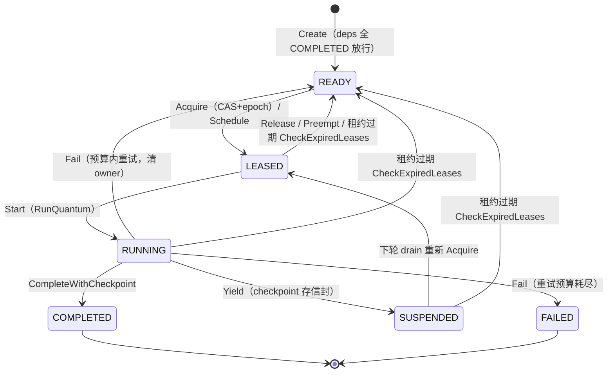

- 所有持权操作过 `ownerLocked(id, agent, epoch)`（fabric.go:695 附近）三重校验；过期持有者的 complete/release 被 `ErrEpochMismatch` 拒绝。
- 依赖就绪无 leader：dag.go `ReadyTasks/ResumableTasks` 由"前驱全 COMPLETED"推导；成环在提交时 Kahn 检测拒绝。
- 持久化因果序：flushSeq/flushCond 保证跨 goroutine 事件顺序且 append 移出锁外（fabric.go:893-937）。
- review：⚠️ `Delete` 不发事件不可重放（fabric.go:1105-1133），图丢失则 Reconcile 无法自愈；Renew 心跳缺失=重复执行是调用方纪律契约。

### 3.5 fabric/agent：planner 长图回路（系统最核心的数据流）

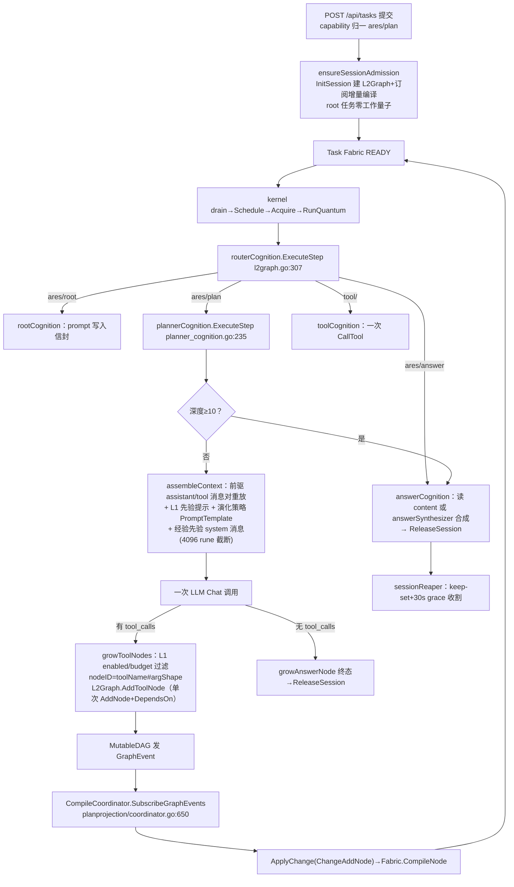

- "Agent 可弃、Task 持久"：`Kill`（lifecycle.go:278）只删注册+存认知快照；在途任务租约过期回 READY；`Recover`（:316）新 agent 装入死者 CognitiveState；`FindRevivableSnapshot` 按 capability 找最近死者复活或替身绑定。
- L1（能力图，节点 toolName#argShape，enabled/budget/prior）约束唯一作用点=planner 生长时；L2（每会话执行图）复用同一 MutableDAG 类型。
- review：✅ copy-on-write 盖章 executingAgentKey 防身份写穿信封；⚠️ forcedAnswers 进程级计数（planner_cognition.go:111），多会话归因丢失；answer 合成失败静默降级 gap body，可观测性靠日志。

### 3.6 runtime 核心：生命周期与插件总线

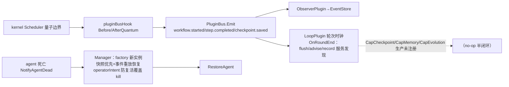

- review：✅ operatorIntent 三标志（stopped/paused/resurrecting）显式解决复活窗口竞态；⚠️ CheckpointPlugin/MemoryPlugin/EvolutionPlugin 生产无注册者（kernel.go:1250 注释自认），router_memory 依赖 MemoryPlugin，实际路由降级为 ExpressionRouter/fallback。

### 3.7 进化闭环（ares_evolution GA 接线 + evolution 引擎）

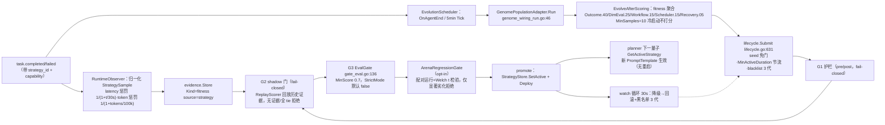

- review：⚠️ **默认配置下门链实质=G1+G2**（G3 非严格、G4 opt-in），"四重验证"强于默认实际；`StrategySample.CostUSD` 恒 0（无价目表）；两条并行 promote 路径（lifecycle gates vs v2 CandidatePipeline→coordinator）信任根有漂移风险。

### 3.8 memory / eval / arena / observability / protocol / archive

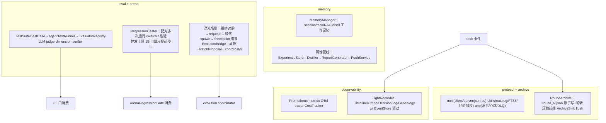

### 3.9 基础设施层：五条关键数据流

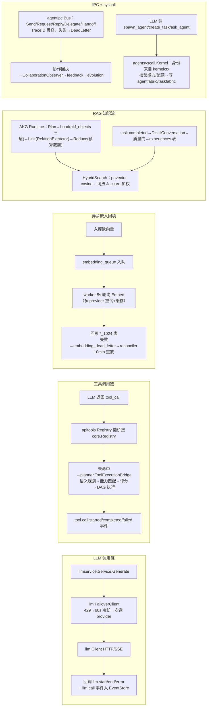

- 事件中枢：`ares_events.EventStore`（OCC Append/Subscribe/压缩/trim），48 个非测试消费文件，是全系统的"神经系统"。
- review：✅ feedback 纯数据包+agentipc Observer 放消费侧，无环依赖纪律好；✅ 嵌入三级自愈；⚠️ `DEFAULT_EMBEDDING_DIMENSION=768` 与迁移表 `*_1024` 不一致（遗留常量，易踩坑）。

---

## 4. 端到端主线时序图（生产 peer 模式一条线）

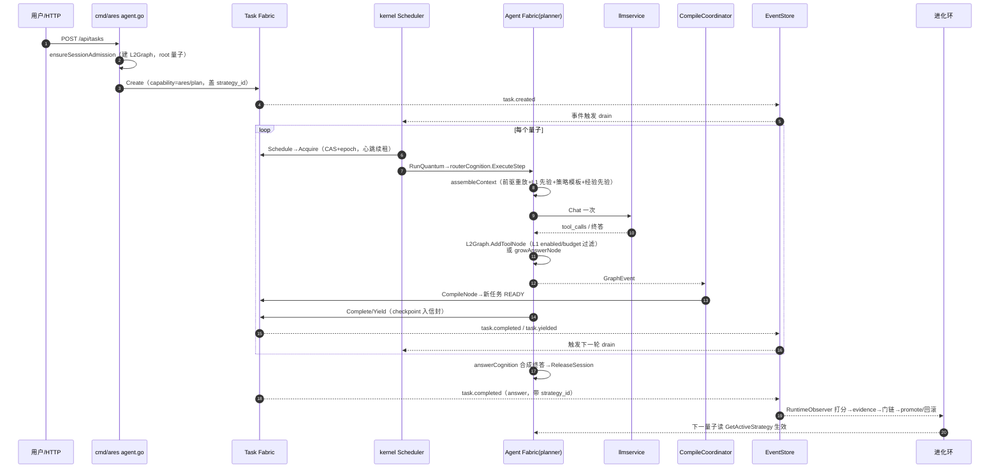

四条闭环一句话总结：
- **进化环 ✅**：终态事件→fitness→门链→SetActive→planner 下量子生效→watch 回滚+黑名单。
- **经验环 ✅**：蒸馏→experiences→RAG 注入/spawn 先验/skill 置信写读闭环（tracker 中性 1.0 去遮蔽）。
- **恢复环 ✅**：租约过期→READY→快照复活/替身绑定→终态解绑。
- **半闭环 ⚠️**：PluginBus CapCheckpoint/CapMemory/CapEvolution 无生产注册者；deadletter 只观测不重投（有意设计）。

---

## 5. 存储布局（代码现状）

| 存储 | 内容 | 备注 |
|---|---|---|
| PostgreSQL | events、event_summaries、evolution_strategies/lineages/rollback_events、agent_checkpoints、evidence_records、experiences_1024、knowledge_chunks_1024、akf_objects/representations、embedding_queue/dead_letter、sessions、eval_results、secrets、tools | storage.enabled 时事件走 PG（fail-loud）；retention 默认 0 永不清 |
| SQLite | akf_*（AKG）、skills FTS5 | |
| 内存 | compactableStore（未开 PG 时：归档+压缩）、默认 evidence store、无 PG 策略库 | |
| 文件 | .context/rounds/round_N.json 归档、~/.ares/experience.json | 原子写+轮转，永不合并 |

---

## 6. Review 发现汇总（按严重度）

### P1（建议尽快处理）
1. **默认门链实质单门**：EvalGate `StrictMode` 默认 false（gate_eval.go:42-46，基础设施缺失仅 warn 放行）+ ArenaRegressionGate 需显式 opt-in（regression_gate.go:17-18）→ 默认配置下进化 promote 主要靠 G2 shadow 单门把关。建议：生产配置显式开 StrictMode 与 regression gate，或把默认改 fail-closed。
2. **introspect 无鉴权**：HTTP API 仅注释声明"trusted operators only"，可读全部 agent/任务/事件/决策数据。建议默认 bind 127.0.0.1 + 简单 token。

### P2（结构性债务，收敛期内处理）
3. **入口层巨型文件**：serve.go runServe 400+ 行、agent.go 2804 行手写路由 switch，新增端点易漏鉴权分支（本项目已有 JWT 中间件，宜上 mux 分层）。
4. **双包同名 evolution 两条 promote 路径**：v1 lifecycle gates 与 v2 CandidatePipeline→coordinator 并行，信任根重叠；两包 doc.go 互指"wiring vs engine"但边界仍靠约定。
5. **runtime 插件半闭环**：CapCheckpoint/CapMemory/CapEvolution 生产零注册（kernel.go:1250 注释自认），LoopPlugin.OnRoundEnd 时钟在走、动作为 no-op；router_memory 依赖的 MemoryPlugin 未装配。
6. **文档漂移**（以本文件为准的修正）：
   - RUNTIME.md §5 表格仍写事件总线"PG 版完整但未接线"，与同文档 §6-M4.1"已接线"自相矛盾（代码已接，serve.go:458）。
   - ARCHITECTURE.md 锚点行号漂移：Acquire 实际 fabric.go:283（文档 267）、ownerLocked ~:695（文档 669）、Preempt :596（文档 570）。
   - RUNTIME.md 称"kernel.go:93 依赖边"等处行号有小幅漂移，属文档维护问题非代码问题。

### P3（清理项）
7. **compat/ 零生产读者**：最后注册点已切（provide_llm.go），整个目录是死代码，留待 0.4.x release-note 决策属实，但建议尽快下葬。
8. **遗留常量**：`DEFAULT_EMBEDDING_DIMENSION=768` 与表名 `*_1024` 不一致；`StrategySample.CostUSD` 恒 0（价目表缺失，惩罚不可达）；fitness 的 Collaboration/ToolCall 权重默认 0 需运维显式开启。
9. **小粗糙面**：planner forcedAnswers 进程级计数（多会话归因丢失）；answer 合成失败降级 gap body 可观测性弱；drain 尾部 wg.Wait 使一轮 drain 等最慢量子。

### 值得点名的亮点（保持）
- lease+epoch fencing + ownerLocked 三重校验，stale-winner 三分支处置完整（scheduler.go:697）。
- ReplayScorer：零 LLM 预算下用真实历史证据做 shadow 门，fail-closed 区分"无证据"与"全 tie"。
- 嵌入管线 queue+dead_letter+reconciler 三级自愈；事件持久化 flushSeq 因果序。
- 无环依赖纪律：feedback 纯数据包、agentipc Observer 放消费侧、接口定义在消费者侧、architecture_test 锁 kernel 边界。
- 全仓 fail-loud 文化：PG 构造失败 FATAL、G1/G2 fail-closed、missing deps fail-loud。

---

_评审产物文件，未改动任何源码。锚点以 2026-09-09 工作区代码为准。_
