# ares Architecture Deep Dive (I): The Big Picture — Why Another Agent Framework? (current trunk M0–M1.5)

I didn't set out to build a framework. I set out to solve a problem: **Agents kept dying, and I couldn't figure out why.**

It started with a simple chatbot. One Leader, two Subs, a handful of tools. Worked fine in dev. In production, the Leader would silently stop responding after 20 minutes. No error, no panic, no crash log. Just... silence.

After three days of debugging, I found it: a goroutine leak in the LLM client. One leaked goroutine per request, eventually hitting the OS thread limit. The fix was one line. But finding it took 72 hours because I had **zero visibility** into what the Agent was doing.

That's when I realized: the problem isn't "how to make an Agent call an LLM." The problem is "how to keep an Agent alive in production."

---

## The Three Questions

Every Agent framework answers one question: "How do I make an Agent call an LLM?" That's the easy part. The hard questions are:

1. **What happens when the Agent dies?** (Resurrection)
2. **How does it remember what it was doing?** (Memory distillation / state recovery)
3. **How do I know what went wrong?** (Observability)

ares is built around these three questions. The core stance has stayed constant: **Agents are not orchestrated. They are scheduled.** This article uses the **current real code** (the tool-DAG trunk, M0/M1/M1.5 landed): the whole system has exactly **one graph type** `engine.MutableDAG`, and ReAct's `for round` loop is unfolded into nodes grown on the graph — a node = one tool execution.

---

## The Architecture: current code

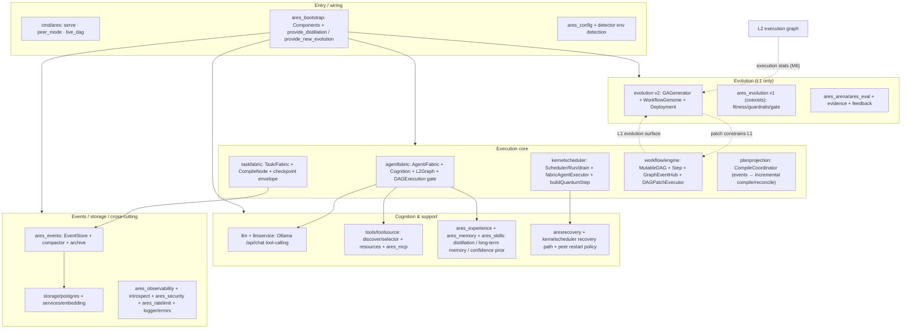

**One spine threading every module.** The seven layers of 0.3.x didn't vanish; they settled onto a handful of real packages: `agentfabric` = "how an Agent lives", `kernelscheduler` = "who runs", `taskfabric` = "the task's durable intent", `workflow/engine` = "the one graph", `planprojection` = "graph → tasks". Module by module below, using real components.

---

### Two isomorphic layers: L1 capability graph ↔ L2 execution graph

The whole system has **one graph type** `engine.MutableDAG`; evolution operators, patch executors, the event bus and the compiler all operate on it regardless of what a node holds. The only new concept is **layering**:

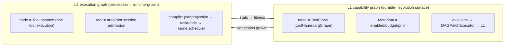

**Every step maps to real source:** `MutableDAG` (`workflow/engine/mutable_dag.go`), `GraphEventHub` with monotonic `seq` + per-subscriber drop counters (`graph_events.go`), `DAGPatchExecutor` (`dag_patcher.go`), the nine `WorkflowGenome` operators (`evolution/genome/`), `UpdateLiveDAG` (re-points the genome, `ares_bootstrap/provide_new_evolution.go`).

---

### The execution chain: event-driven, the graph is the plan, the fabric holds the facts

A ReAct round unfolds into "one node per tool execution." Execution is **not** in the graph — it is in the scheduler: each node compiles into a `taskfabric` task, drained by `kernelscheduler`, run as one quantum through the agent's Cognition, and the result lands in the task's checkpoint envelope:

```mermaid
flowchart LR
    GROW["L2Graph.AddToolNode (single AddNode with DependsOn)"]-->EVT["GraphEventHub"]
    EVT-->COORD["CompileCoordinator.SubscribeGraphEvents ApplyChange / Reconcile (seq gap / drop)"]
    COORD-->CT["taskfabric.CompileNode"]
    CT-->DR["kernelscheduler.Scheduler.Run/drain"]
    DR-->SEL["capability scoring picks winner"]
    SEL-->EXEC["fabricAgentExecutor.ExecuteStep"]
    EXEC-->COG["agent.Cognition (router→tool/answer/root)"]
    COG-->Q["buildQuantumStep: Done/Yield/Fail + envelope rewrap"]
    Q-->ENV["checkpoint envelope (Output lives in fabric)"]
```

Behind this are three real, landed chunks:

- **M0 incremental compiler:** `CompileCoordinator.ApplyChange` dispatches by `ChangeType`; `SetDependencies` / `UpdatePayload` / `CompileNode` / cross-batch dependency resolution (`taskfabric/workflow_plan.go`) — no more full-batch recompiles.
- **M1 execution bodies:** `toolCognition` / `answerCognition` / `rootCognition` all implement the same `Cognition` interface; `routerCognition` dispatches by `Task.AgentType`.
- **M1.5 event path:** `Reconcile` compensates dropped events, the `arg.` namespace isolates tool args from envelope plumbing, and the `DAGExecution` gate (default off = legacy ReAct) selects the session graph when open.

**The `DAGExecution` gate** is the transition guardrail: production defaults to `chatCognition`; opening it requires full capability advertisement + a session registry first — I won't force it before the prereqs are real.

---

## Module deep-dives: one component diagram per core package

### agentfabric — disposable agents + injected execution bodies

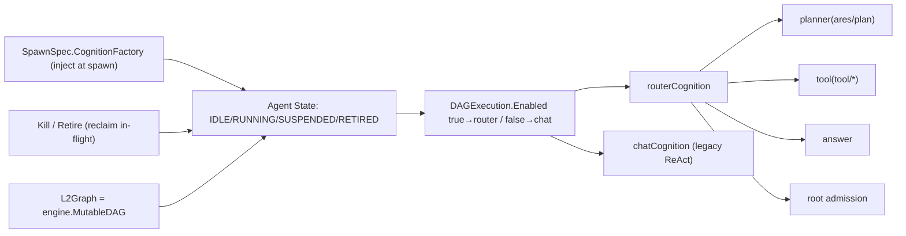

### kernelscheduler — the scheduling pipeline

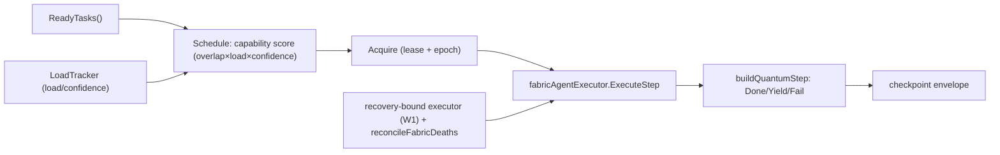

### taskfabric — the task state machine

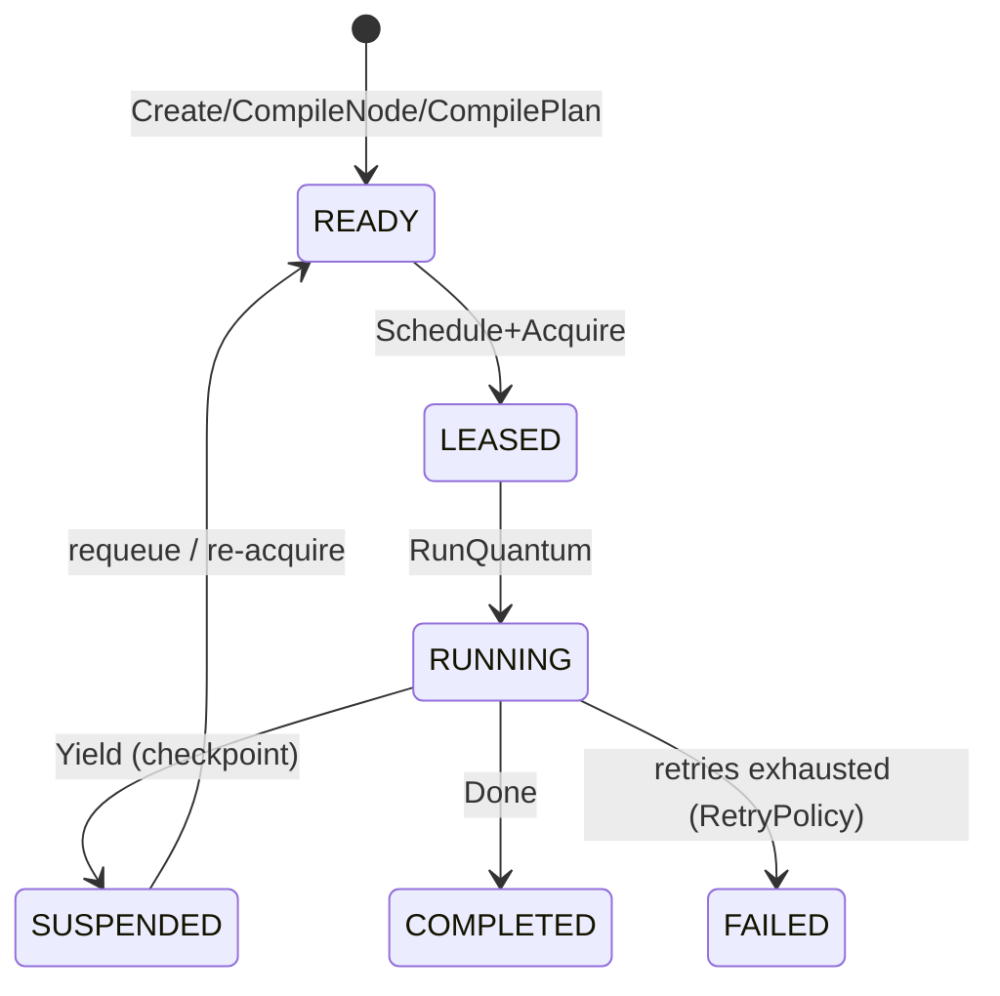

### workflow/engine — the graph engine

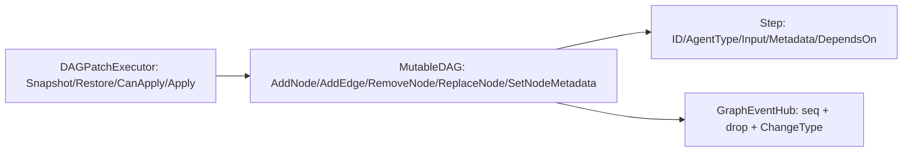

### planprojection — graph → task compiler

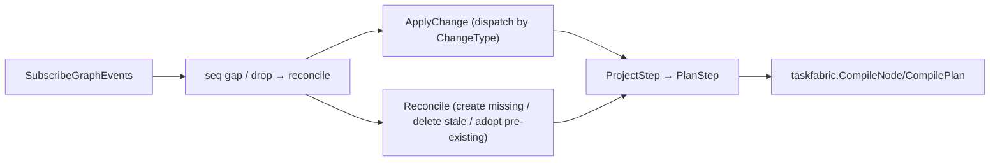

### evolution (v2) — the evolution pipeline

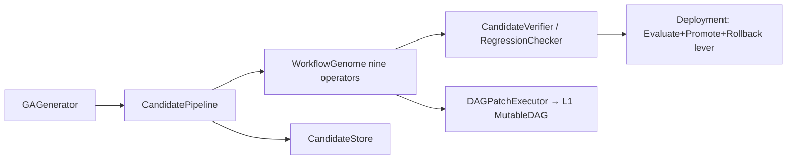

### ares_experience — memory distillation

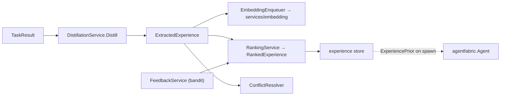

### ares_memory — the memory pipeline

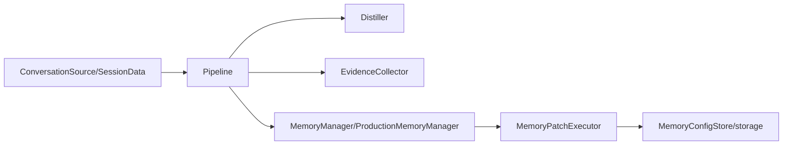

### tools/toolsource — tool discovery & retrieval

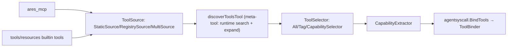

### aresrecovery — agent resurrection / recovery

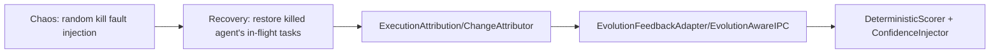

### ares_events — the event bus

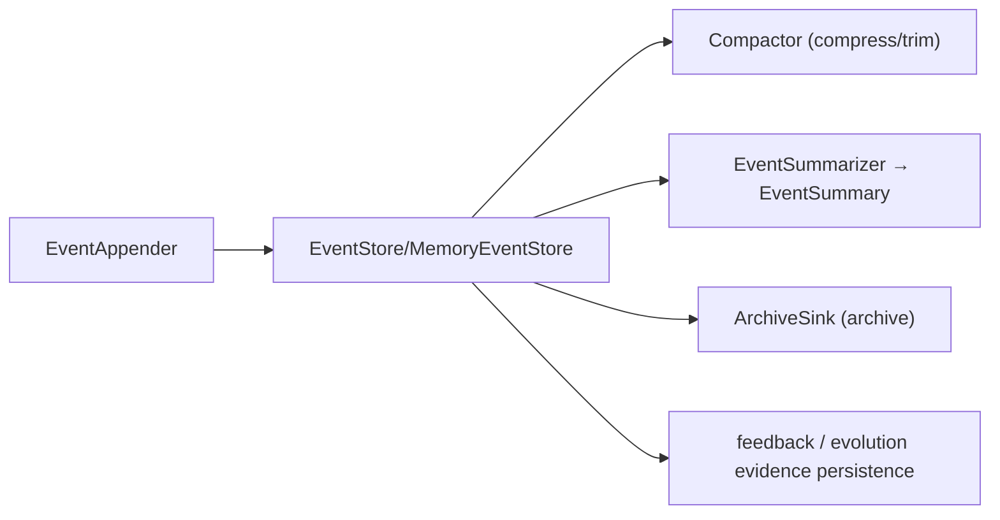

---

## Design Principles

**1. Agents are disposable; tasks are durable.**

The most important rule: **agent death ≠ task death.** `aresrecovery.Recovery` restores a killed agent's in-flight tasks, and `kernelscheduler`'s recovery-bound executor (W1) binds the replacement to exactly one task — it can never hijack another READY task. Every Execution Quantum yields at the boundary; the checkpoint is on disk, so the next quantum resumes from it.

**2. Record everything, replay everything.**

Every action — LLM call, tool call, task assignment, memory query — is an event in `ares_events.EventStore`. `introspect` shows the live Scheduling Observatory (decisions, winners, why). Want to restore state? Replay the events.

**3. The graph is the plan; the fabric holds the facts.**

L2 graph nodes do **not** carry Output. Results live in the fabric task's checkpoint envelope; you read the side effects by joining `nodeID = taskID`. A writer-back that copies results onto graph nodes? That's `toolprojection`'s ghost. Two sources of truth equals zero.

**4. The API layer is a contract, not an implementation.**

`internal/llmcore` defines the types; `api/core` is a deprecated forwarding alias (M5 internalization); `ares_bootstrap` assembles them. Swap `storage` from in-memory to PostgreSQL without touching the contract.

---

## What's Different

Most Agent frameworks are "LLM orchestration engines" — focused on prompt chains and tool calls. ares is an **Agent runtime**: it unfolds the ReAct loop into a graph and makes each tool execution a first-class scheduling entity. That buys the fabric's retry, preemption, lease, crash-recovery and dependency-readiness — things a tool call inside the ReAct loop never had.

| Capability | Typical framework | ares (current) |
|------|---------|------|
| Agent lifecycle | launch and pray | Agent Fabric: spawn → idle → running → suspend → retire; `aresrecovery` resurrects killed agents |
| Scheduling | leader dispatch | **Agents are not orchestrated, they are scheduled.** capability-aware kernel scheduler |
| Tool execution | inside the ReAct loop | one tool execution = one graph node = one schedulable task (free retry/recovery/dependency-readiness) |
| Execution structure | linear messages | two isomorphic `engine.MutableDAG`s: L1 capability (evolution) / L2 execution (session) |
| Memory | hard-stuffed message history | `ares_experience` distillation + `ares_memory` + `ares_skills` prior, injected as ExperiencePrior at spawn |
| Resurrection | none | `aresrecovery.Recovery` + recovery-bound executor (W1) + `Chaos` fault-injection verification |
| Observability | logs | `ares_events` event sourcing + `introspect` decision panel + metrics |
| Self-improvement | none | `evolution` Candidate → verify → Deployment (patches L1 only) |
| Tool discovery | hardcoded registry | `tools/toolsource` discover_tool meta-tool + selector + `ares_mcp` |

---

## Honest Talk

This project started as a chatbot and grew into something I didn't plan. The evolution engine came from "what if an Agent could optimize its own prompt?" The chaos arena came from "what if I could kill an Agent and watch it recover?"

**The honest edges right now:**

- **The tool-DAG trunk is still behind the `DAGExecution` gate, closed.** M0/M1/M1.5 are landed and green, but production peers still run `chatCognition`. Opening needs M2 session registry + M3 full capability advertisement; I won't force it early.
- **Evolution has v1 and v2** (`ares_evolution` vs `evolution`) coexisting. The trunk only guarantees "new code targets v2 + `MutableDAG`"; the ~30 legacy v1 files are untouched — cleaning them is a separate refactor.
- **`toolprojection` is dead code awaiting deletion.** The graph is the truth; post-hoc projection is pure redundancy. "Delete means delete" lands at M4.
- **`taskfabric` is in-memory.** Crash recovery requires the L2 graph to be rebuildable — `TestL2Graph_RecompilesIdempotentAfterRestart` pins exactly that as a regression test.
- **`M6` feedback (L2 results → L1 fitness) is not wired yet.** That's the last link of the evolution loop.

Every feature came from a real problem, not a feature checklist. That's why the architecture looks like this — not top-down designed, bottom-up evolved.

---

## The Series

| # | Topic | What you'll learn |
|---|------|-------------|
| I | **This article** | Big picture + two isomorphic MutableDAGs + all-module breakdown |
| II | Agent Harmony Protocol | how agents communicate |
| III | Memory Distillation | how `ares_experience`/`ares_memory` remember and forget |
| IV | Workflow Engine | `workflow/engine.MutableDAG`: how tasks flow and evolve in the DAG |
| V | Tool Layer | how `tools/toolsource` discovers, retrieves and binds tools |
| VI | Security & Observability | how `ares_events`/`introspect` show what happened |
| VII | Runtime & Lifecycle | how an Agent lives, dies, and is resurrected |
| VIII | Event System | how state is recorded and recovered |
| IX | Arena / Fault Injection | how `aresrecovery.Chaos` breaks things then verifies recovery |
| X | Retrieval | how relevant memory is found |
| XI | Autonomous Evolution | how `evolution` patches L1 and ships |
| XIII | Bootstrap & API | how `ares_bootstrap` wires without pain |
| XV | MCP Integration | how `ares_mcp` teaches an Agent to use tools |
| 19 | Storage layer | `storage/postgres` + `services/embedding` |
| 20 | LLM client layer | `llm` failover, multi-provider abstraction |
| 21 | Evaluation framework | `ares_eval` EvaluatorRegistry / LLMJudge |

Every article follows the same pattern: **Problem → Design Journey → Trade-offs → Honest Reflection.**

No marketing. No "10x faster than X." Just engineers talking engineering.