# ares Architecture Deep Dive (III): Memory Distillation — How Experience Is Extracted, Ranked, Reused, and Forgotten

> Ever run an agent that, after a few hours, tries to remember every task / input / output it ever saw, and the memory only grows while the thing actually worth remembering — "I hit this trap last time" — gets lost in the noise?
> I kept thinking: **instead of remembering "what happened," remember "what it means and what to do next time."**
> And that produced this whole pile: one pipeline that distills task results into reusable `Experience`, one that distills conversations into `Memory`, and one that records task-pattern → skill relevance priors as `Experience`. They're all named "experience," but they're three different jobs.

> Reading note: this article only describes symbols and flows that genuinely exist in the current repo and that I could verify. Anything I couldn't find in the code is explicitly marked **（待核实 / unverified)** — I won't fabricate an "architecture that should exist."

---

**Series Navigation**

| # | Topic | Status |
|---|-------|--------|
| 03 | Memory Distillation: Experience distillation / Memory distillation / Skill priors | This article |
| 04 | Workflow Engine (preview) | Next |

---

## 1. Get One Thing Straight: ares Has THREE "Distillation" Tracks

The package names all look like "experience / memory," but they're three unrelated pipelines. Don't mix them up:

1. **Experience distillation** (`internal/ares_experience`): distills a **task execution result** (`TaskResult`) into a reusable, rankable, feedback-driven `Experience`. This is the star of this article.
2. **Memory distillation** (`internal/ares_memory/distillation` + `pipeline.go`): distills a **conversation** into classified `Memory` (knowledge/preference/interaction/profile), producing reports and pushing.
3. **Skill priors** (`internal/ares_skills`): remembers "task-pattern → skill relevance" priors, used as a confidence source by the scheduler.

They share the word "experience" but differ in inputs, outputs, and lifecycles. Walk through them one by one — **only what I read in the code.**

---

## 2. Experience Distillation: From TaskResult to Experience

### 2.1 Entry Point: Task Completed / Failed Events

Experience distillation isn't `call`-ed by someone directly — it runs on an **event-subscription loop**. `subscribeDistillationEvents` in `internal/ares_bootstrap/bootstrap_steps.go` subscribes to two event types:

- `EventTaskCompleted`
- `EventTaskFailed`

For each event it hands `HandleTaskCompletedForDistillation` to the same loop. The real entry, in intent:

```go
// internal/ares_bootstrap/provide_distillation.go (excerpt)
func HandleTaskCompletedForDistillation(ctx context.Context, svc *aresexp.DistillationService, ev *ares_events.Event) {
    taskText   := stringField(p, ares_events.EventKeyTask)
    resultText := stringField(p, ares_events.EventKeyResult)
    tenantID   := stringField(p, ares_events.EventKeyTenantID)
    agentID    := stringField(p, "agent_id")
    usedExpID  := stringField(p, ares_events.EventKeyUsedExperienceID)

    // content-length guard: task < 10 chars or result < 20 chars → skip
    if tenantID == "" || len(taskText) < 10 || len(resultText) < 20 {
        return
    }

    taskResult := &aresexp.TaskResult{
        Task: taskText, Result: resultText,
        TenantID: tenantID, AgentID: agentID,
        UsedExperienceID: usedExpID,
        Success: ev.Type == ares_events.EventTaskCompleted,
    }
    if _, err := svc.Distill(ctx, taskResult); err != nil {
        log.Warn("bootstrap: distillation on task completion failed", "error", err)
    }
}
```

The input struct `TaskResult` lives in `internal/ares_experience/task_result.go`:

```go
type TaskResult struct {
    Task             string // task description (the distillation input text)
    Context          string // extra context
    Result           string // the task output/result
    Success          bool   // whether the task succeeded
    AgentID          string
    TenantID         string // multi-tenant isolation
    UsedExperienceID string // experience used by this execution (reinforcement tracking)
}
```

> Key clarification: **both successful and failed tasks participate in distillation.** The doc comment states: "Both successful and failed tasks are eligible: successful tasks yield success experiences, while failed tasks yield failure experiences." So "only successful tasks are distilled" is wrong.

### 2.2 Main Flow: Distill

`DistillationService` (`internal/ares_experience/distillation_service.go`) exposes the core method `Distill`, whose pipeline looks like this:

```mermaid
flowchart LR
    EV[EventTaskCompleted<br/>EventTaskFailed] --> SUB[subscribeDistillationEvents loop]
    SUB --> HANDLE[HandleTaskCompletedForDistillation]
    HANDLE --> D[DistillationService.Distill]
    D --> GUARD[ShouldDistill guard<br/>nil→false / lenTask>=10 / lenResult>=20]
    GUARD -->|fails| SKIP[return skipped error]
    GUARD -->|passes| EX[extractExperience<br/>LLM Generate<br/>30s timeout]
    EX --> LE[ExtractedExperience<br/>Problem / Solution / Constraints]
    LE -->|Problem or Solution empty| ERR[invalid extracted experience]
    LE --> ST[build storage_models.Experience<br/>Type=success/failure]
    ST -->|default, no enqueuer| SYNC[embedAndCreate<br/>sync embed + Create]
    ST -->|WithEmbeddingEnqueuer| ASYNC[Create row<br/>enqueueEmbeddingBackfill]
    ASYNC -->|enqueue fails, fallback| FB[backfillEmbedding sync]
    SYNC --> OUT[expToExperience returns *Experience]
    FB --> OUT
```



Real, verifiable points inside `Distill`:

**The gate `ShouldDistill`** — only looks at content length, not success:

```go
func (s *DistillationService) ShouldDistill(ctx context.Context, task *TaskResult) bool {
    if task == nil { return false }
    if len(task.Task) < 10  { return false }
    if len(task.Result) < 20 { return false }
    return true
}
```

**LLM extraction `extractExperience`** — builds a "return Problem/Solution/Constraints" prompt, calls `llmClient.Generate` (30s timeout), then `parseExtractionResponse` parses line-by-line into `ExtractedExperience`:

```go
type ExtractedExperience struct {
    Problem     string
    Solution    string
    Constraints string
}
```

**Experience type** — decided by `task.Success`:

```go
expType := ExperienceTypeFailure   // "failure"
if task.Success { expType = ExperienceTypeSuccess }  // "success"
```

**Persistence / vectors** — two legs (the `/a2` async backfill option):

- Default (no `EmbeddingEnqueuer` injected): `embedAndCreate` embeds synchronously and `Create`s the row with its vector.
- With `WithEmbeddingEnqueuer`: writes the row first (`Embedding` stays NULL), then `enqueueEmbeddingBackfill` drops a backfill task onto the queue; an embedding worker writes the vector back asynchronously. If the enqueue fails, it logs a Warn and falls back to synchronous backfill so the row never sits without a vector.

The interface (defined in the consuming package so `DistillationService` doesn't depend on the concrete postgres queue):

```go
type EmbeddingEnqueuer interface {
    Enqueue(ctx context.Context, task *EmbeddingTask) error
}

type EmbeddingTask struct {
    TaskID   string // i.e. the experience row id; the vector is written back here
    Content  string
    TenantID string
    Model    string
    Version  int
}
```

There's also a batch entry `DistillBatch(ctx, []*TaskResult)`: distills each one; a single failure is logged and skipped, the rest continue.

> Two behaviors I verified: ① the async backfill is **optional** (bootstrap configures it by default); a zero-config SDK caller still goes synchronous. ② both paths stamp `EmbeddingModel` / `EmbeddingVersion` (version from `embeddingConfig.DefaultVersion`, falling back to `postgres.DefaultEmbeddingConfig().DefaultVersion` when unset).

### 2.3 The Domain Model: What an Experience Looks Like

The `Experience` returned by the service is defined in `internal/ares_experience/ranked_experience.go` (mirrors the stored row):

```go
type Experience struct {
    ID               string
    TenantID         string    // multi-tenant isolation
    Type             string    // "success" or "failure"
    Problem          string    // abstract problem statement (also the embedding target)
    Solution         string    // concise solution
    Constraints      string    // important constraints/context
    Embedding        []float64
    EmbeddingModel   string
    EmbeddingVersion int
    Score            float64   // overall score (bandit feedback signal; RecordFailure lowers it)
    Success          bool      // whether the original task succeeded
    AgentID          string    // agent that produced it
    UsageCount       int       // times successfully used (reinforcement signal)
    DecayAt          time.Time // expiry; zero = never expires
    CreatedAt        time.Time
}
```

Three design decisions genuinely in the code here: **Problem/Solution/Constraints separation**, **Score as a feedback-mutated score**, and **UsageCount as a reuse reinforcement signal**.

---

## 3. The Feedback Loop: FeedbackService (bandit)

Experiences don't just sit after being stored. `FeedbackService` (`feedback_service.go`) feeds task outcomes back into the loop:

```go
// a task succeeded using an experience → usage count +1
func (s *FeedbackService) RecordSuccess(ctx, tenantID, experienceID) error {
    return s.experienceRepo.IncrementUsageCount(ctx, tenantID, experienceID)
}

// a task failed using an experience → rank drops (Score goes down)
func (s *FeedbackService) RecordFailure(ctx, tenantID, experienceID) error {
    return s.experienceRepo.DecrementRank(ctx, tenantID, experienceID)
}

// convenience: dispatch to the two above by success flag
func (s *FeedbackService) RecordFeedback(ctx, tenantID, experienceID string, success bool) error
```

One sentence for the code logic: **used successfully once → UsageCount+1; used and failed once → Score drops (DecrementRank).** This yields two independent signals for ranking.

---

## 4. Ranking: RankingService (multi-signal weighting)

Experiences aren't enough by themselves — after recall you have to order them. `RankingService` (`ranking_service.go`) implements a "lightweight bandit" multi-signal scoring.

Formula (confirmed in both comments and implementation):

```
FinalScore = SemanticScore + UsageBoost + RecencyBoost + persisted Score
where:
  UsageBoost   = min( log(1 + usage_count) * UsageWeight , 0.2 )
  RecencyBoost = exp( -age_days / RecencyDays ) * RecencyWeight
```

Defaults are hardcoded in `NewRankingService` / `DefaultRankingWeights`:

| Param | Default | Meaning |
|-------|---------|---------|
| UsageWeight | 0.05 | boost coefficient per log usage |
| RecencyWeight | 0.05 | boost coefficient for recent experiences |
| RecencyDays | 30.0 | decay half-life (days) |

Real code excerpt (`Rank` scores each experience):

```go
func (s *RankingService) Rank(ctx context.Context, experiences []*Experience, baseScores []float64) ([]*RankedExperience, error) {
    // error when len(experiences) != len(baseScores)
    ...
    finalScore := semanticScore + usageBoost + recencyBoost + exp.Score
    ranked[i] = &RankedExperience{
        Experience:      exp,
        FinalScore:      finalScore,
        SemanticScore:   semanticScore,
        UsageBoost:      usageBoost,
        RecencyBoost:    recencyBoost,
        ConflictChecked: false,
    }
    ...
    sort.Slice(ranked, func(i, j int) bool { // descending by FinalScore
        return ranked[i].FinalScore > ranked[j].FinalScore
    })
}
```

Real boost implementations:

- `calculateUsageBoost`: `log1p(usageCount) * weight`, capped at `0.2`, so old experiences can't dominate by sheer count.
- `calculateRecencyBoost`: `exp(-ageDays/recencyDays) * weight`, 30-day half-life, naturally aging out.

`RankedExperience` carries two booleans reserved for conflict detection:

```go
type RankedExperience struct {
    Experience       *Experience
    FinalScore       float64
    SemanticScore    float64
    UsageBoost       float64
    RecencyBoost     float64
    ConflictChecked  bool
    ConflictResolved bool // if true, this one was chosen as best in its conflict group
}
```

---

## 5. Conflict Resolution: ConflictResolver (Store Simply, Retrieve Smartly)

`ConflictResolver` (`conflict_resolver.go`) embodies one principle: **"Store Simply, Retrieve Smartly."**

It does NOT dedupe at write time; instead it does lazy conflict grouping **after recall/ranking**. Two steps:

1. `DetectConflictGroups`: clusters experiences by **cosine similarity of their problem vectors** (O(K²) single-link), grouping any pair above the threshold. Default threshold `0.9` (`problemSimilarityThreshold` in `NewConflictResolver`).
2. `Resolve`: within each group, keeps the highest-`FinalScore` one, and marks the others `ConflictResolved` (only the winner gets `true`).

```mermaid
flowchart LR
    RANK[RankingService.Rank<br/>→ ranked list] --> RES[ConflictResolver.Resolve]
    RES --> GROUPS[DetectConflictGroups<br/>cosine sim > threshold=0.9<br/>O(K²) single-link]
    GROUPS --> BEST[per group: keep highest FinalScore]
    BEST --> WIN[return: one best experience per group]
    BEST --> MARK[others marked ConflictChecked=true<br/>winner marked ConflictResolved=true]
```

Real-code essentials:

```go
func (c *ConflictResolver) cosineSimilarity(vec1, vec2 []float64) float64 {
    if len(vec1) != len(vec2) { // dimension mismatch → 0
        return 0.0
    }
    // standard dot / (|v1|*|v2|)
}

func (c *ConflictResolver) Configure(problemSimilarityThreshold float64) error {
    // must be 0 < threshold <= 1, else error
}
```

> Default threshold is `0.9` (overridable via `Configure`). Note this is a **different conflict mechanism** from `internal/ares_memory/distillation`'s `DistillationConfig.ConflictThreshold = 0.85` — one is the experience-ranking layer (ares_experience), the other is the conversation-distillation layer (ares_memory/distillation). Don't confuse them.

---

## 6. Evolution Guidance & Spawn Priors: How Experience Flows Downstream

The experiences produced have two downstream paths, both wired in `internal/ares_bootstrap/provide_distillation.go`.

### 6.1 Path A: Feeding the Evolution Algorithm (GA) as Guidance

Bootstrap builds an `evolution.FuncGuidanceProvider` that turns the experience store into the GA's "hint source":

- `HintsFunc`: calls `fetchExperiences` — preferably embeds the task type and does a semantic vector search (`Embed(taskType)` → `SearchByVector`), falling back to `SearchByKeyword`; maps hits into `evolution.EvolutionHint` (Problem/Solution/Constraints/Confidence).
- `RecordFunc`: `recordStrategyOutcome` — writes back the real GA strategy result as an experience, closing the **Strategy → Experience → Guidance** loop. Failures return errors, never silently swallowed.

In other words: **an agent's last success/failure becomes the hint for the next evolutionary mutation.** Here `Confidence` comes from the experience's `Score`, clamped to [0,1].

### 6.2 Path B: Injecting Into a New Agent's Cognitive Context (Spawn prior)

In `internal/agentfabric/lifecycle.go`, `SpawnSpec` has a field `ExperiencePrior any`:

```go
type SpawnSpec struct {
    // ...
    // ExperiencePrior is the distilled prior experience, loaded as the agent's
    // initial cognitive context at spawn time (written into CognitiveState.Context)
    // so the agent starts with reusable experience instead of a blank slate.
    // Nil = no prior (zero-value usable).
    ExperiencePrior any
}
```

And the matching logic in `Fabric.Spawn` (G1: memory-distill hook into the agent lifecycle):

```go
if spec.ExperiencePrior != nil {
    a.cognitive = CognitiveState{
        SchemaVersion: CognitiveStateSchemaVersion,
        Context:       spec.ExperiencePrior,
    }
}
```

So "distilled experience can become a new agent's initial cognition" is a **real, field-visible path**. But an honest boundary: **`ExperiencePrior` is an injection point at spawn time; I could NOT find a wiring that automatically searches the experience store's top-1 and fills it into `ExperiencePrior`.** Whether such an automatic backfill already exists I mark as **（待核实 / unverified）**.

---

## 7. Memory Distillation: Turning Conversations Into Classified Memory

If the above is "task-level" distillation, `internal/ares_memory/distillation` handles "conversation-level" distillation. The entry `Distiller.DistillConversation` is a multi-stage orchestration (real phases in `distiller.go`):

```
extractPhase → classifyAndScorePhase → topNBeforeConflictPhase
            → embedPhase → resolveConflictsPhase → finalTopNPhase
```

Combined with the `Pipeline` coordinator in `internal/ares_memory/pipeline.go`, it forms an end-to-end flow:

```mermaid
flowchart LR
    SRC[ConversationSource.Next] -->|ConversationBatch<br/>ConversationID/TenantID/UserID/Messages| P[Pipeline.Run]
    P --> D[Distiller.DistillConversation]
    D --> E[extract phase]
    E --> C[classify & score<br/>MemoryType: knowledge/preference/interaction/profile]
    C --> T[topNBeforeConflict]
    T --> EMB2[embed phase]
    EMB2 --> RES2[resolveConflicts]
    RES2 --> FINAL[finalTopN → []Memory]
    FINAL -->|optional PushAfterDistill| PUSH[PushService.PushRelevant]
    FINAL -->|per ReportInterval / at end| RPT[ReportGenerator.Generate<br/>→ reportSink.Save]
```

Real key interfaces & config:

```go
// pipeline.go
type ConversationSource interface {
    Next(ctx context.Context) (*ConversationBatch, error) // io.EOF when exhausted
}

type Distiller interface { // satisfied by *distillation.Distiller
    DistillConversation(ctx, conversationID string, messages []distillation.Message,
        tenantID, userID string) ([]distillation.Memory, error)
}

type PipelineConfig struct {
    TenantID          string
    ReportInterval    time.Duration // 0 = one report at the end of each Run
    PushAfterDistill  bool
    GenerateReportAtEnd bool
}
```

Pipeline philosophy is explicit: **depends only on interfaces, never concrete types; a failing batch is logged and continued, never panics.** `Run` returns `PipelineRunResult` (TotalBatches/TotalMemories/FailedBatches/PushedItems/Duration…).

Key `DistillationConfig` defaults (all word-for-word verifiable in `distiller.go`):

| Config | Default | Meaning |
|--------|---------|---------|
| MinImportance | 0.6 | min importance for a memory to be kept |
| ConflictThreshold | 0.85 | conflict similarity threshold (conversation layer) |
| MaxMemoriesPerDistillation | 3 | max memories kept per distillation |
| MaxSolutionsPerTenant | 5000 | per-tenant cap on solution-type memories |
| EnableCode/Stacktrace/Log/MarkdownTableFilter | true | various noisy filters on by default |
| EnableCrossTurnExtraction | true | cross-turn extraction on by default |
| PrecisionOverRecall | true | precision takes priority over recall |

Four memory classifications (canonical definitions live in `internal/llmexp`; both `ares_memory/distillation/memory.go` and `api/experience` (deprecated forwarding) alias to it):

```go
type MemoryType string
const (
    MemoryKnowledge   MemoryType = "knowledge"
    MemoryPreference  MemoryType = "preference"
    MemoryInteraction MemoryType = "interaction"
    MemoryProfile     MemoryType = "profile"
)
const (
    ExtractionDirect     = "direct"       // direct user-assistant pair extraction
    ExtractionCrossTurn  = "cross-turn"   // multi-turn conversation extraction
)
```

And the write-time conflict resolution strategies (when an `ExperienceStore` is configured):

```go
type ResolutionStrategy string
const (
    ReplaceOld Strategy = "replace"    // new replaces old
    KeepOld    Strategy = "keep_old"   // higher-confidence old wins over incoming
    KeepBoth   Strategy = "version"    // keep both (competing solutions)
    Merge      Strategy = "merge"      // merge (reserved for future use)
)
```

---

## 8. Session & Task Memory: The Underlying Tools

`ProductionMemoryManager` leans on two in-memory stores in `internal/ares_memory/context`:

- `SessionMemory`: holds sessions in `map[string]*SessionData`, `SessionData{SessionID, UserID, Messages, Context, AccessedAt, CreatedAt}`. A background `StartCleanup` prunes expired sessions every TTL/2; `Cleanup` removes at most 100 per call (avoids holding the lock too long).
- `TaskMemory`: holds tasks in `map[string]*TaskData`; `TaskData` also tracks `Steps []StepRecord` / `Results []ResultRecord`. `TaskMemory.Distill` collapses a task into `models.Task` (input/output/context) for the "lightweight extraction" path.

`MemoryConfig` (`manager.go`) defaults — all from `DefaultMemoryConfig`, verifiable:

| Field | Default |
|-------|---------|
| MaxHistory | 10 |
| MaxSessions | 100 |
| MaxTasks | 1000 |
| MaxDistilledTasks | 5000 |
| SessionTTL | 24h |
| TaskTTL | 7d |
| DistilledTaskTTL | 30d |
| VectorDim | 128 |
| EnableRAG | false (opt-in) |
| RAGTopK | 5 (applied when enabled) |
| RAGMinScore | 0.4 (applied when enabled) |

> RAG is opt-in. With `EnableRAG=false`, `BuildContext/BuildPromptMessages` behave as before (history only); set true to retrieve past experiences/distilled memories into the prompt. `ProductionMemoryManager` also has `retrievers []memctx.ContextRetriever` used when RAG is on.

---

## 9. The MemoryManager Abstraction & the Production Implementation

Experience distillation (ares_experience) runs on its own; the unified memory-access abstraction is `MemoryManager` (`internal/ares_memory/manager.go`), with three blocks:

- **Session**: CreateSession / AddMessage / GetMessages / AddStructuredMessage / BuildPromptMessages / BuildContext / DeleteSession
- **Task**: CreateTask / CreateTaskWithID / UpdateTaskOutput / DistillTask / StoreDistilledTask / SearchSimilarTasks
- **Lifecycle & events**: GetLatestSessionForAgent / Start / Stop / SetEventStore

The production implementation `ProductionMemoryManager` (`production_manager.go`) composes a lot: `dbPool` (PostgreSQL + pgvector), `retrievalService`, `writeBuffer` (write buffering), `embeddingClient`, `conversationRepository`, `taskResultRepository`, `sessionCache` (in-memory hot-session cache), `ctxCleaner` (strips tool noise / compresses verbosity), optional `eventStore` and `EvidenceCollector`.

`EvidenceCollector` is a minimal interface:

```go
type EvidenceCollector interface {
    Emit(ctx context.Context, kind string, payload any, keysAndValues ...string) error
}
```

> Honest note: the original blog's snippets about `experiences_1024` table names and the exact code walk of `StoreDistilledTask` through WriteBuffer I did not re-derive line-by-line from the current `manager` layer here. The internal write details live in `production_manager.go` / `production_manager_tasks.go`; this article won't re-quote them verbatim.

---

## 10. Runtime Evolution: MemoryPatchExecutor

Memory config isn't read-once at startup. `MemoryPatchExecutor` (`memory_patcher.go`) turns `MemoryConfig` into a `patch.RuntimeComponent` that can evolve at runtime:

- `PatchChangePlanner` → change `max_history` / `max_tasks` / `max_sessions`
- `PatchChangeBudget` → change `max_distilled_tasks` / `session_ttl`
- `PatchChangeReducer` → change `use_structured_cleaning`

It implements `validate-before-mutate` (a bad patch leaves config untouched) and returns a rollback-able `RuntimePatch` (`rollback: restore previous memory config`). `NewMinimalMemoryManager` provides a config-only lightweight `ProductionMemoryManager` for the no-database default bootstrap path (its dbPool/embeddingClient etc. are nil — config access only).

---

## 11. Skill Priors: Task Pattern → Relevance (Related But Not "Distillation")

The third thing named "experience" is in `internal/ares_skills`. It's not the same as distillation above — this is a **Learned Source** that only biases future skill-discovery ranking, never auto-invokes a skill.

- `Experience.Record(skill, taskPattern, successRate)`: stores {skill, task pattern, success rate}; re-recording the same (skill, pattern) pair replaces its rate; count is capped at `maxRecords=1000`, oldest evicted when exceeded.
- `Experience.BestMatch(taskPattern)`: scores by **keyword overlap** (short patterns use containment; long patterns tokenize and score by overlap ratio, threshold `matchScoreThreshold=0.5`), returning the highest-success-rate prior.
- Optional persistence: `JSONExperienceStore` writes atomically (temp file + rename); `NewExperienceWithStore` preloads at startup.
- `ExperienceConfidenceSource`: adapts `Experience` to `taskfabric.ConfidenceSource`; `Confidence(taskPattern)` returns the best prior's `SuccessRate` (0 when none). This is the piece that actually reaches the scheduler side — driven by real learned priors, not hardcoded constants.

If your interest is "how memory priors affect scheduling," **this is the path that lands on the scheduler**, whereas the ares_experience ranking/conflict machinery serves GA guidance and spawn injection.

---

## 12. Things You Might Expect — Marked Clearly

Let me be blunt about several things I did **not** find in the code (things intuition / the old blog might assume "should be there"):

1. **"Requires ≥2 non-failure trajectory supports to graduate" —（待核实 / not found）.** I grepped `ares_experience` and `ares_memory/distillation` for graduate / promote / vote / minSupport — no such implementation; `ShouldDistill` only checks length. If any "graduation" logic exists elsewhere (e.g. `knowledge/` or `flight/`), it belongs to a different system.
2. **"Candidate knowledge and formal knowledge stored separately" —（待核实 / not found）.** Experiences/memories all go into the unified ExperienceRepository; I saw no candidate-vs-formal split-table design.
3. **"Original three-layer memory + event-sourcing cognitive recovery" — partially unverified.** `MemoryManager` does split session/task blocks and `SetEventStore` does exist, but `manager.go` has no `experiences_1024`-style table details, and the `RecoverAgentState / buildCognitiveState` story belongs to agentfabric (another article). Trust the files cited here.
4. **"How many tokens distillation saves / 22.3% deviation / GPT-5.5 / sensenova" tables — NOT adopted.** Those are numbers I couldn't trace to a source in this repo and couldn't reproduce — I won't fake an "LLM-verified 96% savings" conclusion in front of you. (A benchmark test file `distillation/benchmark_token_comparison_test.go` does exist, but this article won't invent a "verified savings" figure.)

---

## Conclusion: The Real Data Flows

Linking the three tracks, ares "accounts" for memory like this:

```
TaskResult
  → (EventTaskCompleted/Failed) → DistillationService.Distill
      → ShouldDistill guard → LLM extraction of Problem/Solution/Constraints
      → store Experience (Type success/failure)
      → default sync embed, or async queue vector backfill
  → FeedbackService: success count +1 / failure Score down
  → RankingService: FinalScore = Semantic + UsageBoost + RecencyBoost + Score
  → ConflictResolver: group at 0.9 similarity, keep highest per group
  → downstream: GA guidance (Hints/Record)  +  Spawn injection (ExperiencePrior → CognitiveState.Context)

Messages
  → (ConversationSource→Pipeline→Distiller.DistillConversation)
      → extract → classify(knowledge/preference/interaction/profile) → embed → resolveConflicts → finalTopN
      → optional PushRelevant + report generation (reportSink)

taskPattern
  → ares_skills.Experience.Record(skill, pattern, successRate)
  → BestMatch → ExperienceConfidenceSource.Confidence → scheduler/downstream
```

Honest wrap-up: four things in this code are genuinely solid — **event-driven task-level experience distillation**, **bandit feedback with multi-signal weighted ranking**, **lazy conflict grouping**, and **the two experience feedback channels (spawn + GA)**. As for "how many trajectories it takes to graduate," "candidate vs formal split stores," and "how many tokens saved," I couldn't verify those, so I'm not going to dress them up for you here.

**Next Article Preview**: Workflow Engine — in 0.3.x the DAG is the scheduling source directly, MutableDAG adds/removes nodes at runtime (GraphPatchExecutor), with thread-safe cycle detection and checkpoint recovery. Same approach: only code I can verify.