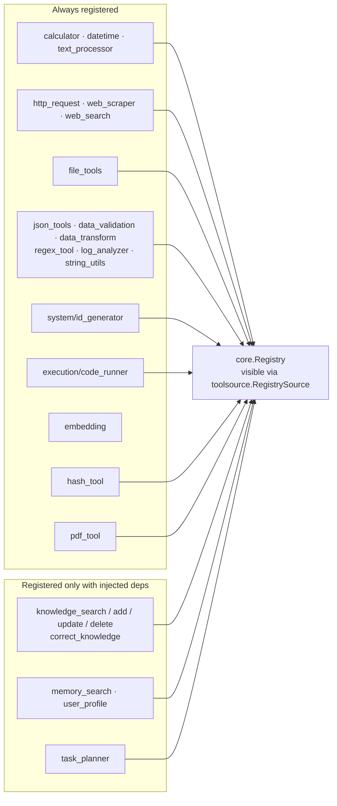
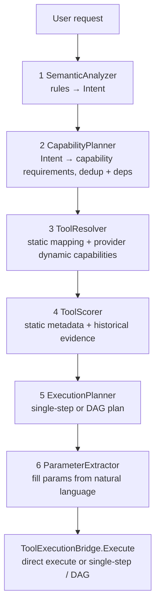
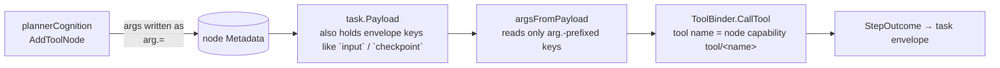

# ares Architecture Deep Dive (V): The Tool Invocation Layer — from "registered" to "actually called by the LLM" (0.3.x)

> I used to think the tool system was simple: define a Tool → put it in the Registry → the LLM can use it.
> But after following a few invocation chains through the code, I found that the hard part is the **whole pipeline** that carries a tool from a static definition into the LLM's hands and then actually calls it.
> In this article I review `tools/toolsource`, `tools/resources`, `tools/planner`, `tools/discovery`, `tools/envcap`, and the executors that really run tools in `agentfabric`: `ToolBinder`, `chatCognition`, and `toolCognition`.
> I only cover symbols and logic I actually saw in the code. If I didn't see it, I don't hype it.
>
> One important correction up front: **an agent does not call `Registry.Execute` directly.** There is always a `ToolBinder` in between. And behind that binder sit two "discovery" paths doing different jobs (the `discover_tools` runtime expansion and the capability-planner fallback).

## 0. Let me first define the scope

The tool system lives in several packages. I split it into five parts:

1. **`tools/toolsource`** — the "tool origin" abstraction. `ToolSource` (`Tools` / `OnChange` / `Source`) plus three implementations: `StaticSource` / `RegistrySource` / `MultiSource`.
2. **`tools/resources/core`** — the tool meta-model. The `core.Tool` interface, `ToolSchema`, `core.Registry` (including `ValidateParams` and the progressive-disclosure `activeTools`), and the builtin catalog (`builtin/`).
3. **Runtime discovery & selection** — the `discover_tools` meta-tool (`discover_tool.go`), the three `ToolSelector`s (`selector.go` / `capability_selector.go`), and `agentloop.Engine.expandDiscoveredTools`.
4. **`tools/planner` + `tools/discovery` + `tools/envcap`** — the capability-planner fallback, native-command discovery, and environment-capability search.
5. **`agentfabric`** — the executors that actually run tools: the `ToolBinder` interface, the ReAct tool-loop `chatCognition`, and the L2-graph `toolCognition` (parameters travel through the `arg.`-prefixed namespace).

One-liner for the real main pipeline:

```
ToolSource (static / registry / multi-merged)
  → ToolSelector (all / tag / capability) shrinks the per-turn subset
  → GetToolSchemas / ToolSchemaToLLMTool become the LLM's Tool definitions
  → LLM returns tool_calls
  → ToolBinder.CallTool(name, args)
  → core.Tool.Execute finally fires
```

---

## 1. Where tools come from: the ToolSource abstraction

`internal/tools/toolsource/toolsource.go` defines the origin layer. This abstraction is the foundation of the 0.3.x tool system:

```go
type ToolSource interface {
    // Tools returns a snapshot of currently-available tools. Callers must
    // not mutate the returned slice or any element.
    Tools(ctx context.Context) ([]core.Tool, error)
    // OnChange registers a best-effort callback invoked when the tool set may
    // have changed. Static sources may register nothing.
    OnChange(func())
    // Source returns a stable identifier used for dedup priority logging
    // (e.g. "static", "registry", "mcp").
    Source() string
}
```

Three implementations, with their `Source()` identifiers:

| Implementation | Source() | Behavior |
|---|---|---|
| `StaticSource` | `"static"` | Defensive copy at construction, never mutated afterward; `OnChange` is a no-op |
| `RegistrySource` | `"registry"` | Wraps a `*core.Registry`, snapshots via exported `List`+`Get`, forwards `OnChange` to the registry |
| `MultiSource` | `"multi"` | Merges sources in order, **dedups by tool name first-wins** (Static > Registry > MCP) |

`MultiSource`'s merge deserves a close look: a later tool with the same name is skipped (`seen[name]`), so **priority is decided by the order the sources are passed in** — the first source to name a tool wins. A source error gets wrapped with the source identifier and propagated. Every implementation returns the sentinel `ErrNilToolSource` on a nil source.

> In one line: this is not "all the tools live in one Registry". Rather, **multiple origins (static builtins, registry, MCP) are merged into a single snapshot, and whoever names a tool first wins.**

---

## 2. The list that reaches the LLM: Schema → advertise → execute

### 2.1 The tool meta-model (core)

In `internal/tools/resources/core/tool.go`, `core.Tool` is the uniform contract for anything executable:

```go
type Tool interface {
    Name() string
    Description() string
    Category() ToolCategory      // system / core / data / knowledge / memory / external
    Capabilities() []Capability
    Execute(ctx context.Context, params map[string]interface{}) (Result, error)
    Parameters() *ParameterSchema
}
```

Two optional interfaces (detected via type assertion):
- `IdempotentTool.IsIdempotent() bool` — pure-computation tools return true; tools with side effects (file I/O, network, state mutation) either don't implement it or return false.
- `TaggableTool.Tags() map[string]string` — semantic tags for LLM routing/discovery. Standard keys: `domain` / `input_type` / `output_type` / `side_effects` / `requires_network` / `mutates_state`.

The outward-facing shape is `ToolSchema`: `Name` / `Description` / `Category` / `Parameters` / `Tags`. It comes from `Registry.GetSchemas()` and is converted to `internal/llmcore.Tool` via `ToolSchemaToLLMTool` (`api/core` is the deprecated forward post-M5) before being advertised to the LLM.

### 2.2 Registry: register, validate, progressive disclosure

Key points of `core.Registry` (`registry.go`):

- `Register` / `Unregister`, `Get` / `List` / `Count`, concurrency-safe via `sync.RWMutex`.
- **`Execute` runs parameter validation**: it calls `ValidateParams` before execution — `required params exist`, `Go type matches the schema (string / integer / number / boolean / array)`, and `enum membership`. This blocks a chunk of LLM-typed-mismatch errors (e.g. number vs string) from causing a panic.
- **Progressive disclosure**: `SetActiveTools(names)` narrows only the "advertised" list (`GetSchemas`/`GetLLMTools` respect it); `Execute`/`Get` still see and run every tool. nil means "all active" (zero-value, backward-compatible).
- The global `GlobalRegistry` is **deprecated** — `Register`/`Get`/`List`/`Execute` operate on the empty `GlobalRegistry`. Production code now uses DI-injected `*Registry` instances.

### 2.3 The thing that really runs tools is a ToolBinder, not the Registry

`internal/agentfabric/chat_cognition.go` defines the `ToolBinder` interface (interface-at-the-consumer; both the sub executor and the fabric satisfy it):

```go
type ToolBinder interface {
    CallTool(ctx context.Context, name string, args map[string]any) (any, error)
    ListTools() []string
    IsToolIdempotent(name string) bool
    GetToolSchemas() []resources.ToolSchema
}
```

`chatCognition` (the 0.3.x default ReAct tool-loop executor, moved down from the sub executor) uses it like this:

1. Each round it fetches schemas via `toolBinder.GetToolSchemas()`.
2. An optional whitelist (`agents.ToolWhitelistFromParams`) **drops tools not in `Params["tools"]` from the advertised set first**; if the whitelist intersects nothing, it falls back to the full set so the LLM never sees an empty list.
3. An optional budget (`agents.ToolBudgetFromParams` / `agents.ToolAllowedByBudget`) drops tools whose per-session budget is spent at the schema layer (budget <= 0 means unlimited, leaving the non-evolved path untouched). Multiple calls to the same tool within a round that are over budget are skipped, with a paired tool message.
4. `ToolSchemaToLLMTool` converts to the LLM's `core.Tool`.
5. `chatClient.Chat(...)` (the `ChatClient` interface, satisfied by `*llm.FailoverClient`) returns a `ToolCallResponse`.
6. If there are `ToolCalls`, it loops `executeToolCall`: `json.Unmarshal` the JSON-string `tc.Function.Arguments` into `map[string]any`, stamps the caller identity with `kernelctx.WithCallerID`, then calls `c.toolBinder.CallTool(...)`.

Lesson two: **this `chatCognition` path does not go through `Registry.Execute`, so it does not get that `ValidateParams` layer** — whether params are sane depends on the concrete binder callbacks and each tool's own `params["key"].(string)` assertion. In other words: **`Registry.Execute` validates centrally; the `ToolBinder.CallTool` path does not necessarily.** They are two different entry points — don't conflate them.

A mermaid drawing covering §2.2 / §2.3:

```mermaid
graph TB
    REG[core.Registry<br/>RegisterGeneralTools injects builtins]<br/>-- optional -- SetActiveTools progressive disclosure --> AD
    TS[ToolSource<br/>MultiSource merges static / registry / MCP<br/>first-wins dedup]
    TS --> SEL[ToolSelector<br/>AllSelector / TagSelector / CapabilitySelector]
    SEL --> SCHEMA[GetToolSchemas → ToolSchema]
    SCHEMA --> AD[Advertise to LLM<br/>ToolSchemaToLLMTool / Chat API tools]
    WL[Whitelist / Budget filter<br/>agents.ToolWhitelistFromParams<br/>agents.ToolBudgetFromParams] --> AD
    AD --> LLMCALL[LLM returns tool_calls]
    LLMCALL --> EXEC[chatCognition.executeToolCall<br/>unmarshal JSON → kernelctx.WithCallerID<br/>→ toolBinder.CallTool]
    EXEC --> TOOL[core.Tool.Execute]
    TOOL -.->|Registry.Execute additionally<br/>runs ValidateParams| REG
```

---

## 3. Runtime discovery: discover_tools and progressive disclosure

No way can every tool fit in context. `internal/tools/toolsource/discover_tool.go` provides a meta-tool named **`discover_tools`** (`DiscoverToolsName = "discover_tools"`).

It takes a single parameter (constant `queryParam = "query"`, **required**):

```go
func (t *discoverToolsTool) Parameters() *core.ParameterSchema {
    return &core.ParameterSchema{
        Type: "object",
        Properties: map[string]*core.Parameter{
            queryParam: {Type: "string",
                Description: "Search query: matches tool name, description, or tags (case-insensitive substring)."},
        },
        Required: []string{queryParam},
    }
}
```

Execution:
- Take a snapshot via `source.Tools(ctx)` → `searchTools(tools, query)`: for each tool, a case-insensitive substring match over **name / description / any tag key or value** (`toolMatches`).
- `json.Marshal` the result into a JSON **string** (`[]discoverToolEntry`, the compact `{name, description}` shape) placed in `Result.Data` — so the data is valid JSON after `%v` formatting, visible to the LLM and parseable by the expander.
- Capped at `maxDiscoverResults = 20` to keep context small.

The "expansion" lives in `internal/agentloop/engine.go`. The `agentloop.Engine` does not import `toolsource`; it only depends on a narrow interface `ToolExpander`:

```go
type ToolExpander interface {
    Expand(ctx context.Context, names []string) ([]core.Tool, error)
}
```

In `Engine.executeToolCalls`, when the LLM happened to call `discover_tools` and it succeeded (`err == nil && result.Success`), it runs `expandDiscoveredTools`:

1. Parse the result as `[]struct{ Name string }` to get names;
2. Call `req.ToolExpander.Expand(ctx, names)` to get LLM tool definitions;
3. Dedup by `Function.Name` and append them to `st.activeTools`, available on **subsequent iterations**.

Note: this "automatic append" is **explicitly implemented by the engine** — expansion only happens when the LLM **actively called `discover_tools`** in that round; with a nil `ToolExpander`, expansion is disabled and the meta-tool result is returned to the LLM as text (no new callable tools). So it is not "tools auto-re-expand"; it is "**discovered tool names become callable next round**."

---

## 4. Selectors: shrinking the candidate pool down to the per-turn subset

`internal/tools/toolsource/selector.go` defines `ToolSelector`:

```go
type ToolSelector interface {
    Select(ctx context.Context, input string, available []core.Tool) ([]core.Tool, error)
}
```

Three implementations:

| Selector | Behavior | Fallback |
|---|---|---|
| `AllSelector` (default) | Returns all unchanged, sorted by `Name` for determinism | — |
| `TagSelector` | Extracts keywords from input, keeps only `TaggableTool`s whose tag value hits a keyword | No keywords or no matches → return all (never an empty toolset) |
| `CapabilitySelector` | Reuses `planner.ToolResolver` + `planner.ToolScorer`, picks the top-1 tool per capability | No capabilities extracted / nothing resolves → return all |

### 4.1 TagSelector's keyword extraction (extractKeywords)

The rules are concrete:
- Split on non-alphanumeric (tokens are `a–z`, `0–9` only);
- Drop stop words (`the/a/an/and/or/to/of/in/on/for/is/.../please/me/my/how/what/who/some/get/want/need/use/using/via/into/out/...`);
- Drop single-character tokens (`len(f) < 2`), collapse duplicates.
- `tagsMatchKeywords`: a tool matches if **any tag value** contains **any keyword** (case-insensitive) — note: value, not key.

### 4.2 CapabilitySelector's capability extraction (capability_selector.go)

This is the "keyword → capability → tool" bridge. `CapabilityExtractor func(input string) []string`, default `DefaultCapabilityExtractor`, reuses `extractKeywords` through a `keywordToCapability` map. A few entries:

| Keyword(s) | Derived capability (planner capability name) |
|---|---|
| `math` / `calculate` / `calc` / `add` / `multiply` | `Arithmetic` |
| `sum` | `Summation` |
| `hash` / `sha` / `md5` | `Hashing` |
| `regex` / `pattern` | `Regex` |
| `json` | `JSONProcessing` |
| `pdf` | `PDFParsing` |
| `api` / `http` / `url` | `HTTPRequest` |
| `search` / `web` / `google` | `WebSearch` |
| `code` / `run` / `execute` | `CodeExecution` |
| `embedding` / `vector` | `Embedding` |

`CapabilitySelector.Select` per extracted capability: build `&planner.CapabilityRequirement{Name: cap}` → `resolver.Resolve` → `scorer.Score` → take `scored[0].ToolName` → look the tool up from `available` by name, deduped. The capability names must match planner's constants (`toolsource` re-exposes a set of 24 `capXxx` typed constants to stay maintainable).

> In one line: selectors shrink the global pool to the per-turn LLM subset, and **when they can't, they fall back to the full set — better to show more than to hand the LLM an empty list.**

---

## 5. The builtin tool catalog (builtin)

The tools actually registered into the Registry are in `internal/tools/resources/builtin/builtin.go`'s `RegisterGeneralTools(*core.Registry, ...GeneralToolsDeps)`. The always-registered set (each with semantic tags):



Tabulated (per `builtin.go`):

| Domain | Tool names | Tag highlights |
|---|---|---|
| Math | `calculator` / `datetime` / `text_processor` | domain=math / text, side_effects=false |
| Network | `http_request` / `web_scraper` / `web_search` | requires_network=true; `http_request` side_effects=true |
| File | `file_tools` | side_effects=true, mutates_state=true; restricted to `ARES_FILE_TOOLS_ALLOWED_DIR` |
| Data | `json_tools` / `data_validation` / `data_transform` | domain=data, side_effects=false |
| Text | `regex_tool` / `log_analyzer` / `string_utils` | domain=text, side_effects=false |
| System | `id_generator` | domain=system |
| Execution | `code_runner` | Python **disabled by default**, needs explicit `EnablePython(true)` |
| Embedding | `embedding` | requires_network=true |
| Crypto | `hash_tool` | domain=crypto |
| PDF | `pdf_tool` | domain=pdf; shares file_tools' allowed dir |
| Knowledge (injected) | `knowledge_search/add/update/delete`, `correct_knowledge` | depend on `GeneralToolsDeps` backends |
| Memory (injected) | `memory_search`, `user_profile` | depend on MemoryMgr |
| Planning (injected) | `task_planner` | depends on `LLMClient` |

Two "aha" implementations worth calling out:

- **`calculator`** (`builtin/math/calculator.go`) is built on the `expr` engine with up to 27 functions: basics `sqrt/abs/sin/cos/tan/log/round/floor/ceil/pow/min/max`, combinatorics `factorial/nPr/nCr`, number theory `gcd/lcm/isPrime`, statistics `mean/variance/stddev/median`, probability `binomial/normalPdf/poissonPdf`, constants `pi/e`. Compiled expressions are cached per expression (`compiled map[string]*vm.Program`, capped at `maxCompiledPrograms=512`) guarded by `RWMutex`. It implements `IdempotentTool` (`IsIdempotent()==true`).

- **`code_runner` and the safety railings**: `RegisterGeneralTools`'s comment is explicit — "CodeRunner is registered with **Python DISABLED** by default"; HTTPRequest/WebScraper enforce SSRF filtering at the HTTP client layer; FileTools uses `WithAllowedDir` to block path traversal by default. I.e., **safe-by-default; escapes require explicit opt-in.**

The full `core.ToolCategory` constants are `system / core / data / knowledge / memory / external`.

> Beware a name-consistency trap: the planner's static `capabilityMapping` (below) references names like `calculator / hash_tool / string_utils / regex_tool / pdf_tool / web_search ...`. These must match the first string argument written into `NewBaseToolWithCapabilities(...)`, otherwise the resolver "resolves" a candidate that the registry doesn't actually contain and it gets filtered out.

---

## 6. The capability-planner fallback: planner + ToolExecutionBridge

The LLM won't always pick the right tool. `internal/tools/planner` provides a deterministic planning fallback. Per `planner/doc.go`, the pipeline is **6 stages** (one more than 5 — `ExecutionPlanner`):



### 6.1 SemanticAnalyzer: 20 built-in keyword rules

`analyzer.go`'s `defaultRules()` is ordered "most specific first". A rule is an `intentRule{keywords, goal, operation, complexity, capabilities}`; matching is OR (`matchAnyKeyword` uses `strings.Contains`, i.e. a literal substring, not a regex — the comment explicitly warns you not to put regexes into keywords). Examples:

```
{keywords:["累加","求和"], capabilities:["Summation","Arithmetic"]}
{keywords:["hash","md5","sha1","sha256","sha512","哈希"], capabilities:["Hashing"]}
{keywords:["pdf","document"], capabilities:["PDFParsing","TextExtraction"]}
{keywords:["mean","median","stddev","variance","average","平均","标准差","方差","统计"], capabilities:["Statistics","Arithmetic"]}
{keywords:["gcd","lcm","prime","公约数","素数"], capabilities:["NumberTheory","Arithmetic"]}
...
```

If nothing matches, `Analyze` returns the error `"no matching rule for request"` — **the planning fallback is not a silver bullet; it only knows the patterns in its rule base.**

### 6.2 CapabilityPlanner: dedup + dependencies

`capability.go`'s `capabilityPlanner.Plan` turns an Intent's capability list into `CapabilityRequirement`s. There's subsumption: `Summation ⊇ Arithmetic`, `TextExtraction ⊇ PDFParsing`, `ExpressionEvaluation ⊇ Arithmetic` — when a parent appears, children are marked seen and don't generate redundant steps. Also `dependenciesFor`: `TextExtraction → PDFParsing`, `Embedding → [TextExtraction, StringManipulation]`.

### 6.3 ToolResolver: static mapping + dynamic capabilities

`resolver.go`. `capabilityMapping` is the static "capability → tool name" table (`Arithmetic→calculator`, `Hashing→hash_tool`, `Regex→regex_tool`, `WebSearch→web_search`, `CodeExecution→code_runner`, ...). `toolMetadata` holds static scoring metadata (`cost/latency/deterministic/composable/sideEffects`; e.g. `calculator{cost:1,latency:1ms,deterministic:true,composable:true}`, `http_request{cost:5,deterministic:false,sideEffects:true}`).

`Resolve` gathers candidates from two routes: the static mapping + the provider's `GetToolCapabilities()` (dynamically registered tools). **Finally it filters by `provider.ListTools()`, keeping only tools that are actually registered.**

### 6.4 ToolScorer: the scoring formula (two of them)

There are actually **two scorers** in the planner:

- `toolScorer` (`scorer.go`, `NewToolScorer`):
  ```
  BaseScore   = (1/Cost)*10 + Deterministic?3:0 + Composable?2:0
  EvidenceScore = SuccessRate*20 - (with evidence) min(latencyMs/100, 5)
  Penalty     = SideEffects ? 5 : 0
  Final       = BaseScore + EvidenceScore - Penalty
  ```
- `evidenceScorer` (`evidence.go`, `NewEvidenceScorer`) additionally subtracts `failureRatio*10` when there is evidence and failures exist; evidence is aggregated per `tool:capability`.

A real worked example (default SuccessRate=0.95, no evidence, no latency penalty):
- `calculator`: Base=10+3+2=15, Evidence=0.95*20=19, Penalty=0 → **34** (not the "35" floating around the internet — the 1 point is because the default success rate is 0.95, not 1.0).
- `http_request`: Base=(1/5)*10+0+2=**4** (some writeups say "base=2", missing the Composable +2), Evidence=19, Penalty=5 → **18**.

So `calculator` beats `http_request` by ~16 points on determinism + low cost + no side effects. But **the exact score depends heavily on whether historical evidence exists** (reflected in `SuccessRate`, latency penalty, failure penalty) — treat it as a ranking signal, not a fixed constant.

Evidence flow: `ToolExecutionBridge` calls `evidence.Save(...)` (tool name / capability name / success / latency) after every execution; the default is `NewMemoryEvidenceStore()` (in-process, lost on restart); cross-process implementations must satisfy the `EvidenceStore` interface.

### 6.5 ParameterExtractor: natural language → parameters

`extractor.go` only handles the exact patterns it recognizes via hardcoded regexes; anything else returns nil to be decided later. Examples (from the real regexes):

```
"from 1 to 100" / "从1到100"   → expression = "(b-a+1)*(a+b)/2"  (corrected: not b*(b+1)/2)
"2的10次方" / "…的…次方"        → expression = "2**10"
"根号16"                        → expression = "sqrt(16)"
"nCr(10,3)" / "组合(10,3)"     → expression = "nCr(10,3)"
"factorial(10)" / "10的阶乘"    → expression = "factorial(10)"
"median/方差/..."              → expression = "median(1,2,3)" etc.
"12和18的最大公约数"             → expression = "gcd(12,18)"
```

### 6.6 ToolExecutionBridge: merged execution + multi-step DAG

`bridge.go`'s `Execute(ctx, toolName, params, userRequest)`:

| Condition | Behavior |
|---|---|
| `toolName != ""` and exists in registry | Execute directly, then `evidence.Save` (capability name via `primaryCapabilityName(tool)`, i.e. `Capabilities()[0]`) |
| `toolName != ""` but not found | Log warning → planner fallback |
| `userRequest == ""` | Error `"tool not found and no user request for fallback"` |
| Planner path | `Plan` → DAG validation → single-step or multi-step |

A multi-step plan is validated first via `NewDAGValidator().Validate`: structural errors (`cycle_detected` / `missing_dependency` / `incompatible_io`) block execution; IO incompatibility is advisory (warn only). Then `executeMultiStep` uses `topoSort` (Kahn's algorithm, which detects cycles) to order, each step runs `mergeParams` (plan defaults → dependency-output binding → user-param override), then `executeStepWithFallback` (primary tool → `FallbackToolNames` in order; all-fail returns the last error; evidence is saved only on the successful attempt).

Dependency-output binding (`bindDependencyOutput`) guesses field names by capability: e.g. `PDFParsing` outputs look at `text/content`, `Arithmetic` at `result/value/number`, `WebSearch` at `results/output`; on the input side `inputParamNamesForStep` prefers the tool schema's `Required`, then fills capability-default names.

> On "how it's wired in production": `planner/doc.go` states cmd/ares does `newToolBinder(internalReg)` + `newPlannerBridge(internalReg)` + `binder.WithPlannerBridge(bridge)`, so when a tool name doesn't exist the binder falls back to the bridge. **I'm relaying this from doc.go; I haven't read the serve wiring line-by-line (to-be-verified).** But it confirms an important fact: the planner fallback hangs off the **Binder layer**, which lines up with `agentfabric`'s `ChatCognitionDeps.ToolBinder` interface.

---

## 7. Native-command discovery + environment-capability search

### 7.1 discovery: probing native commands

`internal/tools/discovery/discover.go`'s `Discoverer` is the "native-tool discovery" primitive: for each allowlisted command it probes `command -v` + `--help` and adapts the ones that exist into `CommandTool`s.

The security boundary is spelled out in the package doc:
- **Only the allowlisted commands are ever probed/executed**; the command name is fixed at construction, and `Execute` only passes user-supplied arguments to `exec.CommandContext` — **no shell, no string interpolation**, so a caller can't inject shell metacharacters or invoke unlisted binaries.
- Output capped at `maxCommandOutputBytes = 1 MiB`; over-cap is an **error** (not silent truncation) so a chatty command like `yes` can't exhaust memory.
- Stdout/stderr are kept separate; the description is the **first non-empty line** of `--help`.
- `Parameters` declares a single `"args"` array.

### 7.2 envcap: unified search across tools / skills / commands

`internal/tools/envcap`'s `Searcher` aggregates three routes: registered tools (`ToolLister`, with `RegistryLister` adapting a Registry), skills (`skills.Registry`), and native commands (`discovery.Discoverer`). `Search` ranks by kind (tool → skill → command) then by name. `search_tool.go` wraps a `Searcher` into a `core.Tool` named **`search_capabilities`** (`SearchToolName`), params `query` (required) + `limit` (default 20). This is another progressive-disclosure entry point: get name + one-line description first, then call by name when you actually need it.

---

## 8. toolCognition in the L2 graph: the `arg.` namespace

Unless `DAGExecution.Enabled=true`, the production executor is still `chatCognition`; **the L2 graph is currently not wired into the production serve path — it's a test-only seed** (`l2graph.go`'s top comment: "not yet wired into the production serve path – until it is, peers keep their default ReAct chatCognition and this graph stays test-only"). But one of its design choices is worth discussing separately, because it's tightly coupled to parameter naming:

`routerCognition.ExecuteStep` dispatches on `task.AgentType`: `tool/<name>` → `toolCognition`, `ares/answer` → `answerCognition`, `ares/root` → `rootCognition`, `ares/plan` → `planner`. `toolCognition.ExecuteStep` does exactly one thing:

```go
res, err := c.binder.CallTool(ctx, c.tool, argsFromPayload(task.Payload))
```

The key is `argsFromPayload` and the constant `argMetadataPrefix = "arg."`:

- The planner writes parameters into the node's Metadata via `L2Graph.AddToolNode(ctx, id, tool, args, dependsOn)` / `argsMetadata(args)`, **prefixing every key with `"arg."`** (`arg.<key>=<value>`).
- At execution, `toolCognition` reads the args via `argsFromPayload(task.Payload)`, which **only strips and reads keys starting with `arg.`**; everything else (the projection's `input`, the scheduler-restore `checkpoint`, envelope plumbing) is ignored.
- So **only the real parameters reach `CallTool`**, which is why strict-schema tools (`additionalProperties:false`) accept the call — that's the whole reason args live in the `arg.` namespace.



`argsFromPayload`'s parsing is best-effort: if a value starts with `{` or `[` and `json.Unmarshal` succeeds it's decoded as JSON; otherwise it passes through as the raw string (so plain strings like file paths are never mistaken for JSON). The sibling `extractArgsJSON` (used by `CountToolClass` to reconstruct an argShape) works the same way.

> For the reader: **the same params, two different access patterns in two paths** — ReAct's `chatCognition` unmarshals `tc.Function.Arguments` directly; the L2 `toolCognition` only reads the `arg.` prefix. Know which executor you're in before trying to read the params.

---

## 9. Known issues and honest reflection

1. **Parameter validation is "two ledgers."** `Registry.Execute` runs `ValidateParams`, but the `chatCognition` → `ToolBinder.CallTool` path does not go through it; correctness there depends on the concrete binder callbacks and each tool's own type assertions. That's a risk surface, not a unified line of defense.

2. **The planner is a rule engine, not a universal shim.** `Analyze` only knows the ~20 built-in keyword rules and errors out when nothing matches; `ParameterExtractor` only recognizes its hardcoded regexes. Natural language beyond those patterns won't be planned.

3. **The L2 graph isn't in production.** `DAGExecution` defaults off; `toolCognition` / the `arg.` namespace currently only run in tests.

4. **Scorer scores drift.** `toolScorer` and `evidenceScorer` differ (the latter has a failure penalty), and whether `tool:capability` evidence is present — plus the default SuccessRate=0.95 — changes the final score. Treat ranking as a signal, not a fixed constant.

5. **Discovery depends on the host.** `discovery` only registers tools for allowlisted commands that exist on the host; missing commands are silently skipped (graceful degrade).

6. **Serve-side wiring to be verified.** The exact assembly of `toolBinder` / `ToolExecutionBridge` / the envcap `Searcher` in `cmd/ares`, and which `ToolSource` `discover_tools` is bound to, are things I relayed from doc.go / package comments but haven't traced line-by-line (to-be-verified).

---

## Series Index

| # | Topic | What you'll learn |
|---|------|-------------|
| I | Architecture Overview | global view + two-level isomorphic MutableDAG + full module breakdown |
| II | Agent Harmony Protocol | how agents communicate |
| III | Memory Distillation | how `ares_experience` / `ares_memory` remember and forget |
| IV | Workflow Engine | `workflow/engine.MutableDAG`: how tasks flow through / evolve in the DAG |
| V | **This article** | how `tools/toolsource` discovers, selects, and binds tools |
| VI | Security & Observability | how `ares_events` / `introspect` see what happened |
| VII | Runtime & Lifecycle | how agents live, die, and revive |
| VIII | Event System | how state is recorded and recovered |
| IX | Arena / Fault Injection | how `aresrecovery.Chaos` breaks things on purpose and verifies recovery |
| X | Retrieval System | how relevant memories are found |
| XI | Autonomous Evolution | how `evolution` patches only L1 and ships |
| XIII | Bootstrap & API | how `ares_bootstrap` wires things without pain |
| XV | MCP Integration | how `ares_mcp` teaches the agent to use tools |
| 19 | Storage Layer | `storage/postgres` + `services/embedding` |
| 20 | LLM Client Layer | `llm` Failover, multi-provider abstraction |
| 21 | Evaluation Framework | `ares_eval` EvaluatorRegistry / LLMJudge |

Every article follows the same pattern: **problem → design journey → tradeoffs → honest reflection.**

No marketing. No "10x faster than X". Just engineers talking engineering.

Everything I could pin to code is collected in the assertion list below, so you can check it against the source:

| Claim | Symbol / file | Status |
|---|---|---|
| Tool origins have three implementations | `toolsource/toolsource.go` (`StaticSource`/`RegistrySource`/`MultiSource`) | ✅ verified |
| discover_tools meta-tool | `toolsource/discover_tool.go`, `DiscoverToolsName="discover_tools"`, `maxDiscoverResults=20` | ✅ verified |
| Expansion only happens when the LLM actively calls discover_tools | `agentloop/engine.go` `expandDiscoveredTools` / `ToolExpander` | ✅ verified |
| Three selectors + keyword/capability extraction | `selector.go` / `capability_selector.go` | ✅ verified |
| Registry.Execute runs ValidateParams | `resources/core/registry.go` | ✅ verified, but not on the agentfabric CallTool path |
| Full builtin catalog and tags | `builtin/builtin.go` `RegisterGeneralTools` | ✅ verified |
| calculator's 27 functions | `builtin/math/calculator.go` | ✅ verified |
| planner's 6-stage pipeline | `planner/*` (doc.go matches impl) | ✅ verified |
| Scoring formula (two scorers) | `planner/scorer.go` + `planner/evidence.go` | ✅ verified |
| `arg.`-prefixed parameter namespace | `agentfabric/l2graph.go` (`argMetadataPrefix`/`argsFromPayload`) | ✅ verified |
| cmd/ares production wiring | `cmd/ares` (relayed from doc.go) | ⚠️ to-be-verified |