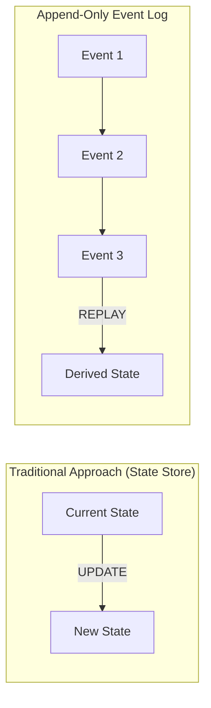
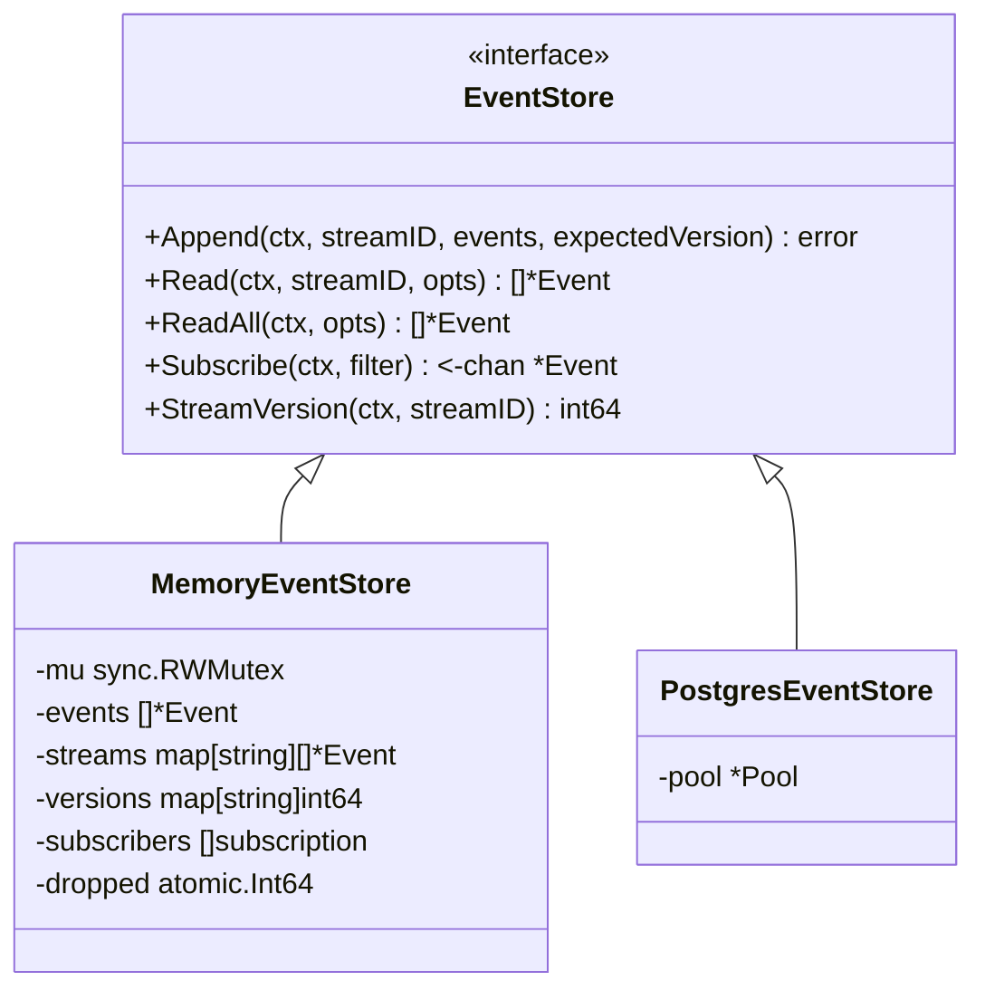
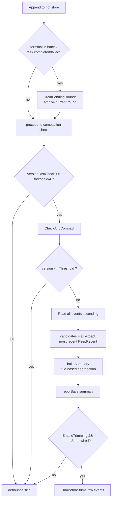
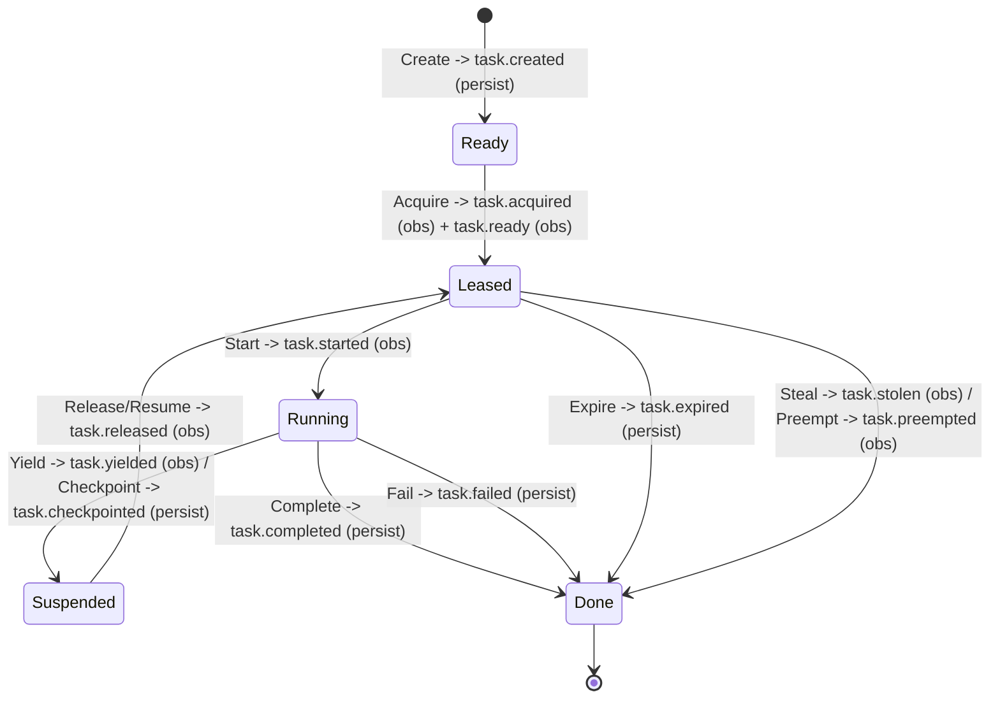
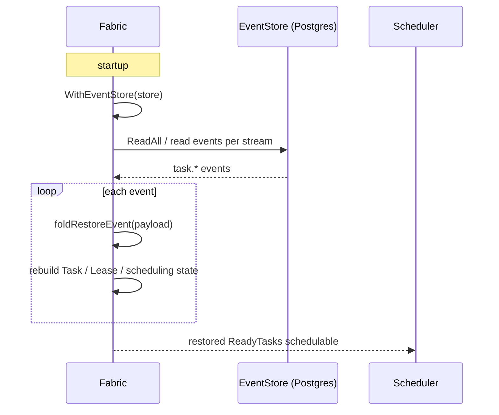
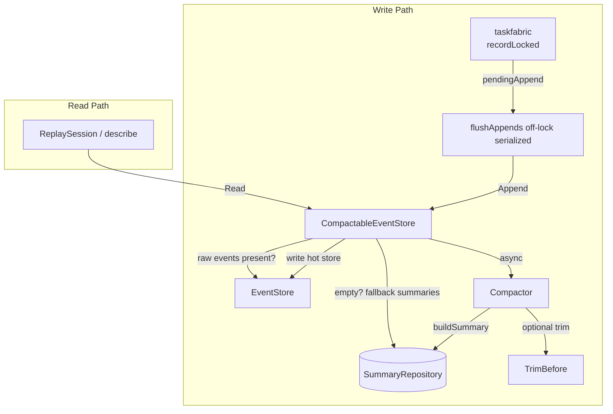

# ares Architecture Deep Dive (VIII): Event System — Append-Only Event Log, Compaction, and the Task Lifecycle (0.3.x)

> 0.3.x update: `internal/taskfabric` now carries a full Task lifecycle event set (created/ready/acquired/started/yielded/checkpointed/preempted/released/completed/failed/expired/stolen). Task Fabric appends every state transition to an in-memory log and, when an `EventStore` is attached, writes to the durable layer so Scheduler/Task/Lease state can be rebuilt across restarts. Note: "events directly drive scheduling" is over-hyped — the scheduler is capability+priority work-stealing scoring, NOT event-driven dispatch where `task.completed → dependent becomes Ready`.

> Agent startup is an event, a task state transition is an event, a tool call is an event, an LLM response is an event, an Agent crash leaves an event too.
> My idea was: if I record every state change as an append-only record, can I replay what happened after the process dies?
> The answer: some of it can be rebuilt. But honestly — **not all of it** (see "What it does NOT do").

---

## 1. Why Record Events

In the early days I kept Agent state in an in-memory struct. Where it was, what it processed, what errors it hit — everything lived in the process. When the process die, zero evidence: no history, no replay, no way to audit whether a step escalated to an unauthorized tool call.

So I turned to Event Sourcing: **don't store the current state, store every change. Want the current state? Replay the event stream and compute it yourself.**



But let me be clear about what this design actually buys you, and what it does **not** — so you don't come away with inflated expectations:

- ✅ **Audit trail**: every change carries a timestamp, type, emitting module (`module_name`), and payload.
- ✅ **Replay**: read a stream ascending and step through it; `ares_flight`'s ReplaySession replays/jumps through events.
- ✅ **Cross-restart rebuild**: `taskfabric` can rebuild its task set from the persisted events (`RestoreFromStore`).
- ⚠️ **It does NOT** guarantee "replayable side effects" — it records what happened, it doesn't rewind external world effects.
- ⚠️ **It does NOT** persist every lifecycle event (see §5): most transitions are observability-only; after a restart the topology is rebuilt by recompiling the live DAG, not by replaying these.

Core files:

| File | Purpose |
|------|---------|
| `internal/ares_events/types.go` | Event model, EventType enum, ReadOptions / EventFilter, sentinel errors |
| `internal/ares_events/store.go` | EventStore / EventAppender interfaces + `Emit` helper |
| `internal/ares_events/memory_store.go` | In-memory `MemoryEventStore` (subscribe, trim) |
| `internal/ares_events/pg_store.go` | PostgreSQL `PostgresEventStore` |
| `internal/ares_events/compactor.go` | Compactor: aggregate old events into summaries |
| `internal/ares_events/summary.go` | EventSummary model + SummaryRepository interface + CompactionConfig |
| `internal/ares_events/compactable_store.go` | Auto-compacting EventStore wrapper |
| `internal/ares_events/trim_store.go` | `TrimAwareStore`: trim old events after compaction |
| `internal/ares_events/archive_hook.go` | `ArchiveSink`: round archiving hook |
| `internal/ares_events/tool_events.go` | Unified tool-completion payload keys |
| `internal/taskfabric/events.go` | Task lifecycle EventType + TaskEvent |
| `internal/taskfabric/fabric.go` | Event recording / persistence / restore logic |
| `internal/ares_flight/replay.go` | ReplaySession for step-by-step replay (see series #16) |

---

## 2. Event Model

### 2.1 Event Structure

`internal/ares_events/types.go`:

```go
type Event struct {
    ID         string         `json:"id"`
    StreamID   string         `json:"stream_id"`
    Type       EventType      `json:"type"`
    ModuleName string         `json:"module_name,omitempty"`
    Payload    map[string]any `json:"payload"`
    Metadata   map[string]any `json:"metadata,omitempty"`
    Version    int64          `json:"version"`
    Timestamp  time.Time      `json:"timestamp"`
}
```

An event belongs to a **stream** (`StreamID`) — an append-only sequence for one entity, typically a task or agent. `Version` is assigned and incremented by the store on append (optimistic concurrency). `ModuleName` records which subsystem emitted it (e.g. `taskfabric`), so on replay you know the source directly. `Type` is used for routing and classification.

The same file also provides: `VerifyStreamIntegrity` (checks a stream's versions are contiguous, no gaps) and `StreamHash` (deterministic stream hash to detect silent corruption), plus sentinel errors `ErrVersionConflict`, `ErrStreamNotFound`, `ErrEventStoreClosed`, `ErrEventIntegrity`, `ErrSummaryNotFound`.

### 2.2 Event Types (ares_events side)

`ares_events.EventType` is a string alias enumerating events across subsystems:

```go
// excerpt
EventAgentStarted      = "agent.started"
EventTaskCreated       = "task.created"
EventTaskCompleted     = "task.completed"
EventTaskFailed        = "task.failed"
EventSessionCreated    = "session.created"
EventMessageAdded      = "message.added"
EventMemoryDistilled   = "memory.distilled"
EventLLMCall           = "llm.call"
EventToolCallStarted   = "tool.call.started"
EventToolCallCompleted = "tool.call.completed"
// Task lifecycle (published by taskfabric)
EventTaskReady       = "task.ready"
EventTaskAcquired    = "task.acquired"
EventTaskStarted     = "task.started"
EventTaskYielded     = "task.yielded"
EventTaskCheckpointed= "task.checkpointed"
EventTaskPreempted   = "task.preempted"
EventTaskReleased    = "task.released"
EventTaskExpired     = "task.expired"
EventTaskStolen      = "task.stolen"
// Leader-sub collaboration
EventSubTaskScheduled = "sub_task.scheduled"
EventSubTaskStarted   = "sub_task.started"
EventSubTaskResult    = "sub_task.result"
EventSubAgentFailed   = "sub_agent.failed"
// others: step.* / handoff / discovery.* / component.failed
```

### 2.3 EventStore Interface

`internal/ares_events/store.go`:

```go
type EventStore interface {
    Append(ctx context.Context, streamID string, events []*Event, expectedVersion int64) error
    Read(ctx context.Context, streamID string, opts ReadOptions) ([]*Event, error)
    ReadAll(ctx context.Context, opts ReadOptions) ([]*Event, error)
    Subscribe(ctx context.Context, filter EventFilter) (<-chan *Event, error)
    StreamVersion(ctx context.Context, streamID string) (int64, error)
}
```

Key semantics (consistent across both implementations):

- `Append(expectedVersion)`: `>0` must match the stream's current version or it returns `ErrVersionConflict`; `<=0` means "append after the current version, no conflict check." Both implementations do this via lock/transaction.
- `ReadOptions`: `FromVersion` (inclusive), `Limit` (0 = no limit), `Direction` (Ascending/Descending), `Since`.
- `EventAppender` is a narrow one-method interface used by `Emit`. `Emit(ctx, store, streamID, type, moduleName, payload)` is the canonical publish entry; on failure it only logs a warning and returns false.

---

## 3. Two Store Implementations

Both satisfy the same interface with aligned semantics, but different mechanics:



### 3.1 MemoryEventStore

`memory_store.go`. Lock → version check → assign an incrementing `Version` to each non-nil event (nil events are skipped, never consuming a version) → write to both flat `events` and per-stream `streams` → notify subscribers. Subscribers are handed a **clone** (B19), because the `*Event` pointer is shared with the internal store and a mutating subscriber would race concurrent Read/Append.

`Subscribe`'s channel capacity is **64**; `notifySubscribers` is a **non-blocking send** — if the buffer is full the event is silently dropped into the `dropped` counter (`Stats()` exposes `dropped_events`, for monitoring only; the write path is never blocked). When the subscriber's context is cancelled or the store `Close()`s, its channel is closed and cleaned up.

`MemoryEventStore` also implements `TrimBefore`, so the compaction-trim loop works on the memory half too — otherwise long-running serve processes grow the in-memory store without bound.

### 3.2 PostgresEventStore

`pg_store.go`. `Append` runs in a transaction: `SELECT MAX(version) WHERE stream_id = $1`, optimistic check, then per-event `INSERT INTO events (id, stream_id, type, payload, metadata, version, created_at)`. A concurrent unique-key violation (PG error code `23505`) is translated to `ErrVersionConflict`.

`Subscribe` does **not** use LISTEN/NOTIFY — it **polls every 1 second** (sliding window of `defaultEventReadLimit = 100`), de-duplicating by id (`maxDeliveredIDs = 8192`, resets the set on overflow — at worst re-delivers old events, never loses new ones). This reduces "subscribe" to "scheduled query," so real-time lag is only second-ish.

The two implementations share the same `Emit`, `ReadOptions`, and `expectedVersion` semantics.

---

## 4. Compaction & Archiving Pipeline

Without compaction the event store grows without bound. `Compactor` aggregates old events into compact `EventSummary` records in a `SummaryRepository` (relational), then trims the raw events out of the hot store.

### 4.1 CompactionConfig Defaults

```go
func DefaultCompactionConfig() CompactionConfig {
    return CompactionConfig{
        Threshold:             500,
        KeepRecent:            100,
        MaxSummariesPerStream: 50,
        SummaryTTL:            30 * 24 * time.Hour, // 30 days
        EnableTrimming:        true,
    }
}
```

`CompactableEventStore` is an **auto-compacting wrapper** (`compactable_store.go`): it embeds `EventStore`, overrides `Append`, and asynchronously checks whether the stream needs compaction after the write.

### 4.2 Auto-Trigger + Debounce

`Append` only writes synchronously; the real compaction work is **async** (one goroutine per batch, derived from the store's own lifecycle context `lctx` rather than the caller's, so short-lived requests can't cancel it — each run is still bounded by `compactionTimeout = 30s`):

- `maybeCompact` reads `StreamVersion`, **debounced**: it only really checks when `version - lastChecked >= threshold/4` (`compactionCheckDivisor = 4`), to avoid doing I/O on every append on a hot stream.
- Past threshold → `compactor.CheckAndCompact`.
- Progress is tracked by the `lastChecked` map.

### 4.3 Compaction Flow



Key point: **the summary is saved first, trimming happens after** — the trim boundary is the summary's `EndVersion`, so every trimmed event is already captured in a summary. `Compactor` also exposes `ForceCompact` (compact regardless of threshold) and `CleanupOldSummaries` (delete expired summaries per `SummaryTTL`).

### 4.4 DefaultSummarizer: Rule-Based

`EventSummarizer` is a function type (`func([]*Event) string`), and the default `DefaultSummarizer` is pure rule-based — no LLM call. It counts events, de-duplicates task IDs from `task.created` and tool names from `llm.call` / `tool.call.*`, snippets the user request, and derives outcome from `task.failed` / `task.completed` (`failed` / `partial` / `completed` / `active`). Example output:

```
Agent stream-1, ran 1 task(s) [task-42], called 2 tool(s) [search, calculator], emitted 6 events, duration 1s, bound to user request: "Plan a trip to Tokyo", result: completed
```

(Tools capped at 5, tasks at 3, request snippet at 120 chars, errors at 3 — hard limits to keep summaries bounded.)

### 4.5 Summary Fallback on Read

If the raw events were trimmed, `CompactableEventStore.Read` falls back: underlying `Read` returns empty → look up `SummaryRepository` → emit the summaries as synthetic `"event.summary"` events. This keeps ReplaySession from breaking after compaction, but note it's a **degradation**: you get summaries, not raw events.

### 4.6 ArchiveSink: Round Archiving

`compactable_store.go` lets you attach an `ArchiveSink` (function type in `archive_hook.go`) via `WithArchiveSink`. Its job is to archive the record of one "round" (from the previous terminal event to `task.completed`/`task.failed`) **before** compaction trims the raw events, so a durable copy exists for the context-compression strategy. Archiving runs on terminal hits or before compaction, via `drainPendingRounds` paging (500/page, up to 1000 rounds); sink failures are best-effort — logged, never failing append or compaction.

---

## 5. Task Fabric: Task Lifecycle Events

`internal/taskfabric/events.go` defines an `EventType` enum **separate** from `ares_events`:

```go
const (
    EventTaskCreated      EventType = "task.created"
    EventTaskReady        EventType = "task.ready"
    EventTaskAcquired     EventType = "task.acquired"
    EventTaskStarted      EventType = "task.started"
    EventTaskYielded      EventType = "task.yielded"
    EventTaskCheckpointed EventType = "task.checkpointed"
    EventTaskPreempted    EventType = "task.preempted"
    EventTaskReleased     EventType = "task.released"
    EventTaskCompleted    EventType = "task.completed"
    EventTaskFailed       EventType = "task.failed"
    EventTaskExpired      EventType = "task.expired"
    EventTaskStolen       EventType = "task.stolen"
    EventTaskUpdated      EventType = "task.updated" // observability-only, never persisted
)
```

`TaskEvent` is the immutable record in that **in-memory log**: `{Type, TaskID, AgentID, Origin, State, Checkpoint, At}`. The fabric appends one to the in-memory log (`f.events`, capped by `maxInMemoryEvents`) on every state transition.

### 5.1 State Transition → Event Mapping



> This is an **intent-level** "transition → event" sketch, labeled with which events persist. For the exact state set and the functions each transition runs in, defer to the `internal/taskfabric` state machine; this article only asserts the event-side facts (including persist/non-persist).

### 5.2 What Persists vs What's Observability-Only

The fabric records events in the in-memory log, and only writes to the durable store when an `EventStore` is attached (`WithEventStore`) — and not every event. `isMustPersistEvent` decides:

```go
// must-persist (recovery/replay correctness depends on them)
TaskCreated, TaskCheckpointed, TaskCompleted, TaskFailed, TaskExpired

// observability-only (enrich the trace, not required for rebuild)
TaskReady, TaskAcquired, TaskStarted, TaskYielded,
TaskPreempted, TaskReleased, TaskStolen
```

Mechanics: `recordLocked` builds the in-memory event + one `pendingAppend` under the lock (no I/O); after unlock, `flushAppends` performs the durable write **off-lock**, using `flushCond` + a monotonic `seq` so concurrent fabric calls flush in record order (N7) without inverting a stream's version sequence. Every persisted event carries `module_name: "taskfabric"` and payload keys `task_id / agent_id / origin / epoch / strategy_id / session_id`; **must-persist** events additionally carry full restore fields (capability / priority / dependencies / deadline / retry / created_at / checkpoint JSON) — this is exactly what `RestoreFromStore` folds back via `foldRestoreEvent`.

On append failure: must-persist events log an `Error` (so durable-vs-memory divergence is detectable); observability events are silent and best-effort. The in-memory state machine stays authoritative — a failed append does not roll back the transition.

### 5.3 EventTaskUpdated: Incremental Rewrites, Never Persisted

When the incremental compiler rewrites one task's scheduling shape (`Dependencies`) or payload, the fabric records an `EventTaskUpdated`. But this event is deliberately **not persisted** (`events.go`: "BY DESIGN"):

- it's absent from `isMustPersistEvent`;
- it has **no mapping** in `taskEventType` (returns `""`, so the fabric never publishes it).

Reason: these are **in-place rewrites** (`SetDependencies` moves one task instead of recompiling a whole batch). After a restart the topology is rebuilt by recompiling the live DAG, not by replaying these rewrites. Including it in the cross-restart protocol would be a protocol change, not a compiler change. Worth noting: if you expected "the event log is the whole truth," `EventTaskUpdated` breaks that expectation.

---

## 6. What it Does NOT Do (Honest List)

1. **Not every lifecycle event lands in the durable store.** Ready/Started/Yielded/Stolen are observability-only; `EventTaskUpdated` never touches the store. Cross-restart rebuild relies on the five must-persist types + recompiling the DAG.
2. **Postgres subscribe is a 1-second poll**, not a real-time push. Streaming to a Dashboard means layering your own SSE on top — the event layer doesn't provide it.
3. **It records what happened, not replayable side effects.** Tool side effects (send email, write DB) are recorded after the fact; the store won't undo or replay external effects.
4. **Read fallback after compaction is a degradation** — you get synthetic `event.summary` events, not the originals. For originals you need the archive/pre-trim copies.
5. **Write path is non-blocking**: compaction and archiving are async best-effort; failures are only logged. The `dropped_events` counter is for monitoring — it does not guarantee no loss.

---

## 7. Replay & Recovery

### 7.1 ReplaySession

`NewReplaySession(ctx, eventStore, taskID)` in `internal/ares_flight/replay.go` reads a task's stream ascending for step-by-step replay. See series #16 (Flight Recorder) for detail; here I only note its existence and its dependency on the event store.

### 7.2 Task Fabric Cross-Restart Rebuild



### 7.3 Relationship to "Agent Resurrection"

Agent resurrection (two-phase recovery, snapshot-first, event-stream fallback) is the subject of **#07** (Runtime / Resurrection): `internal/ares_runtime/recovery.go`'s `RecoverSnapshotOrEvents()` prefers a snapshot then falls back to the event stream, and `event_recovery.go` rebuilds RecoveryState from events. Here the event system is only a **fallback data source** consumed by ares_runtime — a consumer, not a capability of the event system. Don't attribute it to the event layer.

---

## 8. Design Patterns Summary

| Pattern | Location | Purpose |
|---------|----------|---------|
| Append-only event log | `types.go` | Immutable log with per-stream versions |
| Optimistic concurrency | `Append(expectedVersion)` | `>0` must match current version; conflict → `ErrVersionConflict` |
| CQRS (degraded) | EventStore (hot) + SummaryRepository | Read falls back to summaries after compaction |
| Observer / subscribe | `Subscribe(EventFilter)` | Memory: non-blocking broadcast; PG: 1s poll |
| Strategy | `EventSummarizer` function type | Pluggable summarizer (default rule-based) |
| Decorator | `CompactableEventStore` wraps `EventStore` | Transparent auto-compaction, unchanged Append API |
| Debounce | `lastChecked` + `threshold/4` | Fewer redundant compaction checks on hot streams |
| Two-phase write decoupling | `recordLocked` (locked) + `flushAppends` (off-lock) | Durable writes never block the fabric state machine |

### Key Data Flow



---

## 9. Conclusion

Event Sourcing's real value isn't "running faster" — it's that after something goes wrong you get an **ordered record of who did what, when**, and that record can support replay and cross-restart rebuild. It also has real edges: not every event is persisted, subscriptions are second-granularity polls, and external side effects aren't replayable. I documented those edges faithfully in this article, because those are the potholes you'll actually hit in a real system.

**The event system doesn't make you run faster. It tells you where to look and what you'll find after something breaks.**

---

*Next preview: Arena / Fault Injection — you may be able to push a button on the Dashboard and "assassinate" a running Agent, then watch it resurrect from ashes. It's the most direct stress test of how completely the state system can actually recover.*