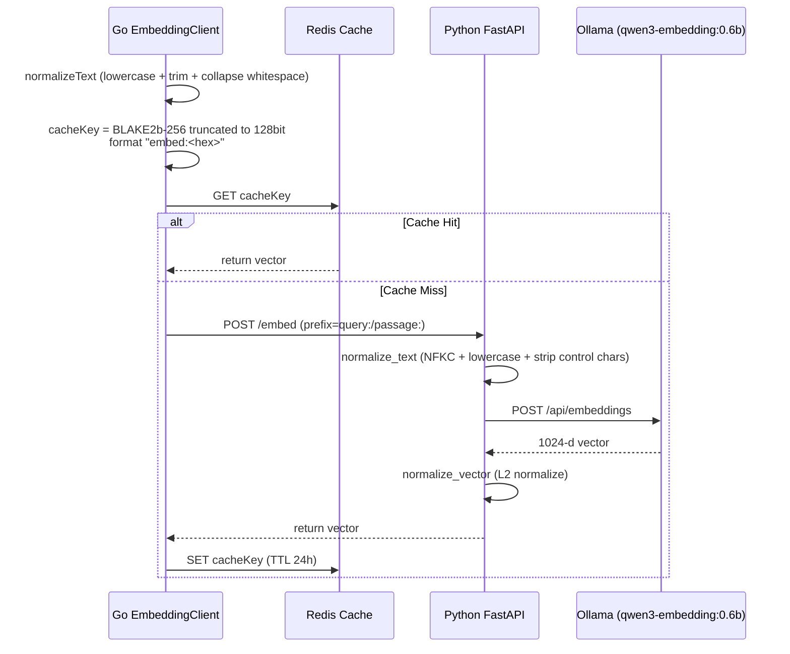
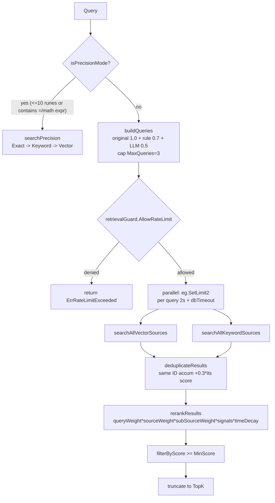
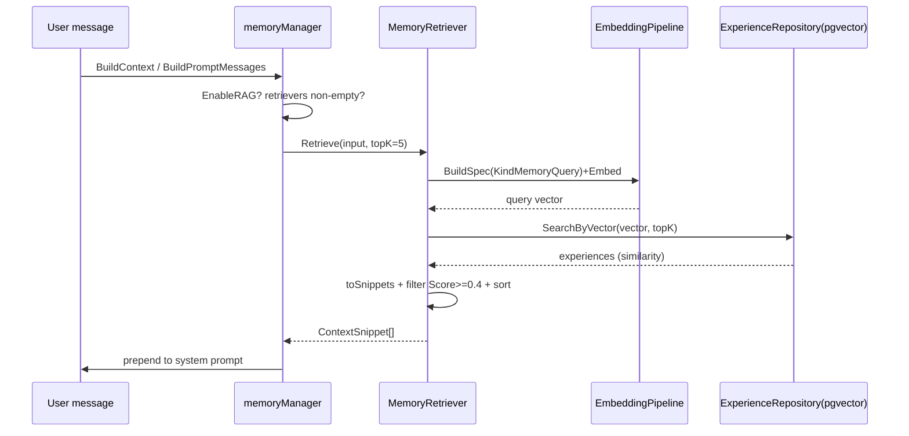

# ares Architecture Deep Dive (X): Retrieval System — Vector / Keyword / FTS in Practice, and Its Honest Limits (0.3.x)

> The agent says: "Based on your past experience, I suggest..." — but the suggestion is completely irrelevant.
> Even worse: the agent solved this exact problem before, but now it's starting from scratch.
> I realized back then: an agent's memory isn't about whether it has memory — it's about whether it can retrieve the right one.
> An agent without retrieval is a goldfish: 7-second memory, forever reinventing the wheel.

> Note: this article is based on real code (the full retrieval pipeline under `internal/storage/postgres/services`, the vector/keyword repository layer under `internal/storage/postgres/repositories`, the RAG recall in `internal/ares_memory/context/memory_retriever.go`, the experience ranking in `internal/ares_experience/ranking_service.go`, and FTS5/keyword search in `internal/ares_skills`). Every symbol and every flow below is something I actually read in this codebase. Anything that is "configured but not actually wired" or that I'm not sure about is marked （待核实） — I won't oversell it.

---

## 1. First, Why Retrieval Determines Agent IQ

There's a brutal truth about building agents: **No matter how powerful the model, if you feed it the wrong context, the output is garbage.**

No matter how capable the model is, if I feed it wrong documents, irrelevant experience, or outdated knowledge, the output is something that sounds reasonable but is actually nonsense. That's worse than saying "I don't know" — because the user will trust it.

Retrieval has a plain goal: pull genuinely useful context into the LLM at the right time, from the right place, with the right weights. The hard part is defining and ordering what "relevant" means — semantically relevant, literally relevant, or "previously proven to solve this problem"? Different data calls for different answers. ares' approach is not "vector database for everything": it splits data by type and lets each use the retrieval it's good at. This article makes clear what is actually running and what isn't.

---

## 2. Off the Bat: What Retrieval Path Actually Runs at Runtime? (An Honest Correction)

The previous version of this article claimed that "the hybrid `RetrievalService` was written but never wired (the `advancedRetrieval` field is forever nil in the API layer), and only a pure-vector `SimpleRetrievalService` is in use." After actually reading the code, **that claim is backwards.** Correction:

- **There is no `api/retrieval/service.go`**. The packages in the `api/` tree (`api/embedding`, `api/experience`, `api/knowledge`, `api/discovery` etc.) are now deprecated forwarding layers over their `internal/` counterparts (M5 internalization: `api/embedding`→`internal/embedding`, etc.) — **there is still no retrieval package**. Both retrieval services live under `internal/storage/postgres/services/`.
- **The service actually wired into production is `RetrievalService`, not `SimpleRetrievalService`**. `internal/ares_memory/production_manager.go` constructs it via `services.NewRetrievalService(...)`, and `internal/ares_memory/production_manager_tasks.go` calls `retrievalService.Search(...)` in `ProductionMemoryManager.SearchSimilarTasks(ctx, query, limit)` at real runtime.
- **`SimpleRetrievalService` is the one that is defined but never called by any non-test code.** Grepping `NewSimpleRetrievalService` across the repo only finds its own definition file — no callers. （待核实: I found no production wiring for it.)
- There is also a separate, genuinely wired **RAG vector-recall path**: `internal/ares_bootstrap/retriever_wiring.go`'s `wireRetrievers` injects a `MemoryRetriever` (vector search over distilled experiences) and a `KnowledgeRetriever` (hybrid search over AKG facts) into the MemoryManager, triggered through `manager_rag.go`'s `runRetrieval` when `EnableRAG=true`.

So: **runtime vector retrieval does exist.** Here are the three real paths:

| Path | Entry | Data | Method | Wired at runtime |
|------|-------|------|--------|-----------------|
| Hybrid retrieval | `RetrievalService.Search` (via `SearchSimilarTasks`) | mainly experiences | vector + keyword hybrid + score | ✅ yes |
| RAG experience recall | `MemoryRetriever.Retrieve` (via `runRetrieval`) | distilled experiences | vector + minScore filter | ✅ yes |
| RAG knowledge recall | `adapter.KnowledgeRetriever` (AKG) | AKG-distilled facts | hybrid search | ✅ yes |
| Pure vector | `SimpleRetrievalService.Search` | knowledge | pure vector + precision mode | ❌ no callers |

> Note `SearchSimilarTasks` only enables experience search: `SearchExperience=true, SearchKnowledge=false, SearchTools=false`, and production passes `toolRepo=nil`. So the wired hybrid path's **scope is effectively converged on experience** (vector + ILIKE keyword).

---

## 3. The Embedding Pipeline: Text → 1024-D Vector

Whatever the retrieval path, the first step is turning text into a vector. ares is a three-layer chain: Go (`internal/storage/postgres/embedding`) → Python FastAPI (`services/embedding/app.py`) → Ollama (`qwen3-embedding:0.6b`).

Model & dimensions (`services/embedding/app.py`):
- `OLLAMA_MODEL = "qwen3-embedding:0.6b"` (overridable via env)
- `EMBEDDING_DIM = 1024`
- `MAX_LENGTH = 512` (truncated after prefixing)
- `CACHE_TTL = 86400` (24 hours)



Key points, all verified:

**1. Two-layer text normalization.** The Go side `EmbeddingClient.normalizeText` does lower + trim + collapses runs of whitespace to a single space; the Python side `normalize_text` first does `unicodedata.normalize('NFKC')`, then lowercase, strip, `re.sub(r'\s+',' ')`, and drops control chars. Why two layers? Because `strings.ToLower` (Go) and `str.lower()` (Python) differ on some Unicode characters, and dual-layer normalization cuts cache-miss explosions (`client.go` comment: "avoid cache miss explosion").

**2. The cache key.** Go's `getCacheKey` uses `blake2b.Sum256` truncated to the first 16 bytes (128 bits), prefixed `embed:`, built from `normalizedText|model|prefix`. Note: it is **not** a "BLAKE2b-128" algorithm — it is BLAKE2b-256 with the first 16 bytes kept. The Python side does not share this key scheme (it uses `sha256`), so the Go and Python caches are independent.

**3. Prefix.** Search queries use the `query:` prefix, document/experience storage uses `passage:` (`client.go`: `Embed` defaults to `query:`; `EmbedWithPrefix` passes explicitly). This is the common e5-style trick that keeps queries and passages in the same direction. （待核实: which exact prefix the `experiences_1024` write path uses is decided by the distillation chain; I did not trace every hop to the app side.)

**4. L2 normalization.** The Python side `normalize_vector` divides by `np.linalg.norm` to make the vector unit-length — the comment notes "Ollama does not guarantee returned vectors are unit vectors". This makes cosine distance meaningful downstream.

**5. Redis-first caching.** `EmbeddingClient.redis` is optional (nil means skip the cache and call the service directly). There is also an `EmbeddingCache`/`MemoryCache` (`cache.go`) with in-process memory fallback and a periodic cleanup goroutine, **but the production wiring uses `NewEmbeddingClient` talking to Redis directly** （待核实: I did not see `EmbeddingCache` injected in `production_manager`; it may or may not be attached in some boot).

---

## 4. Vector Retrieval (the one that actually runs): pgvector + IVFFlat Cosine

Vector retrieval does not query a standalone vector DB — it uses the **pgvector extension with tables in the same PostgreSQL**.

Tables (`migrate_storage.go`):
- `knowledge_chunks_1024` — knowledge chunks
- `experiences_1024` — distilled experiences (the `embedding` column is **nullable**, backfilled by an async worker)

Indexes are IVFFlat (`vector_cosine_ops`): `idx_knowledge_1024_embedding`, `idx_experiences_1024_embedding`. These are approximate, bucket-based (`lists`) cosine indexes.

The actual query (`repositories/experience_repository.go` `SearchByVector`):

```sql
SELECT id, tenant_id, type, input, output,
       1 - (embedding <=> $1::vector) as similarity
FROM experiences_1024
WHERE tenant_id = $2
  AND (decay_at IS NULL OR decay_at > NOW())
  AND embedding IS NOT NULL
ORDER BY embedding <=> $1::vector
LIMIT $3
```

- `embedding <=> $1::vector` is **cosine distance**, in [0,2]; `1 - distance` yields **similarity ∈ [-1,1]** (per the code comment). The default `Score` is just a passthrough of this similarity.
- Explicit `embedding IS NOT NULL`: the column is nullable and IVFFlat does not index NULL, so this filters out not-yet-backfilled rows before the scan.
- Expired `decay_at` rows never appear.
- **In RAG, each snippet's `Score` comes from distillation confidence** (`MemoryRetriever.toSnippets`: `scoreutil.ClampUnit(exp.Confidence)` clamped to [0,1]) — not the SQL similarity above. These are two different score semantics.

`knowledge_repository.go`'s `SearchByVector` likewise uses `1 - (embedding <=> $1::vector)`, and only searches rows with `embedding_status='completed'`.

---

## 5. Keyword Retrieval: PostgreSQL FTS, Not BM25

The old article hyped the keyword side as "BM25". **In the code there is no BM25.** On the knowledge side, keyword search is PostgreSQL full-text search using `ts_rank + plainto_tsquery('simple', ...)` (`knowledge_repository.go` `SearchByKeyword`), over the `tsv` column maintained by the `tsvector_update_knowledge_1024` trigger:

```sql
SELECT ..., ts_rank(tsv, plainto_tsquery('simple', $1)) as score
FROM knowledge_chunks_1024
WHERE tsv @@ plainto_tsquery('simple', $1)
  AND tenant_id = $2 AND embedding_status = 'completed'
ORDER BY ts_rank(...) DESC
LIMIT $3
```

On the experience side it is even simpler — `experiences_1024`'s `SearchByKeyword` uses **ILIKE substring matching** (with escaping), ordered by `score DESC, created_at DESC`. So experience keyword search is really "substring hit + sort by existing score", not BM25.

> Bottom line: **the keyword layer = PostgreSQL FTS (knowledge) + ILIKE substring (experience)**. Wherever the old text says BM25, that was stale comment language, not the current implementation. I'll phrase it as "keyword / full-text" from here on.

---

## 6. The Hybrid Retrieval `RetrievalService`: the One Wired into Production

Entry `RetrievalService.Search(ctx, *SearchRequest) -> []*SearchResult`. Overall flow:



### 6.1 Query rewriting (buildQueries)
`buildQueries` builds a weighted query group (`retrieval_rewrite.go`):
- original weight `OriginalWeight=1.0`
- rule-based (synonym) rewrite `RuleRewriteWeight=0.7`
- LLM rewrite `LLMRewriteWeight=0.5`
- total capped by `MaxQueries=3`

Rewrite gating (`shouldRewriteQuery`): skip when `len(query)<10`; only rewrite on complex semantic patterns ("如何/怎么/什么/why/what/how/explain/描述" etc.); also skip when `queryCache` (TTL 10min, cap 500) hits.

LLM rewrite (`llmBasedRewrite`, skipped if `llmClient` nil/disabled):
- 30s timeout; `parseLLMResponse` splits lines and takes **at most the first 3 lines**
- `validateRewrites` uses `calculateSimilarity` (actually a **Jaccard word-overlap**) to drop rewrites with similarity < **0.6**, longer than **2×** the original, or empty
- `uniqueRewrites` dedupes, then caps at `maxLLMRewrites=2`

Rule rewrite (`ruleBasedRewrite`): goes through `loadSynonymRules` reading `configs/synonyms.yaml` (env `SYNONYM_CONFIG_PATH` can redirect; built-in defaults cover), using `replaceCaseInsensitive` to swap matched synonym keys.

### 6.2 Precision mode (isPrecisionMode)
Trigger conditions (`retrieval_service.go`):
- `utf8.RuneCountInString(query) <= 10` (rune count, Unicode-safe)
- contains `=` or `:`, or a **digit-adjacent math expression** like `\d+\s*[+*/]\s*\d+` (`-` is deliberately excluded to avoid `go-agent`; `+*/` need digit adjacency to avoid `C++`, `*args`)

In precision mode, `searchPrecision` runs the strict order: **Exact (`SearchBySubstring`, fixed score 1.0) → Keyword (FTS) → Vector (fallback)**.

### 6.3 Parallelism & timeouts (searchSingleQuery)
Each weighted query runs via `errgroup.SetLimit(2)` (vector + keyword in parallel), wrapped in `context.WithTimeout(ctx, 2s)`, then layered with `retrievalGuard.WithDBTimeout`. The vector branch first checks `embeddingClient.IsEnabled()` and the embedding circuit breaker; if the breaker is open it degrades to keyword-only.

### 6.4 Merge & rerank (mergeAndRerank → rerankResults)
`rerankResults` is the single scoring entry point; the formula is **multiplicative**:

```
Score = baseScore · QueryWeight · [SourceWeight, only when multi-source] · SubSourceWeight · Signals · TimeDecay
```

- **QueryWeight**: original 1.0 / rule 0.7 / LLM 0.5
- **SourceWeight** (`sourceWeight`): knowledge 0.4 / experience 0.3 / tool 0.2 / task_result 0.1; **applied only when `activeSources>1`** — skipped for single-source
- **SubSourceWeight** (`subSourceWeight`): vector 1.0 / keyword 0.8
- **Signals** (`applySourceSignals`, experience-focused): success=1.2, failure=0.7, execTime<1s=1.2, execTime>5s=0.8, reuse_count>3=1.1, has lessons=1.05; tool-side requires_auth=0.9, successRate>0.8=1.1, successRate<0.5=0.8
- **TimeDecay** (`calculateTimeDecay`): `e^(−0.01 × ageHours)`, with a floor of **0.1**

Dedup `deduplicateResults`: merge by `ID`, and on repeat hit `existing.Score += result.Score * 0.3` — the "multi-route hit" signal, so content hit by multiple queries/paths scores higher.

> Note: `SearchSimilarTasks` sets the plan to experience-only. In that case `ExperienceRankingEnabled` routes through `applyExperienceRanking` (experience rerank, next section); the generic multi-source rerank above serves full-source searches.

---

## 7. Experience Recall & Ranking: RankingService and MemoryRetriever

For "find related memory", there are two code paths:

### 7.1 RankingService (`internal/ares_experience/ranking_service.go`)
`Rank` takes a batch of `*Experience` plus matching `baseScores` (semantic scores) and returns them sorted by FinalScore descending:

```
FinalScore = SemanticScore + UsageBoost + RecencyBoost + exp.Score
```

Note this is **additive**, unlike the retrieval service's multiplicative formula:
- `SemanticScore` = the similarity from vector search (default 0.5 when missing)
- `UsageBoost = min(log1p(UsageCount) × 0.05, 0.2)`
- `RecencyBoost = exp(−ageDays/30) × 0.05` (30-day half-life)
- `exp.Score` = the persisted reinforcement signal (bandit feedback, written by `RecordFailure` etc.)

Configured weights: `UsageWeight=0.05`, `RecencyWeight=0.05`, `RecencyDays=30` (`DefaultRankingWeights`, tunable via `Configure`).

Inside `RetrievalService.Search`, `applyExperienceRanking` (`retrieval_search.go`) calls `rankingService.Rank`, then uses `conflictResolver.Resolve` for conflict groups, then writes `FinalScore` back onto `exp.Score` so the ranked score propagates to results — the code comment explicitly warns: without writing it back, rerank would re-sort on near-zero raw scores and `filterByScore` would drop experience results whenever `MinScore>0`, so the ranking feature would never surface its scores.

### 7.2 MemoryRetriever (RAG, `internal/ares_memory/context/memory_retriever.go`)
This is the context-augmentation path: `Retrieve(input, topK)`:
1. Empty input short-circuits to empty
2. `topK<=0` → `DefaultTopK=5`
3. embed the query (via `EmbeddingPipeline`, `KindMemoryQuery`)
4. `expRepo.SearchByVector` (the experience repo's pgvector)
5. `toSnippets` builds `ContextSnippet`; `Score = ClampUnit(exp.Confidence)`
6. `filterByMinScore`: keep only **`Score >= minScore`**; `minScore<=0` → `DefaultMinScore=0.4`
7. `SortSnippetsByScore` descending, then truncate to topK

Embeds that fail do **not** silently fall back to keyword (code comment: `does not silently fall back to keyword search`) — it returns an error. This is a deliberately different trade-off from `RetrievalService` (which degrades to keyword on breaker-open).

`manager_rag.go`: `retrieveContextString` / `retrieveForPrompt` → `runRetrieval` (reads `EnableRAG`, `RAGTopK`, `RAGMinScore`, wakes the retrievers) → `memctx.RunRetrieval` (applies the canonical `DefaultTopK`/`DefaultMinScore` normalization). Retrieval is best-effort: on failure it only `log.Warn`s and never interrupts the chat loop.



---

## 8. Skills Retrieval: Discovery Keyword + FTS5 (Another "Find Something" Chain)

Retrieval isn't only vectors. Skill/capability discovery is a pure-text affair (see the Capability Fabric in article 28 of this series); here I align only the two real retrieval primitives (`internal/ares_skills`):

**1. Keyword scoring (`discovery.go` `keywordSearch` + `matchScore`)**
- `splitTerms` lower-cases, whitespace-splits, strips punctuation, dedupes
- `matchScore` counts how many query terms hit an entry's ID/Name/Keywords/Capabilities/Description, +1 per hit
- Sort: score desc, then ID asc for determinism
- Only entries with score>0 are returned; `limit<=0` returns all

**2. FTS5 (`fts5.go` + `discovery.go` `SetFTS5`)**
- `FTS5Index` is an **in-memory SQLite FTS5** index (`sql.Open("sqlite", ":memory:")` with the modernc driver), with a `skills_fts` virtual table over id/name/description/keywords
- `Search(query, limit)` runs `WHERE skills_fts MATCH ? ORDER BY rank LIMIT ?`
- `Discovery.Search` prefers FTS5 when attached and query non-empty; **on FTS5 error or no match it falls back to `keywordSearch`** (`types.go` comment: FTS5 augments, not replaces)

**3. Experience priors `Experience.BestMatch` (`experience.go`)**
`Experience` remembers `{skill, task_pattern, success_rate}` priors (a Learning source — it only biases ranking, **never auto-executes skills**). `BestMatch(taskPattern)` returns the highest-success-rate match:
- short patterns (<4 tokens, e.g. the fallback `agent_top`) use **substring containment**, scoring 1.0 on hit
- long patterns are scored by **token-overlap ratio**; below `matchScoreThreshold=0.5` it's not a match (so two verbose descriptions sharing one incidental word don't spuriously match)
- `maxPatternLength=256` (runes) truncates patterns to keep `experience.json` compact

`ExperienceConfidenceSource` bridges these priors into a `taskfabric.ConfidenceSource` for the Kernel Scheduler (covered in detail in article 28).

---

## 9. Gating & Degradation

`RetrievalGuard` (`internal/storage/postgres/retrieval_guard.go`) wraps retrieval in three protections, constructed in `production_manager.go` as `NewRetrievalGuard(100, 5, 30s, 30s)`:

| Protection | Implementation | Behavior |
|------------|----------------|----------|
| Rate limit | `golang.org/x/time/rate`, `100 req/s` | `AllowRateLimit` returns `ErrRateLimitExceeded` when exceeded |
| Circuit breaker | `CircuitBreaker`, failure threshold 5, 30s to half-open | targets embedding; `CheckEmbeddingCircuitBreaker`; open → degrade to keyword-only |
| DB timeout | `WithDBTimeout` (30s) | queries past 30s are abandoned |

On the embedding side there is also a `FallbackClient` (`embedding/fallback.go`) with three `FallbackStrategy` values: `FallbackToCache` / `FallbackToKeyword` (returns `ErrEmbeddingFailed` to trigger keyword) / `FallbackToError`. （待核实: whether `FallbackClient` is actually mounted in some production path; production retrieval uses `NewEmbeddingClient` + `EmbeddingPipeline` directly, and I did not see the fallback injected — I lean toward "direct call, fail on error".)

---

## 10. Honest Reckoning: What Was Cut, What Remains

Comparing against the old article, the corrections land on three axes:

1. **"Advanced retrieval unwired, pure-vector in production" is wrong**: in reality `RetrievalService` is wired through `SearchSimilarTasks` (scope converged on experience), and `SimpleRetrievalService` has no callers.
2. **There is no `api/retrieval/service.go`**: both services live under `internal/storage/postgres/services/`.
3. **The keyword layer is not BM25**: knowledge is PostgreSQL `ts_rank` full-text; experience is ILIKE substring.

The old "four-domain split (Knowledge/Experience/Tools/TaskResults at 0.4/0.3/0.2/0.1) + pure-vector-DB comparison + 1024-D cosine 0.7–0.8 examples + recall@k / similarity thresholds" — **except the numbers with real sources that I kept** (sourceWeight 0.4/0.3/0.2/0.1, minScore 0.4, TopK 5/10, Jaccard 0.6, timeDecay 0.01/0.1, etc.) — **has no corresponding code and is dropped.** In particular: **there is no `recall@k` / normalized-embedding similarity threshold (like 0.7–0.8) population metric anywhere in the code**, so I give no pure-vector recall numbers and no "decays to 78% at 1 day / 18% at 7 days / 0.1 floor" table derived from assumption. The real artifact is `e^{-0.01·ageHours}` with a 0.1 floor.

**Does runtime vector retrieval exist? Yes.** It's not "keyword only" — both `RetrievalService` (hybrid) and `MemoryRetriever` (RAG) are real, wired pgvector vector paths, plus the AKG knowledge hybrid retrieval; all are running.

The only genuinely unwired pieces left are `SimpleRetrievalService` (no callers) and `FallbackClient` (待核实 whether it's mounted).

---

## 11. Summary

ares' retrieval system in one line: **a real hybrid retrieval pipeline (vector + FTS + keyword) runs directly in production, plus a separate RAG vector recall feeds experience into the LLM, skill discovery runs on keyword + SQLite FTS5 — while the pure-vector service sits idle in its box.**

Key design points (all with real code sources):

1. **Embedding pipeline** — Go→Python→Ollama, `qwen3-embedding:0.6b`, 1024-d, L2-normalized; Go BLAKE2b-256 truncated to 128-bit cache key, Redis 24h TTL
2. **Vector retrieval** — pgvector `<=>` cosine + IVFFlat, `1 − distance` → similarity ∈ [-1,1], tables `knowledge_chunks_1024` / `experiences_1024`
3. **Keyword retrieval** — actually PostgreSQL `ts_rank` (knowledge) + ILIKE substring (experience), not BM25
4. **Hybrid retrieval** — `RetrievalService.Search`; Query/source/subsource weights × signals × time decay (`e^{−0.01h}`, floor 0.1), multi-route dedup +0.3, precision mode (≤10 runes / contains `=` or digit-adjacent math op)
5. **Experience ranking** — `RankingService` additive `Semantic + min(log1p·0.05,0.2) + e^{−days/30}·0.05 + rawScore`, `ConflictResolver` merges conflict groups
6. **RAG recall** — `MemoryRetriever`, `DefaultTopK=5`, `DefaultMinScore=0.4`, no silent keyword fallback on embed failure
7. **Gating** — RateLimiter 100/s + circuit breaker + 30s DB timeout

Agent IQ ≈ the quality of its context. And ares' premise is plain: get retrieval running and running correctly before tuning the fancy stuff.

---

> Information is not power. Retrieval is. — this line now has real code behind it.

**Next post:** no definite next one (the series is spread by module; article 28 covers Skills/FTS5 in depth). If there's a module you'd like to go deep on, just say so.