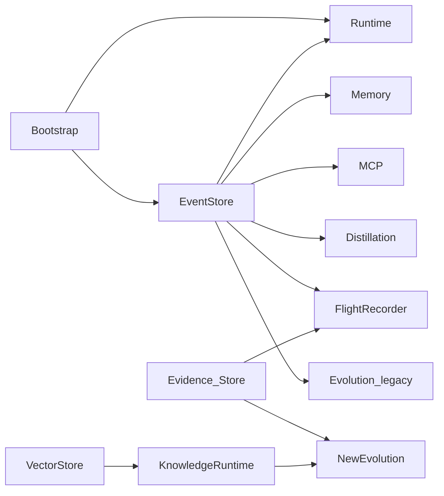
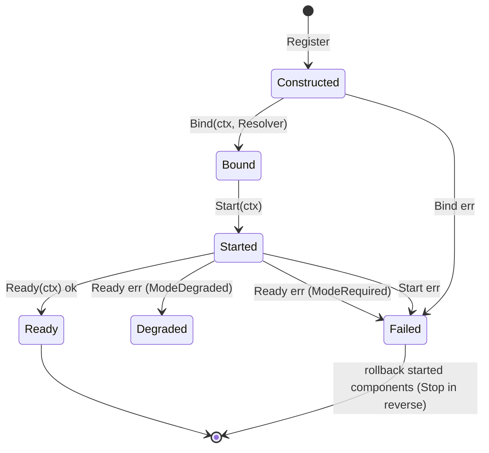
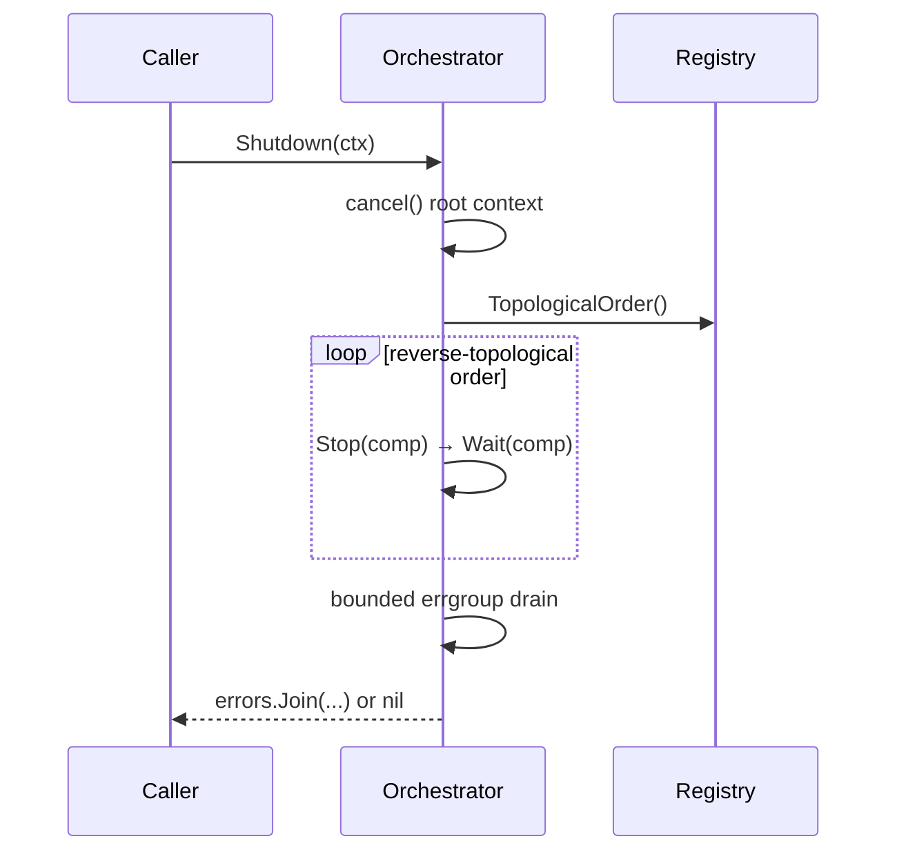

# ares Architecture Deep Dive (XIII): Bootstrap & System Runtime — Wiring as a Readable Sequence (0.3.x)

> 0.3.x update: `internal/ares_bootstrap.Bootstrap` is the single wiring hub. It assembles EventStore, Runtime, Memory, MCP, Skills, LLM, Distillation, AKG, Observability, NewEvolution, FlightRecorder, Evolution, GA, Discovery, and SystemRuntime in a fixed, meaningful order. The System Runtime (`internal/system_runtime.Orchestrator`) runs **Construct → Bind → Start → Ready** on startup in topological order and **Stop → Wait** in reverse topological order on shutdown (bounded by a 30s budget). The entry point is `Bootstrap(ctx, cfg, deps)` — not `New`, and there is no `DefaultConfig()`.

Every framework hits the moment when the user's first question shifts from "how do I call an LLM?" to "how do I wire all this together?" That's the moment you need a bootstrap.

Older docs described starting ares as creating a handful of objects by hand and passing references around. The snippet below is **illustrative, not real repo code** (historical narrative, unverified):

```go
// ⚠️ Illustrative only — NOT actual repo code (historical narrative, unverified)
eventStore := events.NewMemoryEventStore()
memMgr, _ := memory.NewMemoryManager(memory.DefaultMemoryConfig())
llmClient, _ := llm.NewClient(llm.Config{...})
rt := runtime.New(runtime.Config{...}, eventStore, memMgr)
rt.Start(ctx)
```

The *idea* of manual wiring still holds — miss one dependency and every call site follows. But the real solution is not a container with magic. It's **one function that explicitly turns config into a component graph**.

In today's `internal/ares_bootstrap`:

```go
comp, err := ares_bootstrap.Bootstrap(ctx, cfg, &ares_bootstrap.BootstrapDeps{...})
```

```go
// internal/ares_bootstrap/bootstrap.go
func Bootstrap(ctx context.Context, cfg *ares_config.Config, deps *BootstrapDeps) (*Components, error)
```

`cmd/ares/serve.go` is the caller: it builds an archive-enabled EventStore and injects it via `deps`; Bootstrap does the rest (serve.go, ~line 168). `cfg` comes from `ares_config.Load(path)` (config details unverified, but the `Config` struct is real — see below).

---

## The Problem: Dependency Hell, Solved With Explicit Code

Dependencies in `internal/ares_bootstrap` are not guessed — a `BootstrapDeps` struct receives the **optional** external deps:

```go
type BootstrapDeps struct {
	EventStore ares_events.EventStore
	ExpRepo    repositories.ExperienceRepositoryInterface
	LLMClient  ares_eval.LLMClient
}
```

Anything not supplied here is built in default form inside `Bootstrap` (e.g. an in-memory EventStore). This is the opposite of a DI framework (Wire/Dig/fx): **no generated files, no reflection.** The wiring order is written out in the `Bootstrap` body, top to bottom, readable and debuggable.

The dependencies are not a fictional pyramid — they are the real data flow inside `Bootstrap`:



---

## Bootstrap: From Config to Component Graph, In Order

The assembly order in `Bootstrap` is **meaningful** — downstream components are built after their upstream. The real sequence (indented lines denote dependencies):

| Step | Function / Provider (real symbol) | Writes to `comp.` | Gate / semantics |
|---|---|---|---|
| 1 | `deps.EventStore` or `ares_events.NewMemoryEventStore()` | `EventStore` | in-memory default |
| 2 | `ProvideRuntime(eventStore)` → `ares_runtime.New(nil, eventStore, nil)` | `Runtime` | always created |
| 3 | `wireMemory(cfg, eventStore)` → `ProvideMemory(memCfg)`; `mem.SetEventStore(eventStore, "memory")` | `Memory` | gated by `cfg.Memory.IsEnabled()` |
| 4 | `ProvideMCP(ctx, cfg.MCP)` → `ares_mcp.NewMCPManager` + `.Start(ctx)` | `MCP` | minimal when no servers |
| 4b | `wireSkills(ctx, mem, mcp)` | `SkillsRegistry`, `SkillCatalog` | best-effort |
| 5 | `ProvideLLM(cfg.LLM)` (or `deps.LLMClient`) | `LLM` | callback registry + CostDashboard + Prometheus tracer |
| 5b | `wireDistillation(...)` → `provideDistillation(...)` | `Distillation`, `ExpRepo` | gated by `Memory.DistillationEnabled()` + PG + Embedding |
| 5c | `wireAKGLoop(cfg, deps, embClient)` | `KnowledgeStore`, `AKGBridge` | gated by `cfg.Knowledge.RetrievalEnabled` |
| — | `subscribeDistillationEvents(ctx, &comp)` | (background) | subscribes to TaskCompleted/Failed |
| 6 | `ProvideObservability(tracer, feedbackStore, globalTracer)` | `Observability`, `Dashboard` | shared tracer/feedback/spans |
| 7 | `BuildKnowledgeRuntime(vecStore, emb, knowStore)` | `KnowledgeRuntime` | best-effort provider registration |
| 8 | `buildEvolutionDAG` + `wireNewEvolution` → `ProvideNewEvolution(dag, rt, memStore, evStore)` | `NewEvolution`, `EvidenceStore` | gated by `cfg.Evolution.Enabled` |
| — | `flight.NewFlightRecorder` + `.Start(ctx)` | `FlightRecorder` | shared singleton |
| — | `wireLegacyEvolution` → `ProvideEvolution(...)` | `Evolution` | gated by Enabled + deps present |
| — | `wireRetrievers(...)` | (injects into Memory) | best-effort |
| — | Deployment pipeline → `SetDeployer` | (injects into Coordinator) | gated by `cfg.Evolution.Deployment.Enabled` |
| 9 | `wireGAEvolution(ctx, cfg, comp, newEvol, guidanceProvider)` | (GA + ticker + lifecycle) | gated by `cfg.Evolution.Enabled` |
| 10 | `ProvideDiscovery(ctx, &cfg.Discovery, comp.EventStore)` | `Discovery` | `ErrDiscoveryDisabled` = off |
| 11 | `wireSystemRuntime(ctx, cfg, &comp)` | `SystemRuntime`, `SystemRegistry` | observational registration |
| — | `startExpiryCleanupWorker(ctx, &comp)` | (background) | no-op when no cleaners |

Key truths:

- **Failure policy is deliberately non-uniform.** Some failures are fail-loud (a configured Postgres that can't connect makes the evidence store call `runCleanups()` and return an error); others are best-effort (distillation, skills, observability degrade gracefully). `Bootstrap` keeps a `cleanups []func()` slice and, on any error, releases already-built components **in reverse creation order**.
- **Config gates are honored.** E.g. with `cfg.Evolution.Enabled=false`, neither `NewEvolution` nor the GA ticker nor the LLM-suggestion ticker is constructed — components don't start "behind the config's back".

`Components` is the container — **not `ARES`, it's `Components`**:

```go
// internal/ares_bootstrap/bootstrap.go — excerpt
type Components struct {
	MCP          *ares_mcp.MCPManager
	Dashboard    *ObservabilityProviders
	LLM          *LLMComponents
	Evolution    *EvolutionComponents
	NewEvolution *NewEvolutionComponents
	Runtime      *ares_runtime.Manager
	Memory       ares_memory.MemoryManager
	EventStore   ares_events.EventStore
	Distillation *aresexp.DistillationService
	SkillsRegistry *skills.Registry
	SkillCatalog   *ares_skills.Catalog
	KnowledgeRuntime *knowledgeruntime.KnowledgeRuntime
	VectorStore     storage.VectorStore
	KnowledgeStore  knowledge.KnowledgeStore
	AKGBridge       *adapter.DistillBridge
	FlightRecorder  *flight.FlightRecorder
	ExpRepo         repositories.ExperienceRepositoryInterface
	EvidenceStore   evidence.Store
	SystemRuntime   *system_runtime.Orchestrator
	SystemRegistry  *system_runtime.Registry
	Observability   *ObservabilityComponents
	ExpiryCleaners  []NamedExpiryCleaner
	// ...
}
```

The container also exposes read helpers: `Snapshot()`, `ComponentStatus(name)`, `IsSystemReady()` (all backed by `SystemRegistry`, returning safe empty values when unwired).

---

## The Providers: They Actually Exist

`internal/ares_bootstrap` isn't just `Bootstrap` — it's a family of `Provide*` functions, one per big component. All of these are real symbols I read in the source (module prefix `github.com/Timwood0x10/ares`):

| Provider (real signature) | Produces | Notes |
|---|---|---|
| `ProvideRuntime(eventStore) (*ares_runtime.Manager, error)` | Runtime | `ares_runtime.New(nil, eventStore, nil)` |
| `ProvideMemory(cfg) (ares_memory.MemoryManager, error)` | Memory | `cfg==nil` → `DefaultMemoryConfig()` |
| `provideDistillation(ctx, cfg, llmClient) (*distillationWiring, error)` | distillation wiring | returns `{pool, embeddingClient, experienceRepo, service, guidanceProvider, embeddingQueue, embeddingConfig}` |
| `ProvideMCP(ctx, cfg) (*ares_mcp.MCPManager, error)` | MCP | `NewMCPManager` + `Start` |
| `ProvideLLM(cfg) (*LLMComponents, error)` | LLM | `llm.NewClient` + callbacks + `CostDashboard` |
| `ProvideObservability(tracer, feedback, spans) (*ObservabilityProviders)` | Dashboard | `IntrospectOptions()` feeds introspect |
| `ProvideNewEvolution(dag, rt, memoryStore, evStore) (*NewEvolutionComponents, error)` | NewEvolution | registers Genome/Diff/Patch Registries + Coordinator |
| `ProvideEvolution(ctx, cfg, eventStore, expRepo, llmClient, fr) (*EvolutionComponents, error)` | legacy Evolution | non-nil only when all deps present |

`NewEvolutionComponents` exposes `UpdateLiveDAG(dag)`, `UpdateLiveKnowledgeRuntime(rt)`, `SetToolClassDAG(dag)` — serve injects the *real* runtime into the evolution system after agents are assembled (via in-place `SetDAG`/`SetGraph`, because `patch.Registry.Register` **cannot overwrite** an already-registered key).

**Honest reflection**: this is not a DI container, it's readable constructor orchestration. Want a Postgres event store? Build it and put it in `deps.EventStore`. Want a minimal offline config? Pass an empty `BootstrapDeps{}` and Bootstrap's defaults cover ~90% of cases. The rest, you call the `Provide*` functions directly.

---

## Skills Wiring (0.3.x)

Step 4b in `bootstrap.go` — `wireSkills(ctx, comp.Memory, mcp)` — is a piece of "invisible wiring": you call `Bootstrap()` and agents are born with a skill catalog. What it actually does (as I read it):

- `ares_skills.NewCatalog(CatalogConfig{...})` with declared sources `./.ares/skills` + `~/.ares/skills` plus directory/git/http sources from `LoadSkillSources("")`; `SetGitSources` / `SetHTTPSources`; `mcp != nil` → `SetMCPConnector(mcp)`.
- `SyncGitSources(ctx)` → `Build()` builds the index → `SeedRegistry(reg)`, injecting a `skills.NewRegistry()` into the memory manager via `setter.SetSkillsRegistry(reg)`.
- Returns `(*ares_skills.Catalog, *skills.Registry)`: the first gets a `Close` cleanup, the second is handed to the env-cap searcher so skills become searchable tool capabilities.
- The skill outcome recorder that used to subscribe to `EventSubTaskResult` here was removed as dead code (starved from the start — no emitter ever carried its expected payload shape, W8 / RUNTIME.md breakage #8); a TODO(tech-debt) marks the spot.
- Entirely best-effort: memory disabled / memory not exposing `SetSkillsRegistry` / index-build failure all log-and-skip rather than blocking startup.

> Note: earlier drafts of this article referenced `CatalogTools(skill_search/skill_load/...)`, `SetToolChangeHandler`, and `wireSkillCatalog` in `serve.go`. I could not verify those in `internal/ares_bootstrap` this time, so they're marked (unverified). The real skill-wiring entry is `wireSkills` above.

---

## The System Runtime Orchestrator (the 0.3.x star)

`Bootstrap`'s last step registers the assembled components into `system_runtime`, and the Orchestrator manages their lifecycle:

- `system_runtime.NewRegistry()`, then each constructed component is registered via `reg.Register(adapter, mode)` (adapter carries `deps`/`Stop`/`Wait`/`Ready` hooks).
- `system_runtime.NewOrchestrator(reg, rootCtx)`, `orch.SetEventSink(comp.EventStore)` (background component failures hit the event stream), and finally `orch.Start(ctx)`.

### Lifecycle: Startup

`Orchestrator.Start` runs **Construct → Bind → Start → Ready** per component, in topological order (dependencies become Ready first):



- `Construct` is already done at registration (`Bootstrap` built the instances); the Orchestrator runs Bind/Start/Ready.
- `Start` is not idempotent: calling it twice returns an error.
- On any failure the failing component is cleaned up first, then already-started components are rolled back in reverse order (via `stopComponent`).

Components participate through interface contracts:

| Interface (real symbol) | Method | Phase |
|---|---|---|
| `Component` | `Name()`, `Dependencies()` | global |
| `Binder` | `Bind(ctx, Resolver)` | Bind |
| `Starter` | `Start(ctx)` | Start |
| `ReadinessChecker` | `Ready(ctx)` | Ready |
| `Stopper` | `Stop(ctx)` | shutdown |
| `Waiter` | `Wait()` | shutdown |
| `Resolver` | `Get(name) any` | Bind resolves deps |

There are three Modes: `ModeRequired` (must reach Ready), `ModeOptional`, `ModeDegraded` (may run reduced, reporting the missing capability via `Ready`).

### Lifecycle: Shutdown

`Orchestrator.Shutdown(ctx)` is **reverse topological**: first `cancel()` the root context (waking every goroutine waiting on `RootContext().Done()`), then `Stop → Wait` in reverse order, then drain the errgroup under a bounded timeout. Three budgets live in the code (`stopTimeout`/`waitTimeout`/`overallShutdownTimeout`, all 30s):



- `Shutdown` is idempotent and safe to call concurrently; only the first call runs the sequence.
- Components that don't reach `Stopped` within budget are named in the returned error — a truncated teardown is visible, not silent.
- `Adopt(ctx, c, mode)` is **late admission** (K1: kernel pillars assembled later in serve): it runs only `Bind` + the `Ready` gate (NOT `Start`; the adopter owns startup). It returns `ErrShuttingDown` if called during a shutdown, and rejects components whose dependencies are unregistered or Failed (fail-loud).
- `GoBackground(name, fn)` is the unified wrapper for long-lived loops: a panic is recovered, recorded to the event sink, and marks the component `Failed` — but it never cancels the whole errgroup. One misbehaving loop does not tear down the process; teardown is driven by `Shutdown`.

### Registered components

`wireSystemRuntime` actually registers these (name + mode + dependencies):

| Name | Mode | Dependencies | Stop hook |
|---|---|---|---|
| `eventstore` | Required | — | — |
| `runtime` | Required | `eventstore` | `Stop()` |
| `memory` | Required | `eventstore` | `Stop(ctx)` |
| `mcp` | Required | — | `Stop(ctx)` |
| `llm` | Required | — | — |
| `evidence` | Required | — | — |
| `flight` | Required | `eventstore`, `evidence` | `Stop()` |
| `knowledge` | Required / **Degraded** (AKG write deps missing) | — | `Ready` reports error |
| `newevolution` | Required | `evidence` | — |
| `discovery` | Required | — | — |

`Registry.TopologicalOrder()` uses Kahn's algorithm. A declared-but-unregistered dependency, or a detected cycle, is fail-loud. `Registry.IsReady()` requires all `Required` components to be `Ready` (or `Degraded`) with no `Failed`. This is the core principle made real: **wiring is readable explicit data, not magic hidden in generated files.**

---

## Config Wiring

Configuration lives in `internal/ares_config`: `Load(path) (*Config, error)` (gate methods like `MemoryConfig.IsEnabled()` really exist). The `Config` struct carries `Server`, `LLM`, `Agents`, `Tools`, `Storage`, `Memory`, `Knowledge`, `MCP`, `Evolution`, `Embedding`, `Discovery`, `Kernel`, `Security` sections — Bootstrap reads each to decide which components to build and which to skip. The `IsEnabled` / `DistillationEnabled` / `RetrievalEnabled` / `Deployment.Enabled` gates are the switches behind the failure-policy table above.

---

## Module Logging & Event.ModuleName

Every package logs through a scoped logger. `internal/ares_bootstrap/log.go`:

```go
var log = logger.Module("ares_bootstrap")
```

`system_runtime` does the same (`log = logger.Module("system_runtime")`). So every Orchestrator state-transition line carries `module=system_runtime`, every Bootstrap line carries `module=ares_bootstrap` — at 3am, the logs tell you exactly which layer is speaking.

The event system does too: the `ares_events.Event` struct has a `ModuleName` field (`types.go`), written at `Append` time in `store.go`. An event says not only "what happened" but also "which layer did it".

---

## The Lesson

Bootstrap and the System Runtime aren't glamorous. They don't demo well. But they're the difference between a framework that's pleasant to use and one that makes you want to throw your laptop out the window.

The real strength is in the details: `Bootstrap` uses a `cleanups []func()` slice to tear down the failure path in reverse; `Orchestrator.Shutdown` uses bounded budgets so teardown can never hang forever; `patch.Registry` can't overwrite an already-registered key, so `UpdateLiveDAG` has to `SetDAG` in place. This is the real substance of "wiring."

**The best wiring is the wiring you can read, debug, and trace through the logs — step by step.** Wiring shouldn't be magic. It should be an explicit, ordered sequence. That's the whole point.