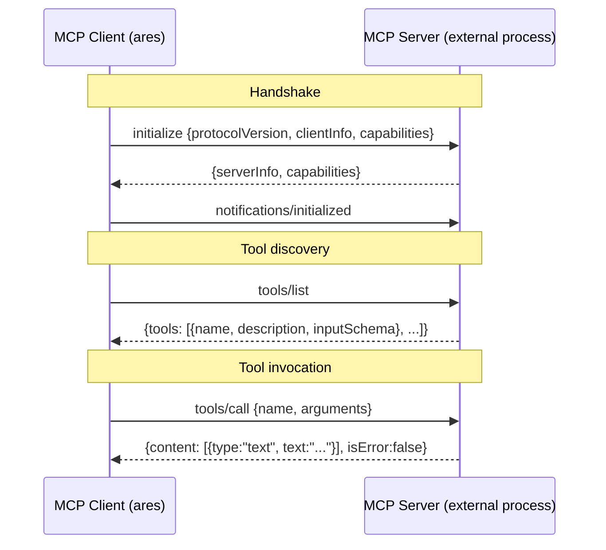
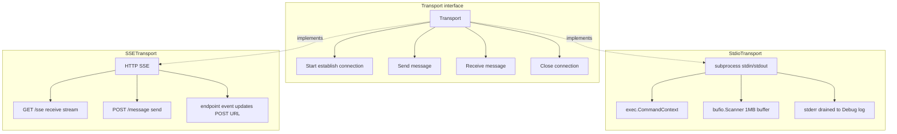
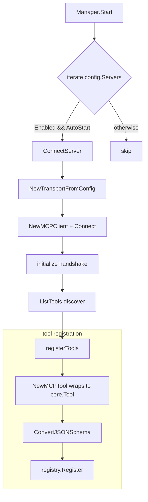
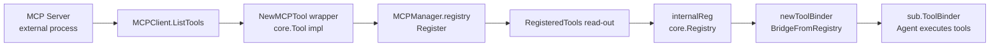

# ares Architecture Deep Dive (XV): MCP Integration — Teaching Agents to Use Tools (0.3.x)

The old way of giving an Agent a tool went like this: write a Go struct that implements the `core.Tool` interface, register it into the `Registry`, done. Every new tool meant writing code, compiling, and deploying again.

Then someone asked: "what if our users want to plug in *their own* tools without you writing any code?" The architecture had never considered "tools that come from outside."

This article, like the rest of this series, only talks about what I actually **read in `internal/ares_mcp/` and can show you source for**. Anything that doesn't line up with the code, I cut it or mark it （待核实） — I don't make things up.

## One: The Tool-Registration Problem

Tools were too tightly coupled to the framework. Everything was decided at compile time. Take `Calculator` from `internal/tools/resources/builtin/math/calculator.go` — it's pure Go:

```go
// internal/tools/resources/builtin/math/calculator.go
type Calculator struct {
	*base.BaseTool
	compiled map[string]*vm.Program
	mu       sync.RWMutex // guards the compiled cache
}

func NewCalculator() *Calculator {
	params := &core.ParameterSchema{ /* ... */ }
	return &Calculator{
		BaseTool: base.NewBaseToolWithCapabilities("calculator",
			"Evaluate mathematical expressions...",
			core.CategoryCore, []core.Capability{core.CapabilityMath}, params),
		compiled: make(map[string]*vm.Program),
	}
}

func (t *Calculator) Execute(ctx context.Context, params map[string]interface{}) (core.Result, error) {
	expression, ok := params["expression"].(string)
	if !ok || expression == "" {
		return core.NewErrorResult("expression is required"), nil
	}
	// evaluate via the expr library ...
	return core.NewResult(true, map[string]interface{}{"result": result}), nil
}
```

These are the exact type "sockets" the whole MCP integration plugs into:

- `core.Tool` / `core.Result` / `core.ParameterSchema` (`internal/tools/resources/core/`)
- `base.NewBaseToolWithCapabilities` (`internal/tools/resources/base/base_tool.go`)
- `core.Registry`'s `Register` / `Unregister` / `List` / `Get`

Tools defined, implemented, and registered all in Go. Want a new tool? Write code, compile, deploy. Want an external process to expose its own tools? Not possible back then.

Flip the question around and the answer is clear: instead of building a custom wheel inside the framework, use a **standard protocol** by which an external process declares what tools it has. That protocol is MCP (Model Context Protocol).

---

## Two: MCP — a practical case study in JSON-RPC 2.0

The core idea of MCP is simple: **an external process declares what tools it has, and the framework discovers and invokes them over a standard protocol.**

The protocol is JSON-RPC 2.0 in three steps:



In `internal/ares_mcp/jsonrpc.go` the message model looks like this:

```go
type JSONRPCMessage struct {
	JSONRPC string          `json:"jsonrpc"`
	ID      *int64          `json:"id,omitempty"`   // nil = notification
	Method  string          `json:"method,omitempty"`
	Params  json.RawMessage `json:"params,omitempty"`
	Result  json.RawMessage `json:"result,omitempty"`
	Error   *JSONRPCError   `json:"error,omitempty"`
}
```

The presence of `ID` decides the message type: with `ID` it's a request/response, without `ID` it's a notification. The helper predicates `IsRequest` / `IsResponse` / `IsNotification` / `IsError` all rely on exactly that.

`MCPClient.receiveLoop` dispatches incoming messages by type — responses go to their pending channel, notifications are handled asynchronously:

```go
// internal/ares_mcp/client.go
func (c *MCPClient) receiveLoop() error {
	for {
		msg, err := c.transport.Receive(c.ctx)
		// ...
		switch {
		case IsResponse(msg) || IsError(msg):
			c.dispatchResponse(msg)
		case IsNotification(msg):
			// each notification runs in its own goroutine, capped by notifySlots (max 8)
			select {
			case c.notifySlots <- struct{}{}:
				c.eg.Go(func() error {
					defer func() { <-c.notifySlots }()
					c.handleNotification(msg)
					return nil
				})
			default:
				// slots full: drop the notification, so a flooded server can't exhaust our memory
			}
		}
	}
}
```

"JSON-RPC is async by nature" isn't hype here: `call` generates an id via `IDGenerator` (atomic counter), stores a pending channel in a map keyed by id, and `select`s on a timeout context. The default timeout is `defaultClientTimeout = 30 * time.Second`, overridable per server in config.

One detail in `dispatchResponse` is worth mentioning: it delivers the response to the pending channel while holding the lock and relies on `delete(pending, id)` to avoid racing `Close()` — that's the crux of the thread-safety.

---

## Three: Transport layer — two paths, one interface

MCP doesn't care how a message travels — only the JSON-RPC wire format. Moving bytes from A to B is the Transport's job. `internal/ares_mcp/transport.go` defines a 4-method interface:

```go
type Transport interface {
	Start(ctx context.Context) error
	Send(ctx context.Context, msg *JSONRPCMessage) error
	Receive(ctx context.Context) (*JSONRPCMessage, error)
	Close() error
}
```



### 3.1 Stdio: the standard posture for local processes

An external tool starts as a subprocess; ares writes requests to stdin and reads responses from stdout:

```go
// internal/ares_mcp/transport_stdio.go
type StdioConfig struct {
	Command string            `yaml:"command" json:"command"`
	Args    []string          `yaml:"args" json:"args"`
	Env     map[string]string `yaml:"env" json:"env"`
	WorkDir string            `yaml:"work_dir" json:"work_dir"`
}
```

`Start` launches the process with `exec.CommandContext`. A trap I hit: `bufio.Scanner` defaults to a 64KB buffer, and a big schema (e.g. a server with dozens of tools) trips `token too long`. The fix is to bump the buffer:

```go
t.stdout = bufio.NewScanner(stdoutPipe)
t.stdout.Buffer(make([]byte, 0, stdoutBufferSize), stdoutBufferSize) // stdoutBufferSize = 1MB
```

`Send` has a write timeout (`stdioWriteTimeout = 10s`): if the subprocess stops reading stdin, `SetWriteDeadline` breaks the write — otherwise it would hold `t.mu` forever and even block `Close`. stderr is drained in a background goroutine to the Debug log, which has saved me more than once: when a user says "the tool doesn't work," the stderr log reveals whether it's a permission problem or a missing dependency.

### 3.2 SSE: an HTTP story for remote servers

Some MCP servers are remote web services; that's SSE (Server-Sent Events):

```go
// internal/ares_mcp/transport_sse.go
type SSEConfig struct {
	URL     string            `yaml:"url" json:"url"`
	Headers map[string]string `yaml:"headers" json:"headers"`
	Timeout time.Duration     `yaml:"timeout" json:"timeout"`
}
```

Receiving is a long-lived HTTP GET (the SSE stream); sending is HTTP POST. The server can dynamically tell the client via an `event: endpoint` event "POST to this URL from now on." There's a **security boundary already in place**: `isSameHostEndpoint` requires the endpoint to share the SSE URL's host, preventing a malicious server from redirecting POSTs to an internal address (SSRF):

```go
func (t *SSETransport) handleSSEEvent(ctx context.Context, eventType, data string) {
	switch eventType {
	case sseEventTypeEndpoint:
		endpoint := strings.TrimSpace(data)
		if !t.isSameHostEndpoint(endpoint) {
			log.Warn("mcp: rejecting endpoint URL with mismatched host (SSRF protection)", ...)
			return
		}
		t.mu.Lock()
		t.postURL = endpoint
		t.mu.Unlock()
	case sseEventTypeMessage:
		var msg JSONRPCMessage
		json.Unmarshal([]byte(data), &msg)
		t.msgCh <- &msg
	}
}
```

> Honest correction: an earlier draft of this article listed "SSE POST URL has no relative-path handling" as technical debt — **that's been fixed**. Relative paths resolve against the base URL and are always allowed; absolute URLs must share the host.

---

## Four: Service discovery — an optional helper that finds servers

**First, the bottom line: the Discovery subsystem exists but is independent and opt-in, and it is not currently wired to auto-connect into the MCP manager.** You'll see （待核实） where I stopped being able to verify the flow.

Transport handles communication and `MCPManager` handles connections, but neither answers the question: **which servers should we connect to?** Before Discovery, every MCP server had to be written manually in config.

The Discovery subsystem (`internal/discovery/`) can discover MCP servers from several sources, merge them by identity, health-check them, and emit events. Layout:

- `internal/discovery/`: engine, identity normalization, health checks, events, store
- `internal/discovery/providers/`: filesystem scanners, binary probe
- `api/discovery/`: a thin type-alias proxy for external callers (the files `discovery.go`/`doc.go` exist in the repo)

### The Provider system

Every Provider implements a small interface:

```go
type DiscoveryProvider interface {
	Name() string
	Confidence() Confidence
	Discover(ctx context.Context) ([]DiscoveryRecord, error)
}
```

Confidence is a `Confidence` type (in `discovery.go`):

```go
ConfidenceLow    = 60   // PATH scan, broadcast
ConfidenceMedium = 80   // HTTP discovery, mDNS
ConfidenceHigh   = 95   // Claude, Cursor, VSCode configs
ConfidenceMax    = 100  // ARES own registry, verified
```

**Filesystem Provider** (`providers/filesystem.go`) scans these actual paths:

- **ARES**: `~/.ares/mcp-registry.json`, format `{"servers": [...]}`
- **Claude**: `~/.claude.json` and project-local `.claude/settings.json`
- **Cursor**: `~/.cursor/mcp.json`
- **VS Code**: project-local `.vscode/mcp.json`

> Correction: an earlier draft said ARES scans `.codegraph/mcp-servers.json`; the real code is `~/.ares/mcp-registry.json`. The schemas differ, but each provider normalizes its findings into a `DiscoveryRecord`.

**Binary probe Provider** (`providers/binary.go`) does not scan whole PATH. It uses a `knownMCPBinaries` allowlist (`mcp-server-filesystem`, `mcp-server-git`, `mcp-server-postgres`, etc.), probes matched names with `--help`, and checks for MCP keywords. Anything outside the allowlist is never touched; matching uses a `knownMCPBinariesSet` keyed on `filepath.Base`.

### Concurrent discovery and merging

`Engine.DiscoverNow` runs all providers concurrently via errgroup; one failure never fails the whole group (it logs a warning and returns nil). Then it merges via `mergeRecords`, diffs against the store with `diffServices`, dispatches `EventServiceAdded/Updated/Removed`, and finally emits `EventDiscoveryComplete`.

Passive registration also exists: `Engine.Register(ctx, RegisterRequest)` builds a `ConfidenceMax` `DiscoveredService` (`Healthy: false` — health is a separate step) and emits `EventServiceAdded`.

### Health checks

`MCPHealthChecker` (`internal/discovery/health.go`) runs `initialize → list_tools → close` against each service:

- **URL endpoints**: `api_mcp.ConnectSSE`
- **Binary endpoints**: `api_mcp.ConnectStdio`

But not every URL/binary can be probed. URLs only allow http/https (SSRF protection); binaries only allow paths under `allowedMCPBinaryDirs` (`/usr/local/bin`, `/usr/bin`, `/opt/homebrew/bin`) that still resolve inside the allowlist after symlink resolution.

### Events and the store

Events are dispatched through `EventHandler` / `EventHandlerFunc`. Services live in a `ServiceStore` (default `MemoryStore`). The engine is clean — it doesn't care who's listening.

### Where I had to stop verifying（待核实）

The older draft drew a full flow where "Manager listens to `EventServiceAdded` → auto-connects the discovered server → tools land in the Registry." **I could not find that wiring in the code.** The real `ProvideDiscovery` (`internal/ares_bootstrap/provide_discovery.go`) does:

- only build the engine if discovery is enabled in config, otherwise returns `ErrDiscoveryDisabled`
- adds the ARES/Claude/Cursor/VSCode/Binary providers
- `eng.StartAutoDiscovery(ctx, interval)` (default 5 minutes)
- forwards events **to the shared `ares_events.EventStore`** under the `"discovery"` stream — and nothing more

In other words: **discovered services do not currently turn into connected MCP servers / tools automatically.** The engine finds "probably-present" services, but the bridge to the MCP manager isn't wired yet（待核实）. So the last two lines of the old flowchart — `MCP Manager connects healthy services → tools appear in the Registry` — should be struck.

---

## Five: MCPManager — the lifeline of many servers

A single `MCPClient` connects to one server. Managing connections, tool registration/unregistration, and hot reload across many servers is `MCPManager` (`internal/ares_mcp/manager.go`):

```go
type MCPManager struct {
	clients  map[string]*managedClient
	registry *core.Registry       // tool registry
	mu       sync.RWMutex
	config   *MCPManagerConfig
	toolChangeHandler func()     // callback invoked after listChanged (see below)
}

type managedClient struct {
	client  *MCPClient
	config  MCPServerConfig
	connAt  time.Time
	lastErr error
	tools   []string  // registered tool names
}
```

`NewMCPManager(config, registry)` requires a non-nil `registry` — that `core.Registry` is the final home of MCP tools.

The core flow:



### 5.1 Connecting — and how tools get into the Registry

`ConnectServer` is the entry point for a single server. It resolves the config, builds a transport, and `connectWithTransport` (the injection seam for tests/mock transports) does the rest:

1. Builds an `MCPClient` (with an `OnChange` callback)
2. `Connect`: start the transport → `initialize` handshake → `ListTools` to discover tools
3. `registerTools(mc)` registers each tool into the registry

The painful part was context scope: `MCPClient.ConnectWithLifetime` splits the **handshake timeout** from the **subprocess lifetime** into two contexts — `Connect`'s ctx only bounds the handshake, while the subprocess must live as long as `lifetimeCtx`. Otherwise the moment `Connect` returns, the tool dies. This directly solves `MCPToolFactory.Create` (section 10) returning a tool that would otherwise be cancelled immediately.

`Start` never aborts on a failed connection — it logs and continues to the next server. One dead server must not take down the others or the Agent.

### 5.2 tools/listChanged notifications（待核实: the hook exists, but nothing in serve binds it）

The client declares `Tools: ListChanged: true`. When the server sends `notifications/tools/listChanged`, `MCPClient.handleNotification` re-fetches `ListTools` and, on success, triggers `OnChange`. In the manager's `connectWithTransport`, the `onChange` handler calls `RefreshTools` (re-discover + re-register) and then `notifyToolChange()`, which invokes the callback set via `SetToolChangeHandler`.

**But `SetToolChangeHandler` is only defined in the manager — no call site anywhere in the repo wires it up.** So this hook is currently dangling. The older draft's claim that "`MCPManager.SetToolChangeHandler` bridges listChanged → Skill Catalog.Refresh (hash-based incremental re-indexing)" is **not wired in the real code**（待核实）.

### 5.3 Skill lazy connect (this one is actually wired)

`internal/ares_skills/catalog.go` declares the `MCPConnector` interface (just `ConnectServer`), and `*ares_mcp.MCPManager` happens to satisfy it:

```go
type MCPConnector interface {
	ConnectServer(ctx context.Context, name string) error
}
```

The wiring lives in `internal/ares_bootstrap/skills_wiring.go`'s `wireSkills(ctx, mem, mcp)`: as long as the memory manager exposes `SetSkillsRegistry`, it calls `catalog.SetMCPConnector(mcp)`. Then `Catalog.Activate(ctx, skillID)` connects each MCP server a skill declares via `c.mcp.ConnectServer(ctx, t.Target)` only at activation time. So timing goes from "connect at startup" to "connect when the skill is activated." That lazy path is genuine.

### 5.4 Disconnect and hot reload

- `DisconnectServer` / `Stop`: unregister tools first (`unregisterTools`), then close the client **outside the lock** (`MCPClient.Close` waits on notification goroutines that may themselves try to grab `m.mu` inside `RefreshTools` — closing under the lock deadlocks).
- `ApplyConfig`: diffs old vs new config — connects new servers, disconnects removed ones, reconnects changed ones, and returns the list of changes.
- `RefreshTools`: unregisters old tools then re-discovers. If `ListTools` fails, it best-effort **restores the previous registration** from the client's still-valid cached definitions, so a transient blip during hot reload doesn't zero the server's tools.

### 5.5 Status queries

`ListServers()` returns `[]MCPServerStatus`:

```go
type MCPServerStatus struct {
	Name      string    `json:"name"`
	Connected bool      `json:"connected"`
	ToolCount int       `json:"tool_count"`
	Version   string    `json:"version"`
	Error     string    `json:"error,omitempty"`
	ConnAt    time.Time `json:"connected_at,omitempty"`
}
```

Note `Version` is **always empty** — the client doesn't expose a server version string, and the code deliberately leaves it empty rather than filling in a misleading state. Also, `ListServers` includes configured-but-not-yet-connected servers (`Connected: false, Error: "not connected"`), so a required server that's down surfaces as `Degraded` instead of vanishing.

> About the Dashboard: the older draft's `MCPStatusProvider`, `MCPServerStatusView`, `ArenaActionMCPDisconnect`, and `FaultMCPDisconnect` **do not exist in the repo** (I could not find `internal/dashboard/` or those symbols). So I removed that whole section rather than gloss over it.

---

## Six: MCPTool — making a remote tool "pretend to be local"

`MCPTool` is the key adapter of the whole integration. It implements `core.Tool` (there's a compile-time assertion `var _ core.Tool = (*MCPTool)(nil)` at the bottom), and forwards actual calls to the MCP server:

```go
// internal/ares_mcp/mcp_tool.go
type MCPTool struct {
	*base.BaseTool
	client     *MCPClient
	serverName string
	toolDef    *MCPToolDef
}

func NewMCPTool(client *MCPClient, def *MCPToolDef) (*MCPTool, error) {
	schema, err := ConvertJSONSchema(def.InputSchema)         // JSON Schema → core.ParameterSchema
	name := fmt.Sprintf("mcp.%s.%s", client.ServerName(), def.Name)
	bt := base.NewBaseToolWithCapabilities(name, def.Description,
		core.CategoryExternal, []core.Capability{core.CapabilityExternal}, schema)
	return &MCPTool{BaseTool: bt, client: client, serverName: client.ServerName(), toolDef: def}, nil
}

func (t *MCPTool) Execute(ctx context.Context, params map[string]interface{}) (core.Result, error) {
	result, err := t.client.CallTool(ctx, t.toolDef.Name, params)
	if err != nil {
		return core.NewErrorResult(err.Error()), nil
	}
	if result.IsError {
		return core.NewErrorResult(extractText(result.Content)), nil
	}
	text := extractText(result.Content)
	return core.NewResult(true, map[string]interface{}{"content": text, "blocks": result.Content}), nil
}
```

The naming rule is `mcp.{serverName}.{toolName}` — deliberate. With multiple servers, two can expose a same-named tool (both `search`, say); the prefix avoids collisions.

`Close()` is a no-op — connection lifecycle belongs to `MCPManager`, and closing one tool must not cut the shared connection owned by other tools on the same server (P0-4).

### 6.1 Schema conversion: JSON Schema → ParameterSchema

`ConvertJSONSchema` (`schema.go`) turns MCP `inputSchema` into ares' internal `core.ParameterSchema`. It handles `type` / `properties` / `required` / `description` / `enum` / `minimum` / `maximum` / `default` / `items`; an empty `type` defaults to `object` (properties default to `string`). But it is deliberately a **reduced implementation**:

- recursion only covers one level of `properties`; no `$ref` / `oneOf` / `anyOf` / `allOf`
- `items` is parsed but not mapped into a nested array constraint on `ParameterSchema`
- `convertProperty` produces a `*core.Parameter` (`Type/Description/Default/Enum/Min/Max`)

Honestly: **common cases are fine; complex nested schemas lose information.** This feeds the LLM, so schema quality directly affects tool-call accuracy. It's a real weak spot, not manufactured anxiety.

---

## Seven: Error handling — timeouts, disconnects, and "the server just went quiet"

### 7.1 Timeouts

`MCPClient.call` wraps the wait with `context.WithTimeout(ctx, c.timeout)`. Default 30s, overridable per server. A timeout returns an explicit error; it never hangs.

### 7.2 Honest: no retries, and no circuit breaker

**There is no automatic retry and no circuit breaker in the current implementation.** `Start` just logs a failing server and moves on. If a server dies mid-run, `receiveLoop` returns an error and the client doesn't reconnect automatically. That means: configure three servers, one dies, the tools on that server fail silently — no panic, no crash, but no coming back either.

The priority back then was "get the protocol working first"; these were left for later:

1. **Auto-reconnect**: after `receiveLoop` exits, let `MCPManager` probe and reconnect
2. **Exponential backoff**: don't spin on reconnect
3. **Circuit breaker**: after N consecutive failures mark the server unhealthy, stop trying, probe periodically
4. **Tool-level degradation**: when a server is unavailable, `MCPTool.Execute` should return a clear error rather than blocking on a timeout

These are the next-iteration technical debts. I'm listing the gaps on purpose — **admitting a problem is more important than pretending it doesn't exist.**

### 7.3 Connection state tracking

`ConnectServer` records `mc.lastErr`; `ListServers()` exposes `Connected` / `ToolCount` / `ConnAt` for every connected server. At least the user can **see** that a server is down, even if it can't be brought back automatically.

---

## Eight: How MCP tools actually reach the runtime (the real seam)

So far tools are registered into the `core.Registry` that `MCPManager` holds — but that registry is created fresh inside bootstrap, and the agents use a `sub.ToolBinder` fed differently. **The thing that actually pushes MCP tools into the agent runtime is `setupMCP` in `cmd/ares/mcp.go`.**

```go
// cmd/ares/mcp.go
func setupMCP(_ context.Context, mcpMgr *ares_mcp.MCPManager, registry *api_tools.Registry, deps builtintools.GeneralToolsDeps) (*core.Registry, error) {
	internalReg := core.NewRegistry()
	// register builtin general tools into internalReg ...
	if mcpMgr != nil {
		// bridge the tools already registered in the bootstrap MCP manager into internalReg
		for _, tool := range mcpMgr.RegisteredTools() {
			t := tool
			if err := internalReg.Register(t); err != nil {
				fmt.Printf("MCP bridge: failed to register tool %s: %v\n", t.Name(), err)
			}
		}
	}
	// also bridge into the internal/apitools registry so dashboards see them...
	// (api/tools is the deprecated forwarding layer post-M5)
	return internalReg, nil
}
```

`RegisteredTools()` is the read-side counterpart — it calls `m.registry.List()` + `Get` and hands out the MCP tools as `core.Tool`.

Then `serve.go` turns it into the ToolBinder the agents use:

```go
// cmd/ares/serve.go
toolBinder := newToolBinder(internalReg)   // sub.NewToolBinder() + binder.BridgeFromRegistry(internalReg)
```

That `toolBinder` is passed as a `sub.ToolBinder` into `createAndServeAgents`, and that's what agents execute tools through. So:



**Conclusion: the MCP→runtime binding path exists and is genuinely connected through the serve stack** — MCP Server → `MCPClient` discovery → `MCPTool` (a `core.Tool`) registered into the manager's registry → `setupMCP` bridges them via `RegisteredTools()` into `internalReg` → `newToolBinder`'s `BridgeFromRegistry` → the agent tool binder.

One clarification to avoid confusion: `internal/agentsyscall` has a `BindTools(binder, kernel)`, but it binds the `spawn_agent` / `create_task` syscall tools — **unrelated to MCP**. MCP tools flow through the `core.Registry → sub.ToolBinder` path above, not through agentsyscall.

---

## Nine: Configuration-driven — tools declared in YAML

The whole integration is config-driven. `mapMCPServerConfig` in `provide_mcp.go` converts `ares_config.MCPConfig` into `ares_mcp.MCPManagerConfig`. The shape is roughly:

```yaml
# config (illustrative; field names follow ares_config)
mcp:
  servers:
    - name: "code-search"
      transport:
        type: stdio
        stdio:
          command: "mcp-code-search"
          args: ["--repo", "/path/to/repo"]
      timeout: 30
      enabled: true
      auto_start: true
    - name: "database"
      transport:
        type: sse
        sse:
          url: "http://localhost:8080/sse"
      timeout: 60
      enabled: true
      auto_start: true
```

`MCPServerConfig`'s `Enabled` (whether this server is in effect) and `AutoStart` (whether it auto-connects during `Manager.Start()`) combine for flexibility. `ProvideMCP` / the backward-compatible alias `SetupMCP` build the `MCPManager` at bootstrap and `Start` it. At runtime you can still `ConnectServer` / `DisconnectServer` dynamically. With no servers configured, `ProvideMCP` returns an empty manager (a valid minimal config).

---

## Ten: Factory pattern — MCPToolFactory

Besides `MCPManager`'s batch management, MCP tools can also be mass-produced:

```go
// internal/ares_mcp/factory.go
type MCPToolFactory struct {
	manager *MCPManager
}

func (f *MCPToolFactory) Name() string { return "mcp" }

func (f *MCPToolFactory) Create(config map[string]interface{}) (core.Tool, error) {
	// build MCPServerConfig from the map
	// use ConnectWithLifetime to bound only the initial handshake
	// return the first tool
}
```

It implements `core.ToolFactory` (with the compile-time assertion `var _ core.ToolFactory = (*MCPToolFactory)(nil)`). Two things to note:

1. **`Create` returns only the first tool** — if a server has ten tools you get just one. That's an obvious simplification/technical debt, and `ValidateConfig` is written to match.
2. `ConnectWithLifetime(connectCtx, context.Background(), transport)` binds only the initial handshake to `connectCtx`; the client's lifetime context is independent (background), so the tool doesn't die the instant `Create` returns.

---

## Eleven: The server side — ares can be an MCP server too

So far we've talked about ares as an MCP **client**. But `internal/ares_mcp/server.go` has the other face — ares can host an MCP server and expose its own capabilities to other MCP clients:

```go
// internal/ares_mcp/server.go
type MCPServer struct {
	info              Implementation
	capabilities      ServerCapabilities
	tools             map[string]*registeredTool
	resources         map[string]*registeredResource
	resourceTemplates []*registeredResourceTemplate
	prompts           map[string]*registeredPrompt
	transport         ServerTransport
	mu                sync.RWMutex
	serveCtx          context.Context
	handlerTimeout    time.Duration
}
```

It registers three capability kinds: Tools (`ToolHandler`), Resources (`ResourceHandler`/`ResourceTemplate`), and Prompts (`PromptHandler`). Via the `ServerTransport` in `transport_server.go` it accepts clients over stdio and SSE server transports.

That makes ares both a consumer of the MCP ecosystem (calling others' tools) and a producer (exposing its own). `internal/ares_skills/e2e_mcp_test.go` shows a real case: spawn a stdio subprocess serving an `MCPServer`, then connect to it with `MCPManager`'s stdio transport to exercise the whole "connect → register → call" chain.

---

## Honest reflection: how far this path runs, and what's still missing

**What works:**

1. **Clean Transport abstraction**: `Transport` has only 4 methods; Stdio and SSE don't affect each other. Adding a new transport (e.g. WebSocket) just means implementing the interface
2. **Tool transparency**: `MCPTool` implements `core.Tool`; it's bit-for-bit on the same footing as builtin tools in the Registry, and callers never care about the source
3. **Automatic schema conversion**: `ConvertJSONSchema` hands the LLM parameter metadata without manual translation
4. **Config-driven**: YAML + bootstrap turns external tools into first-class citizens
5. **Down servers are visible**: `ListServers()` marks configured-but-unconnected servers `Connected: false`
6. **Two pragmatic security boundaries**: same-host SSE endpoint validation (anti-SSRF) and the health-check binary/URL allowlist

**Still missing / unverified:**

1. **No auto-reconnect / retry / circuit breaker**: a mid-run disconnect fails silently
2. **Discovery → MCP manager bridge not wired**: the engine finds services but they don't become connected tools（待核实）
3. **`SetToolChangeHandler` is dangling**: the listChanged → catalog re-index hook exists but serve doesn't bind it（待核实）
4. **`MCPToolFactory.Create` returns only the first tool**: ten tools on a server, you get one
5. **`ConvertJSONSchema` is a reduced implementation**: `$ref` / `oneOf` and complex schemas lose information
6. **`MCPServerStatus.Version` is always empty**: the client doesn't expose the protocol version string

These are real technical debts, not things I invented to pad the word count.

---

## Epilogue: the value of a protocol

Looking back at the whole MCP integration, the biggest takeaway is: **the value of a protocol is not how complex it is, but how much it decouples producers from consumers.**

Before MCP, tool registration was decided at compile time — write code, compile, deploy. With MCP, tool registration became runtime discovery — spawn a subprocess, handshake, discover and call. MCP tools enter the `core.Registry` as first-class `core.Tool`s, then reach the Agent through `setupMCP → newToolBinder`. Users don't have to wait for us to write code; they write their own MCP server and ares will find and use it.

A protocol is infrastructure. MCP is to agent tools what HTTP is to web services — it doesn't solve a specific problem, it standardizes the way problems get solved.

Key files:

| File | Responsibility |
|------|----------------|
| `internal/ares_mcp/client.go` | MCP client: transport I/O, handshake, tool discovery, tool calls, notifications |
| `internal/ares_mcp/manager.go` | Multi-server management: lifecycle, tool (un)registration, hot reload, status |
| `internal/ares_mcp/mcp_tool.go` | `MCPTool` adapter: MCP tool → `core.Tool` |
| `internal/ares_mcp/schema.go` | `ConvertJSONSchema`: JSON Schema → ParameterSchema |
| `internal/ares_mcp/jsonrpc.go` | JSON-RPC 2.0 message model, encode/decode, classification |
| `internal/ares_mcp/transport.go` | `Transport` interface (Start/Send/Receive/Close) |
| `internal/ares_mcp/transport_stdio.go` | Stdio transport: subprocess stdin/stdout |
| `internal/ares_mcp/transport_sse.go` | SSE transport: HTTP SSE + same-host endpoint check |
| `internal/ares_mcp/factory.go` | `MCPToolFactory`: factory-created MCP tools |
| `internal/ares_mcp/server.go` | MCP server: ares as an MCP server |
| `internal/ares_mcp/types.go` | MCP protocol type definitions |
| `internal/ares_bootstrap/provide_mcp.go` | `ProvideMCP`/`SetupMCP`: config → MCPManager |
| `internal/ares_bootstrap/skills_wiring.go` | `wireSkills`: MCPManager as the skill lazy connector |
| `internal/ares_skills/catalog.go` | `Catalog`: `SetMCPConnector` / `Activate` lazy connect |
| `cmd/ares/mcp.go` | `setupMCP`: bridges MCP tools into internalReg + public registry |
| `cmd/ares/tools.go` | `newToolBinder`: Registry → `sub.ToolBinder` |
| `internal/discovery/` | Optional discovery engine (not wired to the manager; see notes) |
| `internal/discovery/providers/filesystem.go` | ARES/Claude/Cursor/VSCode config scanning |
| `internal/discovery/providers/binary.go` | Known-MCP-binary allowlist probe |

---

## Series Index

| # | Topic | What You'll Learn |
|---|-------|-------------------|
| I | Architecture Overview | The big picture and five-layer architecture |
| II | Agent Harmony Protocol | Multi-agent communication patterns |
| III | Memory Distillation | How agents remember and forget |
| IV | Workflow Engine | DAG-based dynamic orchestration |
| V | Tool Invocation Layer | Three paths to tool execution |
| VI | Security & Observability | Defense in depth and tracing |
| VII | Runtime & Lifecycle | Agent birth, death, and resurrection |
| VIII | Event System | Event sourcing for state recovery |
| IX | Arena / Fault Injection | Chaos engineering for agents |
| X | Retrieval System | Hybrid search and scoring |
| XI | Autonomous Evolution | Self-improving agents |
| XII | Security Hardening | Threat defense |
| XIII | Bootstrap & API Layer | Wiring without the pain |
| XIV | *(Reserved)* | — |
| XV | **MCP Integration** | Tool discovery and protocol bridging |