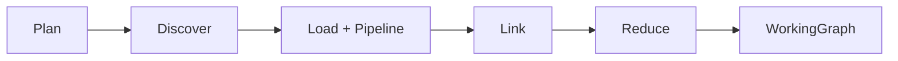
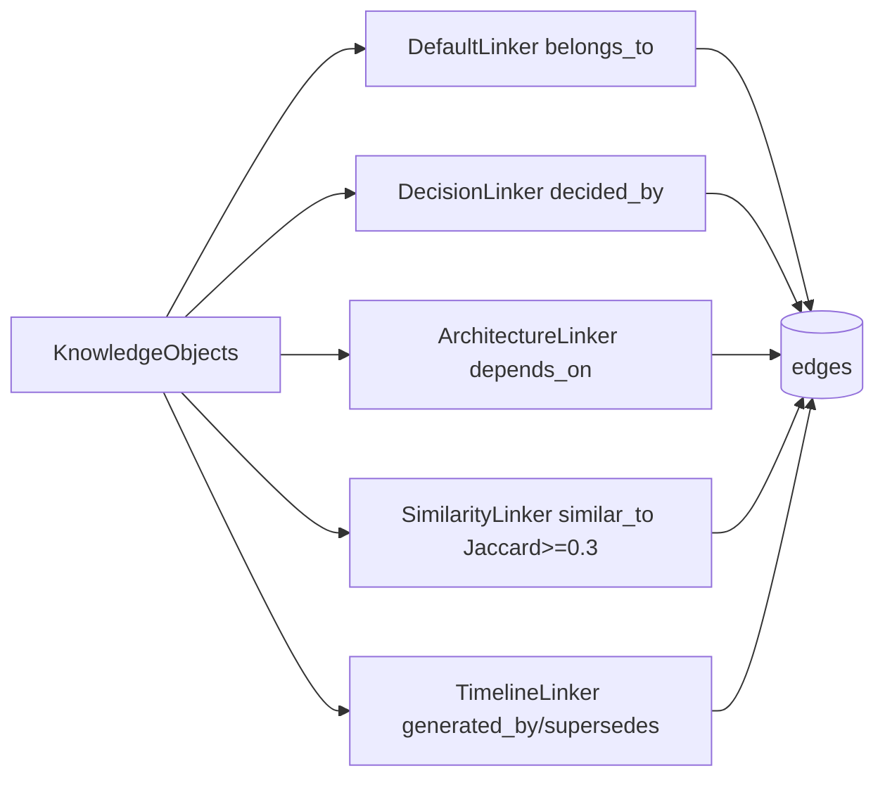

# ares Architecture Deep Dive (XVIII): Knowledge Graph Build — From Provider Data to a Queryable Graph (AKF/AKG) (0.3.x)

> Note: This article is based on the real code (`internal/knowledge/` core types, the pipeline orchestration in `runtime/runtime.go`, object processing in `pipeline.go`, `planner/`, `provider/`, `linker/`, `relation_extract.go`, `quality.go`, `compiler/`, `store/`, `service/adapter.go`, and `docs_articles_test.go`). Every symbol and every flow was read from the source. Anything I cannot verify, or anything the docs hype up, is marked (待核实) rather than glorified.

---

## 1. The AKF universal object: three data layers + lifecycle + quality gate

The basic unit of the knowledge graph is `KnowledgeObject` (`object.go`). It carries three data layers:

| Layer | Field | Purpose |
|-------|-------|---------|
| Raw | `Raw []byte` | Original source bytes, kept for re-distillation |
| Normalized | `Normalized` | Cleaned, standardized text for embedding and matching |
| Summary | `Summary` | Token-efficient LLM summary |

Other fields worth calling out: `Type` (`memory/user/project/code/issue/commit/decision/document/tool_result/workflow/runtime/architecture`), `Namespace`, `Evidence` (provenance), `Representations` (**external vectors** mapped model-name → representation-ID so you can change models without migrating data), plus the 0.2.9 additions:

- **`Status`**: `candidate → active → superseded → rejected`. Empty status is treated as active (backward compatible).
- **`Quality`**: five scores — `Extraction / Consistency / Freshness / Usage`, plus `ManualVerified`. The quality gate's `ComputeFinal` weights are `0.4*Extraction + 0.3*Consistency + 0.2*Freshness + 0.1*Usage`, and `DefaultQualityGateConfig` sets `MinFinalScore=0.55`.
- **Rule-extracted relations**: `Relations` are mined by the non-LLM `RelationExtractor`, and their predicates are confined to `AllowedPredicates`.

`Relation` (`relation.go`) serves both as a graph edge (`From/To/Name/Score`) and as a fact-level outgoing relation (`Predicate/ObjectID/ObjectText`). Built-in predicates: `RelDependsOn/calls/causes/fixes/belongs_to/uses/implements/similar_to/generated_by/decided_by/supersedes/learns_from`. `WorkingGraph` is a **task-scoped cognitive graph** — its comment states the lifecycle is **Build → Consume → Destroy, never persisted**.

---

## 2. The pipeline: Plan → Discover → Load&Pipeline → Link → Reduce → Graph

`KnowledgeRuntime.Execute` is AKF's execution engine (`runtime/runtime.go`). It is not the "five stages" I once described — it's actually **six steps**:

1. **Plan**: `planner.Plan(ctx, goal, budget)` turns the goal into `KnowledgeRequirement`s (per-need weights, `MaxResults` derived from budget ≈ 50 tokens/node).
2. **Discover**: `discovery.Discover` picks providers by **IntentMatch score > 0.35 threshold** and generates a query plan per requirement.
3. **Load + Pipeline**: streams from several providers in parallel (errgroup), running each object through the `KnowledgePipeline`:
   `Normalizer → EntityMatcher → Validator → Summarizer` (`pipeline.go`). The constructor defaults are `DefaultNormalizer{MaxRawBytes:10240}`, `DefaultEntityMatcher{MatchThreshold:0.6}`, `DefaultValidator`, `DefaultSummarizer{MaxSummaryLen:200}`.
4. **Link**: runs every `Linker`, then dedupes edges on the `(From, To, Name)` triple.
5. **Reduce**: runs `Reducer`s (default `DefaultReducer`) to compress the graph to a token budget.
6. **Graph**: yields `*WorkingGraph` (optionally emitting insight evidence to the unified Evidence Store).

---

## 3. Planner & providers

The default planner in `planner/default.go` matches keywords to needs (`NeedDecision` always, `architecture/code/issue/performance` on keywords, `history` as fallback). `provider.Select(intent, 0.35)` picks the matching providers.

Under `internal/knowledge/provider/` I counted **six** providers (there is **no `mysql` provider** — the old article was wrong):

| Provider | Object-type lean |
|----------|------------------|
| `memory.Provider` | `ObjectMemory` |
| `evolution.Provider` | `ObjectDecision` |
| `code.Provider` | `ObjectCode` |
| `postgres.Provider` | `ObjectDocument` |
| `store.Provider` | Generic store |
| `vector.Provider` | Vector recall |

Providers push objects via `Stream(ctx, intent)` (the old `Load()` shape is in `provider/interface.go`; registration in `registry.go`).

---

## 4. Linkers: where edges come from

Under `linker/` I read all five:

| Linker | Edge type(s) | Logic |
|--------|--------------|-------|
| `DefaultLinker` | `belongs_to` | Group by shared tags; `≤64` members → all-pairs (O(n²)); `>64` → star topology (each member → representative, O(n)); global cap 5000 edges |
| `DecisionLinker` | `decided_by` | Scores decision keywords in summaries/tags; connects to objects sharing tags at `hitCount*0.25` |
| `ArchitectureLinker` | `depends_on` | code/document/decision ↔ architecture objects on shared tags (**no `implements` edge — old article wrong**) |
| `SimilarityLinker` | `similar_to` | Jaccard token overlap on summaries, default threshold `≥0.3` |
| `TimelineLinker` | `generated_by` / `supersedes` | Same-namespace, sorted by `CreatedAt`; gap ≤ 2 weeks → `generated_by`; gap > 2 weeks and same type → `supersedes` |

Separately, `relation_extract.go`'s `RelationExtractor` is **regex-rule based** (bilingual `fixes/depends_on/calls/belongs_to`) and complements the linkers: Linkers produce graph edges, while the Extractor mines fact-level relations synchronously on the write path.

---

## 5. Reduce & the final graph

`runtime/components.go`'s `DefaultReducer` is straightforward: it estimates how many nodes fit via `budget.ForGraph / 50` (note **no pruning when no budget is set**, and at least 1 node kept when the budget is tiny). It picks nodes in descending `Confidence`, but applies **domain-diversity quotas** based on `domain:` prefixed tags — so top-N nodes don't all come from one domain and lose cross-domain edges. It then keeps only edges whose both endpoints survived.

The graph persists in one of **three** pluggable `Store`s under `internal/knowledge/store/`:

| Store | Backend |
|-------|---------|
| `memory.Store` | In-memory map (tests) |
| `postgres.Store` | PostgreSQL |
| `sqlite.Store` | SQLite |

`Store` provides `Save/Promote/ListByStatus/HybridSearch` (visible in `docs_articles_test.go`). There's also a `HybridSearch` path plus the `store` provider and the standalone `retriever/`, `hybrid.go`, `vector_index.go`, and `compiler/` (which renders a graph into prompt/markdown/json/xml/tool_schema).

---

## 6. Honest check: where is "a 27K-edge graph from markdown"

The old title was "From Markdown to 27K Edges", and the body had "147 nodes, 27K edges, 73ms build". I searched all of `internal/knowledge`: **no code or benchmark produces any of those numbers** (the linker/pipeline/planner benchmarks are single-component micro-benchmarks, not graph-scale).

The real "build a graph from markdown" is the **end-to-end test** `TestAKG_BuildFromDocsArticles` in `internal/knowledge/docs_articles_test.go`:

- Walks `docs/articles/**/*.md`, turning each markdown file into a `KnowledgeObject` (`Type=document`, `Namespace=articles`, first `#` heading as `Summary`, truncated body as `Normalized`).
- Extracts relations via `RelationExtractor`, scores with `DefaultQualityGateConfig` (`MinFinalScore=0.55`), stores into `memory.Store`, and `Promote`s objects with `Confidence≥0.55` to active.
- Runs `HybridSearch` recommend queries to validate recall.

It `t.Logf`s object/edge counts but **asserts no fixed edge count** — the edge count depends on how many "fixes/depends on/calls/belongs to" patterns actually appear in the corpus. So "27K, 147, 73ms" are fabricated; I have no evidence, so I mark them (待核实). The truth: an AKG *can* be built from `docs/articles/**/*.md`, but the edge count varies on every run.

For completeness: `internal/ares_skills/indexer.go`'s `parseFrontMatter` parses the `---` YAML header of each `SKILL.md` to produce skill metadata for the skill catalog — that's the **skills-discovery** path, not the AKG build pipeline. Don't conflate them.

---

## 7. The public API & adapter

`internal/knowledgeapi` is the canonical type domain (still aliasing `internal/knowledge`'s `KnowledgeObject/Relation/WorkingGraph/KnowledgeStore/Normalizer/EntityMatcher/Validator/Summarizer/KnowledgePipeline` implementation types); `api/knowledge/` is the deprecated forwarding layer.

`internal/knowledge/service/adapter.go` (**112 lines** as counted; the old "+126" was off) bridges `internal/knowledgeapi` to the internal runtime/retriever.

---

## 8. The truth about lazy loading

The old article described a `lazy_graph.go` with `KnowledgeRuntime.GetSubgraph(ctx, rootID, depth)`, plus invented numbers ("500 nodes → 2s, 1000 nodes → 8s, lazy graph → 50ms"). **`lazy_graph.go` does not exist.**

The real mechanism (spelled out in `runtime/runtime.go`) is: `Config.LazyLoading` **clamps `budget.ForGraph` to `maxLazyForGraph=2000`** before Reduce, so the returned `WorkingGraph` is smaller. The code comment is frank: this is **not** a full LazyGraph — `Execute` still loads every object from all providers, only the final graph gets pruned; true lazy loading would change the return type to `*LazyGraph` with an `Expand` method (left as a TODO).

---

## 9. Lessons

The heart of AKF/AKG isn't "how many edges" — it's the trade-offs: **external vectors so you can switch models without migration, three data layers so retrieval stays cheap, rule-based extraction so edges stay explainable, a quality gate + lifecycle so facts grow and get retired, and a budget- and diversity-aware reducer.** Hold on to this insight: **knowledge is a graph, not a table** — but it also has to know how much it actually stores, so it doesn't sell a test log's scale as a product feature the way my old article did.

The best knowledge system is the one that honestly admits its own data boundaries.