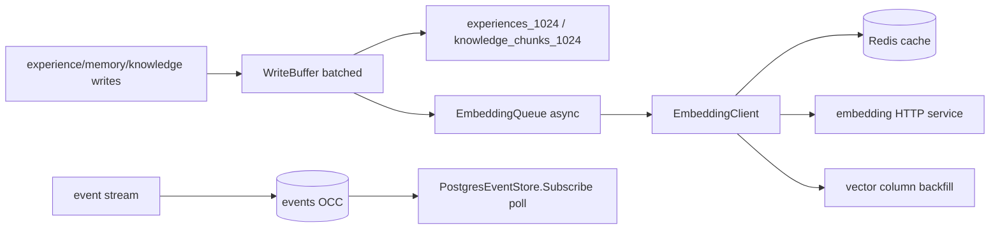
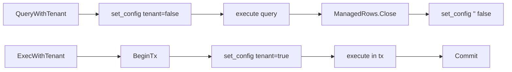
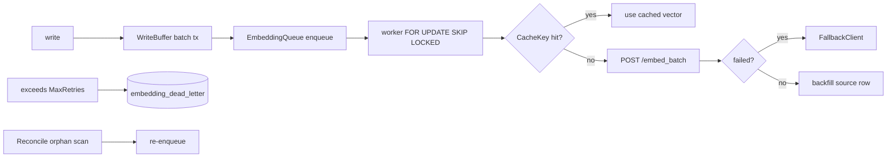

# ares Architecture Deep Dive (XIX): Storage Layer — The Foundation Under Everything (0.3.x)

> Note: This article is based on the real code (`internal/storage/` as a whole, the DDL in `internal/storage/postgres/migrate*.go`, `internal/storage/postgres/{pool,circuit_breaker,write_buffer,timeout,embedding_queue,base_repository}.go`, `internal/storage/postgres/embedding/` and `internal/storage/postgres/repositories/`, and `internal/ares_events/pg_store.go`). Every symbol and every flow was read from the source. Anything I cannot verify or that is configured but not actually wired is marked (待核实) rather than glorified.

---

## 1. What the storage layer actually stores

Memory, Experience, Knowledge, and Events all have to land somewhere — and their home is `internal/storage/postgres/`. The migration files are the single source of truth. I split what I saw into three groups.

**Group 1 — vectors & experiences (`migrate_storage.go`; every table has RLS + an IVFFlat vector index)**

| Table | Stores | Key columns / indexes |
|-------|--------|----------------------|
| `knowledge_chunks_1024` | RAG knowledge chunks, fixed 1024 dims | `embedding VECTOR(1024)`, default model `intfloat/e5-large`, `embedding_status`(pending/completed), `content_hash` dedup, `tsv TSVECTOR` + GIN, `document_id/chunk_index`, `metadata JSONB`; vector index `ivfflat (embedding vector_cosine_ops) with (lists=100)`, **PARTIAL ON `embedding IS NOT NULL`** |
| `experiences_1024` | Agent experiences (distillation output), 1024 dims | `type` CHECK `success/failure/query/solution/pattern/distilled`, `score`, `decay_at` (default `NOW()+30 days`), `usage_count`, `agent_id`; same `ivfflat vector_cosine_ops lists=100` (partial) |
| `tools` | Tools with semantic embedding | `name`+`tenant_id` unique, `tags TEXT[]` + GIN, `usage_count/success_rate/last_used_at`, `ivfflat` |
| `conversations` | Conversation history (**no vector**) | `session_id/user_id/agent_id/role/content/expires_at`, several btree indexes |
| `task_results_1024` | Task execution results, 1024 dims | `input/output JSONB`, `status/latency_ms`, `ivfflat` |
| `secrets` | Encrypted sensitive data | `value BYTEA` (default `aes-gcm`), `key_version`, unique `(tenant_id,key)` |
| `embedding_queue` / `embedding_dead_letter` | Async embedding task queue / dead-letter | dedupe_key unique idempotency, status index |
| `distilled_memories` | Cross-session distilled memory, 1024 dims — **deprecated** (read/write paths removed pre-M5; the DDL stays in migrate_storage.go only for existing-database idempotency) | `memory_type` CHECK `preference/interaction/profile/knowledge`, `importance`, `expires_at` (default 90 days), `content_hash` + unique `(tenant_id, content_hash)`, `ivfflat lists=100` |

**Group 2 — event sourcing & evolution (`migrate.go`, mostly without RLS)**

| Table | Stores |
|-------|--------|
| `user_profiles` / `sessions` / `recommendations` | User profiles / sessions / recommendations (legacy; `Seed` writes a sample profile here) |
| `embeddings` | **VECTOR(1536)** — note this table's dimension is 1536, a different vector space from the 1024-dim tables above |
| `agent_checkpoints` | Agent recovery points (session/status), renamed from `leader_checkpoints` |
| `events` | Event sourcing, `payload/metadata JSONB` + `version BIGINT`, unique index `(stream_id, version)` for optimistic concurrency |
| `event_summaries` | Compacted event-window summaries (`start_version/end_version`, aggregated `tools_called/errors/tasks_created` JSONB) |
| `evolution_strategies` / `evolution_rollback_events` | Evolution strategy persistence and rollback audit |

**Group 3 — the event read path (`internal/ares_events/pg_store.go`)**

`PostgresEventStore` writes to the `events` table above with **optimistic concurrency control**: `Append` first reads the current `MAX(version)`, and if `expectedVersion>0` does not match it returns `ErrVersionConflict` (with a PG unique-conflict 23505 fallback). `Subscribe` polls `events` once per second (default read limit 100) and exposes a `<-chan *Event`.



In one sentence: **semantic retrieval lives in the 1024-dim IVFFlat tables, events live in the versioned `events` table, and evolution strategies have their own persistence — all sharing one `Pool`.**

---

## 2. Access safety: Pool connection management + RLS tenant isolation

`pool.go`'s `Pool` wraps `database/sql` around a `Get → use → Release` cycle (via `WithConnection`). Two things stand out:

1. **`ErrMissingTenantID`** (`pool.go`): any tenant-aware query without a tenantID fails fast, to prevent silent cross-tenant leakage (comments cite P1-11).
2. **Connection-level RLS** (0.3.0): `QueryWithTenant` runs `SELECT set_config('app.tenant_id', $1, false)` on the connection (`is_local=false`, surviving the autocommit boundary), and the returned `ManagedRows.Close()` clears it via `clearTenantContext` (`set_config('app.tenant_id', '', false)`) before returning the connection to the pool; `ExecWithTenant` wraps its work in a transaction (`BeginTx → set_config(true) → Commit`). The vector tables all carry `CREATE POLICY ... USING (tenant_id = current_setting('app.tenant_id', true))`, which only actually bites together with this connection-level `set_config`.



---

## 3. Failure isolation: CircuitBreaker

`circuit_breaker.go` implements `closed / open / half-open`. The semantics I want to call out: **`failureCount` tracks *consecutive* failures** — every success resets it to zero (`RecordSuccess` zeroes the count in Closed). So `failureThreshold` means "open after N *consecutive* failures", not cumulative. Half-open admits one probe; it needs `successThreshold=3` successes to close again, and a single failure re-opens instantly. A 5-minute cleanup goroutine exists to prevent `halfOpenInflight` counter leaks.

---

## 4. Writes & async embedding: WriteBuffer → EmbeddingQueue

`write_buffer.go` queues writes into an in-memory channel and a background loop flushes when `batchSize` items accumulate or `flushInterval` elapses. Three honest details:

- **What's batched is the *database write*.** `flushBatch` bulk-INSERTS into `knowledge_chunks_1024` / `experiences_1024` (the only two supported tables — anything else errors) inside a single transaction. Merged writes do save round-trips.
- **Embeddings are *not* batched.** To be honest, the old article's claim "batch 50 items, send one embedding request, cut calls by 80%" was made up — the code does no such thing. Each item instead `EnqueueTx`s one **async embedding task** in the same transaction, and the vector is backfilled later by a worker; until then `embedding` is `NULL` (an all-zero vector would be valid and get picked up by the partial ivfflat, returning meaningless distances).
- **Failures are not silently dropped**: a failed flush retries with exponential backoff (max 3), then re-queues the whole batch rather than discarding it (a comment points at a historical data-loss bug).

`embedding_queue.go` is the linchpin: queue rows carry a `dedupe_key` (`sha256(table|task_id|tenant_id)`) guaranteeing **at most one queue row per source row**; workers claim tasks with `FOR UPDATE SKIP LOCKED`; `MarkFailed` moves past `MaxRetries` (default 3) into the dead-letter table; and `Reconcile` periodically re-enqueues orphan rows that have no vector yet, for eventual consistency.

The async embedding client lives in `internal/storage/postgres/embedding/`:

```
embedding/
├── service.go   # EmbeddingClient satisfies internal/embedding.EmbeddingService (compile-time assertion; api/embedding is the deprecated forward)
├── cache.go     # EmbeddingCache: Redis + in-memory, BLAKE2b-128 keys
├── client.go    # HTTP client: /embed, /embed_batch, /health
├── fallback.go  # FallbackClient: fallback strategies (cache-only / trigger keyword / error)
└── log.go       # scoped logger
```

The cache key is `normalizedText|model|method` (`getCacheKey`: BLAKE2b-256 truncated to 128 bits, prefix `embed:`). That part is real — **the key includes `model`**, so switching embedding models doesn't return stale vectors from the old model.



---

## 5. Operation-level timeouts

`timeout.go`'s `DefaultTimeouts`, as read:

| Operation | Timeout |
|-----------|---------|
| Query | 30s |
| Insert / Update / Delete | 20s |
| Transaction | 60s |
| VectorSearch | 10s |

Each `With*Timeout` returns the context unchanged when it already has a deadline, so caller intent wins. `config.go`'s `DefaultEmbeddingConfig` sets `MaxBatchSize=32`, `MaxRetries=3`, `MaxVectorSearchLimit=1000`, `EmbeddingTimeout=30s`.

---

## 6. Repositories & migrations

`repositories/` is split by domain: `conversation` / `distilled_memory` / `experience` / `knowledge` / `secret` / `strategy` / `task_result` / `tool`, with models centralized in `models/` (`conversation/experience/knowledge/secret/task_result/tool`). Note there is **no separate `query/` package** — the shared SQL helpers (`GetByID/DeleteByID/CountByTenant` and the dynamic-table whitelist `allowedTables`) live in `postgres/base_repository.go` and `query_utils.go`. Any table substituted into dynamic SQL must pass the `allowedTables` whitelist first, to block injection.

The migrations (`migrate.go` / `migrate_storage.go` / `migrate_eval.go` / `migrate_evolution.go`) are an **ordered set of idempotent DDL statements** run at startup. Honest caveat: **there is no schema-version table.** `RollbackLast` returns `ErrRollbackUnsupported` — the code's own TODO says a `schema_migrations` table would be needed for real rollback.

---

## 7. Honest corrections (old article vs. code)

Standing up and striking things from the old version:

1. **File/line counts**: the old article said "57 files, 14,112 lines". Measured: `internal/storage` has **95 `.go` files, ~33,201 lines including tests**; the `postgres` package alone is ~**14,447 non-test lines**.
2. **Batch embeddings**: "batch 50 items into one embedding request, cut calls by 80%" was invented — what's batched is the transactionally-merged INSERTs; embedding is queued per-row and async.
3. **`embedding_queue.go` location**: it lives in the `postgres/` root package, not under `embedding/`; that subpackage only holds cache/client/fallback/service.
4. **"Versioned" migrations**: they're idempotent DDL with no version table, and not rollbackable.

---

## 8. Lessons

Storage is the layer nobody talks about until it breaks. But the real point of this code isn't a "four-layer protection" slogan — it's the concrete trade-offs: **connection-level RLS via `set_config` tenant isolation, a breaker that trips only after *consecutive* failures, per-row async embedding with orphan reconciliation, and a dynamic table-name whitelist.** Each maps back to an incident or a security fix (the comments say so).

The best storage layer is the one you forget exists — but it exists, and every line of it was paid for with a lesson.