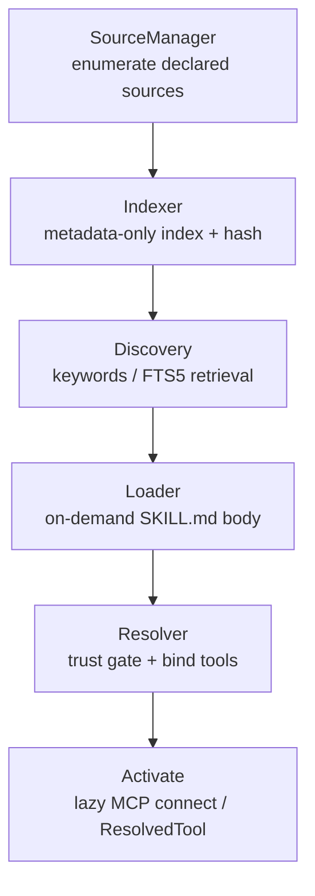
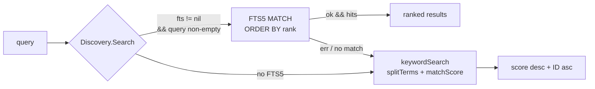
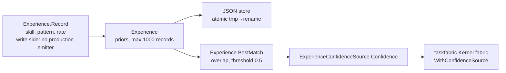
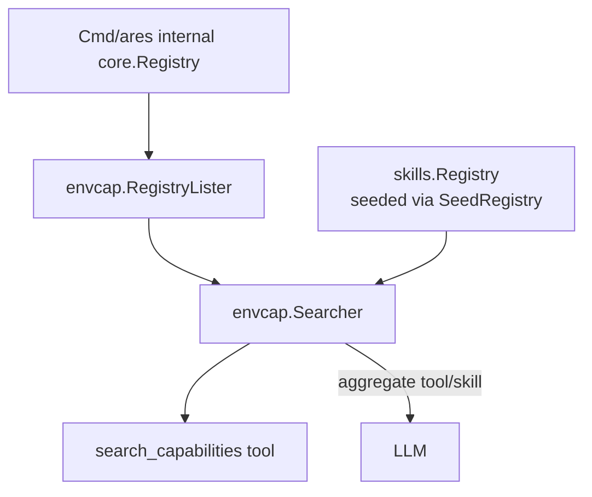

# ares Architecture Deep Dive (XXVIII): Skills Discovery — A Capability Catalog That Never Scans the Disk (0.3.x)

> 0.3.x update: Skills discovery has landed as the **Capability Fabric** in `internal/ares_skills` — the framework-native skill discovery, indexing, and loading system. The `Catalog` facade plus `SourceManager` aggregates four declared source kinds (project / user / registered / experience, where registered itself falls into directory, git, and http-oci). `CatalogTools` exposes a quintet of catalog tools (skill_search/load/activate/list/experience). `ExperienceConfidenceSource` adapts the learned prior into a `taskfabric.ConfidenceSource` and feeds it into the Kernel Scheduler's fabric.

> Note: This article is grounded in the actual code (all of `internal/ares_skills`: source.go / indexer.go / discovery.go / resolver.go / loader.go / experience.go / experience_store.go / experience_confidence.go / git_source.go / http_source.go / changes.go / config.go / tools.go / types.go / fts5.go / catalog.go) — the dedicated Capability-Fabric discovery-chain article in the docs series.

## 1. Skills Discovery: From "Searching" to "Declaring"

Traditional tool discovery is disk scanning: `find /`, sweep PATH, probe executables — hunting for "what might exist". ARES's Capability Fabric does the opposite (design pillar 1 in the `types.go` package comment):

> **Only scan "declared Sources", never the disk.** Discover only "what is declared", never hunt for "what might exist".

The discovery chain is a five-stage pipeline (pillar 4: content is progressively disclosed — metadata → SKILL.md body → references):



- **Indexer** only emits Level-0 metadata entries, never a body;
- **Loader / Resolver / Activate** only act on demand after a hit (Level-1 / Level-2).

## 2. SourceManager: Only Declared Sources

`SourceManager` in `internal/ares_skills/source.go` never scans the whole disk or PATH — it only enumerates explicitly declared directory roots, and `SkillDirs` reads exactly **one level** below each root and requires `hasDeclaredMarker` (a `SKILL.md` or `skill.yaml` present) to count a directory as a skill. **Declaration validation, never deep recursive scanning**; a declared-but-absent root yields an empty set, not an error.

The four `SourceKind` values (`types.go`):

| Source | Location | Description |
|--------|----------|-------------|
| `SourceProject` | `<project>/.ares/skills/` | Project self-declared; metadata only, **skills are never executed** |
| `SourceUser` | `~/.ares/skills/` | User-installed global capabilities |
| `SourceRegistered` | `~/.ares/config.toml` `[[skill_sources]]` | Explicitly declared extra dirs / git / http-oci |
| `SourceExperience` | persisted relevance priors | Learned source, **never auto-executed** |

Registered sources split into three (config.go `LoadSkillSources`):

| type | parsed | landed |
|------|--------|--------|
| `""` / `"directory"` | `Path` expanded (`~`) and deduped | added to `RegisteredDirs`, indexed as directories |
| `"git"` | `URL` + `LocalDir` | `SyncGitSource`: `git clone --depth 1` if absent, else `git pull --ff-only` fast-forward into a local cache, indexed as a registered-style source |
| `"http"` / `"oci"` | `ManifestURL` | `FetchHTTPManifest` fetches a JSON manifest mapped to metadata-only entries (bodies stay remote; `Load` errors clearly instead of mis-reading CWD) |

The key check (`source.go`):

```go
// SkillDirs lists the skill subdirectories under a declared source. It reads
// exactly one level below the source root and requires a SKILL.md marker file
// (or a skill.yaml manifest) to count a directory as a skill — declaration
// only, never a deep recursive scan.
func (s *SourceManager) SkillDirs(source SourceDir) ([]string, error) {
    entries, err := os.ReadDir(source.Path)
    ...
    for _, e := range entries {
        if !e.IsDir() || strings.HasPrefix(e.Name(), ".") {
            continue
        }
        dir := filepath.Join(source.Path, e.Name())
        if hasDeclaredMarker(dir) {
            dirs = append(dirs, dir)
        }
    }
    sort.Strings(dirs)
    return dirs, nil
}
```

## 3. Indexer: Metadata Only, Never the Body

`Indexer.Index` in `internal/ares_skills/indexer.go` walks the declared sources and produces one `SkillIndexEntry` (`types.go`, Level-0 of progressive disclosure):

```go
// SkillIndexEntry is the metadata-only index record (Level 0 of progressive
// disclosure). The SKILL.md body is deliberately NOT loaded here so that 100
// skills cost ~100 x 100 tokens instead of 100 full instruction bodies.
type SkillIndexEntry struct {
    ID           string   // stable identifier (e.g. "rust-review")
    Name         string   // human-readable name
    Description  string   // resident one-liner
    Keywords     []string // search keywords
    Source       SourceKind // project | user | registered | experience
    Path         string   // skill directory
    Version      string   // manifest version
    Capabilities []string // capability labels
    ToolTypes    []string // declared tool kinds (from the manifest)
    Hash         string   // content hash for change detection
}
```

- **Front matter + manifest merge** (`indexOne`): `SKILL.md` `---` front matter (parsed by `parseFrontMatter` for name/description/keywords/version/capabilities) merges with the `skill.yaml` manifest (via `loadManifest`), **manifest fields win**; ID falls back to the directory name.
- **Content hash** (`contentHash`): a deterministic SHA-256 over `SKILL.md` + `skill.yaml` + the `tools/` dir entry names — only declaration files, never a body.
- **Progressive-disclosure boundary**: the index never contains bodies. 100 skills = 100 × ~100 tokens of metadata, not 100 full instruction bodies (corresponding to `TestResidentMetadataTokenBudget`).

## 4. Discovery: Keyword Matching + FTS5 Fallback

`Discovery` in `internal/ares_skills/discovery.go` touches only Level-0 metadata:

- **Keyword matching** (`keywordSearch`): `splitTerms` lower-cases + whitespace-splits → `matchScore` counts hits across ID/name/keywords/capabilities/description → ranked by hit count desc + ID asc (deterministic).
- **FTS5 full-text search** (`fts5.go`): `NewFTS5Index` builds an in-memory SQLite FTS5 virtual table (`modernc.org/sqlite`, CGO-free) over id/name/description/keywords, ordered by `ORDER BY rank`, mapping FTS rowid back to the entry slice index.
- **Graceful fallback**: `Discovery.Search` prefers FTS5 and **silently falls back to keyword matching** when the query is unsafe / FTS5 fails / FTS5 is unavailable (`swapIndex` also degrades to keyword-only on FTS5 build failure) — one entry point, invisible to callers:



## 5. Loader / Resolver: On-Demand Disclosure + Trust Gate

- **Loader** (`loader.go`): `Load(id)` returns the full `SKILL.md` body (Level-1, on demand); `ListReferences`/`LoadReference` manage the `references/` dir (Level-2). `LoadReference` enforces a **path-traversal guard**: rejects names containing `/`, `\`, or `..`. Remote skills (Path is a URL) error clearly rather than reading from CWD. Unknown IDs return the sentinel `ErrSkillNotFound`.
- **Resolver** (`resolver.go`): binds manifest `tools` declarations (`ToolDecl`: id/type/command/args/server/name) into `ResolvedTool{ID, Kind, Target, Args}` under the trust tier from `trustForSource`:

| `ToolKind` | Trust / declaration condition |
|------------|-------------------------------|
| `ToolBuiltin` | `Name` must be in the builtin list (`CatalogConfig.Builtins`) |
| `ToolMCP` | Only a declared `Server` name needed — connecting is deferred to `Activate` |
| `ToolExecutable` | Trust tier ≠ `TrustUntrusted` and `AllowLocalExecutables` enabled; `executableExists` is a declaration-only **LookPath / existence check, no scanning** |

Trust tiers (`trustForSource`): `SourceProject`/`SourceUser` → `TrustAllowed`, `SourceRegistered` → `TrustAsk`, otherwise (experience/external) → `TrustUntrusted`. Failed trust gates return `ErrToolUntrusted`.

**Discovery ≠ Permission** (pillar 5): learned / external sources may be indexed but **never auto-executed**.

## 6. Experience: The Learned Source Doesn't "Generate" Skills

`Experience` in `internal/ares_skills/experience.go` records `{skill, task_pattern, success_rate}` relevance **priors** (`types.go`):

```go
type ExperienceRecord struct {
    Skill       string  // skill ID, e.g. "pdf-generation"
    TaskPattern string  // task pattern, e.g. "document-to-pdf"
    SuccessRate float64 // observed success rate 0-1
}
```

- **Not LLM-generated skills** — it only records "which skill has high success on which task pattern"; `BestMatch` scores by keyword overlap (substring containment for short patterns, `patternMatchScore` token-overlap ratio for long ones, below `matchScoreThreshold = 0.5` no match).
- **Bounded + persistable**: `NewExperience` caps `maxRecords = 1000` (drops the oldest); `taskPattern` is truncated by `capPatternLength` to `maxPatternLength = 256` runes. Re-recording the same (skill, pattern) overwrites its rate.
- **JSON persistence** (`experience_store.go`): `JSONExperienceStore.Save` is atomic (`tmp → rename`, dir 0700, file 0600). In production the file defaults to `~/.ares/experience.json` (assembled in `skills_wiring.go`).
- **Write side removed (dead code)**: the former `SkillOutcomeRecorder` (`outcome_recorder.go`) was deleted — its only potential emitter (`EventSubTaskResult` from the retired tool loop) never carried the payload shape it read (`task.UsedExperienceID` + `success`), so it was starved from the start (RUNTIME.md breakage #8). The loop is currently read-only: nothing in production writes priors until a conforming `sub_task.result` emitter exists.



- **Bridge to the scheduler** (`experience_confidence.go`): `ExperienceConfidenceSource` satisfies `taskfabric.ConfidenceSource` at compile time (`var _ taskfabric.ConfidenceSource = (*ExperienceConfidenceSource)(nil)`); `Confidence(taskPattern)` returns the best prior's success_rate (0 with no prior). Wiring lives in `cmd/ares/peer_mode.go`: `resolveExperienceConfidence` builds it from `catalog.Experience()`, and `kernel.fabric = kernel.fabric.WithConfidenceSource(expSrc)` — scheduler fitness Confidence is driven by real learned priors, not constants, echoing the SKILL-first direction.

## 7. Catalog Facade: One Wrapper for the Whole Chain

`Catalog` in `internal/ares_skills/catalog.go` composes all components:

```go
func (c *Catalog) Build() error          // index all declared sources (git synced first, http manifests fetched)
func (c *Catalog) Search(q string, n int) []SkillIndexEntry  // Level-0 retrieval
func (c *Catalog) Load(id string) (string, error)            // Level-1 on-demand body
func (c *Catalog) ResolveTools(id string) ([]ResolvedTool, error) // trust-gated binding
func (c *Catalog) Activate(ctx, id string) ([]ResolvedTool, error) // lazy MCP connect
func (c *Catalog) Refresh() (IndexChange, error)             // hash-based incremental re-index
func (c *Catalog) SeedRegistry(reg *skills.Registry) error   // pour into the memoryManager resident block
```

- **Concurrency safety**: a `sync.RWMutex` guards `swapIndex` (Build/Refresh take the write lock and atomically swap; Search/Load/All/Count take the read lock). `swapIndex` closes the old FTS5 handle, builds a fresh FTS5, swaps the discovery/loader views and re-seeds the registry — an FTS5 build failure degrades to keyword-only.
- **Lazy connect**: `SetMCPConnector` attaches an `MCPConnector` (`ConnectServer(ctx, name)`, satisfied by `ares_mcp.MCPManager`); `Activate` connects declared MCP servers only at activation time (pillar 3: **no MCP server is connected before then**). Without a connector, MCP tools resolve to descriptors only.
- **Refresh aligned with Build**: re-syncs git (first under a bounded 2-minute timeout, outside the index write lock), re-fetches http manifests, `DetectIndexChanges` splits `Added/Modified/Removed` by (Source, ID, Hash), closes + rebuilds FTS5 and re-seeds the registry. Note: current production wiring does a single **startup Build** (next section); `Refresh` is a fully implemented on-demand re-index path whose doc mentions listChanged-triggered refresh, but no keep-alive runtime refresh loop wires MCP listChanged into Refresh.

## 8. Production Wiring

The capability-catalog wiring is **not** done in one place in `serve.go` — it's split across two:

**① Catalog build + resident block** (`wireSkills` in `internal/ares_bootstrap/skills_wiring.go`, called from `bootstrap.go`):

1. `LoadSkillSources("")` reads the default `~/.ares/config.toml` `[[skill_sources]]` (directory/git/http-oci)
2. `NewCatalog`: project `.ares/skills` + user `~/.ares/skills` + registered + `ExperiencePath` (`~/.ares/experience.json`)
3. `SetGitSources` / `SetHTTPSources`; MCP attached as the lazy connector; `SyncGitSources` is non-fatal (degrading to local-checkout indexing on failure)
4. `catalog.Build()` — built exactly once at startup; failure is logged, not fatal
5. `SeedRegistry` pours into `skills.Registry` → `setter.SetSkillsRegistry(reg)` attaches to the memoryManager resident "Available skills" block
6. `bootstrap.go` used to start `NewSkillOutcomeRecorder(catalog).Start(ctx, comp.EventStore)` here — removed as dead code (starved from the start; see §6), leaving a TODO(tech-debt) at the wiring spot

**② Tool exposure** (`cmd/ares/serve.go` / `tools.go`):

- After a successful build, `serve.go` registers the **quintet** returned by `ares_skills.CatalogTools(comp.SkillCatalog)` (`tools.go`): `skill_search` (search metadata), `skill_load` (fetch body), `skill_activate` (resolve + lazy-connect MCP + attach references), `skill_list` (unfiltered listing), `skill_experience` (query best prior, read-only).
- `registerCapabilitySearch` (`tools.go`) wraps `envcap.NewSearcher(envcap.NewRegistryLister(internalReg), skillReg, nil)` as the **`search_capabilities`** tool and registers it into the internal registry — unified retrieval over "registered tools + skills" (native commands are already pre-registered by `registerNativeTools` as `KindTool` in the same registry, so no separate `Discoverer` is passed to avoid double-probing).
- Skill/tool binding into the agent runtime flows through the internal `core.Registry` + `newToolBinder` (`BridgeFromRegistry`); `agentsyscall.BindTools` binds peer primitives like `spawn_agent`/`create_task` and does **not** handle skills — this article's main line does not depend on it.

### 8.1 envcap Unified Retrieval Bridge (tools/skills aggregation)

`Searcher` in `internal/tools/envcap/envcap.go` offers one unified environment-search entry point:

```go
type Searcher struct {
    tools  ToolLister               // registered tools (builtin + MCP)
    skills *skills.Registry         // poured in via catalog.SeedRegistry
    cmds   *discovery.Discoverer    // native-command allowlist (may be nil)
}
```

- **Bridge**: `catalog.SeedRegistry(reg)` pours the skills index into `*skills.Registry`, then `serve.go` builds `envcap.NewSearcher(...)` — the catalog becomes envcap's skill source (guarded by `TestCatalogSeedsEnvcapAggregation`).
- **Aggregated ranking**: `Search` returns `Capability{Kind, Name, Description}`, stably sorted by `kindRank` (tool < skill < command) then name ascending.



## 9. Summary

| Component | Responsibility | Design Pillar |
|-----------|----------------|---------------|
| SourceManager | Declared-source enumeration (directory/git/http-oci) | 1. no disk scan, one level + marker |
| Indexer | Metadata-only index + SHA-256 hash | 4. Level-0 progressive disclosure |
| Discovery | Keyword + FTS5 (fallback) | 4. metadata only to the LLM |
| Loader | On-demand body / references (traversal guard) | 4. Level-1/2 |
| Resolver | Trust-gated tool binding (builtin/mcp/executable) | 5. discovery ≠ execution |
| Experience | Learned priors (bounded, persistable) | 5. learned never auto-executes |
| ExperienceConfidenceSource | Adapts taskfabric.ConfidenceSource | priors feed the scheduler |
| Catalog | Facade + Swap + Refresh + Activate | 2. Skill ≠ Tool |
| envcap.Searcher | Unified tool/skill retrieval | second half of progressive disclosure |

**Main line: turn capability management from runtime scanning into startup-time indexing.** Closed loop with the context-management article's `ContextCleaner` / memoryManager resident block — metadata resident, bodies on demand — giving an agent a born-with capability foundation.

### 9.1 Benchmarks & Verification (no fabricated numbers)

`internal/ares_skills/benchmark_test.go` defines 100-skill scenarios and assertions, **but the code contains no concrete ms/µs measurements** (those are environment-dependent; the raw figures in the earlier draft are not code constants and are deliberately dropped):

| Benchmark / test | What it measures | Assertion in code |
|------|------|------|
| `BenchmarkCatalogBuild100Skills` | timing metadata indexing of 100 skills (Level-0, no scanning) | no fixed baseline |
| `BenchmarkCatalogSearch100Skills` | timing + allocs for `fts5-hit` and `keyword-fallback` subtests | no fixed baseline |
| `BenchmarkExperienceBestMatch100` | timing + allocs for BestMatch over 100 priors | no fixed baseline |
| `TestResidentMetadataTokenBudget` | the progressive-disclosure promise | asserts the resident block (name + description) has estimated tokens ≤ 20k (target ~10k for ~100 skills), and **never contains `## When to use` body content** |

That is, the benchmarks guard *behavioral constraints* of progressive disclosure rather than fabricating specific performance numbers; the hard invariant actually enforced is "**the resident block holds only metadata and never leaks SKILL.md bodies**".