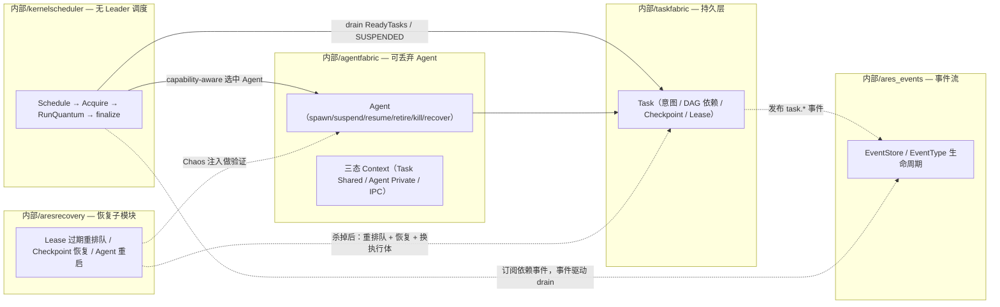
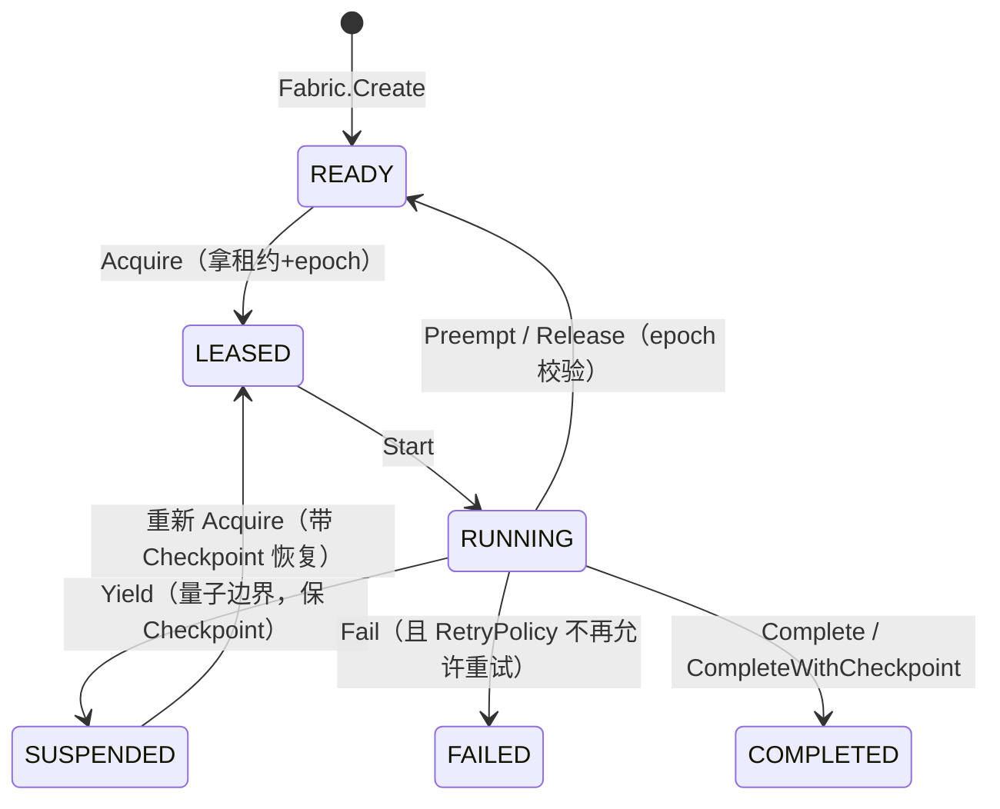

# ares 系列开篇：无聊自己搓一个 Agent 框架（0.3.1）

> 我一直觉得，最好的学习方式就是自己造一个轮子。
> 不是因为轮子不够用——是因为造完之后，你再也不会被轮子卡住了。

---

## 闲话 + 背景

嗯……这是一个系列文章的开篇。属于思绪飞扬、放飞自我的那种。和管理员申请过了，说可以推荐自己的项目——那我就厚脸皮一回 :rofl:

先聊点闲话。

这两年 AI 发展有多快不用我多说，Agent 早就融入了大家的日常。但问题来了：**大家是怎么学 Agent 的呢？**

赶上 AI 大跃进的时代，不学肯定掉队。学吧——工作本来就够烦了，还要被逼着学新东西。我当时的想法是：打不过就加入。后来一合计：**不如自己操刀设计一个算了。**

## 简单回顾

咱也不是那种老实巴交写代码的人，hhh，所以在职场混得很差。

最早接触 Agent 要追溯到去年和朋友联合创业做的 **Music AI**。当时我自己设计架构，手搓了一个 music tool，可以对音频按音轨进行分层处理。我要做的不是普通的 AIGC——而是修复和完善。类似于现在 AI 可以把老电影变成 4K 画质——我们想做的是完善音频，找到音频中不和谐的地方，经过 AI 审查分析之后给出完善建议。

当时大模型都设计好了，投入了训练，用的是 MLX + PyTorch。可惜资本市场萎靡，项目太监了……

带着这份不甘心，我继续投入 AI 的学习。期间做了两个可交互工具：

- [**Model_explorer**](https://github.com/just-for-dream-0x10/Model_explorer) —— ML 底层数学的可交互可视化工具
- [**Transformer_explorer**](https://github.com/just-for-dream-0x10/Transformer_explorer) —— Transformer 底层原理的可交互版

都是基于我自己的笔记做的。后来做了个独立项目上了 crates.io，反响不错，洋哥们儿用得也挺开心。

然后就到了今天的主角：**ares**。

## 技术选型：为什么是 Go？

我本身是后端开发，熟悉 Rust 和 Go。

**先排除了 Python。** 不是说 Python 不好——但用起来总觉得不舒服，看起来也不舒服。尤其是并发场景，又慢又乱。

然后在 Rust 和 Go 之间纠结：

- **Rust**：用得得心应手，但编译速度太劝退了。每次改点东西都要等，开发体验被打断。
- **Go**：简洁、极致性能、天生的并发支持。

还有一个私心：有个 HR 说我不懂 Go、没有 Go 项目。作为一个有操守的技术人——**我必须选择 Go，消灭一切质疑的声音。**

## 从 Python 痛苦到 Go 重生

最开始我也和很多人一样，从 Python 入门。先搭了个本地知识库，用 vector database + Ollama。

第一次跑通的时候还挺兴奋的：文档切分、embedding、入库、查询……Ollama 居然真的能回答我的本地笔记内容！

但兴奋没持续多久。

当我想加 **tool calling、多步推理、跨会话记忆、多 Agent 协作** 的时候——一切都崩了。Python 在并发场景下又慢又乱，内存管理一塌糊涂，工作流逻辑变成一堆 callback 和状态机的 spaghetti code。每次想改流程（加 failover、加 human-in-the-loop）都要重写一大半代码，调试长时任务像是在抓鬼。

我心想：**一定有更好的方式。**

Go 的简洁、极致性能和天生的并发支持让我眼前一亮。于是我决定：从头用 Go 重写整个 Agent 系统。

**Shedding Old Baggage, I Designed My Own Agent Framework** —— 这就是 ares 的诞生故事。

从最基础的 LLM 调用和简单 RAG 开始，但这次感觉完全不一样：

- **Goroutines** —— 并发 Agent 天生又快又轻量
- **强类型 + 干净的接口** —— 设计出更清晰的抽象
- **Channel 和 Context** —— 工作流编排和取消变得可靠

## ARES Kernel：Agent 是一次性的，Task 是持久的

随着项目发展，架构经历了重写。到 0.3.x，核心收敛成一个核心哲学：**Task 是持久的，Agent 是一次性的（Agent 死亡 ≠ Task 死亡）。** 这套能力分散在几个真实的 Go module 里，下面这张图是它们的关系：



核心分工（模块名即 internal/ 下真实目录）：

| internal 包 | 职责 | 关键符号（仅列出已验证） |
|------|------|--------------------------|
| `internal/fabric/task` | 持久的 task 意图 + 状态机 + 租约 + 检查点 | `Task`、`TaskState`（READY/LEASED/RUNNING/SUSPENDED/COMPLETED/FAILED）、`Fabric.Create/Acquire/Start/Yield/Complete/Fail/Renew/Release/Preempt/Schedule`、租约 `Epoch`（fencing token）、`RetryPolicy`、`ErrEpochMismatch` |
| `internal/fabric/agent` | 一次性 Agent 生命周期 + 进程树 + 三层 Context；**不负责调度** | `Fabric`、`spawn/suspend/resume/retire/kill/recover`、`AgentType`、`Cognition`、`SpawnSpec` |
| `internal/kernel` | "Agents are not orchestrated. They are scheduled." | `Scheduler`、`New`、`Run`、`Schedule→Acquire→RunQuantum→finalize`、`RegisterExecutor/UnregisterExecutor`、`PreemptLowerPriority`（合作式抢占）、`EventStore` 事件驱动 drain |
| `internal/aresrecovery` | 恢复子模块，证明 Runtime 扛得住 Agent 死亡 | `Recovery`、`RestartPolicy`、`EvolutionAwareSpawner`（进化感知的 spawn 门）、Chaos（故障注入验证） |
| `internal/runtime/memory/experience` | 经验蒸馏 | `DistillationService`、`Distill`、`TaskResult → Experience`（成功/失败两类） |
| `internal/ares_events` | 事件流 / 飞行记录底座 | `Event`、`EventType`（task.created/ready/acquired/started/yielded/checkpointed/preempted/released/completed/failed/expired/stolen）、`EventStore`（Append/Read/Subscribe/StreamVersion） |
| `internal/runtime/ares_evolution` | 进化（策略状态机） | `StrategyLifecycle`：`CANDIDATE→SHADOW→ACTIVE→DEGRADED`，验证门 + `Submit`，回滚策略 |
| `internal/agentipc` | Peer-mesh 通信 | `Bus`、`Send/Request/Reply/Delegate/Handoff/Subscribe`、广播 `Broadcast/Unsubscribe`、`Message`、`DeadLetterStore`（有界 FIFO） |
| `internal/ares_bootstrap` + `sdk` | 组件装配 + 统一入口 | `ares_bootstrap.Bootstrap`（装配内核）、`sdk.NewRuntime` |

## 关键机制

### Task 状态机（`internal/fabric/task`）

Task 不依赖任何 Agent 存活。`TaskState` 的状态机：



每次带所有权的操作都带 `Epoch`（fencing token）。这正是防那类 bug 的关键：**"A 租约过期 → B acquire → A 迟到 Release"不会误杀 B**——A 的 epoch 已经过期，Release 会返回 `ErrEpochMismatch`。

### Execution Quantum：量子边界才切换

LLM Agent 无法在任意 instruction 上被打断——它只在 quantum 边界把执行权交回 Runtime。一次任务的完整路径是 **Schedule → Acquire → RunQuantum → finalize（COMPLETED / FAILED / SUSPENDED）**。Scheduler 在 quantum 边界决定 continue / suspend / preempt（`kernel.Scheduler` 里能看到完整的这条路径，配合 `PreemptLowerPriority` 做**合作式**抢占——不是 OS 那种硬抢占）。

### Recovery：Agent 死亡 ≠ Task 死亡

`internal/aresrecovery.Recovery` 把 Task Fabric（持久 Task + 租约过期 + Checkpoint）和 Agent Fabric（可丢弃 Agent + 认知状态）接起来，覆盖三条失败路径：

1. **租约过期 → 重排队**：死掉的 Agent 的租约过期，Task 回 READY，别的 Agent 可以 acquire（`Fabric.CheckExpiredLeases`）
2. **Checkpoint 恢复**：新的 Agent 从保留的 Checkpoint 继续（如前一个 mermaid 的 `SUSPENDED → LEASED`）
3. **Agent 重启**：崩溃的 Agent 被替换成新的、能接住旧认知态的执行体

`aresrecovery` 里的 Chaos 是**验证**手段：故意注入故障，然后调用 Recovery 证明 Runtime 真的能恢复——"Chaos breaks things on purpose; Recovery proves the Runtime survives."

### 经验蒸馏（`internal/runtime/memory/experience`）

Task 的成败会被蒸馏成可复用经验。`DistillationService.Distill` 拿 `TaskResult`，经由 LLM 抽取 Problem / Solution / Constraints，产出 `success` 或 `failure` 两类 `Experience`（`ExperienceTypeSuccess` / `ExperienceTypeFailure`）。

### 进化（`internal/runtime/ares_evolution`）

进化不是玄学——是一个 `StrategyLifecycle` 状态机：

```text
CANDIDATE → SHADOW → ACTIVE → DEGRADED → (回滚到上一个)
```

只有 `Submit(candidate)` 能改变 active strategy，晋升前跑若干验证门，晋完之后后台 watch loop 把真实运行时样本喂给回滚策略——出问题就回滚。（门的具体数量与各门明细在华文中标注为待核实。）

### 事件流（`internal/ares_events`）

Task Fabric 每次状态迁移都会往 `EventStore` 追加 `task.*` 事件（`EventTaskCreated` 等），Scheduler 可以订阅依赖相关事件做**事件驱动的 drain**（不用干等 500ms 轮询——即便默认仍保留轮询作为兜底）。写入带 `expectedVersion` 乐观并发控制，流有 `StreamHash` 可用于校验完整性。

## 核心特性一览

随着项目发展，我逐步加入了这些能力（都在真实代码里，不是 PPT）：

| 特性 | 落点（真实模块） | 说明 |
|------|------|------|
| **ARES Kernel** | taskfabric + agentfabric + kernelscheduler | Task 持久、Agent 一次性、设备无关。**Agent 死亡 ≠ Task 死亡**；Kernel 不思考——"Agent decides; Kernel enforces" |
| **Execution Quantum** | taskfabric（YIELD）+ kernelscheduler | 一次任务 = 若干 quantum；量子边界交回执行权，Scheduler 决定 continue/suspend/preempt |
| **Fencing Token（epoch）** | taskfabric（`Lease.Epoch` / `Acquire`） | 每次所有权操作的防"迟到 Release"门禁；过期租约操作返回 `ErrEpochMismatch` |
| **事件系统** | ares_events | `EventStore` 事件流，`task.*` 全覆盖；Scheduler 事件驱动 drain |
| **Agent IPC** | internal/agentipc | Peer-mesh 总线：`Send/Request/Reply/Delegate/Handoff/Subscribe` + 广播；`DeadLetterStore` 有界 FIFO |
| **经验蒸馏** | ares_experience | `Distill` 把 TaskResult 蒸馏成 success/failure 两类 Experience |
| **进化状态机** | ares_evolution | `StrategyLifecycle`：CANDIDATE→SHADOW→ACTIVE→DEGRADED，带验证门 + 回滚 |
| **恢复子模块** | aresrecovery | 租约过期重排队 + Checkpoint 恢复 + Agent 重启；Chaos 做验证 |
| **可插拔向量存储 / MCP / 技能** | （相关 internal 包） | 多存储后端与 MCP/技能生态为本项目能力面，条目级细节不在本篇展开（待核实） |

## 一个比较颠儿的功能：Agent 暗杀测试

我还做了一个比较颠儿的功能——**随意暗杀一个正在工作的 Agent，看看它能不能真的秽土转生**。这条链路不是魔法，正是上面拼起来的：`CheckExpiredLeases`（租约过期重排队）+ Agent Fabric 的生命周期 + Recovery 换执行体。真实日志大致长这样（示例输出，非本版本逐字原文）：

```
2026/06/14 19:46:29 INFO arena: killed agent id=agent-1
2026/06/14 19:46:29 INFO orchestrator: agent killed, resurrecting id=agent-1 name="Architecture Review"
2026/06/14 19:46:29 INFO orchestrator: agent started id=agent-6 name="Architecture Review"
2026/06/14 19:46:29 INFO orchestrator: resuming agent from step id=agent-6 resume_from=agent-1 start_step=4 total_steps=3
```

> 引用的 arena / orchestrator 具体标识为旧版本/演进过程文本，本篇不把它当成当前模块的准确 API；要落地验证请以 `internal/runtime/arena` 与 `internal/runtime` 的实际代码为准（待核实）。

## 最后

如果你在低谷期，希望这个故事能激励你。**要善待自己，持续输出，拥抱变化。**

---

## 0.3.1 更新说明

- **版本**：仓库 `VERSION` 当前是 `0.3.1`
- **Leader/Sub 不是主路径**：Kernel 内没有"中央编排者"；调度由 `kernel.Scheduler` 完成（`PolicyLegacy` 仅在 `agentipc` 里作为库常量保留，供双轨验证用）
- **通信走 peer-mesh**：`internal/agentipc.Bus` 六原语，见系列第二篇
- **恢复与进化是真实模块**：`aresrecovery` + `ares_evolution`，不是概念

核心哲学没变：**Agent 是一次性的，Task 是持久的。Agent 死亡 ≠ Task 死亡。**