# ares 架构拆解 (I)：全局视角——为什么又一个 Agent 框架？（当前主线 M0–M1.5）

我一开始不是要造框架。我是要解决一个问题：**Agent 老死，而且查不出原因。**

起因是一个简单的聊天机器人。一个 Leader，两个 Sub，几个工具。开发环境跑得好好的。上了生产，Leader 跑 20 分钟就不响应了。没有报错，没有 panic，没有崩溃日志。就是……沉默。

调试了三天，找到了：LLM 客户端的 goroutine 泄漏。每个请求泄漏一个 goroutine，最终打到操作系统线程上限。修复就一行代码。但找到它花了 72 小时，因为我对 Agent 在干什么**零可见**。

那一刻我意识到：问题不是"怎么让 Agent 调 LLM"，问题是"怎么让 Agent 在生产环境活下来"。

---

## 三个问题

每个 Agent 框架回答一个问题："怎么让 Agent 调 LLM？" 这是最简单的部分。难的问题是：

1. **Agent 死了怎么办？**（复活）
2. **它怎么记得之前在干什么？**（记忆蒸馏 / 状态恢复）
3. **我怎么知道哪里出了问题？**（可观测）

ares 围绕这三个问题构建。核心主张始终一致：**Agents are not orchestrated. They are scheduled.** 本文用的是**当前真实代码**（工具 DAG 主线已 M0/M1/M1.5 落地）：全系统只剩**一种图** `engine.MutableDAG`，ReAct 的 `for round` 循环被展开成图上的节点生长，节点 = 一次工具执行。

---

## 架构：当前代码

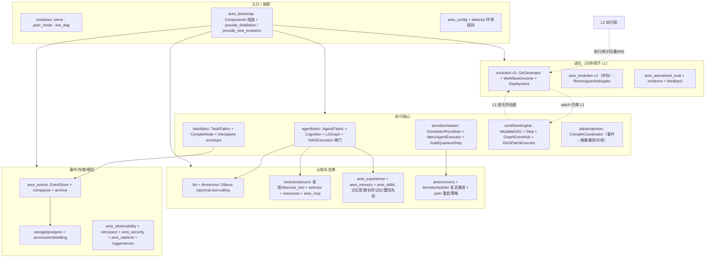

**一条主线，串起所有模块。** 0.3.x 的七个抽象层没有消失，但它们现在收敛到一组真实包上：`agentfabric` 负责"Agent 怎么活"、`kernelscheduler` 负责"谁执行"、`taskfabric` 负责"任务的持久意图"、`workflow/engine` 负责"唯一那张图"、`planprojection` 负责"图→任务"。下面按真实组件逐层讲。

---

### 两层同构图：L1 能力图 ↔ L2 执行图

全系统只有**一种图类型** `engine.MutableDAG`，进化的算子、patch 执行器、事件总线和编译器全部只操作它，与节点里装什么无关。区别只在**分层**：

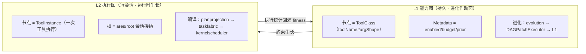

**图中每一步都对应真实源码：** `MutableDAG`（`workflow/engine/mutable_dag.go`）、`GraphEventHub` 的单调 `seq` + 每订阅者 drop 计数（`graph_events.go`）、`DAGPatchExecutor`（`dag_patcher.go`）、`WorkflowGenome` 九算子（`evolution/genome/`）、`UpdateLiveDAG` 重指基因组（`ares_bootstrap/provide_new_evolution.go`）。

---

### 执行链：事件驱动，图是计划，fabric 是事实

ReAct 一轮被展开成"一次工具执行就一个节点"。执行**不在图里**，而在调度器——每个节点编译成 `taskfabric` 任务，由 `kernelscheduler` drain，经 agent 的 Cognition 跑一个量子，结果写进 fabric 任务的 checkpoint envelope：

```mermaid
flowchart LR
    GROW["L2Graph.AddToolNode<br/>(单次 AddNode 带 DependsOn)"]-->EVT["GraphEventHub"]
    EVT-->COORD["CompileCoordinator.SubscribeGraphEvents<br/>ApplyChange / Reconcile(seq 跳号/drop 对账)"]
    COORD-->CT["taskfabric.CompileNode"]
    CT-->DR["kernel.Scheduler.Run/drain"]
    DR-->SEL["capability 打分选赢者"]
    SEL-->EXEC["fabricAgentExecutor.ExecuteStep"]
    EXEC-->COG["agent.Cognition(router→tool/answer/root)"]
    COG-->Q["buildQuantumStep<br/>Done/Yield/Fail + envelope 重包"]
    Q-->ENV["checkpoint envelope(Output 落点 = fabric)"]
```

这背后是 M0/M1/M1.5 三块真实落地：

- **M0 增量编译器**：`CompileCoordinator.ApplyChange` 按 `ChangeType` 精确响应，`SetDependencies`/`UpdatePayload`/`CompileNode`/依赖跨批解析（`taskfabric/workflow_plan.go`），不再整批重编译。
- **M1 执行体**：`toolCognition`/`answerCognition`/`rootCognition` 全部实现同一个 `Cognition` 接口；`routerCognition` 按 `Task.AgentType` 派发。
- **M1.5 事件路径**：`Reconcile` 补偿丢事件，`arg.` 命名空间隔离工具参数，`DAGExecution` 闸门（默认关=老 ReAct）——开闸后 agent 走会话图，关闸保持今天行为。

**`DAGExecution` 闸门**是过渡期的护栏：生产默认关，peer 仍用 `chatCognition`；开闸前置是"agent 广告全量 capability + 会话注册表"，没到前不动它。

---

## 模块拆解：每个核心包一张组件图

### agentfabric — 一次性 Agent + 执行体注入

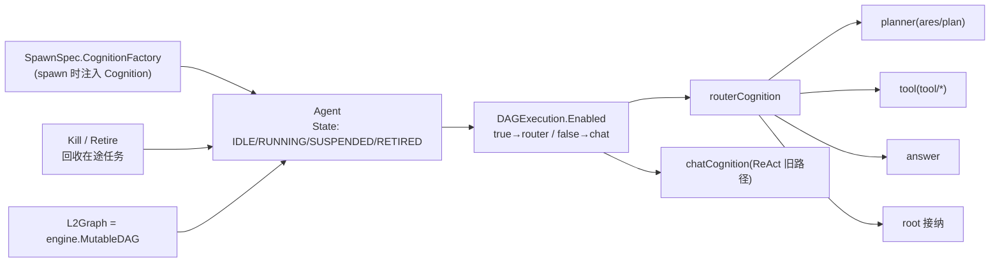

### kernelscheduler — 调度流水线

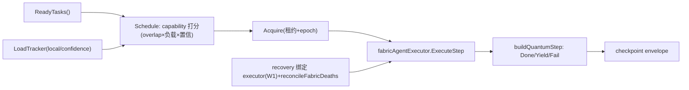

### taskfabric — 任务状态机

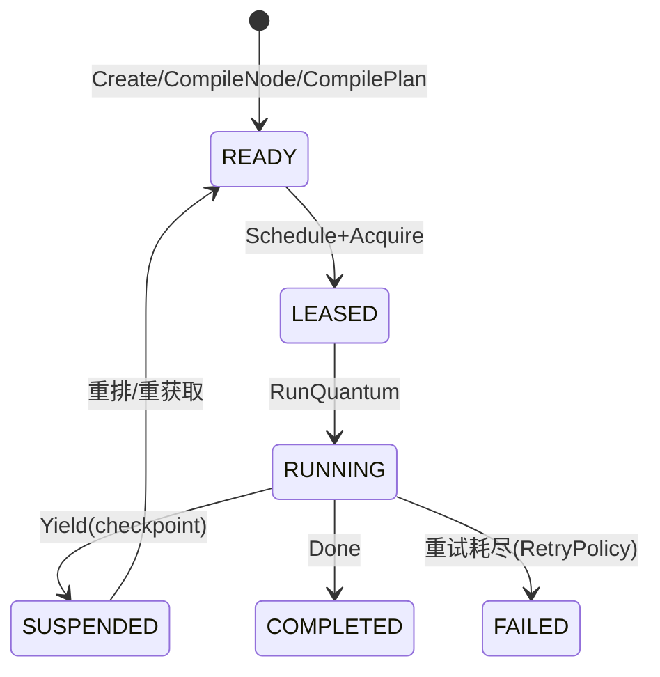

### workflow/engine — 图引擎

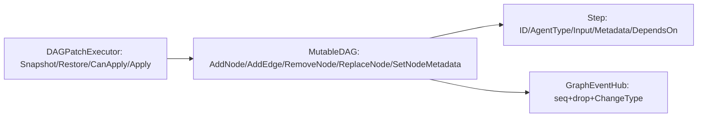

### planprojection — 图→任务编译

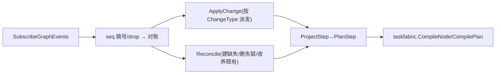

### evolution (v2) — 进化流水线

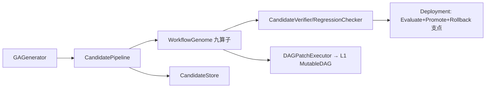

### ares_experience — 记忆蒸馏

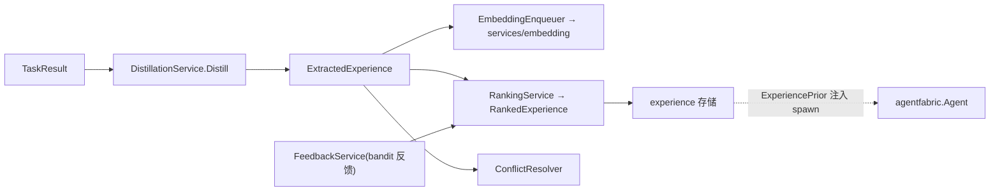

### ares_memory — 记忆管线

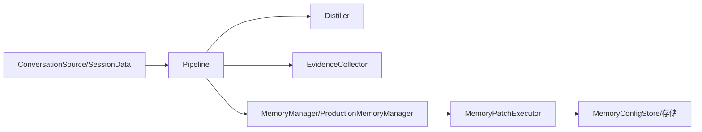

### tools/toolsource — 工具发现与检索

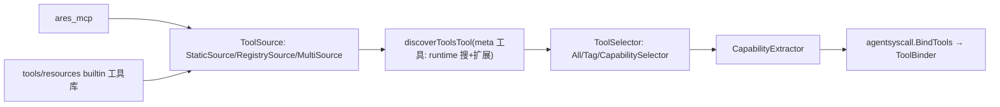

### aresrecovery — Agent 复活/恢复

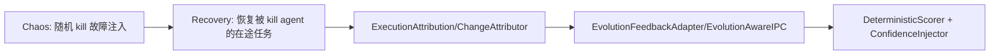

### ares_events — 事件总线

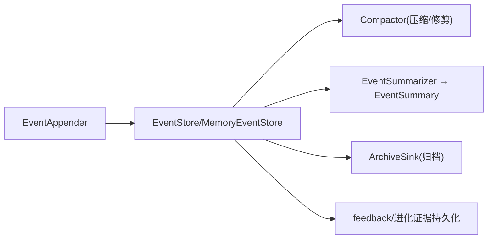

---

## 设计原则

**1. Agent 是一次性的，Task 是持久的。**

这是最重要的原则：**Agent 死亡 ≠ Task 死亡。** `aresrecovery.Recovery` 恢复被 kill 的 agent 在途任务，`kernelscheduler` 的 recovery 绑定 executor（W1）把替身 executor 只绑定到那一张任务上——绝不去抢别的任务。每个 Execution Quantum 结束 yield，checkpoint 已落盘，下一个 quantum 从检查点续跑。

**2. 记录一切，回放一切。**

每个动作——LLM 调用、工具调用、任务分配、记忆查询——都是 `ares_events.EventStore` 里的一个事件。`introspect` 让你看运行时的调度决策（Scheduling Observatory）；想要恢复状态？回放事件。

**3. 图是计划，fabric 是事实。**

L2 图节点**不存 Output**。执行结果永远在 fabric 任务的 checkpoint envelope 里，读副作用按 `节点ID = 任务ID` join。加一层"回写器"把结果抄回图节点？那是 `toolprojection` 事后投影的翻版，我砍掉了。两条事实来源等于零条事实来源。

**4. API 层是契约，不是实现。**

`internal/llmcore/` 定义类型，`api/core/` 是 deprecated 转发别名（M5 内部化），`ares_bootstrap` 把它们接在一起。换实现不换契约——从内存切到 PostgreSQL 只换 `storage` 的实现。

---

## 有什么不同

大多数 Agent 框架是"LLM 编排引擎"——聚焦 prompt 链和工具调用。ares 是 **Agent 运行时**——把 ReAct 循环展开成图、把工具执行变成一等调度实体。这换来 fabric 的重试、抢占、租约、崩溃恢复、依赖就绪——这些 ReAct 循环里的工具调用本来一样都没有。

| 能力 | 典型框架 | ares（当前） |
|------|---------|------|
| Agent 生命周期 | 启动然后祈祷 | Agent Fabric：spawn → idle → running → suspend → retire；`aresrecovery` 复活被 kill 的 agent |
| 调度模型 | Leader 分发 | **Agents are not orchestrated, they are scheduled.** kernel scheduler + capability 打分 |
| 工具执行 | ReAct 循环体内 | 一次工具执行 = 一个图节点 = 一个可调度任务（重试/恢复/依赖就绪免费） |
| 执行结构 | 线性消息 | 两层同构 `engine.MutableDAG`：L1 能力图（进化）/ L2 执行图（会话） |
| 记忆 | 消息历史硬塞 context | `ares_experience` 蒸馏 + `ares_memory` 长时记忆 + `ares_skills` 置信先验，spawn 时作 ExperiencePrior |
| 复活 | 无 | `aresrecovery.Recovery` + recovery 绑定 executor（W1）+ `Chaos` 故障注入验证 |
| 可观测 | 日志 | `ares_events` 事件溯源 + `introspect` 决策面板 + observability 指标 |
| 自我改进 | 无 | `evolution` Candidate → 验证 → Deployment 发布（只 patch L1）|
| 工具发现 | 硬编码注册 | `tools/toolsource` discover_tool 元工具 + selector + DynamicSelector + `ares_mcp` |

---

## 坦诚说

这个项目从一个聊天机器人开始，长成了我没计划的样子。进化引擎来自"如果 Agent 能自己优化 prompt 呢？"混沌工程竞技场来自"如果我能杀掉一个 Agent 然后看它恢复呢？"

**当前最诚实的边界：**

- **工具 DAG 主线还在 `DAGExecution` 闸门后面关着**。M0/M1/M1.5 都落地并测试全绿，但生产 peer 仍走 `chatCognition`。开闸需要 M2 会话注册表 + M3 全量 capability 广告，我没到那一步不硬开。
- **Evolution 有 v1/v2 两份**（`ares_evolution` 与 `evolution`）并存。主线只保证"新代码只接 v2 + `MutableDAG`"，v1 那 30 个生产文件没动——清了是另一次重构。
- **`toolprojection` 是待删的死代码**。图就是事实，事后投影是纯冗余，「删除即彻底」在 M4 那一步做。
- **`taskfabric` 纯内存**。崩溃恢复的前提是 L2 图可重建——`TestL2Graph_RecompilesIdempotentAfterRestart` 就是把这个前提固化成了测试。
- **给工具系统的 `M6` 回灌**（L2 结果 → L1 fitness）还没接，那是进化闭环的最后一段。

每个功能都来自真实问题，不是功能清单。这就是架构看起来这样的原因——不是自上而下设计的，是自下而上进化出来的。

---

## 系列文章

| # | 主题 | 你会学到什么 |
|---|------|-------------|
| I | **本文** | 全局视角 + 两级同构 MutableDAG + 全模块拆解 |
| II | Agent 和声协议 | Agent 怎么通信 |
| III | 记忆蒸馏 | `ares_experience`/`ares_memory` 怎么记住和遗忘 |
| IV | 工作流引擎 | `workflow/engine.MutableDAG`：任务怎么在 DAG 里流、怎么进化 |
| V | 工具调用层 | `tools/toolsource` 怎么发现、检索、绑定工具 |
| VI | 安全与可观测 | `ares_events`/`introspect` 怎么看到发生了什么 |
| VII | 运行时与生命周期 | Agent 怎么活和死、怎么复活 |
| VIII | 事件系统 | 状态怎么记录和恢复 |
| IX | 竞技场 / 故障注入 | `aresrecovery.Chaos` 怎么故意搞破坏再验证恢复 |
| X | 检索系统 | 怎么找到相关记忆 |
| XI | 自主进化 | `evolution` 怎么只 patch L1、怎么发布 |
| XIII | Bootstrap 与 API | `ares_bootstrap` 怎么无痛接线 |
| XV | MCP 集成 | `ares_mcp` 怎么教 Agent 用工具 |
| 19 | 存储层 | `storage/postgres` + `services/embedding` |
| 20 | LLM 客户端层 | `llm` Failover、多 provider 抽象 |
| 21 | 评估框架 | `ares_eval` EvaluatorRegistry/LLMJudge |

每篇文章遵循同一个模式：**问题 → 设计旅程 → 权衡取舍 → 坦诚反思。**

不营销。不"比 X 快 10 倍"。只有工程师聊工程。