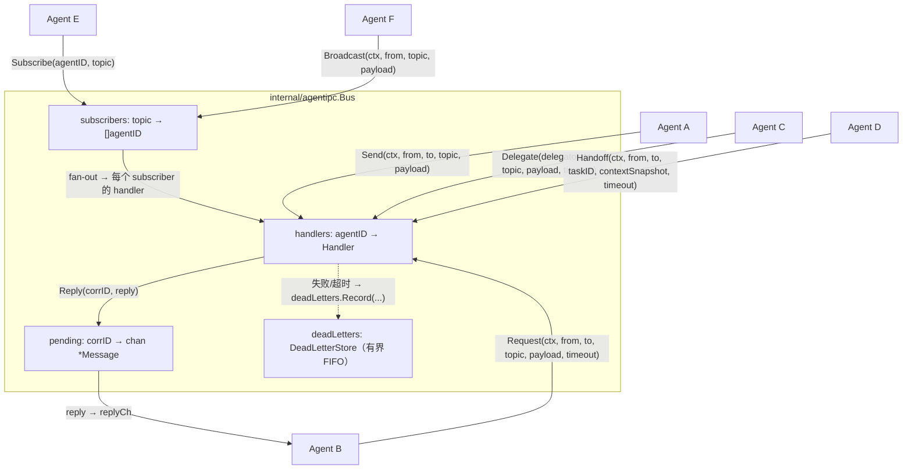
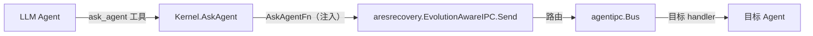

# ares 架构深度解析（二）：Agent IPC — Peer-Mesh 通信原语（0.3.x）

> 聊到多 Agent 系统，很多人第一反应是："Agent 之间怎么说话？用 HTTP 还是 WebSocket？走消息队列？"
> ares 的回答是 **Agent IPC**——一个纯进程内的 peer-mesh 消息总线，六原语，不走 Leader。

## 写在前面

多 Agent 系统最烦的一件事，不是 Agent 不够聪明——是 Agent 之间不说话。

ares 的 Agent 是**同级认知进程（A ≡ B ≡ C）**：父子只有 spawn provenance（谁生了谁），不构成权限层级。通信不依赖 Leader 中转，而是走一个 `internal/agentipc`（ARES Kernel 的 IPC pillar）。

我自己最早从 Python 的 Redis 队列开始，后来换 Go 时认真折腾过 RabbitMQ——装 Erlang、配 vhost、建 exchange、画 binding key，再写几百行胶水代码把一条消息从 Agent A 送到 Agent B。测完一看，端到端延迟比 Go channel 高了几个数量级，而这代价还不是网络导致的——两个 Agent 在同一个进程里跑。纯纯的序列化 + 消息路由开销。

所以 ares 的通信是纯进程内的：**不走网络、不序列化、不依赖中间件**，就是 channel + 共享内存。

## 一、包的结构：一个 Bus 就是全部状态

`internal/agentipc/` 的核心是 `Bus`。它把 agentID 映射到 handler，提供完整的原语集。所有状态都收在 `mu sync.RWMutex` 下面：

| 字段 | 作用 |
|------|------|
| `handlers map[string]Handler` | agentID → 消息处理函数 |
| `subscribers map[string][]string` | topic → 订阅者 agentID 列表 |
| `pending map[string]chan *Message` | correlationID → 回复 channel（缓冲 1） |
| `pendingErr map[string]error` | correlationID → handler 出错时暂存的 error |
| `deadLetters *DeadLetterStore` | 失败请求的有界存储（GAP-3） |
| `collabObserver CollaborationObserver` | 协作结果回执（Step Y.2，nil = 不观测） |



## 二、六原语

`Bus` 对外暴露的沟通动作就是这些方法（签名见真实代码）：

### 2.1 Send — 发了就忘

```go
func (b *Bus) Send(ctx context.Context, from, to, topic string, payload any) error
```

最简单的原语：把消息投递给目标 Agent，不等回复。目标的 handler 在**调用方 goroutine 里同步执行**；失败返回 error，但不阻塞发送方。**Send 不配对 Reply**——需要请求/回复语义就用 Request。目标不存在（`ErrAgentNotRegistered`）或 handler 报错时，记录进 `deadLetters`。

### 2.2 Request — 请求/回复

```go
func (b *Bus) Request(ctx context.Context, from, to, topic string, payload any, timeout time.Duration) (*Message, error)
```

同步请求/回复：发送并等待回复。Bus 分配 correlationID 并注册 pending reply channel。发送方的等待是一个 `select`，回复到达、ctx 取消、或超时三者取其一。

关键实现点：

- **managed goroutine + 子 ctx**：handler 在独立 goroutine 里跑（`invokeHandler`），并继承一个带 timeout 的 child context——timeout 一到 handler 就被 cancel，不再泄漏。
- **B16**：`timeout <= 0` 时自动用 30s 默认值（`defaultRequestTimeout`），不会无限阻塞。
- **handler 报错**：通过"sentinel nil reply"唤醒调用方，真正的 error 暂存进 `pendingErr`，调用方取回。
- **handler panic**：`invokeHandler` 有 `recover` 边界，把 panic 收敛成 `ErrHandlerPanic`，只挂这一个请求，不让进程死掉。
- **ctx 取消不算投递失败**：`ctx.Done()` 说明调用方自己放弃了等待，请求可能已经投递并处理了。所以 ctx 取消**不会写进 dead letter**，避免挤掉真正的投递失败。

### 2.3 Reply — 异步回复

```go
func (b *Bus) Reply(corrID string, reply *Message) error
```

当 handler 不能立刻返回回复时，可以稍后调用 Reply。correlationID 把回复和原始请求配对。对已超时/取消的请求，Reply 是 best-effort drop（`deliverReply` 里找不到 pending 就直接返回 nil）——不阻塞、不 panic。`corrID` 为空或 `reply` 为 nil 时返回 `ErrInvalidMessage`。

### 2.4 Delegate — 请求转交

```go
func (b *Bus) Delegate(ctx context.Context, delegator, to, topic string, payload any, timeout time.Duration) (*Message, error)
```

"我处理不了——帮你转给能处理的人。"实现上就是 `return b.Request(ctx, delegator, to, topic, payload, timeout)`：委托者用自己的 ID 当 From 发起请求，目标看到的发送者是 delegator。原始请求者的 correlationID 端到端保留，回复可以链式返回。

### 2.5 Handoff — 任务转移

```go
func (b *Bus) Handoff(ctx context.Context, from, to, taskID string, contextSnapshot map[string]any, timeout time.Duration) (*Message, error)
```

Peer-to-peer 任务所有权转移。与 Send 不同，Handoff 携带结构化 payload：`{task_id, context, artifacts}`，topic 固定为 `"handoff-task"`，接收方确认接受。**发送方让出任务，接收方接手——不经过 Scheduler**（"我知道谁该干"的路径；Scheduler 是"我不知道谁该干"的路径）。底层同样是 `Request`。

### 2.6 Subscribe / Broadcast — 订阅/广播

```go
func (b *Bus) Subscribe(agentID, topic string) error
func (b *Bus) Unsubscribe(agentID, topic string)
func (b *Bus) Broadcast(ctx context.Context, from, topic string, payload any) int
```

"I found X — anyone interested in X should know。"Agent 订阅感兴趣的 topic，任何 Agent 可以向某个 topic 广播。Broadcast 是 fire-and-forget fan-out：逐个调用订阅者的 handler，单个 handler 失败不中断 fan-out，返回成功投递数。**B16**：Subscribe 去重，同一 agent 不会重复加入同一 topic。`Unsubscribe` 把订阅者从该 topic 移除。

## 三、Message 模型

`Message` 就是通信单元，字段是真实代码里的（`bus.go`）：

| 字段 | 说明 |
|------|------|
| `ID string` | Bus 生成的唯一消息 ID（`msg-<n>`） |
| `From string` | 发送者 agentID |
| `To string` | 目标 agentID（`""` = 广播给订阅者） |
| `Topic string` | 消息主题（如 `"verify-conclusion"`、`"handoff-task"`） |
| `CorrelationID string` | 请求/回复配对 ID（fire-and-forget 时为空） |
| `Payload any` | 消息体 |
| `At time.Time` | 发送时间戳 |

没有 JSON 序列化——原语方法本身就是意图，payload 里不需要塞一个 `method` 字段来表达语义。

## 四、DeadLetterStore：有界可观测

`Bus` 内部有一个 `DeadLetterStore`（`deadletter.go`）：

```go
type DeadLetterStore struct {
    mu       sync.Mutex
    next     uint64
    capacity int
    entries  []DeadLetter
}
```

- **有界 FIFO**：`NewDeadLetterStore(capacity)`，`capacity <= 0` 时回落到默认 1024；满了踢最老的。
- **可观测**：`Snapshot() []DeadLetter`、`Count() int` 可读。
- **记录结构**：`DeadLetter{ID, From, To, Topic, Payload, Reason, At}`——保留失败原因（如 `ErrAgentNotRegistered` / `ErrTimeout`）。
- **注意**：这里**只有记录，没有自动重投方法**（原始文档提到"自动/手动重投"），当前 API 里我能看到的是 `Record / Snapshot / Count` 三件事；"重投"在本版本是否已实现，标注为待核实。

## 五、从 syscall 走向 Agent（`internal/agentsyscall`）

Bus 是 Kernel 层面的原语。真正的 LLM Agent 通过工具调用去用通信——这在 `internal/agentsyscall`（"Agent decides. Kernel enforces."）：

| 工具常量 | 作用 |
|------|------|
| `SpawnAgentTool = "spawn_agent"` | 派生一个新 peer agent |
| `CreateTaskTool = "create_task"` | 拆出一个 Task Fabric 子任务 |
| `AskAgentTool = "ask_agent"` | **问某个目标 Agent 一个问题** |
| `CreatePlanTool` | 创建整图计划（plan.go） |

`ask_agent` 是最贴近"Agent 之间说话"的入口：`Kernel.AskAgent(ctx, AskAgentArgs{To, Topic, Payload})` 校验目标非空后，转交给注入的 `AskAgentFn`——生产环境在 serve 时接成 `aresrecovery.EvolutionAwareIPC.Send`，最终路由到 `agentipc.Bus`。`BindTools(binder, kernel)` 把 `spawn_agent / create_task / ask_agent / create_plan` 注册到 LLM 的工具绑定器上，`ToolSchemas()` 生成给 LLM 看的 schema。

一句话链路：



## 六、双轨调度：PolicyFlag

`agentipc` 里还有一层与"任务怎么派"相关的（`policy.go`），跟通信原语平行：`ExecutionPolicy`（`PolicyLegacy` / `PolicyTaskFabric`）和 `PolicyFlag`（`atomic.Int64`，0=legacy、1=task fabric，运行时翻转、不需要重启生效）。`DualTrackDispatcher` 持有 legacy 和 new 两条路径的 `Dispatcher`，按 flag 选一条 active；打开 shadow 时 inactive 路径也会跑，比较 outcome 是否一致（`Mismatches()`），这就是"双轨等价"验证的 surface。

> 注意：当前生产只有 `PolicyTaskFabric`——Leader 运行时已移除。`PolicyLegacy` 只是作为库常量保留，供双轨验证/阴影模式用。原文档提到的"AHP 五消息类型/DLQ 自动重试"等旧协议细节，不在 `internal/agentipc` 里，相关旧路径以 `internal/runtime/protocol/ahp/ahp` 与 `internal/agents/peer` 为准（本系列暂不展开，待核实）。

## 七、设计取舍（坦诚环节）

1. **纯进程内**：跨不了进程。要跨进程，`Bus` 的 `map[string]Handler` 得换成某种服务发现 + 网络传输，pending reply channel 的同步语义也要重新设计。这是已知边界。
2. **Broadcast 没有背压**：fan-out 是同步调每个订阅者 handler，订阅者慢会阻塞。没有 per-subscriber 缓冲队列。
3. **Subscribe 不支持模式匹配**：只做 exact topic match，没有通配符（如 `task.*`）。
4. **六个原语组合的边界情况**：比如 Delegate + Handoff 的组合语义（B 能不能把 A 委托给它的任务再 Handoff 给 C？correlationID 怎么链式传？）目前语义清楚，但充分测试覆盖标注为待核实。

## 八、总结

`internal/agentipc` 是 ares 的 peer-mesh 消息总线：`Send` 发了就忘，`Request/Reply` 请求回复，`Delegate` 请求转交，`Handoff` 任务转移，`Subscribe/Broadcast/Unsubscribe` 订阅广播。`DeadLetterStore` 有界可观测。`PolicyFlag + DualTrackDispatcher` 做双轨调度验证。而 `internal/agentsyscall` 把 `ask_agent` 等工具暴露给真正的 LLM Agent——"Agent decides. Kernel enforces."

旧 AHP 兼容层与 peer 直投路径与新的 Agent IPC 并行运行（feature flag 渐进切换），长期目标是新通信都走 Agent IPC。**

下一篇聊聊**经验蒸馏**——Agent 怎么从任务结果里把可复用经验提炼出来，下次遇到类似问题直接复用。