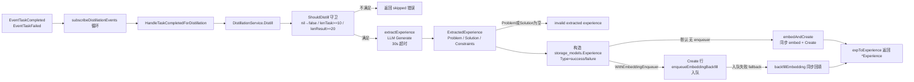

# ares 架构深度解析（三）：记忆蒸馏 —— 经验是怎么被提炼、排序、复用和遗忘的

> 你用过那种 agent 吗？跑了几小时，把中间每次任务的输入输出都记住，结果 memory 越塞越大，真正该记得的"上次我踩过这个坑"反而找不着。
> 我当时在想：**与其记住"发生了什么"，不如记住"说明了什么、下次该怎么干"。**
> 于是产出了这一大坨东西：一条把任务结果蒸馏成可复用 `Experience` 的管线，一条把对话蒸馏成 `Memory` 的管线，再加一个把任务模式记成 skill 相关度先验的 `Experience`。名字都叫"经验"，干的是三件不同的事。

> 阅读前说明：本文只描述当前仓库里真实存在、我能实测到的符号与流程。凡是我没有在代码里核实到的说法，我都会明确标成**（待核实）**，不替你脑补"应有的架构"。

---

**系列导航**

| 篇目 | 主题 | 状态 |
|------|------|------|
| 03 | 记忆蒸馏：经验蒸馏 / Memory 蒸馏 / Skill 先验 | 本文 |
| 04 | Workflow Engine（预告） | 下一篇 |

---

## 一、先厘清一件事：ares 里其实有「三条蒸馏」

模块名看起来都是"experience / memory"，但代码里是三条互不相干的管线，别混着看：

1. **经验蒸馏**（`internal/runtime/memory/experience`）：把**任务执行结果**（TaskResult）蒸馏成可复用、可排序、可反馈的 `Experience`。这是本文的主角。
2. **Memory 蒸馏**（`internal/runtime/memory/distillation` + `pipeline.go`）：把**一段对话**蒸馏成分类后的 `Memory`（knowledge/preference/interaction/profile），并生成报告、做推送。
3. **Skill 先验**（`internal/runtime/protocol/skills`）：把「任务模式 → skill 相关度」记成先验，供调度器当置信度来源用。

它们共享了"经验（experience）"这个词，但输入、输出、生命周期都不同。下面逐个讲，**只讲我从代码里读到的**。

---

## 二、经验蒸馏：从 TaskResult 到 Experience

### 2.1 入口：任务完成/失败事件

经验蒸馏不是被谁主动 `call` 一次的，而是挂在**事件订阅循环**上跑的。`internal/ares_bootstrap/bootstrap_steps.go` 里的 `subscribeDistillationEvents` 会订阅两类事件：

- `EventTaskCompleted`
- `EventTaskFailed`

每收到一条事件，就把 `HandleTaskCompletedForDistillation` 塞进同一个循环处理。真正的入口动作里，intent 是这样的：

```go
// internal/ares_bootstrap/provide_distillation.go（节选）
func HandleTaskCompletedForDistillation(ctx context.Context, svc *aresexp.DistillationService, ev *ares_events.Event) {
    taskText   := stringField(p, ares_events.EventKeyTask)
    resultText := stringField(p, ares_events.EventKeyResult)
    tenantID   := stringField(p, ares_events.EventKeyTenantID)
    agentID    := stringField(p, "agent_id")
    usedExpID  := stringField(p, ares_events.EventKeyUsedExperienceID)

    // 内容长度守卫：task < 10 字符或 result < 20 字符直接跳过
    if tenantID == "" || len(taskText) < 10 || len(resultText) < 20 {
        return
    }

    taskResult := &aresexp.TaskResult{
        Task: taskText, Result: resultText,
        TenantID: tenantID, AgentID: agentID,
        UsedExperienceID: usedExpID,
        Success: ev.Type == ares_events.EventTaskCompleted,
    }
    if _, err := svc.Distill(ctx, taskResult); err != nil {
        log.Warn("bootstrap: distillation on task completion failed", "error", err)
    }
}
```

输入结构体 `TaskResult` 定义在 `internal/runtime/memory/experience/task_result.go`：

```go
type TaskResult struct {
    Task             string // 任务描述（蒸馏的输入文本）
    Context          string // 额外的上下文
    Result           string // 任务的输出/结果
    Success          bool   // 任务是否成功
    AgentID          string
    TenantID         string // 多租户隔离
    UsedExperienceID string // 本次执行用到的经验 ID（用于强化信号追踪）
}
```

> 关键澄清：**成功和失败的任务都会参与蒸馏**。文档注释明确写着 "Both successful and failed tasks are eligible: successful tasks yield success experiences, while failed tasks yield failure experiences." 所以"只有成功任务才蒸馏"是错的。

### 2.2 主流程：Distill

蒸馏服务 `DistillationService`（`internal/runtime/memory/experience/distillation_service.go`）的核心方法是 `Distill`，流水线如下：



`Distill` 里几个真实存在的关键点：

**门槛 `ShouldDistill`** —— 只看内容长度，不看成功与否：

```go
func (s *DistillationService) ShouldDistill(ctx context.Context, task *TaskResult) bool {
    if task == nil { return false }
    if len(task.Task) < 10  { return false }
    if len(task.Result) < 20 { return false }
    return true
}
```

**LLM 提取 `extractExperience`** —— 构造一个"输出 Problem/Solution/Constraints 三段式"的 prompt，调 `llmClient.Generate`（30 秒超时），然后用 `parseExtractionResponse` 逐行解析成 `ExtractedExperience`：

```go
type ExtractedExperience struct {
    Problem     string
    Solution    string
    Constraints string
}
```

**经验类型** —— 按 `task.Success` 决定 `Type`：

```go
expType := ExperienceTypeFailure   // "failure"
if task.Success { expType = ExperienceTypeSuccess }  // "success"
```

**持久化 / 向量** —— 这里分两条腿走（就是 option `/a2` 异步回填路径）：

- 默认（没有注入 `EmbeddingEnqueuer`）：`embedAndCreate` 同步 `embed` 出向量，随行一起 `Create`。
- 配置了 `WithEmbeddingEnqueuer`：先把行写进去（`Embedding` 暂为 NULL），再 `enqueueEmbeddingBackfill` 把回填任务投到队列，由 embedding worker 后台把向量写回。若入队失败，会打印 Warn 并**退回同步回填**，保证这一行不会长期没有向量。

对应 `EmbeddingEmbeddingEnqueuer` 接口（定义在消费方，避免 `DistillationService` 依赖具体的 postgres 队列实现）：

```go
type EmbeddingEnqueuer interface {
    Enqueue(ctx context.Context, task *EmbeddingTask) error
}

type EmbeddingTask struct {
    TaskID   string // 即经验行的 ID，向量会写回这行
    Content  string
    TenantID string
    Model    string
    Version  int
}
```

还有批量入口 `DistillBatch(ctx, []*TaskResult)`：逐个 `Distill`，单个失败只记 Error 日志并跳过，继续处理剩下的。

> 澄清两点我实测到的行为：① 异步回填是**可选的**（bootstrap 里默认配置了），SDK 零配置调用方仍走同步；② 同步和异步两条路径最终都会把 `EmbeddingModel` / `EmbeddingVersion` 打上（版本取自 `embeddingConfig.DefaultVersion`，未配置时回落到 `postgres.DefaultEmbeddingConfig().DefaultVersion`）。

### 2.3 领域模型：Experience 长什么样

蒸馏服务的产出是 `internal/runtime/memory/experience/ranked_experience.go` 里定义的领域 `Experience`（与存储行结构一致）：

```go
type Experience struct {
    ID               string
    TenantID         string    // 多租户隔离
    Type             string    // "success" 或 "failure"
    Problem          string    // 抽象的问题陈述（也是 embedding 的目标文本）
    Solution         string    // 简洁的解决方案
    Constraints      string    // 重要约束/上下文
    Embedding        []float64
    EmbeddingModel   string
    EmbeddingVersion int
    Score            float64   // 总体评分（bandit 反馈信号，RecordFailure 会降低它）
    Success          bool      // 原始任务是否成功
    AgentID          string    // 产出该经验的 agent
    UsageCount       int       // 成功使用次数（强化信号）
    DecayAt          time.Time // 过期时间；零值 = 永不过期
    CreatedAt        time.Time
}
```

这段结构里，**Problem/Solution/Constraints 分离**、**Score 作为带反馈改写的分数**、**UsageCount 作为复用强化信号**，是三个真正落在代码里的设计决策。

---

## 三、反馈闭环：FeedbackService（bandit）

经验存进去之后不会躺平，`FeedbackService`（`feedback_service.go`）把任务结果喂回去，形成强化环路：

```go
// 任务成功用到了某条经验 → 使用计数 +1
func (s *FeedbackService) RecordSuccess(ctx, tenantID, experienceID) error {
    return s.experienceRepo.IncrementUsageCount(ctx, tenantID, experienceID)
}

// 任务失败用到了某条经验 → 排名分 -1（rank 下降）
func (s *FeedbackService) RecordFailure(ctx, tenantID, experienceID) error {
    return s.experienceRepo.DecrementRank(ctx, tenantID, experienceID)
}

// 便捷方法：按 success 分流到上面两个
func (s *FeedbackService) RecordFeedback(ctx, tenantID, experienceID string, success bool) error
```

一句话概括代码逻辑：**用了一次成功 → UsageCount+1；用了一次失败 → Score 相应下降（DecrementRank）**。这为后面的排序提供了两个独立信号源。

---

## 四、排序：RankingService（多信号加权）

光有经验不够，召回后总得排个序。`RankingService`（`ranking_service.go`）实现了一个"轻量 bandit"式的多信号打分。

公式（代码注释 + 实现双重确认）：

```
FinalScore = SemanticScore + UsageBoost + RecencyBoost + 持久化的 Score
其中：
  UsageBoost   = min( log(1 + usage_count) * UsageWeight , 0.2 )
  RecencyBoost = exp( -age_days / RecencyDays ) * RecencyWeight
```

默认权重在 `NewRankingService` / `DefaultRankingWeights` 里写死：

| 参数 | 默认值 | 含义 |
|------|-------|------|
| UsageWeight | 0.05 | 每次 log 使用量的 boosting 系数 |
| RecencyWeight | 0.05 | 最近经验的 boosting 系数 |
| RecencyDays | 30.0 | 衰减半衰期（天） |

真实代码片段（`Rank` 核心对每条经验打分）：

```go
func (s *RankingService) Rank(ctx context.Context, experiences []*Experience, baseScores []float64) ([]*RankedExperience, error) {
    // len(experiences) != len(baseScores) 时报错
    ...
    finalScore := semanticScore + usageBoost + recencyBoost + exp.Score
    ranked[i] = &RankedExperience{
        Experience:      exp,
        FinalScore:      finalScore,
        SemanticScore:   semanticScore,
        UsageBoost:      usageBoost,
        RecencyBoost:    recencyBoost,
        ConflictChecked: false,
    }
    ...
    sort.Slice(ranked, func(i, j int) bool { // 按 FinalScore 降序
        return ranked[i].FinalScore > ranked[j].FinalScore
    })
}
```

两个 boosting 的真实实现要点：

- `calculateUsageBoost`：`log1p(usageCount) * weight`，封顶 `0.2`，防止老经验靠次数碾压新经验。
- `calculateRecencyBoost`：`exp(-ageDays/recencyDays) * weight`，30 天半衰期，天然老->弱。

`RankedExperience` 还带两个布尔字段，预留给冲突检测：

```go
type RankedExperience struct {
    Experience       *Experience
    FinalScore       float64
    SemanticScore    float64
    UsageBoost       float64
    RecencyBoost     float64
    ConflictChecked  bool
    ConflictResolved bool // 若为 true，表示它在冲突组里被选为最佳
}
```

---

## 五、冲突解决：ConflictResolver（存得简单，查得聪明）

`ConflictResolver`（`conflict_resolver.go`）贯彻一句设计原则：**"Store Simply, Retrieve Smartly"（存得简单，查得聪明）**。

它不做写入期的去重，而是**在召回/排序后做"懒惰式"冲突归并**。两步：

1. `DetectConflictGroups`：对经验按 **problem 向量余弦相似度**做 O(K²) 单链聚类，相似度超过阈值就归到一组。默认阈值 `0.9`（`NewConflictResolver` 里的 `problemSimilarityThreshold`）。
2. `Resolve`：每个组内挑 `FinalScore` 最高的那条作为代表，其余标成 `ConflictResolved`（赢家那条设为 true）。

```mermaid
flowchart LR
    RANK[RankingService.Rank<br/>得到 RankedExperience 列表] --> RES[ConflictResolver.Resolve]
    RES --> GROUPS[DetectConflictGroups<br/>余弦相似度 > 阈值=0.9<br/>O(K²) 单链聚类]
    GROUPS --> BEST[每组内选 FinalScore 最高者]
    BEST --> WIN[返回：每组一条最优经验]
    BEST --> MARK[其余标 ConflictChecked=true<br/>赢家标 ConflictResolved=true]
```

真实代码要点：

```go
func (c *ConflictResolver) cosineSimilarity(vec1, vec2 []float64) float64 {
    if len(vec1) != len(vec2) { // 维度不一致直接 0
        return 0.0
    }
    // 标准点积 / (|v1|*|v2|)
}

func (c *ConflictResolver) Configure(problemSimilarityThreshold float64) error {
    // 必须 0 < threshold <= 1，否则报错
}
```

> 阈值默认是 `0.9`，可通过 `Configure` 覆盖。注意：这与 `internal/runtime/memory/distillation` 里 `DistillationConfig.ConflictThreshold = 0.85` 是**两套不同的冲突机制**——一个是经验排序层（ares_experience），一个是对话蒸馏层（ares_memory/distillation）。别混。

---

## 六、进化引导与 Spawn 先验：经验怎么回流下游

经验蒸馏产出的数据，在系统里有两条下渗路径，都在 `internal/ares_bootstrap/provide_distillation.go` 里接线。

### 6.1 路径 A：喂给进化算法（GA）做引导

bootstrap 构建了一个 `evolution.FuncGuidanceProvider`，把经验库变成 GA 的"提示来源"：

- `HintsFunc`：调 `fetchExperiences` —— 优先用任务类型做语义向量检索（`Embed(任务类型)` → `SearchByVector`），失败则回退 `SearchByKeyword`；把命中的经验映射成 `evolution.EvolutionHint`（`Problem/Solution/Constraints/Confidence`）。
- `RecordFunc`：`recordStrategyOutcome` —— 把 GA 真实跑出来的策略结果写回经验库，形成 **Strategy → Experience → Guidance** 闭环。失败时如实返回错误，不做静默吞掉。

换句话说：**Agent 上一次的成败，会变成下一次进化突变的提示**。这里 `Confidence` 取自经验的 `Score`，并 clamp 到 [0,1]。

### 6.2 路径 B：注入新 agent 的认知上下文（Spawn prior）

`internal/fabric/agent/lifecycle.go` 里，`SpawnSpec` 有个字段 `ExperiencePrior any`：

```go
type SpawnSpec struct {
    // ...
    // ExperiencePrior 是蒸馏出的先验经验，在 spawn 时作为 agent 的初始
    // 认知上下文写入 CognitiveState.Context，让新 agent 带着可复用经验出生，
    // 而不是一张白纸。nil = 无先验（零值可用）。
    ExperiencePrior any
}
```

`Fabric.Spawn` 里对应逻辑（G1：记忆蒸馏挂进 agent 生命周期）：

```go
if spec.ExperiencePrior != nil {
    a.cognitive = CognitiveState{
        SchemaVersion: CognitiveStateSchemaVersion,
        Context:       spec.ExperiencePrior,
    }
}
```

所以"蒸馏出的经验最终能成为新 agent 的初始认知"是**真实存在、有字段可查**的链路。但注意一个诚实边界：**`ExperiencePrior` 是 spawn 时的注入点，我没有在代码里找到一个"自动把经验库搜出来的 top1 填进 ExperiencePrior"的接线器**。它是"留好了口子"，是否已有自动回填路径我标为**（待核实）**。

---

## 七、Memory 蒸馏：把对话变成分类记忆

如果说上面是"任务级"蒸馏，那么 `internal/runtime/memory/distillation` 负责的是"对话级"蒸馏。入口 `Distiller.DistillConversation` 内部是一个多阶段编排（`distiller.go` 里真实存在这些 phase）：

```
extractPhase → classifyAndScorePhase → topNBeforeConflictPhase
            → embedPhase → resolveConflictsPhase → finalTopNPhase
```

配合 `internal/runtime/memory/pipeline.go` 里的 `Pipeline` 协调器，形成一条端到端流水线：

```mermaid
flowchart LR
    SRC[ConversationSource.Next] -->|ConversationBatch<br/>ConversationID/TenantID/UserID/Messages| P[Pipeline.Run]
    P --> D[Distiller.DistillConversation]
    D --> E[extract 阶段]
    E --> C[classify & score<br/>MemoryType: knowledge/preference/interaction/profile]
    C --> T[topNBeforeConflict]
    T --> EMB2[embed 阶段]
    EMB2 --> RES2[resolveConflicts]
    RES2 --> FINAL[finalTopN → []Memory]
    FINAL -->|可选 PushAfterDistill| PUSH[PushService.PushRelevant]
    FINAL -->|按 ReportInterval/结束| RPT[ReportGenerator.Generate<br/>→ reportSink.Save]
```

真实的关键接口与配置：

```go
// pipeline.go
type ConversationSource interface {
    Next(ctx context.Context) (*ConversationBatch, error) // 耗尽返回 io.EOF
}

type Distiller interface { // *distillation.Distiller 满足该接口
    DistillConversation(ctx, conversationID string, messages []distillation.Message,
        tenantID, userID string) ([]distillation.Memory, error)
}

type PipelineConfig struct {
    TenantID          string
    ReportInterval    time.Duration // 0 = 每次 Run 结束时生成一次报告
    PushAfterDistill  bool
    GenerateReportAtEnd bool
}
```

Pipeline 的设计哲学很直白：**只依赖接口、不依赖具体类型，单批次失败只记日志继续，绝不 panic**。`Run` 返回 `PipelineRunResult`（TotalBatches/TotalMemories/FailedBatches/PushedItems/Duration…）。

蒸馏配置 `DistillationConfig`（`distiller.go`）的关键默认值，都是可以逐字核实的：

| 配置 | 默认值 | 含义 |
|------|--------|------|
| MinImportance | 0.6 | memory 被保留的最低重要度 |
| ConflictThreshold | 0.85 | 冲突判定相似度阈值（对话层） |
| MaxMemoriesPerDistillation | 3 | 单次蒸馏最多保留的 memory 数 |
| MaxSolutionsPerTenant | 5000 | 每租户 solution 型记忆上限 |
| EnableCode/Stacktrace/Log/MarkdownTableFilter | true | 各种 noisy 过滤器默认开 |
| EnableCrossTurnExtraction | true | 跨轮提取默认开 |
| PrecisionOverRecall | true | 优先级高于召回率 |

四种记忆分类（`api/experience`，内部包 `ares_memory/distillation/memory.go` 通过别名转发到公共定义）：

```go
type MemoryType string
const (
    MemoryKnowledge   MemoryType = "knowledge"
    MemoryPreference  MemoryType = "preference"
    MemoryInteraction MemoryType = "interaction"
    MemoryProfile     MemoryType = "profile"
)
const (
    ExtractionDirect     = "direct"       // 直接 user-assistant 对提取
    ExtractionCrossTurn  = "cross-turn"   // 多轮对话提取
)
```

以及冲突解决策略（写入期，如果配了 `ExperienceStore`）：

```go
type ResolutionStrategy string
const (
    ReplaceOld Strategy = "replace"    // 新替换旧
    KeepOld    Strategy = "keep_old"   // 旧的高置信度覆盖新的（防低置信度顶掉高置信度事实）
    KeepBoth   Strategy = "version"    // 两个都留（竞争性方案）
    Merge      Strategy = "merge"      // 合并（预留）
)
```

---

## 八、会话与任务记忆：Suite 底层三件套

`ProductionMemoryManager` 借力 `internal/runtime/memory/context` 里的两个内存型存储：

- `SessionMemory`：以 `map[string]*SessionData` 存会话，`SessionData{SessionID, UserID, Messages, Context, AccessedAt, CreatedAt}`。后台 `StartCleanup` 按 TTL/2 周期性清理过期会话；`Cleanup` 每次最多清 100 个（避免长期持锁）。
- `TaskMemory`：以 `map[string]*TaskData` 存任务，`TaskData` 里还有 `Steps []StepRecord` / `Results []ResultRecord` 的执行明细。`TaskMemory.Distill` 把任务打成 `models.Task`（input/output/context），供上层「轻量提取」。

`MemoryConfig`（`manager.go`）默认值一览（全部来自 `DefaultMemoryConfig`，可核实）：

| 字段 | 默认值 |
|------|--------|
| MaxHistory | 10 |
| MaxSessions | 100 |
| MaxTasks | 1000 |
| MaxDistilledTasks | 5000 |
| SessionTTL | 24h |
| TaskTTL | 7d |
| DistilledTaskTTL | 30d |
| VectorDim | 128 |
| EnableRAG | false（opt-in） |
| RAGTopK | 5（启用时踩默认） |
| RAGMinScore | 0.4（启用时踩默认） |

> 说明：RAG 是 opt-in。`EnableRAG=false` 时 `BuildContext/BuildPromptMessages` 表现如旧（仅历史）；置 true 后才会检索过去经验/蒸馏记忆注入 prompt。`ProductionMemoryManager` 里还有 `EnableRAG` 时的 `retrievers []memctx.ContextRetriever`。

---

## 九、MemoryManager 抽象与 Production 实现

经验蒸馏（ares_experience）走的是独立体验；而真正统一记忆访问的抽象是 `MemoryManager`（`internal/runtime/memory/manager.go`），接口三块：

- **会话**：CreateSession / AddMessage / GetMessages / AddStructuredMessage / BuildPromptMessages / BuildContext / DeleteSession
- **任务**：CreateTask / CreateTaskWithID / UpdateTaskOutput / DistillTask / StoreDistilledTask / SearchSimilarTasks
- **生命周期 & 事件**：GetLatestSessionForAgent / Start / Stop / SetEventStore

生产实现 `ProductionMemoryManager`（`production_manager.go`）组合了一堆东西：`dbPool`（PostgreSQL+pgvector）、`retrievalService`、`writeBuffer`（写缓冲）、`embeddingClient`、`conversationRepository`、`taskResultRepository`、`sessionCache`（内存 cached 热点会话）、`ctxCleaner`（去 tool 噪声/压缩冗余）、可选 `eventStore` 与 `EvidenceCollector`。

`EvidenceCollector` 是个极简接口：

```go
type EvidenceCollector interface {
    Emit(ctx context.Context, kind string, payload any, keysAndValues ...string) error
}
```

> 诚实说明：原博客里那些 `experiences_1024` 表名、`StoreDistilledTask` 内部走 WriteBuffer 的具体代码块，我在当前仓库的 `manager` 层没有一一复现——生产实现的内部写法以 `production_manager.go` / `production_manager_tasks.go` 为准，具体细节本文件不再逐行引用。

---

## 十、运行时演进：MemoryPatchExecutor

记忆配置不是只能启动时读一次。`MemoryPatchExecutor`（`memory_patcher.go`）把 `MemoryConfig` 变成了可被打补丁演进的 `patch.RuntimeComponent`，运行期可以改：

- `PatchChangePlanner` → 改 `max_history` / `max_tasks` / `max_sessions`
- `PatchChangeBudget` → 改 `max_distilled_tasks` / `session_ttl`
- `PatchChangeReducer` → 改 `use_structured_cleaning`

它实现了 `validate-before-mutate`（先校验再改，坏 patch 不污染状态），并返回一个可回滚的 `RuntimePatch`（`rollback: restore previous memory config`）。`NewMinimalMemoryManager` 则给没有数据库的默认 bootstrap 路径提供一个只配 config 的轻量 `ProductionMemoryManager`（注意：它的 dbPool/embeddingClient 等是 nil，只能用于 config 访问）。

---

## 十一、Skill 先验：任务模式 → 相关度（相关但不等于"蒸馏"）

第三个叫"experience"的东西在 `internal/runtime/protocol/skills`。它跟上面的蒸馏不是一回事：这是**先验学习（Learned Source）**，只 bias 未来 skill 发现的排序，不自动调用 skill。

- `Experience.Record(skill, taskPattern, successRate)`：记 {skill, 任务模式, 成功率}，重复录制会覆盖成功率；记录数封顶 `maxRecords=1000`，超了淘汰最旧的。
- `Experience.BestMatch(taskPattern)`：按**关键词重叠**算匹配分（短模式用包含判定，长模式分词后按重叠比例打分，阈值 `matchScoreThreshold=0.5`），返回最高成功率的先验。
- 可选持久化：`JSONExperienceStore` 原子写（临时文件 + rename），`NewExperienceWithStore` 启动时预载。
- `ExperienceConfidenceSource`：把 `Experience` 适配成 `taskfabric.ConfidenceSource`，`Confidence(taskPattern)` 返回最佳先验的 `SuccessRate`（无先验返回 0）。形如下游调度器可以由真实学到的先验驱动，而不是写死的常量。

如果你的关注点是"记忆 prior 怎么影响调度"，这一条才是真正落到调度侧的链路，而 ares_experience 的排名/冲突那一套主要服务 GA 引导和 spawn 注入。

---

## 十二、可能你会有疑问的地方（我都标清楚）

把话说透，有几点我在代码里**没有**找到，原博客/直觉里可能"看起来应该有"的东西，如实列出来：

1. **「≥2 条非失败轨迹支持才能转正」——（待核实/未发现）**。我在 `ares_experience` 与 `ares_memory/distillation` 里没有 grep 到 graduate / promote / vote / minSupport 之类的实现；`ShouldDistill` 只看长度。如果你在别处（比如 knowledge/ 或 flight/）看到"转正"逻辑，那属于另一套系统。
2. **「候选知识与正式知识分库存放」——（待核实/未发现）**。经验/记忆都写进统一的 ExperienceRepository，我没看到候选/正式两张表的分库设计。
3. **「原架构三层记忆（Session/Task/Distilled）+ 事件溯源认知恢复」——部分待核实**。`MemoryManager` 接口确实分会话/任务两块，`SetEventStore` 也确实存在；但 `manager.go` 里**没有** DistillTask/SearchSimilarTasks 走 writes "experiences_1024" 之类的表格细节，且 `RecoverAgentState / buildCognitiveState` 那套是 agentfabric 的另一个故事（不是本文件主线）。请以本文引用的文件为准。
4. **「蒸馏省了多少 token / 22.3% 偏差率 / GPT-5.5 / sensenova」那几张表——不采用**。那是我无法在当前仓库追到出处、也无法复现的数值，我不在你面前伪装"实测"。代码里虽然确实有 `distillation/benchmark_token_comparison_test.go` 这类基准测试文件，但本文不再替你编一版"省了 96%"的结论。

---

## 总结：真实的数据流长这样

把三条链路连起来，ares 的记忆"报账"方式其实是：

```
任务结果 TaskResult
  → (事件 EventTaskCompleted/Failed) → DistillationService.Distill
      → ShouldDistill 守卫 → LLM 提取 Problem/Solution/Constraints
      → 存 Experience（成功/失败两个 Type）
      → 默认同步 embed，或异步入队回填向量
  → FeedbackService：成功计数 +1 / 失败 Score 降
  → RankingService：FinalScore = Semantic + UsageBoost + RecencyBoost + Score
  → ConflictResolver：0.9 相似度分组，每组留最高分
  → 下渗：GA 引导(Hints/Record)  +  Spawn 注入(ExperiencePrior → CognitiveState.Context)

对话 Messages
  → (ConversationSource→Pipeline→Distiller.DistillConversation)
      → extract → classify(knowledge/preference/interaction/profile) → embed → resolveConflicts → finalTopN
      → 可选 PushRelevant + 报告生成（reportSink 落盘）

任务模式 taskPattern
  → ares_skills.Experience.Record(skill, pattern, successRate)
  → BestMatch → ExperienceConfidenceSource.Confidence → 调度器/下游置信度
```

诚实收尾：这套代码里真正扎实的核心有四个 —— **事件驱动的任务级经验蒸馏**、**带 bandit 反馈与多信号加权的排序**、**懒惰式冲突归并**、以及 **spawn/GA 两条经验回流通道**。至于"有多少条轨迹支持才转正""候选分库""省了多少 token"这类我未能核实的话术，我这篇一个字都不替你圆。

**下一篇预告**：Workflow Engine —— 0.3.x 中 DAG 直接作为调度源，MutableDAG 运行期增删节点（GraphPatchExecutor），线程安全环检测与检查点恢复。同样是"只讲能核实的代码"的路子。