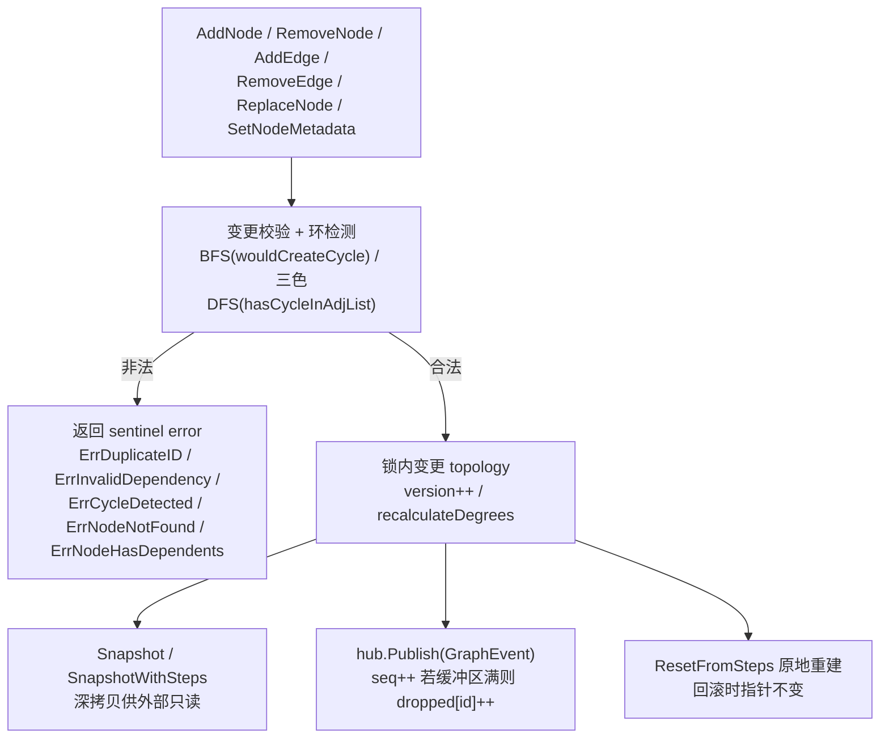
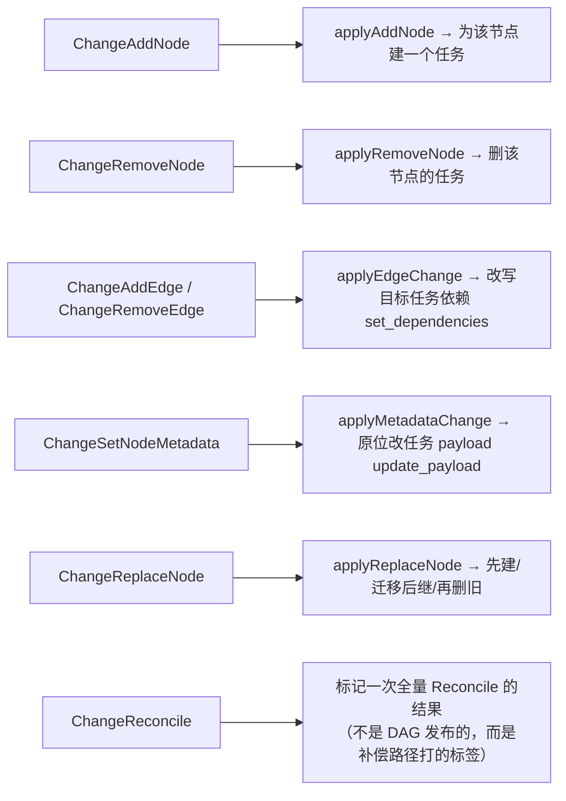
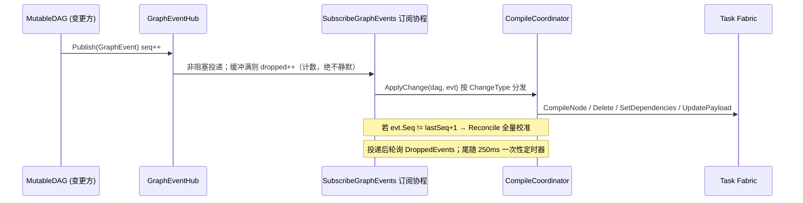

# ares 架构深度解析（四）：工作流引擎 —— DAG 即事实，事件驱动的响应式编译（0.3.x）

> 最早写工作流的时候，我用的是硬编码——if step1 done then step2, if step2 done then step3……
> 后来需求越来越多，我意识到一个朴素但重要的事实：**图是事实（The graph is the source of truth），执行只是投影。**
> 所以 0.3.x 我把重点从"怎么跑 DAG"挪到了"DAG 一旦在运行时变了，怎么把它带来的变化投影到任务集合上"。
>
> 这篇我复盘了五份代码：`workflow/engine/types.go`、`mutable_dag.go`、`graph_events.go`、`dag_patcher.go`，以及 `planprojection/coordinator.go`。
> 只讲我在代码里真实看到的符号和逻辑。看不到的，我不吹。

## 〇、先承认一件事：这篇讲的范围

写这篇之前我把范围卡得很死，就四个模块：

1. **`types.go`** —— `Step` / `Workflow` / `DAG` 的类型定义
2. **`mutable_dag.go`** —— 线程安全的可变 DAG（`MutableDAG`）
3. **`graph_events.go`** —— 变更事件的发布-订阅（`GraphEventHub`）与事件序号
4. **`dag_patcher.go`** —— 把结构 patch 直接打到活拓扑上的 `DAGPatchExecutor`
5. **`coordinator.go`** —— 把图的项目化（projection）编译成 taskfabric 任务的 `CompileCoordinator`

一句话概括这条链路：**运行时改动 MutableDAG → 每次都发一个 GraphEvent → 增量编译器把它投影成一条任务变更 → 任务集合与图收敛。**

## 一、Step：工作流的最小单元

### 1.1 Step 与 Workflow

`Step` 定义在 `internal/fabric/task/workflow/engine/types.go`。我读到的字段：

```go
type Step struct {
    ID             string            `json:"id"`
    Name           string            `json:"name"`
    AgentType      string            `json:"agent_type"`
    Input          string            `json:"input"`
    DependsOn      []string          `json:"depends_on"`
    Timeout        time.Duration     `json:"timeout"`
    RetryPolicy    *RetryPolicy      `json:"retry_policy,omitempty"`
    RecoveryPolicy *RecoveryPolicy   `json:"recovery_policy,omitempty"`
    Interrupt      *InterruptConfig  `json:"interrupt,omitempty"`
    Status         StepStatus        `json:"status"`
    Output         string            `json:"output,omitempty"`
    Error          string            `json:"error,omitempty"`
    StartedAt      time.Time         `json:"started_at,omitempty"`
    FinishedAt     time.Time         `json:"finished_at,omitempty"`
    Metadata       map[string]string `json:"metadata,omitempty"`
}
```

几个我用代码确认的细节：

- **`Output` 字段是"保留"的**。代码注释写得很直白：`Output` 现在生产代码没有任何地方在写（L2 session 图保持它为空），执行事实都放在 taskfabric 的任务信封（envelope）里；前驱 step 的输出是通过 join 信封读到的，**不是读这个字段**。所以别一看到 `Step.Output` 就以为执行结果存在这儿——真相在任务里。
- **恢复策略是一等公民**。`RecoveryPolicy` 带 `Strategy` / `MaxAttempts` / `ReplacementAgent` / `Backoff`，而 `RecoveryStrategy` 就三个值：`retry`、`replace_node`、`fail_fast`。注意代码里 `replace_node` 是"替换节点"，这才是 `ReplaceNode` 能挂到恢复链路上的原因。
- 状态枚举：`StepStatus` 是 `pending / running / completed / failed / skipped`；`WorkflowStatus` 是 `pending / running / completed / failed / cancelled`。

```go
type RecoveryStrategy string

const (
    RecoveryRetry       RecoveryStrategy = "retry"
    RecoveryReplaceNode RecoveryStrategy = "replace_node"
    RecoveryFailFast    RecoveryStrategy = "fail_fast"
)
```

### 1.2 DAG 与 NewDAG

`DAG` 就是经典的节点+邻接表：

```go
type DAG struct {
    Nodes map[string]*DAGNode        // 节点（按 step ID）
    Edges map[string][]string        // 邻接表：src -> targets
}

type DAGNode struct {
    StepID    string
    Metadata  map[string]string      // 见 1.3
    InDegree  int
    OutDegree int
}
```

`NewDAG(steps []*Step) (*DAG, error)` 的顺序校验，我逐行核对过：

1. **ID 规范化 + 去重**：`strings.TrimSpace(step.ID)`，空 ID 直接报错；重复 ID 返回 `ErrDuplicateID`（代码注释称 "H4 fix"，防止静默覆盖）。
2. **依赖合法性与去重**：`DependsOn` 逐个 `TrimSpace`、去重；引用不存在的节点返回 `ErrInvalidDependency`。
3. **环检测**：`hasCycle()` 用带"递归栈"（`recStack`）的 DFS 做有向图判环，有环返回 `ErrCycleDetected`。
4. **拓扑排序**：`GetExecutionOrder()` 是标准的 Kahn 算法（BFS 入度消减）；如果结果数量不等于节点数，返回 `ErrCycleDetected`。

哨兵错误全部集中在 `types.go`：`ErrInvalidDependency`、`ErrCycleDetected`、`ErrDuplicateID`，还有 HITL 相关的一批 `ErrInterrupt*`。

### 1.3 DAGNode.Metadata —— 让"只改元数据"这件事变可见

这是我读代码时觉得最值得讲的一个设计。`DAGNode` 除了 `StepID` 和入度/出度，还带一份 `Metadata`，而它是**构建或 patch 时从所属 Step 的 map 快照过来的**（代码里叫 Y1 方案C / C4）。

为什么要有这个副本？注释解释得很清楚：以前 `DAGNode` 只带度数，一个只改了 `Step.Metadata` 的 父→子 变更会产出 **0 个 patch**——进化系统看到的是"没有拓扑变化"，于是"改元数据"这个算子永远选不中。保留一份 per-node 快照，让 WorkflowDiffer 在处理交给它的快照时是纯的，元数据变化就可见了。

这个细节也直接决定了 `SetNodeMetadata` 的存在意义（见 2.x）：它要**同时**改 Step 的 map 和 DAGNode 的快照。

## 二、MutableDAG：线程安全、可演进的运行时拓扑

`internal/fabric/task/workflow/engine/mutable_dag.go`。核心结构：

```go
type MutableDAG struct {
    mu            sync.RWMutex
    dag           *DAG
    steps         map[string]*Step
    version       uint64         // 单调递增的变更计数
    hub           *GraphEventHub
    SchedulerType string         // 活跃调度器类型（由 genome evolution patch 设置）
}
```

它自己的哨兵错误：`ErrNodeNotFound`、`ErrNodeHasDependents`、`ErrDuplicateEdge`、`ErrEdgeNotFound`。

### 2.1 变更操作一览

| 方法 | 行为 | 校验/失败 |
|------|------|-----------|
| `AddNode(ctx, step)` | 加节点 + 按 `DependsOn` 加边 | 重复 ID→`ErrDuplicateID`；依赖不存在→`ErrInvalidDependency`；会成环→`ErrCycleDetected`；**失败时回滚已加的边再删节点** |
| `RemoveNode(ctx, id)` | 删节点并删相关边 | 节点不存在→`ErrNodeNotFound`；还有节点依赖它→`ErrNodeHasDependents` |
| `AddEdge(ctx, from, to)` | 加有向边 | 节点缺失→`ErrNodeNotFound`；重复边→`ErrDuplicateEdge`；成环→`ErrCycleDetected` |
| `RemoveEdge(ctx, from, to)` | 删边 | 节点缺失、边不存在→`ErrEdgeNotFound` |
| `ReplaceNode(ctx, oldID, newStep)` | 原子替换节点并迁移边 | 见 2.3 |
| `SetNodeMetadata(nodeID, md)` | 原位置换节点 Metadata | 见 2.4 |

每一次合法变更都会 `version++`，并 `hub.Publish` 一个对应的 `GraphEvent`。

### 2.2 环检测：BFS 增量 + 三色 DFS

`AddEdge` 走的增量判环是 BFS：`wouldCreateCycle(from, to)` 从 `to` 出发沿出边 BFS，能回到 `from` 就是成环，加了就不会盲目加。

`ReplaceNode` 因为要动多条边，用的是另一套：在**模拟邻接表**上跑三色 DFS（`hasCycleInAdjList`，白/灰/黑标记），真实修改之前先在模拟图上判环。所以替换操作是原子的——**判环先于变更**，不需要回滚逻辑（源码注释明说 "no rollback logic is needed"）。

### 2.3 ReplaceNode：同 ID / 异 ID 两条路

`ReplaceNode` 的真正签名：`ReplaceNode(ctx context.Context, oldID string, newStep *Step) error`。行为取决于新旧 ID 是否相同：

- **同 ID（原地替换）**：直接更新 step 引用，做边的新旧对比——旧 step 的 `DependsOn` 里新 step 不存在的那些边要删掉，否则节点会"静默保留过期依赖"（源码第 #31 注记）；同时刷新节点的 Metadata 快照。
- **异 ID（边迁移）**：完整迁移——把旧节点的入边/出边重定向到新 ID，更新下游 step 的 `DependsOn`，然后删旧节点。异 ID 也要先过模拟邻接表判环。

替换成功后 `recalculateDegrees()` 从 Edges 重建所有节点的入度/出度，`version++`，发布 `ChangeReplaceNode` 事件（带 `OldNodeID`）。

### 2.4 SetNodeMetadata：C4 元数据变更的落点

前面 1.3 说过，元数据既要改 Step 的 map（这样 patch 在 snapshot/restore——它们按 steps 驱动——下也能存活），又要改 DAGNode 的快照（这样 WorkflowDiffer 能看到元数据变更并产出 patch）。`SetNodeMetadata` 就是干这个的：

```go
func (m *MutableDAG) SetNodeMetadata(nodeID string, md map[string]string) error {
    m.mu.Lock(); defer m.mu.Unlock()
    node, ok := m.dag.Nodes[nodeID]
    if !ok { return ErrNodeNotFound }
    node.Metadata = cloneMetadata(md)
    if step, ok := m.steps[nodeID]; ok { step.Metadata = cloneMetadata(md) }
    m.version++
    m.hub.Publish(GraphEvent{ /* ChangeSetNodeMetadata */ })
    return nil
}
```

### 2.5 读与副本：ReadDeps / Snapshot / ResetFromSteps

封装原则很统一：**不能让外部协程直接摸 `m.mu`/`step.DependsOn`**，所以暴露了带读锁的读取方法：

- `ReadDeps(stepID)` —— 返回依赖列表的拷贝。
- `Snapshot()` / `SnapshotWithSteps()` —— 拓扑深拷贝；`WithSteps` 版在**同一把读锁**下同时给出深拷贝 topology 和浅拷贝的 step 引用（同一个 `*Step` 指针）。
- `Steps()` / `StepIndex()` —— 当前 steps 的拷贝。
- `ResetFromSteps(steps)` —— **原地重建** DAG（保留 `*MutableDAG` 指针不变）。这是回滚安全的根基：runtime manager、WorkflowGenome、各个 patch executor 共享同一个指针，回滚不必换对象。
- `DroppedEvents(subID)` —— 见第三部分的事件丢弃计数。

另外 `GetExecutionOrder()` 在 `MutableDAG` 上有自己的版本：`SchedulerType != "" && != "*graph.DefaultScheduler"` 时，每步对 ready 队列做随机打乱（用 `time.Now().UnixNano()`）——这就是 genome evolution 改调度器配置能真实影响运行时行为的那条缝。

### 2.6 图引擎的一张流程图



## 三、GraphEventHub：事件、序号、丢弃计数

`internal/fabric/task/workflow/engine/graph_events.go`。核心是这三处，都直接来自源码：

```go
type GraphChange struct {
    Type      ChangeType
    NodeID    string
    OldNodeID string // ChangeReplaceNode 用
    FromID    string
    ToID      string
    Step      *Step
    Timestamp time.Time
}

type GraphEvent struct {
    Seq     uint64       // hub 级单调递增序号
    Change  GraphChange
    Success bool
    Error   error
}
```

### 3.1 ChangeType 全集

`ChangeType` 是一个 `int` 枚举，`iota` 起始。完整列表及其语义（我对照编译器的 dispatch 逐项确认）：



注意 `ChangeReconcile` 的重要细节：**它不是 DAG 发布的**。DAG 只发前六种；`ChangeReconcile` 是用来给"全量校准（Reconcile）产生的 ChangeResult"打标签，让"这是由补偿产生的"这件事可归属。

### 3.2 发布与订阅：非阻塞 + 丢弃计数

`GraphEventHub` 内部：

```go
type GraphEventHub struct {
    mu          sync.RWMutex
    subscribers map[string]chan GraphEvent
    dropped     map[string]uint64   // 每个订阅者各自累计的丢弃数
    nextID      int
    seq         uint64
}
```

`graphEventBufferSize = 64`（每个订阅者 channel 缓冲 64 条）。订阅 ID 形如 `sub-%d`，`Unsubscribe(id)` 会 close channel 并删除 dropped 计数（ID 不复用，留着就是死条目）。

`Publish` 的关键行为，我逐行确认：先 `h.seq++` 并把序号写进 event，再对每个订阅者做**非阻塞**投递——`select { case ch <- event: default: h.dropped[id]++ }`。缓冲区满就丢弃，但**绝不静默**：丢弃数累进 `dropped[id]`，同时下一个到达的事件在序号上会留一个空洞。

为什么序号和丢弃计数都这么较真？源码注释说得很重：**"a skipped AddNode is a node that never becomes a task"**——丢了一个 AddNode，就有一个节点永远不会变成任务。所以任何"序号跳变"或"丢弃计数变化"都必须触发全量补偿，而不是耸耸肩当作无事发生。

### 3.3 术语小结

| 概念 | 说明 |
|------|------|
| `Seq` | hub 级单调序号；相邻事件不连续 = 漏事件 |
| `dropped[id]` | 某订阅者因缓冲区满而错过的累计条数 |
| `Dropped(id)` / `DroppedEvents(subID)` | 读上述计数（hub 与 MutableDAG 各暴露一份） |
| `graphEventBufferSize` | 64，channel 缓冲大小 |

## 四、DAGPatchExecutor：把结构 patch 直接打到活拓扑上

`internal/fabric/task/workflow/engine/dag_patcher.go`。这个执行器很直白地体现了一个立场：**补丁不再"存到某处等写到别的地方"，而是直接改活 DAG**。

```go
type DAGPatchExecutor struct {
    dag *MutableDAG
}
```

构造函数是 `NewDAGPatchExecutor(dag *MutableDAG)`，`Name()` 返回 `"workflow.dag"`，`SetDAG(dag)` 可以重新绑定到新的活 DAG。它被接到 patch registry 的 fallback 上——源码注释：这样 workflow patch 不再因为 "no executor registered for target <nodeID>" 而死，而是真的改到活拓扑（"the real live DAG"）。

四个核心方法都实现了 `patch.Restorable` 契约：

- **`Snapshot(ctx)` → `(any, error)`**：`DAGSnapshot{Steps []*Step}`，把活 DAG 的 steps 逐个 `cloneStepForSnapshot`（深拷贝 `DependsOn` / `RecoveryPolicy` / `RetryPolicy` / `Interrupt` / `Metadata`）。
- **`Restore(ctx, snap)` → error**：把快照还原到活 DAG——`ResetFromSteps(s.Steps)`，`*MutableDAG` 指针保持不变（见 2.5）。
- **`CanApply(ctx, p)` → error**：声明它接受哪几类结构 patch。我确认的支持集：
  `PatchInsertNode`、`PatchRemoveNode`、`PatchReplaceNode`、`PatchAddEdge`、`PatchRemoveEdge`、`PatchSetNodeMetadata`。
- **`Apply(ctx, p)` → (inverse *patch.RuntimePatch, error)**：真正改活 DAG，并**返回一个逆 patch**用于回滚。例如 InsertNode 的逆是 RemoveNode，AddEdge 的逆是 RemoveEdge，ReplaceNode 会把旧的 step（深拷贝）写进逆 patch 的 `Value`。

`SetNodeMetadata` 的 `Value` 兼容多种类型（`map[string]string` / `*Step` / `Step`），从里面抠出 metadata 再走 `SetNodeMetadata`。

## 五、CompileCoordinator：把图"编译"成任务集合

现在到了 0.3.x 最核心的部分：图变了之后，任务集合怎么跟着变。全部在 `internal/fabric/planprojection/coordinator.go`。

### 5.1 两条编译路径：全量 vs 增量

`CompileCoordinator` 持有 task fabric、事件存储、演进代数（generation）、上次编译记录（`lastCompile`）、上次增量结果（`lastChange`）和已跟踪的任务 ID 集（`planIDs`）。

包注释把两种路径的本质差异讲得很透：

- **`CompileDAG(ctx, dag)` —— 全量路径**（冷启动、`ResetFromSteps`）：先回收上一次编译的所有任务（best-effort `Delete`），再重建整批。问题在于：**一个已被 scheduler 取走（正在运行）的任务删不掉**。删不掉就不能全量重建（会撞 `ErrTaskExists`），所以全量路径不适合运行时增长。
- **`ApplyChange(ctx, dag, evt)` —— 增量路径**（运行时图增长）：**一条图变更，只移动一个任务**。它"绝不去删一个没被要求的任务"——所以正在 RUNNING 的任务不会被从它 owner 脚下拆掉。

```go
// ApplyChange(ctx, dag, evt) 按 ChangeType 分发，而不是重新编译。
// 完整重建恰恰是"增长路径"无法承受的：
// Fabric.Delete 拒绝 RUNNING 任务 → 重建撞 ErrTaskExists → CompilePlan 全有或全无回滚丢掉整批
// → 新长的节点永远变不成任务。
```

`ApplyChange` 的语义，我用源码确认了：`evt.Success == false` 时是 no-op（一个失败变更不投影任何东西），返回一个 `DAGVersion` 标到当前为止；`ChangeResult{Skipped}` 记录"哪些动作被任务状态拒绝"（如 RUNNING/LEASED/SUSPENDED 下不能删/改），单任务被拒不 fail 整个 change，只有结构性失败才返回 error。

### 5.2 补偿：Reconcile 与 SubscribeGraphEvents

事件流会漏——缓存满了会 drop。所以有一个完整校准路径：

- **`Reconcile(ctx, dag)`**：把 DAG 的**当前**状态重新投影到 fabric，而不是依赖事件流。DAG 是事实来源：每个没有跟踪任务的节点都按拓扑序创建，每个已跟踪任务都从图刷新，每个图里已不存在的跟踪 ID 都被删除。拒绝（RUNNING 任务动不了）进 `Skipped`。它返回的 `ChangeResult.Change` 被标成 `ChangeReconcile`。
- **`SubscribeGraphEvents(ctx, dag) func()`**：订阅 DAG 的事件并逐条喂给 `ApplyChange`。**漏事件是被补偿的，不是被容忍的**：下一条事件 `Seq` 不连续就触发一次全量 `Reconcile`；每次投递后轮询 `DroppedEvents`，还会在最后一条之后 250ms（`reconcilePollInterval`）再查一次——因为"一次突发的中段 drop"只有通过计数才能发现，靠序号只看得到"下一条事件之后"的空洞。那是一次性定时器，只有投递时才会 arm，空闲订阅不做任何事。

回到第四章那句话说得好：**这补上了"两个图"之间的裂缝**——DAGPatchExecutor 对活 MutableDAG 做的一次变更，会通过事件到达任务集合，下一次 scheduler drain 就能看到更新后的拓扑。

### 5.3 事件 → 编译 → 收敛



### 5.4 增量路径的一步行动

`ChangeResult` 把一次增量编译的结果带全：`Change`、`CompileID`、`DAGVersion`、`Created` / `Removed` / `Updated`（触碰的任务 ID，按动作分类）、`Skipped`（未能应用的动作，`Complete()` 即 `len(Skipped)==0`）。每个 `SkippedOp` 记录 `TaskID`、`Op`、`Err`，`Op` 词汇表是四个：`delete` / `set_dependencies` / `update_payload` / `create`。

配合第一部分的 `CompileDAG` / `ApplyChange` 用两条路径把 `lastCompile`（含 `Generation` / `DAGVersion` / `CompileID` / `PlanIDs` / `StepCount`）都记进 event store，供事后审计。

## 六、设计意图的取舍

- **图是事实，事件是通知，任务是投影**。增量编译器把 DAG 当 source of truth，事件只是提醒"该去对账了"；所以连加边/删边都收敛到"目标任务的依赖 = 图现在怎么说"。
- **一次变更只动一个任务**。这是"运行时图增长"的地基：宁可增量慢，也不能让一个 RUNNING 任务被整批重建拆掉。
- **丢弃计数 + 序号空洞 = 必须补偿的信号**。不把"没投递成功"当偶然，而是当必须回填的账。
- **回滚不换对象**。`DAGPatchExecutor.Restore` 走 `ResetFromSteps`，`*MutableDAG` 指针稳定，所以 runtime manager / WorkflowGenome / patch executor 共享的引用在回滚后仍然一致。

## 七、坦诚复盘

这一篇我尽量只写代码里真实存在的东西，但也不是没纠结过。

最让我意外的是 `Step.Output`——要是不看源码注释，我大概会想当然地把它当成"执行结果存这"。真相是执行事实在 taskfabric 的任务信封里，Output 字段是保留位。这说明**文档和注释比字段名更接近真相**，写这篇之前我自己都差点被字段名带偏。

另一个反复敲打我的是：增量编译把"正确性"压在了**事件不丢**之上，而事件又可能因为缓冲满而丢弃。代码用两套信号兜底（序号空洞 + 丢弃计数 + 尾随定时器），这个设计我认可，但它意味着"一旦漏事件就必须全量 Reconcile"这件事是被写死在订阅循环里的。换句话说，**增量是性能优化，全量才是兜底事实**——愿意承担 Reconcile 的成本，才敢用增量。这个取舍我目前接受，但它是不是最好的，我还没完全想通。

如果你在做类似的"活 DAG → 任务投影"系统，我会很想听听你怎么处理"事件可丢但投影不能丢"这道题的。

---

## 系列文章

| # | 主题 | 你会学到什么 |
|---|------|-------------|
| I | 架构总览 | 全局视角 + 两级同构 MutableDAG + 全模块拆解 |
| II | Agent 和声协议 | Agent 怎么通信 |
| III | 记忆蒸馏 | `ares_experience`/`ares_memory` 怎么记住和遗忘 |
| IV | **本文** | `workflow/engine.MutableDAG`：任务怎么在 DAG 里流、怎么进化 |
| V | 工具调用层 | `tools/toolsource` 怎么发现、检索、绑定工具 |
| VI | 安全与可观测 | `ares_events`/`introspect` 怎么看到发生了什么 |
| VII | 运行时与生命周期 | Agent 怎么活和死、怎么复活 |
| VIII | 事件系统 | 状态怎么记录和恢复 |
| IX | 竞技场 / 故障注入 | `aresrecovery.Chaos` 怎么故意搞破坏再验证恢复 |
| X | 检索系统 | 怎么找到相关记忆 |
| XI | 自主进化 | `evolution` 怎么只 patch L1、怎么发布 |
| XIII | Bootstrap 与 API | `ares_bootstrap` 怎么无痛接线 |
| XV | MCP 集成 | `ares_mcp` 怎么教 Agent 用工具 |
| 19 | 存储层 | `storage/postgres` + `services/embedding` |
| 20 | LLM 客户端层 | `llm` Failover、多 provider 抽象 |
| 21 | 评估框架 | `ares_eval` EvaluatorRegistry / LLMJudge |

每篇文章遵循同一个模式：**问题 → 设计旅程 → 权衡取舍 → 坦诚反思。**

不营销。不"比 X 快 10 倍"。只有工程师聊工程。