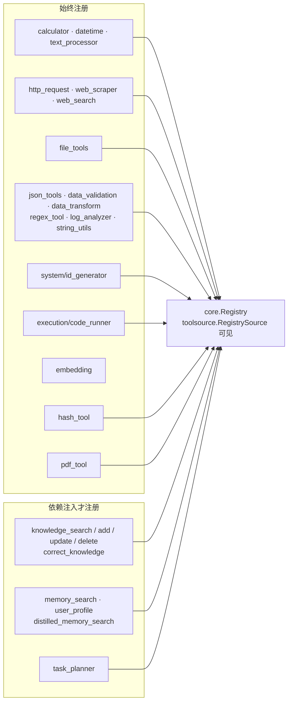
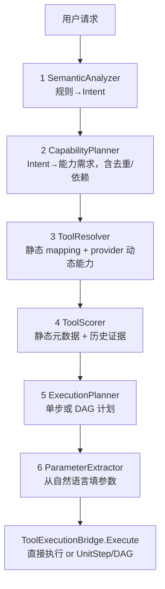
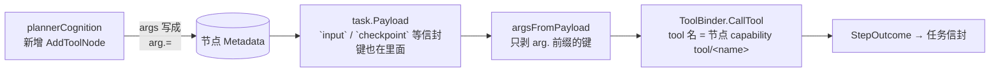

# ares 架构深度解析（五）：工具调用层 —— 从"注册"到"真正被 LLM 调起来"（0.3.x）

> 我一度把工具系统想得很简单：定义 Tool → 塞进 Registry → LLM 就能用了。
> 后来在代码里追了几条链路才发现，真正复杂的是工具从静态定义**走到 LLM 手里、再被一把调起来**的整条流水线。
> 这篇我复盘了 `tools/toolsource`、`tools/resources`、`tools/planner`、`tools/discovery`、`tools/envcap`，
> 以及 `agentfabric` 里真正执行工具的 `ToolBinder` / `chatCognition` / `toolCognition`。
> 只讲我在代码里真实看到的符号和逻辑。看不到的，我不吹。
>
> 一个很重要的先验修正：**Agent 并不直接调 `Registry.Execute`。** 中间始终隔着一层 `ToolBinder`。
> 而这层 Binder 后面，还有两条"发现"通路（`discover_tools` 运行时展开 + 能力规划兜底）各司其职。

## 〇、先承认一件事：这篇的范围

工具系统散在好几个包，我把它分成五块来讲：

1. **`tools/toolsource`** —— 工具的"来源抽象"。`ToolSource`（`Tools` / `OnChange` / `Source`），以及 `StaticSource` / `RegistrySource` / `MultiSource` 三个实现。
2. **`tools/resources/core`** —— 工具元模型。`core.Tool` 接口、`ToolSchema`、`core.Registry`（含参数校验 `ValidateParams` 与渐进披露 `activeTools`）、内置工具目录（`builtin/`）。
3. **运行时发现与选择** —— `discover_tools` 元工具（`discover_tool.go`）、三个 `ToolSelector`（`selector.go` / `capability_selector.go`）、`agentloop.Engine.expandDiscoveredTools`。
4. **`tools/planner` + `tools/discovery` + `tools/envcap`** —— 能力规划兜底、本机命令发现、环境能力检索。
5. **`agentfabric`** —— 真正把工具调起来的执行体：`ToolBinder` 接口、ReAct 工具循环 `chatCognition`、以及 L2 图里的 `toolCognition`（参数走 `arg.` 前缀命名空间）。

一句话概括真正的主干线：

```
ToolSource（静态/注册表/多源合并）
  → ToolSelector（全量/标签/能力）选出本轮的子集
  → GetToolSchemas / ToolSchemaToLLMTool 变成 LLM 的 Tool 定义
  → LLM 返回 tool_calls
  → ToolBinder.CallTool(name, args)
  → core.Tool.Execute≈ 最终被调起来
```

---

## 一、工具从哪来：ToolSource 抽象

`internal/tools/toolsource/toolsource.go` 定义了工具的来源层。这个抽象是 0.3.x 工具系统的地基：

```go
type ToolSource interface {
    // Tools 返回当前可用工具的快照，调用方不得改动返回的切片
    Tools(ctx context.Context) ([]core.Tool, error)
    // OnChange 注册"工具集合可能变了"的回调（静态源通常不注册）
    OnChange(func())
    // Source 返回稳定标识，用于去重优先级的日志（"static"/"registry"/"mcp"）
    Source() string
}
```

三个实现，各自的 `Source()` 标识：

| 实现 | Source() | 行为 |
|---|---|---|
| `StaticSource` | `"static"` | 构造时做一次防御性 copy，之后永不变；`OnChange` 是空操作 |
| `RegistrySource` | `"registry"` | 包一个 `*core.Registry`，用导出的 `List`+`Get` 拍快照，`OnChange` 转发给 Registry |
| `MultiSource` | `"multi"` | 把多个源按序合并，**按工具名 first-wins 去重**（静态 > 注册表 > MCP） |

`MultiSource` 的合并逻辑值得单独看：后到的同名工具直接跳过（`seen[name]`），所以**优先级由传入顺序决定**——名字冲突时第一个源赢。任一个 `.Tools()` 报错都会被包上 `source` 标识并向上抛。所有实现对 nil 都返回哨兵错误 `ErrNilToolSource`。

> 一句话：这不是"工具都在一个 Registry 里"的想象，而是**多个来源（静态内置、Registry、MCP）先合并成一份快照，谁先谁赢**。

---

## 二、给 LLM 的那份清单：Schema → 广告 → 执行

### 2.1 工具元模型（core）

`internal/tools/resources/core/tool.go` 里，`core.Tool` 是能被执行的统一契约：

```go
type Tool interface {
    Name() string
    Description() string
    Category() ToolCategory      // system / core / data / knowledge / memory / external
    Capabilities() []Capability
    Execute(ctx context.Context, params map[string]interface{}) (Result, error)
    Parameters() *ParameterSchema
}
```

两个可选接口（用类型断言探测）：
- `IdempotentTool.IsIdempotent() bool` —— 纯计算工具返回 true；有副作用的（文件 I/O、网络、状态变更）不实现或返回 false。
- `TaggableTool.Tags() map[string]string` —— 给 LLM 路由/discovery 用的语义标签，标准 key 有 `domain` / `input_type` / `output_type` / `side_effects` / `requires_network` / `mutates_state`。

对外广而告之用的是 `ToolSchema`：`Name` / `Description` / `Category` / `Parameters` / `Tags`。它来自 `Registry.GetSchemas()`，并会在广告给 LLM 前被 `ToolSchemaToLLMTool` 转成 `api/core.Tool`。

### 2.2 Registry：注册、校验、渐进披露

`core.Registry`（`registry.go`）要点：

- `Register` / `Unregister`，`Get` / `List` / `Count`，并发安全（`sync.RWMutex`）。
- **`Execute` 带参数校验**：在真正执行前调用 `ValidateParams`，检查`必填参数存在`、`Go 类型匹配 schema（string/integer/number/boolean/array）`、`enum 是否命中`。这能挡住一部分 LLM 传错的类型（比如数字 vs 字符串），**不会**因为类型不对直接 panic。
- **渐进披露**：`SetActiveTools(names)` 只收窄"广告给 LLM 的清单"（`GetSchemas`/`GetLLMTools` 尊重它），`Execute`/`Get` 仍能看到并执行全部工具。nil 表示"全部 active"（零值向后兼容）。
- 全局的 `GlobalRegistry` 已**废弃**（deprecated），`Register`/`Get`/`List`/`Execute` 操作的是空的 GlobalRegistry——生产代码现在走 DI 注入的 `*Registry` 实例。

### 2.3 真正执行工具的是 ToolBinder，不是 Registry

`internal/fabric/agent/chat_cognition.go` 里定义了 `ToolBinder` 接口（消费端接口，sub executor 和 fabric 都满足它）：

```go
type ToolBinder interface {
    CallTool(ctx context.Context, name string, args map[string]any) (any, error)
    ListTools() []string
    IsToolIdempotent(name string) bool
    GetToolSchemas() []resources.ToolSchema
}
```

`chatCognition`（0.3.x 的默认 ReAct 工具循环执行体，从 sub executor 下沉而来）是这样用的：

1. 每轮从 `toolBinder.GetToolSchemas()` 取 Schema。
2. 可选的 whitelist（`agents.ToolWhitelistFromParams`）把不在 `Params["tools"]` 白名单里的工具**先从广告清单里删掉**；白名单与已注册工具交集为 0 时回退到全集，不留给 LLM 空清单。
3. 可选的预算（`agents.ToolBudgetFromParams` / `agents.ToolAllowedByBudget`）在 schema 层剔除预算用尽的工具（budget <= 0 表示不限，默认不动老路径）。同轮内对同一工具的多次调用，超预算的直接跳过并给配对的 tool 消息。
4. `ToolSchemaToLLMTool` 转成 LLM 用 `core.Tool`。
5. `chatClient.Chat(...)`（`ChatClient` 接口，`*llm.FailoverClient` 满足它）→ 拿 `ToolCallResponse`。
6. 有 `ToolCalls` 就循环 `executeToolCall`：把 `tc.Function.Arguments`（JSON 字符串）`json.Unmarshal` 成 `map[string]any`，`kernelctx.WithCallerID` 打上调用者身份，然后 `c.toolBinder.CallTool(...)`。

这里就有第二课：**`chatCognition` 这条路径不走 `Registry.Execute`，也就没有那层 `ValidateParams`** —— 参数是否靠谱，取决于具体 Binder 的回调实现，以及每个工具自己 `params["key"].(string)` 的类型断言。也就是说：**`Registry.Execute` 有统一校验；`ToolBinder.CallTool` 路径不一定有。** 这是两套入口，别混为一谈。

一个 mermaid 把 2.2 / 2.3 的主干画在一起：

```mermaid
graph TB
    REG[core.Registry<br/>RegisterGeneralTools 注入内置工具]<br/>-- 可选 -- SetActiveTools 渐进披露 --> AD
    TS[ToolSource<br/>MultiSource 合并静态/注册表/MCP<br/>first-wins 去重]
    TS --> SEL[ToolSelector<br/>AllSelector / TagSelector / CapabilitySelector]
    SEL --> SCHEMA[GetToolSchemas → ToolSchema]
    SCHEMA --> AD[广告给 LLM<br/>ToolSchemaToLLMTool / Chat API tools]
    WL[Whitelist / Budget 过滤<br/>agents.ToolWhitelistFromParams<br/>agents.ToolBudgetFromParams] --> AD
    AD --> LLMCALL[LLM 返回 tool_calls]
    LLMCALL --> EXEC[chatCognition.executeToolCall<br/>解 JSON → kernelctx.WithCallerID<br/>→ toolBinder.CallTool]
    EXEC --> TOOL[core.Tool.Execute]
    TOOL -.->|Registry.Execute 另有<br/>ValidateParams 统一校验| REG
```

---

## 三、运行时发现：discover_tools 与渐进披露

工具再多也不可能全塞进 context。`internal/tools/toolsource/discover_tool.go` 提供了一个元工具，叫 **`discover_tools`**（`DiscoverToolsName = "discover_tools"`）。

它的参数就一个（常量 `queryParam = "query"`，**required**）：

```go
func (t *discoverToolsTool) Parameters() *core.ParameterSchema {
    return &core.ParameterSchema{
        Type: "object",
        Properties: map[string]*core.Parameter{
            queryParam: {Type: "string",
                Description: "Search query: matches tool name, description, or tags (case-insensitive substring)."},
        },
        Required: []string{queryParam},
    }
}
```

执行逻辑：
- 从 `source.Tools(ctx)` 拿快照 → `searchTools(tools, query)`：对每个工具按**名称 / 描述 / 任一标签 key 或 value** 做大小写不敏感的子串匹配（`toolMatches`）。
- 结果 `json.Marshal` 成一个 JSON **字符串**（`[]discoverToolEntry`，`{name, description}` 紧凑形式）放进 `Result.Data`——所以数据落到 `%v` 格式化后是合法 JSON，LLM 能看到，展开器也能解析。
- 上限 `maxDiscoverResults = 20` 条，保持 context 小。

关键的"展开"在 `internal/agentloop/engine.go`。`agentloop.Engine` 不认识 `toolsource`，它只依赖一个窄接口 `ToolExpander`：

```go
type ToolExpander interface {
    Expand(ctx context.Context, names []string) ([]core.Tool, error)
}
```

`Engine.executeToolCalls` 里，当 LLM 调用的恰好是 `discover_tools`、且执行成功（`err == nil && result.Success`）时，走 `expandDiscoveredTools`：

1. 把结果当 `[]struct{ Name string }` 解析出名字；
2. 调 `req.ToolExpander.Expand(ctx, names)` 得到 LLM 工具定义；
3. 按 `Function.Name` 去重，追加进 `st.activeTools`，供**后续迭代**使用。

注意这里的"自动追加"是 **显式由 engine 代码实现**的：只有 LLM **主动调用了 `discover_tools`**，该轮展开才会发生；`ToolExpander == nil` 时展开被禁用，元工具结果只作为文本回给 LLM（不会变成可调用工具）。所以不是"工具自动重展开"，而是"**被发现的工具名，下一轮才可调用**"。

---

## 四、选择器：把"候选池"缩成"本轮子集"

`internal/tools/toolsource/selector.go` 定义 `ToolSelector`：

```go
type ToolSelector interface {
    Select(ctx context.Context, input string, available []core.Tool) ([]core.Tool, error)
}
```

三个实现：

| 选择器 | 行为 | 兜底 |
|---|---|---|
| `AllSelector`（默认） | 原样返回 all，按 `Name` 排序保证确定性 | — |
| `TagSelector` | 从 input 提关键词，只留 `TaggableTool` 且标签值命中关键词的工具 | 提取不到关键词或全不命中 → 返回 all（不给 LLM 空清单） |
| `CapabilitySelector` | 复用 `planner.ToolResolver` + `planner.ToolScorer`，每个能力挑 top-1 工具 | 提取不到能力/解析失败 → 返回 all |

### 4.1 TagSelector 的关键词提取（extractKeywords）

规则写得很具体：
- 只保留字母数字 token（`r<'a'||r>'z'` 等分割）；
- 丢掉 stop word（`the/a/an/and/or/to/of/in/on/for/is/.../please/me/my/how/what/who/some/get/want/need/use/using/via/into/out/...`）；
- 丢弃单字符 token，`len(f)<2` 不要，重复关键词合并。
- `tagsMatchKeywords`：只要**任一标签 value** 含**任一关键词**（大小写不敏感）就算命中——注意是 value，不是 key。

### 4.2 CapabilitySelector 的能力提取（capability_selector.go）

这才是"关键词 → 能力 → 工具"的桥。`CapabilityExtractor func(input string) []string`，默认实现 `DefaultCapabilityExtractor` 复用 `extractKeywords`，再过一个 `keywordToCapability` 映射。这个映射很全，随手摘几组：

| 关键词 | 派生能力（planner 能力名） |
|---|---|
| `math` / `calculate` / `calc` / `add` / `multiply` | `Arithmetic` |
| `sum` | `Summation` |
| `hash` / `sha` / `md5` | `Hashing` |
| `regex` / `pattern` | `Regex` |
| `json` | `JSONProcessing` |
| `pdf` | `PDFParsing` |
| `api` / `http` / `url` | `HTTPRequest` |
| `search` / `web` / `google` | `WebSearch` |
| `code` / `run` / `execute` | `CodeExecution` |
| `embedding` / `vector` | `Embedding` |

`CapabilitySelector.Select` 对每个提取出的能力：构造 `&planner.CapabilityRequirement{Name: cap}` → `resolver.Resolve` → `scorer.Score` → 取 `scored[0].ToolName` → 从 available 里按名取出对应工具，去重。能力名必须与 planner 里的常量一致（`toolsource` 里用 `const` 重新暴露了一组 24 个 `capXxx`）。

> 一句话：选择器把"全局工具池"按本轮输入缩成"给 LLM 的子集"，**做不出来就回退全量**，宁可多看也不能给空清单。

---

## 五、内置工具目录（builtin）

真正被注册进 Registry 的内置工具在 `internal/tools/resources/builtin/builtin.go` 的 `RegisterGeneralTools(*core.Registry, ...GeneralToolsDeps)` 里。固定注册的一批（都带语义标签）：



表格化（按 `builtin.go` 目录）：

| 领域 | 工具名 | 标签要点 |
|---|---|---|
| 数学 | `calculator` / `datetime` / `text_processor` | domain=math / text，side_effects=false |
| 网络 | `http_request` / `web_scraper` / `web_search` | requires_network=true；`http_request` side_effects=true |
| 文件 | `file_tools` | side_effects=true, mutates_state=true；受 `ARES_FILE_TOOLS_ALLOWED_DIR` 限制 |
| 数据 | `json_tools` / `data_validation` / `data_transform` | domain=data，side_effects=false |
| 文本 | `regex_tool` / `log_analyzer` / `string_utils` | domain=text，side_effects=false |
| 系统 | `id_generator` | domain=system |
| 执行 | `code_runner` | Python **默认禁用**，需 `EnablePython(true)` 显式开启 |
| 嵌入 | `embedding` | requires_network=true |
| 加密 | `hash_tool` | domain=crypto |
| PDF | `pdf_tool` | domain=pdf；与 file_tools 同一 allowed dir |
| 知识（注入依赖） | `knowledge_search/add/update/delete`、`correct_knowledge` | 依赖 `GeneralToolsDeps` 里的后端 |
| 记忆（注入依赖） | `memory_search`、`user_profile`、`distilled_memory_search` | 依赖 MemoryMgr / DistilledRepo |
| 规划（注入依赖） | `task_planner` | 依赖 `LLMClient` |

有两个"秒懂"级实现值得点名：

- **`calculator`**（`builtin/math/calculator.go`）基于 `expr` 引擎，函数多达 27 个：基础 `sqrt/abs/sin/cos/tan/log/round/floor/ceil/pow/min/max`、组合 `factorial/nPr/nCr`、数论 `gcd/lcm/isPrime`、统计 `mean/variance/stddev/median`、概率 `binomial/normalPdf/poissonPdf`、常量 `pi/e`。表达式编译结果按表达式缓存（`compiled map[string]*vm.Program`，上限 `maxCompiledPrograms=512`），并发用 `RWMutex`。它是 `IdempotentTool`（`IsIdempotent()==true`）。

- **`code_runner`** 和安全护栏：`RegisterGeneralTools` 的注释明确说 "CodeRunner is registered with **Python DISABLED** by default"，HTTPRequest/WebScraper 在 HTTP client 层做 SSRF 过滤，FileTools 用 `WithAllowedDir` 默认挡掉路径穿越。也就是**默认安全偏保守，逃生必须显式开**。

工具分类常量（`core.ToolCategory`）完整是 `system / core / data / knowledge / memory / external`。

> 注意一个"名实一致性"的坑：planner 的静态 `capabilityMapping`（见下文）里写的工具名是 `calculator / hash_tool / string_utils / regex_tool / pdf_tool / web_search ...`，这些必须和 `NewBaseToolWithCapabilities(...)` 的第一个字符串参数写进的名字对上，否则 resolver 会"解析出来但注册表里找不到"而被过滤掉。

---

## 六、能力规划兜底：planner + ToolExecutionBridge

LLM 不会次次选对工具。`internal/tools/planner` 提供了确定性的规划兜底。`planner/doc.go` 写的流水线是 **6 步**（比 5 步多一步 ExecutionPlanner）：



### 6.1 SemanticAnalyzer：20 条内建关键词规则

`analyzer.go` 的 `defaultRules()` 按"更具体在前"排序。规则用 `intentRule{keywords, goal, operation, complexity, capabilities}` 描述，匹配是 **OR**（`matchAnyKeyword` 用 `strings.Contains`，注意是字面子串，不是正则——注释专门提醒了别写正则进 keywords）。举例：

```
{keywords:["累加","求和"], capabilities:["Summation","Arithmetic"]}
{keywords:["hash","md5","sha1","sha256","sha512","哈希"], capabilities:["Hashing"]}
{keywords:["pdf","document"], capabilities:["PDFParsing","TextExtraction"]}
{keywords:["mean","median","stddev","variance","average","平均","标准差","方差","统计"], capabilities:["Statistics","Arithmetic"]}
{keywords:["gcd","lcm","prime","公约数","素数"], capabilities:["NumberTheory","Arithmetic"]}
...
```

如果一条都不命中，`Analyze` 直接返回 `"no matching rule for request"` 错误——**规划兜底不是万能的**，它只认得规则库里的模式。

### 6.2 CapabilityPlanner：去重 + 依赖

`capability.go` 的 `capabilityPlanner.Plan` 把 Intent 的能力列转成 `CapabilityRequirement`。有子sumption：`Summation ⊇ Arithmetic`、`TextExtraction ⊇ PDFParsing`、`ExpressionEvaluation ⊇ Arithmetic`——父能力出现时子能力被标记为已见，不发冗余步骤。还有 `dependenciesFor`：`TextExtraction → PDFParsing`、`Embedding → [TextExtraction, StringManipulation]`。

### 6.3 ToolResolver：静态映射 + 动态能力

`resolver.go`。`capabilityMapping` 是静态"能力 → 工具名"表（`Arithmetic→calculator`、`Hashing→hash_tool`、`Regex→regex_tool`、`WebSearch→web_search`、`CodeExecution→code_runner` ...）。`toolMetadata` 是工具的静态评分元数据（`cost/latency/deterministic/composable/sideEffects`，如 `calculator{cost:1,latency:1ms,deterministic:true,composable:true}`、`http_request{cost:5,deterministic:false,sideEffects:true}`）。

`Resolve` 收集两路候选：静态 mapping + provider 的 `GetToolCapabilities()`（动态注册工具）。**最后按 `provider.ListTools()` 过滤，只留真注册的。**

### 6.4 ToolScorer：评分公式（有两套）

planner 里其实有**两个 scorer**：

- `toolScorer`（`scorer.go` 的 `NewToolScorer`）：
  ```
  BaseScore   = (1/Cost)*10 + Deterministic?3:0 + Composable?2:0
  EvidenceScore = SuccessRate*20 - (有证据时) min(latencyMs/100, 5)
  Penalty     = SideEffects ? 5 : 0
  Final       = BaseScore + EvidenceScore - Penalty
  ```
- `evidenceScorer`（`evidence.go` 的 `NewEvidenceScorer`）额外在**有证据且失败数>0**时扣 `failureRatio*10`，证据按 `tool:capability` 聚合。

算个真实的账（用默认 SuccessRate=0.95、无证据、无延迟惩罚）：
- `calculator`：Base=10+3+2=15，Evidence=0.95*20=19，Penalty=0 → **34**（不是网文里的"35"，差的 1 分来自默认成功率 0.95 而非 1.0）。
- `http_request`：Base=(1/5)*10+0+2=**4**（网文写"base=2"，漏了 Composable 的 +2），Evidence=19，Penalty=5 → **18**。

所以 `calculator` 比 `http_request` 高约 16 分，靠的是确定 + 低成本 + 无副作用。但**具体分数高度依赖是否有历史证据**（反射到 `SuccessRate`、延迟惩罚、失败惩罚），别当固定值背。

证据流：`ToolExecutionBridge` 每次执行后 `evidence.Save(...)`（含工具名/能力名/成功/延迟），默认 `NewMemoryEvidenceStore()`（进程内，重启丢失）；跨进程实现需按 `EvidenceStore` 接口自写。

### 6.5 ParameterExtractor：自然语言 → 参数

`extractor.go` 只处理它能识别的那几个"纯模式"（正则硬编码），不认识的返回 nil 让后续决定。举例（来自真实正则）：

```
"从1到100" / "from 5 to 10"   → expression = "(b-a+1)*(a+b)/2"  （顺带修正：不是 b*(b+1)/2）
"2的10次方" / "…的…次方"      → expression = "2**10"
"根号16"                      → expression = "sqrt(16)"
"nCr(10,3)" / "组合(10,3)"   → expression = "nCr(10,3)"
"factorial(10)" / "10的阶乘"   → expression = "factorial(10)"
"median/方差/..."             → expression = "median(1,2,3)" 等
"12和18的最大公约数"           → expression = "gcd(12,18)"
```

### 6.6 ToolExecutionBridge：合并执行 + 多步 DAG

`bridge.go` 的 `Execute(ctx, toolName, params, userRequest)`：

| 条件 | 行为 |
|---|---|
| `toolName != ""` 且注册表里存在 | 直接执行，并 `evidence.Save`（能力名取 `primaryCapabilityName(tool)`，即 `Capabilities()[0]`） |
| `toolName != ""` 但不存在 | 日志警告 → 走 planner 兜底 |
| `userRequest == ""` | 报错 `"tool not found and no user request for fallback"` |
| 走 planner | `Plan` → DAG 校验 → 单步 or 多步 |

多步计划先 `NewDAGValidator().Validate`：结构性错误（`cycle_detected` / `missing_dependency` / `incompatible_io`）阻断；IO 不兼容是 advisory 只告警。然后 `executeMultiStep` 用 `topoSort`（Kahn 算法，检测循环）定序，每步 `mergeParams`（计划默认 → 依赖输出绑定 → 用户参数覆盖），再 `executeStepWithFallback`（主工具 → `FallbackToolNames` 逐个 fallback，全失败返回最后错误；证据只在成功那次保存）。

依赖输出绑定（`bindDependencyOutput`）按能力猜字段名：如 `PDFParsing` 输出找 `text/content`，`Arithmetic` 找 `result/value/number`，`WebSearch` 找 `results/output`；输入侧 `inputParamNamesForStep` 优先用工具 schema 的 `Required`，再补能力默认名。

> 关于"生产怎么接"：`planner/doc.go` 说 cmd/ares 里 `newToolBinder(internalReg)` + `newPlannerBridge(internalReg)` + `binder.WithPlannerBridge(bridge)`，工具名不存在时 Binder 回退到 bridge。**这部分我依据 doc.go 转述，serve 的具体接线我还没逐行读（待核实）**，但它说明了一个重要事实：planner 兜底挂在 **Binder 层**，与 `agentfabric` 的 `ChatCognitionDeps.ToolBinder` 接口正好对上。

---

## 七、本机工具发现 + 环境能力检索

### 7.1 discovery：探测本机命令

`internal/tools/discovery/discover.go` 的 `Discoverer` 是"本机工具发现"原语：对 allowlist 里的每个命令做 `command -v` + `--help`，把存在的命令适配成 `CommandTool`。

安全边界写得非常明确（包注释原文）：
- **只有 allowlist 里的命令才被探测/执行**，命令名在构造时固定，`Execute` 只是把用户参数用 `exec.CommandContext` 传进去，**没有 shell、没有字符串插值**，不能注入元字符或调未列入的白名单二进制。
- 输出上限 `maxCommandOutputBytes = 1 MiB`，超限当错误（不静默截断），避免 `yes` 之类把内存打爆。
- stdio 分 stdout/stderr，描述取 `--help` 的**第一行非空**。
- `Parameters` 只声明一个 `"args"` 数组参数。

### 7.2 envcap：跨工具/技能/命令的统一检索

`internal/tools/envcap` 的 `Searcher` 聚合三路：注册工具（`ToolLister`，`RegistryLister` 适配 Registry）、技能（`skills.Registry`）、本机命令（`discovery.Discoverer`）。`Search` 按 kind（tool→skill→command）排再按名排序。`search_tool.go` 把它包成一个 `core.Tool`，名为 **`search_capabilities`**（`SearchToolName`），参数 `query`（required）+ `limit`（默认 20）。这就是渐进披露的另一条入口：先拿到 name+description，真要用时再按名调用。

---

## 八、L2 图里的 toolCognition：`arg.` 命名空间

除非 `DAGExecution.Enabled=true`，生产执行体默认还是 `chatCognition`；**L2 图目前还没接入生产 serve 路径，是 test-only 的种子实现**（`l2graph.go` 顶部原文："not yet wired into the production serve path – until it is, peers keep their default ReAct chatCognition and this graph stays test-only"）。但它的一个设计值得单独讲，因为它和参数命名强相关：

`routerCognition.ExecuteStep` 按 `task.AgentType` 分发：`tool/<name>` → `toolCognition`，`ares/answer` → `answerCognition`，`ares/root` → `rootCognition`，`ares/plan` → `planner`。其中 `toolCognition.ExecuteStep` 只做一件事：

```go
res, err := c.binder.CallTool(ctx, c.tool, argsFromPayload(task.Payload))
```

关键在 `argsFromPayload` 和常量 `argMetadataPrefix = "arg."`：

- 规划器在 `L2Graph.AddToolNode(ctx, id, tool, args, dependsOn)` 里，用 `argsMetadata(args)` 把参数写成节点 Metadata，**每个 key 都加 `"arg."` 前缀**（`arg.<key>=<value>`）。
- 执行时 `toolCognition` 经 `argsFromPayload(task.Payload)` **只读 `arg.` 前缀开头的键**（前缀剥掉后作为参数名），其余键（投影用的 `input`、调度恢复用的 `checkpoint` 等信封管道）全部忽略。
- 于是**只有真实参数能进 `CallTool`**，严格 schema（`additionalProperties:false`）的工具才接受这次调用——这就是为什么参数要活在 `arg.` 命名空间里。



`argsFromPayload` 的解析是"尽力而为"：值以 `{` 或 `[` 开头且能 `json.Unmarshal` 就算 JSON 解码，否则原样传字符串（所以文件路径这类纯字符串不会被误当 JSON）。同名函数 `extractArgsJSON`（供 `CountToolClass` 反推 argShape）逻辑类似。

> 给读者的一课：**同一套参数，两套路径两套取法**——ReAct 的 `chatCognition` 直接解 `tc.Function.Arguments`；L2 的 `toolCognition` 只认 `arg.` 前缀。分清你所在的执行体，才读得对参数。

---

## 九、已知问题与坦诚反思

1. **参数校验是"两本账"**：`Registry.Execute` 有 `ValidateParams`，但 `chatCognition`→`ToolBinder.CallTool` 路径不经过它，参数合法性取决于具体 Binder 回调与每个工具自己的类型断言。这是风险点，不是统一防线。

2. **planner 是"规则发动机"不是"万能兜底"**：`Analyze` 只认内建 20 条关键词规则，不命中直接报错；`ParameterExtractor` 只认硬编码正则。超出模式集的自然语言（比如复杂中文句式）规划不进。

3. **L2 图未接入生产**：`DAGExecution` 门默认关闭，`toolCognition` / `arg.` 命名空间目前只在测试里跑。

4. **scorer 分数会漂移**：`toolScorer` 与 `evidenceScorer` 公式不同（后者有失败惩罚），且是否携带 `tool:capability` 证据、默认 SuccessRate=0.95，都会改变最终分——评分只能当排序参考，不是稳定常数。

5. **discovery 依赖本机**：`discovery` 只在 allowlist 且命令存在于宿主时才注册工具；本机没有的命令被静默跳过（graceful degrade）。

6. **服务端接线待核实**：`cmd/ares` 里 `toolBinder`/`ToolExecutionBridge`/envcap `Searcher` 的具体装配、以及 `discover_tools` 到底挂在哪个 `ToolSource` 上，我依据 doc.go/包注释转述，尚未逐行核对（待核实）。

---

## 系列文章

| # | 主题 | 你会学到什么 |
|---|------|-------------|
| I | 架构总览 | 全局视角 + 两级同构 MutableDAG + 全模块拆解 |
| II | Agent 和声协议 | Agent 怎么通信 |
| III | 记忆蒸馏 | `ares_experience`/`ares_memory` 怎么记住和遗忘 |
| IV | 工作流引擎 | `workflow/engine.MutableDAG`：任务怎么在 DAG 里流、怎么进化 |
| V | **本文** | `tools/toolsource` 怎么发现、检索、绑定工具 |
| VI | 安全与可观测 | `ares_events`/`introspect` 怎么看到发生了什么 |
| VII | 运行时与生命周期 | Agent 怎么活和死、怎么复活 |
| VIII | 事件系统 | 状态怎么记录和恢复 |
| IX | 竞技场 / 故障注入 | `aresrecovery.Chaos` 怎么故意搞破坏再验证恢复 |
| X | 检索系统 | 怎么找到相关记忆 |
| XI | 自主进化 | `evolution` 怎么只 patch L1、怎么发布 |
| XIII | Bootstrap 与 API | `ares_bootstrap` 怎么无痛接线 |
| XV | MCP 集成 | `ares_mcp` 怎么教 Agent 用工具 |
| 19 | 存储层 | `storage/postgres` + `services/embedding` |
| 20 | LLM 客户端层 | `llm` Failover、多 provider 抽象 |
| 21 | 评估框架 | `ares_eval` EvaluatorRegistry / LLMJudge |

每篇文章遵循同一个模式：**问题 → 设计旅程 → 权衡取舍 → 坦诚反思。**

不营销。不"比 X 快 10 倍"。只有工程师聊工程。

我把能写进代码的都写进了下表，作为这篇的"断言清单"，方便你对着源码查：

| 断言 | 符号/文件 | 状态 |
|---|---|---|
| 工具来源有三个实现 | `toolsource/toolsource.go`（`StaticSource`/`RegistrySource`/`MultiSource`） | ✅ 已核实 |
| discover_tools 元工具 | `toolsource/discover_tool.go`，`DiscoverToolsName="discover_tools"`，`maxDiscoverResults=20` | ✅ 已核实 |
| 展开只在 LLM 主动调 discover_tools 时发生 | `agentloop/engine.go` `expandDiscoveredTools` / `ToolExpander` | ✅ 已核实 |
| 三个选择器 + 关键词/能力提取 | `selector.go` / `capability_selector.go` | ✅ 已核实 |
| Registry.Execute 带 ValidateParams | `resources/core/registry.go` | ✅ 已核实，但 agentfabric CallTool 路径不走它 |
| 全部内置工具目录与标签 | `builtin/builtin.go` `RegisterGeneralTools` | ✅ 已核实 |
| calculator 的 27 个函数 | `builtin/math/calculator.go` | ✅ 已核实 |
| planner 6 步流水线 | `planner/*`（doc.go 与实现一致） | ✅ 已核实 |
| 评分公式（两套 scorer） | `planner/scorer.go` + `planner/evidence.go` | ✅ 已核实 |
| `arg.` 前缀参数命名空间 | `agentfabric/l2graph.go`（`argMetadataPrefix`/`argsFromPayload`） | ✅ 已核实 |
| cmd/ares 生产装配 | `cmd/ares`（doc.go 转述） | ⚠️ 待核实 |