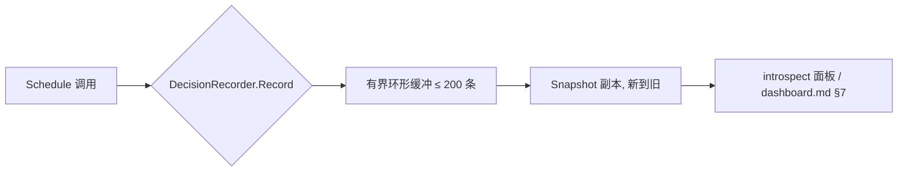

# ares 架构深度解析（六）：安全与可观测性 — 认证、鉴权、脱敏与调度可观测（0.3.x）

> 0.3.x 说明：本文完全基于当前 `internal/ares_security/` 与 `internal/runtime/observability/` 的真实实现改写。早期版本的 `SafeLogger` / `LogTracer` / 限流工厂 / 优雅关闭四段状态机等内容在当前代码中**不再存在**，本文不再复述，只写现在真实存在的东西。

> 一个 Agent 能做的事越危险，越需要在"它把事做出来之前"就先想清楚：谁来用它？它能碰什么？它吐出来的东西会不会泄密？以及——它在运行时的每一步，我们到底能不能看见？

---

## 一、这次聊什么，以及"真实存在"这件事

先说结论，别被标题带偏：当前代码库里的安全与可观测性，不是一篇夸夸其谈的"纵深防御白皮书"，而是一组**小而清晰、还在被守卫着每个 HTTP 边界**的模块。

- 安全侧：`internal/ares_security/` — **JWT 认证 + RBAC 角色权限 + 请求中间件 + 审计日志 + 敏感信息脱敏**，共 5 个文件。
- 可观测侧：`internal/runtime/observability/` — **Tracer 接口（OTel / Noop 两套实现）+ Metrics（OTel / Prometheus 两套）+ 每会话成本跟踪**。
- 调度可观测：`internal/kernel/decision_recorder.go` 的 **Scheduling Observatory**，以及 `internal/introspect/` 的运行态面板。

我把上一版文章里"当前代码里没有"的东西都删掉了。下面每一行符号，都在对应文件里找得到。

核心文件清单（真实路径）：

| 模块 | 文件路径 | 关键符号（已核实） |
|------|----------|--------------------|
| JWT | `internal/ares_security/jwt.go` | `SignJWT`、`VerifyJWT`、`ErrInvalidToken`、`ErrTokenExpired`、`ErrTokenTooEarly` |
| RBAC | `internal/ares_security/rbac.go` | `Role`、`Permission`、`ParseRole`、`AllowRole`、`HasPermission` |
| 中间件 | `internal/ares_security/middleware.go` | `AuthMiddleware`、`NewAuthMiddleware`、`WithAudit`、`Principal`、`FromContext`、`Verify` |
| 审计 | `internal/ares_security/audit.go` | `AuditLogger`、`NewAuditLogger`、`Auth`、`Action` |
| 脱敏 | `internal/ares_security/sanitizer.go` | `Sanitizer`、`Sanitize`、`SanitizeJSON`、`SanitizeOptions`、`SensitivePattern` |
| Tracer 接口 | `internal/runtime/observability/tracer.go` | `Tracer`、`LLMCall`、`ToolCall`、`AgentStep`、`AgentError` |
| Noop 实现 | `internal/runtime/observability/noop.go` | `NoopTracer`、`NewNoopTracer` |
| OTel 实现 | `internal/runtime/observability/otel_tracer.go` | `OTelTracer`、`NewOTelTracer`、`WithExporter`、`WithSampler`、`WithMetricReader` |
| Metrics | `internal/runtime/observability/metrics.go` | `Metrics`、`NewMetrics`、`RecordLLMCall`、`RecordToolCall`、`RecordAgentStepDuration`、`RecordAgentError` |
| Prometheus | `internal/runtime/observability/prometheus.go` | `PrometheusMetrics`、`NewPrometheusMetrics`、`MetricsHTTPHandler`、`RegisterMetricsRouter` |
| 调度可观测 | `internal/kernel/decision_recorder.go` | `DecisionRecorder`、`ScheduleDecision`、`CandidateScore`、`snapshot`/`Record` |
| 运行态面板 | `internal/introspect/` | `Dashboard`、`Store`、`Collector`、`Handler`、`Sink` |
| LLM 侧脱敏接线 | `internal/llm/client.go` + `internal/ares_bootstrap/provide_llm.go` | `WithSanitizer` |

---

## 二、安全模块：不要去造一个"看起来很酷但没人敢用"的机制

先泼一盆冷水。老版本文章里我写了 `SafeLogger`、字段名 + 正则双层检测、包级 `SanitizeLog`。**这些在当前代码里都不存在了。** 现在的 `ares_security` 候选名录分成两块：认证（JWT/RBAC/中间件/审计）和脱敏（Sanitizer）。

### 2.1 JWT：手写的 HS256，只信任签名过的版本

`jwt.go` 从头实现了一个 HS256 JWT，刻意不用第三方库（设计约束：优先标准库）。

```go
func SignJWT(secret []byte, subject, role string, ttl time.Duration, now time.Time) (string, error)
func VerifyJWT(secret []byte, token string, now time.Time) (subject, role string, err error)
```

几个我在代码里核实过的关键细节：

1. **常量时间比较**：`decodeSigned` 里用 `hmac.Equal(sig, expected)` 校验签名——不是 `==`，避免时序侧信道。
2. **先验签、后信内容**：签名对不上直接返回 `ErrInvalidToken`，payload 里的任何字段都不会被信任。
3. **三个哨兵错误**：`ErrInvalidToken`（畸形/错签/缺 claims）、`ErrTokenExpired`（已过期）、`ErrTokenTooEarly`（`iat` 在未来）。调用方要区分过期时用 `errors.Is(err, ErrTokenExpired)`。
4. **token 只带三个 claim**：`sub`（主体）、`role`（角色）、`exp`（过期 Unix 秒），另有 `iat`。

```mermaid
flowchart LR
    A[Bearer token] --> B{split "." count != 3}
    B -- yes --> E1[ErrInvalidToken]
    B -- no --> C[hmac.Equal 验签]
    C -- fail --> E1
    C -- ok --> D{exp 已过?}
    D -- yes --> E2[ErrTokenExpired]
    D -- no --> F{iat 在未来?}
    F -- yes --> E3[ErrTokenTooEarly]
    F -- no --> G[校验 sub/role 非空]
    G -- 通过 --> H["返回 subject, role"]
```

### 2.2 RBAC：静态的角色→权限矩阵，默认拒绝

`rbac.go` 定义了三个角色、三个权限，以及一个静态矩阵 `rolePermissions`：

| 角色（`Role`） | `PermRead` | `PermWrite` | `PermAdmin` |
|----------------|:---:|:---:|:---:|
| `RoleAdmin` ("admin") | ✅ | ✅ | ✅ |
| `RoleOperator` ("operator") | ✅ | ✅ | ❌ |
| `RoleAgent` ("agent") | ✅ | ❌ | ❌ |

- `ParseRole(s)` 会把字符串小写、去空白后再匹配，匹配不到返回 `ErrUnknownRole`——攻击者不能用 token 铸造一个系统不认识的角色。
- `AllowRole(role, perm)` / `HasPermission(role, perm)` 走同一个 `rolePermissions` 矩阵，**空角色直接返回 false（默认拒绝）**。

### 2.3 中间件：Bearer + 验签 + 角色检查，一次到位

`middleware.go` 的 `AuthMiddleware` 是"所有受保护路由的唯一强制点"：

```go
type AuthMiddleware struct {
    secret  []byte      // HS256 密钥；nil 时全部拒绝(401)
    require Permission   // 该路由要求的最低权限
    audit   *AuditLogger // 模块化审计，nil 关闭
    now     func() time.Time
}
```

流程（`authenticate`）：
1. 从 `Authorization: Bearer ` 头取 token——**只认 `Bearer ` 前缀**，其它 scheme 一律视为缺失，防 token 走私。
2. `VerifyJWT` 验签 + 查过期。
3. `ParseRole` 解析角色（未知 → 403）。
4. `AllowRole(role, m.require)` 权限门（不足 → 403）。
5. 通过后把 `Principal{Subject, Role}` 注入请求 `context`，下游用 `FromContext` 读取。

两个值得强调的工程点：
- **secret 为 nil = deny-all**。注释里写得很明确：nil 时每个请求都 401，避免"为了开 JWT 反而打开一个破坏性端点"。
- **每次判定都审计**（`m.auditAuth`），无论放行还是拒绝。

### 2.4 审计：不记 token，只记"谁、做了什么、成没成"

`audit.go` 的 `AuditLogger` 是对 `*slog.Logger` 的薄封装，固定一组结构化字段。关键设计：**token 本身永不进日志**，只记解码后的身份与决策。

- `Auth(decision, subject, role, method, path, status)` — 记录认证放行/拒绝。
- `Action(action, subject, target, ok)` — 记录破坏性/特权动作（杀 Agent、调 MCP 工具等"谁改了什么"）。

### 2.5 脱敏：`Sanitizer` —— 正则检测 + 针对性掩码

`sanitizer.go` 的 `Sanitizer` 用一组 `SensitivePattern` 正则去扫文本，每种 `SensitiveFieldType` 配一个掩码函数。已核实的类型常量：

```go
SensitiveFieldTypeAPIKey / Password / Token / Email / Phone / SSN / CreditCard / PersonalInfo
```

> ⚠️ **这里要如实说明**：`SensitiveFieldTypePersonalInfo` 常量存在，但 `defaultSensitivePatterns()` 里**没有**为它注册正则——这是"常量存在但无默认规则"的留白，使用时别假设它开箱即用。（待核实：是否有其它调用方补充该型规则。）

两个入口：
- `Sanitize(input string)`：对一段文本顺序跑所有正则并替换为掩码。
- `SanitizeJSON(jsonStr string)`：先 `json.Decoder` + `UseNumber()` 解析，**递归**只对 string 值做脱敏，再重新序列化——避免对整段 JSON 字符串跑正则把引号/花括号打坏。其它类型如 json.Number 会被 `maybeMaskNumeric` 检查数字串（但若没命中则原样返回，保持数字类型不退化）。

掩码函数：`maskAPIKey`、`maskPassword`、`maskToken`、`maskEmail`、`maskPhone`、`maskCreditCard`、`maskSSN`，以及底层 `maskString(s, preserveLength)`（保留首尾 N 字符，中间用 `*` 填充）。配套 `SanitizeOptions` 可调 `MaskChar`、`KeepLength`、`PreserveLengthFor`。

脱敏在 LLM 调用链上的落点（`internal/llm/client.go`）：

```go
func WithSanitizer(s *ares_security.Sanitizer) Option {
    return func(c *Client) { c.sanitizer = s }
}
```

生产装配在 `internal/ares_bootstrap/provide_llm.go`：

```go
client, err := llm.NewClient(llmCfg, llm.WithCallbacks(reg), llm.WithSanitizer(ares_security.NewSanitizer()))
```

即：**发往 provider 的 live 请求原样发出，但在被 tracer/event store 记录前先过 `Sanitizer`**，防止密钥落进日志和 trace。

---

## 三、可观测性模块：一个 `Tracer` 接口，两套后端

`tracer.go` 定义接口：

```go
type Tracer interface {
    RecordLLMCall(ctx, call *LLMCall)
    RecordToolCall(ctx, call *ToolCall)
    RecordAgentStep(ctx, step *AgentStep)
    RecordError(ctx, err *AgentError)
    GetTraceID(ctx) string
    WithTrace(ctx) context.Context
}
```

数据结构 `LLMCall` / `ToolCall` / `AgentStep` / `AgentError` 都带 `TraceID` 字段，让 trace 能把一次执行串起来。

### 3.1 `NoopTracer`：trace ID 还是要有，记录是不做的

`noop.go` 的 `NoopTracer` 四个 `Record*` 全是空实现，但 `WithTrace` 会在 context 里塞一个自增 `trace-N` 的 trace ID（`atomic.AddUint64`），`GetTraceID` 能读回来。也就是说即使不开可观测性，trace 传播的约定也不会崩。

### 3.2 `OTelTracer`：真实的 OpenTelemetry 后端

`otel_tracer.go` 的 `OTelTracer` 实现 `Tracer`，每个调用点开一个 span：

| 方法 | span 名 | 主要属性 |
|------|---------|----------|
| `RecordLLMCall` | `llm.call` | `llm.model`、`llm.tokens_used`、`llm.duration_ms`、`llm.has_error` |
| `RecordToolCall` | `tool.call` | `tool.name`、`tool.duration_ms`、`tool.has_error` |
| `RecordAgentStep` | `agent.step` | `agent.id`、`agent.step_name`、`agent.duration_ms` |
| `RecordError` | `agent.error` | `agent.id`、`error.type`、`error.message` |

配套 options：`WithExporter`（默认 `stdouttrace.New()`）、`WithSampler`（默认 `AlwaysSample`）、`WithMetricReader`（默认手动 reader）。还有 `Shutdown`（`errors.Join` 两个 provider 的关闭错误）、`Provider` / `MeterProvider` / `Metrics` 访问器。OTel 里还带了 OTel 侧的 `Metrics`（见下）。

### 3.3 Metrics：`ares_*` 前缀的 OTel 计数器/直方图

`metrics.go` 的 `Metrics` 定义了一组受管 instrument：

| instrument | 名称 | 类型 |
|-----------|------|------|
| `llmCallsTotal` | `ares_llm_calls_total` | Int64Counter |
| `toolCallsTotal` | `ares_tool_calls_total` | Int64Counter |
| `agentErrorsTotal` | `ares_agent_errors_total` | Int64Counter |
| `llmCallDuration` | `ares_llm_call_duration_seconds` | Float64Histogram（桶 0.1…60s） |
| `agentStepDuration` | `ares_agent_step_duration_seconds` | Float64Histogram |
| `toolCallDuration` | `ares_tool_call_duration_seconds` | Float64Histogram |

记录方法 `RecordLLMCall` / `RecordToolCall` / `RecordAgentStepDuration` / `RecordAgentError` 都会带 label（`model`/`tool_name`/`agent_id` 等）和 `has_error`。

### 3.4 Prometheus：`ARES_*` 前缀的另一套后端

`prometheus.go` 的 `PrometheusMetrics` 用 `prometheus/client_golang` 注册了一批 `ARES_*` 指标，核心有：

- 计数器：`ARES_llm_calls_total{model,status}`、`ARES_tool_calls_total{tool,status}`、`ARES_agent_errors_total{agent,phase}`
- 直方图：`ARES_llm_call_duration_seconds{model}`、`ARES_agent_step_duration_seconds{phase}`
- 仪表：`ARES_active_agents`、`ARES_llm_tokens_total{model,direction}`
- 摘要：`ARES_cost_usd_total{model}`（**只按 model 标，不按 session 标**——注释明确说 session 无界会撑爆 registry，每会话明细走 `CostTracker`，见 `cost.go`）
- 外加一整套 `ARES_evolution_*`（deploy/guardrail/shadow/promote/rollback/gate-reject/shadow_win_rate/generation/DAG version/compile count 等），属于演进循环的可观测面。

对外暴露：`MetricsHTTPHandler()` 返回 `/metrics` 的 `promhttp` handler，`RegisterMetricsRouter(mux)` 负责把它挂到 `GET /metrics`。

> **一个坑，代码里专门处理过**：Prometheus collector 重复注册会返回 `AlreadyRegisteredError`。`NewPrometheusMetrics` 用 `cachedMetrics` 缓存首个成功实例，重复初始化返回缓存实例，避免"记到一个根本没注册的 vector 上"。

### 3.5 成本跟踪 `CostTracker`

`cost.go` 提供按模型 + 按 session 的 `CostTracker`，弥补 Prometheus 侧不按 session 标号化导致的明细缺失。这是把"花了多少钱"从指标里拆出去、单独管理的明确设计。（具体方法名建议后续撰写时核对 `cost_test.go`，本文只确认它存在。）

---

## 四、调度可观测：Scheduling Observatory

调度器为什么要"可观测"？因为一个任务被分给某个 Agent 可能是多个因素（能力覆盖、负载、经验置信度、优先级）共同作用的结果。`decision_recorder.go` 在**每次 `Schedule` 调用时记录一条决策**，存进一个**有界环形缓冲（`maxRecordedDecisions = 200`）**，面板据此渲染"为什么分给它"。

已核实的数据结构：

- `ScheduleDecision`：`TaskID`、`Capability`、`Candidates`（按分数降序）、`Winner`、`Epoch`（Acquire 给的 fencing token）、`Time`、`Err`（失败如 `ErrNoCapableCandidate` 时 `Winner`/`Epoch` 为零，成功时省略）。
- `CandidateScore`：`AgentID`、`Capabilities`、`Overlap`、`Load`、`Confidence`、`PriorityBoost`、`Score`。
- `DecisionRecorder`：`Record`（追加并淘汰最旧）、`Snapshot`（**返回副本、新到旧**，锁保护）、`scoreCandidates`（复用 `taskfabric.ScoreBreakdown` 一次性算出分数**及其分解**，让面板渲染的分解与调度器实际排序依据不可能漂移）。



---

## 五、运行态面板：`internal/introspect/`

`introspect` 包是"单进程可观测 ARES 运行时"的读模型壳：

- `Dashboard`：`NewDashboard` 组装整套真实运行时（LLM 适配器、failover client、tool registry、fabrics、调度器、chaos observer、panel collector、HTTP handler），`Run` 启动，`Submit` 派发任务。默认监听 `:5606`，路由 `/introspect`、`/introspect/`、`/api/v1/introspect/`。
- `Store`：保存**最新**一帧 `Snapshot`（`atomic.Pointer`），活动时间线是有界环形（`maxTimelineEntries = 300`）。注释强调 O(1) 内存是有意设计——**历史在事件日志/归档里，不在面板里**。
- `Collector` / `Sources`：每 2 秒从 `Sources`（Kernel / Fabric / Agents / Chaos / Collab / Tasks / Decisions）拉取一帧 `Snapshot`。nil 的 source 会渲染为空而非 panic。
- `Handler`：提供嵌入的 SPA 页面（`web/panel.html`，`//go:embed`）+ JSON 读 API（`/api/v1/introspect/*`）。

> 🔒 **安全边界（真实写在代码注释里）**：introspect 的 `Handler` **不做任何认证/授权**，`/api/v1/introspect/eventstream` 会返回带完整 payload（任务输入、checkpoint）的原始事件。它只面向可信运维——**别绑到公网地址**，要么留在 localhost/内网，要么放到会强制认证的反向代理后面。这条责任写得很清楚："Callers wiring this into a mux own that boundary."

另外，`ProvideObservability`（`internal/ares_bootstrap/provide_observability.go`）把演进轨迹 M3-1、人类反馈 M3-2、跨 Fabric span M4-1 三个真实数据面直连到 `introspect.ControlServer`。

---

## 六、架构观察

- **安全 = 认证 + 授权 + 审计 + 脱敏四条线，彼此独立**：JWT/RBAC 管"你是谁、你能碰什么"，`AuditLogger` 管"谁改了什么"，`Sanitizer` 管"记录里不留敏感明文"。它们可以各自启用/关闭。
- **可观测 = 接口 + 双后端**：业务/LLM 层只依赖 `Tracer` 接口，OTel 与 Noop 可替换；指标侧 OTel 与 Prometheus 命名前缀不同（`ares_*` vs `ARES_*`），是两套并行的数据出口。
- **脱敏发生在"记录前"而非"发送前"**：给 provider 的请求原样走，只有进入 trace/event store 前才脱敏——这是"既要能 debug 又不能泄密"之间的取舍。
- **可观测组件自己也有安全边界**：introspect 面板明确"无认证、只给可信运维"。可观测基础设施从来不等于默认公开。

---

*本篇预告：安全加固（十二）—— 工具信任门（Tool Trust）、身份来源不可伪造，以及招架层（Sanitizer）如何在 LLM 调用链上兜底。*