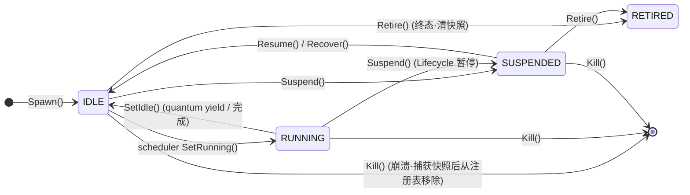

# ares 架构深度解析（七）：运行时与生命周期 — 出生、死亡与新出生（0.3.x）

> 别的 Agent 框架比谁的功能多、比谁的花哨。我只有一个执念：**菜能接受，坏是绝对不能接受的。**
> 有一天我突然在想，如果现在随便 `kill -9` 一个正在跑的 Agent，怎么把它的活救回来？
> 手动拉？先定位是哪个进程，再翻日志分析原因，打补丁，然后 `go run main.go --args`……看着就烦。
> 那有没有一种机制，能让 Agent 死后，它的任务还能带着认知自己续上？我管这个叫 **Tag 转移——Agent 亡，Task 不亡**。
>
> 0.3.x 更新：运行时演进为 **Agent Fabric + Task Fabric + Recovery/Chaos**。核心理念从"Agent 复活"升级为 **"Agent 死亡 ≠ Task 死亡"**——Agent 是一次性的、可丢弃的执行体，Task 才持有检查点。Agent 死了不是"复活旧 Agent"，而是"spawn 新 Agent + 用旧 Agent 的认知检查点喂给它"。Agent 生命周期：`spawn → suspend → resume → retire → kill → recover`。每一次执行都是一次 **quantum**（`ExecuteStep`），在 quantum 边界 yield 保证检查点已落盘。

## 一、纠结的坑

先说说我是怎么**纠结**这个设计的。

最开始的想法很简单：启动一个单独的监控任务，监听所有 Agent 的心跳。挂了就报，报了就去拉。听着不错对吧？结果马上被自己问住了——**监控任务自己凉了怎么办？** 再起一个来监控监控任务？无限套娃，绝了。

那就换个路子。启动一个备用的 Leader，热备，灾备都考虑到了，真棒。问题来了——**Sub Agent 挂了呢？** 总不能也给每个 Sub 配个备份吧？那就启动一群 Sub 轮替呗。COOL，听着真不错。

最后一个问题把我整沉默了：**中断的任务怎么办？**

用户让 Agent 写一个文件，写到一半系统崩了。系统重启后 Agent 自动复活了，然后告诉用户：**"亲，系统刚凉了，我知道你很急，先喝杯茶，咱们从上次断掉的地方继续哦。"**

哪怕用户想问候开发者先人，我都觉得合理。更重要的是——那花掉的 token 呢？从头再来，再花一遍？那可是真金白银的刀乐。

所以整个设计出发点，不是"怎么让 Agent 不死"，而是三个更现实的问题：

1. **Agent 死了，它的任务怎么继续？**（Task 续命）
2. **新 Agent 怎么接上旧 Agent 的认知？**（认知传递）
3. **中断的任务怎么续上，不浪费 token？**（checkpoint 续传）

这三个问题回答了，才敢说"坏不了"。

---

## 二、Agent 的生死状态机：Fabric + AgentState

在 0.3.x 里，Agent 是一个普通的可丢弃结构体，由 **Agent Fabric** 管理。它不负责调度（那是 Task Fabric 的 job），不负责通信（那是 IPC 的 job），只干一件事——**管生管死**。

```go
type Agent struct {
    // Identity 是稳定标识符
    Identity string
    // Capabilities 是声明的能力（capability-aware 调度器用）
    Capabilities []string
    // State 是当前生命周期状态
    State AgentState
    // Load / Confidence / Priority 是调度提示
    Load       float64
    Confidence float64
    Priority   float64
    // Parent 是"谁 spawn 了我"——纯溯源，不构成权限层级
    Parent string
    // SpawnedAt 是创建时间
    SpawnedAt time.Time

    // 私有：cognitive（认知状态）、cognition（执行体）、governance（预算）……
}
```

状态只有四个，个顶个的直白：

```go
StateIdle      AgentState = "IDLE"      // 活着，可被分配任务
StateRunning   AgentState = "RUNNING"   // 正在执行一个任务
StateSuspended AgentState = "SUSPENDED" // 暂停（Lifecycle 层面，非 Task）
StateRetired   AgentState = "RETIRED"   // 永久退役，不可恢复
```



注意 `Kill` 是引向 `[*]` 的——它不是"再一变"，而是**从注册表里删掉**。这是个关键语义：`RETIRED` 还在 registry 里（只是锁死了），而 `Kill` 后这个 Agent 就**不存在了**，只能通过恢复机制"再造一个"出来。

---

## 三、执行能力注入：CognitionFactory（A1）

Agent 结构体贴着执行的位置在 `cognition` 字段上。它默认是 `nil`——也就是说，一个刚 spawn 的 Agent **默认没有任何执行能力**，它只是"可被管理"（能 spawn/kill/recover），但**不能跑一个 quantum**。能不能跑，由 `SpawnSpec.CognitionFactory` 说了算：

```go
type SpawnSpec struct {
    Identity   string      // 请求的 id；"" 则由 Fabric 分配
    Capabilities []string  // 声明的能力
    ParentID   string      // 谁 spawn 了你（溯源，非层级）
    TaskContext map[string]any
    Resources  map[string]any
    Governance Governance // P3 认知执行预算（token/tool/deadline）
    Priority   float64
    // CognitionFactory 根据能力清单产出执行体（Cognition）。
    // nil → Agent 无执行能力，可管理但不可调度。
    CognitionFactory CognitionFactory
    // ExperiencePrior 是蒸馏先验，spawn 时写入 CognitiveState.Context (G1)。
    ExperiencePrior any
}
```

```go
// Cognition 是"一个 quantum 认知工作"的执行契约。
// 每次调用 ExecuteStep 跑一个 quantum：
// 要么完成（Done）、要么产出进度供续传（Checkpoint）、要么失败。
type Cognition interface {
    ExecuteStep(ctx context.Context, task *models.Task) (*StepOutcome, error)
}

// StepOutcome 是单个 quantum 的结果。
type StepOutcome struct {
    Done       bool              // 任务完成时 true（Result 有效）
    Checkpoint any               // 持久化进度（yield）
    Result     *models.TaskResult // 最终结果，仅 Done 时有值
}

// CognitionFactory：Capabilities → Cognition。
type CognitionFactory func(capabilities []string) Cognition
```

spawn 时的注入链路是闭环的：

```mermaid
graph LR
    S[SpawnSpec] -->|Capabilities| F[CognitionFactory(capabilities)]
    F --> C[Cognition 填入 Agent.cognition<br/>A1 执行体注入]
    C -->|Agent.ExecuteStep 跑一个 quantum| O{StepOutcome}
    O -->|Done| R[TaskResult]
    O -->|Checkpoint| Y[yield · 检查点落盘]
    O -->|error| E[可恢复→编码进 StepOutcome<br/>不可恢复→error]
```

三个边界细节值得记下来：

1. **nil 工厂是合法的**：spawn 出来的 Agent 就是"空壳"，只能被管理。`Executable()` 检查它有没有执行体，调度器据此决定**不要把不可执行的 Agent 当候选**。
2. **非 nil 工厂产出 nil 是编程错误**：那会悄悄 spawn 一个永远不可执行的 Agent（代码里叫 "nil cognition was swallowed"），所以直接把整个 spawn **reject 掉**（`ErrInvalidSpawnSpec`）。
3. **实力不够调没资格**：对没有注入执行体的 Agent 调 `ExecuteStep`，直接返回 `ErrAgentNotExecutable`。

另外，`ExperiencePrior` 就是 aresos-agentos-plan G1 的"记忆蒸馏钩子"——把蒸馏出来的先验经验作为新 Agent 的第一个 `CognitiveState.Context`，让它一出生就不是白纸：

```go
if spec.ExperiencePrior != nil {
    a.cognitive = CognitiveState{
        SchemaVersion: CognitiveStateSchemaVersion,
        Context:       spec.ExperiencePrior,
    }
}
```

---

## 四、六大生命周期原语

Fabric 对外暴露 `spawn / suspend / resume / retire / kill / recover`。全部并发安全（`Fabric.mu` 串行化），并且每个原语都会通过可选的 EventSink 发一条生命周期事件（`agent.spawned / suspended / resumed / retired / killed / recovered`）。

### Spawn：只生，不管

```go
func (f *Fabric) Spawn(ctx context.Context, spec SpawnSpec) (*Agent, error)
```

- 新 Agent 一律以 `StateIdle` 出生。
- 校验：id 不能重（`ErrAgentExists`）；id 里不能有空格（`ErrInvalidSpawnSpec`）；资源 claim 超配额 → `ErrResourceQuotaExceeded`（**先校验后变更**，失败时 Fabric 状态零改动）。
- 注入执行体 + 记下 `parent_id` 溯源 + 从出生就挂上治理预算。
- **Spawn 不调度**——把 Agent 放进候选池是 Scheduler 的事。

### Suspend / Resume：Lifecycle 层面的暂停，不是任务暂停

```go
func (f *Fabric) Suspend(ctx context.Context, agentID string) error // IDLE/RUNNING → SUSPENDED
func (f *Fabric) Resume(ctx context.Context, agentID string) error  // SUSPENDED → IDLE
```

- `Suspend` 保留 Agent 的内存认知状态，`Resume` 让**同一个实例**重启（不是新 spawn）。已 SUSPENDED 再 Suspend 是幂等的。
- RETIRED 不能再 Suspend/Resume（`ErrAgentRetired`）；Resume 非 SUSPENDED 状态 → `ErrAgentNotSuspended`。

### Retire：体面的终态

```go
func (f *Fabric) Retire(ctx context.Context, agentID string) error
```

- **要求 Agent 不在 RUNNING**——要退役，先 Suspend 再 Retire（`ErrAgentRunning`）。
- 释放资源 claim（P5 配额回到池子）。
- **必须清掉死亡快照**——这是终态，"前面某次 kill/revive 的旧快照绝不能事后被翻出来复活"。
- 退役父 Agent **不会**连带子 Agent（你们是平级认知体，不是权限树）。

### Kill：崩溃路径，非优雅

```go
func (f *Fabric) Kill(ctx context.Context, agentID string) error
```

- 任何状态都能 Kill，这就是 crash 语义。
- **顺序很要命**：先把 Agent 的复活证据（认知 + 能力 + 父 id，`AgentSnapshot`）捕获下来，**再**从注册表删除、释放资源。因为删完这个 Agent 就再也读不到了，恢复子系统靠这个快照决定能不能"原地复活"。
- 子 Agent 照旧活着，`Parent` 字段不清——那是溯源，死了也得留痕。

### Recover：让新 Agent 接上旧 Agent 的认知

```go
func (f *Fabric) Recover(ctx context.Context, agentID string, cognitive CognitiveState) error
```

- 目标 Agent 必须在 IDLE 或 SUSPENDED。把 `cognitive` **整个替换**进这个 Agent。
- 如果它是 SUSPENDED，顺便切回 IDLE。
- 这就是"一个死亡 Agent 的认知由另一个/新的 Agent 捡起来"的落地动作（§13 不变式：**Agent 可丢，Task 耐操**）。

---

## 五、Fabric 本身：注册表、进程树、配额与事件

```mermaid
graph TB
    subgraph Fabric（生命周期支柱）
        REG[agents 注册表]
        TREE[children 进程树<br/>parent→childIDs]
        QUOTA[resourceBudget / allocated<br/>P5 配额]
        SNAP[snapshots 死亡快照库<br/>last-per-identity]
        SINK[EventSink 生命周期事件]
    end
    REG -->|Idle?| SCHED[Task Fabric 调度器<br/>只把 IDLE 且可执行当候选]
    TREE -->|纯溯源·非权限| PROV
    QUOTA -->|spawn 校验 / kill·retire 释放| ALLOC
    SNAP -->|Kill 前捕获| SAVE
    SINK -->|best-effort| LOG[事件日志<br/>跨重启重建]
```

几个要点：

- **进程树（Process Tree）是 Pure Provenance**：`children[parentID]` 只回答"谁 spawn 了谁"，绝不构成权限层级（§13 不变式 #1：A ≡ B ≡ C，平级认知体）。
- **资源配额（P5）是准入控制**：spawn 时一次性 claim，kill/retire 时释放。`resourceBudget` 为空/关闭则不做准入控制。
- **事件是 best-effort**：`sink.Emit` 失败**永远不破坏状态机**——内存注册表才是权威。反过来说，跨进程重启想重建状态，就得靠事件日志了（Evidence-Driven）。
- **死亡快照库**：每个身份只留**最近一次**死亡快照。`Retire` 时清掉（terminal）；成功原地复活后会 `ClearSnapshot` 消费掉，防止长跑进程里堆满过期快照。多个死亡 Agent 共享同一能力时，恢复优先取 `DiedAt` **最新的那个**——最新鲜的认知是最安全的复活种子。

---

## 六、L2 执行图与 DAGExecution 门：先把丑话说清楚

这一节我特别想把丑话说在前面，因为它**不是**已经上线的能力。

Agent Fabric 里有一个 `L2Graph`：每次 session 一个 `engine.MutableDAG`，节点是实际工具实例，配一个 router 认知按任务的 capability 分发到 `toolCognition / answerCognition / rootCognition / （可选的）planCognition`。看起来很完整对不对？但它有一个门：

```go
// DAGExecution 是 L2 session 图执行路径的门。
// 零值 = 传统 ReAct 行为：peer 的认知工厂返回 chat（tool-loop）认知，
// L2 图机制保持 test-only。
type DAGExecution struct {
    Enabled bool
}

func (g DAGExecution) Select(chat, router Cognition) Cognition {
    if g.Enabled {
        return router // 门开了，走 session 图执行
    }
    return chat       // 默认：老 ReAct 循环
}
```

**诚实地说**：`Enabled` 默认是 `false`。所以**生产环境的 peer 走的还是那条默认的 chat / ReAct tool-loop 认知**，`L2Graph` 和 router 认知目前**没有接进生产 serve 路径**，只是 test-only 的前瞻种子。代码注释里原话是：*"it is not yet wired into the production serve path — until it is, peers keep their default ReAct chatCognition and this graph stays test-only."*

这不代表它没用——router 的分发键（`Task.AgentType` → 候选重叠 → 执行体）**恰好就是调度器已经在解析的那把钥匙**，所以哪天门开了也不需要新增分发机制。`toolCognition` 干净地满足"状态即任务"（严格 schema 工具只收到 `arg.` 前缀的键，envelope 管道字段永远到不了工具）；`answerCognition` 有个 TODO：**还没接 summarizer**——它只输出自己节点带的内容，没内容就老实说 "no answer content supplied" 并记一条 warning，绝不装成功。

**反思**：这是我最想强调的自我克制——文档把 L2 图讲得再漂亮，只要 `Enabled=false`，它就没在跑。把它当"已上线的能力"写，就是骗人。好东西应该允许它还没被默认打开。

---

## 七、死亡、复活与混沌验证：Recovery + Chaos

真正把"Agent 亡而 Task 不亡"撑起来的是 `internal/aresrecovery`。它把两个 Fabric 焊在一起：**Task Fabric（耐操的任务 + 租约过期 + 检查点）+ Agent Fabric（可丢的 Agent + 认知状态）**，实现"Agent 死亡 → 任务 requeue → 检查点续传 → 顶替者上岗"。

```mermaid
graph TB
    K[Agent 死亡<br/>Kill 或租约失效] --> S[Kill 先捕获 AgentSnapshot<br/>认知+能力+父id]
    S --> R2{恢复预算<br/>restarts[id] < MaxRestarts?}
    R2 -->|否| EX[ErrRecoveryExhausted<br/>不再复活]
    R2 -->|是| A2{存在 LastSnapshot?}
    A2 -->|是| IP[RestartAgent 原地复活<br/>保留同一 identity·溯源连续]
    A2 -->|否| FW[新 identity<br/>纯 W1 替换]
    IP --> REC[agents.Recover 装入认知检查点]
    FW --> REC
    REC --> CLEAR[ClearSnapshot·消费快照]
    CLEAR --> LE[租约过期→任务 READY<br/>新 Agent 从检查点续跑]
```

### 重启用到的真实细节

**恢复预算是"终生累计"的，而不是"连续失败累计"。** 这一条值得单独拿出来说：

```go
// restarts 按 identity 终生累计，且**故意不在成功复活后清零**：
// 预算的存在是为了阻止一个坏 Agent 无限循环，所以是"死亡总数"在消耗它，
// 而不是"连续死亡数"。（A2 评审澄清 2026-08-22）
if attempts >= r.policy.MaxRestarts {
    return nil, ErrRecoveryExhausted
}
```

默认策略 `DefaultRestartPolicy()`：`MaxRestarts=5`，初始退避 `1s`，封顶 `30s`。一个老暴毙的 Agent，哪怕这次救回来了也照样扣预算——**成功救活不清零**。这跟"存活累计"的心智是反直觉的，但它是对的：你不想让一个病秧子靠着"每次都恰好救回来"永远刷下去。

**原地复活 vs 完全替换（A2 仲裁）。** 如果死掉的身份 `LastSnapshot` 还在，`RestartAgent` 会**原地复活**——保留同一个 `Identity`，溯源和审计链条不断（"有状态认知复活"）；如果没有快照，就退化为**新 identity 的纯 W1 替换**：

```go
if _, ok := r.agents.LastSnapshot(deadAgentID); ok {
    spec.Identity = deadAgentID // 有快照 → 原地复活保持同一 id
}
```

**复活 spawn 永远走恢复通道。** 顶替 spawn 一律用 `SpawnForRecovery`：它**绕过人口上限配额**（一个被自我修复 spawn 拒掉的 Agent 会把任务永远晾在那），但**不绕过 Enabled 闸**。同时 `WithCognitionFactory` 会注入 A1 执行体工厂，确保顶替者是一个**真实可执行**的认知进程，而不是一个空壳（消灭 phantom）。

### 两条恢复路径，必须分清楚（重要的诚实点）

| 入口 | 用途 | 说明 |
|------|------|------|
| `RequeueExpiredLeases()` | 租约过期 → 任务 requeue 到 READY | 第一个恢复路径：死者租约会过期，任务重新可被认领 |
| `RecoverTaskCheckpoint()` | 顶替 agent + acquire 任务 + 装检查点 | **TEST/CHAOS-ONLY** |
| `RecoverFromAgentDeath()` | 完整链路：requeue → 逐任务续检查点 | **TEST/CHAOS-ONLY** |

代码里对后两个注释得很重：它们经由 `agents.SetCognitiveState` 装检查点、自己 acquire 任务，是**独立于生产调度器路径**（`scheduler.executeWithCandidates → taskfabric.DecodeCheckpoint → ToModelTask`）的另一套机制。**生产恢复走的是 `cmd/ares` 里的 `runKernelRecoveryLoop`**，这三兄弟只给 chaos 模拟、sandbox 测试、恢复测试用——文档里明确警告不能把它们接进生产 serve 路径。

### Chaos：先砸，再验

```go
// Chaos 是故障注入 + 恢复验证 harness。
// Recovery 证明运行时能在故障下活下来。
// 注意：故障注入 ≠ 触发恢复——先断言"任务被晾死"，再 VerifyRecovery 断言活过来。
func (c *Chaos) InjectFailure(ctx, agentID, failure) error     // "kill" 或 "suspend"
func (c *Chaos) VerifyRecovery(ctx) int                        // 返回恢复的任务数
```

两种可注入的故障：`FailureKill="kill"`（硬杀，立刻移除）和 `FailureSuspend="suspend"`（软暂停，模拟挂起/卡死而非崩溃）。`InjectFailure` **不触发恢复**，`VerifyRecovery` 才触发——把"注入后任务孤立"和"验证后任务恢复"拆成两段，测试才断得干净。

---

## 八、已知问题和设计缺陷

**1. 事件流最佳努力，内存注册表才是权威 → 跨重启重建依赖事件日志**

`Fabric.record` 失败不会破坏状态机，这是正确的取舍；但它意味着"本次进程内"看内存、"跨进程重启"必须靠事件日志（Evidence-Driven）重放。两套真相源并存，排查时要补一层对账。

**2. 恢复预算"终生累计"的反直觉**

成功复活不给病人清零预算（见第七节），能挡住病秧子无限刷，但代价是：一个偶发暴毙、本可养好的 Agent，会在几次"成功救活"之后照样被 `ErrRecoveryExhausted` 掐死。归零/衰减策略目前没有——是个有待开放的问题。

**3. 原地复活的依赖链脆**

`LastSnapshot` 有 → 原地复活；而快照只在 `Kill` 时捕获。如果一个 Agent 是"瞬间消失"（进程都没了，连 Kill 都没来得及跑），就没有快照，只能走新 identity 替换。这套机制目前依赖 `Kill` 先手捕获，对无法预知的硬崩溃覆盖有限。

**4. DAGExecution 默认关**

L2 执行图是漂亮的远景，但 `Enabled=false` 意味着它现在没在生产跑。把它当已上线能力用会踩空。它是前瞻种子，不是现役主力。

**5. RecoverTaskCheckpoint / RecoverFromAgentDeath 是 test/chaos-only**

生产恢复是 `runKernelRecoveryLoop`。这两条路径用 `SetCognitiveState` + 自 acquire，是与生产调度器**独立**的机制，绝不能误接进生产 serve 路径，否则就跟真实调度器打架。

**6. 恢复是"宁可重做，不可遗漏"**

`findByCapability` 取最新死亡快照、`RecoverFromAgentDeath` 逐个续上过期任务。对着**非幂等工具**（下单、发邮件），重跑是灾难性的。恢复系统目前没有工具级幂等标记来区分"可安全重试"与"必须跳过"。

---

## 九、架构总结

| 模式 | 解决的问题 | 不足 |
|------|-----------|------|
| 状态机 IDLE/RUNNING/SUSPENDED/RETIRED | 生命周期可观测、可仲裁 | SUSPENDED/Retired 边界需谨慎（Retire 不能直接对 RUNNING） |
| Kill 先捕获快照再删注册表 | 死亡证据不丢，可原地复活 | 无法预知的硬崩溃连 Kill 都轮不到跑 |
| Retire 清快照（终态） | 阻止旧快照被事后翻出来复活 | — |
| 进程树纯溯源（A ≡ B ≡ C） | 父子平级，父死子不死 | 排查因果要自己看树 |
| Spawn 发现即注执行体（CognitionFactory） | 离散的命=能力绑定 | nil 工厂产出空壳 Agent，需 `Executable()` 挡 |
| ExperiencePrior 蒸馏先验注入 | 新 Agent 非白纸 | 先验质量决定了孵化效果 |
| Factory 注入 + Recover 装认知 | Agent 亡，认知续 | 依赖 Kill 先手捕获快照 |
| Recovery 终生累计预算 | 阻止坏 Agent 无限循环 | 成功救活不清零，可能误杀偶发事故 |
| 原地复活（LastSnapshot 命中） | 溯源与审计链条连续 | 快照缺失即退化为 W1 新 id |
| Chaos 注入 + Verify 分离 | 先证孤立、后证恢复，测试断得干净 | 仅 kill/suspend 两类故障 |
| DAGExecution 门（默认关） | 前瞻 L2 图不冲击现役 ReAct | 未上生产，接错会踩空 |

最让我高兴的一次测试：通过 Chaos `InjectFailure` 杀掉一个在跑的分析 Agent，任务被晾在 READY 上，然后 `VerifyRecovery` 把它的检查点续给一个顶替者——任务照常往后跑，token 一分没多花。

那一刻我知道：**钱没白花。**

---

**附录：关键文件索引**

| 文件 | 核心职责 |
|------|----------|
| `internal/fabric/agent/agent.go` | `Agent` 结构 + 状态 `IDLE/RUNNING/SUSPENDED/RETIRED` + `CognitiveState` + `Executable()` |
| `internal/fabric/agent/lifecycle.go` | `SpawnSpec` + `spawn/suspend/resume/retire/kill/recover` 生命周期原语 |
| `internal/fabric/agent/fabric.go` | `Fabric` 注册表、进程树（溯源）、资源配额、EventSink |
| `internal/fabric/agent/executor.go` | `Cognition` / `StepOutcome` / `CognitionFactory` / `CognitionFunc` |
| `internal/fabric/agent/l2graph.go` | `L2Graph` + router/tool/answer/root/plan 认知 + `DAGExecution` 门 |
| `internal/fabric/agent/snapshot.go` | `AgentSnapshot` + `snapshotStore` + `LastSnapshot/ClearSnapshot/FindRevivableSnapshot` |
| `internal/aresrecovery/recovery.go` | `Recovery` + `RestartPolicy` + 恢复链路（含 test/chaos-only 路径） |
| `internal/aresrecovery/chaos.go` | `Chaos` 故障注入（kill/suspend）+ `VerifyRecovery` |
| `internal/fabric/task/state.go` | Task 状态（`READY/RUNNING/SUSPENDED/FAILED`…）与迁移 |
| `cmd/ares` | `runKernelRecoveryLoop` —— 生产恢复环路 |

---

**本系列（运行时篇）**

| 章节 | 主题 |
|------|------|
| [01 架构总览](01-architecture-overview-deep-dive.md) | 全盘架构与设计原则 |
| [02 Agent Harmony 协议](02-agent-harmony-protocol.md) | Agent 间通信与协作 |
| [07 运行时与生命周期](07-runtime-lifecycle-deep-dive.md) | **本篇**：Fabric 出生/死亡/新出生 |
| [08 事件系统](08-event-system-deep-dive.md) | 事件溯源与状态重建 |
| [09 Arena 故障注入](09-arena-fault-injection-deep-dive.md) | 故障注入战场 |