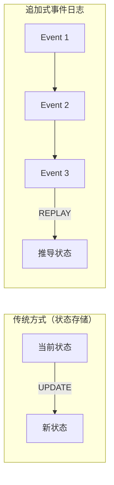
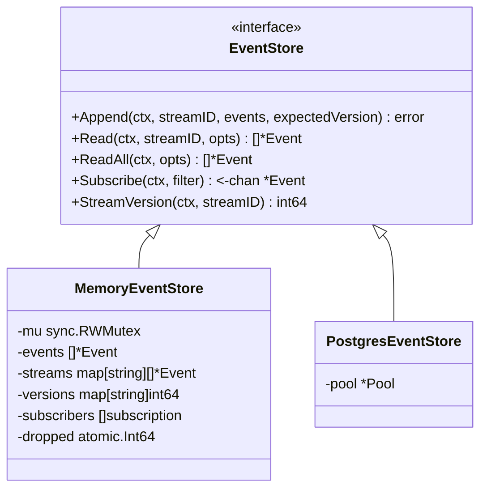
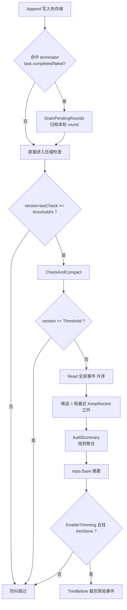
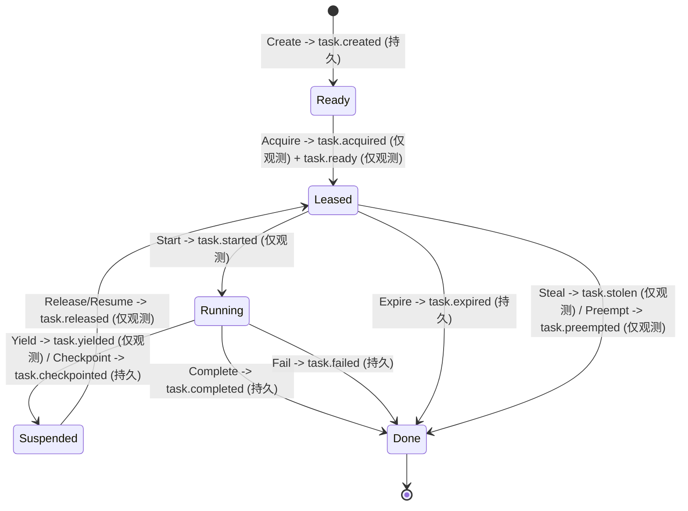
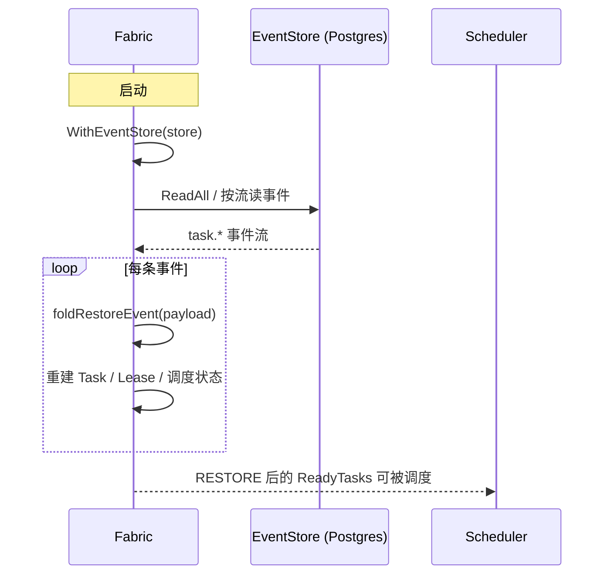
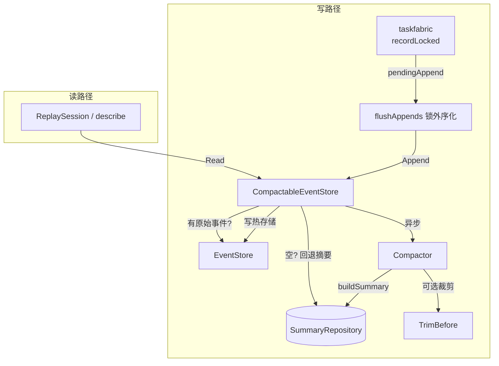

# ares 架构深度解析（八）：事件系统 — 追加式事件日志、压缩归档与任务生命周期（0.3.x）

> 0.3.x 更新：`internal/fabric/task` 引入完整 Task 生命周期事件（created/ready/acquired/started/yielded/checkpointed/preempted/released/completed/failed/expired/stolen）。Task Fabric 把每次状态迁移追加到内存日志，并在挂了 `EventStore` 时写进持久层，方便跨重启重建 Scheduler / Task / Lease 状态。注意：所谓"事件直接驱动调度"是过度宣传——调度器是能力+优先级的 work-stealing 打分，不是"task.completed → 依赖变 Ready"的事件驱动 dispatch。

> Agent 启动是个事件、任务状态迁移是个事件、工具调用是个事件、LLM 返回是个事件、Agent 挂了也会留下一个事件。
> 我当时的想法：如果我把每一种状态变更都记成一条只追加的记录，是不是就能在进程挂了之后，把发生过的事情重放回来？
> 答案是：能重建一部分。但要诚实地说——它**不能**重建全部（见后文"它做不到什么"）。

---

## 一、为什么记事件

我最早做 Agent 时状态就是用内存 struct 存。干到哪一步、处理了什么、报了什么错，全在进程里。进程一挂，什么证据都没有：没有记录、没法回放、没法审计这一步到底是不是越权调的某个工具。

于是我想到了 Event Sourcing：**不存当前状态，存每一次变更操作。想要当前状态？把事件流重放一遍自己算。**



但这个设计真正能给你的，需要先讲清楚**它做不到什么**——避免读者对着标题产生不切实际的期待：

- ✅ **审计轨迹**：每次状态变更都有时间戳、类型、来源模块（`module_name`）和载荷。
- ✅ **回放**：按流把事件升序读回来，`ares_flight` 的 ReplaySession 可以逐步回放、跳转。
- ✅ **跨重启重建**：`taskfabric` 能从持久事件里重建任务集（`RestoreFromStore`）。
- ⚠️ **它不做**：事件日志本身不承担"精确重放每一步工具调用副作用"的责任——它记录发生了什么，不保证外部世界可回放。
- ⚠️ **它不做**：`taskfabric` 里只有少数生命周期事件会落持久层（见第六章）；大多数状态迁移是"仅观测"的，重启后靠重新编译 DAG 而非重放这些事件来重建拓扑。

核心文件（本次讲解只涉及灰显之外、标记 ✅ 的文件，其余见对应文章）：

| 文件 | 用途 |
|------|------|
| `internal/ares_events/types.go` | Event 模型、EventType 枚举、ReadOptions / EventFilter、哨兵错误 |
| `internal/ares_events/store.go` | EventStore / EventAppender 接口 + `Emit` helper |
| `internal/ares_events/memory_store.go` | 内存实现 `MemoryEventStore`（含订阅、裁剪） |
| `internal/ares_events/pg_store.go` | PostgreSQL 实现 `PostgresEventStore` |
| `internal/ares_events/compactor.go` | 压缩器：把旧事件聚合为摘要 |
| `internal/ares_events/summary.go` | EventSummary 模型 + SummaryRepository 接口 + CompactionConfig |
| `internal/ares_events/compactable_store.go` | 自动压缩的 EventStore 包装器 |
| `internal/ares_events/trim_store.go` | `TrimAwareStore`：压缩后裁剪旧事件 |
| `internal/ares_events/archive_hook.go` | `ArchiveSink`：round 归档钩子 |
| `internal/ares_events/tool_events.go` | 工具完成事件统一载荷键 |
| `internal/fabric/task/events.go` | Task 生命周期 EventType + TaskEvent |
| `internal/fabric/task/fabric.go` | 事件记录 / 持久化 / 恢复逻辑 |
| `internal/runtime/observability/flight/replay.go` | ReplaySession 逐步重放（见系列第 16 篇） |

---

## 二、事件模型

### 2.1 事件结构

`internal/ares_events/types.go` 定义：

```go
type Event struct {
    ID         string         `json:"id"`
    StreamID   string         `json:"stream_id"`
    Type       EventType      `json:"type"`
    ModuleName string         `json:"module_name,omitempty"`
    Payload    map[string]any `json:"payload"`
    Metadata   map[string]any `json:"metadata,omitempty"`
    Version    int64          `json:"version"`
    Timestamp  time.Time      `json:"timestamp"`
}
```

事件属于一个**流**（`StreamID`）——某个实体的只追加序列，通常是一个任务或 agent。`Version` 在 append 时由存储分配并递增（乐观并发控制）。`ModuleName` 记录是哪个子系统发出的（例如 `taskfabric`），回放时你能直接知道来源，而不是从 payload 反推。`Type` 用于路由和分类。

同文件的辅助能力：`VerifyStreamIntegrity` 校验一段事件流版本连续无空洞；`StreamHash` 给整条流算一个确定性哈希用于检测静默损坏；哨兵错误包括 `ErrVersionConflict`、`ErrStreamNotFound`、`ErrEventStoreClosed`、`ErrEventIntegrity`、`ErrSummaryNotFound`。

### 2.2 事件类型（ares_events 侧）

`ares_events.EventType` 是一个字符串别名，枚举覆盖系统各处事件：

```go
// 节选
EventAgentStarted      = "agent.started"
EventTaskCreated       = "task.created"
EventTaskCompleted     = "task.completed"
EventTaskFailed        = "task.failed"
EventSessionCreated    = "session.created"
EventMessageAdded      = "message.added"
EventMemoryDistilled   = "memory.distilled"
EventLLMCall           = "llm.call"
EventToolCallStarted   = "tool.call.started"
EventToolCallCompleted = "tool.call.completed"
// Task 生命周期（taskfabric 发布）
EventTaskReady       = "task.ready"
EventTaskAcquired    = "task.acquired"
EventTaskStarted     = "task.started"
EventTaskYielded     = "task.yielded"
EventTaskCheckpointed= "task.checkpointed"
EventTaskPreempted   = "task.preempted"
EventTaskReleased    = "task.released"
EventTaskExpired     = "task.expired"
EventTaskStolen      = "task.stolen"
// Leader-sub 协作
EventSubTaskScheduled = "sub_task.scheduled"
EventSubTaskStarted   = "sub_task.started"
EventSubTaskResult    = "sub_task.result"
EventSubAgentFailed   = "sub_agent.failed"
// 其他：step.* / handoff / discovery.* / component.failed
```

### 2.3 EventStore 接口

`internal/ares_events/store.go`：

```go
type EventStore interface {
    Append(ctx context.Context, streamID string, events []*Event, expectedVersion int64) error
    Read(ctx context.Context, streamID string, opts ReadOptions) ([]*Event, error)
    ReadAll(ctx context.Context, opts ReadOptions) ([]*Event, error)
    Subscribe(ctx context.Context, filter EventFilter) (<-chan *Event, error)
    StreamVersion(ctx context.Context, streamID string) (int64, error)
}
```

关键语义（两个实现一致）：

- `Append(expectedVersion)`：`>0` 必须等于流当前版本，否则返回 `ErrVersionConflict`；`<=0` 表示"自动接在当前版本后追加，不做冲突检查"。两个实现都用**事务/锁**实现，PGC/内存双实现。
- `ReadOptions`：`FromVersion`（含）、`Limit`（0 表示不限）、`Direction`（Ascending/Descending）、`Since`。
- 辅助接口 `EventAppender` 只是 `Append` 一个方法的窄接口，供 `Emit` 使用；`Emit(ctx, store, streamID, type, moduleName, payload)` 是唯一的规范发布入口，失败只记一条 warning 并返回 false。

---

## 三、两类存储实现

两个实现都满足同一套接口，语义尽量对齐，但实现路径不同：



### 3.1 MemoryEventStore

`memory_store.go`。加锁 → 版本校验 → 为每个非 nil 事件分配递增 `Version`（nil 事件跳过，不占版本号）→ 写入 `events`（扁平）和 `streams`（按流）→ 通知订阅者。发布给订阅者的是**克隆副本**（B19），因为你下发的 `*Event` 指针和内部存储共享，订阅者若改动会与并发 Read/Append 竞争。

`Subscribe` 的 channel 容量是 **64**；`notifySubscribers` 是**非阻塞发送**——缓冲区满了就静默丢弃并累计到 `dropped` 计数器（`Stats()` 暴露 `dropped_events`，仅用于监控数据丢失，不会阻塞写路径）。订阅者 context 被取消或 store `Close()` 时，订阅 channel 会被关闭并清理。

`MemoryEventStore` 还实现了 `TrimBefore`，让压缩后的裁剪在内存半边也能工作——否则长驻进程里内存无界增长。

### 3.2 PostgresEventStore

`pg_store.go`。`Append` 用一个事务：`SELECT MAX(version) WHERE stream_id = $1` 读当前版本 → 乐观并发检查 → 逐条 `INSERT INTO events (id, stream_id, type, payload, metadata, version, created_at)`。并发的唯一键冲突（PG 错误码 `23505`）会被翻译成 `ErrVersionConflict`。

`Subscribe` 没有用 LISTEN/NOTIFY，而是**每 1 秒 poll 一次**（`defaultEventReadLimit = 100` 的滑动窗口），用 `delivered` id 集合去重（上限 `maxDeliveredIDs = 8192`，溢出后重置集合——最多可能重投旧事件，绝不丢新事件）。这是把"订阅"简化成了"定时查询"，代价是实时性只有秒级。

两个实现的 `Emit` 路径、`ReadOptions` 语义、`expectedVersion` 语义保持一致。

---

## 四、压缩与归档管线

不压缩，事件会无限增长。`Compactor` 把旧事件聚合成紧凑的 `EventSummary`，存进 `SummaryRepository`（关系库），再把原始事件从热存储里裁剪掉。

### 4.1 CompactionConfig 默认值

```go
func DefaultCompactionConfig() CompactionConfig {
    return CompactionConfig{
        Threshold:             500,          // 流超过该事件数触发压缩
        KeepRecent:            100,          // 压缩后保留的最新原始事件数
        MaxSummariesPerStream: 50,           // 每条流最多摘要数
        SummaryTTL:            30 * 24 * time.Hour, // 30 天
        EnableTrimming:        true,         // 压缩后删除已合并的原始事件
    }
}
```

`CompactableEventStore` 是带自动压缩的**包装器**（`compactable_store.go`）：它内嵌 `EventStore`，重写 `Append`，在写入后异步检查是否需要压缩。

### 4.2 自动触发 + 防抖

`Append` 只做同步写入，真正的压缩工作**异步**跑（每个事件批次触发一个 goroutine，用 store 自身的生命周期 context `lctx` 而不是调用方 context，避免短请求导致的取消——每次运行仍有 `compactionTimeout = 30s` 上限）：

- `maybeCompact` 先读 `StreamVersion`，**防抖**：只有 `version - lastChecked >= threshold/4`（`compactionCheckDivisor = 4`）才真正检查，避免热流上每次 append 都做 I/O。
- 超阈值就调 `compactor.CheckAndCompact`。
- `Key` 路径全程靠 `lastChecked` map 记录上次检查的版本。

### 4.3 压缩流程



核心点：压缩**先落摘要、后裁剪**。裁剪的边界是摘要的 `EndVersion`——保证被剪掉的每个事件都已经进了摘要，不会丢数据。`Compactor` 还暴露 `ForceCompact`（无论如何都压）和 `CleanupOldSummaries`（按 `SummaryTTL` 删除过期摘要）。

### 4.4 DefaultSummarizer：规则式摘要

`EventSummarizer` 是个函数类型（`func([]*Event) string`），默认 `DefaultSummarizer` 是纯规则的，不调 LLM。它统计事件数、去重收集 `task.created` 的任务 ID 与 `llm.call` / `tool.call.*` 里的工具名、截取用户请求、按 `task.failed` / `task.completed` 判定 outcome（`failed` / `partial` / `completed` / `active`），输出形如：

```
Agent stream-1, ran 1 task(s) [task-42], called 2 tool(s) [search, calculator], emitted 6 events, duration 1s, bound to user request: "Plan a trip to Tokyo", result: completed
```

（工具列表截断到 5 个、任务列表到 3 个、请求片段到 120 字符、错误最多 3 条——都有硬上限，防止摘要失控。）

### 4.5 读取时的摘要回退

如果热存储里的原始事件已被裁剪，`CompactableEventStore.Read` 会回退：底层 `Read` 返回空 → 查 `SummaryRepository` → 把摘要转成合成的 `"event.summary"` 事件返回。这让 ReplaySession 在压缩后仍不会直接崩掉，但请注意这是**降级**：你拿到的是摘要，不是原始事件。

### 4.6 ArchiveSink：round 归档

`compactable_store.go` 通过 `WithArchiveSink(sink)` 挂一个 `ArchiveSink`（`archive_hook.go`，函数类型）。它的职责在**压缩之前**把"一轮任务"（从上一个终端事件到 `task.completed`/`task.failed`）的记录归档，确保这些原始事件在被压缩裁剪**之前**已经留下一份 durable 副本，专门给上下文压缩策略用。

归档也是在 `task.completed`/`task.failed` 终态命中或压缩前，由 `drainPendingRounds` 分页扫描（每页 500，最多 1000 轮）完成；sink 失败是 best-effort，只记日志，绝不阻断 append 或压缩。

---

## 五、Task Fabric：任务生命周期事件

`internal/fabric/task/events.go` 定义了一个**独立于** `ares_events` 的 `EventType` 枚举：

```go
const (
    EventTaskCreated      EventType = "task.created"
    EventTaskReady        EventType = "task.ready"
    EventTaskAcquired     EventType = "task.acquired"
    EventTaskStarted      EventType = "task.started"
    EventTaskYielded      EventType = "task.yielded"
    EventTaskCheckpointed EventType = "task.checkpointed"
    EventTaskPreempted    EventType = "task.preempted"
    EventTaskReleased     EventType = "task.released"
    EventTaskCompleted    EventType = "task.completed"
    EventTaskFailed       EventType = "task.failed"
    EventTaskExpired      EventType = "task.expired"
    EventTaskStolen       EventType = "task.stolen"
    EventTaskUpdated      EventType = "task.updated" // 仅观测，不落盘
)
```

`TaskEvent` 是那条**内存日志**里的不可变记录：`{Type, TaskID, AgentID, Origin, State, Checkpoint, At}`。fabric 每个状态迁移都会 `append` 进内存日志（`f.events`，有上限 `maxInMemoryEvents`）。

### 5.1 状态迁移 → 事件 映射



> 这张图是"状态迁移 → 事件"的**意图示意**，标注了每个事件是否落持久层。具体每个迁移跑在哪个函数里、准确的状态集合，请以 `internal/fabric/task` 的 state machine 为准，本文只陈述事件这一侧的事实（含持久与否），不展开全部状态机细节。

### 5.2 哪些落盘，哪些不落盘

fabric 把事件记进内存日志，**只有当挂了 `EventStore` 时**（`WithEventStore`）才会往持久层写，并且不是每个事件都写。`isMustPersistEvent` 决定：

```go
// 必须持久（恢复/重放正确性依赖它们）
TaskCreated, TaskCheckpointed, TaskCompleted, TaskFailed, TaskExpired

// 仅观测（丰富轨迹，但重建状态不依赖）
TaskReady, TaskAcquired, TaskStarted, TaskYielded,
TaskPreempted, TaskReleased, TaskStolen
```

机制：`recordLocked` 在持锁时构建内存事件 + 一个 `pendingAppend`（不碰 I/O）；解锁后 `flushAppends` 再把 durable 写入**锁外**执行，并通过 `flushCond` + 单调 `seq` 保证并发 fabric 调用落盘顺序与记录顺序一致（N7），避免按流版本倒挂。每一个持久事件都带上 `module_name: "taskfabric"`，payload 里包括 `task_id / agent_id / origin / epoch / strategy_id / session_id`；**must-persist** 事件额外携带完整恢复字段（capability / priority / dependencies / deadline / retry / created_at / checkpoint JSON）——`RestoreFromStore` 正是靠这些字段 `foldRestoreEvent` 把任务折叠回来。

持久写失败：must-persist 事件会记 `Error` 日志（可检测到内存与事件日志的 divergence），观测事件则静默 best-effort。进程内的状态机始终是权威，append 失败不会回滚迁移。

### 5.3 EventTaskUpdated：增量重写，只观测不落盘

`taskfabric` 的增量编译器在改一个任务的调度形态（`Dependencies`）或 payload 时，会记一条 `EventTaskUpdated`。但这条事件**特意不落盘**（`events.go` 注释明说 "BY DESIGN"）：

- 它不在 `isMustPersistEvent` 里；
- 它在 `taskEventType` 映射里**没有对应项**（映射返回 `""`，fabric 永不 publish）。

原因：这些是**原位重写**（`SetDependencies` 一句话搬动一个任务，而不是重新编译整批）。重启后拓扑是**重新编译 live DAG** 重建的，而不是回放这些重写事件。把它纳入跨重启协议属于协议变更，不是编译器变更。这一点值得你留意——如果期望"事件日志是全部真相"，`EventTaskUpdated` 会打破这个预期。

---

## 六、它做不到什么（诚实清单）

1. **不是每个生命周期事件都落盘**。Ready/Started/Yielded/Stolen 等是仅观测的；`EventTaskUpdated` 压根不进持久层。跨重启重建依赖 must-persist 那五类 + 重新编译 DAG。
2. **Postgres 订阅是 1 秒轮询**，不是实时推送。Realtime 想推给 Dashboard，得自己叠加 SSE（事件层本身不提供）。
3. **只记"发生什么"，不保证"可重放副作用"**。工具调用副作用（发邮件、写库）发生后，事件只是事后记录，不会替你撤销或重放外部效果。
4. **压缩后的读回退是降级**：拿到 `event.summary` 合成事件，不是原始事件。要原始事件得靠归档/裁剪前的副本。
5. **写路径不阻塞**：压缩、归档都是异步 best-effort，失败只记日志；`dropped_events` 计数器只暴露给监控，不保证不丢。

---

## 七、重放与恢复

### 7.1 ReplaySession

`internal/runtime/observability/flight/replay.go` 的 `NewReplaySession(ctx, eventStore, taskID)` 把某个任务的流升序读进来做逐步回放。详见系列第 16 篇（Flight Recorder），这里只提它的存在与依赖。

### 7.2 Task Fabric 跨重启重建



### 7.3 与"Agent 复活"的关系

Agent 复活（两阶段恢复、快照优先、事件流回退降级）是**第 7 篇**（Runtime / Resurrection）的主题：`internal/runtime/recovery.go` 的 `RecoverSnapshotOrEvents()` 先快照后事件流，`event_recovery.go` 从事件流重建 RecoveryState。事件系统在这里扮演的是"回退数据源"角色——**这属于 ares_runtime 对事件的消费**，不是事件系统自身的能力，别归错账。

---

## 八、设计模式总结

| 模式 | 位置 | 用途 |
|------|------|------|
| 追加式事件日志 | `types.go` | 不可变只追加记录（含流内版本） |
| 乐观并发控制 | `Append(expectedVersion)` | `>0` 必须匹配当前版本，冲突返回 `ErrVersionConflict` |
| CQRS（衰减版） | EventStore（写/热存储）+ SummaryRepository（摘要） | 压缩后读取回退摘要 |
| 观察者 / 订阅 | `Subscribe(EventFilter)` | 内存：非阻塞广播；PG：1 秒轮询推送 |
| 策略 | `EventSummarizer` 函数类型 | 可插拔摘要（默认规则式） |
| 装饰器 | `CompactableEventStore` 包装 `EventStore` | 透明自动压缩，Append 接口不变 |
| 防抖 | `lastChecked` map + `threshold/4` | 减少热流上的重复压缩检查 |
| 双写解耦 | `recordLocked`（持锁）+ `flushAppends`（锁外） | 事件持久写不阻塞 fabric 状态机 |

### 关键数据流



---

## 九、结尾

Event Sourcing 的核心价值不是"跑得飞快"，而是**出事之后能拿到一份按顺序排列的、谁在什么时候干了什么的记录**，并且这份记录能支撑重放和跨重启重建。它也有一堆边界——不是每个事件都落盘、订阅是秒级轮询、外部副作用不可重放。这些边界我在这篇里照实写了，因为它们才是真实系统里你会踩到的坑。

**事件系统不让你跑得更快，它让你在出事之后，知道该查哪里、能查到什么。**

---

*下一篇预告：Arena / 故障注入——你可能从 Dashboard 上一个按钮"暗杀"正在工作的 Agent，然后看它秽土转生。那是对"状态系统到底能恢复到多完整"最直接的压力测试。*