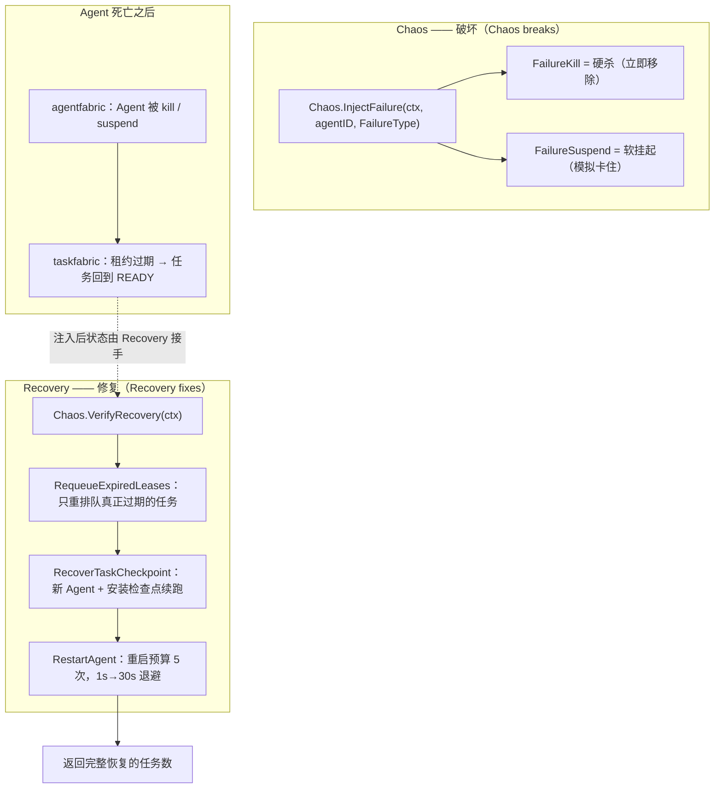
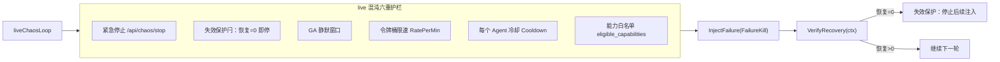
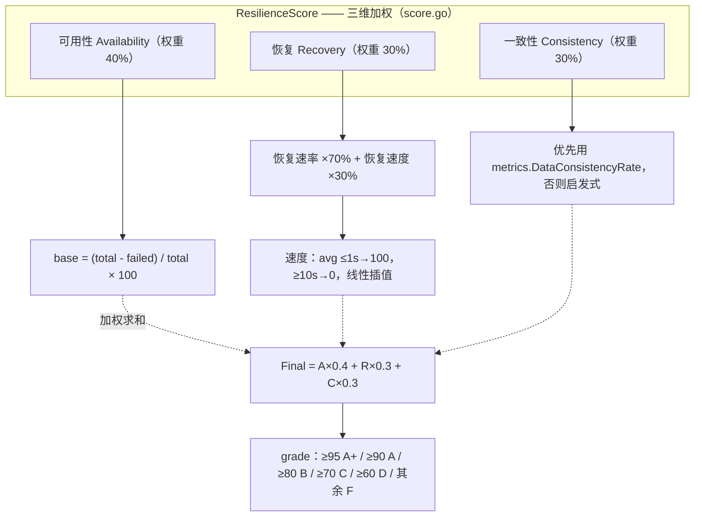
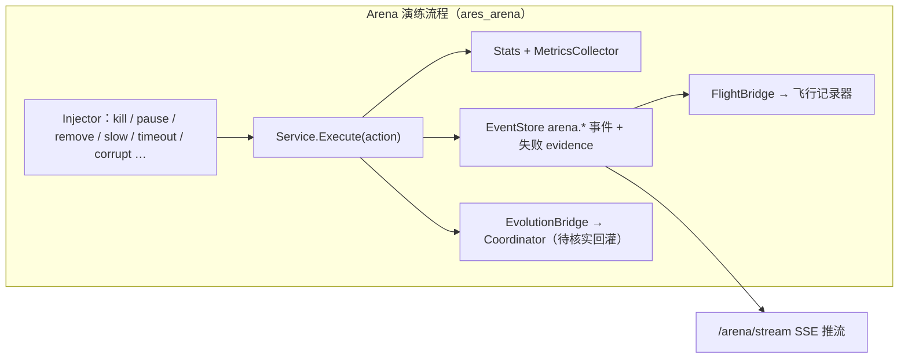

# ares 架构深度解析（九）：Arena / 故障注入 — 故意破坏，然后自己爬起来（0.3.x）

> 别的 Agent 框架给你展示的是 Agent 有多聪明：对话流利、推理能力强、工具用得溜。
> ares 想展示的是另一件事：**你故意破坏它，它能不能自己爬起来。**
> 你可以在 Dashboard 上点一个按钮，杀掉正在工作的 Agent，看它能否自己恢复。
>
> 0.3.x 更新：故障注入与恢复验证分成了两套独立的表面。
> - **`internal/aresrecovery`**：面向新的 Kernel 模型（agentfabric + taskfabric）。core 源码注释里写得很直白：**"Chaos breaks, Recovery fixes."**（Chaos 负责破坏，Recovery 负责修复）。这才是真正被接进生产 serve 路径、并带失效保护(fail-safe)的那套。
> - **`internal/runtime/arena`**：面向旧的"leader / sub agent + DAG"模型，是独立的 `ares arena serve` 混沌演练进程。它的 `Injector` 注释同样直白：**"它不实现恢复，恢复交给已有的 resurrection 插件和 failover。"**

> 先说明本文的边界：下面讲到的每个符号、每条流程都是我在这份代码里实际读到的。凡是"配置了但代码里明确还没做成"或"需要额外接线才能生效"的部分，我会标出（待核实），不替它吹。

---

## 一、为什么要做一个"搞破坏"的功能

你手动 kill 掉一个在跑的 Agent，发现它自己又起来了，还继续干刚才没干完的活——这体验确实很爽。但爽归爽，**你只会傻乐，不能证明系统真的能扛**。

所以要做 ChAOS Engineering：不是手动点一次，而是**系统性、可重复地把故障打进去，然后验证恢复**。这也正是本系列第 7 篇讲的生命周期里，Kernel 模型那个最关键断言的实验台——**"Agent 死亡 ≠ Task 死亡"**。

---

## 二、先分清两套"混沌"

读代码时最容易踩的坑，是这个仓库里**有两套各自独立**的故障注入/恢复逻辑，不能混为一谈：

| 表面 | 位置 | 目标模型 | 生产接线 | 恢复责任 |
|------|------|----------|----------|----------|
| Kernel 混沌 | `internal/aresrecovery` | agentfabric + taskfabric（新） | `cmd/ares` 的 `wireChaos`（live 模式多重门槛，默认 shadow） | `Recovery` 自己实现完整恢复链 |
| Arena 演练 | `internal/runtime/arena` | 旧 leader/sub agent + DAG | 独立进程 `ares arena serve` | `Injector` 明确**不**实现恢复，交给 ares_runtime 的 resurrection/failover |

两者都叫"混沌"，但一个是**被接进生产、带失效保护的恢复验证**，另一个是**独立于生产之外的演练进程**。下文分别讲。

---

## 三、Kernel 混沌：Chaos 破坏，Recovery 修复

`internal/aresrecovery/chaos.go` 顶部注释就是这个模块的纲领：

> "Chaos is the Failure Injection + Recovery Verification harness… it deliberately kills agents to prove the Runtime (Recovery subsystem) can restore their tasks. **Chaos is SEPARATE from Recovery — Chaos breaks, Recovery fixes.**"

拆开看：

- `FailureType` 只有两种：
  - `FailureKill` — 硬杀（crash）：Agent 被立即移除
  - `FailureSuspend` — 软挂起（模拟 hang/卡住，不是崩溃）
- `Chaos.InjectFailure(ctx, agentID, failure)` — 只负责破坏。注释特别强调：**这里不会触发恢复**，恢复要显式调用 `VerifyRecovery`。这样测试才能先断言"注入后任务卡住（stranded）"，再断言"调 VerifyRecovery 后任务恢复"。它记录 `injected[agentID] → FailureType`。
- `Chaos.VerifyRecovery(ctx) int` — 把转发给 `Recovery.RecoverFromAgentDeath`，返回**完整恢复的任务数**。这就是"Recovery Verification"的一半。

`Recovery`（`recovery.go`）负责真正修复，恢复链是：

1. `RequeueExpiredLeases()` → 扫已过期租约，把**只有真正过期的任务**重排队回 READY。代码注释强调：绝不能遍历所有 READY 任务，那样会劫持与本崩溃无关的新任务。
2. `RecoverTaskCheckpoint(taskID, replacementID)` → 找到/生成一个替换 Agent，为它 Acquire 任务，并把保存的检查点安装成新 Agent 的认知状态（从断点续跑）。
3. `RestartAgent(deadAgentID, cognitive, capabilities)` → 用调试预算按固定 ID 原地复活（有 death snapshot 时保留同一身份），否则生成全新 ID。重启预算是**终身累计**的：默认 5 次、退避 1s→30s 封顶（`DefaultRestartPolicy`），预算耗尽返回 `ErrRecoveryExhausted`，防止一个坏 Agent 无限循环。注意：一次复活成功**不会**重置累计次数，只有死亡总数消耗它。
4. `RecoverFromAgentDeath(ctx) int` → 把 1-3 串起来，扫过期租约 → 重排队 → 对每个重排队任务做检查点恢复，返回成功恢复的数量。

> 需要坦率说明的两点：
> - `RecoverTaskCheckpoint` 和 `RecoverFromAgentDeath` 的注释都标注为 **TEST / CHAOS-ONLY**：它们用 `agents.SetCognitiveState` + 自己手动 Acquire，是独立于生产调度路径（`runKernelRecoveryLoop` → `taskfabric.DecodeCheckpoint`）的另一套机制，**不应当被接进生产 serve 路径**。生产恢复走 `cmd/ares` 的 `runKernelRecoveryLoop`。
> - 所以 `Chaos`/`Recovery` 这套，语义重心落在**恢复验证**；真正跑在生产上、被事件驱动的恢复循环是 `cmd/ares/kernel_loop.go` 的 `runKernelRecoveryLoop`。



### 生产接线：wireChaos（shadow / live）

`cmd/ares/serve_chaos.go` 的 `wireChaos` 把 Chaos 接进 serve 路径，默认且最安全的姿态是 **shadow**：

- 默认 `mode=shadow`（或未启用、或 live 但门槛不满足）→ 只跑 `shadowSandboxLoop`：用**独立的 scratch fabric** 周期重放"spawn→create→acquire→kill→lease expire→recover"，**绝不碰生产 Agent**，把验证结果上报 introspect 面板。
- 要切到 `mode=live`，必须**四个门槛同时满足**：`chaos.enabled=true`、`allow_live=true`、`eligible_capabilities` 非空（目标白名单，空列表直接拒绝上膛）、`stop_token` 非空（紧急停靠凭据）。缺一就退回 shadow。
- live 循环 `liveChaosLoop` 有**六重护栏**（注释原话）：紧急停止 `POST /api/chaos/stop`、失效保护闩、GA 静默窗口、令牌桶限速、每 Agent 冷却、能力白名单。每次注入都是 `InjectFailure(FailureKill)` → `runLiveChaosInjection` → `VerifyRecovery`；**如果恢复验证返回 0，立即扳失效保护闩，此后不再注入，直到进程重启**。



---

## 四、Arena 演练进程：`internal/runtime/arena`

这是旧的、独立于生产的混沌演练层，由 `ares arena serve` 启动。它自己起一个 demo Agent 池（`arena-worker-1..3`，type=coder）和一棵可变 DAG，专门用来演示"打进故障 → 看系统反应"。

核心文件（真实路径，与旧文不同）：

| 文件 | 用途 |
|------|------|
| `internal/runtime/arena/types.go` | ActionType（13 种）、Action、Result、Stats |
| `internal/runtime/arena/injector.go` | Injector — 包装 `ares_runtime` + `MutableDAG`，**不实现恢复** |
| `internal/runtime/arena/service.go` | Service — Execute 动作、记录指标、发事件/失败证据 |
| `internal/runtime/arena/scenario.go` | 场景编排：YAML → 串行动作 → 报告 |
| `internal/runtime/arena/survival.go` | 生存模式：按间隔随机注入 |
| `internal/runtime/arena/metrics.go` | MetricsCollector — 每动作类型聚合 |
| `internal/runtime/arena/score.go` | 三维弹性评分 |
| `internal/runtime/arena/http.go` | REST + SSE + API key 认证 |
| `internal/runtime/arena/integration.go` | FlightBridge — arena 动作 → 飞行记录器 |
| `internal/runtime/arena/evolution_bridge.go` | EvolutionBridge → evolution Coordinator（待核实） |
| `cmd/ares/arena.go` | `ares arena` CLI：run / validate / list / serve / survival / inspect |
| `cmd/ares/serve_chaos.go` | 生产 kernel 混沌接线（上一节的 wireChaos） |

> 旧文里的 `internal/arena/…`、`internal/dashboard/static/app.js`、`cmd/arena/main.go` 等路径**在仓库里并不存在**。真实路径是上面这些；arena 没有内置静态前端，前端可视能力由 REST/SSE 端点提供。

### 4.1 注入器：薄薄一层，不实现恢复

`Injector` 依赖两个**接口子集**：`RuntimeProvider`（ares_runtime 的能力子集）和 `DAGProvider`（可变 DAG 的增删能力子集）。基于接口的设计让 arena 不需要引入具体 Runtime/DAG 包，也容易 mock。

```go
// internal/runtime/arena/injector.go
// Injector wraps existing ares_runtime/DAG APIs to inject chaos.
// It does NOT implement recovery; the existing resurrection plugin and
// failover handle that automatically.
type Injector struct {
	ares_runtime RuntimeProvider
	dag          DAGProvider
}

func (in *Injector) KillLeader(ctx context.Context) (string, error) {
	leaderID := ""
	for _, info := range in.runtime.ListAgents() {
		if info.Type == "leader" { leaderID = info.ID; break }
	}
	if leaderID == "" { return "", ErrLeaderNotFound }
	if err := in.runtime.StopAgent(ctx, leaderID); err != nil {
		return "", fmt.Errorf("arena: kill leader %s: %w", leaderID, err)
	}
	return leaderID, nil
}
```

它没有自己实现任何恢复。恢复被**期望**来自 ares_runtime 的 resurrection/failover。`KillLeader` 就是查一个 type=="leader" 的 Agent，然后 `StopAgent` 而已——"新 Leader 由 failover 自动推举"这一步并不在这个进程内实现。

`internal/runtime/arena/e2e_chaos_recovery_test.go` 里有一个真正的端到端验证：它驱动真正的 `runtime.Manager`，注册带重建 factory 的 worker 池，调用 `Manager.NotifyAgentDead(...)` 模拟批量崩溃，然后轮询 factory 调用次数，断言复活异步发生、Manager 仍跟踪着一个存活的池。规模测到 16/64/128。

### 4.2 十三种动作

`types.go` 定义了 13 种 `ActionType`：

`kill_leader` `kill_agent` `remove_node` `remove_edge` `pause_agent` `resume_agent` `slow_agent` `kill_orchestrator` `network_partition` `tool_timeout` `memory_corrupt` `mcp_disconnect` `llm_failure`

`Service.Execute` 用 `switch action.Type` 把动作分发到 `Injector` 对应方法，然后：记录 `Stats`、`MetricsCollector.RecordActionResult`、往 EventStore 发 `arena.*` 事件、失败时往统一 Evidence Store 追加 `kind=failure` 证据、并调用已挂接的 `FlightBridge` / `EvolutionBridge`。

### 4.3 场景编排

`scenario.go` 用 YAML 定义动作序列。真实示例在 `examples/arena/`（`leader_assassination.yaml`、`cascading_storm.yaml`）：

```yaml
name: leader-assassination-and-recovery
config:
  stop_on_error: false
  parallel_actions: false
  warmup: 1s
  cooldown: 1s
actions:
  - delay: 2s
    action: { type: kill_leader }
    label: kill-leader
  - delay: 1s
    action: { type: kill_agent, target_id: agent-1 }
    label: kill-agent-1
  - delay: 3s
    action: { type: network_partition, target_id: agent-2 }
    label: partition-agent-2
  - delay: 1s
    action: { type: slow_agent, target_id: agent-3, metadata: { delay: 10s } }
    label: slow-agent-3
```

`ValidateScenario` 检查名称、至少一个动作、delay 非负、每动作有效性、`max_concurrent`/`timeout` 非负。`RunScenarioReport` 支持 warmup/cooldown、整体 timeout、`stop_on_error`。

> 必须坦率说明：`ScenarioConfig` 里的 `parallel_actions`、`max_concurrent`、以及动作上的 `depends_on`，**代码里明确"配置了但尚未实现"**——`RunScenarioReport` 会打 warn 日志并（待核实后）始终**串行**执行。

### 4.4 生存模式

`survival.go` 的 `Service.RunSurvival` 按配置间隔（默认 30min、每 10s）随机从 13 种动作里挑一个、随机选目标（list 出来的 Agent 或 DAG 节点/边）打进去，记录 `Timeline`。`SurvivalReport` 里没有内置分数样本——旧文那些 `Score: 100.0 (A+)` / `97.3` 之类的实时输出是我在旧文里看到但没有在代码里找到的，这里不放。

---

## 五、三维弹性评分

`score.go` 的 `ResilienceScore` 是加权三维评分，`gradeFromScore` 用固定阈值映射等级。



关于一致性维度的**诚实说明**：`metrics.go` 里 `MetricsSnapshot.DataConsistencyRate` 默认是 0，因为 `RecordConsistency` 已标记 **Deprecated**（`RecordActionResult` 才是现行入口），实际没有源源不断喂数据进来。所以代码路径 `calcConsistency`：
- 有 `metrics.DataConsistencyRate > 0` 就用它；
- 否则走**启发式**：把失败数的一半当作"与数据有关"（`dataRelated = max(1, failed/2)`），每单位扣 5 分。

也就是说，第三维"一致性"——除非有人把真实的一致性指标接进 Metrics——默认是一套明说的**估算**，不是实测值。恢复速度阈值（≤1s=100，≥10s=0）也只是这套评分自己的标尺，别当成实测 SLA。

---

## 六、HTTP 与认证

`http.go` 的 `Handler` 注册了约 27 个路由：`/arena/leader/kill`、`/arena/agent/{id}/kill|pause|resume|slow|partition|tool-timeout|memory-corrupt|mcp-disconnect|llm-failure`、`/arena/node/{id}/remove`、`/arena/edge/remove`、`/arena/orchestrator/kill`，以及 `stats/history/stream`（SSE）/`score/metrics`、survival 三件套、flight timeline/diagnostics、scenario run/validate。

arena 暴露的都是破坏性端点（杀 leader、删节点、内存破坏），所以认证默认是 **deny**：
- 设了 API key（`--api-key` 或 `ARENA_API_KEY`），则所有请求必须带 `X-API-Key` 头（常量时间比较）。
- 没设 key 且没显式 `--allow-anonymous`，`APIKeyAuthMiddleware` 一律 401——旧文里"打开 Dashboard 点按钮"那种无需鉴权的用法，在真实代码里默认是被拒绝的。`--allow-anonymous` 只能用于本地开发，且注释警告绝不能用于可被网络到达的部署。

---

## 七、飞行记录器与进化桥接

**FlightBridge**（`integration.go`）把每个 arena 动作写成飞行记录器的 timeline 事件，失败动作再补一条 diagnostic 记录（并调用 `flight.SuggestFix`）。这是确定有效的接线：`service.Execute` 在每个动作后调用 `s.bridge.OnActionExecuted`。

**EvolutionBridge**（`evolution_bridge.go`）把 arena 的失败动作翻译成给 evolution Coordinator 的 `PatchProposal`：`ActionRemoveNode → PatchInsertNode`、`ActionKillAgent/KillLeader → PatchReplaceNode`、`ActionSlowAgent/ToolTimeout → PatchChangeScheduler`、基础设施类故障 → `PatchChangeRecoveryStrategy` 等，并按 `chaosPriority` 分级：**priority ≥ 9** 的故障（杀 leader/orchestrator）走 `Coordinator.ApplyEmergency` 立即自愈，其余走 `Coordinator.Submit` 评估。

> （待核实）：`OnActionExecuted` 在失败时确实会构造 proposal 并提交/紧急应用。但 "chaos→Coordinator"，以及"Coordinator 评估的这个 proposal 最终是否会产生真实的运行时/调度变更"，取决于 Coordinator 及其 patch 应用器的接线与行为。在 `arena serve` 这个**独立演练进程**里，它操作的是进程自己的 demo Agent 池与 MutableDAG；这些 patch 是否回灌到真实的生产运行时，我没有在这篇文章覆盖的代码里确认到，存疑，特此标注。

值得一并提的是 `cmd/ares/peer_mode.go` 里那条确定生效的**执行反馈回路**（`aresrecovery`，面向 Kernel 模型）：
- `ExecutionAttribution.Record/RecordWithMetrics(agentID, capability, success, latency, retries, recovers)` 采集每个 (agent, capability) 的结果。
- `DeterministicScorer` 是**零 LLM** 的确定性评分：权重 `success 0.70 / latency 0.15 / retries 0.10 / recovers 0.05`，输出恒在 [0,1]，无历史返回中性先验 0.5。它是 GA fitness 的确定性信号，不依赖随机源/LLM。
- `EvolutionFeedbackAdapter.Apply` 把 Attribution 快照推回 `ConfidenceInjector.SetAgentConfidence / SetCapabilityConfidence`，下一次调度就会看到新置信度——失败多的 Agent 被降权，成功多的被偏好。
- 变化归因 `ChangeAttributor.Attribute` 用相邻两代 `GenerationSnapshot.BestScore` 的 delta 分配每处变更的影响：有显式 Impact 的用显式值，其余按剩余 delta 均分。

另外 `chaos.go` 里的 `EvolutionAdapter`（`AdaptPopulation(spawn, retire)`）是"运行期自适应"表面：进化决定 population 增减，Kernel 通过现有 spawn/retire 原语执行（"Agent decides; Kernel enforces"）。它的 `tasks` 字段注释说 **当前有意未使用**——调度策略的切换要等未来迭代接到 `taskfabric.Schedule`。所以：population 适配实现了，调度策略适配是"声明了但还没接"。



---

## 八、CLI 命令速查

| 命令 | 说明 |
|------|------|
| `ares arena run <scenario.yaml>` | 对远程/本地 arena 服务器运行场景并打印报告 |
| `ares arena validate <scenario.yaml>` | 本地校核场景（或 `--remote` 走网络） |
| `ares arena list [dir]` | 列出目录里的场景文件 |
| `ares arena serve [--addr] [--api-key]` | 启动 arena 演练服务器（默认 deny 认证） |
| `ares arena survival [--addr] [--duration] [--interval]` | 启动生存模式并按秒轮询状态 |
| `ares arena inspect [--addr] [--timeline] [--diagnostics]` | 读取评分/指标/时间线/诊断报告 |

---

## 九、结语

把这套东西讲透之后，我希望你能记住的不是某个分数，而是两条**写进注释的边界**：

1. 在 `internal/aresrecovery`：**"Chaos breaks, Recovery fixes."** 破坏和修复是两个独立职责，中间靠一个显式的 `VerifyRecovery()` 验证把两半焊起来。生产里 live 混沌被六重护栏锁得死死的，默认姿态是连生产 Agent 都不碰的 shadow sandbox。
2. 在 `internal/runtime/arena`：**"It does NOT implement recovery."** 它只负责把故障打进去，恢复是 ares_runtime 里既有机制的事，独立于生产之外当演练场。

我没有在这个仓库里看到旧文那种"Score 100.0 (A+)"、"1.4 秒内复活"、"97.3% 恢复率"的数字证据，所以上面一个都没写；一致性维度默认是启发式，`parallel_actions`/`depends_on` 尚未真正实现，`EvolutionBridge` 的回灌效果也标注待核实。

> 把"故意破坏，然后自己爬起来"做成可重复、可验证、并且默认不碰生产的过程，这才是这件事真正难的部分。