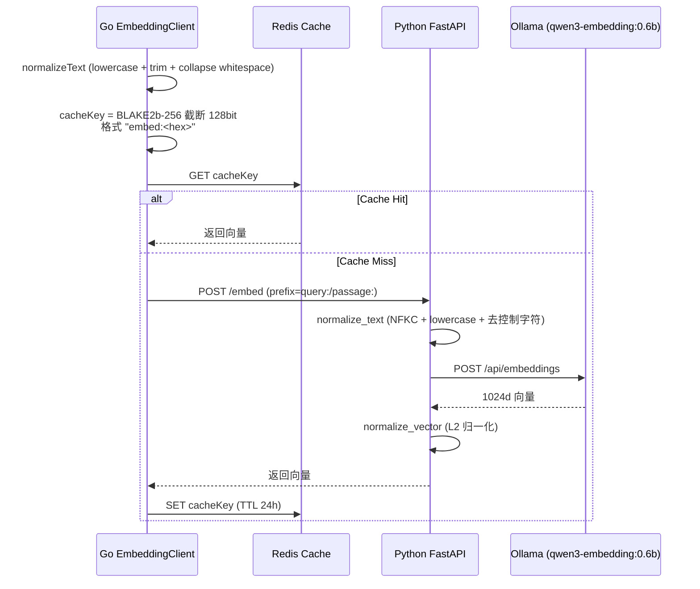
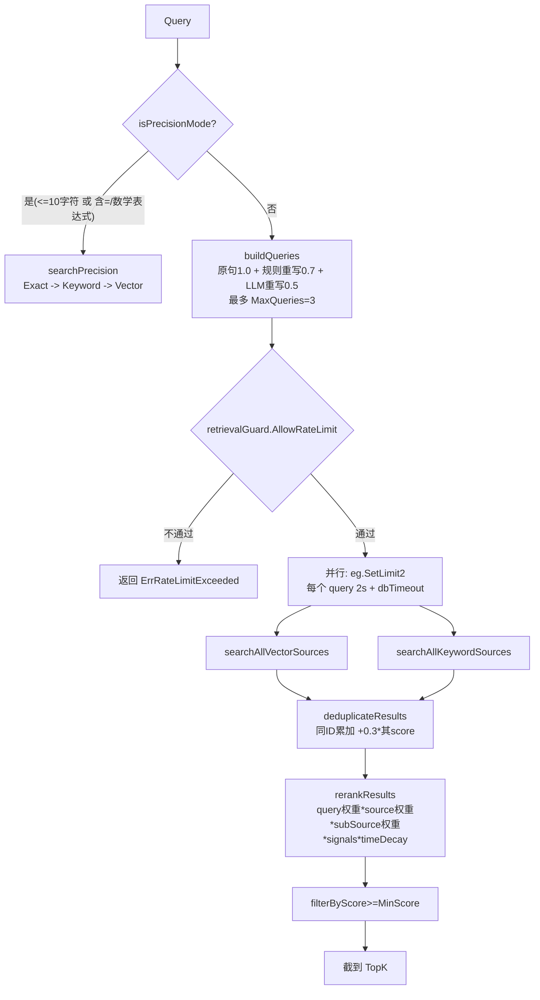
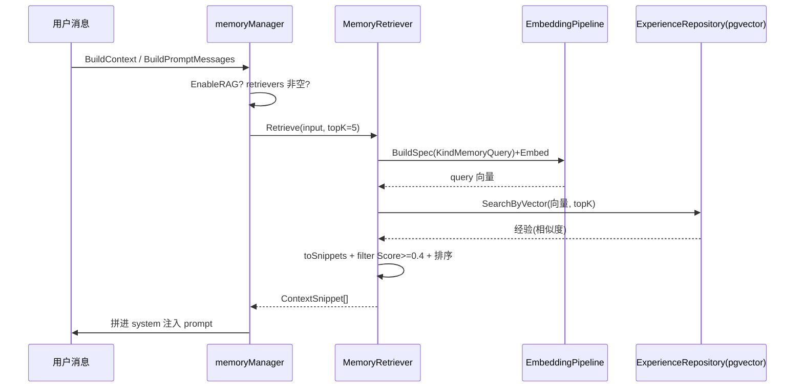

# ares 架构深度解析（十）：检索系统——向量 / 关键词 / FTS 的实战与诚实边界（0.3.x）

> Agent 说："根据您过去的经验，我建议……"——但建议的东西根本不相关。
> 比这更惨的是：Agent 明明之前解决过一模一样的问题，这次又从头开始想方案。
> 我当时就在想：Agent 的记忆不是"有没有"的问题，是"能不能找到对的"的问题。
> 一个没有检索能力的 Agent，就是一个金鱼——7 秒记忆，永远在发明轮子。

> 说明：本文基于实际代码（重点阅读 `internal/storage/postgres/services` 整条检索管线、`internal/storage/postgres/repositories` 的向量/关键词仓库层、`internal/runtime/memory/context/memory_retriever.go` 的 RAG 召回、`internal/runtime/memory/experience/ranking_service.go` 的经验排序，以及 `internal/runtime/protocol/skills` 的 FTS5/关键词检索）。每个符号、每条流程都是我在这份代码里实际读到的。凡是"配置了但实际没接线"或"我拿不准"的部分，我会标（待核实），不替它吹。

---

## 一、先说为什么检索决定 Agent 的智商

写 Agent 有个很残酷的事实：**模型再强，喂的上下文不对就是废物。**

模型再能打，如果我喂进去的是错误的文档、不相关的经验、过时的知识……那输出就是看起来很有道理但实际上是胡说八道的东西。这比直接说"我不知道"更坑——因为用户会相信。

检索的目的很朴素：在正确的时间、从正确的地方、用正确的权重，把真正有用的上下文捞出来喂给 LLM。难题在于，**"相关的"该怎么定义、怎么排序**——是语义相关、字面相关，还是"过去验证过能解决这个问题"？不同数据，答案不同。ares 的做法不是一个向量库一把梭，而是**按数据类型分流，各自用擅长的检索方式**。本文就讲清楚：代码里到底跑了哪些检索，没跑哪些。

---

## 二、先揭个榜：运行时到底跑哪条检索路径？（诚实更正）

老一版这篇文章说"`RetrievalService` 那个混合搜索引擎写好了但一直没接线（`advancedRetrieval` 在 API 层恒为 nil），现在用的只是一个纯向量的 `SimpleRetrievalService`"。我这次实际翻代码，**这个说法是反的**，这里必须更正：

- **代码里根本没有 `api/retrieval/service.go` 这个文件**。整个 `api/` 下只有 `api/embedding`、`api/experience`、`api/knowledge`、`api/discovery` 等，**没有 retrieval 包**。两条检索服务都住在 `internal/storage/postgres/services/` 下。
- **真正被接进生产的是 `RetrievalService`，不是 `SimpleRetrievalService`**。`internal/runtime/memory/production_manager.go` 里 `services.NewRetrievalService(...)` 显式构造了它，并由 `internal/runtime/memory/production_manager_tasks.go` 的 `ProductionMemoryManager.SearchSimilarTasks(ctx, query, limit)` 在实际运行时调用 `retrievalService.Search(...)`。
- **`SimpleRetrievalService` 反而是"写了但没有任何非测试代码调用"的那一个**。全仓 grep `NewSimpleRetrievalService` 只有它自己那个文件在定义，没有调用方（待核实：没有搜索到生产接线）。
- 此外还有一条独立、也确实接线了的 **RAG 向量召回路径**：`internal/ares_bootstrap/retriever_wiring.go` 的 `wireRetrievers` 把 `MemoryRetriever`（对蒸馏经验做向量检索）和 `KnowledgeRetriever`（对 AKG 知识做混合检索）注入 MemoryManager，`EnableRAG=true` 时通过 `manager_rag.go` 的 `runRetrieval` 触发。

所以，**运行时向量检索是真实存在的**。三条真实路径：

| 路径 | 入口 | 数据 | 方式 | 运行时接线 |
|------|------|------|------|----------|
| 混合检索 | `RetrievalService.Search`（经 `SearchSimilarTasks`） | 主要 experiences | 向量 + 关键词 混合 + 评分 | ✅ 已接 |
| RAG 经验召回 | `MemoryRetriever.Retrieve`（经 `runRetrieval`） | 蒸馏 experiences | 向量 + minScore 过滤 | ✅ 已接 |
| RAG 知识召回 | `adapter.KnowledgeRetriever`（AKG） | AKG 蒸馏事实 | 混合检索 | ✅ 已接 |
| 纯向量 | `SimpleRetrievalService.Search` | knowledge | 纯向量 + 精确模式 | ❌ 无调用方 |

> 注意 `SearchSimilarTasks` 实际只打开了 experience：`SearchExperience=true, SearchKnowledge=false, SearchTools=false`，production 里 `toolRepo` 传的也是 nil。也就是说跑起来的那条混合检索，**scope 基本收敛在 experience 上**（向量 + ILIKE 关键词）。

---

## 三、Embedding 管线：文本 → 1024 维向量

不管哪条检索，第一步都是先把文本变成向量。ares 是 Go（`internal/storage/postgres/embedding`）→ Python FastAPI（`services/embedding/app.py`）→ Ollama（`qwen3-embedding:0.6b`）三层。

模型与维度（`services/embedding/app.py`）：
- `OLLAMA_MODEL = "qwen3-embedding:0.6b"`（可用环境变量覆盖）
- `EMBEDDING_DIM = 1024`
- `MAX_LENGTH = 512`（超出前缀后直接截断）
- `CACHE_TTL = 86400`（24 小时）



关键点都是真的：

**1. 双层文本标准化。** Go 端 `EmbeddingClient.normalizeText` 做 lower + trim + 把连续空白收成一个空格；Python 端 `normalize_text` 先做 `unicodedata.normalize('NFKC')`，再做 lowercase、strip、`re.sub(r'\s+',' ')`、去控制字符。为什么两层？因为 Go 的 `strings.ToLower` 和 Python 的 `str.lower()` 在部分 Unicode 字符上行为不同，双层兜底减少 cache miss 爆炸（`client.go` 注释原话："avoid cache miss explosion"）。

**2. Cache key。** Go 端 `getCacheKey` 用 `blake2b.Sum256`（截断到前 16 字节 = 128bit），前缀 `embed:`，key 由 `normalizedText|model|prefix` 拼出。注意：不是"BLAKE2b-128"这个哈希算法，而是 **BLAKE2b-256 取前 16 字节**。Python 端不共享这个 key 算法（它用 `sha256`），所以 Go/Python 两侧缓存是各自的。

**3. 前缀（prefix）。** 检索 query 用 `query:` 前缀，文档/经验存储侧用 `passage:` 前缀（`client.go` `Embed` 默认 `query:`；`EmbedWithPrefix` 显式传）。这是 e5 系模型的惯用做法，让 query 和 passage 落在不同区段、同向匹配。（待核实：`Experiences 1024` 表写入时具体用哪个前缀由蒸馏链路决定，我未逐行追到 App 侧透传。）

**4. L2 归一化。** Python 端 `normalize_vector` 用 `np.linalg.norm` 归一为单位向量——注释点明"Ollama 不保证返回单位向量"，归一化让后面的余弦距离（`cosine_distance`）有意义。

**5. 缓存是 Redis 为主。** `EmbeddingClient.redis` 可空（nil 则跳过缓存直接调服务）。另有 `EmbeddingCache`/`MemoryCache`（`cache.go`）做进程内内存兜底 + 定时清理 goroutine，但**生产接线用的是 `NewEmbeddingClient` 直连 Redis 那套**（待核实：`EmbeddingCache` 是否在某个 boot 里被挂上，我未在 production_manager 看到注入）。

---

## 四、向量检索（真实跑起来的那条）：pgvector + IVFFlat 余弦

向量检索不是"搜一个独立向量库"，而是 **pgvector 插件 + 同一 PostgreSQL 里的表**。两千维度以下直接 `<=>` 余弦距离算子。

表（`migrate_storage.go`）：
- `knowledge_chunks_1024` — 知识分块
- `experiences_1024` — 蒸馏经验（`embedding` 列**可空**，异步 worker 回填）

索引是 IVFFlat（`vector_cosine_ops`）：`idx_knowledge_1024_embedding`、`idx_experiences_1024_embedding`。这是近似索引，靠 `lists` 分桶 + 余弦。

真正的查询（`repositories/experience_repository.go` `SearchByVector`）：

```sql
SELECT id, tenant_id, type, input, output,
       1 - (embedding <=> $1::vector) as similarity
FROM experiences_1024
WHERE tenant_id = $2
  AND (decay_at IS NULL OR decay_at > NOW())
  AND embedding IS NOT NULL
ORDER BY embedding <=> $1::vector
LIMIT $3
```

- `embedding <=> $1::vector` 是**余弦距离**，取值范围 [0,2]；`1 - 距离` 转成 **similarity ∈ [-1,1]**（代码注释原话）。默认 `Score` 只是这个相似度的透传。
- 显式 `embedding IS NOT NULL`：因为列可空、IVFFlat 不索引 NULL，这里把没回填向量的行挡在扫描外。
- `decay_at` 过期行不进结果。
- **RAG 里每条的 `Score` 来自蒸馏 confidence**（`MemoryRetriever.toSnippets`：`scoreutil.ClampUnit(exp.Confidence)` 夹到 [0,1]），不是上面 SQL 的 similarity——注意这是两条不同的分数语义。

`knowledge_repository.go` 的 `SearchByVector` 同样用 `1 - (embedding <=> $1::vector)`，只查 `embedding_status='completed'` 的行。

---

## 五、关键词检索：PostgreSQL FTS，不是 BM25

老文把关键词那边夸成 "BM25"。**实际上代码里没有 BM25**：知识侧的关键词搜索是 PostgreSQL 全文检索 `ts_rank + plainto_tsquery('simple', ...)`（`knowledge_repository.go` `SearchByKeyword`），靠 `tsvector_update_knowledge_1024` 触发器维护的 `tsv` 列：

```sql
SELECT ..., ts_rank(tsv, plainto_tsquery('simple', $1)) as score
FROM knowledge_chunks_1024
WHERE tsv @@ plainto_tsquery('simple', $1)
  AND tenant_id = $2 AND embedding_status = 'completed'
ORDER BY ts_rank(...) DESC
LIMIT $3
```

经验侧更朴素——`experiences_1024` 的 `SearchByKeyword` 直接用 **ILIKE 子串匹配**（含转义），按 `score DESC, created_at DESC` 排。所以经验的关键词检索其实是"子串命中 + 按既有 score 排序"，谈不上 BM25。

> 结论：**关键词这条 = PostgreSQL FTS（知识）+ ILIKE 子串（经验）**。文中凡写 BM25 的地方，都是历史注释里的旧话，不是当前实现。我后面一律表述为"关键词 / 全文检索"。

---

## 六、混合检索 `RetrievalService`：真实被接进生产那条

入口 `RetrievalService.Search(ctx, *SearchRequest) -> []*SearchResult`，整体流程：



### 6.1 Query 重写（buildQueries）
`buildQueries` 生成加权查询组（`retrieval_rewrite.go`）：
- 原句权重 `OriginalWeight=1.0`
- 规则重写（同义词映射）权重 `RuleRewriteWeight=0.7`
- LLM 重写权重 `LLMRewriteWeight=0.5`
- 总数被 `MaxQueries=3` 截断

触发重写有门槛（`shouldRewriteQuery`）：`len(query)<10` 直接跳过；要命中复杂语义模式（"如何/怎么/什么/why/what/how/explain/描述"等）才重写；`queryCache`（TTL 10min、上限 500）命中也跳过。

LLM 重写（`llmBasedRewrite`，llmClient 可为 nil/不可用则跳过）：
- 30s 超时；`parseLLMResponse` 按行解析，**最多取前 3 行**
- `validateRewrites` 用 `calculateSimilarity`（实际上是一个 **Jaccard 词重叠**）过滤相似度 < **0.6** 的重写、剔除长度超过原句 **2x**、空串
- `uniqueRewrites` 去重后 `maxLLMRewrites=2` 截断

规则重写（`ruleBasedRewrite`）：走 `loadSynonymRules` 读 `configs/synonyms.yaml`（环境变量 `SYNONYM_CONFIG_PATH` 可指向，内置默认规则兜底），`replaceCaseInsensitive` 把命中同义词 key 的片段替换成扩展。

### 6.2 精确模式（isPrecisionMode）
触发条件（`retrieval_service.go`）：
- `utf8.RuneCountInString(query) <= 10`（Rune 数，Unicode 安全）
- 含 `=` 或 `:`，或 `\d+\s*[+*/]\s*\d+` 这类**数字夹数学运算符**的表达式（`-` 故意排除，避免误伤 `go-agent` 这类连字符；`+*/` 要求两侧贴数字，避免 `C++`、`*args` 误伤）

精确模式下走 `searchPrecision` 的严格顺序：**Exact（`SearchBySubstring`，命中给固定分 1.0）→ Keyword（FTS）→ Vector（兜底）**——不是老文说的"精确匹配 → 关键词 → 向量有兜底"之外再多花哨。

### 6.3 并行与超时（searchSingleQuery）
每个加权 query 用 `errgroup.SetLimit(2)`（向量 + 关键词并行），外层 `context.WithTimeout(ctx, 2s)`，再用 `retrievalGuard.WithDBTimeout` 套上层级。向量分支先查 `embeddingClient.IsEnabled()` 和 embedding 熔断器，熔断打开就降级为只跑关键词。

### 6.4 合并与再排序（mergeAndRerank → rerankResults）
`rerankResults` 是唯一评分入口，公式是**乘法**：

```
Score = baseScore · QueryWeight · [SourceWeight，多源才生效] · SubSourceWeight · Signals · TimeDecay
```

- **QueryWeight**：原句 1.0 / 规则 0.7 / LLM 0.5
- **SourceWeight**（`sourceWeight`）：knowledge 0.4 / experience 0.3 / tool 0.2 / task_result 0.1；**只有启用多源（`activeSources>1`）时才乘**，单源直接跳过
- **SubSourceWeight**（`subSourceWeight`）：vector 1.0 / keyword 0.8
- **Signals**（`applySourceSignals`，经验侧重）：success=1.2、失败=0.7、execTime<1s=1.2、execTime>5s=0.8、reuse_count>3=1.1、有 lessons=1.05；工具侧 requires_auth=0.9、successRate>0.8=1.1、successRate<0.5=0.8
- **TimeDecay**（`calculateTimeDecay`）：`e^(−0.01 × ageHours)`，下限 **0.1**（还给"古董"内容一线生机）

去重 `deduplicateResults`：按 `ID` 合并，重复命中时 `existing.Score += result.Score * 0.3`——这是"多路由命中信号"，同一内容被多次 query/多路搜索命中就加分。

> 例外：`SearchSimilarTasks` 把 plan 设成 experience-only。此时 `ExperienceRankingEnabled` 走 `applyExperienceRanking`（经验重排，见下节），而**非经验重排的 rerank 路径用于通用全源搜索**。

---

## 七、经验召回与排序：RankingService 与 MemoryRetriever

这节的"找相关记忆"，代码里有两条：

### 7.1 RankingService（`internal/runtime/memory/experience/ranking_service.go`）
`Rank` 输入一批 `*Experience` + 对应的 `baseScores`（语义分），输出按 FinalScore 降序：

```
FinalScore = SemanticScore + UsageBoost + RecencyBoost + exp.Score
```

注意它是**加法**，不是检索服务里那套乘法：
- `SemanticScore` = 向量搜索给的 similarity（缺失默认 0.5）
- `UsageBoost = min(log1p(UsageCount) × 0.05, 0.2)`
- `RecencyBoost = exp(−ageDays/30) × 0.05`（30 天半衰期）
- `exp.Score` = 持久化的强化信号（bandit 反馈，`RecordFailure` 等写入）

配置权重：`UsageWeight=0.05`、`RecencyWeight=0.05`、`RecencyDays=30`（`DefaultRankingWeights`，可 `Configure`。）

在 `RetrievalService.Search` 里 `applyExperienceRanking`（`retrieval_search.go`）调 `rankingService.Rank`，再用 `conflictResolver.Resolve` 处理冲突组，最后会把 `FinalScore` 写回 `exp.Score` 透传到结果——代码注释专门点出：如果不写回，重排会按接近 0 的 raw score 乱序、`MinScore>0` 时经验结果会被过滤掉，排名的意义上不了线。

### 7.2 MemoryRetriever（RAG，`internal/runtime/memory/context/memory_retriever.go`）
这是给 LLM 增强上下文用的那条：`Retrieve(input, topK)`：
1. 空输入短路返回空
2. `topK<=0` → `DefaultTopK=5`
3. embed query（用 `EmbeddingPipeline`，`KindMemoryQuery`）
4. `expRepo.SearchByVector`（经验仓库的 pgvector）
5. `toSnippets` 组装 `ContextSnippet`，`Score = ClampUnit(exp.Confidence)`
6. `filterByMinScore`：**`Score >= minScore` 才留**，`minScore<=0` → `DefaultMinScore=0.4`
7. `SortSnippetsByScore` 降序后截 topK

嵌入失败**不静默降级**关键词（代码注释原话：`does not silently fall back to keyword search`），直接返回错误。这是与 `RetrievalService`（熔断降级关键词）截然不同的取舍。

`manager_rag.go` 的 `retrieveContextString`/`retrieveForPrompt` → `runRetrieval`（读 `EnableRAG`、`RAGTopK`、`RAGMinScore`，唤醒 retrievers）→ `memctx.RunRetrieval`（统一应用 DefaultTopK/DefaultMinScore 归一）。检索结果是 best-effort：失败仅 `log.Warn`，不打断主循环。



---

## 八、Skills 检索：Discovery 关键词 + FTS5（另一条"找东西"的链）

检索不只有向量。技能/能力目录的发现是纯文本侧的（详见本系列 28 篇的 Capability Fabric），这里只对齐两条真实检索原语（`internal/runtime/protocol/skills`）：

**1. 关键词打分（`discovery.go` `keywordSearch` + `matchScore`）**
- `splitTerms` 小写 + 空白切分 + 去标点 + 去重
- `matchScore` 数 query 里有多少个 term 命中条目的 ID/Name/Keywords/Capabilities/Description，命中即 +1
- 排序：score 降序，同分按 ID 升序保证确定性
- 只返回 score>0 的；`limit<=0` 返回全部

**2. FTS5（`fts5.go` + `discovery.go` `SetFTS5`）**
- `FTS5Index` 是**内存 SQLite FTS5**（`sql.Open("sqlite", ":memory:")`，modernc 驱动），建 `skills_fts` 虚表覆盖 id/name/description/keywords
- `Search(query, limit)` 走 `WHERE skills_fts MATCH ? ORDER BY rank LIMIT ?`
- `Discovery.Search` 有 FTS5 且 query 非空时先走 FTS5；**FTS5 出错或没命中就回退到 `keywordSearch`**（`types.go` 注释：FTS5 只是 augment，不是 replace）

**3. 经验先验 `Experience.BestMatch`（`experience.go`）**
`Experience` 记忆 `{skill, task_pattern, success_rate}` 先验（Learning 源，只偏置排序、**永不自动执行**）。`BestMatch(taskPattern)` 返回 success_rate 最高的匹配：
- 短 pattern（<4 token，如兜底的 `agent_top`）走**子串包含**，命中得分 1.0
- 长 pattern 按**token 重叠比例**打分，低于 `matchScoreThreshold=0.5` 不算匹配（防止两个长描述只因一个共词就误配）
- `maxPatternLength=256`（rune）截断 pattern 防 `experience.json` 膨胀

`ExperienceConfidenceSource` 把这套先验桥接成 `taskfabric.ConfidenceSource` 喂给 Kernel Scheduler（28 篇详述）。

---

## 九、门控与降级

`RetrievalGuard`（`internal/storage/postgres/retrieval_guard.go`）给检索套了三层保护，`production_manager.go` 用 `NewRetrievalGuard(100, 5, 30s, 30s)` 构造：

| 保护 | 实现 | 行为 |
|------|------|------|
| 速率限制 | `golang.org/x/time/rate`，`100 req/s` | `AllowRateLimit` 超限返回 `ErrRateLimitExceeded` |
| 熔断 | `CircuitBreaker`，失败阈值 5、open 30s 半开 | 专门盯着 embedding，`CheckEmbeddingCircuitBreaker`；熔断打开则检索降级为只跑关键词 |
| DB 超时 | `WithDBTimeout`（30s） | 查询超过 30s 直接放弃 |

Embedding 侧还有一个 `FallbackClient`（`embedding/fallback.go`）提供三种 `FallbackStrategy`：`FallbackToCache` / `FallbackToKeyword`（返回 `ErrEmbeddingFailed` 触发关键词）/ `FallbackToError`。（待核实：`FallbackClient` 是否被某个生产路径真正挂上；production 检索走的是 `NewEmbeddingClient` + `EmbeddingPipeline`，我没看到 fallback 注入，倾向认为默认直连 + 主文档失败即报错。）

---

## 十、诚实盘点：删了什么、还剩什么

对照老文，这批更正在三条线上：

1. **"高级检索没接线、纯向量在跑"是错的**：真相是 `RetrievalService` 已通过 `SearchSimilarTasks` 接入（scope 收敛 experience），`SimpleRetrievalService` 无调用方。
2. **没有 `api/retrieval/service.go`**：两条服务都在 `internal/storage/postgres/services/`。
3. **关键词那套不是 BM25**：知识侧是 PostgreSQL `ts_rank` 全文检索，经验侧是 ILIKE 子串。

旧的"四数据域分流（Knowledge/Experience/Tools/TaskResults 各 0.4/0.3/0.2/0.1）+ 纯向量数据库对比 + 1024 维余弦 0.7-0.8 举例 + recall@k / similarity 阈值"这些——**除了数值真的有出处、被我保留的**（sourceWeight 0.4/0.3/0.2/0.1、minScore 0.4、TopK 5/10、Jaccard 0.6、timeDecay 0.01/0.1 等）——其余**没有对应代码出处，一律删掉**。特别是：**没有任何 `recall@k` / 归一化 embedding 相似度阈值（0.7~0.8）这种实证指标**在代码里，所以我不给纯向量召回率、不编"每天衰减到 78%/7 天 18%"这种由假设推出来的数（真实的是 `e^{-0.01·ageHours}`，下限 0.1）。

**运行时向量检索存在吗？存在。** 不是"只用关键词"，而是 `RetrievalService`（混合）、`MemoryRetriever`（RAG）两条真实、已接线的 pgvector 向量路径 + 知识 AKG 混合检索，都在跑。

唯一留的"未接线"是 `SimpleRetrievalService`（无调用方）和 `FallbackClient`（待核实是否挂载）。

---

## 十一、总结

ares 的检索系统用一句话概括：**一条真实的混合检索管线（向量 + FTS + 关键词）直接跑在生产里，外加一条独立的 RAG 向量召回给 LLM 喂经验，技能目录走关键词 + SQLite FTS5；纯向量服务反而躺盒子里。**

关键设计点（全部有实码出处）：

1. **Embedding 管线** —— Go→Python→Ollama 三层，`qwen3-embedding:0.6b`、1024 维、L2 归一化；Go 侧 BLAKE2b-256 截 128bit 缓存 key，Redis 24h TTL
2. **向量检索** —— pgvector `<=>` 余弦 + IVFFlat 索引，`1-距离` 得 similarity ∈ [-1,1]，表 `knowledge_chunks_1024` / `experiences_1024`
3. **关键词检索** —— 实际是 PostgreSQL `ts_rank`（知识）+ ILIKE 子串（经验），不是 BM25
4. **混合检索** —— `RetrievalService.Search`，Query/源/子源权重 × 信号 × 时间衰减（`e^{-0.01h}`，下限 0.1），多路由去重 +0.3，精确模式（≤10 rune / 含 `=` 或数字夹运算符）
5. **经验排序** —— `RankingService` 加法公式 `Semantic + min(log1p·0.05,0.2) + e^{-days/30}·0.05 + rawScore`，ConflictResolver 合并冲突组
6. **RAG 召回** —— `MemoryRetriever`，`DefaultTopK=5`、`DefaultMinScore=0.4`，嵌入失败不降级
7. **门控** —— RateLimiter 100/s + 熔断 + 30s DB 超时

Agent 的智商 ≈ 喂给它的上下文质量。而 ares 的前提很朴素：先把检索跑起来、跑对，再说效果。

---

> 信息不是力量，检索才是。——这句话现在有真实的代码在后面撑着。

**下一篇预告：** 暂时没有明确下一篇（本系列已按模块铺开，28 篇已覆盖 Skills/FTS5 细节）。如果你有特别想深入的模块，随时告诉我。