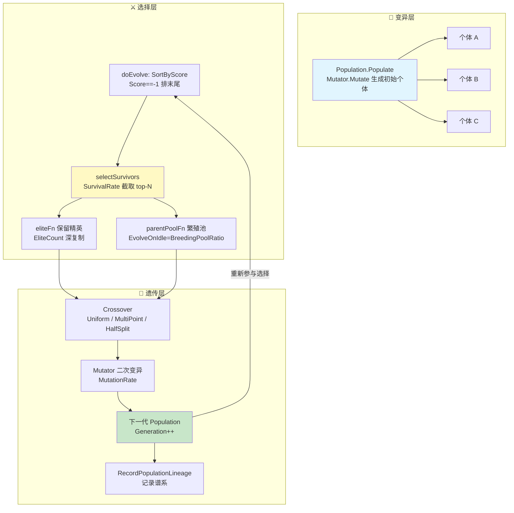
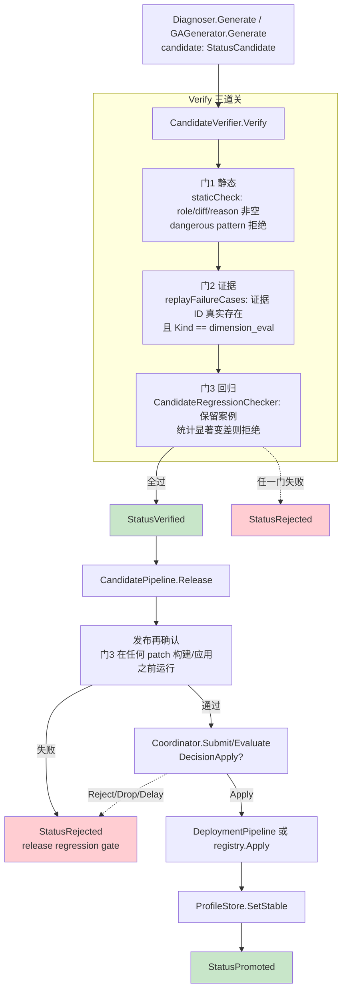
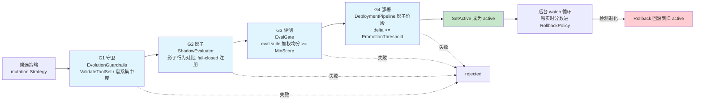
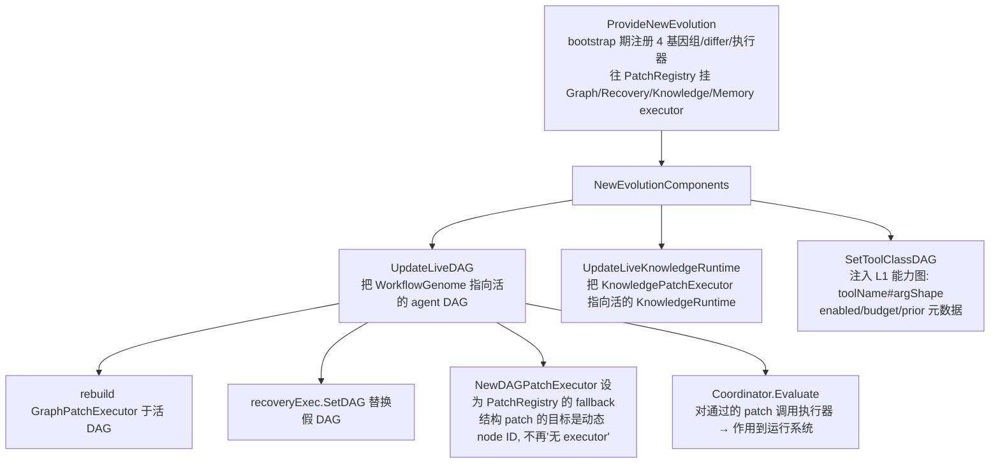

# ares 架构深度解析（十一）：自主进化 — 当 Agent 学会自己变强（0.3.x）

> 0.3.x 的真实局面要先说清楚：**两套进化引擎并存，且分工与直觉相反。**
> 真正接在生产 bootstrap 里的是 v1 —— `internal/runtime/ares_evolution` 的 **StrategyLifecycle**（G1 守卫 → G2 影子 → G3 评测 → G4 部署），进化出的策略都过它这道闸。
> v2 —— `internal/runtime/evolution` 的 **Candidate → Verify → Promote** 候选发布闭环，是这套被反复讲的新管线，它作为库和示例（`examples/`）完全可跑，但**目前没有任何生产调用方**，是"代码完备、等待接线"。
> GA（种群遗传算法）降为可选的零 token / 参数微调路径，但它的 `Crossover` / `Fitness` 已经从 v2 的 `Genome` 核心接口里删掉了（没有生产调用方）。

> 你是不是也这么想过：Agent 为什么不能越用越聪明？
> 它每次犯错还是犯同样的错，每次解决完一个坑，下次又从零开始。
> 如果人能从错误里学习，Agent 凭什么不行？
> 以及——更关键的一句：**"能生成一个更好的策略"和"敢把这个策略上线"是两件完全不同的事。**
> 本文讲的就是 ares 在这两件事上分别做到了哪一步、哪些还只是代码。

> 说明：本文基于实际代码（重点阅读 `internal/runtime/evolution/`（v2 候选/门禁/GA 谱系）、`internal/runtime/ares_evolution/`（v1 生命周期/适应度/守卫/评测门）、`internal/runtime/evolution/genome/` 与 `genome/`（GA 与 DAG 基因组）、`internal/ares_bootstrap/provide_new_evolution.go`（L1 接线）、`internal/runtime/evolution/coordinator/` 与 `deployment/`、`internal/runtime/evolution/patch/`）。每个符号、每根走向我都在这份代码里实际读到过。凡是"只有注释/文档声称、代码没提供""仅是示例跑分""配置了但没接线"的，我标（待核实）或直接删掉，不替它吹。

***

## 一、先认清现状：v1 与 v2 是并存的

这篇文章的标题是"自主进化"，但 ares 里其实有**两套**进化系统，谁也别装看不见：

| | **v1：`internal/runtime/ares_evolution`** | **v2：`internal/runtime/evolution`** |
|---|---|---|
| 主流程 | `StrategyLifecycle`：Strategy → G1 守卫 → G2 影子 → G3 评测 → G4 部署 | Candidate → Verify（门1/门2/门3）→ Release → Promote |
| 状态机 | 策略状态：candidate / shadow / active / rollback | 候选状态：candidate → verified → rejected / promoted |
| 生产接入 | ✅ 由 `ares_bootstrap` 直接接线（`gates` 串起） | ⚠️ **仅 `examples/` 与 `_test.go` 可达**，无生产调用方 |
| 评分 | `RuntimeFitnessAggregator`（多证据源加权） | 门3 `CandidateRegressionChecker`（保留案例回归） |
| 支配概念 | "策略是活的一等公民，有生产周期" | "改动先变成候选，验证通过才能动运行系统" |

v2 的设计原则写在自己的包注释里，引自《AI Agents in Depth》第 8 章：

> All modifications must first become candidates, pass verification, and only then can they change the running system. The verifier, test harness, and release gate must be outside the agent's own modification authority.

（所有改动必须先是候选、通过验证，之后才能改变运行系统；验证器、测试台、发布门禁必须在 Agent 自身的修改权限之外。）

这点我先讲清楚，因为后面几节会来回在这两套系统之间切换——**标题说"进化"，指的是这两套合起来（导致到生产的那条是 v1），以及 v2 这套"还没出厂"的候选管线。**

***

## 二、核心洞察：进化 = 变异 + 选择 + 遗传（+ 发布门禁）

类比生物进化论，把 Agent 进化拆成对应关系。注意这里我刻意不把映射写死，因为 ares 的"变异"和"选择"在两条路径上有两套实现：

| 生物进化 | Agent 进化 | v1 `ares_evolution` | v2 `internal/runtime/evolution` |
|---|---|---|---|
| **变异** (Mutation) | 改参数 / 换 prompt / 改 DAG 结构 | `mutation.Mutator`；`genome.Population.EvolveOnIdle` | `GAGenerator.Generate`（变异 stable 指令） |
| **选择** (Selection) | 新旧策略对比，统计显著 | `RuntimeFitnessAggregator` 加权适应度 | 门3 `CandidateRegressionChecker`（保留案例 WinRate，显著性用 Welch's t-test） |
| **遗传** (Heredity) | 记录策略谱系 | `PopulationGenealogyRecorder.Record` | `CandidateStore` 存候选生命周期 + `Genealogy` |
| **发布门禁** (Release) | 决定"能不能上线" | `StrategyLifecycle` G2/G3/G4 + `RollbackPolicy` | `CandidatePipeline.Release` → 部署 canary → `SetStable` → `Promote` |

下面这张 **GA 种群进化循环**是 v1 `genome` 包（`internal/runtime/ares_evolution/genome/`）的骨架——纯内存、零 token，是"拿来调参数"的那条路：



几个保守决策（都是代码里实打实的默认值）：

- **`SurvivalRate` 默认 0.6**：保留 top 60%，淘汰底部 40%。
- **`MutationRate` 默认 0.2**：交叉后代有 20% 概率再变异一次。
- **`EliteCount` 默认 1**：保留 1 个精英不参与交叉，防止最优解被冲掉。
- **`BreedingPoolRatio` 默认 0.3**：`EvolveOnIdle` 只用 top 30% 幸存者作繁殖池——选择压力更激进，省得把算力浪费在平庸的 parent 上。
- **`Score == -1` 表示未评估**：`SortByScore` 让它们无条件排到最后，杜绝"从来没跑过 Arena 的个体靠运气活下来"。

而真正决定"新策略能不能上线"，v1 走的是**生命周期闸**（见第四节）、v2 走的是**候选门3**（见第三节）。进化的终点从来不是"生成了更好的策略"，而是"通过了发布门禁"。

***

## 三、v2 候选管线：Candidate → Verify → Promote（代码完备，等待接线）

这一节是 0.3.x 新引入的东西。它解决的核心痛点：**评判和发布要分离，改动要先成为一等公民"候选"，发布前还要再做一次回归确认。**

### 3.1 候选是一等公民

`internal/runtime/evolution/candidate.go`：

```go
type CandidateKind int
const (
    CandidateInstruction CandidateKind = iota // 修改 AgentProfile.Instructions
    CandidateSkill                            // 新增/修改一个 Skill
    CandidateTool                             // 新增一个工具定义
)

type CandidateStatus string
const (
    StatusCandidate CandidateStatus = "candidate" // 生成，等待验证
    StatusVerified  CandidateStatus = "verified"  // 通过全部检查
    StatusRejected  CandidateStatus = "rejected"  // 验证失败
    StatusPromoted  CandidateStatus = "promoted"  // 已部署到 stable profile
)

type Candidate struct {
    ID, Kind, TargetRole, Diff, Reason string
    EvidenceIDs []string        // 触发这个候选的失败证据
    Status CandidateStatus
    RejectionReason string
    CreatedAt time.Time
    PromotedAt *time.Time
}
```

`NewCandidate` 生成初态（`StatusCandidate`）。`Verify()` / `Reject(reason)` / `Promote()` 三个方法驱动状态机。候选**永远带着证据**——门2 会去验证引用的失败证据是不是真的存在。

### 3.2 CandidateStore：并发安全的候选库

```go
type CandidateStore struct {
    mu         sync.RWMutex
    candidates []*Candidate
    nextID     int
}
```

`Submit`（分配稳定序号 `cand-N`）、`Get`、`ListByStatus`、`ListByRole` 全部由 `RWMutex` 保护——注释里写得明白，这是为了应对"并发提交冲突"这种故障模式。

### 3.3 三层验证 + 发布再确认

`CandidateVerifier.Verify()` 串起三道关，`CandidatePipeline.Release()` 在发布前再做一次门3：



三道关的具体内容：

| 关 | 校验函数 | 说明 |
|---|---|---|
| **门1 静态** | `staticCheck` | role/diff/reason 非空；instruction 候选做危险模式扫描（`containsDangerousPattern`：ignore all safety / bypass authentication / delete all data / don't verify，大小写不敏感） |
| **门2 证据** | `replayFailureCases` | 注入了 `evidence.Store` 时，逐条验证候选引用的 `EvidenceIDs` 真实存在且 `Kind == KindDimensionEval`；没注入 store 时降级为"仅断言非空"（注释里明说是让未接线的调用方至少在空 ID 上大声失败） |
| **门3 回归** | `CandidateRegressionChecker` | 对比 stable 指令 vs 候选 diff 在一组**保留案例**上的表现，`Confident && NewAvg < OldAvg` 即视为回归拒绝。默认 baseline/compare 各 5 run、`minWinRate=0.55`、超时 30s；**只对 instruction 候选生效**，skill/tool 候选 v1 不回归；**保留案例为空时直接跳过** |

### 3.4 发布管道：Release → manager → canary → SetStable → Promote

`CandidatePipeline.Release(ctx, candidateID)` 的流程（`internal/runtime/evolution/candidate_pipeline.go`）：

1. 只接受 `StatusVerified` 的候选（否则返回 `ErrCandidateNotFound` / `ErrCandidateNotVerified`）。
2. **发布前门3再确认**：`WithReleaseRegressionCheck` 注入的 `regressionCheck` 在任何 patch 构建/应用之前跑，失败则候选 `Reject("release regression gate: ...")`，**不触碰 runtime / stable**。
3. `buildRuntimePatch` 把候选转成 `patch.RuntimePatch`，携带一份**回滚**（恢复 stable 指令）——回滚是刻进候选的，不是事后补的。
4. `coordinator.Submit` → `Evaluate`，看决策结果。
5. `DecisionApply` → 走部署管道（canary：staging → 影子评估 → live）或直接 `registry.Apply`，然后 `profileStore.SetStable` → `candidate.Promote()`。
6. `DecisionReject` / `DecisionDrop` → 候选 rejected；`DecisionDelay` → 本次不动。

要点：**回滚是候选的一等字段**。`buildRuntimePatch` 里 `rollback` 保存了当前 stable 的指令文本，一旦上线有问题，可逆回。而"谁批准、阈值多少"都在 `coordinator` 和 `deployment` 手里，不在候选控制范围内——这就是包注释说的"信任根隔离"。

### 3.5 候选从哪来：Diagnoser（人工）与 GAGenerator（GA 变异）

`Diagnoser`（`internal/runtime/evolution/diagnoser.go`）回答"哪个 role 反复失败、怎么修"。它查 `evidence.Store` 里 `Source="result_verifier"` 且 `Kind=KindDimensionEval` 的失败记录，按 role 聚类：

```go
const MinFailureClusterSize = 2 // 同一 role 至少 2 条失败才产出候选，避免把一次性故障当系统短板
```

- `Generate(req)`：候选内容（diff/reason）由**人**提供，诊断器只负责把失败证据打包——v1 明确**不做自动 LLM 生成候选内容**（必须在受限的 harness 内生成，第 8 章原则）。
- `GenerateGA(role, n)`：当挂了 `WithGAGenerator` 时，用 GA 变异 stable 指令生成候选。

`GAGenerator`（`internal/runtime/evolution/ga_generator.go`）把 stable 指令当作 parent，用 `mutation.Mutator` 变异出**与 stable 文本真正不同**的候选：

```go
// 只保留 PromptTemplate 真不一样的子代（参数变异不改文本，是 no-op 候选）
if child.PromptTemplate == "" ||
    child.PromptTemplate == stable.Instructions ||
    seen[child.PromptTemplate] { continue }
```

要点：GA 候选必须给出证据 ID（`ErrGAGeneratorNoEvidence`），且必须有 prompt pool 或自定义 mutator 才有东西可变异（`ErrGAGeneratorNoPool`）。默认最多重试 64 轮收集去重候选。

### 3.6 门3 的 LLM 实现：LLMArenaScorer + gate3 装配

门3 需要一个"给 指令×案例 打分"的 scorer。0.3.0 用 `LLMArenaScorer`（`internal/runtime/ares_evolution/service/llm_arena_scorer.go`，实现 `ares_arena.Scorer`）分两步调 LLM：**执行**（以 instructions 为行为、case 为任务产生输出）→ **评分**（让 LLM 按 0-1 给输出质量打分，解析并 clamp 到 [0,1]）。

`internal/runtime/evolution/gate3_orchestrator.go` 提供装配入口：

- **`BuildRegressionGate3(profileStore, client, testCases, opts...)`**：纯装配 `LLMClient → LLMArenaScorer → CandidateRegressionChecker`，返回 `func(c *Candidate) error`，可同时注入 `CandidateVerifier.WithRegressionCheck` 和 `CandidatePipeline.WithReleaseRegressionCheck`。
- **`LoadRegressionGate3(profileStore, configPath, testCases, opts...)`**：从 YAML（如 `configs/ares.local.yaml`）加载 `llm.Client` 再装配；`llm.fallbacks` 非空时用 `FailoverClient`（主 + 备供应商，被限流自动切换），避免单个供应商配额耗尽整场回归失败。门3 配套一个更宽松的熔断（8 次失败 / 15s），因为 scorer 自己已带指数退避重试。

门3 用到了 `ares_arena` 的 `BatchScorer`（`ScoreBatch`）：把 count 次执行+评分**合并成更少的 LLM 调用**，绕开 rate limit。这里我只确认了接口和合并方向存在。

> 诚实说明：示例跑分（"某供应商 p=0.0297 显著""一次回归从 60 次调用降到 4 次""整个闭环 ~8s"）这些是 `examples/` 里某轮真实日志的结果，**不是可静态核实的仓库属性**，我不复述具体数字（待核实）。要复现请自己跑 `examples/_fixtures/15-llm-evolution-suite`、`examples/_fixtures/16-llm-regression-demo`、`examples/_fixtures/17-gate3-e2e-demo`、`examples/_fixtures/18-release-closed-loop`。

### 3.7 最重要的诚实点：这条管线目前**没接进生产**

`plan/0.3.1plan/REVIEW_PROGRESS.md` 里明确写了：

> `evolution`（旧包）：除 `LLMAdapter`（bootstrap 15min ticker 用）外，整个 Candidate→Verify→Promote pipeline（`NewCandidatePipeline` / `NewGAGenerator` / `NewDiagnoser` 等）仅 examples/tests 可达，已被 `internal/runtime/ares_evolution` 取代。

我在整个 `internal/` 生产目录里搜了 `NewCandidatePipeline` / `NewCandidateVerifier` / `BuildRegressionGate3`，调用方全部在 `_test.go` 和 `examples/`。**所以 3.x 这篇文章里最"新"的这套管线，是一个设计完整、被测试好好覆盖、但还没有生产调用方的候选发布系统。** 这不是贬低它——这是让你知道它的真实"出厂状态"。

***

## 四、v1 生产路径：StrategyLifecycle 的四道闸（真正在跑的那条）

既然生产接的是 v1，就讲清楚它。`internal/runtime/ares_evolution/lifecycle.go` 里的 `StrategyLifecycle` 是策略晋升的**唯一入口**（B2/B3 fix：`deployBestStrategy` 改为 `Submit`，不再直接 `Deploy`，从此没有绕过 G2 影子闸的路）。策略状态机：

```
candidate → shadow → active ─(退化)→ rollback pending → active(旧版)
               ↘ rejected
```

晋升前串起**四道串行 verify 闸**（`VerifyGate`接口）：



几个关键细节：

- **G1 守卫**：`EvolutionGuardrails`，生产里把手的是工具集白名单（`ValidateToolSet`，见下）和谱系集中度（`lineage_concentration`）。
- **G2 影子**：`ShadowEvaluator` 做影子行为对比，注册时 **fail-closed**（一旦接了生命周期，`Submit` 会跑全部已注册闸，绕不过去）。
- **G3 评测**：`EvalGate` 包裹 `ares_eval` 框架，用 `WithEvalGateBeforeRun` 把候选的 prompt 模板推进执行器，让评分真的区分候选而不是量一个固定 Agent。
- **G4 部署**：走 `DeploymentPipeline` 的**影子阶段**，`delta = shadow - baseline >= PromotionThreshold` 才晋升。

### 4.1 适应度：RuntimeFitnessAggregator（加权多证据源）

v1 的"评分后端"是 `RuntimeFitnessAggregator`（`internal/runtime/ares_evolution/fitness_aggregator.go`），把多个证据源合成单个 [0,1] 适应度，供生命周期决策和部署闸共用。

```go
func DefaultFitnessWeights() FitnessWeights {
    return FitnessWeights{
        Outcome:       0.40, // 任务成败
        DimensionEval: 0.25, // dimension_eval 证据
        Workflow:      0.15,
        Scheduler:     0.15,
        Recovery:      0.05,
    }
}
```

```go
func DefaultAggregatorConfig() AggregatorConfig {
    return AggregatorConfig{
        WindowSize:            50,   // 每个源最多看多少条
        MinSamplesBeforeJudge: 10,   // 样本不足时 ok=false（冷启动保守策略）
        ColdStartScore:        0.5,  // 无证据时的兜底分
        Weights:               DefaultFitnessWeights(),
    }
}
```

`Window(ctx, strategyID)` 有几个诚实的取舍：

- **按策略 ID 作用域**：`strategy` 源只数该 ID 自己的 `strategy_id` 打点；workflow/scheduler/recovery 是运行时全局的，忽略 ID——它们衡量的是"跑当前策略的系统"，不是某个候选。
- **回滚路径**（`strategyID` 非空）：`Ok` 只看**策略自己的样本数**是否 >= 10，全局记录再多也替代不了（原则："回滚决策必须建立在策略自身证据上"）。
- **冒泡信号用 `LastAt` 不用 `Count`**：窗口在稳态下饱和后 `Count` 不再变，靠时间戳判断"窗口有没有前移"，否则会永久卡住 `RecordScore`。

> 诚实点：适应度的**成本/延迟惩罚项**（设计文档规定的 `penalty(cost, latency)`）**没实现**——代码里的 `TODO(tech-debt)` 写得清楚：任务事件今天根本不带 cost/latency 数据，所以在真实数据源出现之前不引入"死配置字段"。想给适应度扣成本分的请先接数据源。

### 4.2 守卫：ValidateToolSet（工具集白名单校验）

`EvolutionGuardrails.ValidateToolSet(generation, tools) *GuardrailResult`（`internal/runtime/ares_evolution/guardrails.go`）在进化选择期校验候选的工具白名单，三道检查：

1. **上限**：`len(tools) > MaxToolsEnabled` → `ShouldStop=true`（`tool_set_upper_bound`）。
2. **至少一个工具**（`requireAnyTool` 开启时）：空集合 → 拒绝（`tool_set_empty`）。
3. **词汇对齐**：白名单里的每个名字必须是已注册工具（`known map`），否则拒绝（`tool_set_unknown_name`）——否则运行时白名单交集为零、执行器回退到**全量工具**，策略就悄悄变成"最宽泛的那个"。

它**不改变任何状态**，只报告"这个集合能不能进入选择/晋升"。它和运行时零交集回退是互补的：一个是选之前拦，一个是运行时兜底。

### 4.3 评测门：EvalGate（G3）——注意它有一个被我标成 GAP 的坑

`EvalGate`（`internal/runtime/ares_evolution/gate_eval.go`）包裹 `eval.EvaluatorRegistry` 跑固定评测套件，默认 `MinScore=0.7`。`StrictMode` 存在，但默认 `false`：

```go
func DefaultEvalGateConfig() EvalGateConfig {
    return EvalGateConfig{
        MinScore:   0.7,
        StrictMode: false, // preserves backward compatibility; prod sets true
    }
}
```

问题在于（详见第八节的 E3）：生产装配 `buildEvalGate`（`internal/ares_bootstrap/eval_gate_wiring.go`）**只覆盖了 `MinScore`，从不置 `StrictMode=true`**。当 registry / runner / 评测套件任一缺失时，`Check` 会 `return true`（放行）并记录跳过计数——这是设计好的降级契约，但**缺少可观测信号**，且**配置里没给 `eval_suite` 路径就不建 G3 门**（诚实的缺席，而不是假的 pass-through）。

***

## 五、GA 种群引擎（v1 `ares_evolution/genome`）：零 token 的参数进化

如果说 v2 候选管线和 v1 生命周期都依赖 LLM（门3、G3），那 `genome` 包的种群进化是唯一一条**纯内存、零 LLM 调用**的路——只基于已有的 `Score` 数据做 排序→选择→交叉→变异→组装，耗时在内存操作量级（具体每秒多少代见第八节，我标了待核实，不报虚假数字）。

这个包就是第一节那张 GA 循环图的落地点。核心结构体 `Population`（`internal/runtime/ares_evolution/genome/population.go`）：

```go
type Population struct {
    Agents     []*mutation.Strategy
    Size       int
    Generation int
    mu         sync.RWMutex  // 读写锁：Best/Stats 共享，doEvolve 独占
    cfg        PopulationConfig
    rng        *rand.Rand    // 确定性随机源，固定种子可复现实验
}
```

`doEvolve` 抽走了 `Evolve()` 和 `EvolveOnIdle()` 的 90% 公共逻辑，用 `evolveConfig` 捕获差异（survivalRate / parentPoolFn / eliteFn / logLabel）：

- `Evolve()`：**所有幸存者都能当父母**，精英按 `EliteCount` 保留。
- `EvolveOnIdle()`：**只用 top `BreedingPoolRatio`（默认 0.3）当父母**，只保前 1 名精英——更激进的零 token 进化。

还给空种群返回哨兵错误 `ErrSelectionEmptyPopulation`，`generateOffspring` 支持 `ctx` 取消（被中断时返回已生成的部分）。

### 5.1 三种交叉算子

`internal/runtime/ares_evolution/genome/crossover.go`（`CrossoverInterface.Crossover(ctx, a, b)`）：

- **UniformCrossover（等概率独立继承）**：每个参数 50% 概率来自 A / B。签名是 `uniformCrossParams(paramsA, paramsB) (map[string]any, string)`——返回的第二个值是继承描述（`from_A=[...] from_B=[...]`），方便谱系追踪。
- **MultiPointCrossover（k 点分段继承）**：在 k 个交叉点处切换父代来源，保持参数段内关联。交叉点用 Fisher-Yates 部分洗牌生成（不重复、均匀分布），k=1 退化为单点交叉，k=len-1 接近 uniform。
- **HalfSplitPromptCrossover（半句 prompt 交叉）**：`tmplA[:mid] + tmplB[mid:]`。**已知缺陷：用 `len(string)`（字节）切，会切断中文 UTF-8 序列**（见第八节，没修）。

交叉产生的子代打上 `mutation.MutationCrossover` 标记，区别于变异后代。

### 5.2 三种选择算子

`internal/runtime/ares_evolution/genome/selection.go`（`Selection.Select(ctx, pop, n)`）：

- **TruncationSelection**：按 `SortByScore` 后取 top-N，纯确定。
- **TournamentSelection**：默认 k=3，随机挑 k 个取最高分者，重复 n 次；k 越大选择压力越高。
- **RouletteWheelSelection**：按分数比例轮盘赌，**关键先过滤 `Score == -1` 的未评估个体**；若全未评估则退化为均匀随机（`selectUniform`）。`spinWheel` 用累积概率做 O(n) 选择。

### 5.3 SortByScore：未评估个体永远垫底

```go
func SortByScore(strategies []*mutation.Strategy) {
    sort.SliceStable(strategies, func(i, j int) bool {
        si, sj := strategies[i].Score, strategies[j].Score
        if si == -1 && sj == -1 { return false }
        if si == -1 { return false }  // i 未评估 → 排后面
        if sj == -1 { return true }   // j 未评估 → i 排前面
        return si > sj
    })
}
```

用 `sort.SliceStable` 保持同分个体的原始顺序；`Score == -1` 无条件垫底，保证 Truncation 截 top-N 时不误选未评估个体。

### 5.4 多目标与稳态（可选，至少代码在那）

- **NSGA-II**（`multi_objective.go`）：四维默认 方向 成功/质量 Maximize、成本/延迟 Minimize；选择时按 Pareto 等级优先、同级按拥挤距离降序。想用就传 `"nsga2"` / `"nondominated"` 选择策略。
- **稳态 GA**（`EvolveSteadyState`）：每代只替换 10–50%（`replaceRate` 默认 0.3），保留探索历史，在线学习更平滑。
- **规范/选择分数分离**（`effectiveScore()`）：`Score` 绝不临时改，`SelectionScore` 每代从 0 开始被适应度共享调整，防污染 canonical fitness。

> 诚实点：`internal/runtime/evolution/genome/genome.go`（v2 接口）明确注释——`Crossover` 和 `Fitness` **已于 2026-07 从核心 `Genome` 接口中移除**，因为"零生产调用方"，改为可选接口 `CrossoverGenome` / `FitnessGenome`（用类型断言判断）。所以"GA 有交叉"要谨慎表述：**种群包（v1）里有交叉算子，但 v2 的 `Genome` 插件接口不再把交叉当作必需能力。**

***

## 六、v2 基因组注册表与 WorkflowGenome：进化 DAG 拓扑

除了调策略参数，v2 `internal/runtime/evolution/genome/` 还提供"进化 DAG 结构"的基因组。`Genome` 接口极简：`Name()` / `Mutate(n)` / `Snapshot()`（`Crossover` / `Fitness` 已是可选的扩展接口）。

`WorkflowGenome`（`internal/runtime/evolution/genome/workflow_genome.go`）操作一个 `engine.MutableDAG`，`Mutate` 随机挑 9 个算子里一个：

```
InsertNode / RemoveNode / ReplaceNode / Parallelize / Serialize
Swap / Split / Merge / SetMetadata
```

每个算子都**直接摸真的 `MutableDAG`**（`AddNode` + `AddEdge`、`RemoveNode` + `RemoveEdge`、`ReplaceNode`…），并做保守约束：

- `MaxNodes` 上限（默认 20），防止无界膨胀；
- `RemoveNode` 至少留 1 个节点；`Serialize` 把并联 fan-out 收成串行链；
- `mutateParallelize` 加边失败会**回滚刚加的节点**，不留"死岛"；
- `mutateSwapNodes` 用 `rollbackEdges` 保证环检测失败时 DAG 原样复原。

`Fitness` 从证据库读 workflow 的实测成功率（`Value ∈ [0,1]`），没证据时返回中性的 0.5 让 GA 继续探索。

> 诚实点：**Scheduler 基因组已退役**。`provide_new_evolution.go` 里的 `TODO(tech-debt)` 和 `workflow_genome.go` 的常量注释都写明：sdk.Graph 现在全并行跑就绪批次，排序调度器已经"没有执行决策可做"，所以 `SchedulerGenomeName` 只留作历史标识（给旧持久化 patch 用）。因此"6 个基因组"的说法**过时了**——bootstrap 实际注册的是 **workflow / recovery / knowledge / memory 四个**。`prompt_genome.go` 存在但我没展开（待核实其生产注册态）。

***

## 七、进化怎么打到运行系统上：L1 MutableDAG（与 bootstrap 的接线）

进化的"作动面"不是黑盒。`internal/ares_bootstrap/provide_new_evolution.go` 的 `ProvideNewEvolution` 一次性装好：Evidence Store → Genome Registry → Diff Registry → Patch Registry → Coordinator。它注册四类基因组与四类 differ（workflow/knowledge/recovery/memory），并在 patch registry 里挂上对应执行器。

但有两个关键问题是**初始化时解决不了的**，需要事后注入"活对象"：



`UpdateLiveDAG(dag)` 干了三件事，全用"就地替换"而非"重新注册"（因为 `patch.Registry.Register` **不能覆盖已注册的 key**，直接重注册必失败）:

1. **把 `WorkflowGenome` repoint 到活 DAG**（`wf.SetDAG(dag)`）——否则基因组长在占位 DAG 上，patch 却打在活 DAG 上，跨图错位会静默 no-op；
2. **重建 graph executor 于活 DAG**（`graphExec.SetGraph(g)`）以及 `recoveryExec.SetDAG(dag)`；
3. **挂 fallback**：`DAGPatchExecutor` 作为 patch registry 的 fallback（`SetFallback`），让 `WorkflowDiffer` 产出的"目标是一个动态 node ID"的结构 patch 不再死在"no executor registered"，而是落在真实运行拓扑上。

`SetToolClassDAG(dag)` 注入另外一张图——**L1 能力图**：每个节点是 `toolName#argShape`，Metadata 里的 `enabled/budget/prior` 约束 L2 生长（planCognition 在长节点前读它）。注意注释里说得明白：L1 图**不编译进 taskfabric、不是执行计划**，它是一张能力目录；进化结构 patch（`SetNodeMetadata`）改的是这张目录的元数据。

> 诚实点：这一节的边界要讲清楚（`TOOL_DAG_MAINLINE_DESIGN.md` §10 的措辞边界）：
> - **"进化作用于 peer 级 agent 拓扑"可以写；"作用于单 agent 内部工作流"目前**不能****写**（M4 删 `chatStepState` 前一律未闭环）；
> - **`UpdateLiveDAG` 只在 `serve` 入口（`buildLiveAgentDAG`）之后才拿到真 DAG**；bootstrap 阶段 `ProvideNewEvolution` 注册的是占位 DAG，注释明说"evolution verdicts 可用但没有活拓扑可作用"，必须等 serve 注入；
> - **进化只改 L1，L2 是运行时产物，不接受 patch**——这是明写的不变量。

***

## 八、诚实盘点：我删了什么、标了什么、缺了什么

写这篇之前，我把旧稿里"好看但不实"的话都扒了一遍。对照 `TOOL_DAG_MAINLINE_DESIGN.md` §10 的**发布措辞边界**（B-list），逐条对账如下：

### 8.1 三项已确认的欠账（E1 / E2 / E3）——我在代码里核实了，属实

| 编号 | 宣称 | 代码真相 |
|---|---|---|
| **E1 时间锚** | `Evaluate` 同一时间锚取 shadow 与 baseline | ❌ **没实现**。判决 `delta = shadow - baseline`（`deployment.go:236`），两侧来自 `agg.Window(ctx, 候选ID)` 与 `agg.Window(ctx, 活跃ID)`（`deployment_wiring.go:120/127`），但 `evidence.Filter` 的 `Since/Until` **从不被赋值**（`fitness_aggregator.go:346`），窗口按条数、两次独立 `store.Query`。两处注释（`deployment.go:109-112`、`deployment_wiring.go:88-91`）声称了代码没提供的性质。 |
| **E2 生产回滚** | 晋升后自动回归回滚 | ❌ **不可达**。`MonitorAndRollback`（`deployment.go:294`）存在且读 `RollbackThreshold`，但**零生产调用方**——全部调用点在 `deployment_test.go`。`deploymentAdapter.Deploy`（`deployment_wiring.go:216`）调完 `dp.Deploy` 就返回。回滚支点不缺（`patch.go` Snapshot/Restore 已就绪），只是没接上。 |
| **E3 StrictMode** | G3 评测门配置完好 | ⚠️ **未配置即放行且无告警**。`StrictMode`（`gate_eval.go:36`）生产从不置真（`eval_gate_wiring.go:113` 只覆盖 `MinScore`）；registry/runner/suite 缺失时 `Check` 返回 `true`（`:135/:176`），跳过计数只进字符串、程序连 logger 都没 import。 |

对应措辞结论（直接引用设计文档）：**不得写"有自动回滚保护"**（E2 未接线）、**不得写"四道门全程有效"**（E3 未配置即放行）。

### 8.2 更广的边界（B-list）

| 编号 | 宣称 | 真实状态 |
|---|---|---|
| B-1 | 候选特异性判决 | ✅ 已落地但**默认关闭**（`evolution.shadow_execution.enabled`）。**不得写"全量 A/B 验证"**——受 `sample_size` 与流量限制。 |
| B-3 | 协作/工具通道真实反馈进判决 | ✅ 度量已落地、独立 evidence source、**默认关闭**。 |
| B-4 | 进化作用于工具选择 | ✅ 白名单已接线、归因进 `EvidenceKey`，**需 `tool_weight > 0`**（默认关）。 |
| B-5 | 进化作用于跨 agent 协作 | ❌ 未闭环（作动器 `ask_agent` 存在，但 L1 约束未接）。**不得写**。 |
| B-6 | 晋升后自动回滚 | ❌ 不可达（=E2）。**不得写**。 |
| B-7 | 四道门全程有效 | ⚠️ 未配置 G3 即放行且无告警（=E3）。**不得写**。 |

配置事实：`shadow_execution` 与 `channel_feedback` 在 `internal/ares_config` 里有定义，但在 `configs/ares.yaml` 里是**注释块**，"默认关闭"由 Go 零值保证——**运维要开得自己加键**。

### 8.3 被删掉的（没有代码出处）

- **"6 个基因组"**：Scheduler 基因组已退役，bootstrap 实际注册 workflow/recovery/knowledge/memory 四个。
- **所有具体 benchmark 数字**（"100 代 21.5ms""EvolveOnIdle 快 40%"等）：这些是我上一稿里写的，**源码里没有能静态核实的该数值出处**（benchmark 存在，但中位延迟依赖硬件与 random seed，属"跑了才有"）。我只保留定性结论：**种群进化是纯内存、零 LLM 调用**；具体徽秒/毫秒级数字请自己 `go test -bench=.` 跑，我标（待核实）。
- **示例跑分的精确数字**（"p=0.0297""8s 闭环""60→4 次调用"）：同上，属某轮示例日志，标（待核实）。
- **provider 对比表里的"好策略 avg 0.85 / 坏策略 avg 0.00"** 等：那是特定示例模型的单次跑分，不能推广，删。

### 8.4 被我明确标为"没解决/还没接"的

- **v2 候选管线无生产调用方**（见 3.7——这是本文最大的诚实点）。
- **生产部署闸默认关 + 无 StrategyID 即拒绝**：集群把 `DeploymentPipeline` 接进 coordinator 的前提是 `cfg.Evolution.Enabled && Deployment.Enabled`（默认 `false`）；且 `deploymentAdapter.Deploy` 要求 patch 带 `StrategyID`，而 `deployment_wiring.go` 明说"**今天没有任何 patch 生产者设置 StrategyID**"——所以一旦打开部署闸，`delta=0` 或"不可测"会拒绝几乎每个 patch。这是**刻意的**（不可判定的 patch 不得晋升），但也意味着：部署守卫目前是"开着门、但门卫把所有 patch 都拦下"的状态。
- **HalfSplitPromptCrossover 的 Unicode 缺陷**：字节级 `len(string)` 切中文出乱码，没修。
- **`getCurrentStrategy()`**：早年的 hardcode placeholder 已被 `StrategyStore` 接口（`GetActive`/`SetActive`/`GetHistory`）取代，v1 侧已有 DB 持久化实现（`PGStrategyStore`）。但我**没有逐一核实 v1/v2 各自生产里 `getCurrentStrategy` / `shouldEvolve` 的最终接线点的运行时路径**，只能确认接口与实现都存在，这部分细节我标（待核实），不展开吹"彻底闭环"。

***

## 九、总结

话再从头讲一遍。ares 的"自主进化"要分开看：

- **生产里在跑的是 v1 生命周期**：策略晋升要过 守卫 / 影子 / 评测 / 部署 四道闸，配一个多证据源加权适应度、一个工具集守卫、一个可回滚策略管理器。
- **v2 候选管线（Candidate→Verify→Promote）是一套设计完整、测试扎实、但还没出厂**的发布系统——它是"下一代"的样子：改动先成为候选、门1 静态 + 门2 证据 + 门3 LLM 回归、发布前再确认、回滚刻进候选。
- **GA 种群进化是零 token 的参数/结构微调器**：纯内存，但它的 `Crossover`/`Fitness` 已从 v2 `Genome` 接口剥离（没调用方）。
- **进化打运行系统走 MutableDAG**：要么经 `UpdateLiveDAG` 作用于活拓扑，要么经 `SetToolClassDAG` 改 L1 能力目录；且**进化只改 L1，L2 不受 patch**。

它绝对称不上"闭环完美"——E1 时间锚、E2 生产回滚、E3 严格模式是三道我还掉的账，v2 还没接进生产，部署闸默认关且会拦下所有无归因 patch，benchmark 我也没敢替你报数。但骨架是真的、每一根线都通到代码，而且**发布门禁是独立于 Agent 权限的**——这一点 v1 做到了、v2 设计上也保证了。

如果你给你的 Agent 加自进化，我的建议不变：**别一上来就上 Genome 种群**。先把反馈回路那条线跑通（成败都被记录），再加评测门能定量判断"哪个更好"，然后才谈"让系统自己变异"。进化的第一步从来不是让它变聪明，而是**先让它每次改动的成败都算数、都能拦住返工**。

***

**下一篇预告**：Security Hardening——当时写安全模块是因为我发现 Agent 会把自己生成的 SQL 直接扔给数据库执行，没有任何参数化。还有 RCE、Prompt Injection、SSRF……基本上 OWASP Top 10 它占了一半。于是搞了一套多层防御：Input Sanitizer → Permission Guard → Audit Logger → Rate Limiter，外加 Runtime Kill Switch——发现异常行为 100ms 内熔断。