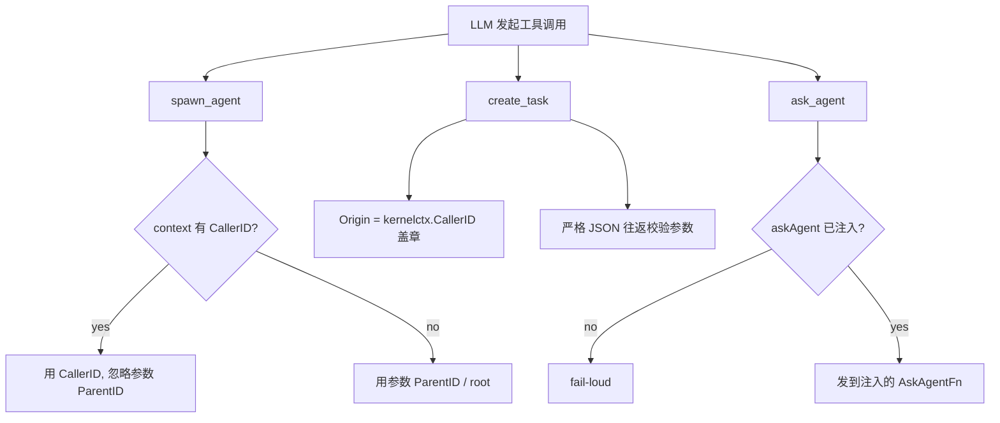

# ares 架构深度解析（十二）：安全加固 —— 工具信任门与身份来源（0.3.x）

> 0.3.x 说明：本文完全基于当前代码改写。早期版本里 `internal/ratelimit/`、`internal/storage/postgres/security.go`、`internal/security/sanitizer.go` 等旧路径在新版中已不再是安全加固的主战场。本文只描述当前真实存在的加固机制：**ares_skills 的工具信任门（Tool Trust）**、**agentsyscall 的身份来源不可伪造（Kernel 强制 provenance）**，以及 **Sanitizer 在 LLM 调用链上的兜底**。

> 一个 Agent 的权限并不取决于你"以为"它有多大——而取决于**它拿到某个工具的那一刻，这个工具有没有经过信任判定**。而这套判定的起点，是一个只有四档的信任等级和一句"来源决定信任"的朴素原则。

---

## 一、给 Agent"装能力"这件事，本来就是个安全决策

先讲清楚一个事实：给 Agent 装一个"能执行任意本地命令"的工具，和在集群里给一个进程开 root，性质是一样的。区别只在于，工具是 **Skill 清单声明出来的**——而一份 Skill 的 manifest 里每一行 tool 声明，都是在面对一个"要不要信任它"的决策点。

当前代码里，这个决策点被明确地独立出来了，核心在 `internal/runtime/protocol/skills/`。它遵循的一条设计原则（写在 `types.go` 的包注释里）：

> "Discovery, loading, execution and trust are four separate concerns."（发现、加载、执行、信任是四个独立关注点。）

发现不等于权限。**能看见一个 skill ≠ 能执行它的工具。** 这就是加固的第一性原则。

---

## 二、信任门：`TrustLevel` 与 `trustForSource`

### 2.1 只有三档信任

`resolver.go` 定义了最小化的信任等级，注释里写得很直白："the smallest possible trust gate — Discovered → Declared → Trusted? → Allowed?"：

```go
type TrustLevel int

const (
    TrustUntrusted TrustLevel = iota // 未经显式同意，禁止执行
    TrustAsk                          // 执行前需要确认
    TrustAllowed                      // 可自由执行
)
```

### 2.2 来源决定默认信任

`trustForSource(kind SourceKind)` 把一个 skill 的来源类型映射到默认信任档：

| `SourceKind` | 语义 | 默认信任档 |
|--------------|------|-----------|
| `SourceProject` ("project") | 项目内 `.ares/skills` | `TrustAllowed`（用户已 opt-in 该仓库） |
| `SourceUser` ("user") | 用户级 `~/.ares/skills` | `TrustAllowed`（用户显式安装过） |
| `SourceRegistered` ("registered") | `config.toml` 里声明的额外目录 | `TrustAsk`（仍要一道确认门） |
| 其它（含 `SourceExperience`） | 学习/外部来源 | `TrustUntrusted`（**永不自动执行**） |

特别注意 `SourceExperience`："experience" 型的 skill 是可以被索引的**相关性先验**，但 `types.go` 注释反复强调：**learned skill 是 indexable 但从 NOT auto-executed（可索引、绝不自动执行）**——Discovery != Permission 这条线在经验学习这里是最严格的。

```go
func trustForSource(kind SourceKind) TrustLevel {
    switch kind {
    case SourceProject:
        return TrustAllowed
    case SourceUser:
        return TrustAllowed
    case SourceRegistered:
        return TrustAsk
    default:
        return TrustUntrusted
    }
}
```

### 2.3 解析即把关：`Resolver.Resolve`

**重要**：`Resolver` 只负责把 manifest 声明绑定成可运行的 `ResolvedTool`，它`永远不 invoke` 工具本身。信任检查发生在"绑定"这一层——声明的工具在还没有机会被调用之前就被拦下了。

```go
func (r *Resolver) Resolve(decls []ToolDecl, kind SourceKind) ([]ResolvedTool, error)
```

`resolveOne` 按 `ToolKind` 分派：

| `ToolKind` | 判定 |
|-----------|------|
| builtin | 必须存在于已知内建集合，否则报错 |
| mcp | 必须声明 `Server`，否则报错 |
| executable | **信任门所在**：`TrustUntrusted` 来源 → 直接 `ErrToolUntrusted`；若未开启 `allowLocalExecutables` → `ErrToolUntrusted`；命令必须在 PATH 或存在，否则报错 |

`ErrToolUntrusted` 是 sentinel：

```go
var ErrToolUntrusted = errors.New("ares_skills: tool untrusted")
```

```mermaid
flowchart LR
    D[manifest tool decl] --> K{trustForSource(kind)}
    K --> |untrusted| X["executable? => ErrToolUntrusted"]
    K --> |ask/allowed| E{executable 类型?}
    E -- yes --> A{allow_local_executables?}
    A -- no --> X
    A -- yes --> B[命令存在于 PATH / 相对路径]
    B -- no --> X
    B -- yes --> OK[ResolvedTool]
    E -- builtin/mcp --> C{声明合法?}
    C -- no --> ERR[其它错误]
    C -- yes --> OK
```

> ⚠️ 诚实边界：从当前源码看，`trustForSource` 只把 `SourceRegistered` 判为 `TrustAsk`，而代码里**并没有一份"显式信任确认"的交互实现**——`TrustAsk` 目前更像一个"尚未落地的中间档"（待核实：是否有调用方实现了 `TrustAsk` 的确认流程）。真正硬性的防线是 `TrustUntrusted` + `ErrToolUntrusted` 这条"来源不可信就不绑定"的路径。

---

## 三、身份来源不可伪造：Kernel 强制 provenance

工具信任说的是"工具本身能不能被调用"；接下来要解决的是另一个问题：**调的是谁、为谁调**。`internal/agentsyscall/` 的 `Kernel` 用一句原则实现：**身份来源由 Kernel 强制，而非由 LLM 参数决定。**

### 3.1 `spawn_agent`：父身份不能被参数伪造

`SpawnAgentArgs` 里有 `ParentID`，但 `SpawnAgent` 的执行逻辑是：

```go
parentID := args.ParentID
if caller := kernelctx.CallerID(ctx); caller != "" {
    parentID = caller // 上下文中的真实 caller 优先，LLM 传的 ParentID 被忽略
}
```

即：**只要工具调用上下文里带了 `kernelctx.CallerID`，它就是唯一可信的来源**，LLM 传进 `parent_id` 字段会被忽略——一个 Agent 无法在参数里伪造"我是谁生的"。

### 3.2 `create_task`：Origin 由 Kernel 盖章

`CreateTaskArgs` 故意**没有 creator 参数**（注释写得很清楚）：

```go
// NOTE: there is deliberately no "creator" argument. The Kernel stamps
// Task.Origin from the tool context (kernelctx.CallerID) ...
```

`CreateTask` 里：

```go
Origin: kernelctx.CallerID(ctx),
```

所以"这个任务是谁创建的"这个持久化的事实，只能来自调用语境，用户/LLM 无法通过参数注入。并且 `agentsyscall` 里 `create_plan` 还会用严格 JSON 往返解析参数（类型不匹配就报错，而不是静默丢字段）。

### 3.3 Fail-loud：没接上的协作原语，宁可失败也不要假装协作

`Kernel.AskAgent` 背后是一个注入的 `AskAgentFn`（生产环境是 IPC `ipc.Send`）。如果没接上：

```go
if k.askAgent == nil {
    return nil, errors.New("agentsyscall: ask_agent not wired (no collaboration IPC) ...")
}
```

同一个"不要静默 no-op"原则也体现在 `create_plan` 的循环上限 `maxPlanLoops` 上——`create_plan` 是 LLM 可调用的 syscall，若不设上限，无限计划循环 = 无限 goroutine。于是有了与 spawn 配额对偶的"计划循环配额"。

### 3.4 从内核到工具边界的元能力

把这几点合起来看，`agentsyscall` 的加固模型是：



---

## 四、兜底：Sanitizer 在 LLM 调用链上

加固不只是入口，还要管"吐出来的东西"。上一篇文章讲过 `ares_security.Sanitizer`；在加固语境里它的作用是**剪断明文泄露**：`internal/llm/client.go` 的 `WithSanitizer` 让 `Client` 在把 prompt/response **交给 tracer / event store 记录之前**先脱敏。生产接线在 `internal/ares_bootstrap/provide_llm.go`：

```go
llm.NewClient(llmCfg, llm.WithCallbacks(reg), llm.WithSanitizer(ares_security.NewSanitizer()))
```

配合审计 `AuditLogger`（`internal/ares_security/audit.go`），破坏性动作（杀 Agent、调 MCP 工具等）也会留下"谁、对谁、成没成"的结构化记录。信任门 + 身份盖章 + 记录兜底，三者加在一起才是完整的加固闭合环。

---

## 五、当前加固机制的边界（诚实清单）

| 声称 | 现状 |
|------|------|
| 工具信任门 `TrustLevel` / `trustForSource` / `ErrToolUntrusted` | ✅ 真实存在，`resolver.go` |
| `TrustUntrusted` 来源的工具在绑定层被拒 | ✅ 真实存在 |
| `TrustAsk` 的"执行前确认"交互 | ⚠️ 档位存在，但**确认流程未见实现**（待核实） |
| `SourceExperience` 永不自动执行 | ✅ 注释+代码约束 |
| `spawn_agent` parent 由 `kernelctx.CallerID` 强制 | ✅ `agentsyscall/syscall.go` |
| `create_task` Origin 由 Kernel 盖章、不可注参 | ✅ 同上 |
| `ask_agent` fail-loud（未注入则报错） | ✅ 同上 |
| LLM 请求/响应记录前脱敏 | ✅ `llm/client.go` + `provide_llm.go` |
| 破坏性动作审计 | ✅ `ares_security/audit.go` |

---

## 六、结语

安全加固在 ares 里不是一层厚厚的中间件，而是**分散在不同层、各自守住一个决策点**：

- `ares_skills` 守住"这个工具能不能被绑定/调用"（信任门）。
- `agentsyscall` 守住"这通调用是谁发起的"（身份不可伪造）。
- `ares_security.Sanitizer` + `AuditLogger` 守住"记录里不留明文、动作留下痕迹"。
- `introspect` 面板作为可观测平面，让上述决策有迹可循（但它自身无认证，只给可信运维）。

这几条防线之间彼此无侵入：信任门不管调用计数，身份盖章不管脱敏规则。它们唯一的共同点是——**都在默认拒绝这一侧**。

---

*过度好奇声明：本篇所有符号均来自实际源码；只有明确标注"（待核实）"的部分是我未能从当前代码完全坐实的，比如 `TrustAsk` 的交互实现是否落地。*

*下一篇预告：插件系统（十四）—— 诚实地讲 ares_runtime 里的 PluginBus 契约到底长什么样，以及为什么它**不是**那种"不改代码就动态加载 .so"的插件系统。*