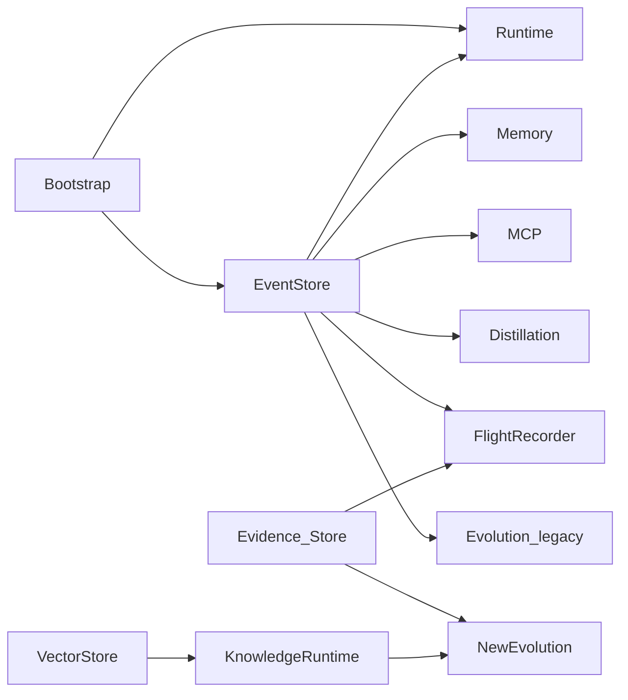
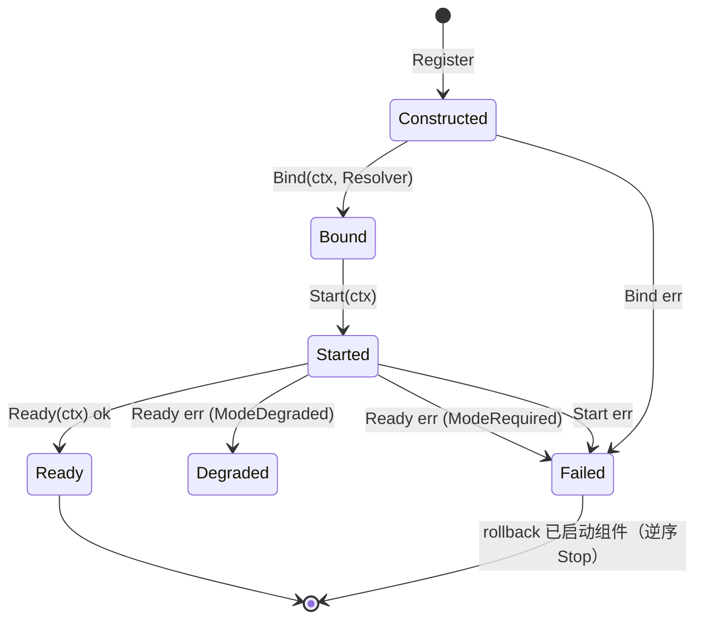
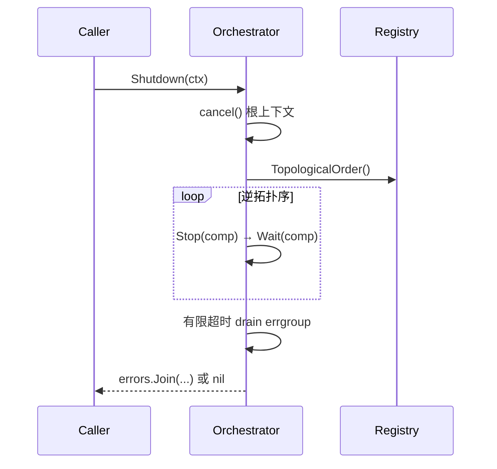

# ares 架构拆解 (XIII)：Bootstrap 与系统运行时编排（0.3.x）

> 0.3.x 更新：`internal/ares_bootstrap.Bootstrap` 是唯一的接线枢纽，按固定顺序组装 EventStore、Runtime、Memory、MCP、Skills、LLM、Distillation、AKG、Observability、NewEvolution、FlightRecorder、Evolution、GA、Discovery、SystemRuntime。系统运行时（`internal/kernel.Orchestrator`）在启动时按拓扑序执行 **Construct → Bind → Start → Ready**，在关闭时按逆拓扑序执行 **Stop → Wait**（受 30s 预算约束）。接入入口是 `Bootstrap(ctx, cfg, deps)` —— 不是 `New`，也没有 `DefaultConfig()`。

每个框架都会有一个时刻：用户的问题从"怎么调 LLM"变成"怎么把这些东西接在一起"。那一刻，你需要 bootstrap。

早期文档里，"启动 ares 需要按顺序手动创建一堆对象、相互传引用"是常见的描述。下面这段是**示意代码，不是仓库里的真实代码**（历史叙述，待核实）：

```go
// ⚠️ 示意，非仓库真实代码（历史叙述，待核实）
eventStore := events.NewMemoryEventStore()
memMgr, _ := memory.NewMemoryManager(memory.DefaultMemoryConfig())
llmClient, _ := llm.NewClient(llm.Config{...})
rt := runtime.New(runtime.Config{...}, eventStore, memMgr)
rt.Start(ctx)
```

这种"手动接线"的中心思想仍然成立——漏一个依赖、改一个构造函数签名，就是一堆调用点要跟着改。但真实的解决方式不是魔法容器，而是**一个明确封装了"从配置到组件图"的接线函数**。

在现在的 `internal/ares_bootstrap` 里，这是：

```go
comp, err := ares_bootstrap.Bootstrap(ctx, cfg, &ares_bootstrap.BootstrapDeps{...})
```

```go
// internal/ares_bootstrap/bootstrap.go
func Bootstrap(ctx context.Context, cfg *ares_config.Config, deps *BootstrapDeps) (*Components, error)
```

`cmd/ares/serve.go` 就是调用方：它构造一个带归档能力的 EventStore 通过 `deps` 注入，剩下的接线交给 Bootstrap（serve.go:168 附近）。`cfg` 来自 `ares_config.Load(path)`（待核实调用细节，但 `Config` 结构体真实存在，见下文）。

---

## 问题：依赖地狱，但用显式代码解决

`internal/ares_bootstrap` 的依赖不是猜的——它有一个 `BootstrapDeps` 结构体来接收**可选的**外部依赖：

```go
type BootstrapDeps struct {
	EventStore ares_events.EventStore
	ExpRepo    repositories.ExperienceRepositoryInterface
	LLMClient  eval.LLMClient
}
```

凡是这里没给的，`Bootstrap` 内部自己建默认实现（例如内存 EventStore）。这与依赖注入框架（Wire/Dig/fx）不同：**没有生成文件，没有反射魔法**。接线顺序写在 `Bootstrap` 函数体里，从上到下可读、可调试。

这个组件的依赖不是虚构的"金字塔"，而是真实存在于 `Bootstrap` 组装过程中的数据流：



---

## Bootstrap：从 config 到组件图的顺序

`Bootstrap` 的组装顺序是**有意义的**——下游依赖上游先构造。真实顺序如下（缩进表示依赖关系）：

| 步骤 | 函数 / Provider（真实符号） | 组件写入 `comp.` | 门控 / 语义 |
|---|---|---|---|
| 1 | `deps.EventStore` 或 `ares_events.NewMemoryEventStore()` | `EventStore` | 默认内存 |
| 2 | `ProvideRuntime(eventStore)` → `runtime.New(nil, eventStore, nil)` | `Runtime` | 总是创建 |
| 3 | `wireMemory(cfg, eventStore)` → `ProvideMemory(memCfg)`；`mem.SetEventStore(eventStore, "memory")` | `Memory` | 门控 `cfg.Memory.IsEnabled()` |
| 4 | `ProvideMCP(ctx, cfg.MCP)` → `ares_mcp.NewMCPManager` + `.Start(ctx)` | `MCP` | 无服务可配时最小可用 |
| 4b | `wireSkills(ctx, mem, mcp)` | `SkillsRegistry`, `SkillCatalog` | best-effort |
| 5 | `ProvideLLM(cfg.LLM)`（或 `deps.LLMClient`） | `LLM` | 回调注册表 + CostDashboard + Prometheus tracer |
| 5b | `wireDistillation(...)` → `provideDistillation(...)` | `Distillation`，`ExpRepo` | 门控 `Memory.DistillationEnabled()` + PG + Embedding |
| 5c | `wireAKGLoop(cfg, deps, embClient)` | `KnowledgeStore`, `AKGBridge` | 门控 `cfg.Knowledge.RetrievalEnabled` |
| — | `subscribeDistillationEvents(ctx, &comp)` | （后台） | 订阅 TaskCompleted/Failed |
| 6 | `ProvideObservability(tracer, feedbackStore, globalTracer)` | `Observability`, `Dashboard` | 共享 tracer/feedback/span |
| 7 | `BuildKnowledgeRuntime(vecStore, emb, knowStore)` | `KnowledgeRuntime` | best-effort provider 注册 |
| 8 | `buildEvolutionDAG` + `wireNewEvolution` → `ProvideNewEvolution(dag, rt, memStore, evStore)` | `NewEvolution`, `EvidenceStore` | 门控 `cfg.Evolution.Enabled` |
| — | `flight.NewFlightRecorder` + `.Start(ctx)` | `FlightRecorder` | 共享单例，assert 失败不致命 |
| — | `wireLegacyEvolution` → `ProvideEvolution(...)` | `Evolution` | 门控 Enabled 且依赖齐备 |
| — | `wireRetrievers(...)` | （注入 Memory） | best-effort |
| — | Deployment pipeline → `SetDeployer` | （注入 Coordinator） | 门控 `cfg.Evolution.Deployment.Enabled` |
| 9 | `wireGAEvolution(ctx, cfg, comp, newEvol, guidanceProvider)` | （GA + ticker + lifecycle） | 门控 `cfg.Evolution.Enabled` |
| 10 | `ProvideDiscovery(ctx, &cfg.Discovery, comp.EventStore)` | `Discovery` | `ErrDiscoveryDisabled` 视为关闭 |
| 11 | `wireSystemRuntime(ctx, cfg, &comp)` | `SystemRuntime`, `SystemRegistry` | 观察性注册 |
| — | `startExpiryCleanupWorker(ctx, &comp)` | （后台） | 无 cleaner 则 no-op |

关键的可信事实：

- **故障策略不一致是有意的。** 部分失败是 fail-loud（配置了 Postgres 却连不上，证据存储直接 `runCleanups()` 并返回错误），部分是 best-effort（蒸馏、skills、观察性缺失时降级继续）。`Bootstrap` 用 `cleanups []func()` 收集反序清理回调，任何阶段出错都会**按创建逆序**释放已建组件。
- **门控是 config 级的。** 例如 `cfg.Evolution.Enabled=false` 时 `NewEvolution` 与 GA ticker、LLM suggestion ticker 都不会构造——组件不会在配置关闭时"在背后偷偷启动"。

`Components` 本身就是容器——**不是叫 `ARES`，是 `Components`**：

```go
// internal/ares_bootstrap/bootstrap.go — 节选
type Components struct {
	MCP          *ares_mcp.MCPManager
	Dashboard    *ObservabilityProviders
	LLM          *LLMComponents
	Evolution    *EvolutionComponents
	NewEvolution *NewEvolutionComponents
	Runtime      *runtime.Manager
	Memory       ares_memory.MemoryManager
	EventStore   ares_events.EventStore
	Distillation *aresexp.DistillationService
	SkillsRegistry *skills.Registry
	SkillCatalog   *ares_skills.Catalog
	KnowledgeRuntime *knowledgeruntime.KnowledgeRuntime
	VectorStore     storage.VectorStore
	KnowledgeStore  knowledge.KnowledgeStore
	AKGBridge       *adapter.DistillBridge
	FlightRecorder  *flight.FlightRecorder
	ExpRepo         repositories.ExperienceRepositoryInterface
	EvidenceStore   evidence.Store
	SystemRuntime   *kernel.Orchestrator
	SystemRegistry  *kernel.Registry
	Observability   *ObservabilityComponents
	ExpiryCleaners  []NamedExpiryCleaner
	// ...
}
```

容器上还挂了几个读取接口：`Snapshot()`、`ComponentStatus(name)`、`IsSystemReady()`（都基于 `SystemRegistry`，未接线时返回安全的空值）。

---

## Providers：它们真实存在

`internal/ares_bootstrap` 不是只有 `Bootstrap`，而是一组 `Provide*` 函数，每个负责一个大件。下面按我实际读到的来列（模块前缀 `github.com/Timwood0x10/ares`）：

| Provider（真实签名） | 产出 | 备注 |
|---|---|---|
| `ProvideRuntime(eventStore) (*runtime.Manager, error)` | Runtime | `runtime.New(nil, eventStore, nil)` |
| `ProvideMemory(cfg) (ares_memory.MemoryManager, error)` | Memory | `cfg==nil` 时用 `DefaultMemoryConfig()` |
| `provideDistillation(ctx, cfg, llmClient) (*distillationWiring, error)` | distillation wiring | 返回 `{pool, embeddingClient, experienceRepo, service, guidanceProvider, embeddingQueue, embeddingConfig}` |
| `ProvideMCP(ctx, cfg) (*ares_mcp.MCPManager, error)` | MCP | `NewMCPManager` + `Start` |
| `ProvideLLM(cfg) (*LLMComponents, error)` | LLM | `llm.NewClient` + 回调 + `CostDashboard` |
| `ProvideObservability(tracer, feedback, spans) (*ObservabilityProviders)` | Dashboard | `IntrospectOptions()` 喂给 introspect |
| `ProvideNewEvolution(dag, rt, memoryStore, evStore) (*NewEvolutionComponents, error)` | NewEvolution | 注册 Genome/Diff/Patch 三个 Registry + Coordinator |
| `ProvideEvolution(ctx, cfg, eventStore, expRepo, llmClient, fr) (*EvolutionComponents, error)` | 旧 Evolution | 需要全套依赖才非空 |

`NewEvolutionComponents` 暴露 `UpdateLiveDAG(dag)`、`UpdateLiveKnowledgeRuntime(rt)`、`SetToolClassDAG(dag)`——serve 在 Agent 装配好后把"真实运行时"注入进进化系统（在占位图上就地 `SetDAG`/`SetGraph`，因为 `patch.Registry.Register` **不能覆盖**已注册的 key）。

**坦诚反思**：这套不是 DI 容器，是好读的构造函数编排。想要 PG 事件存储？你构造好自己放 `deps.EventStore`。想要纯离线最小配置？`BootstrapDeps{}` 全空，Bootstrap 用默认项兜底 90% 的场景。剩余 10% 直接调 `Provide*` / 构造函数。

---

## Skills 接线（0.3.x）

`bootstrap.go` 第 4b 步的 `wireSkills(ctx, comp.Memory, mcp)` 是段"隐形接线"——你调 `Bootstrap()`，Agent 就带技能目录。它的实际动作（我读到的）：

- `ares_skills.NewCatalog(CatalogConfig{...})` 声明源：`./.ares/skills` + `~/.ares/skills` + `LoadSkillSources("")` 返回的目录/git/http 源；`SetGitSources` / `SetHTTPSources`；`mcp != nil` 时 `SetMCPConnector(mcp)`。
- `SyncGitSources(ctx)` → `Build()` 建立索引 → `SeedRegistry(reg)`，把 `skills.NewRegistry()` 经 `setter.SetSkillsRegistry(reg)` 注入 memory manager。
- 返回 `(*ares_skills.Catalog, *skills.Registry)`：`[0]` 挂 `Close` 清理，`[1]` 交给 env-cap 搜索器让技能变成可检索的 tool 能力。
- 此处原先订阅 `EventSubTaskResult` 的 skill outcome recorder 已作为死代码删除（从第一天起就被饿死——从未有发射方携带它期望的 payload 形状，W8 / RUNTIME.md 破损项 #8），接线点留有 TODO(tech-debt)。
- 全程 best-effort：memory 禁用 / memory 不暴露 `SetSkillsRegistry` / 索引构建失败，都只 log + 跳过，不挡启动。

> 注意：本文早期版本提到的 `CatalogTools(skill_search/skill_load/...)`、`SetToolChangeHandler`、`serve.go` 里 `wireSkillCatalog` 等符号，本次未在 `internal/ares_bootstrap` 中核实到，标记为（待核实）。真实的技能接线入口是上面的 `wireSkills`。

---

## 系统运行时 Orchestrator（0.3.x 主角）

Bootstrap 的最后一步把已组装的组件注册进 `system_runtime`，由 Orchestrator 统一管理生命周期：

- `kernel.NewRegistry()`，然后每个已构造组件用 `reg.Register(adapter, mode)` 注册（adapter 带 `deps`/`Stop`/`Wait`/`Ready` 钩子）。
- `kernel.NewOrchestrator(reg, rootCtx)` 创建 Orchestrator，`orch.SetEventSink(comp.EventStore)`（组件后台失败会上事件流），最后 `orch.Start(ctx)`。

### 生命周期：启动

`Orchestrator.Start` 按拓扑序（依赖先 Ready）对每个组件执行 **Construct → Bind → Start → Ready**：



- `Construct` 在注册时已完成（`Bootstrap` 已经建好实例）；Orchestrator 跑的是 Bind/Start/Ready。
- `Start` 不可重入：连续调两次会返回错误。
- 任何一环失败，失败组件先清理，已启动组件按逆序 `rollback`（内部调 `stopComponent`）。

组件通过接口协议参与编排：

| 接口（真实符号） | 方法 | 阶段 |
|---|---|---|
| `Component` | `Name()`、`Dependencies()` | 全局 |
| `Binder` | `Bind(ctx, Resolver)` | Bind |
| `Starter` | `Start(ctx)` | Start |
| `ReadinessChecker` | `Ready(ctx)` | Ready |
| `Stopper` | `Stop(ctx)` | 关闭 |
| `Waiter` | `Wait()` | 关闭 |
| `Resolver` | `Get(name) any` | Bind 取依赖 |

Mode 有三种：`ModeRequired`（必须 Ready）、`ModeOptional`、`ModeDegraded`（允许降级，用 `Ready` 报缺失能力）。

### 生命周期：关闭

`Orchestrator.Shutdown(ctx)` 是**逆拓扑序**的：先 `cancel()` 根上下文（唤醒所有等待 `RootContext().Done()` 的 goroutine），再逆序 `Stop → Wait`，最后用有限超时排空 errgroup。有三道预算（代码里 `stopTimeout`/`waitTimeout`/`overallShutdownTimeout` 都是 30 秒）：



- `Shutdown` 幂等，可并发调用，只有第一次执行真正的序列。
- 组件在预算内没停到 `Stopped`，会在返回的错误中列出名字——截断的 teardown 是可见的，不是静默的。
- `Adopt(ctx, c, mode)` 是**迟到准入**（K1：serve 里内核 pillar 更晚装配）：只跑 `Bind` + `Ready` 门（不跑 `Start`，启动由 adopt 方负责）；正在关闭时调用返回 `ErrShuttingDown`；依赖未注册或 Failed 会被拒绝（fail-loud）。
- `GoBackground(name, fn)` 统一管理后台循环：panic 被 recover、记录到事件流、把组件标记 `Failed`，但不会 `cancel` 整个 errgroup（一个坏循环不拖垮全进程 teardown，teardown 由 `Shutdown` 驱动）。

### 注册的组件

`wireSystemRuntime` 里实际注册（名字 + 模式 + 依赖）：

| 注册名 | Mode | Dependencies | 停机钩子 |
|---|---|---|---|
| `eventstore` | Required | — | — |
| `runtime` | Required | `eventstore` | `Stop()` |
| `memory` | Required | `eventstore` | `Stop(ctx)` |
| `mcp` | Required | — | `Stop(ctx)` |
| `llm` | Required | — | — |
| `evidence` | Required | — | — |
| `flight` | Required | `eventstore`, `evidence` | `Stop()` |
| `knowledge` | Required / **Degraded**(AKG 写依赖缺失时) | — | `Ready` 报错 |
| `newevolution` | Required | `evidence` | — |
| `discovery` | Required | — | — |

`Registry.TopologicalOrder()` 用 Kahn 算法做拓扑排序；声明了未注册的依赖、或检测到环，都会 fail-loud 报错。`Registry.IsReady()` 要求所有 `Required` 组件 `Ready`（或 `Degraded`）且无 `Failed`。这印证了那个核心原则：**接线是可读的显式数据，而不是隐藏在生成代码里的魔法。**

---

## 配置接线

配置系统在 `internal/ares_config`：`Load(path) (*Config, error)`（gate 方法如 `MemoryConfig.IsEnabled()` 真实存在）。`Config` 结构体包含 `Server`、`LLM`、`Agents`、`Tools`、`Storage`、`Memory`、`Knowledge`、`MCP`、`Evolution`、`Embedding`、`Discovery`、`Kernel`、`Security` 等小节——Bootstrap 逐段读取它们来决定哪些组件构造、哪些跳过。门控语义（`IsEnabled` / `DistillationEnabled` / `RetrievalEnabled` / `Deployment.Enabled`）就是上面"故障策略"表的开关。

---

## 模块日志与 Event.ModuleName

每个包的日志都带作用域标签，例如 `internal/ares_bootstrap/log.go`：

```go
var log = logger.Module("ares_bootstrap")
```

`system_runtime` 同理（`log = logger.Module("system_runtime")`）。所以 Orchestrator 的每一行状态日志都带 `module=system_runtime`，Bootstrap 的每条带 `module=ares_bootstrap`——凌晨三点看日志时，你能立刻说出是哪一层在报。

事件系统也一样：`ares_events.Event` 结构体带 `ModuleName` 字段（`types.go`），`store.go` 在 `Append` 时写入模块归属。事件不仅说"发生了什么"，还说"是哪一层干的"。

---

## 教训

Bootstrap 和系统运行时都不是光鲜的功能，它们没法演示、没法给投资人看。但它们决定你是"用着爽"还是"想砸电脑"。

真实的力量在细节里：`Bootstrap` 用 `cleanups []func()` 逆序清理失败路径，`Orchestrator.Shutdown` 用有限预算保证 teardown 不会无限挂起，`patch.Registry` 不能覆盖已注册 key 所以 `UpdateLiveDAG` 只能就地 `SetDAG`。这些都是"接线"这门课的真货。

**最好的接线是你能读、能调、能从日志里一眼看出走到哪一步的接线。** 接线不该是魔法——应该是显式的、可调试的顺序。这就是全部意义。