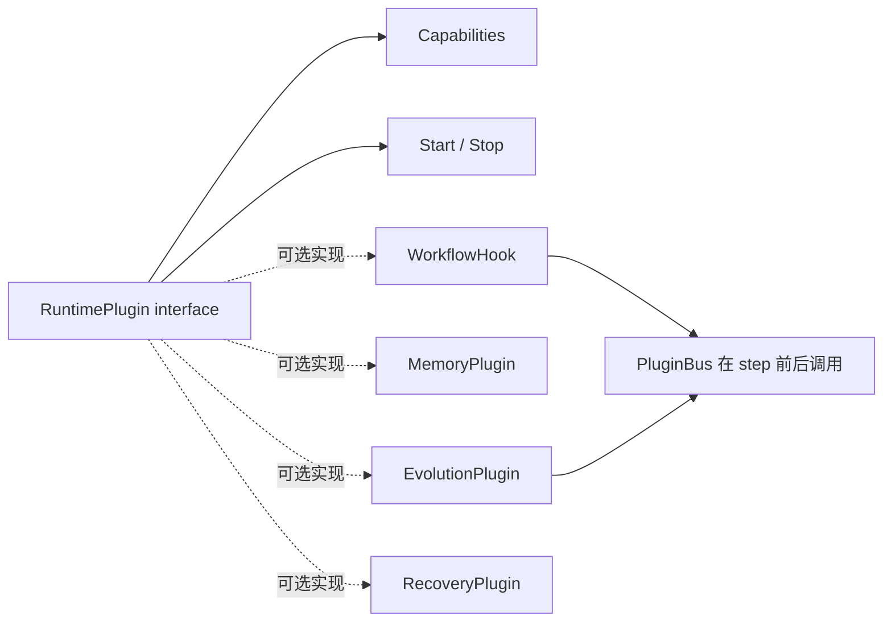
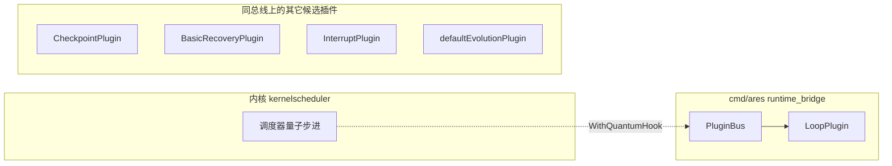

# ares 架构拆解（XIV）：插件系统 —— 说实话，它不是"不改代码就加载 .so"的那种（0.3.x）

> 0.3.x 说明：本文完全基于当前代码改写。早期版本里"executor 上帝对象被插件拆解"的叙事，"ToolExpander 让技能名称即时解析为 LLM 工具定义"的机制，需要**与当前真实的插件契约区分开**。本文只写我们现在真正有的：`internal/runtime/` 里的 `RuntimePlugin` **接口契约** + `PluginBus` **生命周期/钩子管理器**。

> 先给你一句最诚实的话：**当前代码里的"插件系统"不是动态加载。** 没有 `go:plugin`、没有 `.so` 热插拔、没有"不改代码就能注入外部插件"。它是一套**编译期 Go 接口 + 注册表**——你在启动装配时把实现该接口的结构体 `Register` 进 `PluginBus`，由这个 bus 统一管理生命周期并调用定义好的扩展点。

---

## 一、它到底是什么：一个插件契约 + 一个总线

`internal/runtime/` 的包注释开门见山：

> "Package runtime defines the plugin contract for extending workflow execution. Plugins are registered on a PluginBus which manages their lifecycle and invokes them at defined extension points (BeforeStep, AfterStep)."

三件事：**定义契约（接口）→ 注册到总线 → 总线管理生命周期并调用扩展点。**

### 1.1 插件契约：`RuntimePlugin` 是所有插件的地基

```go
type RuntimePlugin interface {
    Name() string
    Capabilities() []Capability
    Start(ctx context.Context, bus EventBus) error
    Stop(ctx context.Context) error
}
```

- `Name()`：唯一标识。
- `Capabilities()`：声明插件提供的功能域。
- `Start` / `Stop`：生命周期。`Start` 必须非阻塞；拿到 `EventBus` 用来发/订事件。

`Capability` 是一组功能域常量：

```go
CapObserver / CapCheckpoint / CapRouter / CapLoop / CapMemory / CapEvolution / CapTool / CapRecovery / CapInterrupt
```

### 1.2 三个可选扩展接口

在 `RuntimePlugin` 基础上，插件可以再实现下列可选接口，让总线把特定场景交给它：

| 接口 | 用途 |
|------|------|
| `WorkflowHook` | `BeforeStep` / `AfterStep`——在**每个 step 执行前/后**被同步调用 |
| `MemoryPlugin` | `AdviseRoute(ctx, RouteState) → []RouteAdvice`——基于相似历史执行给出路由建议 |
| `EvolutionPlugin` | `Recommend(ctx, ExecutionState) → *RuntimeRecommendation` + `RecordOutcome(ctx, outcome)`——把执行结果喂给演化学习 |
| `RecoveryPlugin` | `ShouldRecover(ctx, StepFailure, ExecutionState) bool`——失败时决定是否恢复该 step |

它们依赖的数据结构也在同一文件（`plugin.go`）：`RouteAdvice`、`RouteRecord`、`ExecutionState`、`RuntimeRecommendation`、`ExecutionOutcome`、`StepFailure`、`Step`、`StepResult` 等。

`EvolutionPlugin` 还有一个专门的默认实现，在 `evolution_plugin.go`：`NewEvolutionPlugin(name, provider, recorder, opts...)`，带推荐缓存（默认 `CacheTTL = 30s`，可用 `WithCacheTTL` 调）。provider/recorder 可传 nil——"evolution 未配置"是合法的禁用态，不是错误。



### 1.3 总线：`PluginBus`

`bus.go` 的 `PluginBus` 是核心管理器：

```go
bus := runtime.NewPluginBus()
```

- `Register(plugin)`：加一个插件；**重名返回 `ErrDuplicatePlugin`；`Start` 之后再 `Register` 返回 `ErrBusAlreadyStarted`**。若插件实现了 `WorkflowHook` 会自动注册为 hook。
- `Start(ctx)` / `Stop(ctx)`：启动所有插件（某个失败记日志继续）；停止按**注册的逆序**，失败用 `errors.Join` 汇总。
- `BeforeStep` / `AfterStep`：**顺序**调用所有 hook，每个都带超时（`invokeWithTimeout`）和 panic 恢复。契约是"可观测性的 log-and-continue"——**单个 hook 挂了不影响其它 hook 执行**。
- `Emit` / `Subscribe`：给插件的事件系统。`Emit` **非阻塞**，subscriber 缓冲满了就丢（有 `droppedEvents` 计数，`Stats()` 可查），符合"不能因为慢消费者阻塞调用方"。
- `PluginsByCap(cap)`：按能力取插件。


### 1.4 生产装配：谁在启动时真的把插件接进了调度器

`cmd/ares/peer_mode.go`：

```go
kernel.pluginBus = startPluginBus(ctx, store, sched, kernelLoopCfg)
```

`startPluginBus`（`cmd/ares/runtime_bridge.go`）真实注册了：

```go
loop := runtime.NewLoopPlugin("kernel-loop", runtime.LoopConfig{
    MaxIterations: loopCfg.LoopMaxIterations,
})
if err := bus.Register(loop); err != nil { /* 降级为日志+继续调度 */ }
if err := bus.Start(ctx); err != nil { return nil }
sched.WithQuantumHook(newPluginBusHook(bus, loop, loopCfg))
```

即：**生产里真正接进运行时的插件是 `LoopPlugin`（kernel 的 round 时钟）**，它通过 `WithQuantumHook` 挂到调度器的量子边界上，把调度节奏（quanta/round、max_iterations）变成可观测、可控制的对象。正因为如此，注册失败被刻意降级为"日志 + 继续调度"——**一个元数据问题绝不能卡死内核调度**。

其它内建的插件实现（已验证存在）：`LoopPlugin`（`loop.go`）、`BasicRecoveryPlugin`（`recovery.go`，允许列白名单）、`InterruptPlugin`（`interrupt.go`，实现 `RuntimePlugin` + `WorkflowHook`）、`CheckpointPlugin`（`checkpoint.go`，实现 `RuntimePlugin` + `WorkflowHook`）、内存路由插件（`router_memory.go`）。

---

## 二、诚实的边界：它不是什么

这可能是本文最重要的部分。当前"插件系统"的真实边界：

| 期望 | 现状 |
|------|------|
| 不改代码、动态加载新插件 | ❌ **做不到**。插件是编译进二进制的 Go 结构体 |
| `.so` / `go:plugin` 热插拔 | ❌ 没有（`go:plugin` 在当前代码里未见使用） |
| 运行时发现并注册外部插件 | ❌ 插件在启动装配时 `Register` |
| 同一进程内共享一个总线的生命周期/钩子管理 | ✅ 真实存在，`PluginBus` |

**为什么我强调这一点**：老版文章开头那段"executor 里写下第四个 if 之后把功能拆成插件"的叙事，以及"`ToolExpander` 让 Agent 无需重启即可获取新技能"的说法，指的根本是**另一套独立机制**——`internal/runtime/protocol/skills/` 的能力发现（Discovery/Loader/Catalog/Resolver）和 `internal/ares_callbacks/` 的事件回调注册表，它们不经过 `PluginBus`，也不是"插件动态加载"。如果你要的是"上传一个插件包就能扩能力"，**当前代码没有这个东西**。

### 2.1 别把两套东西搞混：`ares_callbacks` ≠ 插件

`internal/ares_callbacks/` 是一个独立的**事件回调注册表**（`Registry`，`On(event, handler)` / `Emit(ctx)`），处理 `llm.start/end/error/token`、`agent.start/end/error`、`tool.start/end/error` 这类生命周期事件。它通过 `Emitter` 接口被 LLM client（`WithCallbacks`）等消费。它有回调注册/派发的形态，但**不是 `RuntimePlugin` 插件**——它没有 `Capabilities` / `Start` / `Stop`，也不挂在 `PluginBus` 上。

> 可以这样记：`ares_callbacks` 是"广播生命周期事件给订阅者"；`ares_runtime` 的 `PluginBus` 是"管理编译期插件的生命周期并调用 step 扩展点"。前者是事件分发，后者是插件总线。

### 2.2 与 skill 能力发现的区别

`internal/runtime/protocol/skills/` 的 SkillCatalog / SkillLoader / Resolver 处理"技能清单 + 工具信任门"（见《安全加固》那篇的 `TrustLevel`）。技能发现会在运行期读取磁盘上的 SKILL.md / manifest，这看起来像"动态"，但那是**能力数据**的动态，不是**插件代码**的动态——声明出来的工具要落为可执行 provider，仍要走 `Resolver` 的信任门，且不带进 `PluginBus` 的生命周期管理。

---

## 三、设计的取舍：为什么"编译期接口 + 注册表"其实合理

抛开"插件"这个词带给人的想象，`RuntimePlugin` + `PluginBus` 这套设计有它明确的价值：

1. **把"一条执行路径"的横向关注点拆开**：checkpoint、interrupt、recovery、loop、memory、evolution 都以统一接口挂在总线上，执行核心不必知道每个细节。
2. **统一的生命周期管理**：`Start` / `Stop`（逆序）、超时、panic 恢复、事件发布都由 bus 提供，插件作者不用自己造。
3. **钩子"可观测性、不阻断"**：`BeforeStep`/`AfterStep` 的 log-and-continue 契约，保证了观测型插件坏了也不会拖垮调度。
4. **与内核解耦**：`runtime_bridge.go` 里那句注释很关键——"the adapter lives in runtime_bridge.go — the kernel stays free of any runtime import"（§0.3 依赖规则）。内核不 import runtime 包，插件接缝在装配层（`cmd/ares`）打开。

代价也直白：**扩展要想生效，必须改代码重新编译**，或者走 `ares_skills` 的能力数据路径。如果你在做平台化，想让第三方不改二进制就能贡献能力，这条路当前是封死的（待核实：是否有尚未合入的动态插件加载演进）。



---

## 四、结语

- **真实存在**的插件机制 = `internal/runtime/` 的 `RuntimePlugin` 接口契约 + `PluginBus`（注册/生命周期/`BeforeStep`/`AfterStep` hook/事件系统），生产装配在 `cmd/ares/peer_mode.go` → `startPluginBus`。
- **真实接进内核**的插件目前主要是 `LoopPlugin`（kernel round 时钟），通过 `WithQuantumHook` 挂在调度量子边界。
- **不是**动态插件加载：没有 `.so` / `go:plugin` / 热插拔。想不加改代码就扩展能力，得走 `ares_skills` 的能力数据路径，那是一个完全不同的机制。
- 别把 `ares_callbacks`（事件回调注册表）和 `PluginBus`（插件总线）混为一谈——一个是广播事件，一个是管理插件生命周期。

诚实地说完，你可能觉得"这不算插件系统"。但它在当前代码里**确实是一个插件系统的形态**——一个编译期插件系统。看清它不是什么，比吹它是什么更有价值。

---

*下一篇预告：待定。如果你读到这想深入了解某个模块，欢迎告诉我。*

*过度好奇声明：本文所有符号均来自实际源码；"动态插件加载是否在演进中"标注为待核实，因为我没有在这次阅读中看到它合入。*