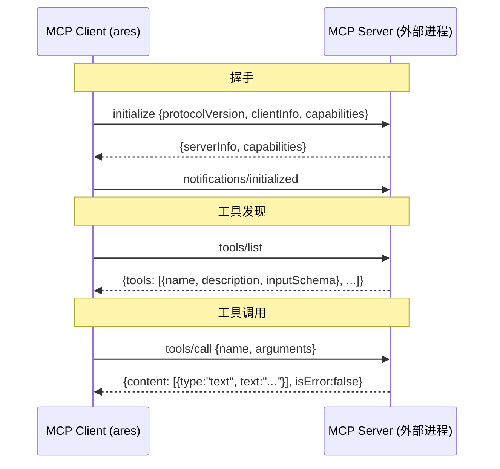
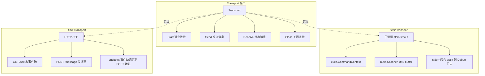
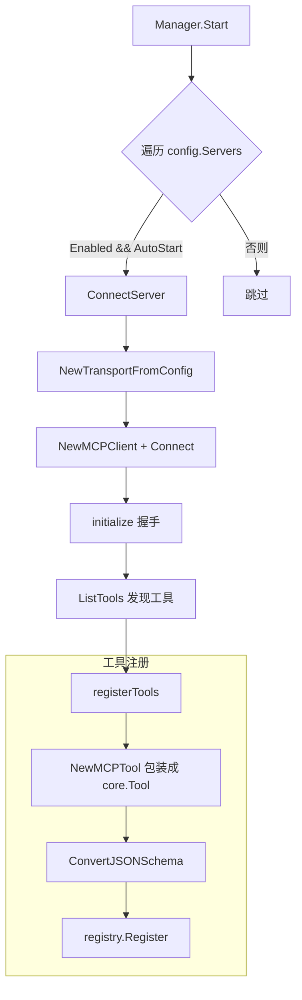

# ares 架构拆解 (XV)：MCP 集成——教 Agent 用工具（0.3.x）

> 最早给 Agent 加工具的时候，我是这么干的：写一个 Go struct，实现 `core.Tool` 接口，注册到 `Registry`，完事。
> 每加一个工具，改一次代码，编译一次，部署一次。
> 直到有一天，产品经理跑过来说："用户想接他们自己的数据库查询工具，不用你写代码那种。"
> 我愣住了。现有的架构根本没考虑过"工具从外面来"这件事。

这篇文章和系列里其他篇目一样，只讲我在 `internal/runtime/protocol/mcp/` 里**真正读到、能给你看源码**的东西。
凡是代码里对不上号的，我都直接砍掉或者标注（待核实），不编故事。

## 一、工具注册的困境

工具和框架的耦合太紧了。每个工具都是编译时确定的，拿 `internal/tools/resources/builtin/math/calculator.go` 里的 `Calculator` 举例——它是纯 Go 实现：

```go
// internal/tools/resources/builtin/math/calculator.go
type Calculator struct {
	*base.BaseTool
	compiled map[string]*vm.Program
	mu       sync.RWMutex // 保护 compiled 缓存
}

func NewCalculator() *Calculator {
	params := &core.ParameterSchema{ /* ... */ }
	return &Calculator{
		BaseTool: base.NewBaseToolWithCapabilities("calculator", "Evaluate mathematical expressions...", 
			core.CategoryCore, []core.Capability{core.CapabilityMath}, params),
		compiled: make(map[string]*vm.Program),
	}
}

func (t *Calculator) Execute(ctx context.Context, params map[string]interface{}) (core.Result, error) {
	expression, ok := params["expression"].(string)
	if !ok || expression == "" {
		return core.NewErrorResult("expression is required"), nil
	}
	// expr 库求值 ...
	return core.NewResult(true, map[string]interface{}{"result": result}), nil
}
```

注意几个关键类型，它们正是整个 MCP 集成对接的"插座"：

- `core.Tool` / `core.Result` / `core.ParameterSchema`（`internal/tools/resources/core/`）
- `base.NewBaseToolWithCapabilities`（`internal/tools/resources/base/base_tool.go`）
- `core.Registry` 的 `Register` / `Unregister` / `List` / `Get`

工具的定义、实现、注册全部在 Go 代码里。想加一个新工具？写代码、编译、部署。想让外部程序自己暴露工具？当时没门。

换个思路就清晰了：与其在框架里造轮子，不如用一个**标准协议**让外部进程自己声明"我有什么工具"。这个协议就是 MCP（Model Context Protocol）。

---

## 二、MCP 协议：JSON-RPC 2.0 的一次实战

MCP 的核心思想很简单：**外部进程自己声明它有什么工具，框架通过标准协议去发现和调用。**

协议本身基于 JSON-RPC 2.0，分三步：



在 `internal/runtime/protocol/mcp/jsonrpc.go` 里，消息模型长这样：

```go
type JSONRPCMessage struct {
	JSONRPC string          `json:"jsonrpc"`
	ID      *int64          `json:"id,omitempty"`   // nil = notification
	Method  string          `json:"method,omitempty"`
	Params  json.RawMessage `json:"params,omitempty"`
	Result  json.RawMessage `json:"result,omitempty"`
	Error   *JSONRPCError   `json:"error,omitempty"`
}
```

`ID` 的有无决定了消息类型：有 `ID` 是请求/响应，没 `ID` 是通知。工具 `IsRequest` / `IsResponse` / `IsNotification` / `IsError` 这四个判定函数就是靠它工作的。

`MCPClient.receiveLoop` 会把收到的消息按类型分发——响应派给对应 pending channel，通知异步处理：

```go
// internal/runtime/protocol/mcp/client.go
func (c *MCPClient) receiveLoop() error {
	for {
		msg, err := c.transport.Receive(c.ctx)
		// ...
		switch {
		case IsResponse(msg) || IsError(msg):
			c.dispatchResponse(msg)
		case IsNotification(msg):
			// 每个通知在自己的 goroutine 里处理，用 notifySlots 限并发（上限 8）
			select {
			case c.notifySlots <- struct{}{}:
				c.eg.Go(func() error {
					defer func() { <-c.notifySlots }()
					c.handleNotification(msg)
					return nil
				})
			default:
				// 槽满则丢弃该通知，防止恶意服务器用通知洪泛打爆内存
			}
		}
	}
}
```

那句 "JSON-RPC 自带异步" 不吹牛：`call` 里用 `nextID`（`IDGenerator`，atomic 自增）生成 id，把响应的 pending channel 挂进 map，然后 `select` 等在超时 context 上。`callCtx` 的默认超时是 `defaultClientTimeout = 30 * time.Second`，可以在每个服务器的配置里覆盖。

`dispatchResponse` 有个细节值得写：它在持锁状态下把响应塞给 pending channel，并靠 `delete(pending, id)` 防止和 `Close()` 竞态——这也是线程安全的核心难点。

---

## 三、Transport 层：两条路，一个接口

MCP 协议不管消息怎么传，只定义 JSON-RPC 格式。传消息是 Transport 层的事。`internal/runtime/protocol/mcp/transport.go` 只定义了个 4 方法的接口：

```go
type Transport interface {
	Start(ctx context.Context) error
	Send(ctx context.Context, msg *JSONRPCMessage) error
	Receive(ctx context.Context) (*JSONRPCMessage, error)
	Close() error
}
```



### 3.1 Stdio：本地进程的标准姿势

外部工具以子进程启动，ares 通过 stdin 写入请求、stdout 读取响应：

```go
// internal/runtime/protocol/mcp/transport_stdio.go
type StdioConfig struct {
	Command string            `yaml:"command" json:"command"`
	Args    []string          `yaml:"args" json:"args"`
	Env     map[string]string `yaml:"env" json:"env"`
	WorkDir string            `yaml:"work_dir" json:"work_dir"`
}
```

`Start` 里用 `exec.CommandContext` 起进程，然后有个我踩过的坑：`bufio.Scanner` 默认 buffer 只有 64KB，MCP 服务器一旦返回大 schema 就报 `token too long`。解法是手动加 buffer：

```go
t.stdout = bufio.NewScanner(stdoutPipe)
t.stdout.Buffer(make([]byte, 0, stdoutBufferSize), stdoutBufferSize) // stdoutBufferSize = 1MB
```

`Send` 有一个写超时（`stdioWriteTimeout = 10s`）：子进程如果不读 stdin，一次写会被 `SetWriteDeadline` 打断，否则会一直占着 `t.mu`，连 `Close` 都被卡死。stderr 被单独起 goroutine drain 到 Debug 日志——这个设计救过我，用户说"工具不工作"，看 stderr 就知道是权限还是没装依赖。

### 3.2 SSE：远程服务器的 HTTP 方案

有些 MCP 服务器是远程 Web 服务，用 SSE（Server-Sent Events）：

```go
// internal/runtime/protocol/mcp/transport_sse.go
type SSEConfig struct {
	URL     string            `yaml:"url" json:"url"`
	Headers map[string]string `yaml:"headers" json:"headers"`
	Timeout time.Duration     `yaml:"timeout" json:"timeout"`
}
```

接收走 HTTP GET 长连接（SSE 流），发送走 HTTP POST。服务器可以用 `event: endpoint` 事件动态告诉客户端"以后 POST 到这个 URL"。这里有一个**已经做好的安全边界**：`isSameHostEndpoint` 会校验 endpoint 和 SSE URL 同 host，防止恶意服务器把 POST 重定向到内网地址（SSRF）：

```go
func (t *SSETransport) handleSSEEvent(ctx context.Context, eventType, data string) {
	switch eventType {
	case sseEventTypeEndpoint:
		endpoint := strings.TrimSpace(data)
		if !t.isSameHostEndpoint(endpoint) {
			log.Warn("mcp: rejecting endpoint URL with mismatched host (SSRF protection)", ...)
			return
		}
		t.mu.Lock()
		t.postURL = endpoint
		t.mu.Unlock()
	case sseEventTypeMessage:
		var msg JSONRPCMessage
		json.Unmarshal([]byte(data), &msg)
		t.msgCh <- &msg
	}
}
```

> 诚实说明：早年文章里我说过"SE 的 POST URL 没有相对路径处理"是技术债——**这个已经修掉了**。相对路径会基于 base URL 解析且总是放行，绝对 URL 必须同 host。

---

## 四、服务发现：可选的"帮忙找服务器"

**先说结论：Discovery 子系统存在，但它是独立的、可选的（opt-in），目前并没有接线到 MCP Manager 的自动连接上。** 你会在它上面看到我标注（待核实）的地方。

Transport 管通信，`MCPManager` 管连接，但它们都不回答一个问题：**应该连哪些服务器？** 在 Discovery 出现之前，每个 MCP 服务器都得手动写在配置里。

Discovery 子系统（`internal/discovery/`）能从多个来源自动发现 MCP 服务器、按身份合并去重、做健康检查、发事件。分层如下：

- `internal/discovery/`：引擎、身份归一化、健康检查、事件、存储
- `internal/discovery/providers/`：文件系统扫描器、二进制探针
- `api/discovery/`：给外部调用者的类型别名的薄代理（在代码里实际存在 `discovery.go`/`doc.go` 等）

### Provider 系统

每个 Provider 实现一个接口：

```go
type DiscoveryProvider interface {
	Name() string
	Confidence() Confidence
	Discover(ctx context.Context) ([]DiscoveryRecord, error)
}
```

置信度是 `Confidence` 类型，定义在 `discovery.go`：

```go
ConfidenceLow    = 60   // PATH 扫描、广播
ConfidenceMedium = 80   // HTTP discovery、mDNS
ConfidenceHigh   = 95   // Claude、Cursor、VSCode 配置
ConfidenceMax    = 100  // ARES 自身 registry、已验证
```

**文件系统 Provider**（`providers/filesystem.go`），实际扫描的路径是：

- **ARES**：`~/.ares/mcp-registry.json`，格式 `{"servers": [...]}`
- **Claude**：`~/.claude.json` 以及项目内 `.claude/settings.json`
- **Cursor**：`~/.cursor/mcp.json`
- **VS Code**：项目内 `.vscode/mcp.json`

> 校正：早期文章里写 ARES 扫描 `.codegraph/mcp-servers.json`，实码是 `~/.ares/mcp-registry.json`。这两种格式的 schema 不同，Provider 会统一归一化成 `DiscoveryRecord`。

**二进制探针 Provider**（`providers/binary.go`）不扫整个 PATH，而是按一个 `knownMCPBinaries` 白名单（`mcp-server-filesystem`、`mcp-server-git`、`mcp-server-postgres` 等）命中的名称去 `--help`，检查输出里有没有 MCP 关键字。白名单之外的一律不碰。它用 `knownMCPBinariesSet`（`filepath.Base`）做 O(1) 匹配。

### 并发发现与合并

`Engine.DiscoverNow` 用 errgroup 并发跑所有 Provider，单个失败不打断整组（记 `log.Warn` 后返回 nil）。之后按 `mergeRecords` 合并、`diffServices` 比对 store，再对 added/updated/removed 分发 `EventServiceAdded/Updated/Removed`，最后发一个 `EventDiscoveryComplete`。

被动注册也存在：`Engine.Register(ctx, RegisterRequest)` 会创建一个 `ConfidenceMax` 的 `DiscoveredService`（`Healthy: false`，健康检查是单独步骤），并发出 `EventServiceAdded`。

### 健康检查

`MCPHealthChecker`（`internal/discovery/health.go`）对每个服务做 `initialize → list_tools → close`：

- **URL 端点**：`api_mcp.ConnectSSE`
- **二进制端点**：`api_mcp.ConnectStdio`

但注意：并不是任何 URL/二进制都可以探。URL 只放行 http/https（防 SSRF），二进制只放行 `allowedMCPBinaryDirs`（`/usr/local/bin`、`/usr/bin`、`/opt/homebrew/bin`）下的、且解析符号链接后仍落在白名单内的路径。

### 事件系统与 Store

事件通过 `EventHandler` / `EventHandlerFunc` 派发。Service 存进 `ServiceStore`（默认 `MemoryStore`）。引擎本身很干净，不关心谁在听。

### 但这里有个我必须在代码里确认到边界的地方（待核实）

文章旧版写了一套 "Manager 监听 `EventServiceAdded` → 自动连接新发现的服务器 → 工具落进 Registry" 的完整流程。**我在代码里没找到这段接线。** 实码里 `ProvideDiscovery`（`internal/ares_bootstrap/provide_discovery.go`）做的事是：

- 配置里启用了 `discovery` 才构建引擎，否则返回 `ErrDiscoveryDisabled`
- 添加 ARES/Claude/Cursor/VSCode/Binary 五个 provider
- `eng.StartAutoDiscovery(ctx, interval)` 启动周期轮询（默认 5 分钟）
- 把事件**转发到共享的 `ares_events.EventStore`**（`"discovery"` 流），仅此而已

也就是说：**发现到的服务目前不会自动变成连接中的 MCP 服务器 / 组件里的工具**。引擎找到了"可能存在"的服务，但到 MCP Manager 的桥尚未接通（待核实）。所以老文章的流程图最后那两行 `MCP Manager 连接健康的服务 → 工具出现在 Registry 中` 要划掉。

---

## 五、MCPManager：多服务器的生命线

单个 `MCPClient` 只连一个服务器。多个服务器的连接、工具注册/注销、热更新，全在 `MCPManager`（`internal/runtime/protocol/mcp/manager.go`）：

```go
type MCPManager struct {
	clients  map[string]*managedClient
	registry *core.Registry       // 工具注册表
	mu       sync.RWMutex
	config   *MCPManagerConfig
	toolChangeHandler func()     // listChanged 后调用的回调（见下）
}

type managedClient struct {
	client  *MCPClient
	config  MCPServerConfig
	connAt  time.Time
	lastErr error
	tools   []string  // 已注册的工具名列表
}
```

`NewMCPManager(config, registry)` 要求 `registry` 非空——MCP 工具的归宿就是这个 `core.Registry`。

核心流程：



### 5.1 连接——以及工具怎么进 Registry

`ConnectServer` 是单个服务器的连接入口。它找到配置后建 transport，`connectWithTransport`（给测试注入 mock transport 的接缝）里做这些事：

1. 构造 `MCPClient`（带 `OnChange` 回调）
2. `Connect`：启动 transport → `initialize` 握手 → `ListTools` 发现工具
3. `registerTools(mc)` 把服务器上每个工具注册进 `registry`

痛点是 Context 作用域：`MCPClient.ConnectWithLifetime` 把**握手超时**和**子进程生命周期**分成两个 context——`Connect` 的 ctx 只在握手时有效，子进程得活到 `lifetimeCtx`，否则 `Connect` 一返回工具就死了。这直接解决工厂模式（第六节）里 `Create` 返回后工具立刻被 cancel 的问题。

`Start` 里连接失败**不会中断启动**，log 一下继续连下一个——一个服务器挂了不该影响其他服务器和 Agent。

### 5.2 tools/listChanged 通知（待核实：钩子存在，但 serve 里没人接）

MCP 客户端声明了 `Tools: ListChanged: true` 能力。服务器发 `notifications/tools/listChanged` 时，`MCPClient.handleNotification` 会重新拉一次 `ListTools`，成功就触发 `OnChange`。在 manager 侧 `connectWithTransport` 的 `onChange` 会调 `RefreshTools`（重新发现+重注册），再调 `notifyToolChange()`——后者会调用 `SetToolChangeHandler` 设置的回调。

**但 `SetToolChangeHandler` 在整个仓库里只有定义、没有任何调用点被接上。** 也就是说这个钩子目前是"悬空"的——老文章里写的"`MCPManager.SetToolChangeHandler` 桥接 listChanged → Skill Catalog.Refresh（hash 增量重索引）"在实码里**没有接通**（待核实）。真要接，下一个 caller 是在 `serve` 里把 catalog 的 `Refresh` 塞进来。

### 5.3 Skill 懒连接（这个是真的接上了）

`internal/runtime/protocol/skills/catalog.go` 声明了 `MCPConnector` 接口（就一个 `ConnectServer`），`*ares_mcp.MCPManager` 恰好满足它：

```go
type MCPConnector interface {
	ConnectServer(ctx context.Context, name string) error
}
```

接线在 `internal/ares_bootstrap/skills_wiring.go` 的 `wireSkills(ctx, mem, mcp)`：只要 memory 管理器暴露了 `SetSkillsRegistry`，就会 `catalog.SetMCPConnector(mcp)`。然后 `Catalog.Activate(ctx, skillID)` 在激活时才逐个 `c.mcp.ConnectServer(ctx, t.Target)` 连接这个 skill 声明的 MCP 服务器——连接时机从"启动即连"变成"激活 Skill 才连"。这条懒连接路径是货真价实的。

### 5.4 断开与热更新

- `DisconnectServer` / `Stop`：先把工具从 Registry 注销（`unregisterTools`），**在锁外**关 client（`MCPClient.Close` 会等通知 goroutine，这些 goroutine 可能又要进 `RefreshTools` 抢锁，锁内关会死锁）
- `ApplyConfig`：diff 新旧配置，新建连、删的断、变的重连，返回变更列表
- `RefreshTools`：先注销旧工具再重新发现；若 `ListTools` 失败，会用 client 仍缓存的定义**尽力恢复旧的注册**，避免热更新时一个瞬时抖动把服务器工具清零

### 5.5 状态查询

`ListServers()` 返回 `[]MCPServerStatus`：

```go
type MCPServerStatus struct {
	Name      string    `json:"name"`
	Connected bool      `json:"connected"`
	ToolCount int       `json:"tool_count"`
	Version   string    `json:"version"`
	Error     string    `json:"error,omitempty"`
	ConnAt    time.Time `json:"connected_at,omitempty"`
}
```

注意 `Version` **永远是空的**——client 不暴露服务器版本字符串，代码选择留空而不是灌一个误导性的状态值。另外 `ListServers` 会把"已配置、启用但尚未连接"的服务器也算进去（`Connected: false, Error: "not connected"`），保证必连服务器挂了是可见的 `Degraded`，而不是凭空消失。

> 关于 Dashboard：老文章里写的 `MCPStatusProvider`、`MCPServerStatusView`、`ArenaActionMCPDisconnect`、`FaultMCPDisconnect` **在仓库里都不存在**（`internal/dashboard/` 目录、这些符号我都没找到）。所以那一段我整段删掉了，不替它圆场。

---

## 六、MCPTool：让远程工具"假装"是本地的

`MCPTool` 是整个集成的关键适配器。它实现了 `core.Tool` 接口（文件末尾有编译期断言 `var _ core.Tool = (*MCPTool)(nil)`），实际执行时把调用转发给 MCP 服务器：

```go
// internal/runtime/protocol/mcp/mcp_tool.go
type MCPTool struct {
	*base.BaseTool
	client     *MCPClient
	serverName string
	toolDef    *MCPToolDef
}

func NewMCPTool(client *MCPClient, def *MCPToolDef) (*MCPTool, error) {
	schema, err := ConvertJSONSchema(def.InputSchema)         // JSON Schema → core.ParameterSchema
	name := fmt.Sprintf("mcp.%s.%s", client.ServerName(), def.Name)
	bt := base.NewBaseToolWithCapabilities(name, def.Description,
		core.CategoryExternal, []core.Capability{core.CapabilityExternal}, schema)
	return &MCPTool{BaseTool: bt, client: client, serverName: client.ServerName(), toolDef: def}, nil
}

func (t *MCPTool) Execute(ctx context.Context, params map[string]interface{}) (core.Result, error) {
	result, err := t.client.CallTool(ctx, t.toolDef.Name, params)
	if err != nil {
		return core.NewErrorResult(err.Error()), nil
	}
	if result.IsError {
		return core.NewErrorResult(extractText(result.Content)), nil
	}
	text := extractText(result.Content)
	return core.NewResult(true, map[string]interface{}{"content": text, "blocks": result.Content}), nil
}
```

命名规则是 `mcp.{serverName}.{toolName}`。这是刻意的：多个 MCP 服务器可能有同名工具（比如都叫 `search`），加前缀避免冲突。

`Close()` 是 no-op——连接生命周期归 `MCPManager` 管，一个工具的 Close 不能把同一服务器的其他工具共享的连接切了（P0-4）。

### 6.1 Schema 转换：JSON Schema → ParameterSchema

`ConvertJSONSchema`（`schema.go`）负责把 `inputSchema` 转成 ares 内部的 `core.ParameterSchema`。它处理 `type` / `properties` / `required` / `description` / `enum` / `minimum` / `maximum` / `default` / `items`，`type` 为空时默认 `object`（property 默认 `string`）。细节上它是**简化实现**：

- 递归只处理一层 `properties`，没有 `$ref` / `oneOf` / `anyOf` / `allOf`
- `items` 解析了但没有映射到 `ParameterSchema` 的嵌套数组约束里
- `convertProperty` 生成 `*core.Parameter`（`Type/Description/Default/Enum/Min/Max`）

诚实讲，**常见 case 没问题，复杂的嵌套 schema 会丢信息**——这是给 LLM 用的，schema 质量直接影响工具调用准确率。这是个真实的薄弱点，不是渲染出来的焦虑。

---

## 七、错误处理：超时、断连、和"服务器突然不说话了"

### 7.1 超时

`MCPClient.call` 里用 `context.WithTimeout(ctx, c.timeout)` 包装等待。默认 30s，可每个服务器在配置里改。超时返回明确的 error，不会挂着。

### 7.2 坦诚：没有重试，也没有熔断

**目前的实现里没有自动重试，也没有熔断器。** `Start` 对失败的服务器只是 log 然后继续。如果服务器在运行中挂了，`receiveLoop` 返回 error，client 不再自动重连。意味着：配了 3 个服务器，挂掉一个，那台服务器上的工具会静默失败——不 panic、不崩溃、但也回不来。

优先级当时是"先把协议跑通"，这些留到了后面：

1. **自动重连**：`receiveLoop` 退出后由 `MCPManager` 探活并重连
2. **指数退避**：重连别死循环
3. **熔断器**：连续失败 N 次标 unhealthy，停止尝试，定期探活
4. **工具级降级**：服务器不可用时，`MCPTool.Execute` 返回明确错误而不是卡超时

这些是下一个迭代要补的技术债。我特意把缺口列出来，因为**承认问题比假装没问题更重要**。

### 7.3 连接状态追踪

`ConnectServer` 里 `mc.lastErr` 会被记录，`ListServers()` 会把每个连通服务器的 `Connected` / `ToolCount` / `ConnAt` 暴露出去。至少用户**能看到**哪台挂了，即使不能自动恢复。

---

## 八、MCP 工具如何真正进入运行时（这才是真正的接缝）

前面说了工具注册进的是 `MCPManager` 自己持有的 `core.Registry`。但那个 registry 是 boostrap 内部新建的，Agent 用的 `sub.ToolBinder` 又是另一个喂法。**真正把 MCP 工具送进 agent 运行时的是 `cmd/ares/mcp.go` 的 `setupMCP`。**

```go
// cmd/ares/mcp.go
func setupMCP(_ context.Context, mcpMgr *ares_mcp.MCPManager, registry *api_tools.Registry, deps builtintools.GeneralToolsDeps) (*core.Registry, error) {
	internalReg := core.NewRegistry()
	// 内置 general tools 注册进 internalReg ...
	if mcpMgr != nil {
		// 把 bootstrap 里 MCPManager 已注册的工具桥接进 internalReg
		for _, tool := range mcpMgr.RegisteredTools() {
			t := tool
			if err := internalReg.Register(t); err != nil {
				fmt.Printf("MCP bridge: failed to register tool %s: %v\n", t.Name(), err)
			}
		}
	}
	// 再桥接进 internal/apitools registry（api/tools 是 deprecated 转发，dashboard 之类能看到）...
	return internalReg, nil
}
```

`RegisteredTools()` 是 manager 上读侧的对接口——它调 `m.registry.List()` + `Get`，把 MCP 工具按 `core.Tool` 读出来。

然后 `serve.go` 把它装成 Agent 用的 ToolBinder：

```go
// cmd/ares/serve.go
toolBinder := newToolBinder(internalReg)   // sub.NewToolBinder() + binder.BridgeFromRegistry(internalReg)
```

这个 `toolBinder` 最终作为 `sub.ToolBinder` 传进 `createAndServeAgents`，Agent 执行工具时就是走它。所以：


**结论：MCP→运行时的绑定路径存在，而且是实打实被 serve 链路接通的**——MCP Server → `MCPClient` 发现 → `MCPTool`（`core.Tool`）注册进 manager 的 registry → `setupMCP` 用 `RegisteredTools()` 桥接进 `internalReg` → `newToolBinder` 的 `BridgeFromRegistry` → Agent tool binder。

顺带澄清一个混淆点：`internal/agentsyscall` 里有个 `BindTools(binder, kernel)`，但它绑定的是 `spawn_agent` / `create_task` 这俩 syscall 工具，**跟 MCP 无关**。MCP 工具走的是上面这条 `core.Registry → sub.ToolBinder` 的路，不是 agentsyscall。

---

## 九、配置驱动：YAML 里的工具声明

整条集成是配置驱动的。用户在配置里声明要连哪些 MCP 服务器。`provide_mcp.go` 里 `mapMCPServerConfig` 把 `ares_config.MCPConfig` 转成 `ares_mcp.MCPManagerConfig`，schema 大致是这个形状：

```yaml
# config（示意，字段以 ares_config 为准）
mcp:
  servers:
    - name: "code-search"
      transport:
        type: stdio
        stdio:
          command: "mcp-code-search"
          args: ["--repo", "/path/to/repo"]
      timeout: 30
      enabled: true
      auto_start: true
    - name: "database"
      transport:
        type: sse
        sse:
          url: "http://localhost:8080/sse"
      timeout: 60
      enabled: true
      auto_start: true
```

`MCPServerConfig` 的 `Enabled`（这个服务器是否生效）和 `AutoStart`（是否在 `Manager.Start()` 时自动连）组合出灵活性。`ProvideMCP` / 向后兼容别名 `SetupMCP` 在 bootstrap 阶段创建 `MCPManager` 并 `Start`。运行时还可以 `ConnectServer` / `DisconnectServer` 动态管理。没有配置服务器时 `ProvideMCP` 返回一个空 manager（也算合法的最小配置）。

---

## 十、工厂模式：MCPToolFactory

除了 `MCPManager` 批量管理，MCP 工具还能量产：

```go
// internal/runtime/protocol/mcp/factory.go
type MCPToolFactory struct {
	manager *MCPManager
}

func (f *MCPToolFactory) Name() string { return "mcp" }

func (f *MCPToolFactory) Create(config map[string]interface{}) (core.Tool, error) {
	// 从 map 构建 MCPServerConfig
	// 用 ConnectWithLifetime 只连初始握手
	// 返回第一个工具
}
```

它实现了 `core.ToolFactory`，文件末尾同样有编译期断言 `var _ core.ToolFactory = (*MCPToolFactory)(nil)`。有两个值得注意的点：

1. **`Create` 只返回第一个工具**——服务器如果有 10 个工具只会给你一个。这是明摆着的简化/技术债，`ValidateConfig` 也是配套写的。
2. `ConnectWithLifetime(connectCtx, context.Background(), transport)` 只把 `connectCtx` 绑到初始握手，client 的生命周期 context 独立（background），这样 `Create` 一返回工具不会立刻死掉。

---

## 十一、Server 端：ares 自己也能当 MCP 服务器

到目前为止都在说"ares 作为 MCP 客户端"。但 `internal/runtime/protocol/mcp/server.go` 里还有另一面——ares 自己也能作为 MCP 服务器，把自己的能力暴露给其他 MCP 客户端：

```go
// internal/runtime/protocol/mcp/server.go
type MCPServer struct {
	info              Implementation
	capabilities      ServerCapabilities
	tools             map[string]*registeredTool
	resources         map[string]*registeredResource
	resourceTemplates []*registeredResourceTemplate
	prompts           map[string]*registeredPrompt
	transport         ServerTransport
	mu                sync.RWMutex
	serveCtx          context.Context
	handlerTimeout    time.Duration
}
```

它注册三种能力：Tools（`ToolHandler`）、Resources（`ResourceHandler`/`ResourceTemplate`）、Prompts（`PromptHandler`）。通过 `transport_server.go` 里的 `ServerTransport` 接客户端，支持 stdio 和 SSE 两种 server transport。

这意味着 ares 既可以是 MCP 生态的消费者（调用别人的工具），也可以是生产者（暴露自己的能力）。`internal/runtime/protocol/skills/e2e_mcp_test.go` 里就有一个真实用例：起一个 serve `MCPServer` 的 stdio 子进程，再用 `MCPManager` 的 stdio transport 连它，验证"连接→注册→调用"整条链路。

---

## 坦诚反思：这条路走了多远，还差多远

**做对了的事：**

1. **Transport 抽象干净**：`Transport` 只有 4 个方法，Stdio 和 SSE 互不影响。加新传输（比如 WebSocket）只实现接口即可
2. **工具透明化**：`MCPTool` 实现 `core.Tool`，在 Registry 里和内置工具平级，调用方不需要关心来源
3. **Schema 自动转换**：`ConvertJSONSchema` 让 LLM 拿到参数元信息，不用人工翻译
4. **配置驱动**：YAML / bootstrap 一条链把外部工具接进来
5. **挂了的服务器可见**：`ListServers()` 把配置了但没连上的服务器也标成 `Connected: false`
6. **两处务实的安全边界**：SSE endpoint 同 host 校验（防 SSRF）、健康检查的二进制/URL 白名单

**还没做好 / 待核实：**

1. **没有自动重连 / 重试 / 熔断**：运行中断开就静默失败
2. **Discovery → MCP Manager 的桥未接通**：发现引擎找到服务但不会自动变成连接中的工具（待核实）
3. **`SetToolChangeHandler` 悬空**：listChanged → catalog 增量重索引的钩子存在但 serve 没接（待核实）
4. **`MCPToolFactory.Create` 只返回第一个工具**：10 个工具的服务器只能拿到 1 个
5. **`ConvertJSONSchema` 是简化实现**：`$ref` / `oneOf` 等复杂 schema 会丢信息
6. **`MCPServerStatus.Version` 恒为空**：客户端没暴露协议版本字符串

这些都是真实的技术债，不是我编出来凑字数的。

---

## 尾声：协议的价值

回头看整个 MCP 集成，最大的感悟是：**协议的价值不在于它有多复杂，而在于它在多大程度上解耦了生产者和消费者。**

没有 MCP 前，工具注册是编译时确定的——写代码、编译、部署。有了 MCP，工具注册变成运行时发现——启动子进程、握手、自动发现调用。MCP 工具以 `core.Tool` 的身份以完全平级的地位进入 `core.Registry`，再经 `setupMCP → newToolBinder` 送达 Agent。用户不用等我们写代码，他们自己写一个 MCP 服务器，ares 就能发现并使用。

协议是基础设施。MCP 之于 Agent 工具，就像 HTTP 之于 Web 服务——它不解决具体问题，它让解决问题的方式标准化。

核心文件一览：

| 文件 | 职责 |
|------|------|
| `internal/runtime/protocol/mcp/client.go` | MCP 客户端：传输接送、握手、工具发现、工具调用、通知处理 |
| `internal/runtime/protocol/mcp/manager.go` | 多服务器管理：连接生命周期、工具注册/注销、热更新、状态查询 |
| `internal/runtime/protocol/mcp/mcp_tool.go` | `MCPTool` 适配器：MCP 工具 → `core.Tool` |
| `internal/runtime/protocol/mcp/schema.go` | `ConvertJSONSchema`：JSON Schema → ParameterSchema |
| `internal/runtime/protocol/mcp/jsonrpc.go` | JSON-RPC 2.0 消息模型、编解码、消息分类 |
| `internal/runtime/protocol/mcp/transport.go` | `Transport` 接口（Start/Send/Receive/Close） |
| `internal/runtime/protocol/mcp/transport_stdio.go` | Stdio 传输：子进程 stdin/stdout 通信 |
| `internal/runtime/protocol/mcp/transport_sse.go` | SSE 传输：HTTP Server-Sent Events + endpoint 同 host 校验 |
| `internal/runtime/protocol/mcp/factory.go` | `MCPToolFactory`：工厂模式创建 MCP 工具 |
| `internal/runtime/protocol/mcp/server.go` | MCP 服务端：ares 作为 MCP 服务器 |
| `internal/runtime/protocol/mcp/types.go` | MCP 协议类型定义 |
| `internal/ares_bootstrap/provide_mcp.go` | `ProvideMCP`/`SetupMCP`：配置 → MCPManager |
| `internal/ares_bootstrap/skills_wiring.go` | `wireSkills`：把 MCPManager 接成 Skill 的懒连接 |
| `internal/runtime/protocol/skills/catalog.go` | `Catalog`：`SetMCPConnector` / `Activate` 懒连接 |
| `cmd/ares/mcp.go` | `setupMCP`：MCP 工具桥接进 internalReg + public registry |
| `cmd/ares/tools.go` | `newToolBinder`：Registry → `sub.ToolBinder` |
| `internal/discovery/` | 可选的发现引擎（未接到 Manager，见文中标注） |
| `internal/discovery/providers/filesystem.go` | ARES/Claude/Cursor/VSCode 配置扫描 |
| `internal/discovery/providers/binary.go` | 已知 MCP 二进制白名单探针 |