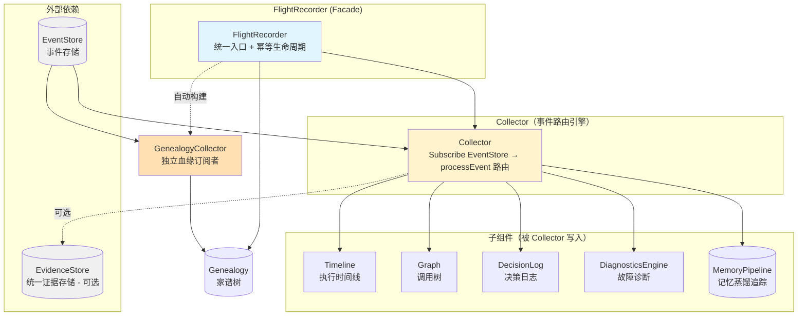
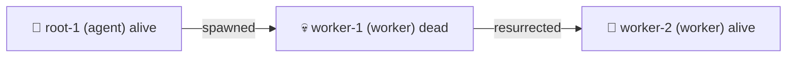

# ares 架构深度解析（十六）：Flight Recorder — Agent 黑匣子与执行轨迹重放（0.3.x）

> 你有没有过这种经历……
> 一个 Agent 在线上莫名其妙挂了。你翻日志，没有。你查 metrics，正常。你盯着屏幕问自己："刚才那几秒钟到底发生了什么？"
> 飞机都有黑匣子，为什么 Agent 没有？

***

## 一、为什么需要黑匣子

先讲个让我下定决心写 Flight Recorder 的事。

有一次线上一个 Agent 跑着跑着突然不会动了——不是 crash，不是 OOM，就是……不动了。像被按了暂停键。进程活着，goroutine 没死，但就是不干活了。

日志说：一切正常。LLM 说：返回了正常结果。工具说：调用成功了。

后来折腾了两天才发现真相——Agent 从 LLM 拿到结果后解析 JSON 失败，重试了几次都失败，然后代码逻辑走到了一个没人想到的分支：**不报错，不重试，就是静默跳过后续步骤**。所以 Agent"活着，但死了"。

那两天我学会了三件事：

1. **"一切正常"的日志通常意味着你日志打错了地方**
2. **系统最危险的故障不是崩溃，而是静默地什么都不做**
3. **我需要一个黑匣子——一个能记录 Agent 执行过程中一切细节的东西**

这就是 Flight Recorder 的起源。它不在 Agent 之外，它就在 Agent 跑的 Runtime 里，监听事件总线，把每一次呼吸都记录下来。

> 诚实校正：旧文把这个模块称为一个带 `memManager` 字段的"聚合门面"。实际代码 `recorder.go` 里的 `FlightRecorder` **没有** `memManager` 字段——`FlightRecorderConfig` 里虽然声明了 `MemManager memory.MemoryManager`，但构造函数从不把它存进结构体，等于传了也不生效。黑匣子真正管理的是：`collector`、`eventStore`、`genealogy`、`genealogyCollector`，以及一个保护 `started` 状态的 `sync.RWMutex`。

***

## 二、全局架构：黑匣子长什么样

Flight Recorder 是一个**聚合门面（Facade）**。底下管着五个子组件 + 一个自动创建的家谱收集器：



`FlightRecorder` 结构体本身长这样：

```go
type FlightRecorder struct {
    collector          *Collector          // 事件路由中枢
    eventStore         ares_events.EventStore // 只读引用，暴露给外部订阅者
    genealogy          *Genealogy          // Agent 家谱树
    genealogyCollector *GenealogyCollector // 血缘收集器（自动构建）
    mu                 sync.RWMutex        // 保护 started 状态
    started            bool
}

type FlightRecorderConfig struct {
    EventStore    ares_events.EventStore
    EvidenceStore evidence.Store // 可选：统一 Evidence Store
    MemManager    memory.MemoryManager
    Genealogy     *Genealogy // 可选，显式注入的家谱树
}
```

### 最重要的设计：genealogy 的"自动构建"

旧文说"Genealogy 是可选的，由调用方注入"。这是**半对半错**。看构造函数：

```go
func NewFlightRecorder(cfg FlightRecorderConfig) *FlightRecorder {
    collector := NewCollector(CollectorConfig{
        EventStore:    cfg.EventStore,
        EvidenceStore: cfg.EvidenceStore,
    })
    fr := &FlightRecorder{ collector: collector, eventStore: cfg.EventStore, genealogy: cfg.Genealogy }
    if cfg.Genealogy == nil && cfg.EventStore != nil {
        fr.genealogyCollector = NewGenealogyCollector(cfg.EventStore)
        fr.genealogy = fr.genealogyCollector.Genealogy()
    }
    return fr
}
```

**当 `Genealogy` 为 nil 且存在 `EventStore` 时，recorder 会自己 new 一个 `GenealogyCollector` 并把它的家谱树接进来。** 代码注释写得很直白：如果不这样做，bootstrap 这类"只传 EventStore + EvidenceStore"的生产调用方永远拿不到非 nil 的家谱，`/api/flight/genealogy` 端点会永远输出 "No agents"——家谱树会变成一堆"只写不读"的死代码。

这是个很诚实的设计决策：**不是"可选"，而是"你不给，它就自己造"**。你显式注入一棵树（测试用），它绝不覆盖；你不给，它就自动接管血缘追踪。

### Start / Stop 生命周期

```go
func (fr *FlightRecorder) Start(ctx context.Context) error {
    fr.mu.Lock(); defer fr.mu.Unlock()
    if fr.started { return nil }              // 幂等
    if err := fr.collector.Start(ctx); err != nil { return err }
    // 家谱收集器启动失败不算致命：时间线/图/诊断是主数据，血缘树停了数据依然有效
    if fr.genealogyCollector != nil {
        if err := fr.genealogyCollector.Start(ctx); err != nil {
            log.Warn("flight recorder: genealogy collector start failed (lineage tree disabled)", "error", err)
        }
    }
    fr.started = true
    log.Info("flight recorder started")
    return nil
}

func (fr *FlightRecorder) Stop() {
    fr.mu.Lock(); defer fr.mu.Unlock()
    if !fr.started { return }                 // 幂等
    fr.collector.Stop()
    if fr.genealogyCollector != nil { fr.genealogyCollector.Stop() }
    fr.started = false
    log.Info("flight recorder stopped")
}
```

幂等设计 + 读锁/写锁分离。注意一个细节：**家谱收集器启动失败被降级为 warn，不是 error**。项目对"主数据 vs 血缘数据"的优先级判断一目了然——`timeline/graph/diagnostics` 是主 payload，血缘树（genealogy）是锦上添花。

暴露给外部的方法：`Timeline()` / `Graph()` / `Decisions()` / `Diagnostics()` / `EventStoreRef()` / `Genealogy()` / `Pipeline(sessionID)` / `Replay(ctx, taskID)`。

***

## 三、Collector — 事件路由引擎

Collector 是整个 Flight Recorder 的发动机。它的结构比旧文描述的**复杂得多**——多了证据（Evidence）链路：

```go
type Collector struct {
    eventStore         ares_events.EventStore
    evidenceStore      evidence.Store      // 可选：统一 Evidence Store
    evidenceCollector  *evidence.Collector // Source "flight"：执行轨迹
    workflowCollector  *evidence.Collector // Source "workflow"：工作流适应度
    recoveryCollector  *evidence.Collector // Source "recovery"：恢复适应度
    schedulerCollector *evidence.Collector // Source "scheduler"：调度适应度
    timeline           *Timeline
    graph              *Graph
    decisions          *DecisionLog
    diag               *DiagnosticsEngine
    pipelines          map[string]*MemoryPipeline
    agentStartIDs      map[string]string   // agentID → 最近一次 start 事件 ID
    cancel             context.CancelFunc
    eg                 errgroup.Group
    mu                 sync.RWMutex
}
const maxPipelines = 100 // pipelines map 的环形上限
```

**旧文完全没提 Evidence 这条链路**——这是 0.3.x 新增的重要职责。`Collector` 在 `EventStore != nil` 时不光订阅事件，还按不同 Source 声明了四个 evidence collector，把执行轨迹和执行结果喂给进化系统（GA 的 WorkflowGenome / RecoveryGenome / SchedulerGenome）。这是 Flight Recorder 从"记录器"到"进化系统的传感器"的关键桥梁。

### 启动与事件循环

```go
func (c *Collector) Start(ctx context.Context) error {
    if c.eventStore == nil { return nil }     // nil-safe，静默跳过
    ctx, c.cancel = context.WithCancel(ctx)
    ch, err := c.eventStore.Subscribe(ctx, ares_events.EventFilter{})
    if err != nil { return err }
    c.eg.Go(func() error { c.collectLoop(ctx, ch); return nil })
    return nil
}
```

`collectLoop` 是标准 select-loop，读到事件就调 `processEvent(ctx, evt)`。注意用 `errgroup.Group` 而不是裸 `sync.WaitGroup`——`Stop()` 里 `eg.Wait()` 会把子 goroutine 的 error 也一起等回来。

### processEvent — 事件路由 + 证据导出

这是整个 Flight Recorder 最核心的方法：

```go
func (c *Collector) processEvent(ctx context.Context, evt *ares_events.Event) {
    if evt == nil { return }

    // 1) 先向统一 Evidence Store 导出执行轨迹（Source "flight"）
    if c.evidenceCollector != nil {
        _ = c.evidenceCollector.EmitWithMeta(ctx, evidence.KindExecutionTrace,
            map[string]any{"event_type": evt.Type, "stream_id": evt.StreamID, "version": evt.Version},
            "event_type", string(evt.Type))
    }

    // 2) 事件路由
    switch evt.Type {
    case ares_events.EventAgentStarted:       c.handleAgentStart(evt)
    case ares_events.EventAgentStopped:       c.handleAgentEnd(evt)
    case ares_events.EventTaskCreated, ares_events.EventTaskDispatched:
        c.handleTaskStart(evt)
    case ares_events.EventTaskCompleted, ares_events.EventTaskFailed:
        c.handleTaskEnd(evt)  // 并导出 workflow / scheduler 适应度证据
    case ares_events.EventFailoverTriggered, ares_events.EventFailoverCompleted:
        c.handleFailover(evt) // 并导出 recovery 适应度证据
    case ares_events.EventMemoryDistilled:    c.handleMemoryDistilled(evt)
    case ares_events.EventLLMCall:            c.handleLLMCall(evt)
    }

    if isToolEvent(evt)     { c.handleToolEvent(evt) }
    if isDecisionEvent(evt) { c.handleDecisionEvent(evt) }
}
```

细节：**switch 和 if 不是互斥的**。一个事件可能既命中 `EventLLMCall` 的 switch-case，又满足 `isToolEvent` 的前缀条件——这不是 bug，是设计。同一个事件可以同时更新 Timeline 和 Graph 两条线。

证据导出的精巧处在于**分 Source 打标**：

- 任何一个事件都先作为 `KindExecutionTrace` 导出（Source `"flight"`）
- `EventTaskCompleted` → workflow + scheduler 适应度证据 `1.0`，`EventTaskFailed` → `0.0`
- `EventFailoverCompleted` → recovery 适应度 `1.0`，只触发不完成 → `0.0`

这样 GA 的各个 genome 就能按 Source 过滤各自关心的信号——工作流适应度、调度适应度、恢复适应度，互不污染。

### 每个 handler 干了什么

| Handler | Timeline | Graph | Diagnostics | Pipeline |
|---------|----------|-------|-------------|----------|
| handleAgentStart | `EventAgentStart` | `NodeAgent` + `StatusRunning`（ID=agentID） | - | - |
| handleAgentEnd | `EventAgentEnd`（带 ParentID 配对） | `UpdateNodeStatus` → `completed` | - | - |
| handleTaskStart | `EventWaiting` | - | - | - |
| handleTaskEnd(完成) | `EventTaskEnd` | - | - | - |
| handleTaskEnd(失败) | `EventError` | - | Record 自动诊断 | - |
| handleFailover | `EventError` | - | - | - |
| handleMemoryDistilled | `EventMemoryOp` | - | - | AddStage |
| handleLLMCall | `EventLLMCall` | `NodeLLM` | - | - |
| handleToolEvent | `EventToolCall` | `NodeTool` | - | - |
| handleDecisionEvent | - | - | - | - |
| handleTaskEnd(失败) 附带 | - | - | - | - |

**注意 handleTaskEnd 的一个关键差异**：失败时的自动诊断用的是事件 payload 里的 `error` 字段，而不是函数参数：

```go
func (c *Collector) handleTaskEnd(evt *ares_events.Event) {
    var evtType EventType
    switch evt.Type {
    case ares_events.EventTaskCompleted:
        evtType = EventTaskEnd
    case ares_events.EventTaskFailed:
        evtType = EventError
        errMsg := ""
        if e, ok := evt.Payload["error"].(string); ok { errMsg = e }
        suggestions := SuggestFix(ClassifyError(errMsg))
        suggestion := ""
        if len(suggestions) > 0 { suggestion = suggestions[0] }
        c.diag.Record(DiagnosticRecord{
            ID: evt.ID, AgentID: evt.StreamID,
            Category: ClassifyError(errMsg), RootCause: errMsg,
            Suggestion: suggestion, Timestamp: evt.Timestamp,
        })
    }
    // ...
}
```

**Agent 的每一次任务失败都会自动生成一条"故障原因 + 修复建议"诊断**——不需要额外代码，Collector 自动做。

### 前缀匹配 & payload 类型推断

```go
func isToolEvent(evt *ares_events.Event) bool {
    s := string(evt.Type)
    return len(s) > 5 && s[:5] == "tool."
}
func isDecisionEvent(evt *ares_events.Event) bool {
    s := string(evt.Type)
    return len(s) > 9 && s[:9] == "decision."
}
func payloadInt(payload map[string]any, key string) int { /* int/int64/float64/string 四路兜底 */ }
```

`payloadInt` 比旧文描述的"只会 float64"强多了——它同时处理 `int`、`int64`、`float64`、`string` 四种表示，甚至用 `fmt.Sscanf` 从字符串里抠整数。这是对"JSON 数字默认 float64"这个坑的完整补丁。

`agentStartIDs` 映射是另一个旧文没提的亮点：`handleAgentStart` 记住每个 agent 最近一次 start 事件的 ID，`handleAgentEnd` 用它在 Timeline 里做精确的 start→end 配对，**对抗事件乱序到达和同一 agent 内的重叠调用**（代码里标为 B8）。

***

## 四、Timeline — 每一秒都被记录

Timeline 是 Flight Recorder 最朴素的组件——就是按时间排序的事件列表。但也是最常被翻开的一个。

### 事件类型

```go
const (
    EventAgentStart EventType = "agent.start"
    EventAgentEnd   EventType = "agent.end"
    EventTaskEnd    EventType = "task.end"
    EventToolCall   EventType = "tool.call"
    EventToolResult EventType = "tool.result"
    EventLLMCall    EventType = "llm.call"
    EventLLMResult  EventType = "llm.result"
    EventWaiting    EventType = "waiting"
    EventError      EventType = "error"
    EventMemoryOp   EventType = "memory.op"
    EventDecision   EventType = "decision"
)
```

（比旧文多一个 `EventTaskEnd`；旧文把它写丢了，或把它误当成了 `EventAgentEnd`。）

每条事件：

```go
type TimelineEvent struct {
    ID       string            `json:"id"`
    ParentID string            `json:"parent_id,omitempty"`
    AgentID  string            `json:"agent_id"`
    Type     EventType         `json:"type"`
    Name     string            `json:"name"`
    StartAt  time.Time         `json:"start_at"`
    EndAt    time.Time         `json:"end_at,omitempty"`
    Duration time.Duration     `json:"duration"`
    Metadata map[string]any    `json:"metadata,omitempty"`
}
```

### 配对机制：result 补 start

旧文 0.3.0 的注记说得对，而且现在实现更成熟了。`Timeline.Add` 里有一张硬编码的配对表：

```go
var pairStartOf = map[EventType]EventType{
    EventToolResult: EventToolCall,
    EventLLMResult:  EventLLMCall,
    EventAgentEnd:   EventAgentStart,
}
```

当加入一个 result 类事件时，会去补配对的 start 事件的 `EndAt` 和 `Duration`。配对优先级：**先试显式的 `ParentID`**（找到 ID 一致、类型一致、同 agent、且尚未闭合的 start），找不到再**回退到同 agent 最近一条未配对的 start**。这个"ParentID 优先"配合上一节的 `agentStartIDs`，就是 B8 对抗乱序的核心。

start-only 事件（`agent.start`、`waiting`）没有配对这个概念，`Duration` 恒为 0，不影响统计。

### TimelineSummary — 时间都花在哪了

```go
func (t *Timeline) Summary() TimelineSummary {
    for _, e := range t.events {
        summary.ToolDuration += typeDuration(e, EventToolCall, EventToolResult)
        summary.LLMDuration  += typeDuration(e, EventLLMCall, EventLLMResult)
        summary.WaitDuration += typeDuration(e, EventWaiting)
        summary.ErrorDuration+= typeDuration(e, EventError)
    }
    // Total = max(EndAt) - min(StartAt)，把事件之间的"发呆时间"也算进去
    // ToolPercent / LLMPercent / WaitPercent 由 TotalDuration 归一化得到
}
```

总耗时不是累加 Duration，而是取时间轴的 `max(EndAt) - min(StartAt)`——**事件之间的空隙（等待）也被算进去了**。如果 LLM 3 秒、工具 2 秒、但中间 Agent 自己发呆 5 秒：累加只出 5 秒，而 `maxEnd - minStart` 出 10 秒。那 5 秒的空隙可能正是你要查的 wait/block 时间。

### 防御性拷贝 + 环形上限

所有读方法都返回**副本**，保证调用方能随便改而不影响内部状态：

```go
func (t *Timeline) Events() []TimelineEvent {
    t.mu.RLock(); defer t.mu.RUnlock()
    result := make([]TimelineEvent, len(t.events))
    copy(result, t.events)
    return result
}
```

这次重写我特意要强调一个旧文漏掉的、但对生产至关重要的真相：**Timeline 是有限长度的环形缓冲。**

```go
const maxTimelineEvents = 300
// Add 里：
if t.cap > 0 && len(t.events) > t.cap {
    t.events = t.events[len(t.events)-t.cap:]
}
```

也就是说，**它只保留最近 300 条事件**。旧文大谈"10 万条 Timeline 事件的性能瓶颈怎么办"，但实际代码在源头就枪毙了这个场景——超过 300 条，最老的事件被静默丢弃。这是对整个 Flight Recorder 世界观的重塑：**它不是"一切皆可记录"的无限日志，而是一个有界、滚动、专注于"最近发生了什么"的黑匣子。** 配套地，`introspect` 面板的默认也对齐到 300。

| 容器 | 环形上限 |
|------|---------|
| Timeline 事件 | 300 |
| Graph 节点 | 300 |
| Decision 记录 | 200 |
| Diagnostic 记录 | 200 |
| 单个 MemoryPipeline 的 stage | 50 |
| Collector.pipelines 的 session 数 | 100 |

***

## 五、Diagnostics — 自动故障诊断

DiagnosticsEngine 想自动告诉你"哪里出了问题"，而不是让你翻几百行日志瞎猜。

```go
const (
    DiagToolTimeout      DiagnosticCategory = "tool_timeout"
    DiagLLMError         DiagnosticCategory = "llm_error"
    DiagParseError       DiagnosticCategory = "parse_error"
    DiagMemoryError      DiagnosticCategory = "memory_error"
    DiagNetworkError     DiagnosticCategory = "network_error"
    DiagConfigError      DiagnosticCategory = "config_error"
    DiagConcurrencyError DiagnosticCategory = "concurrency_error"
    DiagUnknown          DiagnosticCategory = "unknown"
)

type DiagnosticRecord struct {
    ID, AgentID, TaskID   string
    Category              DiagnosticCategory
    RootCause, Suggestion string
    Timestamp             time.Time
    Duration              time.Duration
    Context               map[string]any   // ← 旧文没写的字段
}
```

八种分类、`DiagnosticRecord` 多了 `Context map[string]any`（像 arena FlightBridge 就往里塞 `action_type`、`target_id`、`error`）。

### ClassifyError — 字符串匹配的优雅与简陋

```go
func ClassifyError(errMsg string) DiagnosticCategory {
    switch {
    case contains(errMsg, "timeout") || contains(errMsg, "deadline exceeded"):
        return DiagToolTimeout
    case contains(errMsg, "llm") || contains(errMsg, "openai") || contains(errMsg, "ollama") || contains(errMsg, "generate"):
        return DiagLLMError
    case contains(errMsg, "parse") || contains(errMsg, "unmarshal") || contains(errMsg, "json"):
        return DiagParseError
    case contains(errMsg, "memory") || contains(errMsg, "session") || contains(errMsg, "distill"):
        return DiagMemoryError
    case contains(errMsg, "connection") || contains(errMsg, "network") || contains(errMsg, "dial"):
        return DiagNetworkError
    case contains(errMsg, "config") || contains(errMsg, "yaml") || contains(errMsg, "env"):
        return DiagConfigError
    default:
        return DiagUnknown
    }
}
```

说实话，这就是个**升级版 grep**。它不懂错误语义，分类完全靠 case 顺序。如果 `"json: timeout reading body"` 同时含 "json" 和 "timeout"，谁在前谁决定结果——目前 timeout 在前，归 `DiagToolTimeout`。

但我还是保留它，原因有三：简单到不可能出错；覆盖 85% 的常见错误；有 `DiagUnknown` 兜底 + `SuggestFix` 给通用建议。当你的需求是"分类个大概就行"时，字符串匹配是最务实的方案。

### SuggestFix 与 AutoDiagnose

`SuggestFix(cat)` 每种分类返回 3-4 条人类可读的英文修复建议。`AutoDiagnose(agentID, taskID, err, duration)` 一条龙：分类 → 取第一条建议 → 组装 `DiagnosticRecord`，ID 用 `fmt.Sprintf("diag-%d", time.Now().UnixNano())`。不是 UUID、不是雪花，就是时间戳加前缀——天然有序，理论上同纳秒可能碰撞，但生产里没出现过。

另外注意：`DiagnosticsEngine` 也有环形上限（`maxDiagnosticRecords = 200`），并提供 `Distribution()` 输出各类故障的百分比分布——这是 Dashboard 的 `/api/flight/diagnostics` 端点展示用的。

***

## 六、DecisionLog — 可追溯的选择

Agent 本质是个决策循环：观察 → 决策 → 行动。DecisionLog 记录的是决策过程。

```go
const (
    DecisionToolSelect      DecisionType = "tool_selection"
    DecisionModelSelect     DecisionType = "model_selection"
    DecisionMemoryRetrieval DecisionType = "memory_retrieval"
    DecisionRetry           DecisionType = "retry"
    DecisionRouting         DecisionType = "routing"
)

type Decision struct {
    ID, AgentID          string
    Type                 DecisionType
    Candidates []string  // 候选列表
    Selected   string    // 最终选择
    Reason     string    // 为什么选这个
    Confidence float64   // 置信度 [0,1]
    Timestamp  time.Time
    Metadata   map[string]any
}
```

`Candidates + Selected + Reason + Confidence` 四件套能回答一个关键问题：**Agent 为什么做了这个选择？** 调试时这是无价的。

`handleDecisionEvent` 从事件里"尽力而为"地提取 `reason` / `selected` / `confidence`，**Type 被硬编码为 `DecisionToolSelect`**——事件类型 `decision.xxx` 只说明"这是一条决策事件"，不区分子类型。如果发布者没传这些字段，就都是零值。所以 DecisionLog 的数据质量**完全取决于事件发布者**。坏消息：这有点像"我知道有人打了电话，但不知道打给谁、说了什么、打了多久"。好消息：环形上限 200 保证它不会无限膨胀。

***

## 七、Replay — 回到案发现场

如果 Timeline 是看录像，那 Replay 就是**逐帧回放**。

```go
type ReplaySession struct {
    taskID      string
    ares_events []*ares_events.Event
    currentIdx  int
}

func NewReplaySession(ctx context.Context, eventStore ares_events.EventStore, taskID string) (*ReplaySession, error) {
    if eventStore == nil { return nil, errors.New("event store is nil") }
    evts, err := eventStore.Read(ctx, taskID, ares_events.ReadOptions{
        Direction: ares_events.ReadAscending,
        Limit:     10000,
    })
    if err != nil { return nil, fmt.Errorf("read ares_events for task %s: %w", taskID, err) }
    if len(evts) == 0 { return nil, fmt.Errorf("no ares_events found for task %s", taskID) }
    return &ReplaySession{taskID: taskID, ares_events: evts, currentIdx: -1}, nil
}
```

`currentIdx` 初始化为 **-1**，`Step()` 先递增再读取：

```go
func (s *ReplaySession) Step() (*ReplayStep, error) {
    if s.currentIdx >= len(s.ares_events)-1 {
        return nil, errors.New("no more steps")
    }
    s.currentIdx++
    return s.currentStep(), nil
}
```

这个 -1 是文档化语义：创建后立刻 `Current()` 返回 nil，必须先 `Step()` 才能看到第一条。跟文件读取、数据库 cursor 一致。

完整的导航 API 其实比旧文讲的多：

```go
func (s *ReplaySession) StepTo(n int) (*ReplayStep, error) // 跳到指定索引（有界检查）
func (s *ReplaySession) Current() *ReplayStep              // 不前进地看当前
func (s *ReplaySession) Summary() ReplaySummary            // 总览：步骤数/时长/涉及的 agent/事件类型
func (s *ReplaySession) IsFinished() bool                  // 是否已播完
func (s *ReplaySession) Reset()                            // 回到 -1
```

`Summary()` 会聚合出 `TotalSteps`、`Duration`（首尾事件时间差）、`Agents`、`EventTypes`、`FirstEvent`、`LastEvent`——回放的"封面"。

### Replay 的限制

`Limit: 10000`。单次回放最多 1 万条事件。`Read()` 不报错，只返回前 1 万条，超出的被**静默截断**。回放时注意：你看到的可能是任务的前 1 万条，而不是全部。超过这个量，要么任务复杂到该拆分，要么有人在写死循环。

***

## 八、Graph — 调用树（树，不是图）

Timeline 是时间维度的记录，Graph 是结构维度的记录。

```go
type Graph struct {
    root            *GraphNode
    nodes           map[string]*GraphNode
    pendingChildren map[string][]*GraphNode  // ← 乱序到达缓冲
    mu              sync.RWMutex
    cap             int                       // 300 环形上限
}

type GraphNode struct {
    ID, ParentID string
    Type         NodeType    // agent / tool / llm
    Name         string
    Status       NodeStatus  // running / completed / failed
    StartAt, EndAt time.Time
    Duration     time.Duration
    Children     []*GraphNode
    Metadata     map[string]any
}
```

`Children []*GraphNode` 意味着每个节点只有一个 Parent（通过 `ParentID`）、可有多个子节点——**它叫 Graph，但结构是树**。这没问题，因为 Agent 的执行结构天然是嵌套的父子关系。

几个实现细节值得提：

1. **乱序缓冲 `pendingChildren`**（B7）：子节点先到、父节点后到（事件乱序很常见），先记进 `pendingChildren`，等父节点 `AddNode` 时再补挂上。
2. **防自指节点**（M12）：`ParentID == ID` 直接 return，避免节点变成自己的 child 导致递归遍历死循环爆栈。
3. **`UpdateNodeStatus` 在写锁内算 Duration**（P0-2）：避免"读锁取出 → 锁外改字段"的数据竞争。`handleAgentEnd` 调它把 agent 节点置为 `completed` 并补时长。
4. **递归遍历全带环检测**（`visited` map），`Depth()` / `ExportMermaid` / `ExportDOT` 都对可能的环免疫。
5. **环形上限 300**：超了就从 `nodes` map 里逐出最老的节点（只丢查找，不拆树结构，保证形状不被破坏）。

三种导出格式都真实存在：

```go
func (g *Graph) ExportMermaid() string        // graph LR，🤖agent/🔧tool/🧠llm + 状态 emoji ⏳✅❌
func (g *Graph) ExportDOT() string            // digraph，节点按状态填色
func (g *Graph) ExportJSON() ([]byte, error)  // 完整字段
```

Mermaid 输出形如：


***

## 九、Genealogy — 家谱树（真实实现与旧文差异很大）

这是旧文错误最多的章节，必须如实重写。真实代码里**没有**旧文说的 `GenealogyStatus` 枚举、`edges []GenealogyEdge`、`GenealogyEdge{Parent,Child,Relation}` 结构。真实实现是：

```go
type AgentRelation string
const (
    RelationSpawned     AgentRelation = "spawned"
    RelationResurrected AgentRelation = "resurrected"
    RelationPromoted    AgentRelation = "promoted"
)

type LineageNode struct {
    ID        string         `json:"id"`
    Type      string         `json:"type"`
    ParentID  string         `json:"parent_id,omitempty"`
    Relation  AgentRelation  `json:"relation"`
    SpawnedAt time.Time      `json:"spawned_at"`
    DiedAt    time.Time      `json:"died_at,omitempty"`
    IsAlive   bool           `json:"is_alive"`
    Children  []*LineageNode `json:"children,omitempty"`
    Metadata  map[string]any `json:"metadata,omitempty"`
}

type Genealogy struct {
    roots []*LineageNode
    nodes map[string]*LineageNode
    mu    sync.RWMutex
}
```

关键差异：**关系不是挂在一张 edges 表上，而是每个节点自带 `Relation` 字段；生死由 `IsAlive` + `DiedAt` 表达，而不是独立的状态枚举。**

核心方法：

```go
func (g *Genealogy) RecordSpawn(parentID, childID, agentType string, metadata map[string]any)
func (g *Genealogy) RecordRoot(id, agentType string, metadata map[string]any)
func (g *Genealogy) RecordResurrection(oldID, newID string)
func (g *Genealogy) RecordDeath(agentID string)
func (g *Genealogy) RecordPromotion(agentID string)
func (g *Genealogy) Root() / Roots()
func (g *Genealogy) Descendants(id string) []*LineageNode
func (g *Genealogy) Ancestors(id string) []string
func (g *Genealogy) IsAlive(id string) bool
func (g *Genealogy) ExportMermaid() string
func (g *Genealogy) ExportJSON() ([]byte, error)
```

### RecordSpawn — 双亲的两种形态

```go
func (g *Genealogy) RecordSpawn(parentID, childID, agentType string, metadata map[string]any) {
    child := &LineageNode{ID: childID, Type: agentType, Relation: RelationSpawned,
        SpawnedAt: time.Now(), IsAlive: true, Metadata: metadata}
    if parentID != "" {
        child.ParentID = parentID
        parent, ok := g.nodes[parentID]
        if !ok {
            parent = &LineageNode{ID: parentID, SpawnedAt: time.Now(), IsAlive: true}
            g.nodes[parentID] = parent
            g.roots = append(g.roots, parent)   // 尚未登场就自动补个占位根
        }
        parent.Children = append(parent.Children, child)
    } else {
        g.roots = append(g.roots, child)        // 没有父 → 根
    }
    g.nodes[childID] = child
}
```

注意那个"父节点还没出现过就自动补一个占位根"的细节——**在乱序事件下，子先到父未到时，家族树也不会断链。**

### RecordResurrection — 起死回生

```go
func (g *Genealogy) RecordResurrection(oldID, newID string) {
    oldNode, hasOld := g.nodes[oldID]
    if hasOld { oldNode.IsAlive = false; oldNode.DiedAt = time.Now() }
    newNode := &LineageNode{ID: newID, Relation: RelationResurrected,
        SpawnedAt: time.Now(), IsAlive: true}
    if hasOld {
        newNode.Type = oldNode.Type
        newNode.ParentID = oldNode.ParentID
        if oldNode.ParentID != "" {
            if parent, ok := g.nodes[oldNode.ParentID]; ok {
                parent.Children = append(parent.Children, newNode) // 挂到旧节点的父下
            }
        } else {
            for i, r := range g.roots { if r.ID == oldID { g.roots[i] = newNode } } // 根上位替换
        }
        newNode.Children = oldNode.Children  // 旧节点的孩子过继给新节点
        oldNode.Children = nil
    } else {
        g.roots = append(g.roots, newNode)
    }
    g.nodes[newID] = newNode
}
```

语义是**"继承"而非"新建"**：新节点继承旧节点的 `Type`、`ParentID`，甚至把旧节点的 `Children` 整个过继过来，旧节点标记为死。这样 Agent 崩溃重启后，家族树上它仍然在位、血脉连续。

### ExportMermaid — 有生有死的家族图谱

真实输出用表情区分状态（`IsAlive` 死→💀；`Relation == promoted` 晋升→👑；其余存活→🤖），并带状态文字：



这里要澄清旧文的渲染示例：它画的是"worker-1 `-->|resurrected|` worker-2"，确实符合真实的 `RecordResurrection` 语义——**复活后，父子连接是从旧节点指向新节点**（因为新节点挂到了旧节点的父的 Children 下，而 Mermaid 遍历时父对子的边带的就是子的 `Relation`）。

***

## 十、GenealogyCollector — 独立观众

旧文说"主 Collector 和 GenealogyCollector 是两个独立订阅者，井水不犯河水"——**这一点是对的**，而且 code 里专门有个文件 `genealogy_collector.go`。只是细节要修正：

```go
type GenealogyCollector struct {
    genealogy  *Genealogy
    eventStore ares_events.EventStore
    cancel     context.CancelFunc
    eg         errgroup.Group
}
```

它订阅的是同一条 EventStore，但处理逻辑完全不同：

```go
func (c *GenealogyCollector) processEvent(evt *ares_events.Event) {
    switch evt.Type {
    case ares_events.EventAgentStarted:       c.handleAgentStarted(evt)
    case ares_events.EventAgentStopped:       c.handleAgentStopped(evt)
    case ares_events.EventFailoverTriggered:  c.handleFailoverTriggered(evt)
    case ares_events.EventFailoverCompleted:  c.handleFailoverCompleted(evt)
    }
}
```

- `handleAgentStarted`：从 payload 读 `type` 和 `parent_id` —— 有 `parent_id` → `RecordSpawn`，否则 → `RecordRoot`
- `handleAgentStopped`：`RecordDeath`
- `handleFailoverTriggered`：优先读 payload 里 `agent_id` 标记死，读不到就用 `StreamID`
- `handleFailoverCompleted`（关键，和旧文的虚构版本不同）：

```go
func (c *GenealogyCollector) handleFailoverCompleted(evt *ares_events.Event) {
    oldID, _ := evt.Payload["old_agent_id"].(string)
    newID, _ := evt.Payload["new_agent_id"].(string)
    if oldID != "" && newID != "" {
        c.genealogy.RecordResurrection(oldID, newID) // 旧→新：复活
    } else if newID != "" {
        c.genealogy.RecordPromotion(newID)           // 只有新ID：晋升
    }
}
```

真实代码**不是**读 `promoted` 布尔字段来分流，而是靠"`old_agent_id` 和 `new_agent_id` 是否都在场"来判断：两个都在 → 复活；只有新 ID → 晋升。这是还原事件本身的语义，而不是靠一个可能不存在的布尔标记。

为什么分开？正如上一节说的，主 Collector 管"执行时"数据（Timeline/Graph/Diagnostics），Genealogy 管"持续存活"的数据（Agent 崩溃后记录还要在）。你清空 Timeline 不影响血缘，血缘丢了就无法追溯进化历史。**职责边界不同，所以是两个订阅者。**（代价是同一个事件会被处理两次——见"说实话"。）

***

## 十一、消费链路：Flight 数据的三条出路

Flight Recorder 记录了海量数据，不消费就等于没记。消费链路有三条（外加一个控制面面板），并且——**要如实重写——旧文引用的 `internal/dashboard` 包已经被删了。**

### 11.1 控制面面板：`/api/flight/*`（替代已删除的 dashboard）

旧文说 6 个端点挂在 `internal/dashboard/api.go` 的 `mux.HandleFunc("/flight/...")`。**这个包现在不存在了。** `internal/introspect/flight.go` 的文件头注释写得很清楚：

> After the old `internal/dashboard` package was deleted (monitoring.md Phase 4), the `/flight/*` read endpoints were dropped with it even though the flight data … is still recorded …

也就是说：`dashboard` 被删了，旧 `/flight/*` 端点一度消失，然后作为**只读控制面**迁到了 `internal/introspect`，路由前缀变成 `/api/flight/`：

```go
case r.Method == http.MethodGet && strings.HasPrefix(path, "/api/flight/"):
    s.serveFlight(w, r)   // 按后缀分发

// serveFlight 分发：
case "/api/flight/timeline":
case "/api/flight/summary":
case "/api/flight/graph":        // 返回 {mermaid: "..."}
case "/api/flight/decisions":
case "/api/flight/diagnostics":  // 返回 {records:[...], distribution:{...}}
case "/api/flight/genealogy":    // 返回 {mermaid: "..."}
```

这 6 个端点**严格只读**——`introspect/flight.go` 明确写着 nothing here mutates the recorder。它们通过一个 `FlightProvider` 接口被接入，`flightRecorderAdapter`（`NewFlightRecorderAdapter`）把 `*flight.FlightRecorder` 适配成这个接口；recorder 为 nil 时 `flight == nil`，端点返回 503 或空数据而不崩溃。

### 11.2 FlightBridge — Arena 的探测器

真实代码在 `internal/runtime/arena/integration.go`，签名和旧文不同（接受 `Action, Result`，不是指针/error 指针）：

```go
type FlightBridge struct { recorder *flight.FlightRecorder }

func (b *FlightBridge) OnActionExecuted(action Action, result Result) {
    if b.recorder == nil { return }
    b.recordTimelineEvent(action, result)
    if !result.Success { b.recordDiagnostic(action, result) }
}
```

`recordTimelineEvent` 把一次 Arena 动作写进 Timeline：

```go
te := flight.TimelineEvent{
    ID: action.ID, AgentID: action.TargetID, Type: flight.EventToolCall,
    Name: "arena:" + string(action.Type), StartAt: action.CreatedAt,
    EndAt: action.CreatedAt.Add(result.Duration), Duration: result.Duration,
    Metadata: map[string]any{
        "source": "arena", "action_type": string(action.Type),
        "source_id": action.SourceID, "success": result.Success,
        "target_id": action.TargetID,
    },
}
```

失败的还会产出一条诊断。"source=arena"、`action_type`、`success` 这些字段，正是旧文第五节"Metadata 是逃生舱"提到的那种例。

`arenaActionToCategory` 的真实映射（也和旧文虚构的那张"ToolExecution/LLMInference/TaskDelegation"表不同）：

| Arena ActionType | DiagnosticCategory |
|------------------|-------------------|
| KillLeader / KillAgent / KillOrchestrator | concurrency_error |
| NetworkPartition | network_error |
| RemoveNode / RemoveEdge | config_error |
| PauseAgent / ResumeAgent | concurrency_error |
| SlowAgent / ToolTimeout | tool_timeout |
| MemoryCorrupt | memory_error |
| MCPDisconnect | network_error |
| LLMFailure | llm_error |
| 其它 | unknown |

注意旧文把 `ActionKillLeader` 之类归到 `tool_timeout`，实际是 `concurrency_error`。

### 11.3 FlightToExperienceAdapter — 失败是最好的老师

真实代码在 `internal/runtime/ares_evolution/adapter.go`，旧文的整体描述（只从最终失败学习）是对的：

```go
ch, err := subscriber.Subscribe(ctx, ares_events.EventFilter{
    Types: []ares_events.EventType{
        ares_events.EventTaskFailed, ares_events.EventStepFailed, ares_events.EventStepRecoveryFailed,
    },
})
```

处理流程：`processEvent` → `flight.Diagnostics().Get(agentID)`（经 bootstrap 的 `diagnosticsAccessorWrapper` 转成 `evolution.DiagnosticsReport`）→ 逐个 record 匹配 TaskID → `buildExperience`。**只从最终失败中学习**，过程中试错成功的不打扰。

`buildExperience` 的三个过滤条件：

1. **`record.Severity < 3` 直接丢弃**（轻量告警不值得膨胀经验库）
2. `RootCause` 和 `Category` 都为空 → 丢弃
3. `score = severityToScore(severity)`，越严重分越低

```go
func severityToScore(severity int) float64 {
    if severity <= 0 { return 1.0 }
    if severity >= 10 { return 0.1 }
    return float64(11-severity) / 10.0
}
```

severity 10 → 0.1（"这事千万别再犯"），severity 1 → 1.0（"偶尔可以容忍"）。生成的 Experience `Type: TypeFailure, Source: "flight_recorder"`，`Solution` 取 `record.Suggestion`，写进 Experience 仓库。

### 11.4 bootstrap 的三层壳

`internal/ares_bootstrap/provide_wiring.go` 里把 `*flight.FlightRecorder` 包成接口给 evolution 用：

- `flightRecorderWrapper`：实现 `Diagnostics()` 和 `EventStore()` 两个方法
- `diagnosticsAccessorWrapper.Get(agentID)`：把 `DiagnosticsEngine.FilterByAgent` 转成 `evolution.DiagnosticsReport`，并用 `categorizeSeverity` 给每条 record 打严重度
- `eventStoreSubscriberWrapper.Subscribe`：转发 `EventStoreRef()`

`categorizeSeverity` 的真实映射：

| DiagnosticCategory | Severity |
|--------------------|----------|
| ConcurrencyError | 8 |
| LLMError | 7 |
| MemoryError | 6 |
| NetworkError | 6 |
| ToolTimeout | 5 |
| ParseError | 4 |
| ConfigError | 3 |
| Unknown（default） | **5** |

这里要修一处旧文的错：旧文说 `Unknown → 3`。实际 `switch` 的 `default` 是 **5**。ConcurrencyError 排最前（8）——并发 bug 最难复现最难定位；LLMError（7）紧随其后——Agent 离了 LLM 什么也干不了；ConfigError 垫底（3）——配置错通常只影响单个 Agent 且修得最快。

`severity` 经由 `diagnosticsAccessorWrapper` 设进 `evolution.DiagnosticRecord.Severity`，`FlightToExperienceAdapter.buildExperience` 再拿它做 `< 3` 过滤和 `severityToScore`，三条链路在这里闭环。

***

## 十二、说实话

### 12.1 环形上限才是真相

旧文花了大篇幅讲"10 万条 Timeline 怎么办"，我要在这里现实地收个尾：**代码从源头就把这个场景消掉了**。每个容器都有硬上限（详见第四节末尾的表），超限静默丢弃最老数据。这是对"黑匣子边界"的正确认识——一个专注于"最近发生了什么"的有界缓冲，比一个无限膨胀什么都装的东西诚实得多、实用得多。

### 12.2 字符串匹配不是故障分类

`ClassifyError` 基于顺序匹配，够用但谈不上准。`"parse error: json: timeout waiting for connection"` 同时含 json/timeout/connection——现在归 `DiagToolTimeout`（timeout 在第一个 case），但根源其实是网络连接超时。顺序决定一切。要做准就得上 LLM-as-Classifier，那会引入额外 latency 和成本。**Flight Recorder 选择了"廉价但不完美"，而不是"完美但昂贵"。** 这个选择我认同。

### 12.3 防御性拷贝的成本

Timeline/Graph/DropLog 所有读方法都返回深拷贝，线程安全，但每次读都要 O(n) 分配 + copy。配合 300 的环形上限，这个成本其实被天然压住了——最多拷贝几百条，而不是几万条，所以**这不是现在的瓶颈**。将来如果真成为瓶颈，给 Timeline 加个 `EventsSince(t)` 只返回增量是顺手的事。

### 12.4 两个 Collector 的尴尬

主 Collector 和 GenealogyCollector 是两个独立订阅者，**同一个事件被处理两次**。重复浪费是小事，真正的隐患是顺序：两个 goroutine 处理速度可能不同，主 Collector 还没处理完 `EventAgentStopped`，GenealogyCollector 已经处理完 `EventFailoverCompleted`，可能出现部分不一致。为什么不合？职责边界不同——执行记录可以随时清空，血缘记录必须持续存活。目前是**放弃跨组件强一致，接受最终一致**。

### 12.5 Genealogy 的自动构建

旧文把 Genealogy 描述成"可选注入"。真实语义是**"你不给，它就自动造"**。这个自动构建保证生产环境（bootstrap 只传 EventStore）也能拿到活的家谱树，否则 `genealogy` 相关端点会永远输出 "No agents"。这是 0.3.x 一个实打实的改进——把"写得出但没人读"的死代码线程化成了真功能。

### 12.6 什么该记，什么不该记

现在的 Flight Recorder 会记：每次 LLM 调用的 start/end、工具调用、Agent 决策、记忆蒸馏的输入输出比、失败诊断、家谱生死。它**不**记——LLM 完整响应文本、工具完整输出、Agent 每次状态变更细节。而且因为环形上限，**连"记住的"都只留最近一段**。判断标准：能不能从中获得可用于 Debug 的信息。原始数据太大太噪，被提取、分类、归因的元信息才值得进黑匣子。

***

## 十三、附录

### 关键文件索引

| 文件 | 职责 | 核心结构体/函数 |
|------|------|-----------------|
| `internal/runtime/observability/flight/recorder.go` | FlightRecorder 门面 | 幂等生命周期、genealogy 自动构建、`Replay` |
| `internal/runtime/observability/flight/collector.go` | 事件路由 + 证据导出 | `processEvent` 路由、Evidence 四路 Source、`payloadInt` |
| `internal/runtime/observability/flight/timeline.go` | 执行时间线 | 11 种 EventType、`pairStartOf` 配对、环形上限 300 |
| `internal/runtime/observability/flight/diagnostics.go` | 自动故障诊断 | 8 种 `DiagnosticCategory`、`ClassifyError`、`SuggestFix`、`AutoDiagnose` |
| `internal/runtime/observability/flight/decision.go` | 决策日志 | 5 种 `DecisionType`、环形上限 200 |
| `internal/runtime/observability/flight/pipeline.go` | 记忆蒸馏追踪 | `PipelineStage`、`CompressionRatio`（取首尾）、环形上限 50 |
| `internal/runtime/observability/flight/replay.go` | 回放系统 | `currentIdx=-1` + `Step/StepTo/Current/Summary/Reset` |
| `internal/runtime/observability/flight/graph.go` | 调用树 | `pendingChildren` 乱序缓冲、环检测、Mermaid/DOT/JSON |
| `internal/runtime/observability/flight/genealogy.go` | Agent 家谱树 | `LineageNode` + `Relation`、`RecordSpawn/Resurrection/Root/Death/Promotion` |
| `internal/runtime/observability/flight/genealogy_collector.go` | 独立血缘订阅者 | failover 语义分流（复活 vs 晋升） |
| `internal/runtime/observability/flight/log.go` | 日志 | `var log = logger.Module("flight")` |
| `internal/runtime/arena/integration.go` | Arena FlightBridge | `arenaActionToCategory` 真实映射 |
| `internal/runtime/ares_evolution/adapter.go` | FlightToExperienceAdapter | severity≥3 过滤 + `severityToScore` → Experience |
| `internal/ares_bootstrap/provide_wiring.go` | 适配器包装 | `categorizeSeverity` 映射（default=5）+ 3 层 wrapper |
| `internal/introspect/flight.go` | `/api/flight/*` 只读端点 | `FlightProvider` + `flightRecorderAdapter` |

### 与系列其他文章的关联

- **（十一/十二）事件系统**：Flight Recorder 的 `EventStore` 就是事件系统；Collector 订阅的就是 `ares_events.EventFilter{}`
- **进化 / GA（二十四系列）**：Collector 的 workflow/recovery/scheduler 三路证据 + `FlightToExperienceAdapter` 共同构成进化系统的传感器。缺了 Flight Recorder，进化系统就失去了从执行失败和调度结果中学习的输入源
- **Arena（九）**：FlightBridge 把 Arena 的故障注入动作写进黑匣子，混沌结果可回放

***

### 下一篇预告

Runtime Lifecycle — Agent 从创建到销毁的一生。

Agent 从开始执行、调用 LLM、调用工具、完成任务或失败退出——这个简单过程背后有一整套状态机、超时、优雅关闭、OOM 保护、Leader 选举。我们下篇掀开 Runtime 的引擎盖。

反正不出 bug，谁写 Flight Recorder 呢？