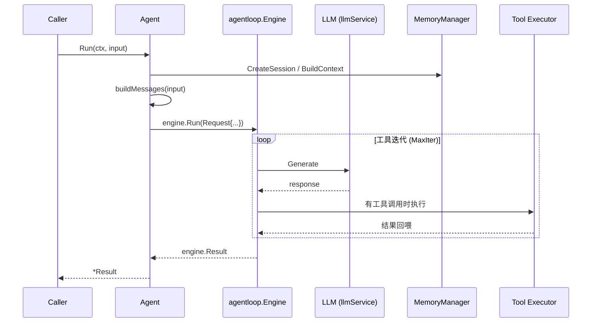
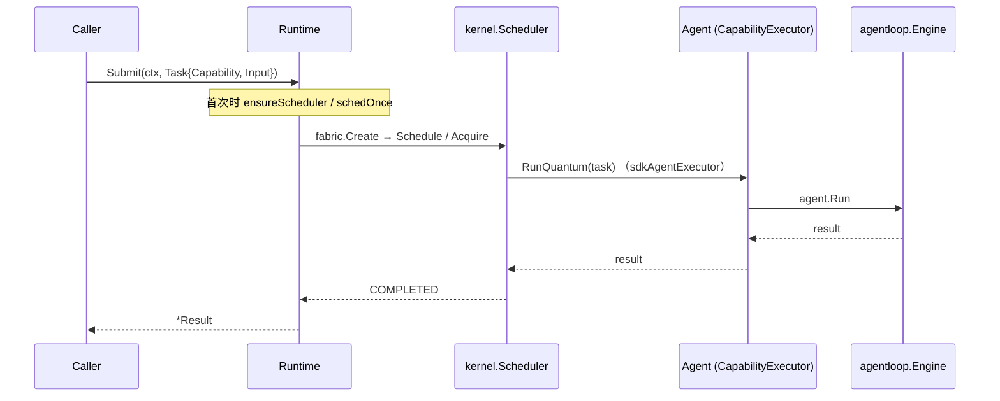
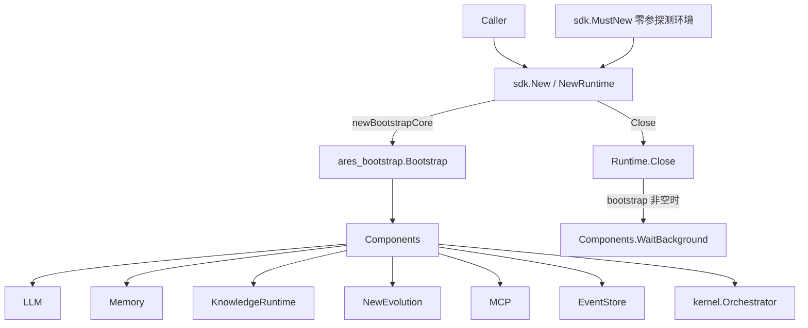

# ares 架构拆解 (XVII)：SDK 层——一个包把内部组件包起来

每个框架都有同样的最后一公里问题。内部很漂亮——干净的接口、可插拔的 provider、可组合的 pipeline。然后用户来了，问："怎么让它跑起来？"

SDK 包（`sdk/`）就是这条最后一公里的答案：一个 import，几个函数式选项，把 LLM、工具、内存、知识、进化、MCP 全部接起来。

说得直接点：这不是"一行代码启动一个 Agent"的魔法。是一个包把内部组件的接线收敛成一组调用。接线仍然是隐形的，但它被（大部分）关在了你的视线之外。

---

## 入口：三个构造函数，两个是你的错

真实代码里（`sdk/sdk.go`）有两条构造路径，加上一个零参快速入口：

```go
// sdk/sdk.go
func New(opts ...Option) (*Runtime, error) // 返回 error，给生产代码用
func NewRuntime(opts ...Option) *Runtime   // 出错就 panic，给 quickstart 用

// sdk/quickstart.go
func MustNew() *Runtime // 零参，自动探测环境，错了就 panic
```

注意 `MustNew` 的名字容易误导——它不是 `MustNew(opts...)`。它**没有参数**：内部探测本机环境（探测 localhost:11434 的 Ollama，或读 `OPENAI_API_KEY` / `ANTHROPIC_API_KEY`），自动套用对应 provider 选项，默认启用内存（无 embedding 服务时退化为纯压缩内存），失败就 panic（`regexp.MustCompile` 式的 fail-fast）。文档注释里的初衷是：零配置也能跑通。

真正的"带选项"入口是 `NewRuntime` / `New`：

```go
import "github.com/Timwood0x10/ares/sdk"

rt := sdk.NewRuntime(sdk.WithOpenAI("gpt-4o-mini"))
defer rt.Close()
agent := rt.NewAgent("assistant", sdk.WithInstruction("You are helpful."))
result, err := agent.Run(ctx, "hello")
```

`Runtime` 是顶层容器，真实字段（`sdk/sdk.go` 的 `Runtime` struct）包括：
- `llmSvc` — LLM 客户端（OpenAI、Ollama、Anthropic、OpenRouter，或自定义）
- `toolReg` — 工具注册表（内置、自定义、MCP 发现、AKF 工具）
- `memMgr` — 内存与蒸馏引擎
- `knowledgeRT` / `knowledgeStore` — AKG/AKF 知识图编译 + 检索
- `evolutionStore` / `evoComponents` — 策略进化
- `mcpClients` — MCP 连接
- `eventStore` — 事件后端（驱动的蒸馏就是订阅它）

构造函数会嗅探配置：`providerKeyHint` 会在缺 API key 时尽早打一条 `slog.Warn`（构造不致命，key-less 网关是合法的），而不是等到第一次 Run 才在 provider 侧冒 401。同样，`New` 在 LLM 初始化失败时返回 `agentloop.FriendlyErr` 包裹的错误。（待核实：这条 warning 本身的确切措辞以代码为准，但"构造期嗅探"的机制是真实的。）

### Runtime 的只读访问器

除了构造和关闭，`Runtime` 还暴露几个只读入口（`sdk/sdk.go`）：

| 方法 | 返回 | 说明 |
|------|------|------|
| `(*Runtime).ToolRegistry()` | `*tools.Registry` | 注册自定义工具 |
| `(*Runtime).GetModel()` | `string` | 当前模型名 |
| `(*Runtime).GetProvider()` | `string` | 当前 provider |
| `(*Runtime).KnowledgeStore()` | `knowledge.KnowledgeStore` | 知识存储（未启用时为 nil） |
| `(*Runtime).Snapshot()` | `kernel.Snapshot` | Bootstrap 核心的系统快照 |

---

## 选项面：函数式选项，零值即默认

`Option` 是 `func(*config) error`，所有配置走这条函数式选项路径。完整的运行时选项（`sdk/options.go`）：

| 选项 | 签名 | 做什么 |
|------|------|--------|
| `WithConfig` | `(path string)` | 从 YAML 加载配置 |
| `WithConfigFromEnv` | `()` | 读 `./ares.yaml`，`$ARES_YAML` 可覆盖路径 |
| `WithOpenAI` | `(model string)` | 配置 OpenAI provider |
| `WithOllama` | `(model string)` | 配置 Ollama provider |
| `WithAnthropic` | `(model string)` | 配置 Anthropic provider |
| `WithOpenRouter` | `(model string)` | 配置 OpenRouter provider |
| `WithBaseURL` | `(url string)` | 覆盖 API base URL |
| `WithAPIKey` | `(key string)` | 显式设 API key |
| `WithLLMConfig` | `(cfg *core.LLMConfig)` | 直接套整个 LLM 配置 |
| `WithFallbackLLM` | `(cfg *core.LLMConfig)` | 加故障转移 provider，可多次调用 |
| `WithDefaultMemory` | `()` | 现在是 no-op（内存默认开启），向后兼容保留 |
| `WithoutMemory` | `()` | 显式禁用内存 |
| `WithMemoryConfig` | `(maxHistory, maxSessions int)` | 调整内存大小 |
| `WithDistillation` | `(threshold int)` | 启用蒸馏，threshold=0 用组件默认 |
| `WithRAG` | `(topK int, minScore float64)` | 启用 RAG 检索注入 |
| `WithEmbeddingService` | `(url, model string)` | 注入外部 embedding 服务 |
| `WithPostgres` | `(cfg DatabaseFileConfig)` | 启用 PostgreSQL 存储 |
| `WithKnowledgeConfig` | `(cfg KnowledgeFileConfig)` | 调整检索分块和相似度 |
| `WithEvolution` | `()` | 启用策略进化 |
| `WithKnowledge` | `()` | 启用 AKF Knowledge Fabric pipeline |
| `WithAKGQualityGate` | `(q knowledge.QualityGateConfig)` | 配 AKG 事实质量闸门 |
| `WithAKGEmbedding` | `(model, baseURL string)` | 配 AKG 蒸馏/检索的 embedding |
| `WithKnowledgeProvider` | `(p provider.GraphProvider)` | 注册额外 GraphProvider，可多次 |
| `WithSQLiteKnowledgeStore` | `(dbPath string)` | 用文件版 SQLite 知识存储替代内存版 |
| `WithMCP` | `(conn MCPConn)` | 连接 MCP 服务器，可多次 |
| `WithTrace` | `(enabled bool)` | 开关逐步 trace 日志 |

一些实现细节值得注意：

- **`WithDefaultMemory` 已名存实亡。** `defaultConfig()` 里 `memCfg.Enabled` 默认就是 `true`，所以 `WithDefaultMemory` 现在只是把它再设一次——文档注释明确说它是 "a no-op kept for backward compatibility"。想关就用 `WithoutMemory()`。
- **`WithRAG` 有门槛**：`topK < 1` 或 `minScore` 超出 `[0,1]` 会返回 `ErrInvalidRange`。零值在这里不表示"默认"，而是非法。
- **错误仍是选项的一部分**：`Option` 返回 error，所以 `WithPostgres`（host 为空 → `ErrMissingValue`，端口越界 → `ErrInvalidRange`）、`WithEmbeddingService`、`WithSQLiteKnowledgeStore` 都会在 `New` 里把错误带回来。

Agent 选项是另一组（`func(*agentConfig)`）：

| 选项 | 签名 | 做什么 |
|------|------|--------|
| `WithInstruction` | `(string)` | 系统指令，prepend 到对话 |
| `WithTools` | `(...tools.Tool)` | 附加工具 |
| `WithHumanInput` | `(fn HumanInputFunc)` | 工具调用前的人审回调 |
| `WithMaxIterations` | `(n int)` | 封顶 ReAct 迭代次数 |
| `WithMaxTokens` | `(n int)` | 单次 run 的累计 token 预算 |
| `WithTimeout` | `(d time.Duration)` | 单次 run 的墙钟预算 |
| `WithToolDiscovery` | `()` | 运行时工具发现（暴露 discover_tools 元工具） |
| `WithToolSource` | `(s toolsource.ToolSource)` | 设发现来源，隐式开启 discovery |
| `WithToolSelector` | `(s toolsource.ToolSelector)` | 设工具池筛选，隐式开启 discovery |

**坦诚反思**：选项铺得很大，但每一条都对应 config struct 上的一个真实字段。配置结构体的问题在于不可组合——"给我生产配置但禁用内存"这种话说起来费劲。函数式选项可以叠加，也可以加新选项而不破坏现有调用方。

---

## Agent：`Run` 不内联循环

有了 `Runtime`，创建 Agent 很简单：

```go
agent := rt.NewAgent("assistant",
    sdk.WithInstruction("You are a helpful assistant."),
    sdk.WithTools(searchTool, calcTool),
    sdk.WithHumanInput(approveFunc),
    sdk.WithMaxIterations(10),
)

result, err := agent.Run(ctx, "What's 2+2?")
```

注意 `Agent.Run`（`sdk/agent.go`）**不自己内联 ReAct 循环**。它做三件事：
1. 创建内存会话（内存启用时）；
2. 构建消息列表（系统指令 + 内存上下文 + AKF 知识上下文 + 用户输入）；
3. 把 ReAct 循环（LLM 调用 → 工具执行 → 回喂）**委托给 `agentloop.Engine`**，再把引擎结果映射回 SDK 的 `Result`。

执行路径用一句话概括：



`Result` 结构体给你一切（`sdk/agent.go`，json tag 与字段名一致）：

```go
type Result struct {
    Output     string        `json:"output"`
    ToolCalls  int           `json:"tool_calls"`
    MemoryUsed bool          `json:"memory_used"`
    TokenUsage TokenUsage    `json:"token_usage"`
    Duration   time.Duration `json:"duration"`
}

type TokenUsage struct {
    Input  int `json:"input"`
    Output int `json:"output"`
    Total  int `json:"total"`
}
```

### 流式：别被骗了

`Stream` 返回一个 channel：

```go
ch, err := agent.Stream(ctx, "hello")
if err != nil { return err }
for chunk := range ch {
    if chunk.Err != nil { return chunk.Err }
    fmt.Print(chunk.Content)
    if chunk.Done { break }
}
```

**坦诚反思**：这是**模拟流式**。`agent.Stream` 的实现在一个 goroutine 里先跑完完整的 `agent.Run`，然后把 `result.Output` 按 10 个 rune 一块发进 channel（`chunkSize := 10`），最后发一个 `Done=true` 且带上 `Result` 的块。真正的 token 级流式需要对 LLM 客户端做更深的改造，这是已知限制。channel 是带缓冲的（`make(chan StreamChunk, 32)`）。`StreamChunk` 的字段是 `Content`、`Done`、`Err`、`Result`。

---

## 多 Agent：平等 capability + 共享调度器

老式 Leader-Sub 编排已不在 SDK 里。多 Agent 现在的模型是：把每个专家按 capability 注册到 Runtime，按 capability 提交任务，由**共享的 `kernel.Scheduler`** 做匹配和调度（`sdk/task.go`）：

```go
// 注册：capability 是 key，agent 以 capability 命名
rt.RegisterAgent("researcher", sdk.WithInstruction("You research LLM frameworks."))
rt.RegisterAgent("writer", sdk.WithInstruction("You write clear summaries."))

// 提交：走和内核同一条调度路径
result, err := rt.Submit(ctx, sdk.Task{Capability: "researcher", Input: "Research the top 3 LLM frameworks"})
```

几个真实细节：

- `Task` 是刻意精简的：`ID`（可选，空则由运行时分配）、`Capability`（精确匹配已注册 capability，空则任意已注册 agent 接）、`Input`、`Timeout`。
- `RegisterAgent`：同一个 capability 第一个注册的赢得 slot，后注册的不覆盖它；capability 为空默认 `"agent"`。它返回的 `*Agent` 也能直接 `Run`——`Submit` 是统一入口，但**不是唯一入口**。
- `Submit` 走 `submitThroughScheduler`，经过 **fabric.Create → kernelscheduler（Schedule → Acquire → RunQuantum）→ COMPLETED → result** 这条和内核完全共享的路径，没有旁路的直接 run。
- 懒初始化：scheduler 和相关 fabric 是**第一次 `Submit` 时**才用 `sync.Once` 启动的（`schedOnce`）。
- 当 capability 没有预注册 agent 时，Submit 会按 capability 现建一个——"不能因为没预注册就拒绝一个格式良好的任务"。



需要拆分的 Agent 自主决定：SDK 会把 `spawn_agent` / `create_task` 内核 syscall 注册进 tool registry，append 到每个 agent 的工具列表（`sdk/syscall.go`，`wireSyscalls` 在首次 Submit 时执行，`syscallTools`/`syscallKernel` 在首次 Submit 前为 nil）——拆分是 Agent 的认知决策，而不是框架预定义的团队名册。参考示例 `examples/_fixtures/27-peer-spawn-demo`（已存在）。

---

## 配置驱动：YAML → Option

生产环境用 YAML 配置比堆一堆选项更干净。`config.go` 提供：

```go
cfg, err := sdk.LoadConfigFile("ares.yaml") // 读取 + 解析 + 校验
opts, err := cfg.ToOptions()                // 转成 []Option
rt := sdk.NewRuntime(opts...)               // 或 New 接收 error
```

`LoadConfigFile` 返回 `*ConfigFile`，它暴露 `Validate()` 和 `ToOptions()`。章节结构（yaml tag 与源码一致）：

| 章节 | 类型 | 说明 |
|------|------|------|
| `llm` | `LLMFileConfig` | provider / model / api_key / base_url / temperature / max_tokens / max_prompt_length |
| `database` | `DatabaseFileConfig` | host / port / user / password / database / ssl_mode |
| `embedding` | `EmbeddingFileConfig` | service_url / model |
| `memory` | `MemoryFileConfig` | enabled / max_history / max_sessions / enable_distillation / distillation_threshold / enable_rag / rag_top_k / rag_min_score |
| `knowledge` | `KnowledgeFileConfig` | chunk_size / chunk_overlap / top_k / min_score / quality / embedding |
| `tools` | — | builtin / mcp |
| `reflection` | — | enabled |
| `evolution` | — | enabled |

**零值即默认**是贯穿原则：章节留空就回退到组件默认值。但有几处例外要小心：

- `memory.enable_distillation` 是三态的（`*bool`）：`nil` 默认 = true（`DistillationEnabled()` 判断），这在 SDK YAML 和 serve YAML 间保持一致。
- `memory.rag_top_k=0` 在 `EnableRAG` 为 true 时是非法（必须 `>=1`），和"零值=默认"语义相反——只在 RAG 开启时才校验。
- `memory.distillation_threshold=0` 表示"ungated"（每次事件都触发），代码会原样透传而不是替换成默认值，让用户能在 YAML 里显式表达"无门槛"。
- `knowledge.quality.min_final_score` 是 quality gate 的触字段：`>0` 才把整个 gate 结构套进去，否则用包默认。
- 校验在 `Validate()` 里集中做（`validateLLM`/`validateMemory`/`validateKnowledge`），范围错误包装 sentinel error：`ErrNilConfig`、`ErrInvalidRange`、`ErrMissingValue`、`ErrNilProvider`。

`LLMFileConfig` 里有个值得注意的修复：`max_prompt_length` 曾经存在于 `core.LLMConfig` 但没人接线，YAML 里的值被静默丢弃，导致长 run 死在 provider 默认的 8192 上；现在 `ToOptions()` 用匿名 Option 把它桥进 `cfg.llmCfg.MaxPromptLength`。

---

## 绑定 Bootstrap：SDK 与 serve/start 共享同一核心

关键的架构事实：**SDK 不再自己拼一套平行的运行时图**。`New` 里调用 `newBootstrapCore`（`sdk/bootstrap_runtime.go`），它把 SDK 配置映射成 `ares_config.Config`，然后调用统一的装配内核 **`ares_bootstrap.Bootstrap(ctx, cfg, deps)`**（`internal/ares_bootstrap/bootstrap.go`），拿回一个 `*ares_bootstrap.Components`——serve/start 用的也是它。这样 SDK 复用同一个 EventStore / NewEvolution / Memory / KnowledgeRuntime 实例，而不是各来一套。



两条约束：

- **可回退**：`newBootstrapCore` 在配置**不是 Bootstrap 能表达的**（`sqliteStorePath != ""` 或 `len(extraProviders) > 0`，见 `bootstrapCapable`）或装配失败时返回 nil，SDK 退回到自己的接线（`sdk.go` 里那套 wireMemory / wireMCP / wireKnowledge / wireEventBackend）。所以 Bootstrap 的回归不会搞挂 SDK 构造——只是少了一条统一路径。
- **所有权转移**：成功路径上 bootstrap 的 lifecycle context 的所有权交给 `Runtime`，`Close()` 先 cancel 它、再 `bootstrap.WaitBackground()` 排干后台协程（蒸馏订阅者、GA ticker、LLM suggestion ticker），保证没有协程活过 Close。错误路径上 defer cancel 防 context 泄漏。

`Components` 上还有三个只读的运维方法（`internal/ares_bootstrap/bootstrap.go`）：`Snapshot() kernel.Snapshot`、`ComponentStatus(name) (ComponentStatus, bool)`、`IsSystemReady() bool`。SDK 的 `Runtime.Snapshot()` 就是透传 `r.bootstrap.Snapshot()`（bootstrap 为 nil 时返回空快照，调用方无需判 nil）。

---

## Evolution：不是"自动进化"，是显式 `Evolve`

不要把 `WithEvolution()` 误解成"自动调优你的 prompt"。SDK 层面进化是**显式调用** `(*Runtime).Evolve(ctx, agent, task) (string, error)`（`sdk/evolve.go`）：你必须自己提供 agent 和 task，它跑一个 GA 循环并返回进化的指令。

具体机制（全部在代码里）：创建基础策略（含两个可进化维度）、造 mutator 和 crossover、初始化 GA 种群，跑 **3 代**，每代用**实际执行**打分（`executeAndScore`：成败 + 时延 + token 效率，无 LLM 参与），最后取最佳策略，把参数 apply 回 agent，并返回把策略参数拼接进原指令的字符串（`buildEvolvedInstruction`），好让你用 `WithInstruction` 重建 agent。

```go
newInstruction, err := rt.Evolve(ctx, agent, "Summarize this doc")
if err != nil { return err }
rebuilt := rt.NewAgent("optimized", sdk.WithInstruction(newInstruction))
```

两个可进化维度（`paramToolSelector`、`paramSearchDepth`）只在有 Agent 级 backing field 时才进化：
- `tool_selector` → 过滤 `agent.tools`（auto / manual / priority）
- `search_depth` → 设 `agent.maxIter`（更深的搜索 = 更多 ReAct 迭代）

曾经的 `scheduler_strategy`、`memory_threshold`、`recovery_strategy` 维度被移除了——它们是内核/运行时概念，没有 Agent 级字段可背。代码里明说："进化无法应用的维度是不诚实的：GA 会在一个对执行毫无影响的空间里搜索。"

不要把它包装成演示话术。`Evolve` 是重操作：它要真跑 agent 若干次来打分（种群 10、精英 2、突变率 0.3、存活率 0.5），3 代下来是几十次 Run。它是评估/离线工具，不是每次请求的路径。`WithEvolution()` 只是让你有资格调用它（`Evolve` 在 `!r.evoEnabled` 时直接报错 "evolution not enabled (use WithEvolution())"）。

---

## 运行预算：让 Agent 有限度地自主

`WithMaxTokens` 和 `WithTimeout` 通过 `agentloop.Request` 透传给执行引擎，限制单次 run 的资源消耗（`sdk/options.go` 的文档注释，对应"有界自主执行"原语）：

```go
// WithMaxTokens caps the cumulative prompt+completion tokens across all LLM
// calls in one agent run. When the budget is exceeded the run stops early and
// returns "max tokens reached" instead of burning more iterations.
// Values <= 0 mean unbounded (default).
func WithMaxTokens(n int) AgentOption

// WithTimeout caps the total wall-clock duration of one agent run. When the
// deadline passes between LLM calls the run stops and returns "timeout
// reached". Values <= 0 mean no time budget (default).
func WithTimeout(d time.Duration) AgentOption
```

- **token 预算**：累计（prompt + completion），超额即提前停止——返回 `max tokens reached`，而不是烧更多迭代
- **墙钟预算**：两次 LLM 调用之间检查 deadline，超时返回 `timeout reached`
- **默认无界**：`<= 0` 表示不设限（与旧行为一致），显式设置才生效——延续零值哲学（注意 `WithMaxTokens`/`WithTimeout` 内部 `if n>0`/`if d>0` 才写字段）
- **透传**：两者作为 `Agent` 的字段，`Run` 把它填进 `agentloop.Request` 传给 Engine

---

## 教训

SDK 层不光鲜。你不能给投资人演示 `NewRuntime` 然后说"看，几行！"——它仍然是接线，只不过被收敛进了包和选项里。

但这层做的事是真实的：入口统一（三选一的构造）、配置有校验（范围错误不晚到运行时才炸）、错误尽早暴露（构造期 key 嗅探）、执行路径唯一（Run 委托给 agentloop.Engine；Submit 走共享 scheduler，没有旁路）、组件共享（SDK 和 serve/start 复用同一 Bootstrap 核心）。这些是可以在代码里一行行对得上的承诺。

**最好的 SDK 是你注意不到的那个。** 你调 `NewRuntime`，得到一个能用的 Agent，专注你的逻辑。接线是隐形的，但这次它是被包住了，而不是藏在你桌上一个没人敢改的 bootstrap 文件里。