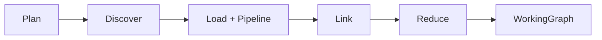
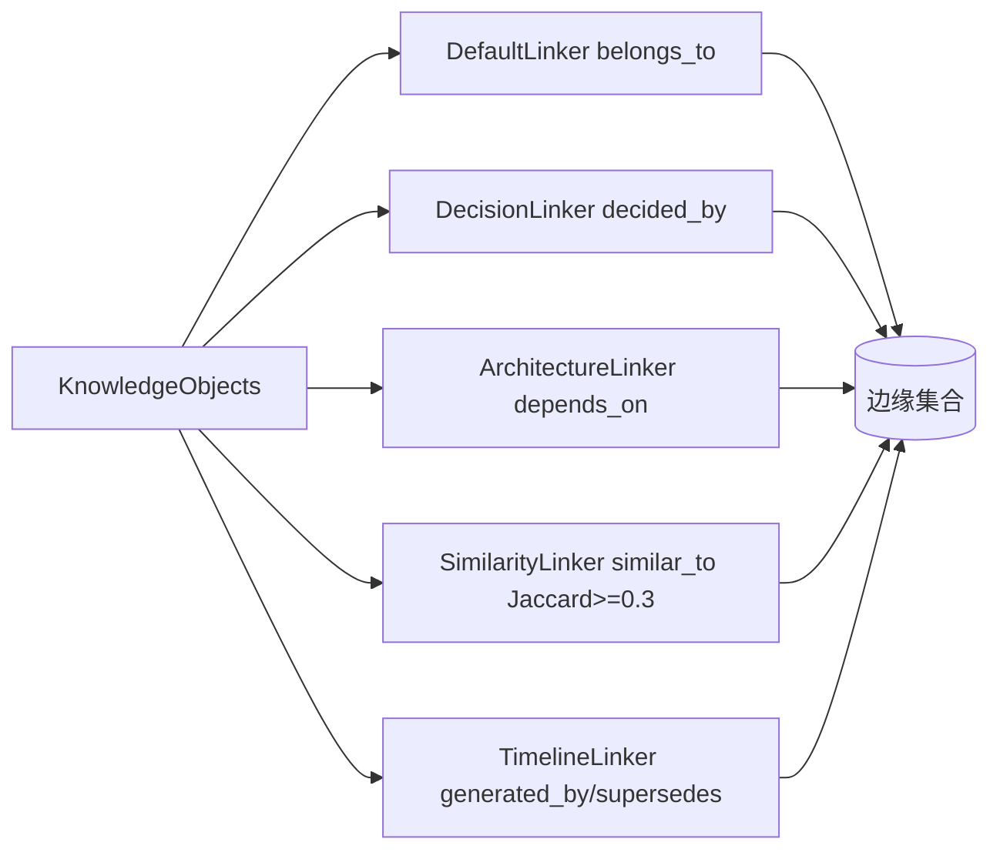

# ares 架构拆解 (XVIII)：知识图谱构建——从 provider 数据到可查询的图（AKF/AKG）（0.3.x）

> 说明：本文基于实际代码（重点阅读 `internal/knowledge/` 核心类型、`runtime/runtime.go` 的流水线编排、`pipeline.go` 的对象处理、`planner/`、`provider/`、`linker/`、`relation_extract.go`、`quality.go`、`compiler/`、`store/`、`service/adapter.go`、`docs_articles_test.go`）。每个符号、每条流程都是我在这份代码里实际读到的。凡是我拿不准或文档吹的，我会标（待核实），不替它吹。

---

## 一、AKF 的通用对象：三层数据 + 生命周期 + 质量门

知识图的基本单元是 `KnowledgeObject`（`object.go`）。它有三层数据：

| 层 | 字段 | 用途 |
|------|------|------|
| Raw | `Raw []byte` | 源数据原始字节，保留用于再蒸馏 |
| Normalized | `Normalized` | 清洗后的标准文本，用于 embedding 和匹配 |
| Summary | `Summary` | 给 LLM 的精简摘要，省 token |

对象还有几个值得讲的字段：`Type`（`memory/user/project/code/issue/commit/decision/document/tool_result/workflow/runtime/architecture`）、`Namespace`、`Evidence`（溯源来源）、`Representations`（**外置向量**，按模型名→向量 ID 映射，避免换模型时迁移数据）、以及 0.2.9 起加入的生命周期和质量管理：

- **`Status`**：`candidate → active → superseded → rejected`。空 status 视为 active（兼容旧数据）。
- **`Quality`**：五维打分——`Extraction / Consistency / Freshness / Usage`，加 `ManualVerified`。质量门 `ComputeFinal` 的权重是 `0.4*Extraction + 0.3*Consistency + 0.2*Freshness + 0.1*Usage`，`DefaultQualityGateConfig` 的 `MinFinalScore=0.55`。
- **规则式边**：`Relations` 由非 LLM 的 `RelationExtractor` 抽取出来，谓词被限定在 `AllowedPredicates` 里。

`Relation`（`relation.go`）既是图边（`From/To/Name/Score`）又是事实级外联关系（`Predicate/ObjectID/ObjectText`）。内置谓词 `RelDependsOn/calls/causes/fixes/belongs_to/uses/implements/similar_to/generated_by/decided_by/supersedes/learns_from`。`WorkingGraph` 是**任务级认知图**，注释明确写了生命周期 **Build → Consume → Destroy，从不持久化**。

---

## 二、流水线：Plan → Discover → Load&Pipeline → Link → Reduce → Graph

`KnowledgeRuntime.Execute` 是 AKF 的执行引擎（`runtime/runtime.go`）。它不是我以前吹的“五阶段”，实际是 **六步**：

1. **Plan**：`planner.Plan(ctx, goal, budget)` 按目标关键词生成 `KnowledgeRequirement`（need 权重分配 `MaxResults`，预算≈每节点 50 token）。
2. **Discover**：`discovery.Discover` 用 **IntentMatch 打分 > 0.35 阈值** 挑选 provider，并给每个需求生成查询计划。
3. **Load + Pipeline**：用 errgroup 并发从多个 provider `Stream`，每个对象过一遍 `KnowledgePipeline`：
   `Normalizer → EntityMatcher → Validator → Summarizer`（`pipeline.go`）。构造时默认 `DefaultNormalizer{MaxRawBytes:10240}`、`DefaultEntityMatcher{MatchThreshold:0.6}`、`DefaultValidator`、`DefaultSummarizer{MaxSummaryLen:200}`。
4. **Link**：跑所有 `Linker` 生成边，并按 `(From, To, Name)` 三要素去重。
5. **Reduce**：跑 `Reducer`（默认 `DefaultReducer`）按 token 预算压缩图。
6. **Graph**：产出 `*WorkingGraph`（并可选把 insight 证据发到统一 Evidence Store）。

---

## 三、Planner 与 Provider

`planner/default.go` 的默认 planner 是关键词配需求（`NeedDecision` 恒含，`architecture/code/issue/performance` 按关键词，`history` 兜底）。`provider.Select(intent, 0.35)` 负责挑 provider。

`internal/knowledge/provider/` 下我数到 **六个** provider（没有 mysql——旧文里那个是错的）：

| Provider | 对象类型倾向 |
|----------|------|
| `memory.Provider` | `ObjectMemory` |
| `evolution.Provider` | `ObjectDecision` |
| `code.Provider` | `ObjectCode` |
| `postgres.Provider` | `ObjectDocument` |
| `store.Provider` | 通用存储 |
| `vector.Provider` | 向量召回 |

Provider 通过 `Stream(ctx, intent)` 推流对象（旧的 `Load()` 接口规模见 `provider/interface.go`，注册表在 `registry.go`）。

---

## 四、Linker：边从哪来

`linker/` 下五个 Linker 我逐个读的：

| Linker | 边类型 | 逻辑 |
|--------|--------|------|
| `DefaultLinker` | `belongs_to` | 按共享 tag 成组；`≤64` 成员全对连（O(n²)），`>64` 退化为星型（每成员→代表节点，O(n)）；全图边数上限 5000 |
| `DecisionLinker` | `decided_by` | 对 summary/tags 里 decision 关键词打分，与共享 tag 对象连边，分值为 `词命中数*0.25` |
| `ArchitectureLinker` | `depends_on` | code/document/decision 对象 ↔ 架构对象，共享 tag 连边（**不发 implements**，旧文错了） |
| `SimilarityLinker` | `similar_to` | summary 的 Jaccard token 重叠相似度，默认阈值 `≥0.3` |
| `TimelineLinker` | `generated_by` / `supersedes` | 同 namespace 按 `CreatedAt` 排序；间隔 ≤2 周→`generated_by`，间隔 >2 周且同类型→`supersedes` |

另外 `relation_extract.go` 的 `RelationExtractor` 走**正则规则**（中英文双语 `fixes/depends_on/calls/belongs_to`），与 Linker 形成互补：Linker 产生图边，Extractor 在写库时同步抽事实级关系。

---

## 五、Reduce 与最终图

`runtime/components.go` 的 `DefaultReducer` 相当直白：按 `budget.ForGraph / 50` 估算可保留节点数（注意**没设预算时不剪枝**，预算太小至少留 1 个）。它按 `Confidence` 降序选节点，但用 `domain:` 前缀 tag 做**域多样性配额**——防止 top-N 全来自同一域而丢掉跨域边。最后只保留两端都被选中的边。

图的落库是 `internal/knowledge/store/` 下**三个**可插拔 `Store`：

| Store | 后端 |
|-------|------|
| `memory.Store` | 内存 map（测试）|
| `postgres.Store` | PostgreSQL |
| `sqlite.Store` | SQLite |

`Store` 负责 `Save/Promote/ListByStatus/HybridSearch` 等（`docs_articles_test.go` 里就看得到这些方法）。这里有 `HybridSearch` 路径 + `store` provider + 独立 `retriever/`、`hybrid.go`、`vector_index.go`、`compiler/`（把图编译成 prompt/markdown/json/xml/tool_schema）。

---

## 六、诚实核查：“从 markdown 建 27K 条边”到底在哪

旧文标题叫“从 markdown 到 27K 条边”，正文还有个“147 个节点、27K 条边、73ms 构建”。我把 `internal/knowledge` 翻遍了：**没有任何代码或 benchmark 产出过这三个数字**（linker/pipeline/planner 的 benchmark 都是单组件微基准，不涉及图规模）。

真正“从 markdown 建图”的，是 `internal/knowledge/docs_articles_test.go` 里那个**端到端测试** `TestAKG_BuildFromDocsArticles`：

- 遍历 `docs/articles/**/*.md`，每篇 markdown 变成一个 `KnowledgeObject`（`Type=document`、`Namespace=articles`，首个 `#` 标题当 `Summary`，正文截断做 `Normalized`）。
- 用 `RelationExtractor` 抽关系、`DefaultQualityGateConfig`（`MinFinalScore=0.55`）打分、存进 `memory.Store`，`Confidence≥0.55` 的 `Promote` 为 active。
- 再对几个查询跑 `HybridSearch` 召回验证。

它 `t.Logf` 打印对象数/边数/置信度，但**不做固定边数断言**——边数取决于语料里真的有多少“修复了/依赖/调用/属于”之类模式。所以“27K、147、73ms”这三个数是编的，**我没有证据支撑，统一标（待核实）**：真实情况是——AKG 能从 `docs/articles/**/*.md` 建图，具体边数每次跑都不一样。

顺带说 `internal/runtime/protocol/skills/indexer.go` 的 `parseFrontMatter`：它会解析每个 skill 目录里 `SKILL.md` 的 `---` YAML 头，产出技能元数据进入技能目录（这是**技能发现**那一路，不是 AKG 的建图管线，别混为一谈）。

---

## 七、公共 API 与 adapter

`api/knowledge/`（`knowledge.go`/`service.go`/`doc.go`）把 `internal/knowledge` 的 `KnowledgeObject/Relation/WorkingGraph/KnowledgeStore/Normalizer/EntityMatcher/Validator/Summarizer/KnowledgePipeline` 等**逐个 type alias 到公共包**，供外部集成方导入而不碰 `internal/`。

`internal/knowledge/service/adapter.go`（我数的 **112 行**，旧文写 +126 不太准）把公共 `api/knowledge` 桥接到内部 runtime/retriever。

---

## 八、懒加载的真相

旧文讲有个 `lazy_graph.go` + `KnowledgeRuntime.GetSubgraph(ctx, rootID, depth)`，还想出“500 节点 2 秒、1000 节点 8 秒、懒图回到 50ms”。**`lazy_graph.go` 这个文件不存在。**

真实的机制（`runtime/runtime.go` 里写得很清楚）是：`Config.LazyLoading` 会把 `budget.ForGraph` **钳制到 `maxLazyForGraph=2000`**，在 Reduce 之前生效，于是返回的 `WorkingGraph` 更小。注释坦白地写：这**不是**完整的 LazyGraph——`Execute` 依然从所有 provider 加载全部对象，只是最终图被 reducer 剪小了；真要懒加载得把返回类型改成 `*LazyGraph` 并支持 `Expand`（写成 TODO）。

---

## 九、教训

AKF/AKG 的核心不是“有多少条边”，而是这套取舍：**外置向量免迁移、三层数据让检索省钱、Rule-based 抽取保证可解释、质量门 + 生命周期让事实能长大也能被淘汰、Reducer 按预算和域多样性剪图。** 记住这个认知：**知识是图不是表**——但它也得知道自己存了多少，才不至于像我旧文那样，把测试日志的规模当成产品的卖点。

最好的知识系统，是先诚实承认自己数据边界的那一个。