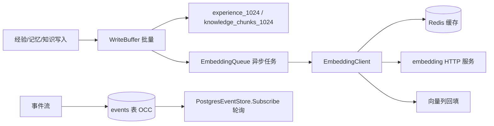
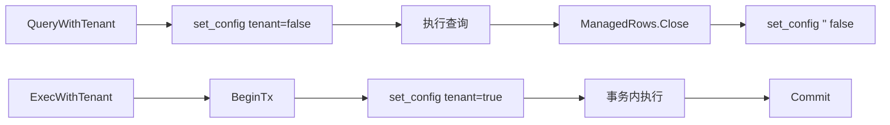
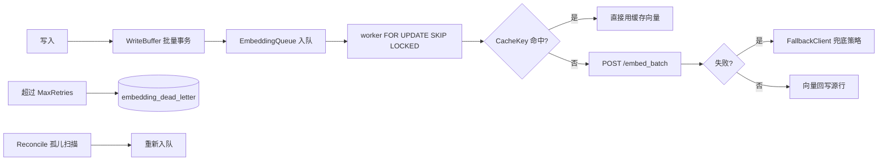

# ares 架构拆解 (XIX)：存储层——一切的基石（0.3.x）

> 说明：本文基于实际代码（重点阅读 `internal/storage/` 全包、`internal/storage/postgres/migrate*.go` 的 DDL、`internal/storage/postgres/{pool,circuit_breaker,write_buffer,timeout,embedding_queue,base_repository}.go`、`internal/storage/postgres/embedding/` 与 `internal/storage/postgres/repositories/`、`internal/ares_events/pg_store.go`）。每个符号、每条流程都是我在这份代码里实际读到的。凡是我拿不准或配置了但没亲眼看到接线的部分，我会标（待核实），不替它吹。

---

## 一、先说清楚：存储层到底存了什么

arses 里 Memory、Experience、Knowledge、Events 都要落地。它们落在哪？答案全都汇集在 `internal/storage/postgres/` 的迁移文件里。我把它拆成三组，都是 DDL 里我亲眼读到的表。

**组 1——向量与经验（`migrate_storage.go`，全部上了 RLS + IVFFlat 向量索引）**

| 表 | 存什么 | 关键列 / 索引 |
|------|------|------|
| `knowledge_chunks_1024` | RAG 知识块，固定 1024 维 | `embedding VECTOR(1024)`，默认模型 `intfloat/e5-large`，`embedding_status`(pending/completed)、`content_hash` 去重、`tsv TSVECTOR` + GIN、`document_id/chunk_index`、`metadata JSONB`；向量索引 `ivfflat (embedding vector_cosine_ops) with (lists=100)`，**PARTIAL ON `embedding IS NOT NULL`** |
| `experiences_1024` | Agent 经验（蒸馏产物），1024 维 | `type` CHECK 限 `success/failure/query/solution/pattern/distilled`，`score`、`decay_at`（默认 `NOW()+30 days`）、`usage_count`、`agent_id`；同样 `ivfflat vector_cosine_ops lists=100`（partial） |
| `tools` | 带语义 embedding 的工具 | `name`+`tenant_id` 唯一，`tags TEXT[]` + GIN，`usage_count/success_rate/last_used_at`，`ivfflat` |
| `conversations` | 会话历史（**无向量**） | `session_id/user_id/agent_id/role/content/expires_at`，若干 btree 索引 |
| `task_results_1024` | 任务执行结果，1024 维 | `input/output JSONB`、`status/latency_ms`，`ivfflat` |
| `secrets` | 加密敏感数据 | `value BYTEA`（默认 `aes-gcm`）、`key_version`、`(tenant_id,key)` 唯一 |
| `embedding_queue` / `embedding_dead_letter` | 异步 embedding 任务队列 / 死信 | dedupe_key 唯一幂等、status 索引 |
| `distilled_memories` | 跨会话蒸馏记忆，1024 维——**已废弃**（M5 前删除读写路径；DDL 保留仅为存量库幂等） | `memory_type` CHECK `preference/interaction/profile/knowledge`、`importance`、`expires_at`（默认 90 天）、`content_hash` + `(tenant_id, content_hash)` 唯一去重，`ivfflat lists=100` |

**组 2——事件溯源与进化（`migrate.go`，核心表，多数无 RLS）**

| 表 | 存什么 |
|------|------|
| `user_profiles` / `sessions` / `recommendations` | 用户画像 / 会话 / 推荐（老版本遗留，seed 用户也在这） |
| `embeddings` | **VECTOR(1536)**——注意这张表维度是 1536，和上面那组 1024 的向量表不是一个向量空间 |
| `agent_checkpoints` | Agent 恢复点（session/status），原 `leader_checkpoints` 改名而来 |
| `events` | 事件溯源，`payload/metadata JSONB` + `version BIGINT`，唯一索引 `(stream_id, version)` 做乐观并发 |
| `event_summaries` | 事件压缩窗口摘要（`start_version/end_version`、`tools_called/errors/tasks_created` 等聚合 JSONB） |
| `evolution_strategies` / `evolution_rollback_events` | 进化系统的策略持久化与回滚审计 |

**组 3——事件读路径（`internal/ares_events/pg_store.go`）**

`PostgresEventStore` 把事件写到上面的 `events` 表，用**乐观并发控制**：`Append` 先读当前 `MAX(version)`，`expectedVersion>0` 且不匹配就返回 `ErrVersionConflict`（还兜底捕了 PG 唯一冲突 23505）。`Subscribe` 是每 1 秒轮询 `events`（默认读取上限 100），做成 `<-chan *Event`。



一句话总结：**语义检索活在 1024 维的 IVFFlat 表里，事件活在带版本的 `events` 表里，进化策略有自己的持久化表——它们共用同一个 `Pool`。**

---

## 二、访问安全：Pool 连接管理 + RLS 租户隔离

`pool.go` 的 `Pool` 包装 `database/sql`，核心是 `Get → 用 → Release`（`WithConnection` 封装）。真正有意思的是两点：

1. **`ErrMissingTenantID`**（`pool.go`）：任何租户感知查询不带 tenantID 会快速失败，防止跨租户静默泄漏（注释指名 P1-11）。
2. **连接级 RLS**（0.3.0）：`QueryWithTenant` 在连接上 `SELECT set_config('app.tenant_id', $1, false)`（`is_local=false`，能跨过 autocommit 边界），返回的 `ManagedRows.Close()` 会用 `clearTenantContext`（`set_config('app.tenant_id', '', false)`）清场，避免把租户上下文带回池子；`ExecWithTenant` 则用事务包裹（`BeginTx → set_config(true) → Commit`）。向量表都建了 `CREATE POLICY ... USING (tenant_id = current_setting('app.tenant_id', true))`，配合这套连接级 set_config 才真正生效。



---

## 三、故障隔离：CircuitBreaker

`circuit_breaker.go` 的三态是 `closed / open / half-open`。它有个我特别想讲的语义：**`failureCount` 追踪的是「连续失败」**——每次成功都归零（`RecordSuccess` 在 Closed 态把计数清零）。`failureThreshold` 因此是“连续 N 次失败才断开”，而不是累计失败。half-open 进一个探针，`successThreshold=3` 次成功才回 closed，一次失败立刻重新 open。另有一条每 5 分钟的清理协程防 `halfOpenInflight` 计数泄漏。

---

## 四、写入与异步 embedding：WriteBuffer → EmbeddingQueue

`write_buffer.go` 把写入先落进内存 channel，后台循环攒到 `batchSize` 或 `flushInterval` 到期就刷。三个诚实的细节：

- **批量的是「数据库写入」**。`flushBatch` 在单个事务里批量 INSERT 到 `knowledge_chunks_1024`/`experiences_1024`（唯一支持的两张表，其他表名直接报错）。合并写入确实省了往返。
- **`embedding` 不是批量发的**。笑笑说一句：旧文里写的“攒 50 条发一个批量 embedding 请求、削减 80% 调用”是我编的，代码里**没这回事**。真实逻辑是每个写入项在同一个事务里各 `EnqueueTx` 一条**异步 embedding 任务**，向量由后面的 worker 回填，全程 `embedding` 列塞的是 `NULL`（因为全零向量是合法向量，会被 partial ivfflat 捡起来返回无意义距离）。
- **失败不静默丢**：flush 失败会重试（指数退避，最多 3 次），重试耗尽后把整批重新入队而不是丢弃（注释点明曾有丢数据 bug）。

`embedding_queue.go` 是这条链的关键：`embedding_queue` 表里的任务带 `dedupe_key`（`sha256(table|task_id|tenant_id)`），保证**每个源行最多一条队列记录**；worker 用 `FOR UPDATE SKIP LOCKED` 领任务，`MarkFailed` 超 `MaxRetries`（默认 3）就搬进死信表；`Reconcile` 会周期性捞“该有向量却一直 NULL”的孤儿行重新入队，保证最终一致。

异步 embedding 的客户端在 `internal/storage/postgres/embedding/`：

```
embedding/
├── service.go   # EmbeddingClient 实现 internal/embedding.EmbeddingService（api/embedding 为 deprecated 转发；空壳断言）
├── cache.go     # EmbeddingCache：Redis + 内存双栈，BLAKE2b-128 键
├── client.go    # HTTP 客户端：/embed、/embed_batch、/health
├── fallback.go  # FallbackClient：兜底策略（纯缓存 / 触发关键词 / 直接报错）
└── log.go       # 作用域 logger
```

缓存键是 `normalizedText|model|method`（`getCacheKey`：BLAKE2b-256 截 128 位，前缀 `embed:`）。**这点是真的**：键里带了 `model`（配置的 embedding 模型），不会在换模型后拿到旧模型的陈旧向量。



---

## 五、操作级超时

`timeout.go` 的 `DefaultTimeouts` 我看的是：

| 操作 | 超时 |
|------|------|
| Query | 30s |
| Insert / Update / Delete | 20s |
| Transaction | 60s |
| VectorSearch | 10s |

每个 `With*Timeout` 都在“上下文已有 deadline”时原样返回，避免覆盖调用方意图。还有 `config.go` 的 `DefaultEmbeddingConfig`：`MaxBatchSize=32`、`MaxRetries=3`、`MaxVectorSearchLimit=1000`、`EmbeddingTimeout=30s`。

---

## 六、Repository 与迁移

`repositories/` 按域分：`conversation` / `distilled_memory` / `experience` / `knowledge` / `secret` / `strategy` / `task_result` / `tool`，模型集中在 `models/`（`conversation/experience/knowledge/secret/task_result/tool`）。**注意**：并没有一个独立的 `query/` 包——公共 SQL 帮手（`GetByID/DeleteByID/CountByTenant` 和动态表白名单 `allowedTables`）在 `postgres/base_repository.go` 和 `query_utils.go`。凡是要往动态 SQL 里塞表名的，必须先过 `allowedTables` 白名单，防止注入。

迁移（`migrate.go` / `migrate_storage.go` / `migrate_eval.go` / `migrate_evolution.go`）是**一组幂等 DDL 语句**，`MigrateStorage`/`Migrate` 启动时顺序执行。诚实说：**它没有 schema 版本表**。`RollbackLast` 直接返回 `ErrRollbackUnsupported`——注释里写了 TODO：想要真正可回滚，需要引入 `schema_migrations` 版本表。

---

## 七、诚实更正（旧文 vs 代码）

旧版这篇有几处我这次必须划掉：

1. **编号/行数**：旧文写“57 个文件、14,112 行”。实测 `internal/storage` 共 **95 个 `.go` 文件、约 33,201 行（含测试）**；`postgres` 包不含测试约 **14,447 行**。
2. **batch embedding**：旧文“攒 50 条发一个批量 embedding、削减 80% API 调用”是无中生有——批量的是事务里 INSERT，embedding 是按行异步入队。
3. **`embedding_queue.go` 位置**：它在 `postgres/` 根包，不在 `embedding/` 子包；`embedding/` 子包只放缓存/客户端/兜底/服务。
4. **迁移“版本化”**：它是幂等 DDL，没有版本表，也没法回滚。

---

## 八、教训

存储是没人讨论直到它坏掉的那一层。但代码里真正的重点不是“四层保护”的口号，而是这些具体的取舍：**连接级 RLS + set_config 的租户隔离、连续失败才断路的断路器、按行异步 + 孤儿 reconcile 的最终一致、以及一条动态表名白名单。** 它们各自都对应过一次事故或一个安全修复（注释里全写着）。

最好的存储层是你忘记它存在的那一个——但它存在，而且每一行都是拿教训换来的。