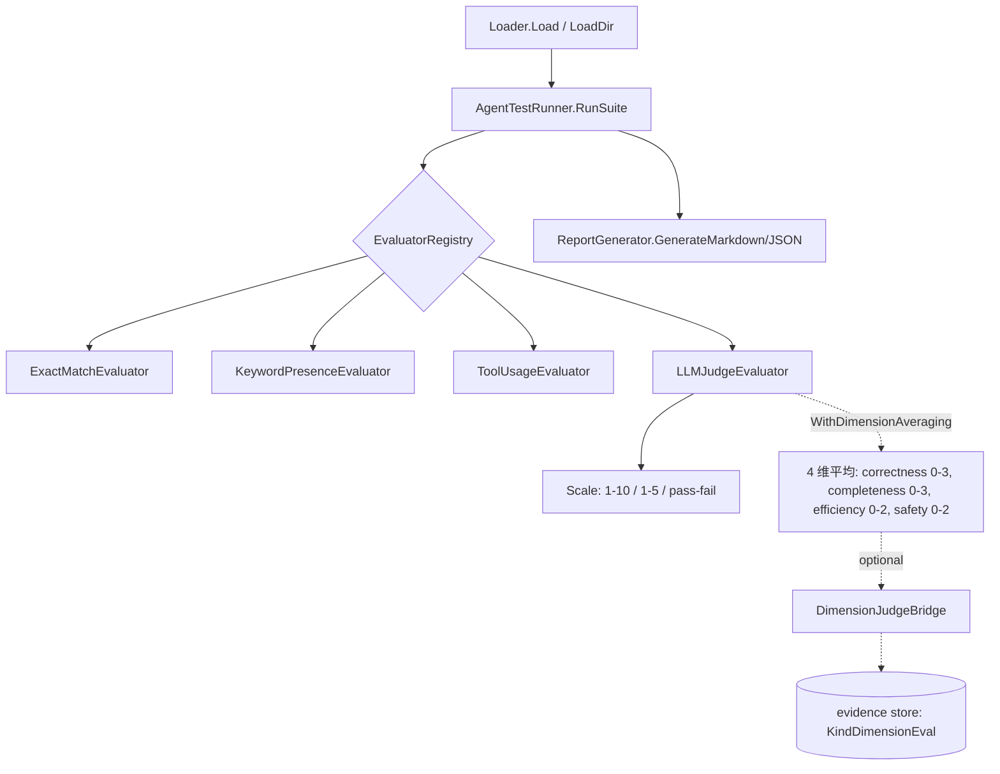
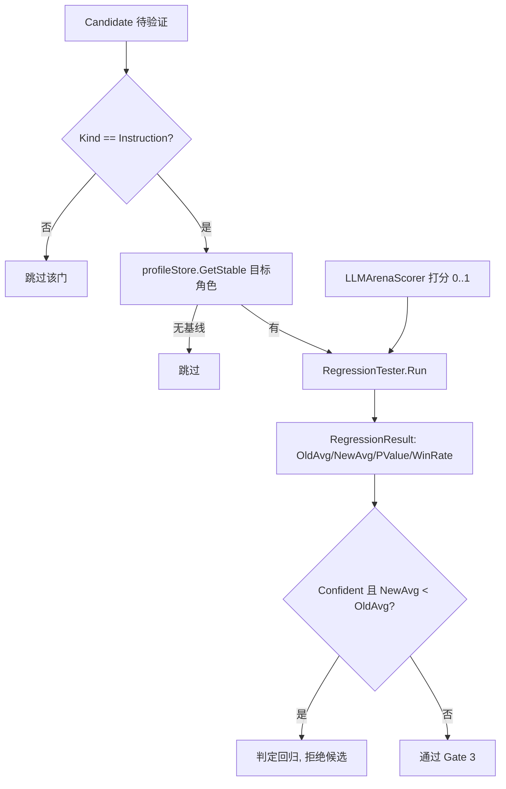

# ares 架构拆解 (XXI)：评估框架——怎么知道 Agent 真的好了（0.3.x）

"你怎么知道你的 Agent 改进了？"这个问题一直困扰我们。进化引擎在生成新策略，候选验证在跑保留样例回归——但我们需要的是一种客观方法说"策略 A 比策略 B 好多少"。

评估框架（`internal/runtime/eval/`，约 3,000 行）是这个问题的一部分答案。它把"我觉得看起来更好"变成可复现的分数。**需要先说实话：它的规模远小于"评测 Agent 一切能力"的通用框架**，它更准确地说是"给 Agent 输出打分的评估器 + 一个跑保留样例回归的门"。本文只写代码里真实存在的东西。

---

## 问题：凭感觉评估

早期 ares 的评估路径基本靠人工和直觉，都是坏的：

| 路径 | 方法 | 问题 |
|------|------|------|
| 人工 | "读输出，看起来对吗？" | 不可扩展，偏见严重 |
| 精确匹配 | 输出必须等于期望文本 | 脆弱，LLM 输出表达多变 |
| Token 计数 | "更多 token = 更深入" | 长度不等于质量（基于代码注释做的推断，未有实测数据，待核实） |

在讲清楚这个框架之前，我们做的第一件事是诚实盘点**代码里真正有什么**——而不是给它虚构一个宏大的三层面貌。

---

## 真实结构：三个组件

当前 `internal/runtime/eval/` 的真实构成是一条很朴素的流水线，没有文档里常见的"Comparison 层""并发 Runner 层"：



### 组件 1：Loader（`loader.go`）

`Loader` 从 YAML 加载套件，提供 `Load(path)` 和 `LoadDir(dir)`。它包含一个路径校验 `validateSuitePath`，用来拒绝会穿进系统目录（etc/proc/sys/dev/boot/root）的套件路径。测试用例的字段在 `types.go` 里，注意**不是**旧博客里那个 `Expected/Category/Difficulty`：

```go
// internal/runtime/eval/types.go
type TestCase struct {
    ID             string
    Name           string
    Input          string
    ExpectedOutput string   // 可选参考答案
    ExpectedTools  []string // 期望用到的工具
    Timeout        Duration // 支持 "30s" / "1m30s"，默认 30s
    Metadata       map[string]interface{}
    Tags           []string // 选择性执行
}

type TestResult struct {
    TestCaseID   string
    ActualOutput string
    ToolsUsed    []string
    Duration     time.Duration
    TokensUsed   int
    Error        string
    Metrics      map[string]float64
    Timestamp    time.Time
}

type EvalScore struct {
    Metric  string  // "exact_match", "keyword_presence", "tool_usage", "llm_judge"
    Score   float64 // 统一归一化到 [0,1]
    Details string
}
```

示例套件：

```yaml
name: basic
description: 冒烟测试
test_cases:
  - id: reasoning_01
    input: "If A > B and B > C, what's the relationship between A and C?"
    expected_output: "A > C"
  - id: tool_call_01
    input: "请帮我构建这个项目"
    expected_tools: ["shell"]
    timeout: "60s"
```

### 组件 2：Runner（`runner.go`、`agent_runner.go`）

`runner.go` 只定义接口，**不存在旧博客里的 `Runner` 结构体或 `RunAll/RunScenario`**：

```go
// internal/runtime/eval/runner.go
type TestRunner interface {
    RunSuite(ctx context.Context, suite TestSuite) ([]TestResult, error)
    RunSingle(ctx context.Context, testCase TestCase) (TestResult, error)
}

type AgentExecutor interface {
    Execute(ctx context.Context, input string) (output string, toolsUsed []string, tokensUsed int, err error)
}
```

`AgentTestRunner`（`agent_runner.go`）用 `AgentExecutor` 跑用例，逐条带上超时上下文，记录 `Duration/TokensUsed/ToolsUsed`。它还持有可选的 `EvaluatorRegistry`，`RunAndEvaluate(ctx, suite, evaluatorName)` 按名字找评估器并对每个结果求分。**注意：这里目前是串行执行的，没有并发 Runner**（并发能力在进化侧的回归测试里以批量评分形式出现，见下）。

### 组件 3：评估器（`evaluator.go`、`llm_judge.go`、`dimension_judge.go`）

核心接口只承诺一件事（`Name()` 不在接口里，是各实现自带的）：

```go
// internal/runtime/eval/evaluator.go
type Evaluator interface {
    Evaluate(ctx context.Context, testCase TestCase, result TestResult) ([]EvalScore, error)
}
```

内置评估器：

- `ExactMatchEvaluator`：`actual == expected` → 1.0，否则 0.0。`ExpectedOutput` 为空时给 1.0。
- `KeywordPresenceEvaluator`：按关键词命中比例打分。
- `ToolUsageEvaluator`：期望工具命中比例。
- `LLMJudgeEvaluator`：LLM-as-judge（见下）。

`EvaluatorRegistry`（`NewEvaluatorRegistry` / `Register(name, eval)` / `Get` / `Names`）做线程安全的名字注册。

#### LLMJudgeEvaluator

支持三种量表：

```go
// internal/runtime/eval/llm_judge.go
const (
    ScaleOneToTen  ScaleType = iota + 1 // 1-10
    ScaleOneToFive                       // 1-5
    ScalePassFail                        // 二元
)
```

默认使用中文评分提示词 `DefaultJudgePromptCN`（`prompts.go`），按四维打分、总分 0-10，LLM 返回 JSON `{"score": N, "reason": "..."}`。`Evaluate` 把分数归一化到 `[0,1]`（`score / maxScore`），并通过 `extractJudgeJSON` 处理 markdown 代码块/裸 JSON 的鲁棒解析。

**坦诚反思**：LLM-as-judge 的偏见（偏好更长更"溜"输出）确实存在，但代码里**没有**长度惩罚提示、也没有对人工评分的校准。这些是真实的待办而不是已实现特性。也没有缓存层；成本控制体现在别处（见健康删减）。

#### 维度平均（`dimension_judge.go`）

注意：**不存在独立的 `DimensionJudgeEvaluator` 类型**。维度打分是 `LLMJudgeEvaluator` 通过选项 `WithDimensionAveraging()` 开启的一条路径——让 LLM 对四个独立维度打分再取平均以降低方差：

| 维度 | 满 分 |
|------|------|
| correctness | 3 |
| completeness | 3 |
| efficiency | 2 |
| safety | 2 |

它返回 JSON `{"correctness":0-3,"completeness":0-3,"efficiency":0-2,"safety":0-2,"reason":"..."}`。归一化平均得到 metric `llm_judge_dimension_avg`。

诊断结果可经 `evidence_bridge.go` 的 `DimensionJudgeBridge.Emit` 写进通用证据库（`KindDimensionEval`），让进化的 `Diagnoser` 能消费真实失败证据——而不是把结果压缩成单一标量（这是第 8 篇验证的延续）。

### 报告（`report.go`）

`ReportGenerator.GenerateMarkdown/GenerateJSON` 汇总套件级统计（总数/通过/失败/耗时/Token）和每个 metric 的平均/最小/最大，`RunEvaluation` 是一条把 Load→Run→Evaluate 串起来的便捷函数。

---

## 与进化的两个真实接点

### 接点 A：bootstrap 注册评估器（`ares_bootstrap/provide_evolution.go`）

代码里**没有**旧博客那个 `SetupEvaluators`（带 `WithMaxRetries`/多个注册）。真实的是：

```go
// internal/ares_bootstrap/provide_evolution.go（简化）
func setupEvaluators(llmClient eval.LLMClient) (*eval.EvaluatorRegistry, error) {
    judge, err := eval.NewLLMJudgeEvaluator(llmClient,
        eval.WithChinesePrompt(),
        eval.WithScale(eval.ScaleOneToTen),
    )
    if err != nil {
        return nil, err
    }
    registry := eval.NewEvaluatorRegistry()
    if err := registry.Register("llm_judge", judge); err != nil {
        return nil, err
    }
    return registry, nil
}
```

这个 registry 挂在 `EvolutionComponents.EvaluatorRegistry` 上，供后续链路使用。

### 接点 B：Gate-3 保留样例回归（`evolution/candidate_regression.go`、`gate3_orchestrator.go`）

这才是"比较策略 A vs 策略 B"真正落地的地方——它不在 `ares_eval`，而在进化验证门的第三道。`CandidateRegressionChecker` 拿稳定的旧指令 vs 候选 diff，在同一组保留样例上跑回归，用 `ares_arena.Scorer` 打分，然后跑统计检验。默认参数就写在代码里：

| 项 | 默认值 |
|------|------|
| `baselineRuns` / `compareRuns` | 5 |
| `minWinRate` | 0.55 |
| `timeout` | 30s |
| 显著性 | p < 0.05（Welch's t-test，`Confident`） |



打分模型是 `ares_evolution/service/llm_arena_scorer.go` 的 `LLMArenaScorer`：两次 LLM 调用，先让模型按指令在保留样例上执行、再对输出在 `[0,1]` 打分。还实现了 `ScoreBatch`，把一个回归跑压成两批调用（批量执行 + 批量评分），显著减少请求数——这是网关里真实存在的成本优化。`gate3_orchestrator.go` 的 `BuildRegressionGate3/LoadRegressionGate3` 负责接线，后者在配置了 `llm.fallbacks` 时用 `FailoverClient`（主 provider + 兜底）防止单家配额耗尽拖垮整门，并为 scorer 的指数退避重试配了更宽松的熔断器（8 次/15s）。

**坦诚反思**：这正是旧博客里"每代 1000 次 LLM 调用、加缓存/快模式"说法**未能对应到任何真实代码/常量**的部分 —— 我删掉了它。真实的成本优化是批量评分与失败协调器，而不是缓存或"随机 10 例"。（该说法记为待核实，原文无对应实现。）

---

## 诚实收尾

`internal/runtime/eval/` 不是一个野心勃勃的"Agent 评测平台"，而是一座小而实的打分库：Loader + Runner + 评估器 + 报告，加上一个把维度诊断桥接进证据库的 `DimensionJudgeBridge`。"比较"这件事的真实答案是 Gate-3 保留样例回归与统计显著性检验，而不是某个 `Comparison` 结构。旧博客吹的 `concurrent_runner.go`、`comparison.go`、HTTP service 层（`/eval/run` 等端点）在代码中**均不存在**，本文已剔除并如实重述。

**最好的评估框架是让"它更好吗？"变成有数字答案的问题。** 感觉不能扩展。可复现的分数可以——但前提是这些分数确实来自你写得出来的那几行代码。