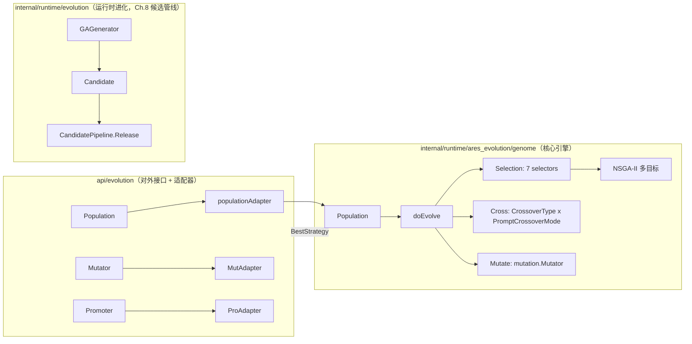
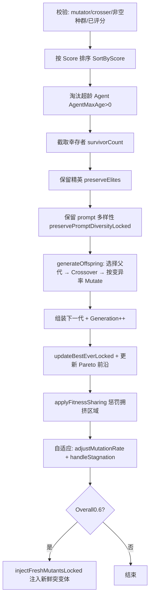

# GA 进化系统深度解析——从单个策略到可插拔的种群引擎

> 这篇文章是 ares 进化引擎的完整介绍。模块路径 `internal/runtime/ares_evolution/genome/`。我们用的符号都是仓库里真实存在的：`Population`、`doEvolve`、`TournamentSelection`，`Selection` 接口下有 7 个算子，交叉有 3 种 `CrossoverType` + 3 种 `PromptCrossoverMode`，变异有 5 种 `MutationType`，多目标走 NSGA-II（`ParetoDominance` / `CrowdingDistance`）。所有数字都是源码里的常量或配置默认值。

---

## 一、一件值得先说的事：GA 是什么，又不止是什么

GA（Genetic Algorithm）在这里不是"调参工具"，而是一个**策略生成器**：给定一个根策略（root strategy），它通过选择、交叉、变异在每一代里产生新的候选策略，并靠一个可插拔的评分函数来判断谁该留下。

它也不是唯一的一条进化路径。仓库里同时存在：

```text
internal/runtime/ares_evolution/        # GA 种群引擎本身（本篇文章舞台）
internal/runtime/evolution/             # 运行时进化引擎（Genome/Diff/Coordinator）
internal/runtime/observability/flight/           # Agent 家谱树 / 谱系（见 24.5）
```

需要特别澄清一点（这也是旧版文章的错误）：**默认配置里没有硬编码"锦标赛"选择策略**。`internal/runtime/ares_evolution/genome/population_config.go` 的 `DefaultPopulationConfig()` 把 `SelectionStrategy` 留空（`""`），在 `buildSelector()` 里空字符串等价于 `"random"`——父代是从繁殖池里纯随机挑的。公开 API `api/evolution` 的 `DefaultPopulationConfig()` 才是 `"tournament"`。两套默认值不同，读者不要混淆。

---

## 二、总体架构



设计上的核心约束在 `Genome` 接口文档里写得很清楚（`internal/runtime/evolution/genome/genome.go`）：

> `Genome → Generate Candidate → Diff Engine → RuntimePatch`。Genome 只负责 Mutation、Snapshot 和可选的 Fitness，部署交给 Diff Engine + Coordinator。

也就是说进化引擎天生是"可插拔的"——`Genome` 不知道自己代表哪个子系统。

注意一个 2026-07 之后的变化：**`Crossover` 和 `Fitness` 从核心 `Genome` 接口里移除**了，原因是"零生产调用者"。它们现在是可选接口 `CrossoverGenome` / `FitnessGenome`，用类型断言检测：

```go
if f, ok := child.(FitnessGenome); ok {
    score, err := f.Fitness(ctx)
}
```

这是一个真实的工程决策：接口里不放没人用的方法。

---

## 三、Population：种群的骨架

`internal/runtime/ares_evolution/genome/population.go` 定义了核心结构。字段比旧版文章里我写过的更丰富：

```go
type Population struct {
    Agents     []*mutation.Strategy // 当前个体
    Size       int                  // 目标种群大小（跨代不变）
    Generation int                  // 当前代数
    mu         sync.RWMutex         // 保护 Agents / Generation
    cfg        PopulationConfig     // 配置快照，创建后不可变
    rng        *rand.Rand           // 确定性随机源（#nosec G404，不用于密码学）

    bestScore           float64                // 跨代最高分（停滞检测）
    bestEver            *mutation.Strategy     // 历史最优（部署用）
    paretoFront         []*mutation.Strategy   // NSGA-II Pareto 前沿
    stagnantGens        int                    // 连续无改进代数
    currentMutationRate float64                // 运行时变异率（自适应调整）
    recoveryActions     map[string]int         // 多样性恢复动作计数
    history             []GenerationHistoryEntry
    HistoryMaxSize      int
}
```

**读写分离**：`Best()` / `Stats()` / `Snapshot()` 用读锁；`ScoreAgents()`、`doEvolve()` 用写锁。有趣的是 `ScoreAgents()` 特意在**读锁外调用外部 scorer**——因为 scorer 可能是 LLM 或网络 I/O，会阻塞很久，不能锁着整个种群去评分。

### 真实默认配置

（来自 `population_config.go` 的 `DefaultPopulationConfig()`，与前文"默认锦标赛"的传言相反：）

```go
return PopulationConfig{
    Size:            20,
    SurvivalRate:    0.6,
    MutationRate:    0.2,
    EliteCount:      3,
    BreedingPoolRatio: 0.6,
    SelectionStrategy: "",        // "" == "random"，父代随机抽取
    TournamentSize:      3,
    MinMutationRate:     0.05,
    MaxMutationRate:     0.5,
    MaxStagnantGenerations: 10,
    DiversityThreshold:  0.15,
    ...
}
```

`NewPopulation` 会校验 `EliteCount > Size`、`MinMutationRate > MaxMutationRate`，然后用 mutator 把根策略变异出 `Size-1` 个初始变体。

### 进化流水线 doEvolve

`Evolve` / `EvolveOnIdle` / `EvolveSteadyState` 三个入口最终都汇到 `doEvolve`。真实步骤：



几个关键点：

- **`EvolveSteadyState(replaceRate)`**：稳态 GA。`replaceRate` 超出 `[0.1, 0.5]` 被钳制，默认 `0.3`，只生成 `replaceRate × Size` 个后代替换最差的个体。这是为在线场景准备的（见 24.6）。
- **`EvolveOnIdle`**：复用配置的 `SurvivalRate` 和 `BreedingPoolRatio`（默认 0.6）来构建繁殖池，用于空闲期进化。注释里特别说明：`EvolveOnIdle` 这个名字的"零 token"只指选择/交叉/变异阶段，前置的评分 pass 该花 LLM token 还是花。
- **多样性恢复**：当 `report.Overall < cfg.DiversityThreshold` 或 `DominantLineageShare > 0.6` 时注入新鲜突变体。注意阈值是 `DiversityThreshold=0.15`，不是某些文章里的 0.05。
- **适应度共享**：`applyFitnessSharing` 对参数空间拥挤区域的个体打分惩罚，惩罚前的打分从 `SelectionScore` 走。常量来自 `population_config.go`：`FitnessSharingSigma=0.3`、`FitnessNicheRadius=0.15`、`FitnessSharingSampleLimit=50`、`FitnessSharingSampleSize=30`。

---

## 四、选择算子：Selection 接口下的 7 个实现

全部在 `internal/runtime/ares_evolution/genome/selection.go`。每个都实现统一的 `Selection` 接口：

```go
type Selection interface {
    Select(ctx context.Context, population []*mutation.Strategy, n int) ([]*mutation.Strategy, error)
}
```

| 算子 | 机制 | 默认/关键参数 | `SelectionStrategy` 键 |
|--------|------|--------------|------------------------|
| **Tournament** | 随机抽 k 个取最优，重复 n 次 | k 默认 3，最小 2 | `"tournament"` |
| **Rank** | 线性排名加权，best=N, worst=1 | – | `"rank"` |
| **SUS** | 单一随机起点 + 均匀间隔指针 | – | `"sus"` |
| **RouletteWheel** | 适应度比例，分数移位到非负 | – | `"roulette"` |
| **Truncation** | 排序后取 top N（确定性精英） | – | `"truncation"` |
| **LineageRank** | 排名 + 谱系多样性惩罚 | 阈值 0.4，强度 0.5 | `"lineage_rank"` |
| **NondominatedSorting** | NSGA-II：Pareto 等级 + 拥挤距离 | – | `"nsga2"` / `"nondominated"` |

几点真实细节：

- 所有选择器通过 **`effectiveScore()`** 取分：优先 `SelectionScore`（适应度共享写入的调整后分数），否则回退 `Score`（规范适应度）。目的——让适应度共享能影响**所有**选择算子，而不污染用于报告/历史的 `Score`。
- 未评估个体（`Score=-1`，即 `ScoreUnevaluated`）通过 `SortByScore` 排到最后，SUS/轮盘赌还会过滤掉它们。
- Tournament 用 **Fisher-Yates 部分洗牌**抽不重复下标；`WithTournamentSeed` 可复现实验。
- **NSGA-II** 是"加座"式的：`NondominatedSortingSelection` 检查 `DimensionScores`；如果没有多目标数据，就回退到锦标赛。前沿内按拥挤距离降序取子集（有处理并行数组排序 bug 的注释说明）。

`Population.buildSelector()` 按字符串建选择器，`""` / `"random"` 返回"不需要选择器（随机选父代）"。

---

## 五、交叉与变异

### 交叉（`internal/runtime/ares_evolution/genome/crossover.go`）

参数重组有 3 种 `CrossoverType`：

```go
CrossoverUniform    // 每个参数独立从任一父代 50/50 继承（默认）
CrossoverTwoPoint   // 两个切点把有序参数分成三段，交换中间段
CrossoverSegment    // 从父 B 取一段连续块，其余来自父 A
```

Prompt 继承有 3 种 `PromptCrossoverMode`：

```go
PromptInherit     // 继承得分更高父代的完整 prompt（默认）
PromptHalfSplit   // 前半段来自父 A、后半段来自父 B（half-sentence 拆分）
PromptUniform     // 随机从任一父代选，两父等概率，促进 prompt 多样性
```

`NewCrossover(WithSeed, WithDeterministicIDs, WithPromptMode, WithCrossoverType)` 构造。

### 变异（`internal/runtime/ares_evolution/mutation/types.go`）

`MutationType` 实际有 **5 种**（不是我旧文章里写的 4 种）：

```go
MutationParameter   // 参数值变异 → "parameter"
MutationPrompt      // prompt 模板变异 → "prompt"
MutationTool        // 工具配置变异（Params["tools"] 替换）→ "tool"
MutationCrossover   // 由交叉产生的策略（标记来源）→ "crossover"
MutationRoot        // 根/初始策略 → "root"
```

生成变异由 `internal/runtime/ares_evolution/mutation` 的 `Mutator` 承担，`NewMutator(WithParamRanges(...), WithPromptPool(...), WithToolPool(...))` 构造。还有一个**经验引导**变体 `ExperienceGuidedMutator`（`mutation/guided_mutator.go`），用历史表现偏置变异决策。**自适应变异率** `AdjustMutationRate`/`AdaptiveDistribution` 存在于 `mutation/adaptive_distribution.go`，配合 doEvolve 里的 `adjustMutationRateLocked()` 使用。

---

## 六、多目标优化：NSGA-II

`internal/runtime/ares_evolution/genome/multi_objective.go`。四个默认维度来自 `DefaultDimensionDirections` / `DefaultDimensionWeights`：

| 维度 | 方向 | 默认权重 | 含义 |
|------|------|---------|------|
| `success_rate` | 最大化 | 0.40 | 成功率越高越好 |
| `quality` | 最大化 | 0.25 | 输出质量越高越好 |
| `cost` | 最小化 | 0.20 | API 成本越低越好 |
| `latency` | 最小化 | 0.15 | 响应时间越低越好 |

核心：

```go
func ParetoDominance(a, b *mutation.Strategy) bool {
    // a 支配 b ⟺ a 在至少一个维度严格优于 b，且其余维度都不劣于 b
}

func ParetoRank(strategies) []int       // 非支配排序，0=最优前沿
func CrowdingDistance(front) []float64  // 前沿内拥挤距离（边界点为无穷大）
```

选 `"nsga2"` 或 `"nondominated"` 激活。`ScoreAgentsMulti(scorer)` 会同时写 `DimensionScores` 和聚合 `Score`。权重**仅**用来把多维压成一个标量用于报告；选择过程完全基于 Pareto 排序，不依赖权重。`Population.ParetoFrontStrategy()` 返回当前前沿。

---

## 七、可组装的一条链：WiredEvolutionSystem

`internal/runtime/ares_evolution/genome_wiring_system.go` 提供 `NewWiredEvolutionSystem(...)` 中央工厂，把 Population、scorer、谱系、guardrails、diff、coordinator 串起来；`RunIdleEvolution(ctx, system, n)` 跑 N 代，每代大致是：

```text
评分 → 进化 → 谱系记录 → LLM 反射 → 假说生成 → 差分引擎 → 协调器 → 代后钩子
```

这部分把 GA 接到 `internal/runtime/evolution` 的运行时进化管线（见下一节）。

---

## 八、运行时进化：Genome / Diff / Coordinator（Ch.8 候选管线）

`internal/runtime/evolution/genome/workflow_genome.go` 是**真正的运行时 DAG 基因组**：

- 9 个变异算子 `wfOp*`：`insert/remove/replace/parallelize/serialize/swap/split/merge/set-metadata`，随机选一个应用到 DAG。
- `DefaultWorkflowGenomeConfig()`：`AgentPool=["default"]`、`MaxNodes=20`、`InsertionRate=0.3`、`PruneRate=0.2`。
- `Fitness()` 基于 flight recorder 的实测证据（`avgFitnessValue`，取 `Value∈[0,1]` 的均值）；**无证据时返回中性 0.5**，让 GA 继续探索。
- `Crossover()` 是均匀交叉（可选 `CrossoverGenome`）。

候选指令侧，`internal/runtime/evolution/ga_generator.go` 的 `GAGenerator` 把角色的 stable instructions 当父代做 prompt 变异，产出 `Candidate`。`CandidatePipeline.Release`（`candidate_pipeline.go`）把**已验证**的候选送进协调器决策 + 部署的金丝雀管线：

```text
Candidate(verified) → RuntimePatch → coordinator.Submit → Evaluate
  → DecisionApply → deployment (staging→live) → ProfileStore.SetStable + audit
```

协调器的默认策略 `coordinator.DefaultPolicy()`（`internal/runtime/evolution/coordinator/coordinator.go`）是真实常量：

```go
AutoApplyThreshold:    8,    // priority >= 8 自动应用
MaxPatchesPerMinute:   4,    // 熔断式速率限制
MinFitnessThreshold:   30.0, // GA 补丁 fitness < 30 拒绝
ApplyFitnessThreshold: 70.0, // GA 补丁 fitness >= 70 自动应用，[30,70) 进 delay 待人工
```

注意 fitness 阈值注释给出 5 个基因组（memory/knowledge/recovery/workflow/scheduler）各自把成功率均值 `[0,1]` 缩放成 `[0,100]`——所以是 30/70 而非旧版的 60/30。旧文章在这里记错了数字，已更正。

---

## 九、真实的默认值 vs 旧文章的传言

| 项 | 旧文章传言 | 真实源码 |
|----|-----------|---------|
| 内部默认选择策略 | `"tournament"` | `""`（= random） |
| 默认繁殖池比例 | 0.3 | 0.6 |
| 突变类型数量 | 4 | 5（含 `MutationRoot`） |
| 多样性崩溃注入阈值 | 0.05 | `DiversityThreshold=0.15` 或 `DominantLineageShare>0.6` |
| 协调器 fitness 阈值 | Apply≥60 / Reject<30 | Apply≥70 / Reject<30 / delay[30,70) |

---

## 十、写在最后

进化引擎的价值不在"哪个算子最好"，而在**可插拔 + 可实测**。你会在代码里找到 7 种选择算子、3+3 种交叉/继承模式、5 种变异、一套 NSGA-II 前置线，以及一条从候选到金丝雀部署再到 stable 的完整管线。没有"最佳配置"预设——它给你的是一套组合起来能覆盖从快速收敛到多目标权衡的**工具**。

---

## 附录

[A] 核心代码位置：

| 内容 | 路径 |
|------|------|
| 人口与进化主循环 | `internal/runtime/ares_evolution/genome/population.go` |
| 默认配置 | `internal/runtime/ares_evolution/genome/population_config.go` |
| 选择算子 | `internal/runtime/ares_evolution/genome/selection.go` |
| 交叉/继承 | `internal/runtime/ares_evolution/genome/crossover.go` |
| 多目标 | `internal/runtime/ares_evolution/genome/multi_objective.go` |
| 变异类型 | `internal/runtime/ares_evolution/mutation/types.go` |
| 变异引擎 | `internal/runtime/ares_evolution/mutation/mutator.go` |
| 公开 API | `api/evolution/evolution.go`, `api/evolution/mutation/mutator.go` |
| 编排工厂 | `internal/runtime/ares_evolution/genome_wiring_system.go` |
| 运行时 DAG 基因组 | `internal/runtime/evolution/genome/workflow_genome.go` |
| 候选生成与发布 | `internal/runtime/evolution/ga_generator.go`, `candidate_pipeline.go` |
| 协调器 | `internal/runtime/evolution/coordinator/coordinator.go` |

[B] 想亲手跑：`go run ./examples/_fixtures/10-ga-full-evolution`。

[C] 未在本篇展开的主题：TieredScorer（24.2）、选择算子 Benchmark（24.3）、Promoter（24.4）、谱系/家谱（24.5）、实战教训（24.6）。