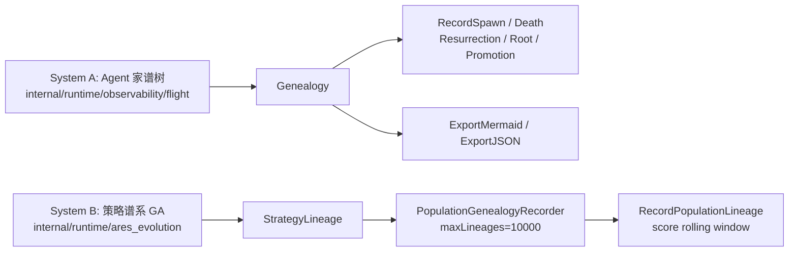

# 谱系记录与家谱树——谁是谁的后代

> 本文讲 ares 里**两套并行**的谱系系统，以及一个会用到"祖先是谁"的选择算子。代码都真实存在：
> - 系统 A：Agent 家谱树 —— `internal/runtime/observability/flight/genealogy.go`（`Genealogy` / `LineageNode` / `ExportMermaid`）
> - 系统 B：策略谱系（GA）—— `internal/runtime/ares_evolution/genome_wiring_genealogy.go`（`PopulationGenealogyRecorder` / `RecordPopulationLineage`），数据结构 `StrategyLineage` 在 `interfaces.go`
> - 谱系感知选择 —— `internal/runtime/ares_evolution/genome/selection.go` 的 `LineageRankSelection`

---

## 1. 两套谱系系统



- **系统 A**：记录 **Agent** 的生命周期事件（诞生/复活/死亡/晋升为 leader），组织成树，主要用于可视化（`ExportMermaid` 直接生成 mermaid 流程图）。
- **系统 B**：记录 **策略** 的父子继承关系，扁平 list，主要用于多样性控制（`LineageRankSelection`、新鲜突变注入、guardrail）。

---

## 2. 系统 A：Agent 家谱树（ares_flight）

`internal/runtime/observability/flight/genealogy.go`。核心类型：

```go
type AgentRelation string
const (
    RelationSpawned     AgentRelation = "spawned"
    RelationResurrected AgentRelation = "resurrected"
    RelationPromoted    AgentRelation = "promoted"
)

type LineageNode struct {
    ID        string
    Type      string
    ParentID  string
    Relation  AgentRelation
    SpawnedAt time.Time
    DiedAt    time.Time
    IsAlive   bool
    Children  []*LineageNode
    Metadata  map[string]any
}

type Genealogy struct {
    roots []*LineageNode
    nodes map[string]*LineageNode
    mu    sync.RWMutex
}
```

方法（都带写/读锁）：

| 方法 | 作用 |
|------|------|
| `RecordSpawn(parentID, childID, agentType, meta)` | 记录父子（parentID 为空则成 root） |
| `RecordResurrection(oldID, newID)` | 旧的标记死亡，新节点继承类型与父、收养旧节点的子 |
| `RecordRoot(id, agentType, meta)` | 记录无父的 root（已存在则只是复活） |
| `RecordDeath(id)` | 标记死亡 + 记录 `DiedAt` |
| `RecordPromotion(id)` | 打成 leader + 写 `promoted_at` 元数据 |
| `Descendants(id)` / `Ancestors(id)` | 后裔树 / 祖先链（root→自身） |
| `IsAlive(id)` / `GetNode` / `Roots` | 查询 |
| `ExportMermaid()` / `ExportJSON()` | 导出：mermaid 流程图（`🤖`存活 / `💀`死亡 / `👑`leader）与 JSON |

`internal/runtime/observability/flight/genealogy_collector.go` 的 `GenealogyCollector` 订阅 `EventStore`，把事件灌进这棵树——这就是"事件驱动"组装家谱的入口。

## 3. 系统 B：策略谱系（GA）

数据结构 `StrategyLineage`（`internal/runtime/ares_evolution/interfaces.go`）：

```go
type StrategyLineage struct {
    ParentID          string  `json:"parent_id"`
    ChildID           string  `json:"child_id"`
    MutationType      string  `json:"mutation_type"`
    WinRate           float64 `json:"win_rate"`
    ScoreImprovement  float64 `json:"score_improvement"`
    ParentScore       float64 `json:"parent_score"`
    ChildScore        float64 `json:"child_score"`
    ImprovementSignificant bool `json:"improvement_significant"`
    Timestamp         int64   `json:"timestamp"`
}
```

极简接口（一个方法即可当记录器）：

```go
type GenealogyRecorder interface {
    Record(ctx context.Context, lineage StrategyLineage) error
}
```

`PopulationGenealogyRecorder`（`genome_wiring_genealogy.go`）是 in-memory 实现：

```go
type PopulationGenealogyRecorder struct {
    mu          sync.RWMutex
    lineages    []StrategyLineage
    maxLineages int // 默认 10000——达到上限丢最旧
    scoreHistory map[string]*ScoreRollingWindow // agentID → 滚动窗口（size 3）
}
```

配套 `ScoreRollingWindow`（size=3，匹配 promoter 的 `ImprovementWindow`）：`Add` 追加并淘汰最旧，`Mean` 取均值。用它做基线而不是单点分数，是为了**平滑噪声**——进化中策略分数因对手不同会波动，三代滑动平均更稳定。

### RecordPopulationLineage：逐代桥接

`RecordPopulationLineage(ctx, pop, recorder, parentSnapshot, prevGeneration)`（`genome_wiring_genealogy.go`）核心流程：

```
1. pop == nil || recorder == nil → 直接返回
2. pop.Snapshot() → 取当前代所有 agent（深拷贝）+ generation
3. 建 parentScores 查找表（父代快照 → 分数）
4. 遍历 agent：
   a. 跳过 ParentID=="" 或 Version<=1
   b. 去重：同一 (parentID, childID) 只记一次
   c. 解析父代分数（含交叉：见 §6）
   d. 优先用滚动均值作基线
   e. scoreDelta = agent.Score - baseline；>0 → winRate=1
   f. recorder.Record(lineage)
```

---

## 4. 谱系感知选择：LineageRankSelection

当某个谱系过度强势（占了种群很大比例），`LineageRankSelection` 会在**排名权重**上施加惩罚，让弱势谱系有更大机会被选中。默认 `penaltyThreshold=0.4`、`penaltyStrength=0.5`（`NewLineageRankSelection`）。

```go
// computeLineageRankWeights（selection.go）
func computeLineageRankWeights(sorted []*mutation.Strategy, penaltyThreshold, penaltyStrength float64) (weights []float64, totalWeight float64) {
    // 1. 统计每个 ParentID 的占比（空 ParentID 归一化为 "(root)"）
    // 2. 基础权重 = 线性排名（最佳=N，最差=1）
    // 3. share > threshold 时：
    //      excess    = (share - threshold) / (1 - threshold)
    //      penalty   = penaltyStrength * excess
    //      rankWeight *= (1 - penalty)
}
```

示例（penaltyThreshold=0.4, strength=0.5）：

| 谱系分布 | share | 权重变化 |
|---------|-------|---------|
| 均匀 5 系各 20% | ≤0.4 | 不惩罚 |
| 1 系占 60% | 0.6 | ≈ ×(1−0.5×0.333)≈×0.83 |
| 1 系占 90% | 0.9 | ≈ ×(1−0.5×0.833)≈×0.58 |

`Select` 流程：`SortByScore` → `computeLineageRankWeights` → 轮盘式按权重抽 n 个。注释点明意图：**防止在 wired 模式下谱系坍缩**（tournament 会放大选择压力，配合谱系惩罚可以平衡）。

---

## 5. 谱系与多样性量化

`Population.measureLineageDiversityLocked()`（`adaptive.go`）返回 `(lineageDiv, dominantShare)`：

```go
lineageDiv     = len(uniqueParents) / n   // 1.0 = 每个 agent 不同父代
dominantShare  = maxParentCount / n       // 最常见父代占比
```

结果进入 `DiversityReport`（`adaptive.go` 顶部），含 `Overall / Numeric / Categorical / Lineage / DominantLineageShare`。消费它的地方都是真实的：

- **doEvolve**（`population.go`）：当 `report.Overall < cfg.DiversityThreshold(0.15)` **或** `report.DominantLineageShare > 0.6` 时 `injectFreshMutantsLocked` 注入新鲜突变体（阈值 0.6 由 `population_config.go` / `diversity_test.go` 佐证）。
- **MetaController**（`meta_evolution.go`）：`report.Lineage < 0.3` 时会加入 `low_lineage_diversity` 原因并可能切到 `"lineage_rank"`。
- **Guardrails**（`guardrails.go`）：`MaxLineageShare` 默认 **0.8**，超过时报 `lineage_concentration` 的 `GuardrailWarning`。

---

## 6. 交叉谱系：双亲用 × 编码

交叉产生的子代有两个父代，`ParentID` 编码成 `parentA×parentB`（Unicode 乘法符号 `\u00d7`）：

```go
// crossover.go
func formatParentIDs(idA, idB string) string {
    return idA + "\u00d7" + idB
}
// child := ... { ID: generateChildID(a.ID,b.ID), ParentID: formatParentIDs(a.ID,b.ID), ... }
```

谱系记录端要处理这种复合父代——`resolveParentScore`（`genome_wiring_genealogy.go`）发现 `ParentID` 含 `\u00d7` 时，取**两个父代分数的平均**作为基线：

```go
parts := strings.Split(parentID, "\u00d7")
if len(parts) == 2 { /* ps1, ps2 都查到 → (ps1+ps2)/2 */ }
```

---

## 7. 诚实边界（未落地 / 待核实）

旧版 24.5 里有两个提法，按源码需要标注：

| 旧文主张 | 核实结果 |
|---------|---------|
| "每代在 `RunIdleEvolution` 里捕获父代快照后调用 `RecordPopulationLineage`" | **属实**——`genome_wiring_system.go` 的 `RunIdleEvolution` 确有：演化前 `system.Population.Snapshot()`，演化后调 `RecordPopulationLineage`，出错仅打日志继续 |
| "每个谱系保留 1 个精英（`PerLineageElites`/`PerLineageEliteCount`）" | 这些配置字段**真实存在**于 `population_config.go`（默认 `PerLineageElites:true`、`PerLineageEliteCount:1`），实现分布在 `population_guard.go` 的 `preservePerLineageElites`；本文未逐行复述其内部逻辑 |

并且这里要**直接说明**：本轮整理**没有**为"谱系改进率 100% vs 3.7%"这类运行数字背书——那类数据需要实跑整代进化并看日志，仓库里没有提交可直接引用的运行日志（见 24.6）。

---

## 8. 小结

两套谱系分工清晰：

- **Agent 树（A）** 画"谁从谁那里诞生/复活"，服务于可视化与归属追溯。
- **策略谱系（B）** 记"哪个策略继承了哪个策略"，服务于**多样性控制**：`LineageRankSelection` 惩罚优势谱系 → 弱势谱系有机会 → `DiversityReport`（`DominantLineageShare>0.6`）触发新鲜突变注入 → `MetaController` 低谱系多样时换 `lineage_rank` → `Guardrails`（`>0.8`）告警。
- 交叉双亲用 `\u00d7` 编码，谱系基线取双亲均值，保证"交叉出的孩子"也能填入单个 `ParentID` 的扁平表。

一句话：**追踪"谁是谁的后代"，是为了不让某一个血脉垄断未来的基因。**