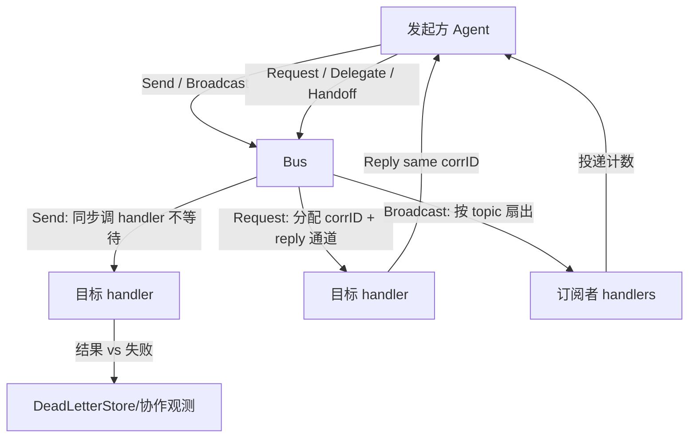
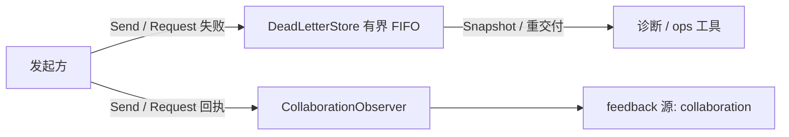
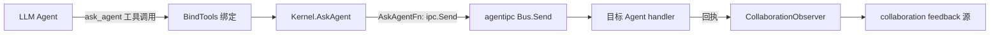

# ares 架构深度解析（二十六）：Agent 通信 — Agent IPC 原语与 syscall 工具层（0.3.x）

> 说明：本文基于实际代码（`internal/agentipc` 的 `bus.go` / `primitives.go` / `policy.go` / `deadletter.go` / `collaboration_observer.go`，以及 `internal/agentsyscall` 的 `syscall.go` / `plan.go`），是 docs 系列中 Agent 通信层的专门篇。Agent 是同级认知进程（A ≡ B ≡ C），通信走 peer-mesh 消息总线，不需要 Leader 中转。

## 一、为什么需要 Agent 通信

多 Agent 系统里，Agent 与 Agent 之间需要交换消息——"我发现 X" / "帮我验证 Y" / "你的结论和我冲突"（`internal/agentipc/doc.go` 列出的典型协作短语）。这属于 ares-runtime 的 Kernel IPC pillar（P4），也是三层上下文中的第三层（Task Shared / Agent Private / IPC Messages）——前两级在 `internal/fabric/agent` 存储，IPC 层由本包承载。

先厘清分工：**任务分发是 Scheduler（Task Fabric）的职责，Agent 通信是 IPC 的职责**。两者不是一回事：

| 维度 | 任务分发（taskfabric / Scheduler） | Agent 通信（agentipc） |
|------|-----------------------------------|------------------------|
| 视角 | 谁该执行什么任务 | 谁需要知道什么消息 |
| 路径 | 经 Task Fabric 创建 → 调度执行 | 对等直发 peer-mesh |
| 语义 | 任务执行、可恢复、可重放 | 协作、请求答复、广播订阅、交接 |
| 状态 | durable Task | 内存注册表 + 即时投递 |

**核心原则：Agent 表达意图（Send / Request / Delegate / Handoff / Subscribe），Kernel 保证送达。** 通信是"协作通道"，不是"任务执行通道"。

## 二、原生消息单元：Message

所有 IPC 一律走 `internal/agentipc/bus.go` 的 `Message`（design §13：Context layer 3 IPC Messages）：

```go
type Message struct {
    ID            string    // 总线生成的唯一消息 ID
    From          string    // 发送方 Agent ID
    To            string    // 接收方 Agent ID（"" = 广播给订阅者）
    Topic         string    // 消息主题（如 "verify-conclusion" / "handoff-task"）
    CorrelationID string    // 关联 ID，配对 reply 与 request
    Payload       any       // 消息体
    At            time.Time // 发送时间戳
}
```

配套的投递函数与错误哨兵（`Handler`、`ErrAgentNotRegistered`、`ErrNoHandler`、`ErrTimeout`、`ErrInvalidMessage`）都在同一包内定义。

## 三、六原语：Bus

核心对象是 `Bus`（`internal/agentipc/bus.go`）：一个把 agent ID 映射到 handler 的 peer 消息总线。它维护 `handlers`、`subscribers`（topic → 订阅者列表）、`pending` / `pendingErr`（按关联 ID 的待答复通道 / 暂存错误）。原语全集：

| 原语 | 语义 | 备注 |
|------|------|------|
| `Send` | fire-and-forget 直发 | 同步调用目标 handler，不等待答复 |
| `Request` | 同步请求/答复 | 分配 correlation ID，等待 reply，带超时 |
| `Reply` | 异步回执 | 目标 handler 稍后用 correlation ID 补答 |
| `Delegate` | 代转发 | 转发给最终目标，保留端到端 correlation ID |
| `Handoff` | 任务交接 | 结构化任务负载 + 接收方确认，不走 Scheduler |
| `Subscribe` / `Unsubscribe` | 订阅 / 取消 | 主题订阅，配合 `Broadcast` 扇出 |

> 注：`doc.go` 把原语集表述为 Send / Request / Delegate / Handoff / Subscribe（+ Reply），实现里另有 `Broadcast` / `Unsubscribe` 两个补充入口，一并列出。



### Send vs Request：两种协作姿态

- `Send(ctx, from, to, topic, payload) error`：fire-and-forget。目标 handler 在调用方 goroutine 里被同步调用；handler 返回错误会上抛，但不建立 reply 通道——"发完即完"，不配对答复。
- `Request(ctx, from, to, topic, payload, timeout) (*Message, error)`：同步请求/答复。总线分配 correlation ID 并登记一条 pending reply 通道；目标 handler 必须用同一个 correlation ID 调 `Reply` 才能完成请求。**超时处理有默认值**：`timeout <= 0` 时落入 `defaultRequestTimeout = 30 * time.Second`（primitives.go，B16 防止无限阻塞）。请求在受管 goroutine 中执行，自带 recover 边界——handler 若 panic，被收拢为一个 `ErrHandlerPanic`，只失败这一条请求，不拖垮整个进程。

## 四、Delegate 与 Handoff：委托与交接

- `Delegate(ctx, delegator, to, topic, payload, timeout)`：在调用方立场上把请求转发给另一个 Agent。原请求者的 correlation ID 端到端保留，答复能一路链回。语义是"我处理不了——让能处理的人来"。
- `Handoff(ctx, from, to, taskID, contextSnapshot, timeout)`：把任务的"所有权"从 yield 的 Agent 移交给 accept 的 Agent。负载为 `{task_id, context, artifacts}`，topic 为常量 `handoff-task`，接收方返回接受答复。**关键点：这是 peer-to-peer 的任务转移原语，不经过 Scheduler。**

## 五、发布订阅：Subscribe / Broadcast / Unsubscribe

```go
func (b *Bus) Subscribe(agentID, topic string) error   // 幂等：重复订阅被去重
func (b *Bus) Unsubscribe(agentID, topic string)
func (b *Bus) Broadcast(ctx context.Context, from, topic string, payload any) int
```

`Broadcast` 把一条消息扇给该 topic 的每个订阅者 handler；某个 handler 出错不影响其余投递，返回成功投递数量。Subscribe 对同一 agent + 同一 topic 去重（B16）。

## 六、可观测性：DeadLetterStore 与 CollaborationObserver

IPC 不只是通信，还是进化回路的一路输入（N-11 / GAP-3 闭环）：

- **DeadLetterStore**（`deadletter.go`）：有界 FIFO，记录投递失败（`ErrAgentNotRegistered` / `ErrTimeout` / handler 错误）。容量默认 1024（`capacity <= 0` 时回落）。`Record`（最旧被淘汰）、`Snapshot`、`Count` 供诊断与重交付。Send 与 Request 的失败路径都会 `Record`。
- **CollaborationObserver**（`collaboration_observer.go`）：每条有可观测回执的协作尝试向观察者发一条 `feedback.CollaborationOutcome`。`Send` 与 `Request`（及其上的 Delegate / Handoff）被观测；`Broadcast` 刻意不被观测（无单一目标可归因）。观察器被调在被发起方路径上，因此约定必须非阻塞，锁外调用。



## 七、syscall 层：Kernel 与工具

`internal/agentsyscall` 把 IPC/协作能力封装成 **LLM 可调的工具**（W2 设计：真实 LLM 执行体 sub.Agent 决定是否拆分任务，Kernel 校验执行——"Agent decides. Kernel enforces."）。`BindTools(binder, kernel)` 注册四个工具：

| 工具常量 | 对应 Kernel syscall | 系统调用含义 |
|----------|---------------------|--------------|
| `SpawnAgentTool` (`spawn_agent`) | `Kernel.SpawnAgent` | 生成一个带声明能力(capability)的 peer Agent，校验配额并注册为可调度 executor |
| `CreateTaskTool` (`create_task`) | `Kernel.CreateTask` | 在 Task Fabric 创建子任务（→ READY），交给 Scheduler |
| `AskAgentTool` (`ask_agent`) | `Kernel.AskAgent` | 向指定目标 Agent 就其 topic 发协作请求（"知道该问谁"时用） |
| `CreatePlanTool` (`create_plan`) | `Kernel.CreatePlan` | 整张依赖 DAG 一次性批量编译为任务（含可选有界 round-loop） |

`ToolSchemas()` 返回这些工具的 LLM 面 schema，注入 `resources.Registry`，与内置工具并列出现在 Chat API。

**Kernel 的 `AskAgentFn` 是关键注入点**（`syscall.go`）：

```go
type AskAgentFn func(ctx context.Context, from, to, topic string, payload any) error

// WithAskAgent 注入协作原语；SetAskAgent 可在 serve 组装期（setupPeerRegistry 之后）替换。
// 生产接线为 aresrecovery.EvolutionAwareIPC.Send → agentipc Bus。
```

`ask_agent` 是协作通道的 ACT 半环（Step Y.2-ACT）：它把"该问谁"变成一个 Agent 可见、可改的决策。`Kernel.AskAgent` 要求目标非空、原语必须被注入（未注入则 fail-loud，绝不静默 no-op）。**注意其语义是 fire-and-forget send：`AskAgentResult.Accepted` 表示"请求已交给协作原语"，不是"拿到了答案"。**



## 八、双轨分发策略：DispatchPolicy

`policy.go` 展示 IPC 之外的任务分发如何过渡：`ExecutionPolicy` 枚举 `PolicyLegacy`（旧 leader+sub 路径，仅作库常量保留）与 `PolicyTaskFabric`（Kernel 路径：Task Fabric → Scheduler → Agent）。`PolicyFlag` 是原子特征开关；`DualTrackDispatcher` 让两条路径并存，**shadow 模式下未激活路径也运行并比较结果**（结果一致性 = 双轨等价验证），不一致计数经 `Mismatches()` 暴露。这是 P4 D4"并行 + 特征开关渐进切换"的具体落地。

## 九、总结

| 原语 / 部件 | 包 | 职责 |
|-------------|-----|------|
| `Message` + `Handler` | `internal/agentipc` | IPC 消息单元与投递回调 |
| `Bus`（Send/Request/Reply/Delegate/Handoff/Subscribe/Broadcast/Unsubscribe） | `internal/agentipc` | peer 消息总线与全套协作原语 |
| `DeadLetterStore` | `internal/agentipc` | 失败投递的有界 FIFO 记录（默认容量 1024） |
| `CollaborationObserver` | `internal/agentipc` | 协作回执 → feedback 源 |
| `DualTrackDispatcher` + `PolicyFlag` | `internal/agentipc` | 双轨等价分发 / 特征开关 |
| `Kernel`（SpawnAgent/CreateTask/AskAgent/CreatePlan） | `internal/agentsyscall` | LLM 可调用的 syscall 工具内核 |

**设计主线：Agent 表达意图，Kernel 保证送达，进化回路可观测。** 通信原语是对等协作层，任务分发是调度执行层，两者正交；而 ask_agent 把"协作意图"变成一个可注入、可观测、可进化的真工具，把 IPC 从库原语接进 Agent 的认知闭环。