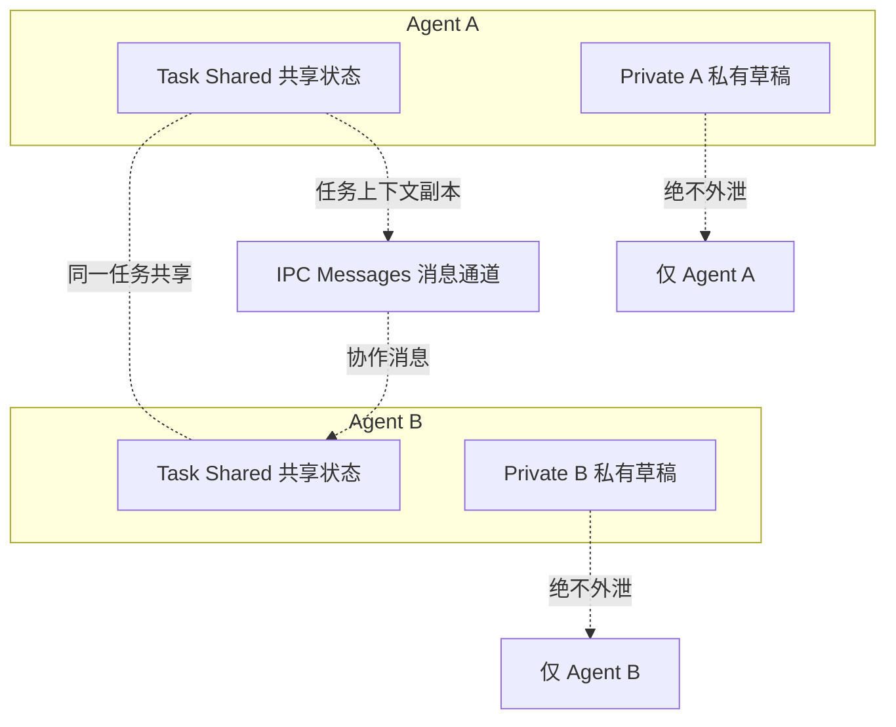
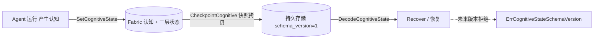

# ares 架构深度解析（二十七）：上下文管理 — 三层上下文、可检查点认知状态与 prompt 门禁（0.3.x）

> 说明：本文基于实际代码（`internal/fabric/agent/context.go` + `agent.go` 的三层上下文与 `CognitiveState`、`internal/llm` 的 `maxPromptLength` prompt 长度门禁、`internal/runtime/memory` 的会话记忆），是 docs 系列中上下文管理层的专门篇。

## 一、为什么上下文管理是 Agent 的命门

LLM 的 context window 是硬约束：Agent 每轮对话都会累积历史，工具调用结果动辄几百上千 token，几十轮下来很容易击穿窗口。ARES 没有把"把所有东西塞进窗口"当作策略，而是用几条**相互独立、各管一段**的真实机制守住预算，它们分别落在三层里：

| 层次 | 真实机制 | 位置 | 管什么 |
|------|----------|------|--------|
| ① 认知状态层 | 三层上下文隔离（Task Shared / Agent Private / IPC） | `internal/fabric/agent/context.go` | 谁能看到什么，私有不外泄 |
| ② 持久化层 | 版本化 `CognitiveState` + 可检查点 | `internal/fabric/agent/agent.go` / `context.go` | 只持久化可检查点状态，不依赖隐藏 CoT |
| ③ 会话层 | 会话记忆（TTL / LRU / 结构化消息） | `internal/runtime/memory` | 历史如何被组织、保留与清理 |
| ④ 调用层 | `maxPromptLength` 硬门禁 | `internal/llm` | 过长的 prompt 在 LLM 调用前直接拒绝 |

## 二、三层上下文：Task Shared / Agent Private / IPC

`internal/fabric/agent/context.go` 定义了对隔离的硬性要求（design §13：Context three layers，不要共用一个大脑）：`ContextLayer` 枚举三档：

```go
type ContextLayer int

const (
    ContextTaskShared ContextLayer = iota // 共享任务状态：目标/约束/产物/决策/依赖/检查点，所有 Agent 必须可见
    ContextAgentPrivate                    // Agent 私有状态：推理/观测/假设/草稿；绝不外泄
    ContextIPC                             // Agent 间消息通道；由 IPC 支柱（P4）承载，本层是存储面
)
```

Fabric 提供读写入口并**以"深拷贝"保证隔离**：

- `SetTaskContext` / `TaskContext`：绑定时给 Agent 一份任务的 Task Shared State 副本，Agent 永远改不到调用方的 map。
- `SetPrivate` / `Private`：私有草稿层，**绝不泄漏到 Task Shared State 或其它 Agent**（§13 不变量 #5/6）。
- `ContextView`：只读快照，把 `TaskShared` 与 `Private` 一起取出，正是为了验证"私有不从 Task 泄漏"。

区分 **Fabric 存什么**：`agent.go` 的 `Agent` 只持有 `taskContext` 与 `privateContext`；IPC 层不落在 Fabric，而是由 `internal/agentipc` 的 `Message` / `Bus` 承载（即上一篇的 peer 消息总线）。



## 三、CognitiveState：版本化、可检查点

Agent 的"认知内容"被显式建模为 `internal/fabric/agent/agent.go` 的 `CognitiveState`——它是**可独立持久化**的状态，Runtime **不依赖隐藏的 chain-of-thought**，只依赖这份持久状态（§13 不变量 #5）：

```go
const CognitiveStateSchemaVersion = 1

type CognitiveState struct {
    SchemaVersion int   // 结构版本；0 = legacy（pre-A2），DecodeCognitiveState 允许兼容
    Context       any   // 活跃推理上下文（任务目标 + 约束）
    Observation   any   // 来自环境/工具的最新观测
    WorkingMemory any   // 中间推理草稿
    Decision      any   // 当前决策/假设
    ToolState     any   // 活动工具状态（打开的文件、连接…）
    Checkpoint    any   // 持久进度指针（执行 Task 时关联 taskfabric Checkpoint）
}
```

配套的版本化编解码与持久化（`context.go`）：

- `SetCognitiveState`：写入；`SchemaVersion==0` 的 legacy 状态在边界处被升级为当前版本，保证每条落库状态都带版本。
- `DecodeCognitiveState`：单一路径解码。对原生结构、`map[string]any`（JSON 往返后）与 nil 都能处理；**遇到未来版本返回 `ErrCognitiveStateSchemaVersion`**，拒绝静默误读，调用方须迁移或拒绝恢复。
- `CheckpointCognitive`：返回认知快照用于持久存储——返回的是拷贝，改它不影响存活 Agent。



## 四、会话记忆：历史如何保留与回收

LLM 输入要带上的历史来自 `internal/runtime/memory` 的会话记忆。核心实现是 `internal/runtime/memory/context/session.go` 的 `SessionMemory`：

- **有界 + TTL**：`NewSessionMemory(maxSize, ttl)`，超过 `maxSize` 时 `evictOldest`（按 `AccessedAt` LRU 驱逐最旧会话）；后台 `Cleanup` 任务按半个 TTL 周期扫描，把超过 `ttl` 未访问（`now - AccessedAt > ttl`）的会话清除。
- **深拷贝返回**：`Get` / `GetMessages` 返回副本，调用方改不到内部 session 状态。
- **原生消息结构**：`Message` 携带 `TurnID`、`ToolCallID`、`ToolCalls`、`EventKind`、`ParentID`、`ArtifactRefs`——一轮对话的结构元数据被保留，供 turn-aware 的消费方使用。

对外统一接口 `MemoryManager`（`manager.go`）暴露 `CreateSession` / `AddMessage` / `AddStructuredMessage`（带 TurnID 等元数据）/ `GetMessages` / `BuildPromptMessages` / `DeleteSession`，以及 `GetLatestSessionForAgent`（从检查点取 Agent 最近会话；不持久化检查点的后端返回 `ErrAgentCheckpointNotSupported`）。配置面由 `MemoryConfig` 对齐：`MaxHistory`（保留的最大轮数）、`SessionTTL`、`MaxSessions`，默认值见 `DefaultMemoryConfig()`。

> 注：会话记忆管的是"历史怎么留、留多少、多久淘汰"，但它本身**不做 token 削减**——真正的硬门禁在下一节的 prompt 长度校验。两者是独立防线。

## 五、maxPromptLength：LLM 调用前的最后一道硬门禁

`internal/llm` 在把 prompt 提交给 provider 之前做一次**显式的长度校验**（`generate.go`）：

```go
// 默认上限：8192（internal/llm/client.go）
const maxPromptLength = 8192

// 配置面：config.MaxPromptLength（yaml: max_prompt_length，0 = 用默认值）
func (c *Client) promptMaxLength() int {
    if c.config != nil && c.config.MaxPromptLength > 0 {
        return c.config.MaxPromptLength
    }
    return maxPromptLength
}

// 校验：数的是 rune（utf8.RuneCountInString），不是字节——
// CJK 等多字节字符不会因字节数误被判越界（M8）。
if utf8.RuneCountInString(prompt) > c.promptMaxLength() {
    return fmt.Errorf("prompt exceeds maximum length of %d characters", c.promptMaxLength())
}
```

要点：这是**前置守卫**——超限的 prompt 在到达 provider 前就被拒绝，而不是硬塞进窗口后靠 provider 截断。它不等于"压缩"；真正控制历史体积的是第二节、第三节与第四节（三层隔离限制可见范围、检查点状态天然是"最精简的心智模型"、会话留白由 TTL/轮数约束）。

## 六、总结

| 防线 | 机制 | 度量 / 保证 |
|------|------|-------------|
| 三层隔离 | `ContextLayer` Task Shared / Agent Private / IPC | 私有永不外泄（`ContextView` 可验证） |
| 认知可检查点 | `CognitiveState` + `SchemaVersion` | 只持久化可检查点状态；未来版本拒绝 |
| 会话记忆 | `SessionMemory`（TTL + LRU + 结构化 `Message`） | 历史有界、留白、可整体访问 |
| prompt 门禁 | `maxPromptLength`（默认 8192，按 rune） | 超限在 LLM 调用前拒绝 |

**设计主线：上下文管理不是一个"万能裁剪器"，而是四条独立、正交、每一条都可单独验证的防线——隔离决定谁看到什么，可检查点决定持久化最小集，会话记忆决定历史形态，prompt 门禁兜底长度边界。** 它们合起来让 Agent 的"历史 + 工具往返 + 各自可见状态"在有限窗口里被显式地预算管理，而不是推给 provider 做隐式截断。