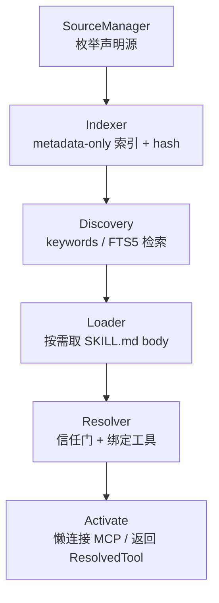
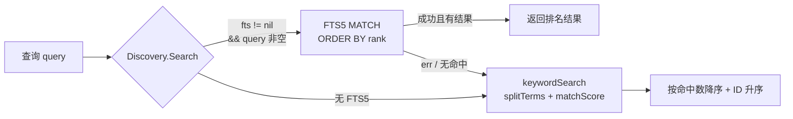
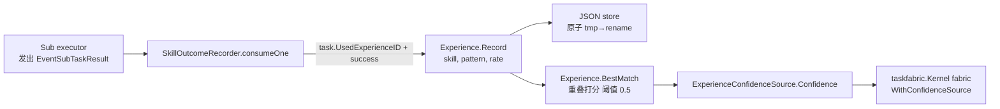
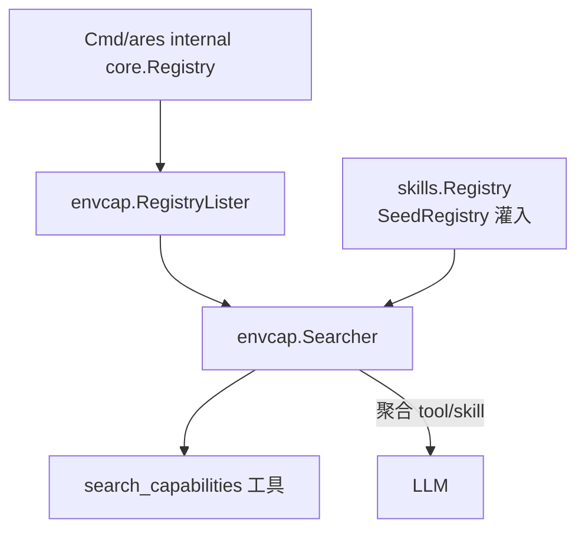

# ares 架构深度解析（二十八）：Skills 发现 — 不扫盘的能力目录（0.3.x）

> 0.3.x 更新：Skills 发现落地为代码仓内 `internal/runtime/protocol/skills` 的 **Capability Fabric**——框架原生的技能发现、索引、加载系统。`Catalog` 门面 + `SourceManager` 聚合四类声明源（project / user / registered / experience，其中 registered 又分 directory、git、http/oci 三类）。`CatalogTools` 暴露五件 catalog 工具（skill_search/load/activate/list/experience）。`ExperienceConfidenceSource` 把学习先验桥接为 `taskfabric.ConfidenceSource`，喂给 Kernel Scheduler 的 fabric。

> 说明：本文基于实际代码（`internal/runtime/protocol/skills` 全部实现：source.go / indexer.go / discovery.go / resolver.go / loader.go / experience.go / experience_store.go / experience_confidence.go / outcome_recorder.go / git_source.go / http_source.go / changes.go / config.go / tools.go / types.go / fts5.go / catalog.go），是 docs 系列中 Capability Fabric 发现链路的专门篇。

## 一、Skills 发现：从"找"到"声明"

传统工具发现是**扫盘**：`find /`、扫 PATH、探测 executable——寻找"可能存在的东西"。ARES 的 Capability Fabric 反其道而行（`types.go` 包注释设计支柱 ①）：

> **只扫"声明过的 Source"，不扫盘。** 只发现"被声明的东西"，不寻找"可能存在的东西"。

发现链路是一条五段管线（`types.go` 设计支柱 ④：内容渐进披露——metadata → SKILL.md body → references）：



- **Indexer** 只产出 Level-0 metadata 条目，绝不读 body；
- **Loader / Resolver / Activate** 都只在命中后按需动作（Level-1 / Level-2）。

## 二、SourceManager：只认识声明出来的源

`internal/runtime/protocol/skills/source.go` 的 `SourceManager` 永不扫整盘或 PATH——只枚举明确声明的目录根，且 `SkillDirs` 每个根只往下读**一层**子目录，还要 `hasDeclaredMarker` 校验目录内含 `SKILL.md` 或 `skill.yaml` 才计入 skill。**声明验证，绝非深递归扫描**；`SkillDirs` 对声明但缺失的根返回空集而非报错。

四类 `SourceKind`（`types.go`）：

| 源 | 位置 | 说明 |
|----|------|------|
| `SourceProject` | `<project>/.ares/skills/` | 项目自声明，只读 metadata **不执行 Skill** |
| `SourceUser` | `~/.ares/skills/` | 用户安装的全局能力 |
| `SourceRegistered` | `~/.ares/config.toml` `[[skill_sources]]` | 显式声明的额外目录 / git / http-oci |
| `SourceExperience` | `experience.json` 持久化的记忆先验 | 学习源，**永不自动执行** |

registered 源内部再分三类（`config.go` `LoadSkillSources`）：

| type | 解析 | 落地 |
|------|------|------|
| `""` / `"directory"` | `Path` 展开 `~` 并去重 | 进入 `RegisteredDirs`，按目录索引 |
| `"git"` | `URL` + `LocalDir` | `SyncGitSource`：缺仓库用 `git clone --depth 1` 浅克隆，已有则 `git pull --ff-only` 快进刷新到本地缓存，再以缓存目录当作 registered 源索引 |
| `"http"` / `"oci"` | `ManifestURL` | `FetchHTTPManifest` 拉取 JSON 清单，映射为 metadata-only 条目（body 留在远端，`Load` 明确报无法本地取值） |

`SkillDirs` 的关键判断（`source.go`）：

```go
// SkillDirs lists the skill subdirectories under a declared source. It reads
// exactly one level below the source root and requires a SKILL.md marker file
// (or a skill.yaml manifest) to count a directory as a skill — declaration
// only, never a deep recursive scan.
func (s *SourceManager) SkillDirs(source SourceDir) ([]string, error) {
    entries, err := os.ReadDir(source.Path)
    ...
    for _, e := range entries {
        if !e.IsDir() || strings.HasPrefix(e.Name(), ".") {
            continue
        }
        dir := filepath.Join(source.Path, e.Name())
        if hasDeclaredMarker(dir) {
            dirs = append(dirs, dir)
        }
    }
    sort.Strings(dirs)
    return dirs, nil
}
```

## 三、Indexer：只存 metadata，不读 body

`internal/runtime/protocol/skills/indexer.go` 的 `Indexer.Index` 遍历声明源产出一个 `SkillIndexEntry`（`types.go`，Level-0 渐进披露）：

```go
// SkillIndexEntry is the metadata-only index record (Level 0 of progressive
// disclosure). The SKILL.md body is deliberately NOT loaded here so that 100
// skills cost ~100 x 100 tokens instead of 100 full instruction bodies.
type SkillIndexEntry struct {
    ID           string   // 稳定标识（如 "rust-review"）
    Name         string   // 人类可读名
    Description  string   // 常驻一句话摘要
    Keywords     []string // 检索关键词
    Source       SourceKind // project | user | registered | experience
    Path         string   // 技能目录
    Version      string   // manifest 版本
    Capabilities []string // 能力标签
    ToolTypes    []string // 声明的工具类型（来自 manifest）
    Hash         string   // 内容 hash，变更检测
}
```

- **front matter + manifest 合并**（`indexOne`）：`SKILL.md` 的 `---` front matter（经 `parseFrontMatter` 解析 name/description/keywords/version/capabilities）与 `skill.yaml` manifest（经 `loadManifest`）合并，**manifest 字段优先**；ID 缺省回落为目录名。
- **content hash**（`contentHash`）：对 `SKILL.md` + `skill.yaml` + `tools/` 目录条目名的确定性 SHA-256——只碰声明文件，不读 body。
- **渐进披露边界**：索引永远不含 body。100 个技能 = 100 × ~100 token 的 metadata，而非 100 份完整指令（对应 `benchmark_test.go` 的 `TestResidentMetadataTokenBudget`）。

## 四、Discovery：关键词匹配 + FTS5 回退

`internal/runtime/protocol/skills/discovery.go` 的 `Discovery` 只检索 Level-0 metadata：

- **关键词匹配**（`keywordSearch`）：`splitTerms` 小写+空白切词 → `matchScore` 对 ID/name/keywords/capabilities/description 计数命中 → 命中数降序 + ID 升序（确定性）。
- **FTS5 全文检索**（`fts5.go`）：`NewFTS5Index` 在**内存 SQLite FTS5 虚拟表**上建索引（`modernc.org/sqlite`，无 CGO），覆盖 id/name/description/keywords，`ORDER BY rank` 排序；通过 rowid↔条目下标映射回原条目。
- **优雅回退**：`Discovery.Search` 优先进 FTS5，查询不安全/失败/FTS5 不可用时**静默回退到关键词匹配**（`swapIndex` 里 FTS5 构建失败也降级，调用方无感知）：



## 五、Loader / Resolver：按需披露 + 信任门

- **Loader**（`loader.go`）：`Load(id)` 返回完整 `SKILL.md` body（Level-1，按需）；`ListReferences`/`LoadReference` 管理 `references/` 目录（Level-2）。`LoadReference` 做**路径穿越防护**：拒绝含 `/`、`\` 或 `..` 的引用名。远端 skill（Path 为 URL）本地无法取值时报清晰错误，而非从 CWD 误读。未知 ID 返回哨兵 `ErrSkillNotFound`。
- **Resolver**（`resolver.go`）：把 manifest 的 `tools` 声明（`ToolDecl`：id/type/command/args/server/name）经 `trustForSource` 判断的信任层级绑定为 `ResolvedTool{ID,Kind,Target,Args}`：

| `ToolKind` | 信任 / 声明条件 |
|------------|----------------|
| `ToolBuiltin` | `Name` 必须在内置工具名单（`CatalogConfig.Builtins`） |
| `ToolMCP` | 只需声明 `Server` 名——连接留给 `Activate` 懒加载 |
| `ToolExecutable` | 源信任层级 ≠ `TrustUntrusted` 且 `AllowLocalExecutables` 开启；`executableExists` 只做 **LookPath / 存在性声明验证，不扫盘** |

信任层级（`trustForSource`）：`SourceProject`/`SourceUser` → `TrustAllowed`，`SourceRegistered` → `TrustAsk`，其余（experience/external）→ `TrustUntrusted`。未通过信任门返回 `ErrToolUntrusted`。

**Design ≠ Permission**（`types.go` 支柱 ⑤）：learned / external 源可被索引到，但**不可自动执行**。

## 六、Experience：学习源不"生成"Skill

`internal/runtime/protocol/skills/experience.go` 的 `Experience` 记录 `{skill, task_pattern, success_rate}` 相关度**先验**（`types.go`：

```go
type ExperienceRecord struct {
    Skill       string  // 技能 ID，如 "pdf-generation"
    TaskPattern string  // 任务模式，如 "document-to-pdf"
    SuccessRate float64 // 观察到的成功率 0-1
}
```

- **不是 LLM 生成 Skill**——只记录"哪个 skill 对哪个任务模式成功率高"；`BestMatch` 按关键词重叠打分（短模式走子串包含，长模式走 `patternMatchScore` 令牌重叠比，低于 `matchScoreThreshold = 0.5` 不判命中）。
- **有界 + 可持久化**：`NewExperience` 上限 `maxRecords = 1000`（超限丢最老）；`taskPattern` 经 `capPatternLength` 截到 `maxPatternLength = 256` runes（与 outcome recorder 共享同一常量）。`Record` 同 (skill, pattern) 覆盖 success_rate。
- **JSON 持久化**（`experience_store.go`）：`JSONExperienceStore.Save` 原子写（`tmp → rename`，目录 0700、文件 0600）。生产路径该文件默认在 `~/.ares/experience.json`（`skills_wiring.go` 组装）。
- **闭环观察**（`outcome_recorder.go`）：`SkillOutcomeRecorder.Start` 订阅 `EventSubTaskResult` 事件流（只读观察者）→ `consumeOne` 读 `task.UsedExperienceID` + `success/失败` → `skillTaskPattern`（优先 `task_desc`，回退 AgentType / subAgentID / `"default"`）→ `Experience.Record(skill, pattern, rate)`。录制是 best-effort，绝不影响任务路径；事件里没有 skill 关联就 `skipped`（离线模式 nil store 为 no-op）。



- **桥到调度器**（`experience_confidence.go`）：`ExperienceConfidenceSource` 以编译期断言实现 `taskfabric.ConfidenceSource`（`var _ taskfabric.ConfidenceSource = (*ExperienceConfidenceSource)(nil)`），`Confidence(taskPattern)` 返回最佳先验的 success_rate（无先验返回 0）。接线在 `cmd/ares/peer_mode.go`：`resolveExperienceConfidence` 用 `catalog.Experience()` 构造后 `kernel.fabric = kernel.fabric.WithConfidenceSource(expSrc)`——调度 fit 的 Confidence 由真实学习先验（而非常量）驱动，与 SKILL-first 定位呼应。

## 七、Catalog 门面：一条链的封装

`internal/runtime/protocol/skills/catalog.go` 的 `Catalog` 组合全部组件：

```go
func (c *Catalog) Build() error          // 索引全部声明源（git 先 sync、http 拉清单）
func (c *Catalog) Search(q string, n int) []SkillIndexEntry  // Level-0 检索
func (c *Catalog) Load(id string) (string, error)            // Level-1 按需 body
func (c *Catalog) ResolveTools(id string) ([]ResolvedTool, error) // 信任门绑定
func (c *Catalog) Activate(ctx, id string) ([]ResolvedTool, error) // 懒连接 MCP
func (c *Catalog) Refresh() (IndexChange, error)             // hash 增量重索引
func (c *Catalog) SeedRegistry(reg *skills.Registry) error   // 灌入 memoryManager 常驻块
```

- **并发安全**：`sync.RWMutex` 保护 `swapIndex`（Build/Refresh 写锁 + 原子替换；Search/Load/All/Count 读锁）。`swapIndex` 先关旧 FTS5 句柄、重建新 FTS5、换 discovery/loader 视图、重 seed registry——构建失败降级为纯关键词。
- **懒连接**：`SetMCPConnector` 挂载 `MCPConnector`（`ConnectServer(ctx, name)`，`ares_mcp.MCPManager` 满足）；`Activate` 只在激活时连接声明的 MCP server（设计支柱 ③：**激活前绝不连接任何 MCP**）。没挂 connector 时 MCP 工具只回落为描述符。
- **Refresh 与 Build 语义对齐**：重 sync git（先超时 2 分钟，不受索引写锁阻塞）、重拉 http 清单、`DetectIndexChanges` 按 (Source, ID, Hash) 分 `Added/Modified/Removed`、关旧 FTS5 + 重建 + 重 seed registry。请注意：目前生产接线是**启动期一次 Build**（见下节），`Refresh` 是实现好的按需重索引路径，代码注释提及它服务于 listChanged 触发的场景，但框架没有自动把 MCP listChanged 接进 Refresh 的运行时常驻刷新循环。

## 八、生产接线

能力目录的接线**不在** `serve.go` 里一次成型，而是拆在两处：

**① 目录构建 + 常驻块**（`internal/ares_bootstrap/skills_wiring.go` 的 `wireSkills`，被 `bootstrap.go` 调用）：

1. `LoadSkillSources("")` 读默认 `~/.ares/config.toml` `[[skill_sources]]`（directory/git/http-oci）
2. `NewCatalog`：project `.ares/skills` + user `~/.ares/skills` + registered + `ExperiencePath`（`~/.ares/experience.json`）
3. `SetGitSources` / `SetHTTPSources`；挂 MCP 为 lazy connector；`SyncGitSources` 非致命（失败降级为本地检出索引）
4. `catalog.Build()` —— 启动期只建一次；失败仅告警不阻断启动
5. `SeedRegistry` 灌进 `skills.Registry` → `setter.SetSkillsRegistry(reg)` 挂到 memoryManager 常驻 "Available skills" 块
6. `bootstrap.go` 再 `NewSkillOutcomeRecorder(catalog).Start(ctx, comp.EventStore)` 开启结果闭环

**② 工具暴露**（`cmd/ares/serve.go` / `tools.go`）：

- `catalog.Build()` 成功后，`serve.go` 遍历 `ares_skills.CatalogTools(comp.SkillCatalog)` 注册**五件套**（`tools.go`）：`skill_search`（搜 metadata）、`skill_load`（取 body）、`skill_activate`（解析 + 懒连 MCP + 附 references）、`skill_list`（全量列表）、`skill_experience`（查最佳先验，只读）。
- `registerCapabilitySearch`（`tools.go`）把 `envcap.NewSearcher(envcap.NewRegistryLister(internalReg), skillReg, nil)` 包装为 **`search_capabilities`** 工具注册进内部 registry——统一检索"注册工具 + skills"（native 命令已由 `registerNativeTools` 以 `KindTool` 预注册进同一 registry，故不再单独传 `Discoverer`，避免重复探测）。
- 技能/工具绑定进 Agent 运行时是经内部 `core.Registry` + `newToolBinder`（`BridgeFromRegistry`），`agentsyscall.BindTools` 绑的是 `spawn_agent`/`create_task` 等 peer 原语、**不负责 skill**——本文主线不依赖它。

### 8.1 envcap 统一检索桥接（tools/skills 聚合）

`internal/tools/envcap/envcap.go` 的 `Searcher` 提供一个统一环境检索入口：

```go
type Searcher struct {
    tools  ToolLister               // 已注册工具（builtin + MCP）
    skills *skills.Registry         // catalog 经 SeedRegistry 灌入
    cmds   *discovery.Discoverer    // 本机命令 allowlist（可为 nil）
}
```

- **桥接**：`catalog.SeedRegistry(reg)` 把 skills 索引灌进 `*skills.Registry`，再由 `serve.go` 构造 `envcap.NewSearcher(...)`——catalog 成为 envcap 的技能源（`TestCatalogSeedsEnvcapAggregation` 守护）。
- **聚合排序**：`Search` 返回 `Capability{Kind, Name, Description}`，按 `kindRank`（tool < skill < command）+ name 升序稳定排序。



## 九、总结

| 组件 | 职责 | 设计支柱 |
|------|------|----------|
| SourceManager | 声明源枚举（directory/git/http-oci） | ① 不扫盘、只读一层+marker |
| Indexer | metadata-only 索引 + SHA-256 hash | ④ Level-0 渐进披露 |
| Discovery | 关键词 + FTS5（回退） | ④ 只给 LLM metadata |
| Loader | 按需 body / references（穿防护） | ④ Level-1/2 |
| Resolver | 信任门绑定工具（builtin/mcp/executable） | ⑤ 发现 ≠ 执行 |
| Experience | 学习先验（有界、可持久化） | ⑤ learned 永不自动执行 |
| ExperienceConfidenceSource | 适配 taskfabric.ConfidenceSource | 先验喂调度器 |
| Catalog | 门面 + Swap + Refresh + Activate | ② Skill ≠ Tool |
| envcap.Searcher | 统一 tool/skill 检索 | 渐进披露第二半 |

**发现链路的主线：把"能力管理"从运行时扫盘变成启动期索引。** 与上下文管理篇的 `ContextCleaner` / memoryManager 常驻块闭环——metadata 常驻、body 按需，让 Agent 出生即带能力底座。

### 9.1 基准与验证（无伪造数字）

`internal/runtime/protocol/skills/benchmark_test.go` 定义了 100-skill 场景的基准与断言，**但代码中没有写入具体毫秒/微秒实测值**（那是运行环境相关的口径，原文档的一串选定数字并非代码常数，应如实弃掉）：

| 基准 / 测试 | 度量什么 | 代码中的断言 |
|------|------|------|
| `BenchmarkCatalogBuild100Skills` | 100 skills metadata 索引（Level-0，零扫盘）计时 | 无固定基准值 |
| `BenchmarkCatalogSearch100Skills` | `fts5-hit` 与 `keyword-fallback` 两个子场景的检索计时 + allocs | 无固定基准值 |
| `BenchmarkExperienceBestMatch100` | 100 条先验的 BestMatch 计时 + allocs | 无固定基准值 |
| `TestResidentMetadataTokenBudget` | 渐进披露承诺 | 断言常驻块（name+description 拼接）估算 token ≤ 20k（≈100 skills ≈ ~10k token 目标），且**绝不含 `## When to use` body 内容** |

即：benchmark 只“定义并守护渐进披露的行为约束”，不伪造具体性能数字；真正硬性验证的是“**常驻块永远只含 metadata、永不掺入 SKILL.md body**”。