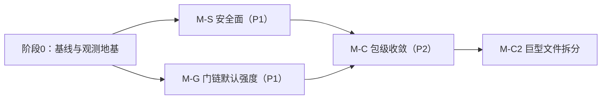

# 评审跟进计划：门链默认强度 · 安全面 · 包级收敛

> 来源：ARCHITECTURE_REVIEW_MERMAID.md（2026-09-09 全库评审）三大 P1/P2 发现的整改计划。
> 验收纪律沿用项目惯例：**每步 = build + vet + golangci-lint + test 全绿**；涉及删除的追加 grep 全仓引用清零；涉及 cmd/ares 文件数变化的同步 freeze-manifest。
> 顺序原则：安全先行（暴露面风险最高）→ 门链（设计打折最伤公信力）→ 收敛（结构性债务，动作最大需前置设计）。

---

## 阶段 0 — 基线与观测地基（前置，0.5 天）

目的：后面所有"默认行为变更"必须先可被观测，否则收紧门链会制造静默失败。

1. **门链结果可观测**：lifecycle.Submit 门链每门的判定（pass/reject/**skipped+原因**）打结构化日志 + Prometheus 计数（`ares_evolution/gate_decisions_total{gate,result}`）。promote 时输出一行汇总："G1 pass, G2 pass, G3 skipped(strict=false), G4 skipped(not armed)"。
2. **控制面清单化**：从 agent.go 手写 switch 抽出端点注册表（路径+方法+是否需鉴权），作为 M-S1 的工作清单和防漏鉴权的静态检查输入。
3. 建验收基线分支 tag（如 `review/baseline-20260909`），每个里程碑独立 commit 可单独 revert。

---

## M-S 安全面（P1，1.5–2 天）

### S1. introspect 面板收口（0.5 天）
- 默认 `bind 127.0.0.1`（现状：仅注释声明 trusted operators only）；配置项 `introspect.bind` 显式放宽才监听外部。
- 复用 `ares_security` 现有 JWT 机制加只读 token（`introspect.token`，空=仅本机 + 启动时 Warn）。
- 验收：非本机无 token 访问 → 401；启动日志明确打印暴露面状态。

### S2. 控制面鉴权中间件化（1 天）
- 以阶段 0 的端点注册表驱动：手写路由 switch 改为「注册表 + 统一 AuthMiddleware 分发」，**此步只换分发骨架，不拆文件、不动业务函数**（文件拆分放 M-C2，避免与 freeze-manifest 纠缠）。
- 每个端点在注册表显式声明鉴权级别（JWT / 本机 only / 公开），消灭"新增端点漏鉴权分支"这类结构性风险。
- 验收：注册表覆盖全部现有端点（diff 对照零丢失）；golangci-lint 0 issues；serve_e2e / actions_http 测试全绿。

### S3. syscall 与控制面一致性核对（0.5 天）
- 核对 agentsyscall.Kernel 的身份/配额校验与 HTTP 面板写路径（kill/resume/chaos）是否共用同一授权源；chaos 类端点确认仅本机可达。
- 产出一页核对结论（可并入 ARCHITECTURE_REVIEW_MERMAID.md §6 勾销）。

---

## M-G 门链默认强度（P1，1–1.5 天）

原则：**不发明新门，把已建好的门从"默认打折"提到"默认可信"**；一切变更 fail-loud，不做静默放行。

### G1. EvalGate 严格化（0.5 天）
- `StrictMode` 默认 false → **生产默认 true**：基础设施缺失（无 suite/无 LLM client）时 fail-closed 拒绝 promote，与 G2 shadow 门的 errRegressionGateNotConfigured/errEvalGate sentinel 模式对齐。
- 保留显式逃生口：`evolution.gates.eval_strict=false` 且启动时 Warn（"promote 门链降级为 G1+G2"）。
- 配套：`bootstrap fail-closed` 语义统一——armed 但缺配置 = 启动报错，而不是运行时放行（现状 G3 与 G4 行为不一致，本次拉齐）。

### G2. Arena 回归门从 opt-in 改为默认 armed（0.5 天）
- 有 eval_suite + LLM client 时默认开启（现状 regression_enabled 默认关）；显式关闭时同样启动 Warn + 阶段 0 汇总日志可见。
- 成本控制已内建（仅显著回退拒绝 + 自适应提前停止 + 并发上限 15），默认开启的增量成本 = 每 candidate 2×runs，可接受；文档写明预算。
- 验收：默认配置下 promote 路径四门齐上（或明确 fail-closed）；闭环测试补一条"默认配置→四门全过才 SetActive"。

### G3. 文档与默认值对账（0.5 天）
- ARCHITECTURE.md / configs/*.yaml 样例 / README 同步新默认；RUNTIME.md §5 顺带修事件总线"未接线"自相矛盾行。

---

## M-C 包级收敛（P2，分两批，3–5 天）

### C1. 边界显式化与碎片收拢（2–3 天）

> 尊重 ARCHITECTURE.md 高风险事项 #3：**双 evolution 包分层保留、不合并**。本计划的对策是消歧而非合并。

1. **双 evolution 消歧**（不动结构）：
   - 包内 doc.go 顶部加互指的"读我先"边界声明（v1=运行时接线层，v2=GA 引擎层，promote 信任根=v1 lifecycle gates，v2 coordinator 只出 patch 不 promote）；
   - 两条 promote 路径的**信任根划界**：v2 CandidatePipeline 的 SetStable 路径要么显式走 v1 门链，要么在代码层标注并加测试锁定"仅用于非生产 profile"——消除信任根漂移；
   - lint 约定：import 两包必须带别名（evolutionwiring / evolutionengine），golangci 自定义规则或 review checklist。
2. **ares_\* 碎片普查**（半天产出决策表）：对 40+ 个 ares_\* 包逐一定性——保留 / 并入宿主（如 ares_ctxutil、scoreutil、truncate 类工具并入 kernel 或公共 utils）/ 下葬。产出 `plan/ares-package-consolidation.md` 决策表，先决策后动手，删除批次沿用 M3/M5 的"独立 commit + grep 清零"纪律。
3. **runtime 插件半闭环二选一决策**（每项半天）：
   - CapCheckpoint/CapMemory/CapEvolution + router_memory：要么找到生产消费者接线，要么删除 LoopPlugin 的服务发现空转（保留 LoopPlugin 时钟本身）；
   - 决策标准：M4/M5 之后是否已有替代路径（如 memory 已由 retriever_wiring 接线）——有替代即删。
4. **compat/ 下葬执行**：doc.go 已自证零生产读者，按既定日落政策排期 0.4.x release note；本计划内先删 `api/discovery|evolution`（无内部消费者）验证删除流程。

### C2. 巨型文件拆分（1–2 天，最后做）
- `cmd/ares/agent.go`（2804 行）：以 M-S2 的端点注册表为骨架按域拆（agents 面 / chaos 面 / mcp 面 / cost 面），**拆分只移动不改逻辑**；同步更新 freeze-manifest（文件数锚点）。
- `cmd/ares/serve.go` runServe：按装配段抽函数（eventstore→bootstrap→peers→kernel→HTTP），保持单文件也可，目标是每段 ≤80 行可单独测试。
- 验收：345+ 顶层符号零丢失（沿用 Phase 4 的 diff 验证法）；每拆一个文件独立 commit，bisectability 保持。

---

## 风险与回滚

| 风险 | 缓解 |
|---|---|
| G1/G2 收紧后存量部署 promote 全被拒（配置没跟上） | 启动 Warn + 门链汇总日志先行（阶段 0 先行落地，观测一两天再收紧默认值）；每项独立 commit 可 revert |
| S2 换分发骨架引入鉴权回归 | 注册表 diff 对照零丢失 + http 测试全绿；骨架与业务函数分离，revert 不连坐 |
| 包删除误伤（隐藏反射/测试引用） | 沿用删除纪律：grep 全仓清零 + 独立 commit；freeze-manifest 同步 |
| freeze-check 锚点失效 | C2 每步更新 scripts/check_convergence_freeze.sh 依赖的 manifest |

## 明确不动项

- `workflow/engine/`（高风险事项 #1）、双 evolution 包合并（高风险事项 #3，本计划只消歧）。
- 不引入新外部依赖（JWT/限流/指标全部用现有 ares_security / prometheus 基建）。
- 不改 L2 主线执行路径与 Task Fabric 状态机语义。

## 建议排期

| 里程碑 | 工作量 | 独立可交付 |
|---|---|---|
| 阶段 0 | 0.5 天 | ✅ 纯观测，零行为变更 |
| M-S | 1.5–2 天 | ✅ 安全面闭环，P1 勾销 |
| M-G | 1–1.5 天 | ✅ 默认强度对齐架构，P1 勾销 |
| M-C1 | 2–3 天 | 决策表+删除批次可分批 |
| M-C2 | 1–2 天 | 依赖 M-S2 注册表 |

总计约 **6–9 个工作日**；M-C1 的普查决策表可与 M-S/M-G 并行起草（只读不冲突）。
